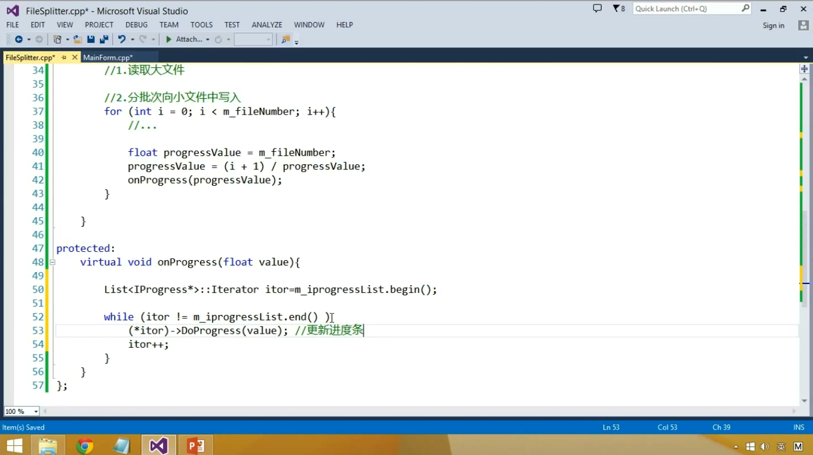
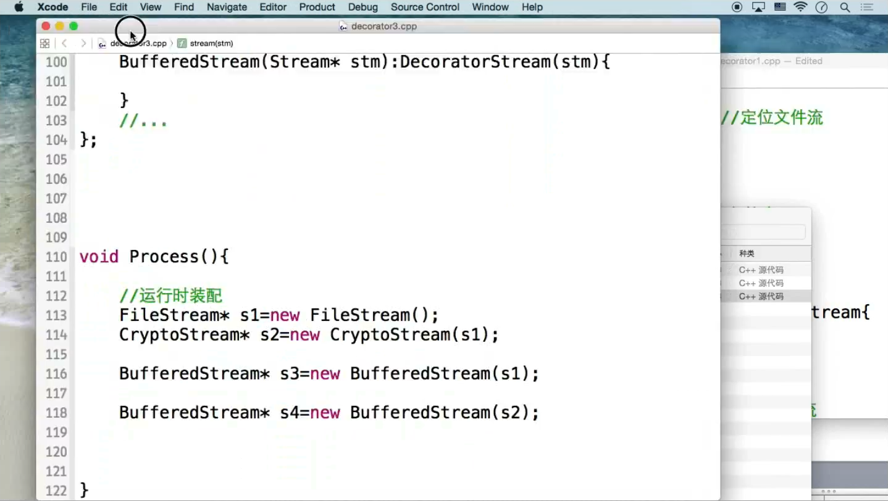

# 1.设计模式简介

如何处理复杂性？

分解 x

抽象 √   -------》 复用

## 模式分类！

**从目的来看：**

+ 创建型
+ 结构型
+ 行为型

从范围看：

+ 类模式处理类与子类的静态关系
+ 对象模式处理对象间的动态关系

**从封装变化角度：**

1.组件协作：

+ Template Method 模板方法
+ Strategy 策略模式
+ Observer / Event 观察者模式/事件模式

2.单一职责：

+ Decorator 装饰模式
+ Bridge

3.对象创建：

+ Factory Method
+ Abstract factory
+ Prototype
+ Builder

4.对象性能：

+ Singleton
+ Flyweight

5.接口隔离

+ Facade
+ Proxy
+ Mediator
+ Adapter

6.状态变化

+ Memento
+ State

7.数据结构

+ Composite
+ Iterator
+ Chain of  Resposibility

8.行为变化

- Command
- Visitor

9.领域问题

+ Interpreter

## 重构获得模式 Refactoring to Patterns

设计模式的应用不宜先入为主。

一上来就使用设计模式是对设计模式最大的误用。

没有一步到位的设计模式。

设计模式的要点是“寻找变化点”，然后变化点处应用设计模式。

什么时候、什么地方应用设计模式比设计模式结构本身更为重要。

重构----------------->模式

 ## 重构关键技法

静态 ---> 动态

早绑定 ---> 晚绑定

继承 ---> 组合

编译时依赖 ---> 运行时依赖

紧耦合 ---> 松耦合

----

# 2.面向对象设计原则

软件设计最大的特点：变化

## 面向对象

优势：抵御变化、隔离变化

从概念上，对象是某种拥有责任的抽象。

## 设计原则

好的面向对象设计：满足“应对变化，提高复用”。

**设计原则比模式更重要，设计原则-------》设计模式**

#### 1.依赖倒置原则(DIP)

+ 高层模块(稳定)不应该依赖于低层模块(变化)，他们都应该依赖于抽象(稳定)。
+ 抽象(稳定)不应该依赖于实现细节(变化)，实现细节应该依赖于抽象(稳定)。

#### 2.开放封闭原则(OCP)

+ 对扩展开放，对更改封闭。
+ 类模块应该是可扩展的，但是不可修改。

#### 3.单一职责原则(SRP)

+ 一个类应该仅有一个引起它变化的原因。
+ 变化的方向隐含着类的责任。

#### 4.Liskov替换原则(LSP)

+ 子类必须能替换他们的基类(IS-A)。（在用到基类的地方，完全可以使用子类）
+ 继承表达类型抽象。

#### 5.接口隔离原则(ISP)

+ 不应该强迫客户程序依赖它们不用的方法。（没有必要就不要暴露接口）
+ 接口应该小而完备。

#### 6. 优先使用对象组合，而不是类继承

+ 继承在某种程度上破坏了封装性(父类暴露了太多的信息给子类)，子类父类耦合度较高。
+ 对象组合只需要被组合的对象有良好定义的接口，耦合度低。

#### 7.封装变化点

+ 使用封装来创建对象之间的分界层，让设计者可以在一侧进行修改，而不会对另一层产生不良的影响从而实现层次间的松耦合。

#### 8. 针对接口编程，而不是针对实现编程

+ 减少系统各部分的依赖关系，实现“高内聚、松耦合”的类型设计方案

other

**！！！接口标准化！！！**

---

# “组件协作”模式:

现代软件专业分工之后的第一个结果是“框架与应用程序的划分”，“组件协作”模式通过**晚期绑定**(通过运行时多态实现)，来实现框架与应用程序之间的松耦合，是二者之间协作时常用的模式。
典型模式
• Template Method
• Strategy
• Observer / Event

# 3.模板方法

## 模板方法 Template Method

### 动机 Motivation

+ 在软件构建过程中，对于某一项任务，它常常有**稳定的整体操作结构**，但各个子步骤却有很多改变的需求，或者由于固有的原因（比如框架与应用之间的关系）而无法和任务的整体结构同时实现。
+ 如何在确定稳定操作结构的前提下，来灵活应对各个子步骤的变化或者晚期实现需求？（多态）

### 模式定义

定义一个操作中的算法的骨架(稳定)，而将一些步骤延迟(变化)到子类中。Template Method使得子类可以不改变(复用)一个算法的结构即可重定义(override 重写)该算法的某些特定步骤。   ----《设计模式》GoF

### 结构化设计流程

### 面向对象设计流程

2、4在基类中定义为（纯）虚函数，在子类中实现。

### 实例

无模式：

模板方法：

### 要点总结

+ Template Method模式是一种非常基础性的设计模式，在面向对象系统中有着大量的应用。它用最简洁的机制（虚函数的多态性）为很多应用程序框架提供了灵活的扩展点，是代码复用方面的基本实现结构。
+ 除了可以灵活应对子步骤的变化外，“不要调用我，让我来调用你”的反向控制结构是Template Method的典型应用。
+ 在具体实现方面，被Template Method调用的虚方法可以具有实现，也可以没有任何实现（抽象方法、纯虚方法），但一般推荐将它们设置为protected方法。

---

# 4.策略模式

## 动机

+ 在软件构建过程中，某些对象使用的算法可能多种多样，经常改变，如果将这些算法都编码到对象中，将会使对象变得异常复杂；而且有时候支持不使用的算法也是一个性能负担。
+ 如何在运行时根据需要透明地更改对象的算法？将算法与对象本身解耦，从而避免上述问题？

## 模式定义

定义一系列算法，把它们一个个封装起来，并且使它们可互相替换（变化）。该模式使得算法可独立于使用它的客户程序(稳定)而变化（扩展，子类化）。

## 结构

##  实例

无模式：

（违背了开闭原则）

strategy模式：

（实现了复用、拓展，复用的本质是复用二进制文件，而不是源代码）

## 要点总结

+ Strategy及其子类为组件提供了一系列可重用的算法，从而可以使得类型在**运行时**方便地根据需要在各个算法之间进行切换。
+ Strategy模式提供了用条件判断语句以外的另一种选择，消除条件判断语句，就是在解耦合。含有许多条件判断语句的代码通常都需要Strategy模式。
+ 如果Strategy对象没有实例变量，那么各个上下文可以共享同一个Strategy对象，从而节省对象开销。(后续单例模式)

---

# 5.观察者模式

## 动机

+ 在软件构建过程中，我们需要为某些对象建立一种“通知依赖关系” ——一个对象（目标对象）的状态发生改变，所有的依赖对象（观察者对象）都将得到通知。如果这样的依赖关系过于紧密，将使软件不能很好地抵御变化。
+ 使用面向对象技术，可以将这种依赖关系弱化，并形成一种稳定的依赖关系。从而实现软件体系结构的松耦合。

## 模式定义

定义对象间的一种一对多（变化）的依赖关系，以便当一个对象(Subject)的状态发生改变时，所有依赖于它的对象都得到通知并自动更新。是一种行为型设计模式.

## 结构

## 实例

在代码中，我们把抽象目标类和具体目标类合二为一了，简称目标类。其实抽象出来比较好，可以让具体目标类只包括自己的业务逻辑，更加清晰。

抽象目标类：可以包括下面目标类里的add remove **List** 加上额外的通知函数（如下面的onProgress）。

目标类：

抽象观察者类：

具体观察者类：（可以有多个）（继承抽象观察者类）

下面是一个窗口类（具体观察者），里面有两个观察者(progressBar和ConsoleNotifier)。

## 要点总结

+ 使用面向对象的抽象，Observer模式使得我们可以独立地改变目标与观察者，从而使二者之间的依赖关系达致松耦合。
+ 目标发送通知时，无需指定观察者，通知（可以携带通知信息作为参数）会自动传播。
+ 观察者自己决定是否需要订阅通知，目标对象对此一无所知。
+ Observer模式是基于事件的UI框架中非常常用的设计模式，也是MVC模式的一个重要组成部分。

---

# “单一职责”模式

# 装饰模式

+ 在软件组件的设计中，如果责任划分的不清晰，使用继承得到的结果往往是随着需求的变化，子类急剧膨胀，同时充斥着重复代码，这时候的关键是划清责任。
+ 典型模式
  • Decorator
  • Bridge

## 动机

+ 在某些情况下我们可能会“过度地使用继承来扩展对象的功能”，由于继承为类型引入的静态特质，使得这种扩展方式缺乏灵活性；并且随着子类的增多（扩展功能的增多），各种子类的组合（扩展功能的组合）会导致更多子类的膨胀。
+ 如何使“对象功能的扩展”能够根据需要来动态地实现？同时避免“扩展功能的增多”带来的子类膨胀问题？从而使得任何“功能扩展变化”所导致的影响将为最低？

## 模式定义

动态（组合）地给一个对象增加一些额外的职责。就增加功能而言，Decorator模式比生成子类（继承）更为灵活（消除重复代码 & 减少子类个数）。

## 结构

##  实例

不使用：

使用装饰模式：

## 要点总结

+ 通过采用组合而非继承的手法， Decorator模式实现了在运行时动态扩展对象功能的能力，而且可以根据需要扩展多个功能。避免了使用继承带来的“灵活性差”和“多子类衍生问题”。

+ Decorator类在接口上表现为is-a Component的继承关系，即Decorator类继承了Component类所具有的接口。

  但在实现上又表现为has-a Component的组合关系，即Decorator类又使用了另外一个Component类。

+ Decorator模式的目的并非解决“多子类衍生的多继承”问题，Decorator模式应用的要点在于解决“主体类在多个方向上的扩展功能”——是为“装饰”的含义。

---

