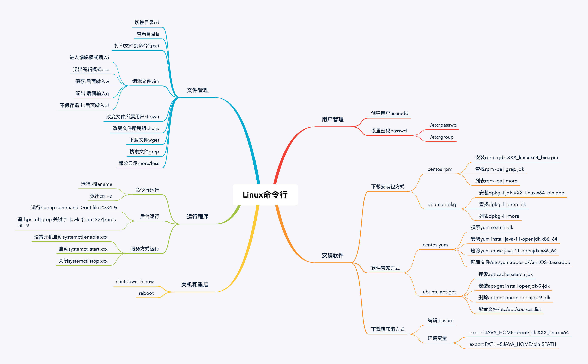

 趣谈Linux操作系统 -----2023/9/26

# 入门篇

## 为什么要学习Linux操作系统？

你可能会说，**我们大学里上过操作系统的课，而且每天都在用操作系统，为什么还要专门学一遍呢？**尽管我的操作系统课成绩不错，但是在大学的时候，我和你的看法一样，我觉得这门课没有什么用，现在回想起来可能有这样几个原因

第一，大学里普遍使用的操作系统是 Windows，老师大多也用 Windows。Windows 的优势是界面友好，很容易上手，于是我们就养成了要配置东西了就去菜单找，用鼠标点点的习惯，似乎会攒电脑、装系统、配软件就能搞定一切问题。

第二，一种操作系统对应的是一系列的软件生态，而大学里很多课程都是围绕 Windows 软件生态展开的。例如学 C++ 用的是 Vistual Studio，学数据库用的是 SQL Server，做网站用的是 IIS 等等。

第三，大学里的操作系统课往往都是纯讲理论，讲了很多原理，但是压根儿没法和平时用的 Windows 系统的行为关联起来，也根本弄不清操作系统在底层到底是怎么做的。

直到毕业之后，我加入 EMC，第一个项目就是基于 Linux 开发分布式文件系统。你能想象，只能对着一个黑框敲命令时，我心中的崩溃吗？我那时真的觉得，我大学的操作系统算是白学了。于是，我痛定思痛，开启了学习 Linux 的征程。

### 打开 Linux 操作系统这扇门，你才是合格的软件工程师

根据 2018 年 W3Techs 的数据统计，对于服务器端，Unix-Like OS 占的比例近 70%，其中 Linux 可以称得上是中流砥柱。随着移动互联网的发展，客户端基本上以 Android 和 iOS 为主。Android 是基于 Linux 内核的，因而客户端也进入了 Linux 阵营。可以说，**在编程世界中，Linux 就是主流，不会 Linux 你就会格格不入。**

那些火得不行的技术，什么云计算、虚拟化、容器、大数据、人工智能，几乎都是基于 Linux 技术的。那些牛得不行的系统，团购、电商、打车、快递，都是部署在服务端，也几乎都是基于 Linux 技术的。

所以说，如果你想进大公司，想学新技术，Linux 一定是一道绕不过去的坎。只有进入 Linux 操作系统这扇门，你才能成为合格的软件工程师。

### 研究 Linux 内核代码，你能学到数据结构与设计模式的落地实践

Linux 最大的优点就是开源。作为程序员，有了代码，啥都好办了。只要有足够的耐心，我们就可以一层一层看下去，看内核调度函数，看内存分配过程。理论理解起来不容易，但是一行行的“if-else”却不会产生歧义。

在 Linux 内核里，你会看到数据结构和算法的经典使用案例；你甚至还会看到并发情况下的保护这种复杂场景；在实践中遇到问题的时候，你可以直接参考内核中的实现。

例如，平时看起来最简单的文件操作，通过阅读 Linux 代码，你能学到从应用层、系统调用层、进程文件操作抽象层、虚拟文件系统层、具体文件系统层、缓存层、设备 I/O 层的完美分层机制，尤其是虚拟文件系统对于接入多种类型文件系统的抽象设计，在很多复杂的系统里面，这个思想都能用得上。

再如，当你写代码的时候，大部分情况下都可以使用现成的数据结构和算法库，但是有些场景对于内存的使用需要限制到很小，对于搜索的时间需要限制到很小的时候，我们需要定制化一些数据结构，这个时候内核里面这些实现就很有参考意义了。

### 了解 Linux 操作系统生态，能让你事半功倍地学会新技术

Linux 是一个生态，里面丰富多彩。很多大牛都是基于 Linux 来开发各种各样的软件。可以这么说，只要你能想象到的技术领域，几乎都能在里面找到 Linux 的身影。

数据库 MySQL、PostgreSQL，消息队列 RabbitMQ、Kafka，大数据 Hadoop、Spark，虚拟化 KVM、Openvswitch，容器 Kubernetes、Docker，这些软件都会默认提供 Linux 下的安装、使用、运维手册，都会默认先适配 Linux。

因此，在 Linux 环境下，很容易能够找到现成的工具，这不仅会让你的工作事半功倍，还能让你有亲密接触大牛思想的机会，这对于你个人的技术进步和职业发展都非常有益。

考虑到以上这些，在设计“趣谈 Linux 操作系统”专栏的时候，我主要秉承两大原则，希望能够帮你打开 Linux 操作系统这扇门。

第一个原则仍然是“**趣谈**”。我希望通过故事化的方式，将枯燥的基础知识结合某个场景，给你生动、具象地讲述出来，帮你加深理解、巩固记忆、夯实基础。

操作系统是干什么的呢？我们都知道，一台物理机上有很多硬件，最重要的就是 CPU、内存、硬盘、网络。同时，一台物理机上也要跑很多程序，这些资源应该给谁用呢？当然是大家轮着用，谁也别独占，谁也别饿着。为了完成资源分配这件事，操作系统承担了一个“大管家”的作用。它将硬件资源分配给不同的用户程序使用，并且在适当的时间将这些资源拿回来，再分配给其他的用户进程。

鉴于操作系统这个“大管家”的角色，我设计了一个故事，将各个知识点串起来，来帮助你理解和记忆。

假设，我们现在就是在做一家外包公司，我们的目标是把这家公司做上市。其中，操作系统就是这家外包公司的老板。我们把这家公司的发展阶段分为这样几个时期：

+ **初创期**：这个老板基于开放的营商环境（**x86 体系结构**），创办一家外包公司（**系统的启动**）。因为一开始没有其他员工，老板需要亲自接项目（**实模式**）。
+ **发展期**：公司慢慢做大，项目越接越多（**保护模式、多进程**），为了管理各个外包项目，建立了项目管理体系（**进程管理**）、会议室管理体系（**内存管理**）、文档资料管理系统（**文件系统**）、售前售后体系（**输入输出设备管理**）。
+ **壮大期**：公司越来越牛，开始促进内部项目的合作（**进程间通信**）和外部公司合作（**网络通信**）。
+ **集团化**：公司的业务越来越多，会成立多家子公司（**虚拟化**），或者鼓励内部创业（**容器化**），这个时候公司就变成了集团。大管家的调度能力不再局限于一家公司，而是集团公司（**Linux 集群**），从而成功上市（**从单机操作系统到数据中心操作系统**）。

第二个原则就是**图解**。Linux 操作系统中的概念非常多，数据结构也很多，流程也复杂，一般人在学习的过程中很容易迷路。所谓“一图胜千言”，我希望能够通过图的方式，将这些复杂的概念、数据结构、流程表现出来，争取用一张图串起一篇文章的知识点。最终，整个专栏下来，你如果能把这些图都掌握了，你的知识就会形成体系和连接。在此基础上再进行深入学习，就会如鱼得水、易如反掌。

例如，这张图就表示了文件操作在各个层的数据结构的关联。只要你学完之后，能对着这张图将它们之间的关系讲清楚，对于文件系统的部分，你就会了然于心了。

一段新的征途即将开始，今天就是“开学典礼”。从今天开始，在接下来的四个月时间里，我会带你一步一步进入 Linux 操作系统的大门，让基础变成你技术生涯的左膀右臂。

## 1. 入学测验：你究竟对Linux操作系统了解多少???

## 2. 学习路径：爬过这六个陡坡，你就能对Linux了如指掌

很多人觉得 Linux 操作系统刚开始学起来很难，主要是因为我们平时办公或者学习用的都是 Windows 系统，而 Windows 和 Linux 的使用模式是完全不一样的。

Windows 的基本使用模式是“**图形化界面 + 菜单**”。也就是说，无论我们做什么事情，首先要找一个图形化的界面。在这里面，“开始”菜单是统一的入口，无论是运行程序，还是做系统设置，你都能找到一个界面，界面上会有各种各样的输入框和菜单。我们只要挨个儿看过去，总能找到想操作的功能。实在不行，还有杀手锏，就是右键菜单，挨个儿一项一项看下去，最终也能实现想做的操作。

如果你刚刚上手 Linux，就会发现，情况完全不一样。你基本是这也找不着，那也找不着，觉得 Linux 十分难用，从而“从入门到放弃”。

Linux 上手难，学习曲线陡峭，所以它的学习过程更像一个爬坡模式。这些坡看起来都很陡，但是一旦爬上一阶，就会一马平川。你会惊叹 Linux 的设计之美，而 Linux 的灵活性也会使得你有 N 多种方法解决问题，从而事半功倍，你就会有一切尽在掌握的感觉。只可惜，大部分同学都停留在了山脚下。

那怎样才能掌握这项爬坡技能呢？我们首先需要明确，我们要爬哪些坡。

我总结了一下，在整个 Linux 的学习过程中，要爬的坡有六个，分别是：熟练使用 Linux 命令行、使用 Linux 进行程序设计、了解 Linux 内核机制、阅读 Linux 内核代码、实验定制 Linux 组件，以及最后落到生产实践上。以下是我为你准备的爬坡秘籍以及辅助的书单弹药。

### 第一个坡：抛弃旧的思维习惯，熟练使用 Linux 命令行

上手 Linux 的第一步，要先从 Windows 的思维习惯，切换成 Linux 的“**命令行 + 文件**”使用模式。

在 Linux 中，无论我们做什么事情，都会有相应的命令工具。虽然这些命令一般会在 bin 或者 sbin 目录下面，但是这些命令的数量太多了。如果你事先不知道该用哪个命令，很难通过枚举的方式找到。因此，在这样没有统一入口的情况下，就需要你对最基本的命令有所掌握。

一旦找到某个命令行工具，替代输入框的是各种各样的启动参数。这些参数怎么填，一般可以通过 -h / --help 查看 help，挨个儿看过去，就能找到相应的配置项；还可以通过 man 命令，查看文档。无论是什么命令行工具，最终的配置一般会落到一个文件上，只要找到了那个文件，文件中会有注释，也可以挨个儿看下去，基本就知道如何配置了。

这个过程可能非常痛苦，在没有足够熟练地掌握命令行之前，你会发现干个非常小的事情都需要搜索半天，读很多文档，即便如此还不一定能得到期望的结果。这个时候你一定不要气馁，坚持下去，继续看文档、查资料，慢慢你就会发现，大部分命令的行为模式都很像，你几乎不需要搜索就能完成大部分操作了。

恭喜你，这个时候你已经爬上第一个坡了。这个时候，你能看到一些很美丽的风景，例如一些很有技巧的命令 sed 和 awk、很神奇的正则表达式、灵活的管道和 grep、强大的 bash。你可以自动化地做一些事情了，例如处理一些数据，会比你使用 Excel 要又快又准，关键是不用框框点点，在后台就能完成一系列操作。在处理数据的同时，你还可以干别的事情，半夜处理数据，第二天早上发个邮件报告，这都是 Excel 很难做到的事情。

不过，在这个专栏里，命令行并不是我们的重点，但是考虑到一些刚起步的同学，在第一部分我会简单介绍一些能够让你快速上手 Linux 的命令行。专栏每一模块的第一节，我都会有针对性地讲解这一模块的常用命令，足够你把 Linux 用起来。

如果你想全面学习 Linux 命令，推荐你阅读**《鸟哥的 Linux 私房菜》**。如果想再深入一点，推荐你阅读**《Linux 系统管理技术手册》**。这本砖头厚的书，可以说是 Linux 运维手边必备。

### 第二个坡：通过系统调用或者 glibc，学会自己进行程序设计

命令行工具也是程序，只不过是别人写的程序。从用别人写的程序，到自己能够写程序，通过程序来操作 Linux，这是第二个要爬的坡。

用代码操作 Linux，可以直接使用 Linux 系统调用，也可以使用 glibc 的库。

Linux 的系统调用非常多，而且每个函数都非常复杂，传入的参数、返回值、调用的方式等等都有很多讲究。这里面需要掌握很多 Linux 操作系统的原理，否则你会无法理解为什么应该这样调用。

刚开始学 Linux 程序设计的时候，你会发现它比命令行复杂得多。因为你的角色再次变化，这是为啥呢？我这么说，估计你就能理解了。

**如果说使用命令行的人是吃馒头的，那写代码操作命令行的人就是做馒头的。**看着简简单单的一个馒头，可能要经过 N 个工序才能蒸出来。同样，你会发现，你平时用的一个简单的命令行，却需要 N 个系统调用组合才能完成。其中每个系统调用都要进行深入地学习、读文档、做实验。

经过一段时间的学习，你啃下了这些东西，恭喜你，又爬上了一个坡。这时候，你已经很接近操作系统的原理了，你能看到另一番风景了。大学里学的那些理论，你再回去看，现在就会开始有感觉了。你本来不理解进程树，调用了 fork，就明白了；你本来不理解进程同步机制，调用了信号量，也明白了；你本来分不清楚网络应用层和传输层的分界线，调用了 socket，都明白了。

同样，专栏的第一模块，我会简单介绍一下 Linux 有哪些系统调用，每一模块的第一节，我还会讲解这一模块的常用系统调用，以及如何编程调用这些系统调用。这样可以使你对 Linux 程序设计入个门，但是这对于实战肯定是远远不够的。如果要进一步学习 Linux 程序设计，推荐你阅读《UNIX 环境高级编程》，这本书有代码，有介绍，有原理，非常实用。

### 第三个坡：了解 Linux 内核机制，反复研习重点突破

当你已经会使用代码操作 Linux 的时候，你已经很希望揭开这层面纱，看看系统调用背后到底做了什么。

这个时候，你的角色要再次面临变化，就像你蒸馒头时间长了，发现要蒸出更好吃的馒头，就必须要对面粉有所研究。怎么研究呢？当然你可以去面粉厂看人家的加工过程，但是面粉厂的流水线也很复杂，很多和你蒸馒头没有直接关系，直接去看容易蒙圈，所以这时候你最好先研究一下，面粉制造工艺与馒头口味的关系。

对于 Linux 也是一样的，进一步了解内核的原理，有助于你更好地使用命令行和进行程序设计，能让你的运维和开发水平上升一个层次，但是我不建议你直接看代码，因为 Linux 代码量太大，很容易迷失，找不到头绪。最好的办法是，先了解一下 Linux 内核机制，知道基本的原理和流程就可以了。

一旦学起来的时候，你会发现，Linux 内核机制也非常复杂，而且其中相互关联。比如说，进程运行要分配内存，内存映射涉及文件的关联，文件的读写需要经过块设备，从文件中加载代码才能运行起来进程。这些知识点要反复对照，才能理清。

但是一旦爬上这个坡，你会发现 Linux 这个复杂的系统开始透明起来。无论你是运维，还是开发，你都能大概知道背后发生的事情，并在出现异常的情况时，比较准确地定位到问题所在。

Linux 内核机制是我们这个专栏重点要讲述的部分，我会基于最新 4.x 的内核进行讲解，当然我也意识到了内核机制的复杂性，所以我选择通过故事性和图形化的方式，帮助你了解并记住这些机制。

这块内容的辅助学习，我推荐一本《深入理解 LINUX 内核》。这本书言简意赅地讲述了主要的内核机制。看完这本书，你会对 Linux 内核有总体的了解。不过这本书的内核版本有点老，不过对于了解原理来讲，没有任何问题。

### 第四个坡：阅读 Linux 内核代码，聚焦核心逻辑和场景

在了解内核机制的时候，你肯定会遇到困惑的地方，因为理论的描述和提炼虽然能够让你更容易看清全貌，但是容易让你忽略细节。

我在看内核原理的书的时候也遇到过这种问题，有的地方实在是难以理解，或者不同的书说的不一样，这时候该怎么办呢？其实很好办，Linux 是开源的呀，我们可以看代码呀，代码是精准的。哪里有问题，找到那段代码看一看，很多问题就有方法了。

另外，当你在工作中需要重点研究某方面技术的时候，如果涉及内核，这个时候仅仅了解原理已经不够了，你需要看这部分的代码。

但是开源软件代码纷繁复杂，一开始看肯定晕，找不着北。这里有一个诀窍，就是**一开始阅读代码不要纠结一城一池的得失，不要每一行都一定要搞清楚它是干嘛的，而要聚焦于核心逻辑和使用场景。**

一旦爬上这个坡，对于操作系统的原理，你应该就掌握得比较清楚了。就像蒸馒头的人已经将面粉加工流程烂熟于心。这个时候，你就可以有针对性地去做课题，把所学和你现在做的东西结合起来重点突破。例如你是研究虚拟化的，就重点看 KVM 的部分；如果你是研究网络的，就重点看内核协议栈的部分。

在专栏里，我在讲述 Linux 原理的同时，也会根据场景和主要流程来分析部分代码，例如创建进程、分配内存、打开文件、读写文件、收发网络包等等。考虑到大量代码粘贴会让你看起来比较费劲，也会占用大量篇幅，所以我采取只叙述主要流程，只放必要的代码，大部分的逻辑和相互关系，尽量通过图的方式展现出来，给你讲解。

这里也推荐一本书，《LINUX 内核源代码情景分析》。这本书最大的优点是结合场景进行分析，看得见、摸得着，非常直观，唯一的缺点还是内核版本比较老。

### 第五个坡：实验定制化 Linux 组件，已经没人能阻挡你成为内核开发工程师了

纸上得来终觉浅，绝知此事要躬行。从只看内核代码，到上手修改内核代码，这又是一个很大的坎。这相当于蒸馒头的人为了定制口味，要开始修改面粉生产流程了。

因为 Linux 有源代码，很多地方可以参考现有的实现，定制化自己的模块。例如，你可以自己实现一个设备驱动程序，实现一个自己的系统调用，或者实现一个自己的文件系统等等。

这个难度比较大，涉及的细节比较多，上一个阶段，我的建议是不计较一城一地的得失，不需要每个细节都搞清楚，这一个阶段要求就更高了。一旦代码有一个细微的 bug，都有可能导致实验失败。

专栏最后一个部分，我专门设计了两个实验，帮你度过这个坎。只要跟着我的步伐进行学习，接下来，就没人能够阻挡你成为一名内核开发工程师了。

### 最后一个坡：面向真实场景的开发，实践没有终点

说了这么多，我们都只是走出了万里长征第一步。我始终坚信，真正的高手都是在实战中摸爬滚打练出来的。

如果你是运维，仅仅熟悉上面基本的操作是不够的，生产环境会有大量的不可控因素，尤其是集群规模大的更是如此，大量的运维经验是实战来的，不能光靠读书。如果你是开发，对内核进行少量修改容易，但是一旦面临真实的场景，需要考虑各种因素，并发与并行，锁与保护，扩展性和兼容性，都需要真实项目才能练出来。

---

# 核心原理篇：第一部分 Linux操作系统综述 (3讲)

## 04 | 快速上手几个Linux命令：每家公司都有自己的黑话

