# 入门篇

## 2.如何抓住重点，系统高效地学习数据结构与算法？


结合我自己的学习心得，还有这些年的面试、开发经验，我总结了 20 个最常用的、最基础数据结构与算法，不管是应付面试还是工作需要，只要集中精力逐一攻克这 20 个知识点就足够了。

这里面有 10 个数据结构：**数组、链表、栈、队列、散列表、二叉树、堆、跳表、图、Trie 树**；10 个算法：**递归、排序、二分查找、搜索、哈希算法、贪心算法、分治算法、回溯算法、动态规划、字符串匹配算法。**

掌握了这些基础的数据结构和算法，再学更加复杂的数据结构和算法，就会非常容易、非常快。


## 3.复杂度分析(上)：如何分析、统计算法的执行效率和资源消耗？

我们都知道，数据结构和算法本身解决的是“快”和“省”的问题，即如何让代码运行得更快，如何让代码更省存储空间。所以，执行效率是算法一个非常重要的考量指标。那如何来衡量你编写的算法代码的执行效率呢？这里就要用到我们今天要讲的内容：时间、空间复杂度分析。

其实，只要讲到数据结构与算法，就一定离不开时间、空间复杂度分析。而且，我个人认为，复杂度分析是整个算法学习的精髓，只要掌握了它，数据结构和算法的内容基本上就掌握了一半。

复杂度分析实在太重要了，因此我准备用两节内容来讲。希望你学完这个内容之后，无论在任何场景下，面对任何代码的复杂度分析，你都能做到“庖丁解牛”般游刃有余。

### 为什么需要复杂度分析？

你可能会有些疑惑，我把代码跑一遍，通过统计、监控，就能得到算法执行的时间和占用的内存大小。为什么还要做时间、空间复杂度分析呢？这种分析方法能比我实实在在跑一遍得到的数据更准确吗？

首先，我可以肯定地说，你这种评估算法执行效率的方法是正确的。很多数据结构和算法书籍还给这种方法起了一个名字，叫**事后统计法**。但是，这种统计方法有非常大的局限性。

1. **测试结果非常依赖测试环境**

   测试环境中硬件的不同会对测试结果有很大的影响。比如，我们拿同样一段代码，分别用 Intel Core i9 处理器和 Intel Core i3 处理器来运行，不用说，i9 处理器要比 i3 处理器执行的速度快很多。还有，比如原本在这台机器上 a 代码执行的速度比 b 代码要快，等我们换到另一台机器上时，可能会有截然相反的结果。

2. **测试结果受数据的影响很大**

   后面我们会讲排序算法，我们先拿它举个例子。对同一个排序算法，待排序数据的有序度不一样，排序的执行时间就会有很大的差别。极端情况下，如果数据已经是有序的，那排序算法不需要做任何操作，执行时间就会非常短。除此之外，如果测试数据规模太小，测试结果可能无法真实地反映算法的性能。比如，对于小规模的数据排序，插入排序可能反倒会比快速排序要快！

   所以，**我们需要一个不用具体的测试数据来测试，就可以粗略地估计算法的执行效率的方法**。这就是我们今天要讲的时间、空间复杂度分析方法。

### 大 O 复杂度表示法

算法的执行效率，粗略地讲，就是算法代码执行的时间。但是，如何在不运行代码的情况下，用“肉眼”得到一段代码的执行时间呢？

这里有段非常简单的代码，求 1,2,3...n 的累加和。现在，我就带你一块来估算一下这段代码的执行时间。

```c
int cal(int n) {
   int sum = 0;
   int i = 1;
   for (; i <= n; ++i) {
     sum = sum + i;
   }
   return sum;
}
```

从 CPU 的角度来看，这段代码的每一行都执行着类似的操作：**读数据-运算-写数据**。尽管每行代码对应的 CPU 执行的个数、执行的时间都不一样，但是，我们这里只是粗略估计，所以可以假设每行代码执行的时间都一样，为 unit_time。在这个假设的基础之上，这段代码的总执行时间是多少呢？

第 2、3 行代码分别需要 1 个 unit_time 的执行时间，第 4、5 行都运行了 n 遍，所以需要 2n * unit_time 的执行时间，所以这段代码总的执行时间就是 (2n+2) * unit_time。可以看出来，**所有代码的执行时间 T(n) 与每行代码的执行次数成正比。**

按照这个分析思路，我们再来看这段代码。

```c
 int cal(int n) {
   int sum = 0;
   int i = 1;
   int j = 1;
   for (; i <= n; ++i) {
     j = 1;
     for (; j <= n; ++j) {
       sum = sum +  i * j;
     }
   }
 }
```

我们依旧假设每个语句的执行时间是 unit_time。那这段代码的总执行时间 T(n) 是多少呢？

第 2、3、4 行代码，每行都需要 1 个 unit_time 的执行时间，第 5、6 行代码循环执行了 n 遍，需要 2n * unit_time 的执行时间，第 7、8 行代码循环执行了 n2遍，所以需要 2n2 * unit_time 的执行时间。所以，整段代码总的执行时间 T(n) = (2n2+2n+3)*unit_time。

尽管我们不知道 unit_time 的具体值，但是通过这两段代码执行时间的推导过程，我们可以得到一个非常重要的规律，那就是，**所有代码的执行时间 T(n) 与每行代码的执行次数总和 f(n) 成正比。**

我们可以把这个规律总结成一个公式。注意，大 O 就要登场了！


我来具体解释一下这个公式。其中，T(n) 我们已经讲过了，它表示代码执行的时间；n 表示数据规模的大小；f(n) 表示每行代码执行的次数总和。因为这是一个公式，所以用 f(n) 来表示。公式中的 O，表示代码的执行时间 T(n) 与 f(n) 表达式成正比。

所以，第一个例子中的 T(n) = O(2n+2)，第二个例子中的 T(n) = O(2n^2+2n+3)。这就是**大 O 时间复杂度表示法**。大 O 时间复杂度实际上并不具体表示代码真正的执行时间，而是表示**代码执行时间随数据规模增长的变化趋势**，所以，也叫作**渐进时间复杂度**（asymptotic time complexity），简称**时间复杂度**。

当 n 很大时，你可以把它想象成 10000、100000。而公式中的低阶、常量、系数三部分并不左右增长趋势，所以都可以忽略。我们只需要记录一个最大量级就可以了，如果用大 O 表示法表示刚讲的那两段代码的时间复杂度，就可以记为：T(n) = O(n)； T(n) = O(n^2)。

### 时间复杂度分析

前面介绍了大 O 时间复杂度的由来和表示方法。现在我们来看下，如何分析一段代码的时间复杂度？我这儿有三个比较实用的方法可以分享给你。

1. **只关注循环执行次数最多的一段代码**

   我刚才说了，大 O 这种复杂度表示方法只是表示一种变化趋势。我们通常会忽略掉公式中的常量、低阶、系数，只需要记录一个最大阶的量级就可以了。**所以，我们在分析一个算法、一段代码的时间复杂度的时候，也只关注循环执行次数最多的那一段代码就可以了。**这段核心代码执行次数的 n 的量级，就是整段要分析代码的时间复杂度。

   为了便于你理解，我还是拿前面的例子来说明。

   ```c
    int cal(int n) {
      int sum = 0;
      int i = 1;
      for (; i <= n; ++i) {
        sum = sum + i;
      }
      return sum;
    }
   ```

   其中第 2、3 行代码都是常量级的执行时间，与 n 的大小无关，所以对于复杂度并没有影响。循环执行次数最多的是第 4、5 行代码，所以这块代码要重点分析。前面我们也讲过，这两行代码被执行了 n 次，所以总的时间复杂度就是 O(n)。

2. **加法法则：总复杂度等于量级最大的那段代码的复杂度**

   我这里还有一段代码。你可以先试着分析一下，然后再往下看跟我的分析思路是否一样。

   ```c
   int cal(int n) {
      int sum_1 = 0;
      int p = 1;
      for (; p < 100; ++p) {
        sum_1 = sum_1 + p;
      }
   
      int sum_2 = 0;
      int q = 1;
      for (; q < n; ++q) {
        sum_2 = sum_2 + q;
      }
    
      int sum_3 = 0;
      int i = 1;
      int j = 1;
      for (; i <= n; ++i) {
        j = 1; 
        for (; j <= n; ++j) {
          sum_3 = sum_3 +  i * j;
        }
      }
    
      return sum_1 + sum_2 + sum_3;
    }
   ```

   这个代码分为三部分，分别是求 sum_1、sum_2、sum_3。我们可以分别分析每一部分的时间复杂度，然后把它们放到一块儿，再取一个量级最大的作为整段代码的复杂度。

   第一段的时间复杂度是多少呢？这段代码循环执行了 100 次，所以是一个常量的执行时间，跟 n 的规模无关。

   这里我要再强调一下，即便这段代码循环 10000 次、100000 次，只要是一个已知的数，跟 n 无关，照样也是常量级的执行时间。当 n 无限大的时候，就可以忽略。尽管对代码的执行时间会有很大影响，但是回到时间复杂度的概念来说，它表示的是一个算法执行效率与数据规模增长的变化趋势，所以不管常量的执行时间多大，我们都可以忽略掉。因为它本身对增长趋势并没有影响。

   那第二段代码和第三段代码的时间复杂度是多少呢？答案是 O(n) 和 O(n^2)，你应该能容易就分析出来，我就不啰嗦了。

   综合这三段代码的时间复杂度，我们取其中最大的量级。所以，整段代码的时间复杂度就为 O(n^2)。也就是说：总的时间复杂度就等于量级最大的那段代码的时间复杂度。那我们将这个规律抽象成公式就是：

   如果 T1(n)=O(f(n))，T2(n)=O(g(n))；那么 T(n)=T1(n)+T2(n)=max(O(f(n)), O(g(n))) =O(max(f(n), g(n))).

3. **乘法法则：嵌套代码的复杂度等于嵌套内外代码复杂度的乘积**

   我刚讲了一个复杂度分析中的加法法则，这儿还有一个乘法法则。类比一下，你应该能“猜到”公式是什么样子的吧？

   如果 T1(n)=O(f(n))，T2(n)=O(g(n))；

   那么 T(n)=T1(n) * T2(n)=O(f(n)) * O(g(n))=O(f(n)*g(n)).

   也就是说，假设 T1(n) = O(n)，T2(n) = O(n^2)，则 T1(n) * T2(n) = O(n^3)。落实到具体的代码上，我们可以把乘法法则看成是**嵌套循环**，我举个例子给你解释一下。

   ```c
   int cal(int n) {
      int ret = 0; 
      int i = 1;
      for (; i < n; ++i) {
        ret = ret + f(i);
      } 
    } 
    
    int f(int n) {
     int sum = 0;
     int i = 1;
     for (; i < n; ++i) {
       sum = sum + i;
     } 
     return sum;
    }
   ```

   我们单独看 cal() 函数。假设 f() 只是一个普通的操作，那第 4～6 行的时间复杂度就是，T1(n) = O(n)。但 f() 函数本身不是一个简单的操作，它的时间复杂度是 T2(n) = O(n)，所以，整个 cal() 函数的时间复杂度就是，T(n) = T1(n) * T2(n) = O(n*n) = O(n2)。

   我刚刚讲了三种复杂度的分析技巧。不过，你并不用刻意去记忆。实际上，复杂度分析这个东西关键在于“熟练”。你只要多看案例，多分析，就能做到“无招胜有招”。

### 几种常见时间复杂度实例分析

虽然代码千差万别，但是常见的复杂度量级并不多。我稍微总结了一下，这些复杂度量级几乎涵盖了你今后可以接触的所有代码的复杂度量级。


对于刚罗列的复杂度量级，我们可以粗略地分为两类，**多项式量级**和**非多项式量级**。其中，非多项式量级只有两个：O(2n) 和 O(n!)。

我们把时间复杂度为非多项式量级的算法问题叫作 NP（Non-Deterministic Polynomial，非确定多项式）问题。

当数据规模 n 越来越大时，非多项式量级算法的执行时间会急剧增加，求解问题的执行时间会无限增长。所以，非多项式时间复杂度的算法其实是非常低效的算法。因此，关于 NP 时间复杂度我就不展开讲了。我们主要来看几种常见的**多项式时间复杂度**。

1. O(1)

   首先你必须明确一个概念，O(1) 只是常量级时间复杂度的一种表示方法，并不是指只执行了一行代码。比如这段代码，即便有 3 行，它的时间复杂度也是 O(1），而不是 O(3)。

   ```c
    int i = 8;
    int j = 6;
    int sum = i + j;
   ```

   我稍微总结一下，只要代码的执行时间不随 n 的增大而增长，这样代码的时间复杂度我们都记作 O(1)。或者说，**一般情况下，只要算法中不存在循环语句、递归语句，即使有成千上万行的代码，其时间复杂度也是Ο(1)。**

2. O(logn)、O(nlogn)

   对数阶时间复杂度非常常见，同时也是最难分析的一种时间复杂度。我通过一个例子来说明一下。

   ```c
    i=1;
    while (i <= n)  {
      i = i * 2;
    }
   ```

   根据我们前面讲的复杂度分析方法，第三行代码是循环执行次数最多的。所以，我们只要能计算出这行代码被执行了多少次，就能知道整段代码的时间复杂度。

   从代码中可以看出，变量 i 的值从 1 开始取，每循环一次就乘以 2。当大于 n 时，循环结束。还记得我们高中学过的等比数列吗？实际上，变量 i 的取值就是一个等比数列。如果我把它一个一个列出来，就应该是这个样子的：


所以，我们只要知道 x 值是多少，就知道这行代码执行的次数	了。通过 2x=n 求解 x 这个问题我们想高中应该就学过了，我就不多说了。x=log2n，所以，这段代码的时间复杂度就是 O(log2n)。

现在，我把代码稍微改下，你再看看，这段代码的时间复杂度是多少？

```c
 i=1;
 while (i <= n)  {
   i = i * 3;
 }
```

根据我刚刚讲的思路，很简单就能看出来，这段代码的时间复杂度为 O(log3n)。

实际上，不管是以 2 为底、以 3 为底，还是以 10 为底，我们可以把所有对数阶的时间复杂度都记为 O(logn)。为什么呢？

我们知道，对数之间是可以互相转换的，log3n 就等于 log32 * log2n，所以 O(log3n) = O(C *  log2n)，其中 C=log32 是一个常量。基于我们前面的一个理论：**在采用大 O 标记复杂度的时候，可以忽略系数，即 O(Cf(n)) = O(f(n))。**所以，O(log2n) 就等于 O(log3n)。因此，在对数阶时间复杂度的表示方法里，我们忽略对数的“底”，统一表示为 **O(logn)**。

如果你理解了我前面讲的 O(logn)，那 O(nlogn) 就很容易理解了。还记得我们刚讲的乘法法则吗？如果一段代码的时间复杂度是 O(logn)，我们循环执行 n 遍，时间复杂度就是 O(nlogn) 了。而且，O(nlogn) 也是一种非常常见的算法时间复杂度。比如，归并排序、快速排序的时间复杂度都是 O(nlogn)。

3. O(m+n)、O(m*n)

   ```c
   int cal(int m, int n) {
     int sum_1 = 0;
     int i = 1;
     for (; i < m; ++i) {
       sum_1 = sum_1 + i;
     }
   
     int sum_2 = 0;
     int j = 1;
     for (; j < n; ++j) {
       sum_2 = sum_2 + j;
     }
   
     return sum_1 + sum_2;
   }
   ```

   从代码中可以看出，m 和 n 是表示两个数据规模。我们无法事先评估 m 和 n 谁的量级大，所以我们在表示复杂度的时候，就不能简单地利用加法法则，省略掉其中一个。所以，上面代码的时间复杂度就是 O(m+n)。

   针对这种情况，原来的加法法则就不正确了，我们需要将加法规则改为：T1(m) + T2(n) = O(f(m) + g(n))。但是乘法法则继续有效：T1(m)*T2(n) = O(f(m) * f(n))。

### 空间复杂度分析

前面，咱们花了很长时间讲大 O 表示法和时间复杂度分析，理解了前面讲的内容，空间复杂度分析方法学起来就非常简单了。

前面我讲过，时间复杂度的全称是**渐进时间复杂度，表示算法的执行时间与数据规模之间的增长关系。**类比一下，空间复杂度全称就是**渐进空间复杂度**（asymptotic space complexity），表示**算法的存储空间与数据规模之间的增长关系。**

我还是拿具体的例子来给你说明。（这段代码有点“傻”，一般没人会这么写，我这么写只是为了方便给你解释。）

```c
void print(int n) {
  int i = 0;
  int[] a = new int[n];
  for (i; i <n; ++i) {
    a[i] = i * i;
  }

  for (i = n-1; i >= 0; --i) {
      cout<<a[i];
  }
}
```

跟时间复杂度分析一样，我们可以看到，第 2 行代码中，我们申请了一个空间存储变量 i，但是它是常量阶的，跟数据规模 n 没有关系，所以我们可以忽略。第 3 行申请了一个大小为 n 的 int 类型数组，除此之外，剩下的代码都没有占用更多的空间，所以整段代码的空间复杂度就是 O(n)。

我们常见的空间复杂度就是 O(1)、O(n)、O(n2 )，像 O(logn)、O(nlogn) 这样的对数阶复杂度平时都用不到。而且，空间复杂度分析比时间复杂度分析要简单很多。所以，对于空间复杂度，掌握刚我说的这些内容已经足够了。

### 内容小结

复杂度也叫渐进复杂度，包括时间复杂度和空间复杂度，用来分析算法执行效率与数据规模之间的增长关系，可以粗略地表示，越高阶复杂度的算法，执行效率越低。常见的复杂度并不多，从低阶到高阶有：O(1)、O(logn)、O(n)、O(nlogn)、O(n2 )。等你学完整个专栏之后，你就会发现几乎所有的数据结构和算法的复杂度都跑不出这几个。


---

## 4.复杂度分析（下）：浅析最好、最坏、平均、均摊时间复杂度

上一节，我们讲了复杂度的大 O 表示法和几个分析技巧，还举了一些常见复杂度分析的例子，比如 O(1)、O(logn)、O(n)、O(nlogn) 复杂度分析。掌握了这些内容，对于复杂度分析这个知识点，你已经可以到及格线了。但是，我想你肯定不会满足于此。

今天我会继续给你讲四个复杂度分析方面的知识点，**最好情况时间复杂度**（best case time complexity）、**最坏情况时间复杂度**（worst case time complexity）、**平均情况时间复杂度**（average case time complexity）、**均摊时间复杂度**（amortized time complexity）。如果这几个概念你都能掌握，那对你来说，复杂度分析这部分内容就没什么大问题了。

### 最好、最坏情况时间复杂度

上一节我举的分析复杂度的例子都很简单，今天我们来看一个稍微复杂的。你可以用我上节教你的分析技巧，自己先试着分析一下这段代码的时间复杂度。

```c
// n表示数组array的长度
int find(int[] array, int n, int x) {
  int i = 0;
  int pos = -1;
  for (; i < n; ++i) {
    if (array[i] == x) pos = i;
  }
  return pos;
}
```

你应该可以看出来，这段代码要实现的功能是，在一个无序的数组（array）中，查找变量 x 出现的位置。如果没有找到，就返回 -1。按照上节课讲的分析方法，这段代码的复杂度是 O(n)，其中，n 代表数组的长度。

我们在数组中查找一个数据，并不需要每次都把整个数组都遍历一遍，因为有可能中途找到就可以提前结束循环了。但是，这段代码写得不够高效。我们可以这样优化一下这段查找代码。

```c
// n表示数组array的长度
int find(int[] array, int n, int x) {
  int i = 0;
  int pos = -1;
  for (; i < n; ++i) {
    if (array[i] == x) {
       pos = i;
       break;
    }
  }
  return pos;
}
```

这个时候，问题就来了。我们优化完之后，这段代码的时间复杂度还是 O(n) 吗？很显然，咱们上一节讲的分析方法，解决不了这个问题。

因为，要查找的变量 x 可能出现在数组的任意位置。如果数组中第一个元素正好是要查找的变量 x，那就不需要继续遍历剩下的 n-1 个数据了，那时间复杂度就是 O(1)。但如果数组中不存在变量 x，那我们就需要把整个数组都遍历一遍，时间复杂度就成了 O(n)。所以，不同的情况下，这段代码的时间复杂度是不一样的。

为了表示代码在不同情况下的不同时间复杂度，我们需要引入三个概念：最好情况时间复杂度、最坏情况时间复杂度和平均情况时间复杂度。

顾名思义，**最好情况时间复杂度就是，在最理想的情况下，执行这段代码的时间复杂度。**就像我们刚刚讲到的，在最理想的情况下，要查找的变量 x 正好是数组的第一个元素，这个时候对应的时间复杂度就是最好情况时间复杂度。

同理，**最坏情况时间复杂度就是，在最糟糕的情况下，执行这段代码的时间复杂度。**就像刚举的那个例子，如果数组中没有要查找的变量 x，我们需要把整个数组都遍历一遍才行，所以这种最糟糕情况下对应的时间复杂度就是最坏情况时间复杂度。

### 平均情况时间复杂度

我们都知道，最好情况时间复杂度和最坏情况时间复杂度对应的都是极端情况下的代码复杂度，发生的概率其实并不大。为了更好地表示平均情况下的复杂度，我们需要引入另一个概念：平均情况时间复杂度，后面我简称为平均时间复杂度。

平均时间复杂度又该怎么分析呢？我还是借助刚才查找变量 x 的例子来给你解释。

要查找的变量 x 在数组中的位置，有 n+1 种情况：在数组的 0～n-1 位置中和不在数组中。我们把每种情况下，查找需要遍历的元素个数累加起来，然后再除以 n+1，就可以得到需要遍历的元素个数的平均值，即：


我们知道，时间复杂度的大 O 标记法中，可以省略掉系数、低阶、常量，所以，咱们把刚刚这个公式简化之后，得到的平均时间复杂度就是 O(n)。

这个结论虽然是正确的，但是计算过程稍微有点儿问题。究竟是什么问题呢？我们刚讲的这 n+1 种情况，出现的概率并不是一样的。我带你具体分析一下。（这里要稍微用到一点儿概率论的知识，不过非常简单，你不用担心。）

我们知道，要查找的变量 x，要么在数组里，要么就不在数组里。这两种情况对应的概率统计起来很麻烦，为了方便你理解，我们假设在数组中与不在数组中的概率都为 1/2。另外，要查找的数据出现在 0～n-1 这 n 个位置的概率也是一样的，为 1/n。所以，根据概率乘法法则，要查找的数据出现在 0～n-1 中任意位置的概率就是 1/(2n)。

因此，前面的推导过程中存在的最大问题就是，没有将各种情况发生的概率考虑进去。如果我们把每种情况发生的概率也考虑进去，那平均时间复杂度的计算过程就变成了这样：


这个值就是概率论中的**加权平均值**，也叫作**期望值**，所以平均时间复杂度的全称应该叫**加权平均时间复杂度**或者**期望时间复杂度**。

引入概率之后，前面那段代码的加权平均值为 (3n+1)/4。用大 O 表示法来表示，去掉系数和常量，这段代码的加权平均时间复杂度仍然是 O(n)。

你可能会说，平均时间复杂度分析好复杂啊，还要涉及概率论的知识。实际上，在大多数情况下，我们并不需要区分最好、最坏、平均情况时间复杂度三种情况。像我们上一节课举的那些例子那样，很多时候，我们使用一个复杂度就可以满足需求了。只有同一块代码在不同的情况下，时间复杂度有量级的差距，我们才会使用这三种复杂度表示法来区分。

### 均摊时间复杂度

到此为止，你应该已经掌握了算法复杂度分析的大部分内容了。下面我要给你讲一个更加高级的概念，均摊时间复杂度，以及它对应的分析方法，摊还分析（或者叫平摊分析）。

均摊时间复杂度，听起来跟平均时间复杂度有点儿像。对于初学者来说，这两个概念确实非常容易弄混。我前面说了，大部分情况下，我们并不需要区分最好、最坏、平均三种复杂度。平均复杂度只在某些特殊情况下才会用到，而均摊时间复杂度应用的场景比它更加特殊、更加有限。

老规矩，我还是借助一个具体的例子来帮助你理解。（当然，这个例子只是我为了方便讲解想出来的，实际上没人会这么写。）

```c
 // array表示一个长度为n的数组
 // 代码中的array.length就等于n
 int[] array = new int[n];
 int count = 0;
 
 void insert(int val) {
    if (count == array.length) {
       int sum = 0;
       for (int i = 0; i < array.length; ++i) {
          sum = sum + array[i];
       }
       array[0] = sum;
       count = 1;
    }

    array[count] = val;
    ++count;
 }
```

我先来解释一下这段代码。这段代码实现了一个往数组中插入数据的功能。当数组满了之后，也就是代码中的 count == array.length 时，我们用 for 循环遍历数组求和，并清空数组，将求和之后的 sum 值放到数组的第一个位置，然后再将新的数据插入。但如果数组一开始就有空闲空间，则直接将数据插入数组。

那这段代码的时间复杂度是多少呢？你可以先用我们刚讲到的三种时间复杂度的分析方法来分析一下。

最理想的情况下，数组中有空闲空间，我们只需要将数据插入到数组下标为 count 的位置就可以了，所以最好情况时间复杂度为 O(1)。最坏的情况下，数组中没有空闲空间了，我们需要先做一次数组的遍历求和，然后再将数据插入，所以最坏情况时间复杂度为 O(n)。

那平均时间复杂度是多少呢？答案是 O(1)。我们还是可以通过前面讲的概率论的方法来分析。

假设数组的长度是 n，根据数据插入的位置的不同，我们可以分为 n 种情况，每种情况的时间复杂度是 O(1)。除此之外，还有一种“额外”的情况，就是在数组没有空闲空间时插入一个数据，这个时候的时间复杂度是 O(n)。而且，这 n+1 种情况发生的概率一样，都是 1/(n+1)。所以，根据加权平均的计算方法，我们求得的平均时间复杂度就是：


至此为止，前面的最好、最坏、平均时间复杂度的计算，理解起来应该都没有问题。但是这个例子里的平均复杂度分析其实并不需要这么复杂，不需要引入概率论的知识。这是为什么呢？我们先来对比一下这个 insert() 的例子和前面那个 find() 的例子，你就会发现这两者有很大差别。

首先，find() 函数在极端情况下，复杂度才为 O(1)。但 insert() 在大部分情况下，时间复杂度都为 O(1)。只有个别情况下，复杂度才比较高，为 O(n)。这是 insert()**第一个**区别于 find() 的地方。

我们再来看**第二个**不同的地方。对于 insert() 函数来说，O(1) 时间复杂度的插入和 O(n) 时间复杂度的插入，出现的频率是非常有规律的，而且有一定的前后时序关系，一般都是一个 O(n) 插入之后，紧跟着 n-1 个 O(1) 的插入操作，循环往复。

所以，针对这样一种特殊场景的复杂度分析，我们并不需要像之前讲平均复杂度分析方法那样，找出所有的输入情况及相应的发生概率，然后再计算加权平均值。

针对这种特殊的场景，我们引入了一种更加简单的分析方法：摊还分析法，通过摊还分析得到的时间复杂度我们起了一个名字，叫**均摊时间复杂度**。

那究竟如何使用摊还分析法来分析算法的均摊时间复杂度呢？

我们还是继续看在数组中插入数据的这个例子。每一次 O(n) 的插入操作，都会跟着 n-1 次 O(1) 的插入操作，所以把耗时多的那次操作均摊到接下来的 n-1 次耗时少的操作上，均摊下来，这一组连续的操作的均摊时间复杂度就是 O(1)。这就是均摊分析的大致思路。你都理解了吗？

均摊时间复杂度和摊还分析应用场景比较特殊，所以我们并不会经常用到。为了方便你理解、记忆，我这里简单总结一下它们的应用场景。如果你遇到了，知道是怎么回事儿就行了。

**对一个数据结构进行一组连续操作中，大部分情况下时间复杂度都很低，只有个别情况下时间复杂度比较高，而且这些操作之间存在前后连贯的时序关系，这个时候，我们就可以将这一组操作放在一块儿分析，看是否能将较高时间复杂度那次操作的耗时，平摊到其他那些时间复杂度比较低的操作上。而且，在能够应用均摊时间复杂度分析的场合，一般均摊时间复杂度就等于最好情况时间复杂度。**

尽管很多数据结构和算法书籍都花了很大力气来区分平均时间复杂度和均摊时间复杂度，但其实我个人认为，**均摊时间复杂度就是一种特殊的平均时间复杂度**，我们没必要花太多精力去区分它们。你最应该掌握的是它的分析方法，摊还分析。至于分析出来的结果是叫平均还是叫均摊，这只是个说法，并不重要。

### 内容小结

今天我们学习了几个复杂度分析相关的概念，分别有：最好情况时间复杂度、最坏情况时间复杂度、平均情况时间复杂度、均摊时间复杂度。之所以引入这几个复杂度概念，是因为，同一段代码，在不同输入的情况下，复杂度量级有可能是不一样的。

在引入这几个概念之后，我们可以更加全面地表示一段代码的执行效率。而且，这几个概念理解起来都不难。最好、最坏情况下的时间复杂度分析起来比较简单，但平均、均摊两个复杂度分析相对比较复杂。如果你觉得理解得还不是很深入，不用担心，在后续具体的数据结构和算法学习中，我们可以继续慢慢实践！

---

# 基础篇

## 5.数组：为什么很多编程语言中数组都从0开始编号？

提到数组，我想你肯定不陌生，甚至还会自信地说，它很简单啊。

是的，在每一种编程语言中，基本都会有数组这种数据类型。不过，它不仅仅是一种编程语言中的数据类型，还是一种最基础的数据结构。尽管数组看起来非常基础、简单，但是我估计很多人都并没有理解这个基础数据结构的精髓。

在大部分编程语言中，数组都是从 0 开始编号的，但你是否下意识地想过，**为什么数组要从 0 开始编号，而不是从 1 开始呢？** 从 1 开始不是更符合人类的思维习惯吗？

你可以带着这个问题来学习接下来的内容。

### 如何实现随机访问？

什么是数组？我估计你心中已经有了答案。不过，我还是想用专业的话来给你做下解释。**数组（Array）是一种线性表数据结构。它用一组连续的内存空间，来存储一组具有相同类型的数据。**

这个定义里有几个关键词，理解了这几个关键词，我想你就能彻底掌握数组的概念了。下面就从我的角度分别给你“点拨”一下。

第一是**线性表**（Linear List）。顾名思义，线性表就是数据排成像一条线一样的结构。每个线性表上的数据最多只有前和后两个方向。其实除了数组，链表、队列、栈等也是线性表结构。


而与它相对立的概念是**非线性表**，比如二叉树、堆、图等。之所以叫非线性，是因为，在非线性表中，数据之间并不是简单的前后关系。


第二个是**连续的内存空间和相同类型的数据**。正是因为这两个限制，它才有了一个堪称“杀手锏”的特性：“随机访问”。但有利就有弊，这两个限制也让数组的很多操作变得非常低效，比如要想在数组中删除、插入一个数据，为了保证连续性，就需要做大量的数据搬移工作。

说到数据的访问，那你知道数组是如何实现根据下标随机访问数组元素的吗？

我们拿一个长度为 10 的 int 类型的数组 int[] a = new int[10]来举例。在我画的这个图中，计算机给数组 a[10]，分配了一块连续内存空间 1000～1039，其中，内存块的首地址为 base_address = 1000。


我们知道，计算机会给每个内存单元分配一个地址，计算机通过地址来访问内存中的数据。当计算机需要随机访问数组中的某个元素时，它会首先通过下面的寻址公式，计算出该元素存储的内存地址：

```
a[i]_address = base_address + i * data_type_size
```

其中 data_type_size 表示数组中每个元素的大小。我们举的这个例子里，数组中存储的是 int 类型数据，所以 data_type_size 就为 4 个字节。这个公式非常简单，我就不多做解释了。

这里我要特别纠正一个“错误”。我在面试的时候，常常会问数组和链表的区别，很多人都回答说，“链表适合插入、删除，时间复杂度 O(1)；数组适合查找，查找时间复杂度为 O(1)”。

实际上，这种表述是不准确的。数组是适合查找操作，但是查找的时间复杂度并不为 O(1)。即便是排好序的数组，你用二分查找，时间复杂度也是 O(logn)。所以，正确的表述应该是，数组支持随机访问，根据下标随机访问的时间复杂度为 O(1)。

### 低效的“插入”和“删除”

前面概念部分我们提到，数组为了保持内存数据的连续性，会导致插入、删除这两个操作比较低效。现在我们就来详细说一下，究竟为什么会导致低效？又有哪些改进方法呢？

我们先来看**插入操作**。

假设数组的长度为 n，现在，如果我们需要将一个数据插入到数组中的第 k 个位置。为了把第 k 个位置腾出来，给新来的数据，我们需要将第 k～n 这部分的元素都顺序地往后挪一位。那插入操作的时间复杂度是多少呢？你可以自己先试着分析一下。

如果在数组的末尾插入元素，那就不需要移动数据了，这时的时间复杂度为 O(1)。但如果在数组的开头插入元素，那所有的数据都需要依次往后移动一位，所以最坏时间复杂度是 O(n)。 因为我们在每个位置插入元素的概率是一样的，所以平均情况时间复杂度为 (1+2+...n)/n=O(n)。

如果数组中的数据是有序的，我们在某个位置插入一个新的元素时，就必须按照刚才的方法搬移 k 之后的数据。但是，如果数组中存储的数据并没有任何规律，数组只是被当作一个存储数据的集合。在这种情况下，如果要将某个数据插入到第 k 个位置，为了避免大规模的数据搬移，我们还有一个简单的办法就是，直接将第 k 位的数据搬移到数组元素的最后，把新的元素直接放入第 k 个位置。

为了更好地理解，我们举一个例子。假设数组 a[10]中存储了如下 5 个元素：a，b，c，d，e。

我们现在需要将元素 x 插入到第 3 个位置。我们只需要将 c 放入到 a[5]，将 a[2]赋值为 x 即可。最后，数组中的元素如下： a，b，x，d，e，c。


利用这种处理技巧，在特定场景下，在第 k 个位置插入一个元素的时间复杂度就会降为 O(1)。这个处理思想在快排中也会用到，我会在排序那一节具体来讲，这里就说到这儿。

我们再来看**删除操作**。

跟插入数据类似，如果我们要删除第 k 个位置的数据，为了内存的连续性，也需要搬移数据，不然中间就会出现空洞，内存就不连续了。

和插入类似，如果删除数组末尾的数据，则最好情况时间复杂度为 O(1)；如果删除开头的数据，则最坏情况时间复杂度为 O(n)；平均情况时间复杂度也为 O(n)。

实际上，在某些特殊场景下，我们并不一定非得追求数组中数据的连续性。如果我们将多次删除操作集中在一起执行，删除的效率是不是会提高很多呢？

我们继续来看例子。数组 a[10]中存储了 8 个元素：a，b，c，d，e，f，g，h。现在，我们要依次删除 a，b，c 三个元素。


为了避免 d，e，f，g，h 这几个数据会被搬移三次，我们可以先记录下已经删除的数据。每次的删除操作并不是真正地搬移数据，只是记录数据已经被删除。当数组没有更多空间存储数据时，我们再触发执行一次真正的删除操作，这样就大大减少了删除操作导致的数据搬移。

如果你了解 JVM，你会发现，这不就是 JVM 标记清除垃圾回收算法的核心思想吗？没错，数据结构和算法的魅力就在于此，很多时候我们并不是要去死记硬背某个数据结构或者算法，而是要学习它背后的思想和处理技巧，这些东西才是最有价值的。如果你细心留意，不管是在软件开发还是架构设计中，总能找到某些算法和数据结构的影子。

### 警惕数组的访问越界问题

了解了数组的几个基本操作后，我们来聊聊数组访问越界的问题。

首先，我请你来分析一下这段 C 语言代码的运行结果：

```C
int main(int argc, char* argv[]){
    int i = 0;
    int arr[3] = {0};
    for(; i<=3; i++){
        arr[i] = 0;
        printf("hello world\n");
    }
    return 0;
}
```

你发现问题了吗？这段代码的运行结果并非是打印三行“hello word”，而是会无限打印“hello world”，这是为什么呢？

因为，数组大小为 3，a[0]，a[1]，a[2]，而我们的代码因为书写错误，导致 for 循环的结束条件错写为了 i<=3 而非 i<3，所以当 i=3 时，数组 a[3]访问越界。

我们知道，在 C 语言中，只要不是访问受限的内存，所有的内存空间都是可以自由访问的。根据我们前面讲的数组寻址公式，a[3]也会被定位到某块不属于数组的内存地址上，而这个地址正好是存储变量 i 的内存地址，那么 a[3]=0 就相当于 i=0，所以就会导致代码无限循环。

数组越界在 C 语言中是一种未决行为，并没有规定数组访问越界时编译器应该如何处理。因为，访问数组的本质就是访问一段连续内存，只要数组通过偏移计算得到的内存地址是可用的，那么程序就可能不会报任何错误。

这种情况下，一般都会出现莫名其妙的逻辑错误，就像我们刚刚举的那个例子，debug 的难度非常的大。而且，很多计算机病毒也正是利用到了代码中的数组越界可以访问非法地址的漏洞，来攻击系统，所以写代码的时候一定要警惕数组越界。

但并非所有的语言都像 C 一样，把数组越界检查的工作丢给程序员来做，像 Java 本身就会做越界检查，比如下面这几行 Java 代码，就会抛出 java.lang.ArrayIndexOutOfBoundsException。

```java
int[] a = new int[3];
a[3] = 10;
```

### 容器能否完全替代数组？

针对数组类型，很多语言都提供了容器类，比如 Java 中的 ArrayList、C++ STL 中的 vector。在项目开发中，什么时候适合用数组，什么时候适合用容器呢？

这里我拿 Java 语言来举例。如果你是 Java 工程师，几乎天天都在用 ArrayList，对它应该非常熟悉。那它与数组相比，到底有哪些优势呢？

我个人觉得，ArrayList **最大的优势就是可以将很多数组操作的细节封装起来**。比如前面提到的数组插入、删除数据时需要搬移其他数据等。另外，它还有一个优势，就是**支持动态扩容**。

数组本身在定义的时候需要预先指定大小，因为需要分配连续的内存空间。如果我们申请了大小为 10 的数组，当第 11 个数据需要存储到数组中时，我们就需要重新分配一块更大的空间，将原来的数据复制过去，然后再将新的数据插入。

如果使用 ArrayList，我们就完全不需要关心底层的扩容逻辑，ArrayList 已经帮我们实现好了。每次存储空间不够的时候，它都会将空间自动扩容为 1.5 倍大小。

不过，这里需要注意一点，因为扩容操作涉及内存申请和数据搬移，是比较耗时的。所以，如果事先能确定需要存储的数据大小，**最好在创建 ArrayList 的时候事先指定数据大小**。

比如我们要从数据库中取出 10000 条数据放入 ArrayList。我们看下面这几行代码，你会发现，相比之下，事先指定数据大小可以省掉很多次内存申请和数据搬移操作。

```java
ArrayList<User> users = new ArrayList(10000);
for (int i = 0; i < 10000; ++i) {
  users.add(xxx);
}
```

作为高级语言编程者，是不是数组就无用武之地了呢？当然不是，有些时候，用数组会更合适些，我总结了几点自己的经验。

1. Java ArrayList 无法存储基本类型，比如 int、long，需要封装为 Integer、Long 类，而 Autoboxing、Unboxing 则有一定的性能消耗，所以如果特别关注性能，或者希望使用基本类型，就可以选用数组。
2. 如果数据大小事先已知，并且对数据的操作非常简单，用不到 ArrayList 提供的大部分方法，也可以直接使用数组。
3. 还有一个是我个人的喜好，当要表示多维数组时，用数组往往会更加直观。比如 Object[][] array；而用容器的话则需要这样定义：ArrayList<ArrayList<object> > array。

我总结一下，对于业务开发，直接使用容器就足够了，省时省力。毕竟损耗一丢丢性能，完全不会影响到系统整体的性能。但如果你是做一些非常底层的开发，比如开发网络框架，性能的优化需要做到极致，这个时候数组就会优于容器，成为首选。

### 解答开篇

现在我们来思考开篇的问题：为什么大多数编程语言中，数组要从 0 开始编号，而不是从 1 开始呢？

从数组存储的内存模型上来看，“下标”最确切的定义应该是“偏移（offset）”。前面也讲到，如果用 a 来表示数组的首地址，a[0]就是偏移为 0 的位置，也就是首地址，a[k]就表示偏移 k 个 type_size 的位置，所以计算 a[k]的内存地址只需要用这个公式：

```
a[k]_address = base_address + k * type_size
```

但是，如果数组从 1 开始计数，那我们计算数组元素 a[k]的内存地址就会变为：

```
a[k]_address = base_address + (k-1)*type_size
```

对比两个公式，我们不难发现，从 1 开始编号，每次随机访问数组元素都多了一次减法运算，对于 CPU 来说，就是多了一次减法指令。

数组作为非常基础的数据结构，通过下标随机访问数组元素又是其非常基础的编程操作，效率的优化就要尽可能做到极致。所以为了减少一次减法操作，数组选择了从 0 开始编号，而不是从 1 开始。

不过我认为，上面解释得再多其实都算不上压倒性的证明，说数组起始编号非 0 开始不可。所以我觉得最主要的原因可能是历史原因。

C 语言设计者用 0 开始计数数组下标，之后的 Java、JavaScript 等高级语言都效仿了 C 语言，或者说，为了在一定程度上减少 C 语言程序员学习 Java 的学习成本，因此继续沿用了从 0 开始计数的习惯。实际上，很多语言中数组也并不是从 0 开始计数的，比如 Matlab。甚至还有一些语言支持负数下标，比如 Python。

### 内容小结

我们今天学习了数组。它可以说是最基础、最简单的数据结构了。数组用一块连续的内存空间，来存储相同类型的一组数据，最大的特点就是支持随机访问，但插入、删除操作也因此变得比较低效，平均情况时间复杂度为 O(n)。在平时的业务开发中，我们可以直接使用编程语言提供的容器类，但是，如果是特别底层的开发，直接使用数组可能会更合适。

---

## 6.链表（上）：如何实现LRU缓存淘汰算法?

今天我们来聊聊“链表（Linked list）”这个数据结构。学习链表有什么用呢？为了回答这个问题，我们先来讨论一个经典的链表应用场景，那就是 **LRU 缓存淘汰算法**。

**缓存是一种提高数据读取性能的技术**，在硬件设计、软件开发中都有着非常广泛的应用，比如常见的 CPU 缓存、数据库缓存、浏览器缓存等等。

缓存的大小有限，当缓存被用满时，哪些数据应该被清理出去，哪些数据应该被保留？这就需要缓存淘汰策略来决定。常见的策略有三种：**先进先出策略 FIFO**（First In，First Out）、**最少使用策略 LFU**（Least Frequently Used）、**最近最少使用策略 LRU**（Least Recently Used）。

这些策略你不用死记，我打个比方你很容易就明白了。假如说，你买了很多本技术书，但有一天你发现，这些书太多了，太占书房空间了，你要做个大扫除，扔掉一些书籍。那这个时候，你会选择扔掉哪些书呢？对应一下，你的选择标准是不是和上面的三种策略神似呢？

好了，回到正题，我们今天的开篇问题就是：如何用链表来实现 LRU 缓存淘汰策略呢？ 带着这个问题，我们开始今天的内容吧！

### 五花八门的链表结构

相比数组，链表是一种稍微复杂一点的数据结构。对于初学者来说，掌握起来也要比数组稍难一些。这两个非常基础、非常常用的数据结构，我们常常会放到一块儿来比较。所以我们先来看，这两者有什么区别。

我们先从**底层的存储结构**上来看一看

为了直观地对比，我画了一张图。从图中我们看到，**数组需要一块连续的内存空间来存储**，对内存的要求比较高。如果我们申请一个 100MB 大小的数组，当内存中没有连续的、足够大的存储空间时，即便内存的剩余总可用空间大于 100MB，仍然会申请失败。

而链表恰恰相反，它并不需要一块连续的内存空间，**它通过“指针”将一组零散的内存块串联起来使用**，所以如果我们申请的是 100MB 大小的链表，根本不会有问题。


链表结构五花八门，今天我重点给你介绍三种最常见的链表结构，它们分别是：单链表、双向链表和循环链表。我们首先来看最简单、最常用的**单链表**。

我们刚刚讲到，链表通过指针将一组零散的内存块串联在一起。其中，我们把内存块称为链表的“**结点**”。为了将所有的结点串起来，每个链表的结点除了存储数据之外，还需要记录链上的下一个结点的地址。如图所示，我们把这个记录下个结点地址的指针叫作**后继指针 next**。


从我画的单链表图中，你应该可以发现，其中有两个结点是比较特殊的，它们分别是第一个结点和最后一个结点。我们习惯性地把第一个结点叫作头结点，把最后一个结点叫作尾结点。其中，头结点用来记录链表的基地址。有了它，我们就可以遍历得到整条链表。而尾结点特殊的地方是：指针不是指向下一个结点，而是指向一个空地址 NULL，表示这是链表上最后一个结点。

与数组一样，链表也支持数据的查找、插入和删除操作。

我们知道，在进行数组的插入、删除操作时，为了保持内存数据的连续性，需要做大量的数据搬移，所以时间复杂度是 O(n)。而在链表中插入或者删除一个数据，我们并不需要为了保持内存的连续性而搬移结点，因为链表的存储空间本身就不是连续的。所以，在链表中插入和删除一个数据是非常快速的。

为了方便你理解，我画了一张图，从图中我们可以看出，针对链表的插入和删除操作，我们只需要考虑相邻结点的指针改变，所以对应的时间复杂度是 O(1)。


但是，有利就有弊。链表要想随机访问第 k 个元素，就没有数组那么高效了。因为链表中的数据并非连续存储的，所以无法像数组那样，根据首地址和下标，通过寻址公式就能直接计算出对应的内存地址，而是需要根据指针一个结点一个结点地依次遍历，直到找到相应的结点。

你可以把链表想象成一个队伍，队伍中的每个人都只知道自己后面的人是谁，所以当我们希望知道排在第 k 位的人是谁的时候，我们就需要从第一个人开始，一个一个地往下数。所以，链表随机访问的性能没有数组好，需要 O(n) 的时间复杂度。

好了，单链表我们就简单介绍完了，接着来看另外两个复杂的升级版，**循环链表**和**双向链表**。

**循环链表是一种特殊的单链表。**实际上，循环链表也很简单。它跟单链表唯一的区别就在尾结点。我们知道，单链表的尾结点指针指向空地址，表示这就是最后的结点了。而循环链表的尾结点指针是指向链表的头结点。从我画的循环链表图中，你应该可以看出来，它像一个环一样首尾相连，所以叫作“循环”链表。


和单链表相比，循环链表的优点是从链尾到链头比较方便。当要处理的数据具有环型结构特点时，就特别适合采用循环链表。比如著名的约瑟夫问题。尽管用单链表也可以实现，但是用循环链表实现的话，代码就会简洁很多。

单链表和循环链表是不是都不难？接下来我们再来看一个稍微复杂的，在实际的软件开发中，也更加常用的链表结构：**双向链表**。

单向链表只有一个方向，结点只有一个后继指针 next 指向后面的结点。而双向链表，顾名思义，它支持两个方向，每个结点不止有一个后继指针 next 指向后面的结点，还有一个前驱指针 prev 指向前面的结点。


从我画的图中可以看出来，双向链表需要额外的两个空间来存储后继结点和前驱结点的地址。所以，如果存储同样多的数据，双向链表要比单链表占用更多的内存空间。虽然两个指针比较浪费存储空间，但可以支持双向遍历，这样也带来了双向链表操作的灵活性。那相比单链表，双向链表适合解决哪种问题呢？

从结构上来看，双向链表可以支持 O(1) 时间复杂度的情况下找到前驱结点，正是这样的特点，也使双向链表在某些情况下的插入、删除等操作都要比单链表简单、高效。

你可能会说，我刚讲到单链表的插入、删除操作的时间复杂度已经是 O(1) 了，双向链表还能再怎么高效呢？别着急，刚刚的分析比较偏理论，很多数据结构和算法书籍中都会这么讲，但是这种说法实际上是不准确的，或者说是有先决条件的。我再来带你分析一下链表的两个操作。

我们先来看**删除操作**。

在实际的软件开发中，从链表中删除一个数据无外乎这两种情况：

+ 删除结点中“值等于某个给定值”的结点；
+ 删除给定指针指向的结点。

对于第一种情况，不管是单链表还是双向链表，为了查找到值等于给定值的结点，都需要从头结点开始一个一个依次遍历对比，直到找到值等于给定值的结点，然后再通过我前面讲的指针操作将其删除。

尽管单纯的删除操作时间复杂度是 O(1)，但遍历查找的时间是主要的耗时点，对应的时间复杂度为 O(n)。根据时间复杂度分析中的加法法则，删除值等于给定值的结点对应的链表操作的总时间复杂度为 O(n)。

对于第二种情况，我们已经找到了要删除的结点，但是删除某个结点 q 需要知道其前驱结点，而单链表并不支持直接获取前驱结点，所以，为了找到前驱结点，我们还是要从头结点开始遍历链表，直到 p->next=q，说明 p 是 q 的前驱结点。

但是对于双向链表来说，这种情况就比较有优势了。因为双向链表中的结点已经保存了前驱结点的指针，不需要像单链表那样遍历。所以，针对第二种情况，单链表删除操作需要 O(n) 的时间复杂度，而双向链表只需要在 O(1) 的时间复杂度内就搞定了！

同理，如果我们希望在链表的某个指定结点前面插入一个结点，双向链表比单链表有很大的优势。双向链表可以在 O(1) 时间复杂度搞定，而单向链表需要 O(n) 的时间复杂度。你可以参照我刚刚讲过的删除操作自己分析一下。

除了插入、删除操作有优势之外，对于一个**有序链表**，双向链表的按值查询的效率也要比单链表高一些。因为，我们可以记录上次查找的位置 p，每次查询时，根据要查找的值与 p 的大小关系，决定是往前还是往后查找，所以平均只需要查找一半的数据。

现在，你有没有觉得双向链表要比单链表更加高效呢？这就是为什么在实际的软件开发中，双向链表尽管比较费内存，但还是比单链表的应用更加广泛的原因。如果你熟悉 Java 语言，你肯定用过 LinkedHashMap 这个容器。如果你深入研究 LinkedHashMap 的实现原理，就会发现其中就用到了双向链表这种数据结构。

实际上，这里有一个更加重要的知识点需要你掌握，那就是用**空间换时间**的设计思想。当内存空间充足的时候，如果我们更加追求代码的执行速度，我们就可以选择空间复杂度相对较高、但时间复杂度相对很低的算法或者数据结构。相反，如果内存比较紧缺，比如代码跑在手机或者单片机上，这个时候，就要反过来用时间换空间的设计思路。

还是开篇缓存的例子。缓存实际上就是利用了空间换时间的设计思想。如果我们把数据存储在硬盘上，会比较节省内存，但每次查找数据都要询问一次硬盘，会比较慢。但如果我们通过缓存技术，事先将数据加载在内存中，虽然会比较耗费内存空间，但是每次数据查询的速度就大大提高了。

所以我总结一下，对于执行较慢的程序，可以通过消耗更多的内存（空间换时间）来进行优化；而消耗过多内存的程序，可以通过消耗更多的时间（时间换空间）来降低内存的消耗。你还能想到其他时间换空间或者空间换时间的例子吗？

了解了循环链表和双向链表，如果把这两种链表整合在一起就是一个新的版本：双向循环链表。我想不用我多讲，你应该知道双向循环链表长什么样子了吧？你可以自己试着在纸上画一画。


### 链表 VS 数组性能大比拼

通过前面内容的学习，你应该已经知道，数组和链表是两种截然不同的内存组织方式。正是因为内存存储的区别，它们插入、删除、随机访问操作的时间复杂度正好相反。


不过，数组和链表的对比，并不能局限于时间复杂度。而且，在实际的软件开发中，不能仅仅利用复杂度分析就决定使用哪个数据结构来存储数据。

数组简单易用，在实现上使用的是连续的内存空间，可以借助 CPU 的缓存机制，预读数组中的数据，所以访问效率更高。而链表在内存中并不是连续存储，所以对 CPU 缓存不友好，没办法有效预读。

数组的缺点是大小固定，一经声明就要占用整块连续内存空间。如果声明的数组过大，系统可能没有足够的连续内存空间分配给它，导致“内存不足（out of memory）”。如果声明的数组过小，则可能出现不够用的情况。这时只能再申请一个更大的内存空间，把原数组拷贝进去，非常费时。链表本身没有大小的限制，天然地支持动态扩容，我觉得这也是它与数组最大的区别。

你可能会说，我们 Java 中的 ArrayList 容器，也可以支持动态扩容啊？我们上一节课讲过，当我们往支持动态扩容的数组中插入一个数据时，如果数组中没有空闲空间了，就会申请一个更大的空间，将数据拷贝过去，而数据拷贝的操作是非常耗时的。

我举一个稍微极端的例子。如果我们用 ArrayList 存储了了 1GB 大小的数据，这个时候已经没有空闲空间了，当我们再插入数据的时候，ArrayList 会申请一个 1.5GB 大小的存储空间，并且把原来那 1GB 的数据拷贝到新申请的空间上。听起来是不是就很耗时？

除此之外，如果你的代码对内存的使用非常苛刻，那数组就更适合你。因为链表中的每个结点都需要消耗额外的存储空间去存储一份指向下一个结点的指针，所以内存消耗会翻倍。而且，对链表进行频繁的插入、删除操作，还会导致频繁的内存申请和释放，容易造成内存碎片，如果是 Java 语言，就有可能会导致频繁的 GC（Garbage Collection，垃圾回收）。

所以，在我们实际的开发中，针对不同类型的项目，要根据具体情况，权衡究竟是选择数组还是链表。

### 解答开篇

好了，关于链表的知识我们就讲完了。我们现在回过头来看下开篇留给你的思考题。如何基于链表实现 LRU 缓存淘汰算法？

我的思路是这样的：我们维护一个有序单链表，越靠近链表尾部的结点是越早之前访问的。当有一个新的数据被访问时，我们从链表头开始顺序遍历链表。

1. 如果此数据之前已经被缓存在链表中了，我们遍历得到这个数据对应的结点，并将其从原来的位置删除，然后再插入到链表的头部。
2. 如果此数据没有在缓存链表中，又可以分为两种情况：
   + 如果此时缓存未满，则将此结点直接插入到链表的头部；
   + 如果此时缓存已满，则链表尾结点删除，将新的数据结点插入链表的头部。

这样我们就用链表实现了一个 LRU 缓存，是不是很简单？

现在我们来看下缓存访问的时间复杂度是多少。因为不管缓存有没有满，我们都需要遍历一遍链表，所以这种基于链表的实现思路，缓存访问的时间复杂度为 O(n)。

实际上，我们可以继续优化这个实现思路，比如引入**散列表**（Hash table）来记录每个数据的位置，将缓存访问的时间复杂度降到 O(1)。因为要涉及我们还没有讲到的数据结构，所以这个优化方案，我现在就不详细说了，等讲到散列表的时候，我会再拿出来讲。

除了基于链表的实现思路，实际上还可以用数组来实现 LRU 缓存淘汰策略。如何利用数组实现 LRU 缓存淘汰策略呢？我把这个问题留给你思考。

### 内容小结

今天我们讲了一种跟数组“相反”的数据结构，链表。它跟数组一样，也是非常基础、非常常用的数据结构。不过链表要比数组稍微复杂，从普通的单链表衍生出来好几种链表结构，比如双向链表、循环链表、双向循环链表。

和数组相比，链表更适合插入、删除操作频繁的场景，查询的时间复杂度较高。不过，在具体软件开发中，要对数组和链表的各种性能进行对比，综合来选择使用两者中的哪一个。

---

## 7.链表（下）：如何轻松写出正确的链表代码？

上一节我讲了链表相关的基础知识。学完之后，我看到有人留言说，基础知识我都掌握了，但是写链表代码还是很费劲。哈哈，的确是这样的！

想要写好链表代码并不是容易的事儿，尤其是那些复杂的链表操作，比如链表反转、有序链表合并等，写的时候非常容易出错。从我上百场面试的经验来看，能把“链表反转”这几行代码写对的人不足 10%。

为什么链表代码这么难写？究竟怎样才能比较轻松地写出正确的链表代码呢？

只要愿意投入时间，我觉得大多数人都是可以学会的。比如说，如果你真的能花上一个周末或者一整天的时间，就去写链表反转这一个代码，多写几遍，一直练到能毫不费力地写出 Bug free 的代码。这个坎还会很难跨吗？

当然，自己有决心并且付出精力是成功的先决条件，除此之外，我们还需要一些方法和技巧。我根据自己的学习经历和工作经验，总结了**几个写链表代码技巧**。如果你能熟练掌握这几个技巧，加上你的主动和坚持，轻松拿下链表代码完全没有问题。

### 技巧一：理解指针或引用的含义

事实上，看懂链表的结构并不是很难，但是一旦把它和指针混在一起，就很容易让人摸不着头脑。所以，要想写对链表代码，首先就要理解好指针。

我们知道，有些语言有“指针”的概念，比如 C 语言；有些语言没有指针，取而代之的是“引用”，比如 Java、Python。不管是“指针”还是“引用”，实际上，它们的意思都是一样的，都是存储所指对象的内存地址。

接下来，我会拿 C 语言中的“指针”来讲解，如果你用的是 Java 或者其他没有指针的语言也没关系，你把它理解成“引用”就可以了。

实际上，对于指针的理解，你只需要记住下面这句话就可以了：

**将某个变量(取引用)赋值给指针，实际上就是将这个变量的地址赋值给指针，或者反过来说，指针中存储了这个变量的内存地址，指向了这个变量，通过指针就能找到这个变量。**

这句话听起来还挺拗口的，你可以先记住。我们回到链表代码的编写过程中，我来慢慢给你解释。

在编写链表代码的时候，我们经常会有这样的代码：p->next=q。这行代码是说，p 结点中的 next 指针存储了 q 结点的内存地址。

还有一个更复杂的，也是我们写链表代码经常会用到的：p->next=p->next->next。这行代码表示，p 结点的 next 指针存储了 p 结点的下下一个结点的内存地址。

掌握了指针或引用的概念，你应该可以很轻松地看懂链表代码。恭喜你，已经离写出链表代码近了一步！

### 技巧二：警惕指针丢失和内存泄漏

不知道你有没有这样的感觉，写链表代码的时候，指针指来指去，一会儿就不知道指到哪里了。所以，我们在写的时候，一定注意不要弄丢了指针。

指针往往都是怎么弄丢的呢？我拿单链表的插入操作为例来给你分析一下。


如图所示，我们希望在结点 a 和相邻的结点 b 之间插入结点 x，假设当前指针 p 指向结点 a。如果我们将代码实现变成下面这个样子，就会发生指针丢失和内存泄露。

```c
p->next = x;  // 将p的next指针指向x结点；
x->next = p->next;  // 将x的结点的next指针指向b结点；
```

初学者经常会在这儿犯错。p->next 指针在完成第一步操作之后，已经不再指向结点 b 了，而是指向结点 x。第 2 行代码相当于将 x 赋值给 x->next，自己指向自己。因此，整个链表也就断成了两半，从结点 b 往后的所有结点都无法访问到了。

对于有些语言来说，比如 C 语言，内存管理是由程序员负责的，如果没有手动释放结点对应的内存空间，就会产生内存泄露。所以，我们插入结点时，一定要注意操作的顺序，要先将结点 x 的 next 指针指向结点 b，再把结点 a 的 next 指针指向结点 x，这样才不会丢失指针，导致内存泄漏。所以，对于刚刚的插入代码，我们只需要把第 1 行和第 2 行代码的顺序颠倒一下就可以了。

同理，删除链表结点时，也一定要记得手动释放内存空间，否则，也会出现内存泄漏的问题。当然，对于像 Java 这种虚拟机自动管理内存的编程语言来说，就不需要考虑这么多了。

### 技巧三：利用哨兵简化实现难度

首先，我们先来回顾一下单链表的插入和删除操作。如果我们在结点 p 后面插入一个新的结点，只需要下面两行代码就可以搞定。

```c
new_node->next = p->next;
p->next = new_node;
```

但是，当我们要向一个空链表中插入第一个结点，刚刚的逻辑就不能用了。我们需要进行下面这样的特殊处理，其中 head 表示链表的头结点的指针。所以，从这段代码，我们可以发现，对于单链表的插入操作，第一个结点和其他结点的插入逻辑是不一样的。

```c
if (head == null) {
  head = &new_node;
}
```

我们再来看单链表结点删除操作。如果要删除结点 p 的后继结点，我们只需要一行代码就可以搞定。

```c
p->next = p->next->next;
```

但是，如果我们要删除链表中的最后一个结点，前面的删除代码就不 work 了。跟插入类似，我们也需要对于这种情况特殊处理。写成代码是这样子的：

```c
if (head->next == null) {
   head = null;
}
```

从前面的一步一步分析，我们可以看出，**针对链表的插入、删除操作，需要对插入第一个结点和删除最后一个结点的情况进行特殊处理。**这样代码实现起来就会很繁琐，不简洁，而且也容易因为考虑不全而出错。如何来解决这个问题呢？

技巧三中提到的哨兵就要登场了。哨兵，解决的是国家之间的边界问题。同理，这里说的哨兵也是解决“边界问题”的，不直接参与业务逻辑。

还记得如何表示一个空链表吗？head=null 表示链表中没有结点了。其中 head 表示头结点指针，指向链表中的第一个结点。

如果我们引入哨兵结点，在任何时候，不管链表是不是空，head 指针都会一直指向这个哨兵结点。我们也把这种有哨兵结点的链表叫带头链表。相反，没有哨兵结点的链表就叫作不带头链表。

我画了一个带头链表，你可以发现，哨兵结点是不存储数据的。因为哨兵结点一直存在，所以插入第一个结点和插入其他结点，删除最后一个结点和删除其他结点，都可以统一为相同的代码实现逻辑了。


实际上，这种利用哨兵简化编程难度的技巧，在很多代码实现中都有用到，比如插入排序、归并排序、动态规划等。这些内容我们后面才会讲，现在为了让你感受更深，我再举一个非常简单的例子。代码我是用 C 语言实现的，不涉及语言方面的高级语法，很容易看懂，你可以类比到你熟悉的语言。

代码一：

```c
// 在数组a中，查找key，返回key所在的位置
// 其中，n表示数组a的长度
int find(char* a, int n, char key) {
  // 边界条件处理，如果a为空，或者n<=0，说明数组中没有数据，就不用while循环比较了
  if(a == null || n <= 0) {
    return -1;
  }
    
  int i = 0;
  // 这里有两个比较操作：i<n和a[i]==key.
  while (i < n) {
    if (a[i] == key) {
      return i;
    }
    ++i;
  }
 
  return -1;
}
```

代码二：

```c
// 在数组a中，查找key，返回key所在的位置
// 其中，n表示数组a的长度
// 我举2个例子，你可以拿例子走一下代码
// a = {4, 2, 3, 5, 9, 6}  n=6 key = 7
// a = {4, 2, 3, 5, 9, 6}  n=6 key = 6
int find(char* a, int n, char key) {
  if(a == null || n <= 0) {
    return -1;
  }
  
  // 这里因为要将a[n-1]的值替换成key，所以要特殊处理这个值
  if (a[n-1] == key) {
    return n-1;
  }
  
  // 把a[n-1]的值临时保存在变量tmp中，以便之后恢复。tmp=6。
  // 之所以这样做的目的是：希望find()代码不要改变a数组中的内容
  char tmp = a[n-1];
  // 把key的值放到a[n-1]中，此时a = {4, 2, 3, 5, 9, 7}
  a[n-1] = key;
  
  int i = 0;
  // while 循环比起代码一，少了i<n这个比较操作
  while (a[i] != key) {
    ++i;
  }
  
  // 恢复a[n-1]原来的值,此时a= {4, 2, 3, 5, 9, 6}
  a[n-1] = tmp;
  
  if (i == n-1) {
    // 如果i == n-1说明，在0...n-2之间都没有key，所以返回-1
    return -1;
  } else {
    // 否则，返回i，就是等于key值的元素的下标
    return i;
  }
}
```

对比两段代码，在字符串 a 很长的时候，比如几万、几十万，你觉得哪段代码运行得更快点呢？答案是代码二，因为两段代码中执行次数最多就是 while 循环那一部分。第二段代码中，我们通过一个哨兵 a[n-1] = key，成功省掉了一个比较语句 i<n，不要小看这一条语句，当累积执行万次、几十万次时，累积的时间就很明显了。

当然，这只是为了举例说明哨兵的作用，你写代码的时候千万不要写第二段那样的代码，因为可读性太差了。大部分情况下，我们并不需要如此追求极致的性能。

### 技巧四：重点留意边界条件处理

软件开发中，代码在一些边界或者异常情况下，最容易产生 Bug。链表代码也不例外。要实现没有 Bug 的链表代码，一定要在编写的过程中以及编写完成之后，检查边界条件是否考虑全面，以及代码在边界条件下是否能正确运行。

我经常用来检查链表代码是否正确的边界条件有这样几个：

+ 如果链表为空时，代码是否能正常工作？
+ 如果链表只包含一个结点时，代码是否能正常工作？
+ 如果链表只包含两个结点时，代码是否能正常工作？
+ 代码逻辑在处理头结点和尾结点的时候，是否能正常工作？

---

## 8.栈：如何实现浏览器的前进和后退功能？

浏览器的前进、后退功能，我想你肯定很熟悉吧？

当你依次访问完一串页面 a-b-c 之后，点击浏览器的后退按钮，就可以查看之前浏览过的页面 b 和 a。当你后退到页面 a，点击前进按钮，就可以重新查看页面 b 和 c。但是，如果你后退到页面 b 后，点击了新的页面 d，那就无法再通过前进、后退功能查看页面 c 了。

假设你是 Chrome 浏览器的开发工程师，你会如何实现这个功能呢？

这就要用到我们今天要讲的“栈”这种数据结构。带着这个问题，我们来学习今天的内容。

### 如何理解“栈”？

关于“栈”，我有一个非常贴切的例子，就是一摞叠在一起的盘子。我们平时放盘子的时候，都是从下往上一个一个放；取的时候，我们也是从上往下一个一个地依次取，不能从中间任意抽出。**后进者先出，先进者后出**，这就是典型的“栈”结构。

从栈的操作特性上来看，**栈是一种“操作受限”的线性表**，只允许在一端插入和删除数据。

我第一次接触这种数据结构的时候，就对它存在的意义产生了很大的疑惑。因为我觉得，相比数组和链表，栈带给我的只有限制，并没有任何优势。那我直接使用数组或者链表不就好了吗？为什么还要用这个“操作受限”的“栈”呢？

事实上，从功能上来说，数组或链表确实可以替代栈，但你要知道，特定的数据结构是对特定场景的抽象，而且，数组或链表暴露了太多的操作接口，操作上的确灵活自由，但使用时就比较不可控，自然也就更容易出错。

**当某个数据集合只涉及在一端插入和删除数据，并且满足后进先出、先进后出的特性，这时我们就应该首选“栈”这种数据结构。**

### 如何实现一个“栈”？

从刚才栈的定义里，我们可以看出，栈主要包含两个操作，入栈和出栈，也就是在栈顶插入一个数据和从栈顶删除一个数据。理解了栈的定义之后，我们来看一看如何用代码实现一个栈。

实际上，栈既可以用数组来实现，也可以用链表来实现。用数组实现的栈，我们叫作**顺序栈**，用链表实现的栈，我们叫作**链式栈**。

 我这里实现一个基于数组的顺序栈。基于链表实现的链式栈的代码，你可以自己试着写一下。我会将我写好的代码放到 GitHub 上，你可以去看一下自己写的是否正确。

我这段代码是用 Java 来实现的，但是不涉及任何高级语法，并且我还用中文做了详细的注释，所以你应该是可以看懂的。

```java
// 基于数组实现的顺序栈
public class ArrayStack {
  private String[] items;  // 数组
  private int count;       // 栈中元素个数
  private int n;           //栈的大小

  // 初始化数组，申请一个大小为n的数组空间
  public ArrayStack(int n) {
    this.items = new String[n];
    this.n = n;
    this.count = 0;
  }

  // 入栈操作
  public boolean push(String item) {
    // 数组空间不够了，直接返回false，入栈失败。
    if (count == n) return false;
    // 将item放到下标为count的位置，并且count加一
    items[count] = item;
    ++count;
    return true;
  }
  
  // 出栈操作
  public String pop() {
    // 栈为空，则直接返回null
    if (count == 0) return null;
    // 返回下标为count-1的数组元素，并且栈中元素个数count减一
    String tmp = items[count-1];
    --count;
    return tmp;
  }
}
```

了解了定义和基本操作，那它的操作的时间、空间复杂度是多少呢？

不管是顺序栈还是链式栈，我们存储数据只需要一个大小为 n 的数组就够了。在入栈和出栈过程中，只需要一两个临时变量存储空间，所以空间复杂度是 O(1)。

注意，这里存储数据需要一个大小为 n 的数组，并不是说空间复杂度就是 O(n)。因为，这 n 个空间是必须的，无法省掉。所以我们说空间复杂度的时候，是指除了原本的数据存储空间外，算法运行还需要额外的存储空间。

空间复杂度分析是不是很简单？时间复杂度也不难。不管是顺序栈还是链式栈，入栈、出栈只涉及栈顶个别数据的操作，所以时间复杂度都是 O(1)。

### 支持动态扩容的顺序栈

刚才那个基于数组实现的栈，是一个固定大小的栈，也就是说，在初始化栈时需要事先指定栈的大小。当栈满之后，就无法再往栈里添加数据了。尽管链式栈的大小不受限，但要存储 next 指针，内存消耗相对较多。那我们如何基于数组实现一个可以支持动态扩容的栈呢？

你还记得，我们在数组那一节，是如何来实现一个支持动态扩容的数组的吗？当数组空间不够时，我们就重新申请一块更大的内存，将原来数组中数据统统拷贝过去。这样就实现了一个支持动态扩容的数组。

所以，如果要实现一个支持动态扩容的栈，我们只需要底层依赖一个支持动态扩容的数组就可以了。当栈满了之后，我们就申请一个更大的数组，将原来的数据搬移到新数组中。

实际上，支持动态扩容的顺序栈，我们平时开发中并不常用到。我讲这一块的目的，主要还是希望带你练习一下前面讲的复杂度分析方法。所以这一小节的重点还是复杂度分析。

你不用死记硬背入栈、出栈的时间复杂度，你需要掌握的是分析方法。能够自己分析才算是真正掌握了。现在我就带你分析一下支持动态扩容的顺序栈的入栈、出栈操作的时间复杂度。

也就是说，对于入栈操作来说，最好情况时间复杂度是 O(1)，最坏情况时间复杂度是 O(n)。那平均情况下的时间复杂度又是多少呢？还记得我们在复杂度分析那一节中讲的摊还分析法吗？这个入栈操作的平均情况下的时间复杂度可以用摊还分析法来分析。我们也正好借此来实战一下摊还分析法。

为了分析的方便，我们需要事先做一些假设和定义：

+ 栈空间不够时，我们重新申请一个是原来大小两倍的数组；
+ 为了简化分析，假设只有入栈操作没有出栈操作；
+ 定义不涉及内存搬移的入栈操作为 simple-push 操作，时间复杂度为 O(1)。

如果当前栈大小为 K，并且已满，当再有新的数据要入栈时，就需要重新申请 2 倍大小的内存，并且做 K 个数据的搬移操作，然后再入栈。但是，接下来的 K-1 次入栈操作，我们都不需要再重新申请内存和搬移数据，所以这 K-1 次入栈操作都只需要一个 simple-push 操作就可以完成。

你应该可以看出来，这 K 次入栈操作，总共涉及了 K 个数据的搬移，以及 K 次 simple-push 操作。将 K 个数据搬移均摊到 K 次入栈操作，那每个入栈操作只需要一个数据搬移和一个 simple-push 操作。以此类推，入栈操作的均摊时间复杂度就为 O(1)。

通过这个例子的实战分析，也印证了前面讲到的，均摊时间复杂度一般都等于最好情况时间复杂度。因为在大部分情况下，入栈操作的时间复杂度 O 都是 O(1)，只有在个别时刻才会退化为 O(n)，所以把耗时多的入栈操作的时间均摊到其他入栈操作上，平均情况下的耗时就接近 O(1)。

### 栈在函数调用中的应用

前面我讲的都比较偏理论，我们现在来看下，栈在软件工程中的实际应用。栈作为一个比较基础的数据结构，应用场景还是蛮多的。其中，比较经典的一个应用场景就是**函数调用栈**。

我们知道，操作系统给每个线程分配了一块独立的内存空间，这块内存被组织成“栈”这种结构, 用来存储函数调用时的临时变量。每进入一个函数，就会将临时变量作为一个栈帧入栈，当被调用函数执行完成，返回之后，将这个函数对应的栈帧出栈。为了让你更好地理解，我们一块来看下这段代码的执行过程。

```c
int main() {
   int a = 1; 
   int ret = 0;
   int res = 0;
   ret = add(3, 5);
   res = a + ret;
   printf("%d", res);
   reuturn 0;
}

int add(int x, int y) {
   int sum = 0;
   sum = x + y;
   return sum;
}
```

从代码中我们可以看出，main() 函数调用了 add() 函数，获取计算结果，并且与临时变量 a 相加，最后打印 res 的值。为了让你清晰地看到这个过程对应的函数栈里出栈、入栈的操作，我画了一张图。图中显示的是，在执行到 add() 函数时，函数调用栈的情况。


### 栈在表达式求值中的应用

我们再来看栈的另一个常见的应用场景，编译器如何利用栈来实现**表达式求值**。

为了方便解释，我将算术表达式简化为只包含加减乘除四则运算，比如：34+13*9+44-12/3。对于这个四则运算，我们人脑可以很快求解出答案，但是对于计算机来说，理解这个表达式本身就是个挺难的事儿。如果换作你，让你来实现这样一个表达式求值的功能，你会怎么做呢？

实际上，编译器就是通过两个栈来实现的。其中一个保存操作数的栈，另一个是保存运算符的栈。我们从左向右遍历表达式，当遇到数字，我们就直接压入操作数栈；当遇到运算符，就与运算符栈的栈顶元素进行比较。

如果比运算符栈顶元素的优先级高，就将当前运算符压入栈；如果比运算符栈顶元素的优先级低或者相同，从运算符栈中取栈顶运算符，从操作数栈的栈顶取 2 个操作数，然后进行计算，再把计算完的结果压入操作数栈，继续比较。

我将 3+5*8-6 这个表达式的计算过程画成了一张图，你可以结合图来理解我刚讲的计算过程。


### 栈在括号匹配中的应用

除了用栈来实现表达式求值，我们还可以借助栈来检查表达式中的括号是否匹配。

我们同样简化一下背景。我们假设表达式中只包含三种括号，圆括号 ()、方括号[]和花括号{}，并且它们可以任意嵌套。比如，{[] ()[{}]}或[{()}([])]等都为合法格式，而{[}()]或[({)]为不合法的格式。那我现在给你一个包含三种括号的表达式字符串，如何检查它是否合法呢？

这里也可以用栈来解决。我们用栈来保存未匹配的左括号，从左到右依次扫描字符串。当扫描到左括号时，则将其压入栈中；当扫描到右括号时，从栈顶取出一个左括号。如果能够匹配，比如“(”跟“)”匹配，“[”跟“]”匹配，“{”跟“}”匹配，则继续扫描剩下的字符串。如果扫描的过程中，遇到不能配对的右括号，或者栈中没有数据，则说明为非法格式。

当所有的括号都扫描完成之后，如果栈为空，则说明字符串为合法格式；否则，说明有未匹配的左括号，为非法格式。

### 解答开篇

好了，我想现在你已经完全理解了栈的概念。我们再回来看看开篇的思考题，如何实现浏览器的前进、后退功能？其实，用两个栈就可以非常完美地解决这个问题。

我们使用两个栈，X 和 Y，我们把首次浏览的页面依次压入栈 X，当点击后退按钮时，再依次从栈 X 中出栈，并将出栈的数据依次放入栈 Y。当我们点击前进按钮时，我们依次从栈 Y 中取出数据，放入栈 X 中。当栈 X 中没有数据时，那就说明没有页面可以继续后退浏览了。当栈 Y 中没有数据，那就说明没有页面可以点击前进按钮浏览了。

比如你顺序查看了 a，b，c 三个页面，我们就依次把 a，b，c 压入栈，这个时候，两个栈的数据就是这个样子：


当你通过浏览器的后退按钮，从页面 c 后退到页面 a 之后，我们就依次把 c 和 b 从栈 X 中弹出，并且依次放入到栈 Y。这个时候，两个栈的数据就是这个样子：


这个时候你又想看页面 b，于是你又点击前进按钮回到 b 页面，我们就把 b 再从栈 Y 中出栈，放入栈 X 中。此时两个栈的数据是这个样子：


这个时候，你通过页面 b 又跳转到新的页面 d 了，页面 c 就无法再通过前进、后退按钮重复查看了，所以需要清空栈 Y。此时两个栈的数据这个样子：


### 内容小结

我们来回顾一下今天讲的内容。栈是一种操作受限的数据结构，只支持入栈和出栈操作。后进先出是它最大的特点。栈既可以通过数组实现，也可以通过链表来实现。不管基于数组还是链表，入栈、出栈的时间复杂度都为 O(1)。除此之外，我们还讲了一种支持动态扩容的顺序栈，你需要重点掌握它的均摊时间复杂度分析方法。

---

## 9.队列：队列在线程池等有限资源池中的应用

我们知道，CPU 资源是有限的，任务的处理速度与线程个数并不是线性正相关。相反，过多的线程反而会导致 CPU 频繁切换，处理性能下降。所以，线程池的大小一般都是综合考虑要处理任务的特点和硬件环境，来事先设置的。

**当我们向固定大小的线程池中请求一个线程时，如果线程池中没有空闲资源了，这个时候线程池如何处理这个请求？是拒绝请求还是排队请求？各种处理策略又是怎么实现的呢？**

实际上，这些问题并不复杂，其底层的数据结构就是我们今天要学的内容，队列（queue）。

### 如何理解“队列”？

队列这个概念非常好理解。你可以把它想象成排队买票，先来的先买，后来的人只能站末尾，不允许插队。**先进者先出，这就是典型的“队列”。**

我们知道，栈只支持两个基本操作：入栈 push()和出栈 pop()。队列跟栈非常相似，支持的操作也很有限，最基本的操作也是两个：入队 enqueue()，放一个数据到队列尾部；出队 dequeue()，从队列头部取一个元素。

所以，队列跟栈一样，也是一种**操作受限的线性表数据结构**。	

队列的概念很好理解，基本操作也很容易掌握。作为一种非常基础的数据结构，队列的应用也非常广泛，特别是一些具有某些额外特性的队列，比如**循环队列**、**阻塞队列**、**并发队列**。它们在很多偏底层系统、框架、中间件的开发中，起着关键性的作用。比如高性能队列 Disruptor、Linux 环形缓存，都用到了循环并发队列；Java concurrent 并发包利用 ArrayBlockingQueue 来实现公平锁等。

跟栈一样，队列可以用数组来实现，也可以用链表来实现。用数组实现的栈叫作顺序栈，用链表实现的栈叫作链式栈。同样，用数组实现的队列叫作**顺序队列**，用链表实现的队列叫作**链式队列**。

我们先来看下基于数组的实现方法。我用 Java 语言实现了一下，不过并不包含 Java 语言的高级语法，而且我做了比较详细的注释，你应该可以看懂。

```java
// 用数组实现的队列
public class ArrayQueue {
  // 数组：items，数组大小：n
  private String[] items;
  private int n = 0;
  // head表示队头下标，tail表示队尾下标
  private int head = 0;
  private int tail = 0;

  // 申请一个大小为capacity的数组
  public ArrayQueue(int capacity) {
    items = new String[capacity];
    n = capacity;
  }

  // 入队
  public boolean enqueue(String item) {
    // 如果tail == n 表示队列已经满了
    if (tail == n) return false;
    items[tail] = item;
    ++tail;
    return true;
  }

  // 出队
  public String dequeue() {
    // 如果head == tail 表示队列为空
    if (head == tail) return null;
    // 为了让其他语言的同学看的更加明确，把--操作放到单独一行来写了
    String ret = items[head];
    ++head;
    return ret;
  }
}
```

比起栈的数组实现，队列的数组实现稍微有点儿复杂，但是没关系。我稍微解释一下实现思路，你很容易就能明白了。

对于栈来说，我们只需要一个栈顶指针就可以了。但是队列需要两个指针：一个是 head 指针，指向队头；一个是 tail 指针，指向队尾。

你可以结合下面这张图来理解。当 a、b、c、d 依次入队之后，队列中的 head 指针指向下标为 0 的位置，tail 指针指向下标为 4 的位置。


当我们调用两次出队操作之后，队列中 head 指针指向下标为 2 的位置，tail 指针仍然指向下标为 4 的位置。


你肯定已经发现了，随着不停地进行入队、出队操作，head 和 tail 都会持续往后移动。当 tail 移动到最右边，即使数组中还有空闲空间，也无法继续往队列中添加数据了。这个问题该如何解决呢？

你是否还记得，在数组那一节，我们也遇到过类似的问题，就是数组的删除操作会导致数组中的数据不连续。你还记得我们当时是怎么解决的吗？对，用**数据搬移**！但是，每次进行出队操作都相当于删除数组下标为 0 的数据，要搬移整个队列中的数据，这样出队操作的时间复杂度就会从原来的 O(1) 变为 O(n)。能不能优化一下呢？

实际上，我们在出队时可以不用搬移数据。如果没有空闲空间了，我们只需要在入队时，再集中触发一次数据的搬移操作。借助这个思想，出队函数 dequeue() 保持不变，我们稍加改造一下入队函数 enqueue() 的实现，就可以轻松解决刚才的问题了。下面是具体的代码：

```java
   // 入队操作，将item放入队尾
  public boolean enqueue(String item) {
    // tail == n表示队列末尾没有空间了
    if (tail == n) {
      // tail ==n && head==0，表示整个队列都占满了
      if (head == 0) return false;
      // 数据搬移
      for (int i = head; i < tail; ++i) {
        items[i-head] = items[i];
      }
      // 搬移完之后重新更新head和tail
      tail -= head;
      head = 0;
    }
    
    items[tail] = item;
    ++tail;
    return true;
  }
```

从代码中我们看到，当队列的 tail 指针移动到数组的最右边后，如果有新的数据入队，我们可以将 head 到 tail 之间的数据，整体搬移到数组中 0 到 tail-head 的位置。						

这种实现思路中，出队操作的时间复杂度仍然是 O(1)，但入队操作的时间复杂度还是 O(1) 吗？你可以用我们第 3 节、第 4 节讲的算法复杂度分析方法，自己试着分析一下。

接下来，我们再来看下**基于链表的队列实现方法**。

基于链表的实现，我们同样需要两个指针：head 指针和 tail 指针。它们分别指向链表的第一个结点和最后一个结点。如图所示，入队时，tail->next= new_node, tail = tail->next；出队时，head = head->next。

### 循环队列

我们刚才用数组来实现队列的时候，在 tail==n 时，会有数据搬移操作，这样入队操作性能就会受到影响。那有没有办法能够避免数据搬移呢？我们来看看循环队列的解决思路。

循环队列，顾名思义，它长得像一个环。原本数组是有头有尾的，是一条直线。现在我们把首尾相连，扳成了一个环。我画了一张图，你可以直观地感受一下。


我们可以发现，图中这个队列的大小为 8，当前 head=4，tail=7。当有一个新的元素 a 入队时，我们放入下标为 7 的位置。但这个时候，我们并不把 tail 更新为 8，而是将其在环中后移一位，到下标为 0 的位置。当再有一个元素 b 入队时，我们将 b 放入下标为 0 的位置，然后 tail 加 1 更新为 1。所以，在 a，b 依次入队之后，循环队列中的元素就变成了下面的样子：


通过这样的方法，我们成功避免了数据搬移操作。看起来不难理解，但是循环队列的代码实现难度要比前面讲的非循环队列难多了。要想写出没有 bug 的循环队列的实现代码，我个人觉得，最关键的是，**确定好队空和队满的判定条件**。

在用数组实现的非循环队列中，队满的判断条件是 tail == n，队空的判断条件是 head == tail。那针对循环队列，如何判断队空和队满呢？

队列为空的判断条件仍然是 head == tail。但队列满的判断条件就稍微有点复杂了。我画了一张队列满的图，你可以看一下，试着总结一下规律。

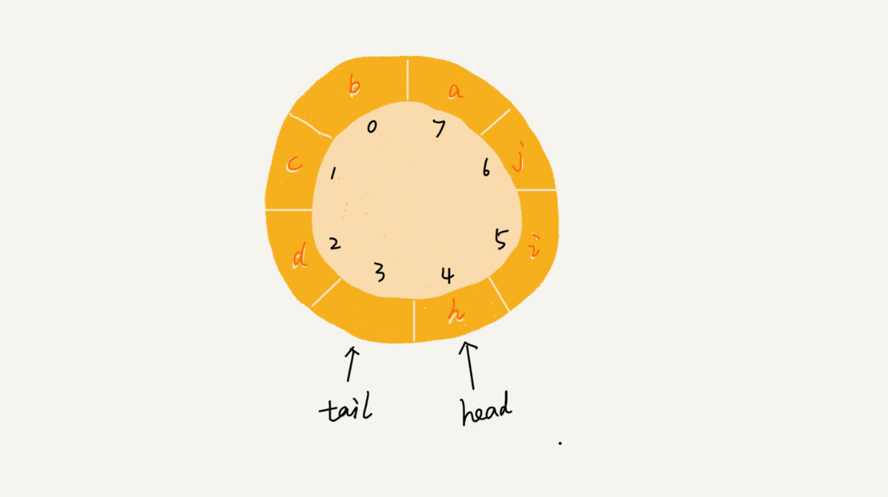

就像我图中画的队满的情况，tail=3，head=4，n=8，所以总结一下规律就是：(3+1)%8=4。多画几张队满的图，你就会发现，当队满时，**(tail+1)%n=head**。

你有没有发现，当队列满时，图中的 tail 指向的位置实际上是没有存储数据的。所以，循环队列会浪费一个数组的存储空间。

Talk is cheap，如果还是没怎么理解，那就 show you code 吧。

```java
public class CircularQueue {
  // 数组：items，数组大小：n
  private String[] items;
  private int n = 0;
  // head表示队头下标，tail表示队尾下标
  private int head = 0;
  private int tail = 0;

  // 申请一个大小为capacity的数组
  public CircularQueue(int capacity) {
    items = new String[capacity];
    n = capacity;
  }

  // 入队
  public boolean enqueue(String item) {
    // 队列满了
    if ((tail + 1) % n == head) return false;
    items[tail] = item;
    tail = (tail + 1) % n;
    return true;
  }

  // 出队
  public String dequeue() {
    // 如果head == tail 表示队列为空
    if (head == tail) return null;
    String ret = items[head];
    head = (head + 1) % n;
    return ret;
  }
}
```

### 阻塞队列和并发队列

前面讲的内容理论比较多，看起来很难跟实际的项目开发扯上关系。确实，队列这种数据结构很基础，平时的业务开发不大可能从零实现一个队列，甚至都不会直接用到。而一些具有特殊特性的队列应用却比较广泛，比如阻塞队列和并发队列。

**阻塞队列**其实就是在队列基础上增加了阻塞操作。简单来说，就是在队列为空的时候，从队头取数据会被阻塞。因为此时还没有数据可取，直到队列中有了数据才能返回；如果队列已经满了，那么插入数据的操作就会被阻塞，直到队列中有空闲位置后再插入数据，然后再返回。


你应该已经发现了，上述的定义就是一个“生产者 - 消费者模型”！是的，我们可以使用阻塞队列，轻松实现一个“生产者 - 消费者模型”！

这种基于阻塞队列实现的“生产者 - 消费者模型”，可以有效地协调生产和消费的速度。当“生产者”生产数据的速度过快，“消费者”来不及消费时，存储数据的队列很快就会满了。这个时候，生产者就阻塞等待，直到“消费者”消费了数据，“生产者”才会被唤醒继续“生产”。

而且不仅如此，基于阻塞队列，我们还可以通过协调“生产者”和“消费者”的个数，来提高数据的处理效率。比如前面的例子，我们可以多配置几个“消费者”，来应对一个“生产者”。


前面我们讲了阻塞队列，在多线程情况下，会有多个线程同时操作队列，这个时候就会存在线程安全问题，那如何实现一个线程安全的队列呢？

**线程安全的队列我们叫作并发队列**。最简单直接的实现方式是直接在 enqueue()、dequeue() 方法上加锁，但是锁粒度大并发度会比较低，同一时刻仅允许一个存或者取操作。**实际上，基于数组的循环队列，利用 CAS 原子操作，可以实现非常高效的并发队列。**这也是循环队列比链式队列应用更加广泛的原因。在实战篇讲 Disruptor 的时候，我会再详细讲并发队列的应用。

(**所谓原子操作是指不会被线程调度机制打断的操作；这种操作一旦开始，就一直运行到结束，中间不会有任何 context switch**)

### 解答开篇

队列的知识就讲完了，我们现在回过来看下开篇的问题。线程池没有空闲线程时，新的任务请求线程资源时，线程池该如何处理？各种处理策略又是如何实现的呢？

我们一般有两种处理策略。第一种是非阻塞的处理方式，直接拒绝任务请求；另一种是阻塞的处理方式，将请求排队，等到有空闲线程时，取出排队的请求继续处理。那如何存储排队的请求呢？

我们希望公平地处理每个排队的请求，先进者先服务，所以队列这种数据结构很适合来存储排队请求。我们前面说过，队列有基于链表和基于数组这两种实现方式。这两种实现方式对于排队请求又有什么区别呢？

基于链表的实现方式，可以实现一个支持无限排队的无界队列（unbounded queue），但是可能会导致过多的请求排队等待，请求处理的响应时间过长。所以，针对响应时间比较敏感的系统，基于链表实现的无限排队的线程池是不合适的。

而基于数组实现的有界队列（bounded queue），队列的大小有限，所以线程池中排队的请求超过队列大小时，接下来的请求就会被拒绝，这种方式对响应时间敏感的系统来说，就相对更加合理。不过，设置一个合理的队列大小，也是非常有讲究的。队列太大导致等待的请求太多，队列太小会导致无法充分利用系统资源、发挥最大性能。

除了前面讲到队列应用在线程池请求排队的场景之外，队列可以应用在任何有限资源池中，用于排队请求，比如数据库连接池等。**实际上，对于大部分资源有限的场景，当没有空闲资源时，基本上都可以通过“队列”这种数据结构来实现请求排队。**

### 内容小结

今天我们讲了一种跟栈很相似的数据结构，队列。关于队列，你能掌握下面的内容，这节就没问题了。

队列最大的特点就是先进先出，主要的两个操作是入队和出队。跟栈一样，它既可以用数组来实现，也可以用链表来实现。用数组实现的叫顺序队列，用链表实现的叫链式队列。特别是长得像一个环的循环队列。在数组实现队列的时候，会有数据搬移操作，要想解决数据搬移的问题，我们就需要像环一样的循环队列。

循环队列是我们这节的重点。要想写出没有 bug 的循环队列实现代码，关键要确定好队空和队满的判定条件，具体的代码你要能写出来。

除此之外，我们还讲了几种高级的队列结构，阻塞队列、并发队列，底层都还是队列这种数据结构，只不过在之上附加了很多其他功能。阻塞队列就是入队、出队操作可以阻塞，并发队列就是队列的操作多线程安全。

---

## 10.递归：如何用三行代码找到“最终推荐人”？

推荐注册返佣金的这个功能我想你应该不陌生吧？现在很多 App 都有这个功能。这个功能中，用户 A 推荐用户 B 来注册，用户 B 又推荐了用户 C 来注册。我们可以说，用户 C 的“最终推荐人”为用户 A，用户 B 的“最终推荐人”也为用户 A，而用户 A 没有“最终推荐人”。

一般来说，我们会通过数据库来记录这种推荐关系。在数据库表中，我们可以记录两行数据，其中 actor_id 表示用户 id，referrer_id 表示推荐人 id。


基于这个背景，我的问题是，给定一个用户 ID，如何查找这个用户的“最终推荐人”？ 带着这个问题，我们来学习今天的内容，递归（Recursion）！

### 如何理解“递归”？

从我自己学习数据结构和算法的经历来看，我个人觉得，有两个最难理解的知识点，一个是**动态规划**，另一个就是**递归**。

递归是一种应用非常广泛的算法（或者编程技巧）。之后我们要讲的很多数据结构和算法的编码实现都要用到递归，比如 DFS 深度优先搜索、前中后序二叉树遍历等等。所以，搞懂递归非常重要，否则，后面复杂一些的数据结构和算法学起来就会比较吃力。

不过，别看我说了这么多，递归本身可是一点儿都不“高冷”，咱们生活中就有很多用到递归的例子。

周末你带着女朋友去电影院看电影，女朋友问你，咱们现在坐在第几排啊？电影院里面太黑了，看不清，没法数，现在你怎么办？

别忘了你是程序员，这个可难不倒你，递归就开始排上用场了。于是你就问前面一排的人他是第几排，你想只要在他的数字上加一，就知道自己在哪一排了。但是，前面的人也看不清啊，所以他也问他前面的人。就这样一排一排往前问，直到问到第一排的人，说我在第一排，然后再这样一排一排再把数字传回来。直到你前面的人告诉你他在哪一排，于是你就知道答案了。

这就是一个非常标准的递归求解问题的分解过程，去的过程叫“递”，回来的过程叫“归”。基本上，所有的递归问题都可以用递推公式来表示。刚刚这个生活中的例子，我们用递推公式将它表示出来就是这样的：

```c
f(n)=f(n-1)+1 其中，f(1)=1
```

f(n) 表示你想知道自己在哪一排，f(n-1) 表示前面一排所在的排数，f(1)=1 表示第一排的人知道自己在第一排。有了这个递推公式，我们就可以很轻松地将它改为递归代码，如下：

```c
int f(int n) {
  if (n == 1) return 1;
  return f(n-1) + 1;
}
```

### 递归需要满足的三个条件

刚刚这个例子是非常典型的递归，那究竟什么样的问题可以用递归来解决呢？我总结了三个条件，只要同时满足以下三个条件，就可以用递归来解决。

#### 1. 一个问题的解可以分解为几个子问题的解

何为子问题？子问题就是数据规模更小的问题。比如，前面讲的电影院的例子，你要知道，“自己在哪一排”的问题，可以分解为“前一排的人在哪一排”这样一个子问题。

#### 2. 这个问题与分解之后的子问题，除了数据规模不同，求解思路完全一样

比如电影院那个例子，你求解“自己在哪一排”的思路，和前面一排人求解“自己在哪一排”的思路，是一模一样的。

#### 3. 存在递归终止条件

把问题分解为子问题，把子问题再分解为子子问题，一层一层分解下去，不能存在无限循环，这就需要有终止条件。

还是电影院的例子，第一排的人不需要再继续询问任何人，就知道自己在哪一排，也就是 f(1)=1，这就是递归的终止条件。

### 如何编写递归代码？

刚刚铺垫了这么多，现在我们来看，如何来写递归代码？我个人觉得，写递归代码最关键的是**写出递推公式，找到终止条件**，剩下将递推公式转化为代码就很简单了。

你先记住这个理论。我举一个例子，带你一步一步实现一个递归代码，帮你理解。

假如这里有 n 个台阶，每次你可以跨 1 个台阶或者 2 个台阶，请问走这 n 个台阶有多少种走法？如果有 7 个台阶，你可以 2，2，2，1 这样子上去，也可以 1，2，1，1，2 这样子上去，总之走法有很多，那如何用编程求得总共有多少种走法呢？

我们仔细想下，实际上，可以根据第一步的走法把所有走法分为两类，第一类是第一步走了 1 个台阶，另一类是第一步走了 2 个台阶。所以 n 个台阶的走法就等于先走 1 阶后，n-1 个台阶的走法 加上先走 2 阶后，n-2 个台阶的走法。用公式表示就是：

```
f(n) = f(n-1)+f(n-2)
```

有了递推公式，递归代码基本上就完成了一半。我们再来看下终止条件。当有一个台阶时，我们不需要再继续递归，就只有一种走法。所以 f(1)=1。这个递归终止条件足够吗？我们可以用 n=2，n=3 这样比较小的数试验一下。

n=2 时，f(2)=f(1)+f(0)。如果递归终止条件只有一个 f(1)=1，那 f(2) 就无法求解了。所以除了 f(1)=1 这一个递归终止条件外，还要有 f(0)=1，表示走 0 个台阶有一种走法，不过这样子看起来就不符合正常的逻辑思维了。所以，我们可以把 f(2)=2 作为一种终止条件，表示走 2 个台阶，有两种走法，一步走完或者分两步来走。

所以，递归终止条件就是 f(1)=1，f(2)=2。这个时候，你可以再拿 n=3，n=4 来验证一下，这个终止条件是否足够并且正确。

我们把递归终止条件和刚刚得到的递推公式放到一起就是这样的：

```c
f(1) = 1;
f(2) = 2;
f(n) = f(n-1)+f(n-2)
```

有了这个公式，我们转化成递归代码就简单多了。最终的递归代码是这样的：

```c
int f(int n) {
  if (n == 1) return 1;
  if (n == 2) return 2;
  return f(n-1) + f(n-2);
}
```

我总结一下，写递归代码的关键就是**找到如何将大问题分解为小问题的规律，并且基于此写出递推公式，然后再推敲终止条件，最后将递推公式和终止条件翻译成代码**。

虽然我讲了这么多方法，但是作为初学者的你，现在是不是还是有种想不太清楚的感觉呢？实际上，我刚学递归的时候，也有这种感觉，这也是文章开头我说递归代码比较难理解的地方。

刚讲的电影院的例子，我们的递归调用只有一个分支，也就是说“一个问题只需要分解为一个子问题”，我们很容易能够想清楚“递”和“归”的每一个步骤，所以写起来、理解起来都不难。但是，当我们面对的是一个问题要分解为多个子问题的情况，递归代码就没那么好理解了。

像我刚刚讲的第二个例子，人脑几乎没办法把整个“递”和“归”的过程一步一步都想清楚。计算机擅长做重复的事情，所以递归正合它的胃口。而我们人脑更喜欢平铺直叙的思维方式。当我们看到递归时，我们总想把递归平铺展开，脑子里就会循环，一层一层往下调，然后再一层一层返回，试图想搞清楚计算机每一步都是怎么执行的，这样就很容易被绕进去。

对于递归代码，这种试图想清楚整个递和归过程的做法，实际上是进入了一个思维误区。很多时候，我们理解起来比较吃力，主要原因就是自己给自己制造了这种理解障碍。那正确的思维方式应该是怎样的呢？

如果一个问题 A 可以分解为若干子问题 B、C、D，你可以假设子问题 B、C、D 已经解决，在此基础上思考如何解决问题 A。而且，你只需要思考问题 A 与子问题 B、C、D 两层之间的关系即可，不需要一层一层往下思考子问题与子子问题，子子问题与子子子问题之间的关系。屏蔽掉递归细节，这样子理解起来就简单多了。

因此，编写递归代码的关键是，**只要遇到递归，我们就把它抽象成一个递推公式，不用想一层层的调用关系，不要试图用人脑去分解递归的每个步骤。**

### 递归代码要警惕堆栈溢出

在实际的软件开发中，编写递归代码时，我们会遇到很多问题，比如堆栈溢出。而堆栈溢出会造成系统性崩溃，后果会非常严重。为什么递归代码容易造成堆栈溢出呢？我们又该如何预防堆栈溢出呢？

我在“栈”那一节讲过，函数调用会使用栈来保存临时变量。每调用一个函数，都会将临时变量封装为栈帧压入内存栈，等函数执行完成返回时，才出栈。系统栈或者虚拟机栈空间一般都不大。如果递归求解的数据规模很大，调用层次很深，一直压入栈，就会有堆栈溢出的风险。

比如前面的讲到的电影院的例子，如果我们将系统栈或者 JVM 堆栈大小设置为 1KB，在求解 f(19999) 时便会出现如下堆栈报错：

```java
Exception in thread "main" java.lang.StackOverflowError
```

那么，如何避免出现堆栈溢出呢？

我们可以通过在代码中限制递归调用的最大深度的方式来解决这个问题。递归调用超过一定深度（比如 1000）之后，我们就不继续往下再递归了，直接返回报错。还是电影院那个例子，我们可以改造成下面这样子，就可以避免堆栈溢出了。不过，我写的代码是伪代码，为了代码简洁，有些边界条件没有考虑，比如 x<=0。

```
// 全局变量，表示递归的深度。
int depth = 0;

int f(int n) {
  ++depth；
  if (depth > 1000) throw exception;
  
  if (n == 1) return 1;
  return f(n-1) + 1;
}
```

但这种做法并不能完全解决问题，因为最大允许的递归深度跟当前线程剩余的栈空间大小有关，事先无法计算。如果实时计算，代码过于复杂，就会影响代码的可读性。所以，如果最大深度比较小，比如 10、50，就可以用这种方法，否则这种方法并不是很实用。

### 递归代码要警惕重复计

除此之外，使用递归时还会出现重复计算的问题。刚才我讲的第二个递归代码的例子，如果我们把整个递归过程分解一下的话，那就是这样的：


从图中，我们可以直观地看到，想要计算 f(5)，需要先计算 f(4) 和 f(3)，而计算 f(4) 还需要计算 f(3)，因此，f(3) 就被计算了很多次，这就是重复计算问题。

为了避免重复计算，我们可以通过一个数据结构（比如散列表）来保存已经求解过的 f(k)。当递归调用到 f(k) 时，先看下是否已经求解过了。如果是，则直接从散列表中取值返回，不需要重复计算，这样就能避免刚讲的问题了。

按照上面的思路，我们来改造一下刚才的代码：

```java
public int f(int n) {
  if (n == 1) return 1;
  if (n == 2) return 2;
  
  // hasSolvedList可以理解成一个Map，key是n，value是f(n)
  if (hasSolvedList.containsKey(n)) {
    return hasSolvedList.get(n);
  }
  
  int ret = f(n-1) + f(n-2);
  hasSolvedList.put(n, ret);
  return ret;
}
```

除了堆栈溢出、重复计算这两个常见的问题。递归代码还有很多别的问题。

在时间效率上，递归代码里多了很多函数调用，当这些函数调用的数量较大时，就会积聚成一个可观的时间成本。在空间复杂度上，因为递归调用一次就会在内存栈中保存一次现场数据，所以在分析递归代码空间复杂度时，需要额外考虑这部分的开销，比如我们前面讲到的电影院递归代码，空间复杂度并不是 O(1)，而是 O(n)。

### 怎么将递归代码改写为非递归代码？

我们刚说了，递归有利有弊，利是递归代码的表达力很强，写起来非常简洁；而弊就是空间复杂度高、有堆栈溢出的风险、存在重复计算、过多的函数调用会耗时较多等问题。所以，在开发过程中，我们要根据实际情况来选择是否需要用递归的方式来实现。

那我们是否可以把递归代码改写为非递归代码呢？比如刚才那个电影院的例子，我们抛开场景，只看 f(x) =f(x-1)+1 这个递推公式。我们这样改写看看：

```java
int f(int n) {
  int ret = 1;
  for (int i = 2; i <= n; ++i) {
    ret = ret + 1;
  }
  return ret;
}
```

同样，第二个例子也可以改为非递归的实现方式。

```java
int f(int n) {
  if (n == 1) return 1;
  if (n == 2) return 2;
  
  int ret = 0;
  int pre = 2;
  int prepre = 1;
  for (int i = 3; i <= n; ++i) {
    ret = pre + prepre;
    prepre = pre;
    pre = ret;
  }
  return ret;
}
```

那是不是所有的递归代码都可以改为这种**迭代循环**的非递归写法呢？

笼统地讲，是的。因为递归本身就是借助栈来实现的，只不过我们使用的栈是系统或者虚拟机本身提供的，我们没有感知罢了。如果我们自己在内存堆上实现栈，手动模拟入栈、出栈过程，这样任何递归代码都可以改写成看上去不是递归代码的样子。

但是这种思路实际上是将递归改为了“手动”递归，本质并没有变，而且也并没有解决前面讲到的某些问题，徒增了实现的复杂度。

### 解答开篇

到此为止，递归相关的基础知识已经讲完了，咱们来看一下开篇的问题：如何找到“最终推荐人”？我的解决方案是这样的：

```java
long findRootReferrerId(long actorId) {
  Long referrerId = select referrer_id from [table] where actor_id = actorId;
  if (referrerId == null) return actorId;
  return findRootReferrerId(referrerId);
}
```

是不是非常简洁？用三行代码就能搞定了，不过在实际项目中，上面的代码并不能工作，为什么呢？这里面有两个问题。

第一，如果递归很深，可能会有堆栈溢出的问题。

第二，如果数据库里存在脏数据，我们还需要处理由此产生的无限递归问题。比如 demo 环境下数据库中，测试工程师为了方便测试，会人为地插入一些数据，就会出现脏数据。如果 A 的推荐人是 B，B 的推荐人是 C，C 的推荐人是 A，这样就会发生死循环。

第一个问题，我前面已经解答过了，可以用限制递归深度来解决。第二个问题，也可以用限制递归深度来解决。不过，还有一个更高级的处理方法，就是自动检测 A-B-C-A 这种“环”的存在。如何来检测环的存在呢？这个我暂时不细说，你可以自己思考下，后面的章节我们还会讲。

### 内容小结

关于递归的知识，到这里就算全部讲完了。我来总结一下。

递归是一种非常高效、简洁的编码技巧。只要是满足“三个条件”的问题就可以通过递归代码来解决。

不过递归代码也比较难写、难理解。编写递归代码的关键就是不要把自己绕进去，正确姿势是写出递推公式，找出终止条件，然后再翻译成递归代码。

递归代码虽然简洁高效，但是，递归代码也有很多弊端。比如，堆栈溢出、重复计算、函数调用耗时多、空间复杂度高等，所以，在编写递归代码的时候，一定要控制好这些副作用。

---

## 11.排序（上）：为什么插入排序比冒泡排序更受欢迎？

排序对于任何一个程序员来说，可能都不会陌生。你学的第一个算法，可能就是排序。大部分编程语言中，也都提供了排序函数。在平常的项目中，我们也经常会用到排序。排序非常重要，所以我会花多一点时间来详细讲一讲经典的排序算法。

排序算法太多了，有很多可能你连名字都没听说过，比如猴子排序、睡眠排序、面条排序等。我只讲众多排序算法中的一小撮，也是最经典的、最常用的：**冒泡排序、插入排序、选择排序、归并排序、快速排序、计数排序、基数排序、桶排序。**我按照时间复杂度把它们分成了三类，分三节课来讲解。


带着问题去学习，是最有效的学习方法。所以按照惯例，我还是先给你出一个思考题：插入排序和冒泡排序的时间复杂度相同，都是 O(n^2)，在实际的软件开发里，为什么我们**更倾向于使用插入排序算法而不是冒泡排序算法**呢？

你可以先思考一两分钟，带着这个问题，我们开始今天的内容！

### 如何分析一个“排序算法”？

学习排序算法，我们除了学习它的算法原理、代码实现之外，更重要的是要学会如何评价、分析一个排序算法。那分析一个排序算法，要从哪几个方面入手呢？

#### 排序算法的执行效率

对于排序算法执行效率的分析，我们一般会从这几个方面来衡量：

1. **最好情况、最坏情况、平均情况时间复杂度**

   我们在分析排序算法的时间复杂度时，要分别给出最好情况、最坏情况、平均情况下的时间复杂度。除此之外，你还要说出最好、最坏时间复杂度对应的要排序的原始数据是什么样的。

   为什么要区分这三种时间复杂度呢？第一，有些排序算法会区分，为了好对比，所以我们最好都做一下区分。第二，对于要排序的数据，有的接近有序，有的完全无序。有序度不同的数据，对于排序的执行时间肯定是有影响的，我们要知道排序算法在不同数据下的性能表现。

2. **时间复杂度的系数、常数 、低阶**

   我们知道，时间复杂度反映的是数据规模 n 很大的时候的一个增长趋势，所以它表示的时候会忽略系数、常数、低阶。但是实际的软件开发中，我们排序的可能是 10 个、100 个、1000 个这样规模很小的数据，所以，在对同一阶时间复杂度的排序算法性能对比的时候，我们就要把系数、常数、低阶也考虑进来。

3. **比较次数和交换（或移动）次数**

   这一节和下一节讲的都是基于比较的排序算法。基于比较的排序算法的执行过程，会涉及两种操作，一种是元素比较大小，另一种是元素交换或移动。所以，如果我们在分析排序算法的执行效率的时候，应该把比较次数和交换（或移动）次数也考虑进去。

 #### 排序算法的内存消耗

我们前面讲过，算法的内存消耗可以通过空间复杂度来衡量，排序算法也不例外。不过，针对排序算法的空间复杂度，我们还引入了一个新的概念，原地排序（Sorted in place）。**原地排序**算法，就是特指空间复杂度是 O(1) 的排序算法。我们今天讲的三种排序算法，都是原地排序算法。

#### 排序算法的稳定性

仅仅用执行效率和内存消耗来衡量排序算法的好坏是不够的。针对排序算法，我们还有一个重要的度量指标，**稳定性**。这个概念是说，如果待排序的序列中存在值相等的元素，经过排序之后，相等元素之间原有的先后顺序不变。

我通过一个例子来解释一下。比如我们有一组数据 2，9，3，4，8，3，按照大小排序之后就是 2，3，3，4，8，9。

这组数据里有两个 3。经过某种排序算法排序之后，如果两个 3 的前后顺序没有改变，那我们就把这种排序算法叫作**稳定的排序算法**；如果前后顺序发生变化，那对应的排序算法就叫作**不稳定的排序算法**。

你可能要问了，两个 3 哪个在前，哪个在后有什么关系啊，稳不稳定又有什么关系呢？为什么要考察排序算法的稳定性呢？

很多数据结构和算法课程，在讲排序的时候，都是用整数来举例，但在真正软件开发中，我们要排序的往往不是单纯的整数，而是一组对象，我们需要按照对象的某个 key 来排序。

比如说，我们现在要给电商交易系统中的“订单”排序。订单有两个属性，一个是下单时间，另一个是订单金额。如果我们现在有 10 万条订单数据，我们希望按照金额从小到大对订单数据排序。对于金额相同的订单，我们希望按照下单时间从早到晚有序。对于这样一个排序需求，我们怎么来做呢？

最先想到的方法是：我们先按照金额对订单数据进行排序，然后，再遍历排序之后的订单数据，对于每个金额相同的小区间再按照下单时间排序。这种排序思路理解起来不难，但是实现起来会很复杂。

借助稳定排序算法，这个问题可以非常简洁地解决。解决思路是这样的：我们先按照下单时间给订单排序，注意是按照下单时间，不是金额。排序完成之后，我们用稳定排序算法，按照订单金额重新排序。两遍排序之后，我们得到的订单数据就是按照金额从小到大排序，金额相同的订单按照下单时间从早到晚排序的。为什么呢？

稳定排序算法**可以保持金额相同的两个对象，在排序之后的前后顺序不变。**第一次排序之后，所有的订单按照下单时间从早到晚有序了。在第二次排序中，我们用的是稳定的排序算法，所以经过第二次排序之后，相同金额的订单仍然保持下单时间从早到晚有序。


### 冒泡排序（Bubble Sort）

我们从冒泡排序开始，学习今天的三种排序算法。

冒泡排序只会操作相邻的两个数据。每次冒泡操作都会对相邻的两个元素进行比较，看是否满足大小关系要求。如果不满足就让它俩互换。一次冒泡会让至少一个元素移动到它应该在的位置，重复 n 次，就完成了 n 个数据的排序工作。

我用一个例子，带你看下冒泡排序的整个过程。我们要对一组数据 4，5，6，3，2，1，从小到大进行排序。第一次冒泡操作的详细过程就是这样：

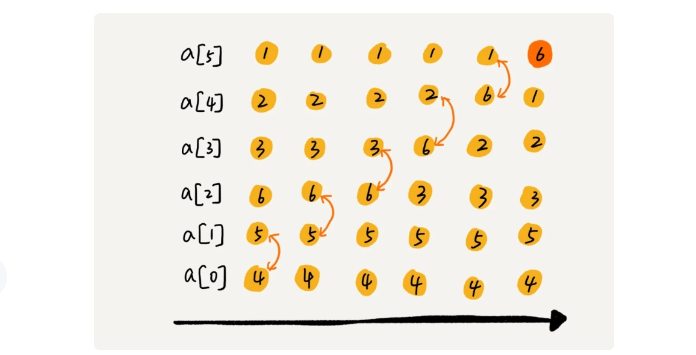

可以看出，经过一次冒泡操作之后，6 这个元素已经存储在正确的位置上。要想完成所有数据的排序，我们只要进行 6 次这样的冒泡操作就行了。


实际上，刚讲的冒泡过程还可以优化。当某次冒泡操作已经没有数据交换时，说明已经达到完全有序，不用再继续执行后续的冒泡操作。我这里还有另外一个例子，这里面给 6 个元素排序，只需要 4 次冒泡操作就可以了。


冒泡排序算法的原理比较容易理解，具体的代码我贴到下面，你可以结合着代码来看我前面讲的原理。

```java
// 冒泡排序，a表示数组，n表示数组大小
public void bubbleSort(int[] a, int n) {
  if (n <= 1) return;
 
 for (int i = 0; i < n; ++i) {
    // 提前退出冒泡循环的标志位
    boolean flag = false;
    for (int j = 0; j < n - i - 1; ++j) {
      if (a[j] > a[j+1]) { // 交换
        int tmp = a[j];
        a[j] = a[j+1];
        a[j+1] = tmp;
        flag = true;  // 表示有数据交换      
      }
    }
    if (!flag) break;  // 没有数据交换，提前退出
  }
}
```

现在，结合刚才我分析排序算法的三个方面，我有三个问题要问你。

**第一，冒泡排序是原地排序算法吗？**

冒泡的过程只涉及相邻数据的交换操作，只需要常量级的临时空间，所以它的空间复杂度为 O(1)，是一个原地排序算法。

**第二，冒泡排序是稳定的排序算法吗？**

在冒泡排序中，只有交换才可以改变两个元素的前后顺序。为了保证冒泡排序算法的稳定性，当有相邻的两个元素大小相等的时候，我们不做交换，相同大小的数据在排序前后不会改变顺序，所以冒泡排序是稳定的排序算法。

**第三，冒泡排序的时间复杂度是多少？**

最好情况下，要排序的数据已经是有序的了，我们只需要进行一次冒泡操作，就可以结束了，所以最好情况时间复杂度是 O(n)。而最坏的情况是，要排序的数据刚好是倒序排列的，我们需要进行 n 次冒泡操作，所以最坏情况时间复杂度为 O(n^2)。

### 插入排序（Insertion Sort）

我们先来看一个问题。一个有序的数组，我们往里面添加一个新的数据后，如何继续保持数据有序呢？很简单，我们只要遍历数组，找到数据应该插入的位置将其插入即可。


这是一个动态排序的过程，即动态地往有序集合中添加数据，我们可以通过这种方法保持集合中的数据一直有序。而对于一组静态数据，我们也可以借鉴上面讲的插入方法，来进行排序，于是就有了插入排序算法。

那**插入排序具体是如何借助上面的思想来实现排序的呢？**

首先，我们将数组中的数据分为两个区间，已排序区间和未排序区间。初始已排序区间只有一个元素，就是数组的第一个元素。插入算法的核心思想是取未排序区间中的元素，在已排序区间中找到合适的插入位置将其插入，并保证已排序区间数据一直有序。重复这个过程，直到未排序区间中元素为空，算法结束。

如图所示，要排序的数据是 4，5，6，1，3，2，其中左侧为已排序区间，右侧是未排序区间。


插入排序也包含两种操作，一种是元素的比较，一种是元素的移动。当我们需要将一个数据 a 插入到已排序区间时，需要拿 a 与已排序区间的元素依次比较大小，找到合适的插入位置。找到插入点之后，我们还需要将插入点之后的元素顺序往后移动一位，这样才能腾出位置给元素 a 插入。

对于不同的查找插入点方法（从头到尾、从尾到头），元素的比较次数是有区别的。但对于一个给定的初始序列，移动操作的次数总是固定的，就等于逆序度。

为什么说移动次数就等于逆序度呢？我拿刚才的例子画了一个图表，你一看就明白了。满有序度是 n*(n-1)/2=15，初始序列的有序度是 5，所以逆序度是 10。插入排序中，数据移动的个数总和也等于 10=3+3+4。


插入排序的原理也很简单吧？我也将代码实现贴在这里，你可以结合着代码再看下。

```java
// 插入排序，a表示数组，n表示数组大小
public void insertionSort(int[] a, int n) {
  if (n <= 1) return;

  for (int i = 1; i < n; ++i) {
    int value = a[i];
    // 查找插入的位置
    for (int j = i - 1;; j >= 0; --j) {
      if (a[j] > value) {
        a[j+1] = a[j];  // 数据移动
      } else {
        break;
      }
    }
    a[j+1] = value; // 插入数据
  }
}
```

现在，我们来看点稍微复杂的东西。我这里还是有三个问题要问你。

**第一，插入排序是原地排序算法吗？**

从实现过程可以很明显地看出，插入排序算法的运行并不需要额外的存储空间，所以空间复杂度是 O(1)，也就是说，这是一个原地排序算法。

**第二，插入排序是稳定的排序算法吗？**

在插入排序中，对于值相同的元素，我们可以选择将后面出现的元素，插入到前面出现元素的后面，这样就可以保持原有的前后顺序不变，所以插入排序是稳定的排序算法。

**第三，插入排序的时间复杂度是多少？**

如果要排序的数据已经是有序的，我们并不需要搬移任何数据。如果我们从尾到头在有序数据组里面查找插入位置，每次只需要比较一个数据就能确定插入的位置。所以这种情况下，最好是时间复杂度为 O(n)。注意，这里是**从尾到头遍历已经有序的数据。**

如果数组是倒序的，每次插入都相当于在数组的第一个位置插入新的数据，所以需要移动大量的数据，所以最坏情况时间复杂度为 O(n^2)。

还记得我们在数组中插入一个数据的平均时间复杂度是多少吗？没错，是 O(n)。所以，对于插入排序来说，每次插入操作都相当于在数组中插入一个数据，循环执行 n 次插入操作，所以平均时间复杂度为 O(n^2)。

### 选择排序（Selection Sort）

选择排序算法的实现思路有点类似插入排序，也分已排序区间和未排序区间。但是**选择排序每次会从未排序区间中找到最小的元素，将其放到已排序区间的末尾。**


```c++
#include<iostream>
using namespace std;
 
void print(int a[], int n)
{  
    for(int j= 0; j<n; j++)
	{  
        cout<<a[j] <<"  ";  
    }  
    cout<<endl;  
}
 
void selectSort(int a[], int len)
{
 
	int minindex, temp;
	for(int i = 0; i<len-1;i++)
	{
	    minindex = i;
	    for(int j = i+1; j<len; j++)
		{
		    if(a[j]<a[minindex])
				minindex = j;
		
		}
		temp = a[i];
		a[i] = a[minindex];
		a[minindex] = temp;
	}
}
 
int main()
{  
    int a[10] = {8,1,9,7,2,4,5,6,10,3};  
    cout<<"初始序列：";  
    print(a,10);  
    selectSort(a,10);  
    cout<<"排序结果：";  
    print(a,10);  
    system("pause"); 
} 
```

照例，也有三个问题需要你思考，不过前面两种排序算法我已经分析得很详细了，这里就直接公布答案了。

首先，选择排序空间复杂度为 O(1)，是一种原地排序算法。**选择排序的最好情况时间复杂度、最坏情况和平均情况时间复杂度都为 O(n^2)。**你可以自己来分析看看。

那选择排序是稳定的排序算法吗？这个问题我着重来说一下。

答案是否定的，**选择排序是一种不稳定的排序算法。**从我前面画的那张图中，你可以看出来，选择排序每次都要找剩余未排序元素中的最小值，并和前面的元素交换位置，这样破坏了稳定性。

比如 5，8，5，2，9 这样一组数据，使用选择排序算法来排序的话，第一次找到最小元素 2，与第一个 5 交换位置，那第一个 5 和中间的 5 顺序就变了，所以就不稳定了**。正是因此，相对于冒泡排序和插入排序，选择排序就稍微逊色了。**

### 解答开篇

基本的知识都讲完了，我们来看开篇的问题：冒泡排序和插入排序的时间复杂度都是 O(n2)，都是原地排序算法，**为什么插入排序要比冒泡排序更受欢迎呢？**

我们前面分析冒泡排序和插入排序的时候讲到，冒泡排序不管怎么优化，元素交换的次数是一个固定值，是原始数据的逆序度。插入排序是同样的，不管怎么优化，元素移动的次数也等于原始数据的逆序度。

但是，从代码实现上来看，冒泡排序的数据交换要比插入排序的数据移动要复杂，冒泡排序需要 3 个赋值操作，而插入排序只需要 1 个。我们来看这段操作：

```java
冒泡排序中数据的交换操作：
if (a[j] > a[j+1]) { // 交换
   int tmp = a[j];
   a[j] = a[j+1];
   a[j+1] = tmp;
   flag = true;
}

插入排序中数据的移动操作：
if (a[j] > value) {
  a[j+1] = a[j];  // 数据移动
} else {
  break;
}
```

我们把执行一个赋值语句的时间粗略地计为单位时间（unit_time），然后分别用冒泡排序和插入排序对同一个逆序度是 K 的数组进行排序。用冒泡排序，需要 K 次交换操作，每次需要 3 个赋值语句，所以交换操作总耗时就是 3*K 单位时间。而插入排序中数据移动操作只需要 K 个单位时间。

这个只是我们非常理论的分析，为了实验，针对上面的冒泡排序和插入排序的 Java 代码，我写了一个性能对比测试程序，随机生成 10000 个数组，每个数组中包含 200 个数据，然后在我的机器上分别用冒泡和插入排序算法来排序，冒泡排序算法大约 700ms 才能执行完成，而插入排序只需要 100ms 左右就能搞定！

所以，虽然冒泡排序和插入排序在时间复杂度上是一样的，都是 O(n^2)，但是如果我们希望把性能优化做到极致，那肯定首选插入排序。插入排序的算法思路也有很大的优化空间，我们只是讲了最基础的一种。如果你对插入排序的优化感兴趣，可以自行学习一下**希尔排序**。

### 内容小结

要想分析、评价一个排序算法，需要从执行效率、内存消耗和稳定性三个方面来看。因此，这一节，我带你分析了三种时间复杂度是 O(n^2) 的排序算法，冒泡排序、插入排序、选择排序。你需要重点掌握的是它们的分析方法。


这三种时间复杂度为 O(n2) 的排序算法中，冒泡排序、选择排序，可能就纯粹停留在理论的层面了，学习的目的也只是为了开拓思维，实际开发中应用并不多，但是插入排序还是挺有用的。后面讲排序优化的时候，我会讲到，有些编程语言中的排序函数的实现原理会用到插入排序算法。

今天讲的这三种排序算法，实现代码都非常简单，对于小规模数据的排序，用起来非常高效。但是在大规模数据排序的时候，这个时间复杂度还是稍微有点高，所以我们更倾向于用下一节要讲的时间复杂度为 O(nlogn) 的排序算法。

---

## 12.排序（下）：如何用快排思想在O(n)内查找第K大元素？

上一节我讲了冒泡排序、插入排序、选择排序这三种排序算法，它们的时间复杂度都是 O(n2)，比较高，适合小规模数据的排序。今天，我讲两种时间复杂度为 O(nlogn) 的排序算法，**归并排序**和**快速排序**。这两种排序算法适合大规模的数据排序，比上一节讲的那三种排序算法要更常用。

归并排序和快速排序都用到了**分治**思想，非常巧妙。我们可以借鉴这个思想，来解决非排序的问题，比如：如何在 O(n) 的时间复杂度内查找一个无序数组中的第 K 大元素？ 这就要用到我们今天要讲的内容。

### 归并排序的原理

我们先来看归并排序（Merge Sort）。

归并排序的核心思想还是蛮简单的。如果要排序一个数组，我们先把数组从中间分成前后两部分，然后对前后两部分分别排序，再将排好序的两部分合并在一起，这样整个数组就都有序了。

归并排序使用的就是**分治**思想。分治，顾名思义，就是分而治之，将一个大问题分解成小的子问题来解决。小的子问题解决了，大问题也就解决了。

从我刚才的描述，你有没有感觉到，分治思想跟我们前面讲的递归思想很像。是的，分治算法一般都是用递归来实现的。**分治是一种解决问题的处理思想，递归是一种编程技巧**，这两者并不冲突。分治算法的思想我后面会有专门的一节来讲，现在不展开讨论，我们今天的重点还是排序算法。

前面我通过举例让你对归并有了一个感性的认识，又告诉你，归并排序用的是分治思想，可以用递归来实现。**我们现在就来看看如何用递归代码来实现归并排序**。

我在第 10 节讲的递归代码的编写技巧你还记得吗？写递归代码的技巧就是，分析得出递推公式，然后找到终止条件，最后将递推公式翻译成递归代码。所以，要想写出归并排序的代码，我们先写出归并排序的递推公式。

```java
递推公式：
merge_sort(p…r) = merge(merge_sort(p…q), merge_sort(q+1…r))

终止条件：
p >= r 不用再继续分解
```

我来解释一下这个递推公式。

merge_sort(p…r) 表示，给下标从 p 到 r 之间的数组排序。我们将这个排序问题转化为了两个子问题，merge_sort(p…q) 和 merge_sort(q+1…r)，其中下标 q 等于 p 和 r 的中间位置，也就是 (p+r)/2。当下标从 p 到 q 和从 q+1 到 r 这两个子数组都排好序之后，我们再将两个有序的子数组合并在一起，这样下标从 p 到 r 之间的数据就也排好序了。

有了递推公式，转化成代码就简单多了。为了阅读方便，我这里只给出伪代码，你可以翻译成你熟悉的编程语言。

```
// 归并排序算法, A是数组，n表示数组大小
merge_sort(A, n) {
  merge_sort_c(A, 0, n-1)
}

// 递归调用函数
merge_sort_c(A, p, r) {
  // 递归终止条件
  if p >= r  then return

  // 取p到r之间的中间位置q
  q = (p+r) / 2
  // 分治递归
  merge_sort_c(A, p, q)
  merge_sort_c(A, q+1, r)
  // 将A[p...q]和A[q+1...r]合并为A[p...r]
  merge(A[p...r], A[p...q], A[q+1...r])
}
```

你可能已经发现了，merge(A[p...r], A[p...q], A[q+1...r]) 这个函数的作用就是，将已经有序的 A[p...q]和 A[q+1....r]合并成一个有序的数组，并且放入 A[p....r]。那这个过程具体该如何做呢？

如图所示，我们申请一个临时数组 tmp，大小与 A[p...r]相同。我们用两个游标 i 和 j，分别指向 A[p...q]和 A[q+1...r]的第一个元素。比较这两个元素 A[i]和 A[j]，如果 A[i]<=A[j]，我们就把 A[i]放入到临时数组 tmp，并且 i 后移一位，否则将 A[j]放入到数组 tmp，j 后移一位。

继续上述比较过程，直到其中一个子数组中的所有数据都放入临时数组中，再把另一个数组中的数据依次加入到临时数组的末尾，这个时候，临时数组中存储的就是两个子数组合并之后的结果了。最后再把临时数组 tmp 中的数据拷贝到原数组 A[p...r]中。


我们把 merge() 函数写成伪代码，就是下面这样：

```java
merge(A[p...r], A[p...q], A[q+1...r]) {
  var i := p，j := q+1，k := 0 // 初始化变量i, j, k
  var tmp := new array[0...r-p] // 申请一个大小跟A[p...r]一样的临时数组
  while i<=q AND j<=r do {
    if A[i] <= A[j] {
      tmp[k++] = A[i++] // i++等于i:=i+1
    } else {
      tmp[k++] = A[j++]
    }
  }
  
  // 判断哪个子数组中有剩余的数据
  var start := i，end := q
  if j<=r then start := j, end:=r
  
  // 将剩余的数据拷贝到临时数组tmp
  while start <= end do {
    tmp[k++] = A[start++]
  }
  
  // 将tmp中的数组拷贝回A[p...r]
  for i:=0 to r-p do {
    A[p+i] = tmp[i]
  }
}
```

你还记得第 7 讲讲过的利用哨兵简化编程的处理技巧吗？merge() 合并函数如果借助哨兵，代码就会简洁很多，这个问题留给你思考。

### 归并排序代码

完整c++代码:

```c++
#include<iostream>
#define arrlen 10
using namespace std;
void printArr(int arr[]){
    for(int i = 0; i < arrlen; i++){
        printf("%d ",arr[i]);
    }
}
void merge(int arr[],int start, int mid, int end){
    int result[arrlen];//temp[]
    int i = start,j = mid + 1,k = 0;
    while(i <= mid && j <= end)
    {
        if(arr[i] < arr[j]) result[k++] = arr[i++];
        else result[k++] = arr[j++];
    }
    while(i <= mid) result[k++] = arr[i++];
    while(j <= end) result[k++] = arr[j++];
    for(i = start, j = 0; j < k; i++, j++){
        arr[i] = result[j];
    }

}

void mergeSort(int arr[], int start, int end){
    if(start >= end) return;
    int mid = (start + end) / 2;
    mergeSort(arr,start,mid);
    mergeSort(arr,mid+1,end);
    merge(arr,start,mid,end);
}

int main(){
    int arr[arrlen] = {9, 8, 7, 6, 5, 3, 1, 2, 4, 9};
    mergeSort(arr,0,arrlen-1);
    printArr(arr);
    system("pause");
}
```

### 归并排序的性能分析

这样跟着我一步一步分析，归并排序是不是没那么难啦？还记得上节课我们分析排序算法的三个问题吗？接下来，我们来看归并排序的三个问题。

#### 第一，归并排序是稳定的排序算法吗？

结合我前面画的那张图和归并排序的伪代码，你应该能发现，归并排序稳不稳定关键要看 merge() 函数，也就是两个有序子数组合并成一个有序数组的那部分代码。

在合并的过程中，如果 A[p...q]和 A[q+1...r]之间有值相同的元素，那我们可以像伪代码中那样，**先把 A[p...q]中的元素放入 tmp 数组。**这样就保证了值相同的元素，在合并前后的先后顺序不变。所以，归并排序是一个**稳定**的排序算法。

#### 第二，归并排序的时间复杂度是多少？

归并排序涉及递归，时间复杂度的分析稍微有点复杂。我们正好借此机会来学习一下，如何分析递归代码的时间复杂度。

在递归那一节我们讲过，递归的适用场景是，一个问题 a 可以分解为多个子问题 b、c，那求解问题 a 就可以分解为求解问题 b、c。问题 b、c 解决之后，我们再把 b、c 的结果合并成 a 的结果。

如果我们定义求解问题 a 的时间是 T(a)，求解问题 b、c 的时间分别是 T(b) 和 T( c)，那我们就可以得到这样的递推关系式：

```
T(a) = T(b) + T(c) + K
```

其中 K 等于将两个子问题 b、c 的结果合并成问题 a 的结果所消耗的时间。

从刚刚的分析，我们可以得到一个重要的结论：**不仅递归求解的问题可以写成递推公式，递归代码的时间复杂度也可以写成递推公式。**

套用这个公式，我们来分析一下归并排序的时间复杂度。

我们假设对 n 个元素进行归并排序需要的时间是 T(n)，那分解成两个子数组排序的时间都是 T(n/2)。我们知道，merge() 函数合并两个有序子数组的时间复杂度是 O(n)。所以，套用前面的公式，归并排序的时间复杂度的计算公式就是:

```
T(1) = C；   n=1时，只需要常量级的执行时间，所以表示为C。
T(n) = 2*T(n/2) + n； n>1
```

通过这个公式，如何来求解 T(n) 呢？还不够直观？那我们再进一步分解一下计算过程。

```
T(n) = 2*T(n/2) + n
     = 2*(2*T(n/4) + n/2) + n = 4*T(n/4) + 2*n
     = 4*(2*T(n/8) + n/4) + 2*n = 8*T(n/8) + 3*n
     = 8*(2*T(n/16) + n/8) + 3*n = 16*T(n/16) + 4*n
     ......
     = 2^k * T(n/2^k) + k * n
     ......
```

通过这样一步一步分解推导，我们可以得到 T(n) = 2^kT(n/2^k)+kn。当 T(n/2^k)=T(1) 时，也就是 n/2^k=1，我们得到 k=log2n 。我们将 k 值代入上面的公式，得到 T(n)=Cn+nlog2n 。如果我们用大 O 标记法来表示的话，T(n) 就等于 O(nlogn)。所以归并排序的时间复杂度是 O(nlogn)。

从我们的原理分析和伪代码可以看出，归并排序的执行效率与要排序的原始数组的有序程度无关，所以其时间复杂度是非常稳定的，不管是最好情况、最坏情况，还是平均情况，时间复杂度都是 O(nlogn)。

#### 第三，归并排序的空间复杂度是多少？

归并排序的时间复杂度任何情况下都是 O(nlogn)，看起来非常优秀。（待会儿你会发现，即便是快速排序，最坏情况下，时间复杂度也是 O(n2)。）但是，归并排序并没有像快排那样，应用广泛，这是为什么呢？因为它有一个致命的“弱点”，那就是**归并排序不是原地排序算法**。

这是因为归并排序的合并函数，在合并两个有序数组为一个有序数组时，需要借助额外的存储空间。这一点你应该很容易理解。那我现在问你，归并排序的空间复杂度到底是多少呢？是 O(n)，还是 O(nlogn)，应该如何分析呢？

如果我们继续按照分析递归时间复杂度的方法，通过递推公式来求解，那整个归并过程需要的空间复杂度就是 O(nlogn)。不过，类似分析时间复杂度那样来分析空间复杂度，这个思路对吗？

实际上，**递归代码的空间复杂度并不能像时间复杂度那样累加**。刚刚我们忘记了最重要的一点，那就是，尽管每次合并操作都需要申请额外的内存空间，**但在合并完成之后，临时开辟的内存空间就被释放掉了。**在任意时刻，CPU 只会有一个函数在执行，也就只会有一个临时的内存空间在使用。临时内存空间最大也不会超过 n 个数据的大小，所以空间复杂度是 O(n)。

### 快速排序的原理

我们再来看快速排序算法（Quicksort），我们习惯性把它简称为“快排”。快排利用的也是分治思想。乍看起来，它有点像归并排序，但是思路其实完全不一样。我们待会会讲两者的区别。现在，我们先来看下快排的核心思想。

快排的思想是这样的：如果要排序数组中下标从 p 到 r 之间的一组数据，我们选择 p 到 r 之间的任意一个数据作为 pivot（分区点）。

我们遍历 p 到 r 之间的数据，将小于 pivot 的放到左边，将大于 pivot 的放到右边，将 pivot 放到中间。经过这一步骤之后，数组 p 到 r 之间的数据就被分成了三个部分，前面 p 到 q-1 之间都是小于 pivot 的，中间是 pivot，后面的 q+1 到 r 之间是大于 pivot 的。


根据分治、递归的处理思想，我们可以用递归排序下标从 p 到 q-1 之间的数据和下标从 q+1 到 r 之间的数据，直到区间缩小为 1，就说明所有的数据都有序了。

如果我们用递推公式来将上面的过程写出来的话，就是这样：

```
递推公式：
quick_sort(p…r) = quick_sort(p…q-1) + quick_sort(q+1… r)

终止条件：
p >= r
```

我将递推公式转化成递归代码。跟归并排序一样，我还是用伪代码来实现，你可以翻译成你熟悉的任何语言。

```
// 快速排序，A是数组，n表示数组的大小
quick_sort(A, n) {
  quick_sort_c(A, 0, n-1)
}
// 快速排序递归函数，p,r为下标
quick_sort_c(A, p, r) {
  if p >= r then return
  
  q = partition(A, p, r) // 获取分区点
  quick_sort_c(A, p, q-1)
  quick_sort_c(A, q+1, r)
}
```

归并排序中有一个 merge() 合并函数，我们这里有一个 partition() 分区函数。partition() 分区函数实际上我们前面已经讲过了，就是随机选择一个元素作为 pivot（一般情况下，可以选择 p 到 r 区间的最后一个元素），然后对 A[p...r]分区，函数返回 pivot 的下标。

如果我们不考虑空间消耗的话，partition() 分区函数可以写得非常简单。我们申请两个临时数组 X 和 Y，遍历 A[p...r]，将小于 pivot 的元素都拷贝到临时数组 X，将大于 pivot 的元素都拷贝到临时数组 Y，最后再将数组 X 和数组 Y 中数据顺序拷贝到 A[p....r]。

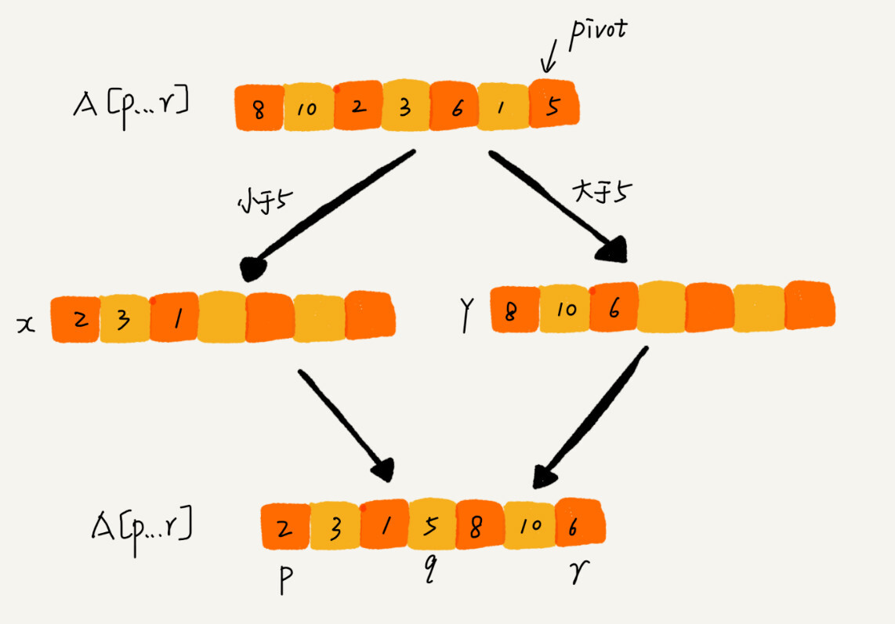

但是，如果按照这种思路实现的话，partition() 函数就需要很多额外的内存空间，所以快排就不是原地排序算法了。如果我们希望快排是原地排序算法，那它的空间复杂度得是 O(1)，那 partition() 分区函数就不能占用太多额外的内存空间，我们就需要在 A[p...r]的原地完成分区操作。

原地分区函数的实现思路非常巧妙，我写成了伪代码，我们一起来看一下。

```
partition(A, p, r) {
  pivot := A[r]
  i := p
  for j := p to r-1 do {
    if A[j] < pivot {
      swap A[i] with A[j]
      i := i+1
    }
  }
  swap A[i] with A[r]
  return i
```

这里的处理有点类似选择排序。我们通过游标 i 把 A[p...r-1]分成两部分。A[p...i-1]的元素都是小于 pivot 的，我们暂且叫它“已处理区间”，A[i...r-1]是“未处理区间”。我们每次都从未处理的区间 A[i...r-1]中取一个元素 A[j]，与 pivot 对比，如果小于 pivot，则将其加入到已处理区间的尾部，也就是 A[i]的位置。

数组的插入操作还记得吗？在数组某个位置插入元素，需要搬移数据，非常耗时。当时我们也讲了一种处理技巧，就是交换，在 O(1) 的时间复杂度内完成插入操作。这里我们也借助这个思想，只需要将 A[i]与 A[j]交换，就可以在 O(1) 时间复杂度内将 A[j]放到下标为 i 的位置。

文字不如图直观，所以我画了一张图来展示分区的整个过程。

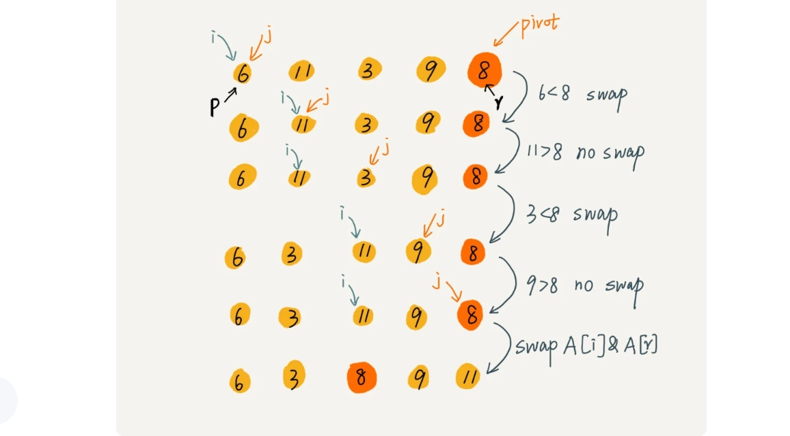

因为分区的过程涉及交换操作，如果数组中有两个相同的元素，比如序列 6，8，7，6，3，5，9，4，在经过第一次分区操作之后，两个 6 的相对先后顺序就会改变。所以，**快速排序并不是一个稳定的排序算法**。

到此，快速排序的原理你应该也掌握了。现在，我再来看另外一个问题：快排和归并用的都是分治思想，递推公式和递归代码也非常相似，那它们的区别在哪里呢？


可以发现，归并排序的处理过程是**由下到上**的，先处理子问题，然后再合并。而快排正好相反，它的处理过程是**由上到下**的，先分区，然后再处理子问题。归并排序虽然是稳定的、时间复杂度为 O(nlogn) 的排序算法，但是它是非原地排序算法。我们前面讲过，归并之所以是非原地排序算法，主要原因是合并函数无法在原地执行。快速排序通过设计巧妙的原地分区函数，可以实现原地排序，解决了归并排序占用太多内存的问题。

(归并排序是自底向上的，因为它是一直递归到底部，才开始进行处理。递归到底部后先对最小区间排好序，再依次向上合并，使较大区间有序，然后重复这个过程，直到整个数组有序，递归到底部后，自底向上返回的过程才是使得数组逐渐有序的过程。 快速排序是自顶向下的，因为它第一遍处理即将整个数组划分为两部分，然后再分别对每个部分重复这个过程，直到整个数组有序。自顶向下递归的过程中就使得数组逐渐有序，递归到底部后数组已经有序，递归依次返回的过程不进行任何处理。)

### 快速排序代码

```c++
#include<iostream>
#define arrlen 10
using namespace std;
void printArr(int arr[]){
    for(int i = 0; i < arrlen; i++){
        printf("%d ",arr[i]);
    }
}
int partition(int arr[], int start, int end){
    int pivot = arr[end];//
    int i = start;
    for(int j = start;j < end; j++){
        if(arr[j] < pivot){
            int tmp = arr[i];
            arr[i] = arr[j];
            arr[j] = tmp;
            i++;
        }
    }
    int tmp = arr[i];
    arr[i] = arr[end];
    arr[end] = tmp;
    return i;
}
void quickSort(int arr[],int start,int end){
    if(start >= end) return;

    int pivot = partition(arr,start,end);
    quickSort(arr,start,pivot-1);
    quickSort(arr,pivot+1,end);
}
int main(){

    int arr[arrlen] = {9, 8, 7, 6, 5, 3, 1, 2, 4, 9};
    quickSort(arr,0,arrlen-1);
    printArr(arr);
    system("pause");
    return 0;
}
```


### 快速排序的性能分析

现在，我们来分析一下快速排序的性能。我在讲解快排的实现原理的时候，已经分析了稳定性和空间复杂度。快排是一种**原地、不稳定**的排序算法。现在，我们集中精力来看快排的时间复杂度。

快排也是用递归来实现的。对于递归代码的时间复杂度，我前面总结的公式，这里也还是适用的。如果每次分区操作，都能正好把数组分成大小接近相等的两个小区间，那快排的时间复杂度递推求解公式跟归并是相同的。所以，快排的时间复杂度也是 **O(nlogn)**。

```
T(1) = C；   n=1时，只需要常量级的执行时间，所以表示为C。
T(n) = 2*T(n/2) + n； n>1
```

但是，公式成立的前提是每次分区操作，我们选择的 pivot 都很合适，正好能将大区间对等地一分为二。但实际上这种情况是很难实现的。

我举一个比较极端的例子。如果数组中的数据原来已经是有序的了，比如 1，3，5，6，8。如果我们每次选择最后一个元素作为 pivot，那每次分区得到的两个区间都是不均等的。我们需要进行大约 n 次分区操作，才能完成快排的整个过程。每次分区我们平均要扫描大约 n/2 个元素，这种情况下，快排的时间复杂度就从 O(nlogn) 退化成了 O(n2)。

我们刚刚讲了两个极端情况下的时间复杂度，一个是分区极其均衡，一个是分区极其不均衡。它们分别对应快排的最好情况时间复杂度和最坏情况时间复杂度。那快排的平均情况时间复杂度是多少呢？

我们假设每次分区操作都将区间分成大小为 9:1 的两个小区间。我们继续套用递归时间复杂度的递推公式，就会变成这样：

```
T(1) = C；   n=1时，只需要常量级的执行时间，所以表示为C。

T(n) = T(n/10) + T(9*n/10) + n； n>1
```

这个公式的递推求解的过程非常复杂，虽然可以求解，但我不推荐用这种方法。实际上，递归的时间复杂度的求解方法除了递推公式之外，还有递归树，在树那一节我再讲，这里暂时不说。我这里直接给你结论：**T(n) 在大部分情况下的时间复杂度都可以做到 O(nlogn)，只有在极端情况下，才会退化到 O(n2)。**而且，我们也有很多方法将这个概率降到很低，如何来做？我们后面章节再讲。

### 解答开篇

快排核心思想就是分治和分区，我们可以利用分区的思想，来解答开篇的问题：O(n) 时间复杂度内求无序数组中的第 K 大元素。比如，4， 2， 5， 12， 3 这样一组数据，第 3 大元素就是 4。

我们选择数组区间 A[0...n-1]的最后一个元素 A[n-1]作为 pivot，对数组 A[0...n-1]原地分区，这样数组就分成了三部分，A[0...p-1]、A[p]、A[p+1...n-1]。

如果 p+1=K，那 A[p]就是要求解的元素；如果 K>p+1, 说明第 K 大元素出现在 A[p+1...n-1]区间，我们再按照上面的思路递归地在 A[p+1...n-1]这个区间内查找。同理，如果 K<p+1，那我们就在 A[0...p-1]区间查找。


我们再来看，为什么上述解决思路的时间复杂度是 O(n)？

第一次分区查找，我们需要对大小为 n 的数组执行分区操作，需要遍历 n 个元素。第二次分区查找，我们只需要对大小为 n/2 的数组执行分区操作，需要遍历 n/2 个元素。依次类推，分区遍历元素的个数分别为、n/2、n/4、n/8、n/16.……直到区间缩小为 1。

如果我们把每次分区遍历的元素个数加起来，就是：n+n/2+n/4+n/8+...+1。这是一个等比数列求和，最后的和等于 2n-1。所以，上述解决思路的时间复杂度就为 O(n)。

你可能会说，我有个很笨的办法，每次取数组中的最小值，将其移动到数组的最前面，然后在剩下的数组中继续找最小值，以此类推，执行 K 次，找到的数据不就是第 K 大元素了吗？

不过，时间复杂度就并不是 O(n) 了，而是 O(K * n)。你可能会说，时间复杂度前面的系数不是可以忽略吗？O(K * n) 不就等于 O(n) 吗？

这个可不能这么简单地划等号。当 K 是比较小的常量时，比如 1、2，那最好时间复杂度确实是 O(n)；但当 K 等于 n/2 或者 n 时，这种最坏情况下的时间复杂度就是 O(n2) 了。

### 内容小结

归并排序和快速排序是两种稍微复杂的排序算法，它们用的都是分治的思想，代码都通过递归来实现，过程非常相似。理解归并排序的重点是理解递推公式和 merge() 合并函数。同理，理解快排的重点也是理解递推公式，还有 partition() 分区函数。

归并排序算法是一种在任何情况下时间复杂度都比较稳定的排序算法，这也使它存在致命的缺点，即归并排序不是原地排序算法，空间复杂度比较高，是 O(n)。正因为此，它也没有快排应用广泛。

快速排序算法虽然最坏情况下的时间复杂度是 O(n^2)，但是平均情况下时间复杂度都是 O(nlogn)。不仅如此，**快速排序算法时间复杂度退化到 O(n2) 的概率非常小，我们可以通过合理地选择 pivot 来避免这种情况。**

---

## 13.线性排序：如何根据年龄给100万用户数据排序？

上两节中，我带你着重分析了几种常用排序算法的原理、时间复杂度、空间复杂度、稳定性等。今天，我会讲三种时间复杂度是 O(n) 的排序算法：**桶排序、计数排序、基数排序**。因为这些排序算法的时间复杂度是线性的，所以我们把这类排序算法叫作**线性排序**（Linear sort）。之所以能做到线性的时间复杂度，主要原因是，这三个算法是**非基于比较的排序算法**，都不涉及元素之间的比较操作。

这几种排序算法理解起来都不难，时间、空间复杂度分析起来也很简单，但是**对要排序的数据要求很苛刻**，所以我们**今天的学习重点是掌握这些排序算法的适用场景。**

按照惯例，我先给你出一道思考题：**如何根据年龄给 100 万用户排序？** 你可能会说，我用上一节课讲的归并、快排就可以搞定啊！是的，它们也可以完成功能，但是时间复杂度最低也是 O(nlogn)。有没有更快的排序方法呢？让我们一起进入今天的内容！

### 桶排序（Bucket sort）

首先，我们来看桶排序。桶排序，顾名思义，会用到“桶”，核心思想是将要排序的数据分到几个有序的桶里，每个桶里的数据再单独进行排序。桶内排完序之后，再把每个桶里的数据按照顺序依次取出，组成的序列就是有序的了。

桶排序的时间复杂度为什么是 O(n) 呢？我们一块儿来分析一下。

如果要排序的数据有 n 个，我们把它们均匀地划分到 m 个桶内，每个桶里就有 k=n/m 个元素。每个桶内部使用**快速排序**，时间复杂度为 O(k * logk)。m 个桶排序的时间复杂度就是 O(m * k * logk)，因为 k=n/m，所以整个桶排序的时间复杂度就是 O(n*log(n/m))。当桶的个数 m 接近数据个数 n 时，log(n/m) 就是一个非常小的常量，这个时候桶排序的时间复杂度接近 O(n)。

#### 桶排序看起来很优秀，那它是不是可以替代我首先，要排序的数据需要很容易就能划分成 m 个桶，并且，桶与桶之间有着天然的大小顺序。这样每个桶内的数据都排序完之后，桶与桶之间的数据不需要再进行排序。之前讲的排序算法呢？

答案当然是否定的。为了让你轻松理解桶排序的核心思想，我刚才做了很多假设。实际上，桶排序对要排序数据的要求是非常苛刻的。

首先，要排序的数据需要很容易就能划分成 m 个桶，并且，桶与桶之间有着天然的大小顺序。这样每个桶内的数据都排序完之后，桶与桶之间的数据不需要再进行排序。

其次，数据在各个桶之间的分布是比较均匀的。如果数据经过桶的划分之后，有些桶里的数据非常多，有些非常少，很不平均，那桶内数据排序的时间复杂度就不是常量级了。在极端情况下，如果数据都被划分到一个桶里，那就退化为 O(nlogn) 的排序算法了。

**桶排序比较适合用在外部排序中。**所谓的外部排序就是数据存储在外部磁盘中，数据量比较大，内存有限，无法将数据全部加载到内存中。

比如说我们有 10GB 的订单数据，我们希望按订单金额（假设金额都是正整数）进行排序，但是我们的内存有限，只有几百 MB，没办法一次性把 10GB 的数据都加载到内存中。这个时候该怎么办呢？

现在我来讲一下，如何借助桶排序的处理思想来解决这个问题。

我们可以先扫描一遍文件，看订单金额所处的数据范围。假设经过扫描之后我们得到，订单金额最小是 1 元，最大是 10 万元。我们将所有订单根据金额划分到 100 个桶里，第一个桶我们存储金额在 1 元到 1000 元之内的订单，第二桶存储金额在 1001 元到 2000 元之内的订单，以此类推。每一个桶对应一个文件，并且按照金额范围的大小顺序编号命名（00，01，02...99）。

理想的情况下，如果订单金额在 1 到 10 万之间均匀分布，那订单会被均匀划分到 100 个文件中，每个小文件中存储大约 100MB 的订单数据，我们就可以将这 100 个小文件依次放到内存中，用快排来排序。等所有文件都排好序之后，我们只需要按照文件编号，从小到大依次读取每个小文件中的订单数据，并将其写入到一个文件中，那这个文件中存储的就是按照金额从小到大排序的订单数据了。

不过，你可能也发现了，订单按照金额在 1 元到 10 万元之间并不一定是均匀分布的 ，所以 10GB 订单数据是无法均匀地被划分到 100 个文件中的。有可能某个金额区间的数据特别多，划分之后对应的文件就会很大，没法一次性读入内存。这又该怎么办呢？

针对这些划分之后还是比较大的文件，我们可以继续划分，比如，订单金额在 1 元到 1000 元之间的比较多，我们就将这个区间继续划分为 10 个小区间，1 元到 100 元，101 元到 200 元，201 元到 300 元....901 元到 1000 元。如果划分之后，101 元到 200 元之间的订单还是太多，无法一次性读入内存，那就继续再划分，直到所有的文件都能读入内存为止。

### 计数排序（Counting sort）

我个人觉得，**计数排序其实是桶排序的一种特殊情况。**当要排序的 n 个数据，所处的范围并不大的时候，比如最大值是 k，我们就可以把数据划分成 k 个桶。每个桶内的数据值都是相同的，省掉了桶内排序的时间。

我们都经历过高考，高考查分数系统你还记得吗？我们查分数的时候，系统会显示我们的成绩以及所在省的排名。如果你所在的省有 50 万考生，如何通过成绩快速排序得出名次呢？

考生的满分是 900 分，最小是 0 分，这个数据的范围很小，所以我们可以分成 901 个桶，对应分数从 0 分到 900 分。根据考生的成绩，我们将这 50 万考生划分到这 901 个桶里。桶内的数据都是分数相同的考生，所以并不需要再进行排序。我们只需要依次扫描每个桶，将桶内的考生依次输出到一个数组中，就实现了 50 万考生的排序。因为只涉及扫描遍历操作，所以时间复杂度是 O(n)。

计数排序的算法思想就是这么简单，跟桶排序非常类似，**只是桶的大小粒度不一样。**不过，**为什么这个排序算法叫“计数”排序呢？“计数”的含义来自哪里呢？**

想弄明白这个问题，我们就要来看计数排序算法的实现方法。我还拿考生那个例子来解释。为了方便说明，我对数据规模做了简化。假设只有 8 个考生，分数在 0 到 5 分之间。这 8 个考生的成绩我们放在一个数组 A[8]中，它们分别是：2，5，3，0，2，3，0，3。

考生的成绩从 0 到 5 分，我们使用大小为 6 的数组 C[6]表示桶，其中下标对应分数。不过，C[6]内存储的并不是考生，而是对应的考生个数。像我刚刚举的那个例子，我们只需要遍历一遍考生分数，就可以得到 C[6]的值。


从图中可以看出，分数为 3 分的考生有 3 个，小于 3 分的考生有 4 个，所以，成绩为 3 分的考生在排序之后的有序数组 R[8]中，会保存下标 4，5，6 的位置。

那我们如何快速计算出，每个分数的考生在有序数组中对应的存储位置呢？这个处理方法非常巧妙，很不容易想到。

思路是这样的：我们对 C[6]数组顺序求和，C[6]存储的数据就变成了下面这样子。C[k]里存储小于等于分数 k 的考生个数。


有了前面的数据准备之后，现在我就要讲计数排序中最复杂、最难理解的一部分了，请集中精力跟着我的思路！

我们从后到前依次扫描数组 A。比如，当扫描到 3 时，我们可以从数组 C 中取出下标为 3 的值 7，也就是说，到目前为止，包括自己在内，分数小于等于 3 的考生有 7 个，也就是说 3 是数组 R 中的第 7 个元素（也就是数组 R 中下标为 6 的位置）。当 3 放入到数组 R 中后，小于等于 3 的元素就只剩下了 6 个了，所以相应的 C[3]要减 1，变成 6。

以此类推，当我们扫描到第 2 个分数为 3 的考生的时候，就会把它放入数组 R 中的第 6 个元素的位置（也就是下标为 5 的位置）。当我们扫描完整个数组 A 后，数组 R 内的数据就是按照分数从小到大有序排列的了。


上面的过程有点复杂，我写成了代码，你可以对照着看下。

```c++
// 计数排序，a是数组，n是数组大小。假设数组中存储的都是非负整数。
public void countingSort(int[] a, int n) {
  if (n <= 1) return;

  // 查找数组中数据的范围
  int max = a[0];
  for (int i = 1; i < n; ++i) {
    if (max < a[i]) {
      max = a[i];
    }
  }

  int[] c = new int[max + 1]; // 申请一个计数数组c，下标大小[0,max]
  for (int i = 0; i <= max; ++i) {
    c[i] = 0;
  }

  // 计算每个元素的个数，放入c中
  for (int i = 0; i < n; ++i) {
    c[a[i]]++;
  }

  // 依次累加
  for (int i = 1; i <= max; ++i) {
    c[i] = c[i-1] + c[i];
  }

  // 临时数组r，存储排序之后的结果
  int[] r = new int[n];
  // 计算排序的关键步骤，有点难理解
  for (int i = n - 1; i >= 0; --i) {
    int index = c[a[i]]-1;
    r[index] = a[i];
    c[a[i]]--;
  }

  // 将结果拷贝给a数组
  for (int i = 0; i < n; ++i) {
    a[i] = r[i];
  }
}
```

这种利用另外一个数组来计数的实现方式是不是很巧妙呢？这也是为什么这种排序算法叫计数排序的原因。不过，你千万不要死记硬背上面的排序过程，重要的是理解和会用。

我总结一下，**计数排序只能用在数据范围不大的场景中**，如果数据范围 k 比要排序的数据 n 大很多，就不适合用计数排序了。而且，计数排序只能给非负整数排序，如果要排序的数据是其他类型的，要将其在不改变相对大小的情况下，转化为非负整数。

比如，还是拿考生这个例子。如果考生成绩精确到小数后一位，我们就需要将所有的分数都先乘以 10，转化成整数，然后再放到 9010 个桶内。再比如，如果要排序的数据中有负数，数据的范围是[-1000, 1000]，那我们就需要先对每个数据都加 1000，转化成非负整数。

### 基数排序（Radix sort）

我们再来看这样一个排序问题。假设我们有 10 万个手机号码，希望将这 10 万个手机号码从小到大排序，你有什么比较快速的排序方法呢？

我们之前讲的快排，时间复杂度可以做到 O(nlogn)，还有更高效的排序算法吗？桶排序、计数排序能派上用场吗？手机号码有 11 位，范围太大，显然不适合用这两种排序算法。针对这个排序问题，有没有时间复杂度是 O(n) 的算法呢？现在我就来介绍一种新的排序算法，基数排序。

刚刚这个问题里有这样的规律：假设要比较两个手机号码 a，b 的大小，如果在前面几位中，a 手机号码已经比 b 手机号码大了，那后面的几位就不用看了。

借助稳定排序算法，这里有一个巧妙的实现思路。还记得我们第 11 节中，在阐述排序算法的稳定性的时候举的订单的例子吗？我们这里也可以借助相同的处理思路，先按照最后一位来排序手机号码，然后，再按照倒数第二位重新排序，以此类推，最后按照第一位重新排序。经过 11 次排序之后，手机号码就都有序了。

手机号码稍微有点长，画图比较不容易看清楚，我用字符串排序的例子，画了一张基数排序的过程分解图，你可以看下。


注意，这里按照每位来排序的排序算法要是稳定的，否则这个实现思路就是不正确的。因为如果是非稳定排序算法，那最后一次排序只会考虑最高位的大小顺序，完全不管其他位的大小关系，那么低位的排序就完全没有意义了。

根据每一位来排序，我们可以用刚讲过的(**基于归并排序的桶排序是稳定的，基于快排的桶排序不稳定**)桶排序或计数排序(**原始数组从后往前遍历，是为了稳定**)，它们的时间复杂度可以做到 O(n)。如果要排序的数据有 k 位，那我们就需要 k 次桶排序或者计数排序，总的时间复杂度是 O(k*n)。当 k 不大的时候，比如手机号码排序的例子，k 最大就是 11，所以基数排序的时间复杂度就近似于 O(n)。

实际上，有时候要排序的数据并不都是等长的，比如我们排序牛津字典中的 20 万个英文单词，最短的只有 1 个字母，最长的我特意去查了下，有 45 个字母，中文翻译是尘肺病。对于这种不等长的数据，基数排序还适用吗？

实际上，**我们可以把所有的单词补齐到相同长度，位数不够的可以在后面补“0”**，因为根据ASCII 值，所有字母都大于“0”，所以补“0”不会影响到原有的大小顺序。这样就可以继续用基数排序了。

我来总结一下，**基数排序对要排序的数据是有要求的，需要可以分割出独立的“位”来比较，而且位之间有递进的关系**，**如果 a 数据的高位比 b 数据大，那剩下的低位就不用比较了。除此之外，每一位的数据范围不能太大，要可以用线性排序算法来排序，否则，基数排序的时间复杂度就无法做到 O(n) 了。**

### 解答开篇

今天的内容学完了。我们再回过头来看看开篇的思考题：如何根据年龄给 100 万用户排序？现在思考题是不是变得非常简单了呢？我来说一下我的解决思路。

实际上，根据年龄给 100 万用户排序，就类似按照成绩给 50 万考生排序。我们假设年龄的范围最小 1 岁，最大不超过 120 岁。我们可以遍历这 100 万用户，根据年龄将其划分到这 120 个桶里，然后依次顺序遍历这 120 个桶中的元素。这样就得到了按照年龄排序的 100 万用户数据。

### 内容小结

今天，我们学习了 3 种线性时间复杂度的排序算法，有桶排序、计数排序、基数排序。它们对要排序的数据都有比较苛刻的要求，应用不是非常广泛。但是如果数据特征比较符合这些排序算法的要求，应用这些算法，会非常高效，线性时间复杂度可以达到 O(n)。

桶排序和计数排序的排序**思想**是非常相似的，都是针对范围不大的数据，将数据划分成不同的桶来实现排序。基数排序要求数据可以划分成高低位，位之间有递进关系。比较两个数，我们只需要比较高位，高位相同的再比较低位。而且每一位的数据范围不能太大，因为基数排序算法需要借助桶排序或者计数排序来完成每一个位的排序工作。

---

## 14.排序优化：如何实现一个通用的、高性能的排序函数？

几乎所有的编程语言都会提供排序函数，比如 C 语言中 qsort()，C++ STL 中的 sort()、stable_sort()，还有 Java 语言中的 Collections.sort()。在平时的开发中，我们也都是直接使用这些现成的函数来实现业务逻辑中的排序功能。那你知道这些排序函数是如何实现的吗？底层都利用了哪种排序算法呢？

基于这些问题，今天我们就来看排序这部分的最后一块内容：**如何实现一个通用的、高性能的排序函数？**

### 如何选择合适的排序算法？

如果要实现一个通用的、高效率的排序函数，我们应该选择哪种排序算法？我们先回顾一下前面讲过的几种排序算法。


我们前面讲过，线性排序算法的时间复杂度比较低，适用场景比较特殊。所以如果要写一个通用的排序函数，不能选择线性排序算法。

如果对小规模数据进行排序，可以选择时间复杂度是 O(n^2) 的算法；如果对大规模数据进行排序，时间复杂度是 O(nlogn) 的算法更加高效。所以，为了兼顾任意规模数据的排序，一般都会首选时间复杂度是 O(nlogn) 的排序算法来实现排序函数。

时间复杂度是 O(nlogn) 的排序算法不止一个，我们已经讲过的有**归并排序、快速排序**，后面讲堆的时候我们还会讲到**堆排序**。堆排序和快速排序都有比较多的应用，比如 Java 语言采用堆排序实现排序函数，C 语言使用快速排序实现排序函数。

不知道你有没有发现，使用归并排序的情况其实并不多。我们知道，快排在最坏情况下的时间复杂度是 O(n2)，而归并排序可以做到平均情况、最坏情况下的时间复杂度都是 O(nlogn)，从这点上看起来很诱人，那为什么它还是没能得到“宠信”呢？

还记得我们上一节讲的归并排序的空间复杂度吗？归并排序并不是原地排序算法，空间复杂度是 O(n)。所以，粗略点、夸张点讲，如果要排序 100MB 的数据，除了数据本身占用的内存之外，排序算法还要额外再占用 100MB 的内存空间，空间耗费就翻倍了。

前面我们讲到，快速排序比较适合来实现排序函数，但是，我们也知道，快速排序在最坏情况下的时间复杂度是 O(n2)，如何来解决这个“复杂度恶化”的问题呢？

### 如何优化快速排序？

我们先来看下，为什么最坏情况下快速排序的时间复杂度是 O(n2) 呢？我们前面讲过，如果数据原来就是有序的或者接近有序的，每次分区点都选择最后一个数据，那快速排序算法就会变得非常糟糕，时间复杂度就会退化为 O(n2)。实际上，**这种 O(n2) 时间复杂度出现的主要原因还是因为我们分区点选得不够合理。**

那什么样的分区点是好的分区点呢？或者说如何来选择分区点呢？

最理想的分区点是：被分区点分开的两个分区中，数据的数量差不多。

如果很粗暴地直接选择第一个或者最后一个数据作为分区点，不考虑数据的特点，肯定会出现之前讲的那样，在某些情况下，排序的最坏情况时间复杂度是 O(n2)。为了提高排序算法的性能，我们也要尽可能地让每次分区都比较平均。

我这里介绍两个比较常用、比较简单的分区算法，你可以直观地感受一下。

#### 1. 三数取中法

我们从区间的首、尾、中间，分别取出一个数，然后对比大小，取这 3 个数的中间值作为分区点。这样每间隔某个固定的长度，取数据出来比较，将中间值作为分区点的分区算法，肯定要比单纯取某一个数据更好。但是，如果要排序的数组比较大，那“三数取中”可能就不够了，可能要“五数取中”或者“十数取中”。

#### 2.随机法

随机法就是每次从要排序的区间中，随机选择一个元素作为分区点。这种方法并不能保证每次分区点都选的比较好，但是从概率的角度来看，也不大可能会出现每次分区点都选得很差的情况，所以平均情况下，这样选的分区点是比较好的。时间复杂度退化为最糟糕的 O(n2) 的情况，出现的可能性不大。

好了，我这里也只是抛砖引玉，如果想了解更多寻找分区点的方法，你可以自己课下深入去学习一下。

我们知道，快速排序是用递归来实现的。我们在递归那一节讲过，递归要警惕堆栈溢出。为了避免快速排序里，递归过深而堆栈过小，导致堆栈溢出，我们有两种解决办法：第一种是限制递归深度。一旦递归过深，超过了我们事先设定的阈值，就停止递归。第二种是通过在堆上模拟实现一个函数调用栈，手动模拟递归压栈、出栈的过程，这样就没有了系统栈大小的限制。

(归并排序比较稳定，栈的深度是logn，非常小，所以不会堆栈溢出； 快排因为分区可能不平均的问题，可能会堆栈溢出)

### 举例分析排序函数

为了让你对如何实现一个排序函数有一个更直观的感受，我拿 [Glibc 中的 qsort() 函数](https://github.com/StreamAI/glibc/blob/master/stdlib/qsort.c)举例说明一下。虽说 qsort() 从名字上看，很像是基于快速排序算法实现的，实际上它并不仅仅用了快排这一种算法。

如果你去看源码，你就会发现，**qsort() 会优先使用归并排序来排序输入数据**，因为归并排序的空间复杂度是 O(n)，所以对于小数据量的排序，比如 1KB、2KB 等，归并排序额外需要 1KB、2KB 的内存空间，这个问题不大。现在计算机的内存都挺大的，我们很多时候追求的是速度。还记得我们前面讲过的用空间换时间的技巧吗？这就是一个典型的应用。

但如果数据量太大，就跟我们前面提到的，排序 100MB 的数据，这个时候我们再用归并排序就不合适了。所以，**要排序的数据量比较大的时候，qsort() 会改为用快速排序算法来排序。**

那 qsort() 是如何选择快速排序算法的分区点的呢？如果去看源码，你就会发现，qsort() 选择分区点的方法就是“三数取中法”。是不是也并不复杂？

还有我们前面提到的递归太深会导致堆栈溢出的问题，qsort() 是通过自己实现一个堆上的栈，手动模拟递归来解决的。我们之前在讲递归那一节也讲过，不知道你还有没有印象？(通过 for 循环迭代实现模拟递归。)

实际上，qsort() 并不仅仅用到了归并排序和快速排序，它还用到了插入排序。在快速排序的过程中，当要排序的区间中，元素的个数小于等于 4 时，qsort() 就退化为插入排序，不再继续用递归来做快速排序，因为我们前面也讲过，**在小规模数据面前，O(n^2) 时间复杂度的算法并不一定比 O(nlogn) 的算法执行时间长。**我们现在就来分析下这个说法。

我们在讲复杂度分析的时候讲过，算法的性能可以通过时间复杂度来分析，但是，这种复杂度分析是比较偏理论的，如果我们深究的话，实际上时间复杂度并不等于代码实际的运行时间。

时间复杂度代表的是一个增长趋势，如果画成增长曲线图，你会发现 O(n2) 比 O(nlogn) 要陡峭，也就是说增长趋势要更猛一些。但是，我们前面讲过，在大 O 复杂度表示法中，我们会省略低阶、系数和常数，也就是说，O(nlogn) 在没有省略低阶、系数、常数之前可能是 O(knlogn + c)，而且 k 和 c 有可能还是一个比较大的数。

假设 k=1000，c=200，当我们对小规模数据（比如 n=100）排序时，n^2的值实际上比 knlogn+c 还要小。

```
knlogn+c = 1000 * 100 * log100 + 200 远大于10000
n^2 = 100*100 = 10000
```

所以，对于小规模数据的排序，O(n2) 的排序算法并不一定比 O(nlogn) 排序算法执行的时间长。对于小数据量的排序，我们选择比较简单、不需要递归的插入排序算法。

还记得我们之前讲到的哨兵来简化代码，提高执行效率吗？在 qsort() 插入排序的算法实现中，也利用了这种编程技巧。虽然哨兵可能只是少做一次判断，但是毕竟排序函数是非常常用、非常基础的函数，性能的优化要做到极致。

好了，C 语言的 qsort() 我已经分析完了，你有没有觉得其实也不是很难？基本上都是用了我们前面讲到的知识点，有了前面的知识积累，看一些底层的类库的时候是不是也更容易了呢？

### 内容小结

今天我带你分析了一下如何来实现一个工业级的通用的、高效的排序函数，内容比较偏实战，而且贯穿了一些前面几节的内容，你要多看几遍。我们大部分排序函数都是采用 O(nlogn) 排序算法来实现，但是为了尽可能地提高性能，会做很多优化。

我还着重讲了快速排序的一些优化策略，比如合理选择分区点、避免递归太深等等。最后，我还带你分析了一个 C 语言中 qsort() 的底层实现原理，希望你对此能有一个更加直观的感受。

---

## 15. 二分查找(上)


## 16.二分查找(下)

通过 IP 地址来查找 IP 归属地的功能，不知道你有没有用过？没用过也没关系，你现在可以打开百度，在搜索框里随便输一个 IP 地址，就会看到它的归属地。


这个功能并不复杂，它是通过维护一个很大的 IP 地址库来实现的。地址库中包括 IP 地址范围和归属地的对应关系。

当我们想要查询 202.102.133.13 这个 IP 地址的归属地时，我们就在地址库中搜索，发现这个 IP 地址落在[202.102.133.0, 202.102.133.255]这个地址范围内，那我们就可以将这个 IP 地址范围对应的归属地“山东东营市”显示给用户了。

````
[202.102.133.0, 202.102.133.255]  山东东营市 
[202.102.135.0, 202.102.136.255]  山东烟台 
[202.102.156.34, 202.102.157.255] 山东青岛 
[202.102.48.0, 202.102.48.255] 江苏宿迁 
[202.102.49.15, 202.102.51.251] 江苏泰州 
[202.102.56.0, 202.102.56.255] 江苏连云港
````

现在我的问题是，在庞大的地址库中逐一比对 IP 地址所在的区间，是非常耗时的。**假设我们有 12 万条这样的 IP 区间与归属地的对应关系，如何快速定位出一个 IP 地址的归属地呢？**

是不是觉得比较难？不要紧，等学完今天的内容，你就会发现这个问题其实很简单。

上一节我讲了二分查找的原理，并且介绍了最简单的一种二分查找的代码实现。今天我们来讲几种二分查找的变形问题。

不知道你有没有听过这样一个说法：“十个二分九个错”。二分查找虽然原理极其简单，但是想要写出没有 Bug 的二分查找并不容易。

唐纳德·克努特（Donald E.Knuth）在《计算机程序设计艺术》的第 3 卷《排序和查找》中说到：“尽管第一个二分查找算法于 1946 年出现，然而第一个完全正确的二分查找算法实现直到 1962 年才出现。”

你可能会说，我们上一节学的二分查找的代码实现并不难写啊。那是因为上一节讲的只是二分查找中最简单的一种情况，在不存在重复元素的有序数组中，查找值等于给定值的元素。最简单的二分查找写起来确实不难，但是，二分查找的变形问题就没那么好写了。

二分查找的变形问题很多，我只选择几个典型的来讲解，其他的你可以借助我今天讲的思路自己来分析。


需要特别说明一点，为了简化讲解，今天的内容，我都以数据是从小到大排列为前提，如果你要处理的数据是从大到小排列的，解决思路也是一样的。同时，我希望你最好先自己动手试着写一下这 4 个变形问题，然后再看我的讲述，这样你就会对我说的“二分查找比较难写”有更加深的体会了。

### 变体一：查找第一个值等于给定值的元素

上一节中的二分查找是最简单的一种，即有序数据集合中不存在重复的数据，我们在其中查找值等于某个给定值的数据。如果我们将这个问题稍微修改下，有序数据集合中存在重复的数据，我们希望找到第一个值等于给定值的数据，这样之前的二分查找代码还能继续工作吗？

比如下面这样一个有序数组，其中，a[5]，a[6]，a[7]的值都等于 8，是重复的数据。我们希望查找第一个等于 8 的数据，也就是下标是 5 的元素。

如果我们用上一节课讲的二分查找的代码实现，首先拿 8 与区间的中间值 a[4]比较，8 比 6 大，于是在下标 5 到 9 之间继续查找。下标 5 和 9 的中间位置是下标 7，a[7]正好等于 8，所以代码就返回了。

尽管 a[7]也等于 8，但它并不是我们想要找的第一个等于 8 的元素，因为第一个值等于 8 的元素是数组下标为 5 的元素。我们上一节讲的二分查找代码就无法处理这种情况了。所以，针对这个变形问题，我们可以稍微改造一下上一节的代码。

100 个人写二分查找就会有 100 种写法。网上有很多关于变形二分查找的实现方法，有很多写得非常简洁，比如下面这个写法。但是，尽管简洁，理解起来却非常烧脑，也很容易写错。

```c++
public int bsearch(int[] a, int n, int value) {
  int low = 0;
  int high = n - 1;
  while (low <= high) {
    int mid = low + ((high - low) >> 1);
    if (a[mid] >= value) {
      high = mid - 1;
    } else {
      low = mid + 1;
    }
  }

  if (low < n && a[low]==value) return low;
  else return -1;
}
```

看完这个实现之后，你是不是觉得很不好理解？如果你只是死记硬背这个写法，我敢保证，过不了几天，你就会全都忘光，再让你写，90% 的可能会写错。所以，我换了一种实现方法，你看看是不是更容易理解呢？

```java
public int bsearch(int[] a, int n, int value) {
  int low = 0;
  int high = n - 1;
  while (low <= high) {
    int mid =  low + ((high - low) >> 1);
    if (a[mid] > value) {
      high = mid - 1;
    } else if (a[mid] < value) {
      low = mid + 1;
    } else {
      if ((mid == 0) || (a[mid - 1] != value)) return mid;
      else high = mid - 1;
    }
  }
  return -1;
}
```

我来稍微解释一下这段代码。a[mid]跟要查找的 value 的大小关系有三种情况：大于、小于、等于。对于 a[mid]>value 的情况，我们需要更新 high= mid-1；对于 a[mid]<value 的情况，我们需要更新 low=mid+1。这两点都很好理解。那当 a[mid]=value 的时候应该如何处理呢？

如果我们查找的是任意一个值等于给定值的元素，当 a[mid]等于要查找的值时，a[mid]就是我们要找的元素。但是，如果我们求解的是第一个值等于给定值的元素，当 a[mid]等于要查找的值时，我们就需要**确认一下这个 a[mid]是不是第一个值等于给定值的元素。**

我们重点看第 11 行代码。如果 mid 等于 0，那这个元素已经是数组的第一个元素，那它肯定是我们要找的；如果 mid 不等于 0，但 a[mid]的前一个元素 a[mid-1]不等于 value，那也说明 a[mid]就是我们要找的第一个值等于给定值的元素。

如果经过检查之后发现 a[mid]前面的一个元素 a[mid-1]也等于 value，那说明此时的 a[mid]肯定不是我们要查找的第一个值等于给定值的元素。那我们就更新 high=mid-1，因为要找的元素肯定出现在[low, mid-1]之间。

对比上面的两段代码，是不是下面那种更好理解？实际上，**很多人都觉得变形的二分查找很难写，主要原因是太追求第一种那样完美、简洁的写法。**而对于我们做工程开发的人来说，代码易读懂、没 Bug，其实更重要，所以我觉得第二种写法更好。

### 变体二：查找最后一个值等于给定值的元素

前面的问题是查找第一个值等于给定值的元素，我现在把问题稍微改一下，查找最后一个值等于给定值的元素，又该如何做呢？

```java
public int bsearch(int[] a, int n, int value) {
  int low = 0;
  int high = n - 1;
  while (low <= high) {
    int mid =  low + ((high - low) >> 1);
    if (a[mid] > value) {
      high = mid - 1;
    } else if (a[mid] < value) {
      low = mid + 1;
    } else {
      if ((mid == n - 1) || (a[mid + 1] != value)) return mid;
      else low = mid + 1;
    }
  }
  return -1;
}
```

我们还是重点看第 11 行代码。如果 a[mid]这个元素已经是数组中的最后一个元素了，那它肯定是我们要找的；如果 a[mid]的后一个元素 a[mid+1]不等于 value，那也说明 a[mid]就是我们要找的最后一个值等于给定值的元素。

如果我们经过检查之后，发现 a[mid]后面的一个元素 a[mid+1]也等于 value，那说明当前的这个 a[mid]并不是最后一个值等于给定值的元素。我们就更新 low=mid+1，因为要找的元素肯定出现在[mid+1, high]之间。

### 变体三：查找第一个大于等于给定值的元素

现在我们再来看另外一类变形问题。在有序数组中，查找第一个大于等于给定值的元素。比如，数组中存储的这样一个序列：3，4，6，7，10。如果查找第一个大于等于 5 的元素，那就是 6。

实际上，实现的思路跟前面的那两种变形问题的实现思路类似，代码写起来甚至更简洁。

```java
public int bsearch(int[] a, int n, int value) {
  int low = 0;
  int high = n - 1;
  while (low <= high) {
    int mid =  low + ((high - low) >> 1);
    if (a[mid] >= value) {
      if ((mid == 0) || (a[mid - 1] < value)) return mid;
      else high = mid - 1;
    } else {
      low = mid + 1;
    }
  }
  return -1;
}
```

如果 a[mid]小于要查找的值 value，那要查找的值肯定在[mid+1, high]之间，所以，我们更新 low=mid+1。

对于 a[mid]大于等于给定值 value 的情况，我们要先看下这个 a[mid]是不是我们要找的第一个值大于等于给定值的元素。如果 a[mid]前面已经没有元素，或者前面一个元素小于要查找的值 value，那 a[mid]就是我们要找的元素。这段逻辑对应的代码是第 7 行。

如果 a[mid-1]也大于等于要查找的值 value，那说明要查找的元素在[low, mid-1]之间，所以，我们将 high 更新为 mid-1。

### 变体四：查找最后一个小于等于给定值的元素

现在，我们来看最后一种二分查找的变形问题，查找最后一个小于等于给定值的元素。比如，数组中存储了这样一组数据：3，5，6，8，9，10。最后一个小于等于 7 的元素就是 6。是不是有点类似上面那一种？实际上，实现思路也是一样的。

有了前面的基础，你完全可以自己写出来了，所以我就不详细分析了。我把代码贴出来，你可以写完之后对比一下。

```java
public int bsearch7(int[] a, int n, int value) {
  int low = 0;
  int high = n - 1;
  while (low <= high) {
    int mid =  low + ((high - low) >> 1);
    if (a[mid] > value) {
      high = mid - 1;
    } else {
      if ((mid == n - 1) || (a[mid + 1] > value)) return mid;
      else low = mid + 1;
    }
  }
  return -1;
}
```

### 解答开篇

好了，现在我们回头来看开篇的问题：如何快速定位出一个 IP 地址的归属地？

现在这个问题应该很简单了。如果 IP 区间与归属地的对应关系不经常更新，我们可以先预处理这 12 万条数据，让其按照起始 IP 从小到大排序。如何来排序呢？我们知道，IP 地址可以转化为 32 位的整型数。所以，我们可以将起始地址，按照对应的整型值的大小关系，从小到大进行排序。

然后，这个问题就可以转化为我刚讲的第四种变形问题“在有序数组中，查找最后一个小于等于某个给定值的元素”了。

当我们要查询某个 IP 归属地时，我们可以先通过二分查找，找到最后一个起始 IP 小于等于这个 IP 的 IP 区间，然后，检查这个 IP 是否在这个 IP 区间内，如果在，我们就取出对应的归属地显示；如果不在，就返回未查找到。

### 内容小结

上一节我说过，凡是用二分查找能解决的，绝大部分我们更倾向于用散列表或者二叉查找树。即便是二分查找在内存使用上更节省，但是毕竟内存如此紧缺的情况并不多。那二分查找真的没什么用处了吗？

实际上，上一节讲的求“值等于给定值”的二分查找确实不怎么会被用到，二分查找更适合用在“近似”查找问题，在这类问题上，二分查找的优势更加明显。比如今天讲的这几种变体问题，用其他数据结构，比如散列表、二叉树，就比较难实现了。

变体的二分查找算法写起来非常烧脑，很容易因为细节处理不好而产生 Bug，这些容易出错的细节有：终止条件、区间上下界更新方法、返回值选择。所以今天的内容你最好能用自己实现一遍，对锻炼编码能力、逻辑思维、写出 Bug free 代码，会很有帮助。

---

## 17.跳表：为什么Redis一定要用跳表来实现有序集合？

上两节我们讲了二分查找算法。当时我讲到，因为二分查找底层依赖的是数组随机访问的特性，所以只能用数组来实现。如果数据存储在链表中，就真的没法用二分查找算法了吗？

实际上，我们只需要对链表稍加改造，就可以支持类似“二分”的查找算法。我们把改造之后的数据结构叫做**跳表**（Skip list），也就是今天要讲的内容。

跳表这种数据结构对你来说，可能会比较陌生，因为一般的数据结构和算法书籍里都不怎么会讲。但是它确实是一种各方面性能都比较优秀的**动态数据结构**，可以支持快速地插入、删除、查找操作，写起来也不复杂，甚至可以替代[红黑树](https://zh.wikipedia.org/wiki/%E7%BA%A2%E9%BB%91%E6%A0%91)（Red-black tree）。

Redis 中的有序集合（Sorted Set）就是用跳表来实现的。如果你有一定基础，应该知道红黑树也可以实现快速地插入、删除和查找操作。**那 Redis 为什么会选择用跳表来实现有序集合呢？** 为什么不用红黑树呢？学完今天的内容，你就知道答案了。

### 如何理解“跳表”？

对于一个单链表来讲，即便链表中存储的数据是有序的，如果我们要想在其中查找某个数据，也只能从头到尾遍历链表。这样查找效率就会很低，时间复杂度会很高，是 O(n)。

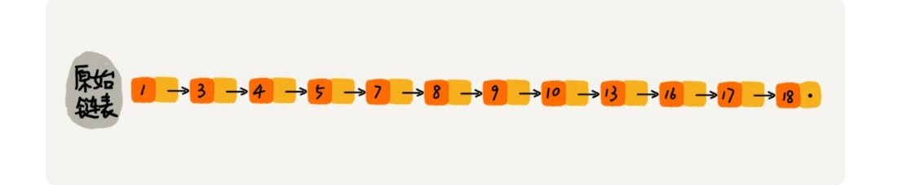

那怎么来提高查找效率呢？如果像图中那样，对链表建立一级“索引”，查找起来是不是就会更快一些呢？每两个结点提取一个结点到上一级，我们把抽出来的那一级叫做索引或索引层。你可以看我画的图。图中的 down 表示 down 指针，指向下一级结点。

如果我们现在要查找某个结点，比如 16。我们可以先在索引层遍历，当遍历到索引层中值为 13 的结点时，我们发现下一个结点是 17，那要查找的结点 16 肯定就在这两个结点之间。然后我们通过索引层结点的 down 指针，下降到原始链表这一层，继续遍历。这个时候，我们只需要再遍历 2 个结点，就可以找到值等于 16 的这个结点了。这样，原来如果要查找 16，需要遍历 10 个结点，现在只需要遍历 7 个结点。

从这个例子里，我们看出，**加了一层索引之后，查找一个结点需要遍历的结点个数减少了，也就是说查找效率提高了**。那如果我们再加一级索引呢？效率会不会提升更多呢？

跟前面建立第一级索引的方式相似，我们在第一级索引的基础之上，每两个结点就抽出一个结点到第二级索引。现在我们再来查找 16，只需要遍历 6 个结点了，需要遍历的结点数量又减少了。


我举的例子数据量不大，所以即便加了两级索引，查找效率的提升也并不明显。为了让你能真切地感受索引提升查询效率。我画了一个包含 64 个结点的链表，按照前面讲的这种思路，建立了五级索引。


从图中我们可以看出，原来没有索引的时候，查找 62 需要遍历 62 个结点，现在只需要遍历 11 个结点，速度是不是提高了很多？所以，当链表的长度 n 比较大时，比如 1000、10000 的时候，在构建索引之后，查找效率的提升就会非常明显。

前面讲的这种**链表加多级索引**的结构，就是跳表。我通过例子给你展示了跳表是如何减少查询次数的，现在你应该比较清晰地知道，跳表确实是可以提高查询效率的。接下来，我会定量地分析一下，用跳表查询到底有多快。

### 用跳表查询到底有多快？

前面我讲过，算法的执行效率可以通过时间复杂度来度量，这里依旧可以用。我们知道，在一个单链表中查询某个数据的时间复杂度是 O(n)。那在一个具有多级索引的跳表中，查询某个数据的时间复杂度是多少呢？

这个时间复杂度的分析方法比较难想到。我把问题分解一下，先来看这样一个问题，如果链表里有 n 个结点，会有多少级索引呢？

按照我们刚才讲的，每两个结点会抽出一个结点作为上一级索引的结点，那第一级索引的结点个数大约就是 n/2，第二级索引的结点个数大约就是 n/4，第三级索引的结点个数大约就是 n/8，依次类推，**也就是说，第 k 级索引的结点个数是第 k-1 级索引的结点个数的 1/2，那第 k级索引结点的个数就是 n/(2^k)。**

假设索引有 h 级，最高级的索引有 2 个结点。通过上面的公式，我们可以得到 n/(2^h)=2，从而求得 h=log2(n-1)。如果包含原始链表这一层，整个跳表的高度就是 log2(n)。我们在跳表中查询某个数据的时候，如果每一层都要遍历 m 个结点，那在跳表中查询一个数据的时间复杂度就是 O(m*logn)。

那这个 m 的值是多少呢？按照前面这种索引结构，我们每一级索引都最多只需要遍历 3 个结点，也就是说 m=3，为什么是 3 呢？我来解释一下。

假设我们要查找的数据是 x，在第 k 级索引中，我们遍历到 y 结点之后，发现 x 大于 y，小于后面的结点 z，所以我们通过 y 的 down 指针，从第 k 级索引下降到第 k-1 级索引。在第 k-1 级索引中，y 和 z 之间只有 3 个结点（包含 y 和 z），所以，我们在 K-1 级索引中最多只需要遍历 3 个结点，依次类推，每一级索引都最多只需要遍历 3 个结点。


通过上面的分析，我们得到 m=3，所以**在跳表中查询任意数据的时间复杂度就是 O(logn)**。这个查找的时间复杂度跟二分查找是一样的。换句话说，我们其实是**基于单链表实现了二分查找**，是不是很神奇？不过，天下没有免费的午餐，这种查询效率的提升，前提是建立了很多级索引，也就是我们在第 6 节讲过的空间换时间的设计思路。

### 跳表是不是很浪费内存？

比起单纯的单链表，跳表需要存储多级索引，肯定要消耗更多的存储空间。那到底需要消耗多少额外的存储空间呢？我们来分析一下跳表的空间复杂度。

跳表的空间复杂度分析并不难，我在前面说了，假设原始链表大小为 n，那第一级索引大约有 n/2 个结点，第二级索引大约有 n/4 个结点，以此类推，每上升一级就减少一半，直到剩下 2 个结点。如果我们把每层索引的结点数写出来，就是一个等比数列。


这几级索引的结点总和就是 n/2+n/4+n/8…+8+4+2=n-2。所以，跳表的空间复杂度是 O(n)。也就是说，如果将包含 n 个结点的单链表构造成跳表，我们需要额外再用接近 n 个结点的存储空间。那我们有没有办法降低索引占用的内存空间呢？

我们前面都是每两个结点抽一个结点到上级索引，如果我们每三个结点或五个结点，抽一个结点到上级索引，是不是就不用那么多索引结点了呢？我画了一个每三个结点抽一个的示意图，你可以看下。


从图中可以看出，第一级索引需要大约 n/3 个结点，第二级索引需要大约 n/9 个结点。每往上一级，索引结点个数都除以 3。为了方便计算，我们假设最高一级的索引结点个数是 1。我们把每级索引的结点个数都写下来，也是一个等比数列。


通过等比数列求和公式，总的索引结点大约就是 n/3+n/9+n/27+...+9+3+1=n/2。尽管空间复杂度还是 O(n)，但比上面的每两个结点抽一个结点的索引构建方法，要减少了一半的索引结点存储空间。

实际上，在软件开发中，我们不必太在意索引占用的额外空间。在讲数据结构和算法时，我们习惯性地把要处理的数据看成整数，但是在实际的软件开发中，**原始链表中存储的有可能是很大的对象，而索引结点只需要存储关键值和几个指针，并不需要存储对象**，所以当对象比索引结点大很多时，那索引占用的额外空间就可以忽略了。

### 高效的动态插入和删除

跳表长什么样子我想你应该已经很清楚了，它的查找操作我们刚才也讲过了。实际上，跳表这个动态数据结构，不仅支持查找操作，还支持动态的插入、删除操作，而且插入、删除操作的时间复杂度也是 O(logn)。

我们现在来看下， 如何在跳表中插入一个数据，以及它是如何做到 O(logn) 的时间复杂度的？

我们知道，在单链表中，一旦定位好要插入的位置，插入结点的时间复杂度是很低的，就是 O(1)。但是，这里为了保证原始链表中数据的有序性，我们需要先找到要插入的位置，这个查找操作就会比较耗时。

对于纯粹的单链表，需要遍历每个结点，来找到插入的位置。但是，对于跳表来说，我们讲过查找某个结点的时间复杂度是 O(logn)，所以这里查找某个数据应该插入的位置，方法也是类似的，时间复杂度也是 O(logn)。我画了一张图，你可以很清晰地看到插入的过程。


好了，我们再来看删除操作。

如果这个结点在索引中也有出现，我们除了要删除原始链表中的结点，还要删除索引中的。因为单链表中的删除操作需要拿到要删除结点的前驱结点，然后通过指针操作完成删除。所以在查找要删除的结点的时候，一定要获取前驱结点。当然，如果我们用的是双向链表，就不需要考虑这个问题了。

### 跳表索引动态更新

当我们不停地往跳表中插入数据时，如果我们不更新索引，就有可能出现某 2 个索引结点之间数据非常多的情况。极端情况下，跳表还会退化成单链表。


作为一种动态数据结构，我们需要某种手段来维护索引与原始链表大小之间的平衡，也就是说，如果链表中结点多了，索引结点就相应地增加一些，避免复杂度退化，以及查找、插入、删除操作性能下降。

如果你了解红黑树、AVL 树这样平衡二叉树，你就知道它们是通过左右旋的方式保持左右子树的大小平衡（如果不了解也没关系，我们后面会讲），而跳表是通过**随机函数**来维护前面提到的“平衡性”。

当我们往跳表中插入数据的时候，我们可以选择同时将这个数据插入到部分索引层中。如何选择加入哪些索引层呢？

我们通过一个随机函数，来决定将这个结点插入到哪几级索引中，比如随机函数生成了值 K，那我们就将这个结点添加到第一级到第 K 级这 K 级索引中。


随机函数的选择很有讲究，从概率上来讲，能够保证跳表的索引大小和数据大小平衡性，不至于性能过度退化。至于随机函数的选择，我就不展开讲解了。如果你感兴趣的话，可以看看我在 GitHub 上的代码或者 Redis 中关于有序集合的跳表实现。

跳表的实现还是稍微有点复杂的，我将 Java 实现的代码放到了 GitHub 中，你可以根据我刚刚的讲解，对照着代码仔细思考一下。你不用死记硬背代码，跳表的实现并不是我们这节的重点。

### 解答开篇

今天的内容到此就讲完了。现在，我来讲解一下开篇的思考题：为什么 Redis 要用跳表来实现有序集合，而不是红黑树？

Redis 中的有序集合是通过跳表来实现的，严格点讲，其实还用到了散列表。不过散列表我们后面才会讲到，所以我们现在暂且忽略这部分。如果你去查看 Redis 的开发手册，就会发现，Redis 中的有序集合支持的核心操作主要有下面这几个：

1. 插入一个数据；
2. 删除一个数据；
3. 查找一个数据；
4. 按照区间查找数据（比如查找值在[100, 356]之间的数据）；
5. 迭代输出有序序列。

其中，插入、删除、查找以及迭代输出有序序列这几个操作，红黑树也可以完成，时间复杂度跟跳表是一样的。但是，**按照区间来查找数据这个操作，红黑树的效率没有跳表高。**

对于按照区间查找数据这个操作，跳表可以做到 O(logn) 的时间复杂度定位区间的起点，然后在原始链表中顺序往后遍历就可以了。这样做非常高效。

当然，Redis 之所以用跳表来实现有序集合，还有其他原因，比如，**跳表更容易代码实现**。虽然跳表的实现也不简单，但比起红黑树来说还是好懂、好写多了，而简单就意味着**可读性好，不容易出错**。还有，跳表**更加灵活**，**它可以通过改变索引构建策略，有效平衡执行效率和内存消耗。**

不过，跳表也不能完全替代红黑树。因为红黑树比跳表的出现要早一些，很多编程语言中的 Map 类型都是通过红黑树来实现的。我们做业务开发的时候，直接拿来用就可以了，不用费劲自己去实现一个红黑树，但是跳表并没有一个现成的实现，所以在开发中，**如果你想使用跳表，必须要自己实现。**

### 内容小结

今天我们讲了跳表这种数据结构。跳表使用**空间换时间**的设计思路，通过构建多级索引来提高查询的效率，实现了基于链表的“二分查找”。跳表是一种动态数据结构，支持快速地插入、删除、查找操作，时间复杂度都是 O(logn)。

跳表的空间复杂度是 O(n)。不过，跳表的实现非常灵活，可以通过改变索引构建策略，有效平衡执行效率和内存消耗。虽然跳表的代码实现并不简单，但是作为一种动态数据结构，比起红黑树来说，实现要简单多了。所以很多时候，我们为了代码的简单、易读，比起红黑树，我们更倾向用跳表。

**Redis中跳表源码学习:[Redis源码学习之跳表-腾讯云开发者社区-腾讯云 (tencent.com)](https://cloud.tencent.com/developer/article/1353762)**

---

## 18.散列表（上）：Word文档中的单词拼写检查功能是如何实现的？


## 19.散列表(中):如何打造一个工业级水平的散列表？


## 20.散列表（下）：为什么散列表和链表经常会一起使用？


## 21.哈希算法（上）：如何防止数据库中的用户信息被脱库？

哈希算法 + （salt（盐）(防止字典攻击)）


## 22.哈希算法（下）：哈希算法在分布式系统中有哪些应用？

上一节，我讲了哈希算法的四个应用，它们分别是：安全加密、数据校验、唯一标识、散列函数。今天，我们再来看剩余三种应用：**负载均衡、数据分片、分布式存储**。

你可能已经发现，这三个应用都跟分布式系统有关。没错，今天我就带你看下，**哈希算法是如何解决这些分布式问题的。**

### 应用五：负载均衡

我们知道，负载均衡算法有很多，比如轮询、随机、加权轮询等。那如何才能实现一个会话粘滞（session sticky）的负载均衡算法呢？也就是说，我们需要在同一个客户端上，在一次会话中的所有请求都路由到同一个服务器上。

最直接的方法就是，维护一张映射关系表，这张表的内容是客户端 IP 地址或者会话 ID 与服务器编号的映射关系。客户端发出的每次请求，都要先在映射表中查找应该路由到的服务器编号，然后再请求编号对应的服务器。这种方法简单直观，但也有几个弊端：

+ 如果客户端很多，映射表可能会很大，比较浪费内存空间；
+ 客户端下线、上线，服务器扩容、缩容都会导致映射失效，这样维护映射表的成本就会很大；

如果借助哈希算法，这些问题都可以非常完美地解决。**我们可以通过哈希算法，对客户端 IP 地址或者会话 ID 计算哈希值，将取得的哈希值与服务器列表的大小进行取模运算，最终得到的值就是应该被路由到的服务器编号。** 这样，我们就可以把同一个 IP 过来的所有请求，都路由到同一个后端服务器上。

### 应用六：数据分片

哈希算法还可以用于数据的分片。我这里有两个例子。

#### 1. 如何统计“搜索关键词”出现的次数？

假如我们有 1T 的日志文件，这里面记录了用户的搜索关键词，我们想要快速统计出每个关键词被搜索的次数，该怎么做呢？

我们来分析一下。这个问题有两个难点，第一个是搜索日志很大，没办法放到一台机器的内存中。第二个难点是，如果只用一台机器来处理这么巨大的数据，处理时间会很长。

针对这两个难点，**我们可以先对数据进行分片，然后采用多台机器处理的方法，来提高处理速度。**具体的思路是这样的：为了提高处理的速度，我们用 n 台机器并行处理。我们从搜索记录的日志文件中，依次读出每个搜索关键词，并且通过哈希函数计算哈希值，然后再跟 n 取模，最终得到的值，就是应该被分配到的机器编号。

这样，哈希值相同的搜索关键词就被分配到了同一个机器上。也就是说，同一个搜索关键词会被分配到同一个机器上。每个机器会分别计算关键词出现的次数，最后合并起来就是最终的结果。

实际上，这里的处理过程也是 MapReduce 的基本设计思想。

#### 2. 如何快速判断图片是否在图库中？

如何快速判断图片是否在图库中？上一节我们讲过这个例子，不知道你还记得吗？当时我介绍了一种方法，即给每个图片取唯一标识（或者信息摘要），然后构建散列表。

假设现在我们的图库中有 1 亿张图片，很显然，在单台机器上构建散列表是行不通的。因为单台机器的内存有限，而 1 亿张图片构建散列表显然远远超过了单台机器的内存上限。

我们同样可以对数据进行分片，然后采用多机处理。我们准备 n 台机器，让每台机器只维护某一部分图片对应的散列表。我们每次从图库中读取一个图片，计算唯一标识，然后与机器个数 n 求余取模，得到的值就对应要分配的机器编号，然后将这个图片的唯一标识和图片路径发往对应的机器构建散列表。

当我们要判断一个图片是否在图库中的时候，我们通过同样的哈希算法，计算这个图片的唯一标识，然后与机器个数 n 求余取模。假设得到的值是 k，那就去编号 k 的机器构建的散列表中查找。

现在，我们来估算一下，给这 1 亿张图片构建散列表大约需要多少台机器。

散列表中每个数据单元包含两个信息，哈希值和图片文件的路径。假设我们通过 MD5 来计算哈希值，那长度就是 128 比特，也就是 16 字节。文件路径长度的上限是 256 字节，我们可以假设平均长度是 128 字节。如果我们用链表法来解决冲突，那还需要存储指针，指针只占用 8 字节。所以，散列表中每个数据单元就占用 152 字节（这里只是估算，并不准确）。

假设一台机器的内存大小为 2GB，散列表的装载因子为 0.75，那一台机器可以给大约 1000 万（2GB*0.75/152）张图片构建散列表。所以，如果要对 1 亿张图片构建索引，需要大约十几台机器。在工程中，这种估算还是很重要的，能让我们事先对需要投入的资源、资金有个大概的了解，能更好地评估解决方案的可行性。

实际上，针对这种海量数据的处理问题，我们都可以采用多机分布式处理。借助这种分片的思路，可以突破单机内存、CPU 等资源的限制。

### 应用七：分布式存储

现在互联网面对的都是海量的数据、海量的用户。我们为了提高数据的读取、写入能力，一般都采用分布式的方式来存储数据，比如分布式缓存。我们有海量的数据需要缓存，所以一个缓存机器肯定是不够的。于是，我们就需要将数据分布在多台机器上。

该如何决定将哪个数据放到哪个机器上呢？我们可以借用前面数据分片的思想，即通过哈希算法对数据取哈希值，然后对机器个数取模，这个最终值就是应该存储的缓存机器编号。

但是，如果数据增多，原来的 10 个机器已经无法承受了，我们就需要扩容了，比如扩到 11 个机器，这时候麻烦就来了。因为，这里并不是简单地加个机器就可以了。

原来的数据是通过与 10 来取模的。比如 13 这个数据，存储在编号为 3 这台机器上。但是新加了一台机器中，我们对数据按照 11 取模，原来 13 这个数据就被分配到 2 号这台机器上了。


因此，所有的数据都要重新计算哈希值，然后重新搬移到正确的机器上。这样就相当于，缓存中的数据一下子就都失效了。所有的数据请求都会穿透缓存，直接去请求数据库。这样就可能发生雪崩效应，压垮数据库。

所以，我们需要一种方法，使得在新加入一个机器后，并不需要做大量的数据搬移。这时候，**一致性哈希算法**就要登场了。

假设我们有 k 个机器，数据的哈希值的范围是[0, MAX]。我们将整个范围划分成 m 个小区间（m 远大于 k），每个机器负责 m/k 个小区间。当有新机器加入的时候，我们就将某几个小区间的数据，从原来的机器中搬移到新的机器中。这样，既不用全部重新哈希、搬移数据，也保持了各个机器上数据数量的均衡。

一致性哈希算法的基本思想就是这么简单。除此之外，它还会借助一个虚拟的环和虚拟结点，更加优美地实现出来。这里我就不展开讲了，如果感兴趣，你可以看下这个[介绍](https://en.wikipedia.org/wiki/Consistent_hashing)。

除了我们上面讲到的分布式缓存，实际上，一致性哈希算法的应用非常广泛，在很多分布式存储系统中，都可以见到一致性哈希算法的影子。

### 解答开篇 & 内容小结

这两节的内容理论不多，比较贴近具体的开发。今天我讲了三种哈希算法在分布式系统中的应用，它们分别是：负载均衡、数据分片、分布式存储。

在负载均衡应用中，利用哈希算法替代映射表，可以实现一个会话粘滞的负载均衡策略。在数据分片应用中，通过哈希算法对处理的海量数据进行分片，多机分布式处理，可以突破单机资源的限制。在分布式存储应用中，利用一致性哈希算法，可以解决缓存等分布式系统的扩容、缩容导致数据大量搬移的难题。

---

## 23.二叉树基础（上）：什么样的二叉树适合用数组来存储？

前面我们讲的都是线性表结构，栈、队列等等。今天我们讲一种非线性表结构，树。树这种数据结构比线性表的数据结构要复杂得多，内容也比较多，所以我会分四节来讲解。


我反复强调过，带着问题学习，是最有效的学习方式之一，所以在正式的内容开始之前，我还是给你出一道思考题：**二叉树有哪几种存储方式？什么样的二叉树适合用数组来存储？**

带着这些问题，我们就来学习今天的内容，树！

### 树（Tree）

我们首先来看，什么是“树”？再完备的定义，都没有图直观。所以我在图中画了几棵“树”。你来看看，这些“树”都有什么特征？


你有没有发现，“树”这种数据结构真的很像我们现实生活中的“树”，这里面每个元素我们叫做“节点”；用来连接相邻节点之间的关系，我们叫做“父子关系”。

比如下面这幅图，A 节点就是 B 节点的父节点，B 节点是 A 节点的子节点。B、C、D 这三个节点的父节点是同一个节点，所以它们之间互称为兄弟节点。我们把没有父节点的节点叫做根节点，也就是图中的节点 E。我们把没有子节点的节点叫做叶子节点或者叶节点，比如图中的 G、H、I、J、K、L 都是叶子节点。


除此之外，关于“树”，还有三个比较相似的概念：**高度**（Height）、**深度**（Depth）、**层**（Level）。它们的定义是这样的：

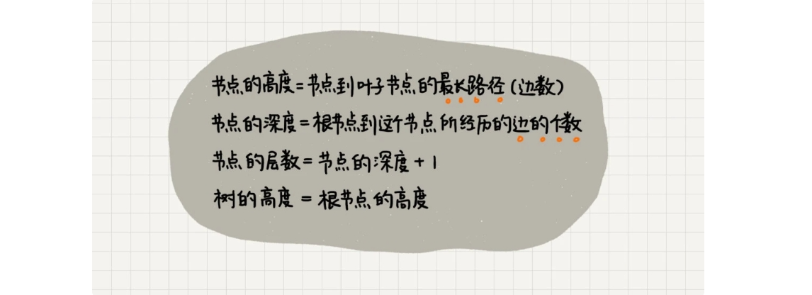

这三个概念的定义比较容易混淆，描述起来也比较空洞。我举个例子说明一下，你一看应该就能明白。


记这几个概念，我还有一个小窍门，就是类比“高度”“深度”“层”这几个名词在生活中的含义。

在我们的生活中，“高度”这个概念，其实就是从下往上度量，比如我们要度量第 10 层楼的高度、第 13 层楼的高度，起点都是地面。所以，树这种数据结构的高度也是一样，从最底层开始计数，并且计数的起点是 0。

“深度”这个概念在生活中是从上往下度量的，比如水中鱼的深度，是从水平面开始度量的。所以，树这种数据结构的深度也是类似的，从根结点开始度量，并且计数起点也是 0。

“层数”跟深度的计算类似，不过，计数起点是 1，也就是说根节点位于第 1 层。

### 二叉树（Binary Tree）

树结构多种多样，不过我们最常用还是二叉树。

二叉树，顾名思义，每个节点最多有两个“叉”，也就是两个子节点，分别是**左子节点**和**右子节点**。不过，二叉树并不要求每个节点都有两个子节点，有的节点只有左子节点，有的节点只有右子节点。我画的这几个都是二叉树。以此类推，你可以想象一下四叉树、八叉树长什么样子。


这个图里面，有两个比较特殊的二叉树，分别是编号 2 和编号 3 这两个。

其中，编号 2 的二叉树中，**叶子节点全都在最底层，除了叶子节点之外，每个节点都有左右两个子节点，**这种二叉树就叫做**满二叉树**。

编号 3 的二叉树中，**叶子节点都在最底下两层，最后一层的叶子节点都靠左排列，并且除了最后一层，其他层的节点个数都要达到最大**，这种二叉树叫做**完全二叉树**。

满二叉树很好理解，也很好识别，但是完全二叉树，有的人可能就分不清了。我画了几个完全二叉树和非完全二叉树的例子，你可以对比着看看。


你可能会说，满二叉树的特征非常明显，我们把它单独拎出来讲，这个可以理解。但是完全二叉树的特征不怎么明显啊，单从长相上来看，完全二叉树并没有特别特殊的地方啊，更像是“芸芸众树”中的一种。

那我们为什么还要特意把它拎出来讲呢？为什么偏偏把最后一层的叶子节点靠左排列的叫完全二叉树？如果靠右排列就不能叫完全二叉树了吗？这个定义的由来或者说目的在哪里？

要理解完全二叉树定义的由来，我们需要先了解，**如何表示（或者存储）一棵二叉树？**

想要存储一棵二叉树，我们有两种方法，一种是基于指针或者引用的二叉链式存储法，一种是基于数组的顺序存储法。

我们先来看比较简单、直观的**链式存储法**。从图中你应该可以很清楚地看到，每个节点有三个字段，其中一个存储数据，另外两个是指向左右子节点的指针。我们只要拎住根节点，就可以通过左右子节点的指针，把整棵树都串起来。这种存储方式我们比较常用。大部分二叉树代码都是通过这种结构来实现的。


我们再来看，**基于数组的顺序存储法**。我们把根节点存储在下标 i = 1 的位置，那左子节点存储在下标 2 * i = 2 的位置，右子节点存储在 2 * i + 1 = 3 的位置。以此类推，B 节点的左子节点存储在 2 * i = 2 * 2 = 4 的位置，右子节点存储在 2 * i + 1 = 2 * 2 + 1 = 5 的位置。


我来总结一下，如果节点 X 存储在数组中下标为 i 的位置，下标为 2 * i 的位置存储的就是左子节点，下标为 2 * i + 1 的位置存储的就是右子节点。反过来，下标为 i/2 的位置存储就是它的父节点。通过这种方式，我们只要知道根节点存储的位置（一般情况下，为了方便计算子节点，根节点会存储在下标为 1 的位置），这样就可以通过下标计算，把整棵树都串起来。

不过，我刚刚举的例子是一棵完全二叉树，所以仅仅“浪费”了一个下标为 0 的存储位置。如果是非完全二叉树，其实会浪费比较多的数组存储空间。你可以看我举的下面这个例子。


所以，如果某棵二叉树是一棵完全二叉树，那用数组存储无疑是最节省内存的一种方式。因为数组的存储方式并不需要像链式存储法那样，要存储额外的左右子节点的指针。这也是为什么完全二叉树会单独拎出来的原因，也是为什么完全二叉树要求最后一层的子节点都靠左的原因。

**当我们讲到堆和堆排序的时候，你会发现，堆其实就是一种完全二叉树，最常用的存储方式就是数组。**

### 二叉树的遍历

前面我讲了二叉树的基本定义和存储方法，现在我们来看二叉树中非常重要的操作，二叉树的遍历。这也是非常常见的面试题。

如何将所有节点都遍历打印出来呢？经典的方法有三种，**前序遍历**、**中序遍历**和**后序遍历**。其中，前、中、后序，表示的是节点与它的左右子树节点遍历打印的先后顺序。

+ 前序遍历是指，对于树中的任意节点来说，先打印这个节点，然后再打印它的左子树，最后打印它的右子树。
+ 中序遍历是指，对于树中的任意节点来说，先打印它的左子树，然后再打印它本身，最后打印它的右子树。
+ 后序遍历是指，对于树中的任意节点来说，先打印它的左子树，然后再打印它的右子树，最后打印这个节点本身。


**实际上，二叉树的前、中、后序遍历就是一个递归的过程。**比如，前序遍历，其实就是先打印根节点，然后再递归地打印左子树，最后递归地打印右子树。

写递归代码的关键，就是看能不能写出递推公式，而写递推公式的关键就是，如果要解决问题 A，就假设子问题 B、C 已经解决，然后再来看如何利用 B、C 来解决 A。所以，我们可以把前、中、后序遍历的递推公式都写出来。

```
前序遍历的递推公式：
preOrder(r) = print r->preOrder(r->left)->preOrder(r->right)

中序遍历的递推公式：
inOrder(r) = inOrder(r->left)->print r->inOrder(r->right)

后序遍历的递推公式：
postOrder(r) = postOrder(r->left)->postOrder(r->right)->print r
```

有了递推公式，代码写起来就简单多了。这三种遍历方式的代码，我都写出来了，你可以看看。

```
void preOrder(Node* root) {
  if (root == null) return;
  print root // 此处为伪代码，表示打印root节点
  preOrder(root->left);
  preOrder(root->right);
}

void inOrder(Node* root) {
  if (root == null) return;
  inOrder(root->left);
  print root // 此处为伪代码，表示打印root节点
  inOrder(root->right);
}

void postOrder(Node* root) {
  if (root == null) return;
  postOrder(root->left);
  postOrder(root->right);
  print root // 此处为伪代码，表示打印root节点
}
```

二叉树的前、中、后序遍历的递归实现是不是很简单？你知道**二叉树遍历的时间复杂度是多少**吗？我们一起来看看。

从我前面画的前、中、后序遍历的顺序图，可以看出来，每个节点最多会被访问三次，所以遍历操作的时间复杂度，跟节点的个数 n 成正比，也就是说**二叉树遍历的时间复杂度是 O(n)**。

### 解答开篇 & 内容小结

今天，我讲了一种非线性表数据结构，树。关于树，有几个比较常用的概念你需要掌握，那就是：根节点、叶子节点、父节点、子节点、兄弟节点，还有节点的高度、深度、层数，以及树的高度。

我们平时最常用的树就是二叉树。二叉树的每个节点最多有两个子节点，分别是左子节点和右子节点。二叉树中，有两种比较特殊的树，分别是满二叉树和完全二叉树。满二叉树又是完全二叉树的一种特殊情况。

二叉树既可以用链式存储，也可以用数组顺序存储。数组顺序存储的方式比较适合完全二叉树，其他类型的二叉树用数组存储会比较浪费存储空间。除此之外，二叉树里非常重要的操作就是前、中、后序遍历操作，遍历的时间复杂度是 O(n)，你需要理解并能用递归代码来实现。

---

## 24.二叉树基础（下）：有了如此高效的散列表，为什么还需要二叉树？

上一节我们学习了树、二叉树以及二叉树的遍历，今天我们再来学习一种特殊的二叉树，二叉查找树。二叉查找树最大的特点就是，支持动态数据集合的快速插入、删除、查找操作。

我们之前说过，散列表也是支持这些操作的，并且散列表的这些操作比二叉查找树更高效，时间复杂度是 O(1)。**既然有了这么高效的散列表，使用二叉树的地方是不是都可以替换成散列表呢？有没有哪些地方是散列表做不了，必须要用二叉树来做的呢？**

带着这些问题，我们就来学习今天的内容，二叉查找树！

### 二叉查找树（Binary Search Tree）

二叉查找树是二叉树中最常用的一种类型，也叫二叉搜索树。顾名思义，二叉查找树是为了实现快速查找而生的。不过，它不仅仅支持快速查找一个数据，还支持快速插入、删除一个数据。它是怎么做到这些的呢？

这些都依赖于二叉查找树的特殊结构**。二叉查找树要求，在树中的任意一个节点，其左子树中的每个节点的值，都要小于这个节点的值，而右子树节点的值都大于这个节点的值。** 我画了几个二叉查找树的例子，你一看应该就清楚了。


前面我们讲到，二叉查找树支持快速查找、插入、删除操作，现在我们就依次来看下，这三个操作是如何实现的。

#### 1. 二叉查找树的查找操作

首先，我们看如何在二叉查找树中查找一个节点。我们先取根节点，如果它等于我们要查找的数据，那就返回。如果要查找的数据比根节点的值小，那就在左子树中递归查找；如果要查找的数据比根节点的值大，那就在右子树中递归查找。


```java
public class BinarySearchTree {
  private Node tree;

  public Node find(int data) {
    Node p = tree;
    while (p != null) {
      if (data < p.data) p = p.left;
      else if (data > p.data) p = p.right;
      else return p;
    }
    return null;
  }

  public static class Node {
    private int data;
    private Node left;
    private Node right;

    public Node(int data) {
      this.data = data;
    }
  }
}
```

#### 2. 二叉查找树的插入操作

二叉查找树的插入过程有点类似查找操作。新插入的数据一般都是在叶子节点上，所以我们只需要从根节点开始，依次比较要插入的数据和节点的大小关系。

如果要插入的数据比节点的数据大，并且节点的右子树为空，就将新数据直接插到右子节点的位置；如果不为空，就再递归遍历右子树，查找插入位置。同理，如果要插入的数据比节点数值小，并且节点的左子树为空，就将新数据插入到左子节点的位置；如果不为空，就再递归遍历左子树，查找插入位置。


```java
public void insert(int data) {
  if (tree == null) {
    tree = new Node(data);
    return;
  }

  Node p = tree;
  while (p != null) {
    if (data > p.data) {
      if (p.right == null) {
        p.right = new Node(data);
        return;
      }
      p = p.right;
    } else { // data < p.data
      if (p.left == null) {
        p.left = new Node(data);
        return;
      }
      p = p.left;
    }
  }
}
```

#### 3. 二叉查找树的删除操作

二叉查找树的查找、插入操作都比较简单易懂，但是它的删除操作就比较复杂了 。针对要删除节点的子节点个数的不同，我们需要分三种情况来处理。

第一种情况是，如果要删除的节点没有子节点，我们只需要直接将父节点中，指向要删除节点的指针置为 null。比如图中的删除节点 55。

第二种情况是，如果要删除的节点只有一个子节点（只有左子节点或者右子节点），我们只需要更新父节点中，指向要删除节点的指针，让它指向要删除节点的子节点就可以了。比如图中的删除节点 13。

第三种情况是，如果要删除的节点有两个子节点，这就比较复杂了。我们需要找到这个节点的右子树中的最小节点，把它替换到要删除的节点上。然后再删除掉这个最小节点，因为最小节点肯定没有左子节点（如果有左子结点，那就不是最小节点了），所以，我们可以应用上面两条规则来删除这个最小节点。比如图中的删除节点 18。


```java
public void delete(int data) {
  Node p = tree; // p指向要删除的节点，初始化指向根节点
  Node pp = null; // pp记录的是p的父节点
  while (p != null && p.data != data) {
    pp = p;
    if (data > p.data) p = p.right;
    else p = p.left;
  }
  if (p == null) return; // 没有找到

  // 要删除的节点有两个子节点
  if (p.left != null && p.right != null) { // 查找右子树中最小节点
    Node minP = p.right;
    Node minPP = p; // minPP表示minP的父节点
    while (minP.left != null) {
      minPP = minP;
      minP = minP.left;
    }
    p.data = minP.data; // 将minP的数据替换到p中
    p = minP; // 下面就变成了删除minP了
    pp = minPP;
  }

  // 删除节点是叶子节点或者仅有一个子节点
  Node child; // p的子节点
  if (p.left != null) child = p.left;
  else if (p.right != null) child = p.right;
  else child = null;

  if (pp == null) tree = child; // 删除的是根节点
  else if (pp.left == p) pp.left = child;
  else pp.right = child;
}
```

实际上，关于二叉查找树的删除操作，还有个非常简单、取巧的方法，就是单纯将要删除的节点标记为“已删除”，但是并不真正从树中将这个节点去掉。这样原本删除的节点还需要存储在内存中，比较浪费内存空间，但是删除操作就变得简单了很多。而且，这种处理方法也并没有增加插入、查找操作代码实现的难度。

#### 4. 二叉查找树的其他操作

除了插入、删除、查找操作之外，二叉查找树中还可以支持**快速地查找最大节点和最小节点、前驱节点和后继节点**。这些操作我就不一一展示了。我会将相应的代码放到 GitHub 上，你可以自己先实现一下，然后再去上面看。

二叉查找树除了支持上面几个操作之外，还有一个重要的特性，就是**中序遍历二叉查找树，可以输出有序的数据序列，时间复杂度是 O(n)，非常高效。**因此，二叉查找树也叫作**二叉排序树**。

### 支持重复数据的二叉查找树

前面讲二叉查找树的时候，我们默认树中节点存储的都是数字。很多时候，在实际的软件开发中，我们在二叉查找树中存储的，是一个包含很多字段的对象。我们利用对象的某个字段作为键值（key）来构建二叉查找树。我们把对象中的其他字段叫作卫星数据。

前面我们讲的二叉查找树的操作，针对的都是不存在键值相同的情况。那如果存储的两个对象键值相同，这种情况该怎么处理呢？我这里有两种解决方法。

第一种方法比较容易。二叉查找树中每一个节点不仅会存储一个数据，因此我们通过**链表和支持动态扩容的数组**等数据结构，把值相同的数据都存储在同一个节点上。

第二种方法比较不好理解，不过更加优雅。

每个节点仍然只存储一个数据。在查找插入位置的过程中，如果碰到一个节点的值，与要插入数据的值相同，我们就将这个要插入的数据放到这个节点的右子树，也就是说，把这个新插入的数据当作大于这个节点的值来处理。


当要查找数据的时候，遇到值相同的节点，我们并不停止查找操作，而是继续在右子树中查找，直到遇到叶子节点，才停止。这样就可以把键值等于要查找值的所有节点都找出来。


对于删除操作，我们也需要先查找到每个要删除的节点，然后再按前面讲的删除操作的方法，依次删除。


### 二叉查找树的时间复杂度分析

好了，对于二叉查找树常用操作的实现方式，你应该掌握得差不多了。现在，我们来分析一下，二叉查找树的插入、删除、查找操作的时间复杂度。

实际上，二叉查找树的形态各式各样。比如这个图中，对于同一组数据，我们构造了三种二叉查找树。它们的查找、插入、删除操作的执行效率都是不一样的。图中第一种二叉查找树，根节点的左右子树极度不平衡，已经退化成了链表，所以查找的时间复杂度就变成了 O(n)。


我刚刚其实分析了一种最糟糕的情况，我们现在来分析一个最理想的情况，二叉查找树是一棵完全二叉树（或满二叉树）。这个时候，插入、删除、查找的时间复杂度是多少呢？

从我前面的例子、图，以及还有代码来看，不管操作是插入、删除还是查找，**时间复杂度其实都跟树的高度成正比，也就是 O(height)。**既然这样，现在问题就转变成另外一个了，也就是，如何求一棵包含 n 个节点的完全二叉树的高度？

树的高度就等于最大层数减一，为了方便计算，我们转换成层来表示。从图中可以看出，包含 n 个节点的完全二叉树中，第一层包含 1 个节点，第二层包含 2 个节点，第三层包含 4 个节点，依次类推，下面一层节点个数是上一层的 2 倍，第 K 层包含的节点个数就是 2^(K-1)。

不过，对于完全二叉树来说，最后一层的节点个数有点儿不遵守上面的规律了。它包含的节点个数在 1 个到 2^(L-1) 个之间（我们假设最大层数是 L）。如果我们把每一层的节点个数加起来就是总的节点个数 n。也就是说，如果节点的个数是 n，那么 n 满足这样一个关系：

```
n >= 1+2+4+8+...+2^(L-2)+1
n <= 1+2+4+8+...+2^(L-2)+2^(L-1)
```

借助等比数列的求和公式，我们可以计算出，L 的范围是[log2(n+1), log2(n) +1]。完全二叉树的层数小于等于 log2n +1，也就是说，完全二叉树的高度小于等于 log2n。

显然，极度不平衡的二叉查找树，它的查找性能肯定不能满足我们的需求。**我们需要构建一种不管怎么删除、插入数据，在任何时候，都能保持任意节点左右子树都比较平衡的二叉查找树**，这就是我们下一节课要详细讲的，一种特殊的二叉查找树，平衡二叉查找树。平衡二叉查找树的高度接近 logn，所以插入、删除、查找操作的时间复杂度也比较稳定，是 O(logn)。

### 解答开篇

我们在散列表那节中讲过，散列表的插入、删除、查找操作的时间复杂度可以做到常量级的 O(1)，非常高效。而二叉查找树在比较平衡的情况下，插入、删除、查找操作时间复杂度才是 O(logn)，相对散列表，好像并没有什么优势，那我们为什么还要用二叉查找树呢？

我认为有下面几个原因：

第一，散列表中的数据是无序存储的，如果要输出有序的数据，需要先进行排序。而对于二叉查找树来说，我们只需要中序遍历，就可以在 O(n) 的时间复杂度内，输出有序的数据序列。

第二，散列表扩容耗时很多，而且当遇到散列冲突时，性能不稳定，尽管二叉查找树的性能不稳定，但是在工程中，我们最常用的平衡二叉查找树的性能非常稳定，时间复杂度稳定在 O(logn)。

第三，笼统地来说，尽管散列表的查找等操作的时间复杂度是常量级的，但因为哈希冲突的存在，这个常量不一定比 logn 小，所以实际的查找速度可能不一定比 O(logn) 快。加上哈希函数的耗时，也不一定就比平衡二叉查找树的效率高。

最后，为了避免过多的散列冲突，散列表装载因子不能太大，特别是基于开放寻址法解决冲突的散列表，不然会浪费一定的存储空间。

综合这几点，平衡二叉查找树在某些方面还是优于散列表的，所以，这两者的存在并不冲突。我们在实际的开发过程中，需要结合具体的需求来选择使用哪一个。

### 内容小结

今天我们学习了一种特殊的二叉树，二叉查找树。它支持快速地查找、插入、删除操作。

二叉查找树中，每个节点的值都大于左子树节点的值，小于右子树节点的值。不过，这只是针对没有重复数据的情况。对于存在重复数据的二叉查找树，我介绍了两种构建方法，一种是让每个节点存储多个值相同的数据；另一种是，每个节点中存储一个数据。针对这种情况，我们只需要稍加改造原来的插入、删除、查找操作即可。

在二叉查找树中，查找、插入、删除等很多操作的时间复杂度都跟树的高度成正比。两个极端情况的时间复杂度分别是 O(n) 和 O(logn)，分别对应二叉树退化成链表的情况和完全二叉树。

为了避免时间复杂度的退化，针对二叉查找树，我们又设计了一种更加复杂的树，平衡二叉查找树，时间复杂度可以做到稳定的 O(logn)，下一节我们具体来讲。

---

## 25.红黑树（上）：为什么工程中都用红黑树这种二叉树？

上两节，我们依次讲了树、二叉树、二叉查找树。二叉查找树是最常用的一种二叉树，它支持快速插入、删除、查找操作，各个操作的时间复杂度跟树的高度成正比，理想情况下，时间复杂度是 O(logn)。

不过，二叉查找树在频繁的动态更新过程中，可能会出现树的高度远大于 log2n 的情况，从而导致各个操作的效率下降。极端情况下，二叉树会退化为链表，时间复杂度会退化到 O(n)。我上一节说了，要解决这个复杂度退化的问题，我们需要设计一种**平衡二叉查找树**，也就是今天要讲的这种数据结构。

很多书籍里，但凡讲到平衡二叉查找树，就会拿红黑树作为例子。不仅如此，如果你有一定的开发经验，你会发现，在工程中，很多用到平衡二叉查找树的地方都会用红黑树。你有没有想过，**为什么工程中都喜欢用红黑树，而不是其他平衡二叉查找树呢？**

带着这个问题，让我们一起来学习今天的内容吧！

### 什么是“平衡二叉查找树”？

平衡二叉树的严格定义是这样的：二叉树中任意一个节点的左右子树的高度相差不能大于 1。从这个定义来看，上一节我们讲的完全二叉树、满二叉树其实都是平衡二叉树，但是非完全二叉树也有可能是平衡二叉树。


平衡二叉查找树不仅满足上面平衡二叉树的定义，还满足二叉查找树的特点。最先被发明的平衡二叉查找树是[AVL 树](https://zh.wikipedia.org/wiki/AVL%E6%A0%91)，它严格符合我刚讲到的平衡二叉查找树的定义，即任何节点的左右子树高度相差不超过 1，是一种高度平衡的二叉查找树。

但是很多平衡二叉查找树其实并没有严格符合上面的定义（树中任意一个节点的左右子树的高度相差不能大于 1），比如我们下面要讲的红黑树，它从根节点到各个叶子节点的最长路径，有可能会比最短路径大一倍。

我们学习数据结构和算法是为了应用到实际的开发中的，所以，我觉得没必去死抠定义。对于平衡二叉查找树这个概念，我觉得我们要从这个数据结构的由来，去理解“平衡”的意思。

发明平衡二叉查找树这类数据结构的初衷是，解决普通二叉查找树在频繁的插入、删除等动态更新的情况下，出现时间复杂度退化的问题。

所以，平衡二叉查找树中“平衡”的意思，其实就是让整棵树左右看起来比较“对称”、比较“平衡”，不要出现左子树很高、右子树很矮的情况。这样就能让整棵树的高度相对来说低一些，相应的插入、删除、查找等操作的效率高一些。

所以，如果我们现在设计一个新的平衡二叉查找树，只要树的高度不比 log2n 大很多（比如树的高度仍然是对数量级的），尽管它不符合我们前面讲的严格的平衡二叉查找树的定义，但我们仍然可以说，这是一个合格的平衡二叉查找树。

### 如何定义一棵“红黑树”？

平衡二叉查找树其实有很多，比如，Splay Tree（伸展树）、Treap（树堆）等，但是我们提到平衡二叉查找树，听到的基本都是红黑树。它的出镜率甚至要高于“平衡二叉查找树”这几个字，有时候，我们甚至默认平衡二叉查找树就是红黑树，那我们现在就来看看这个“明星树”。	

红黑树的英文是“Red-Black Tree”，简称 R-B Tree。它是一种不严格的平衡二叉查找树，我前面说了，它的定义是不严格符合平衡二叉查找树的定义的。那红黑树究竟是怎么定义的呢？

顾名思义，红黑树中的节点，一类被标记为黑色，一类被标记为红色。除此之外，一棵红黑树还需要满足这样几个要求：

+ 根节点是黑色的；
+ 每个叶子节点都是黑色的空节点（NIL），也就是说，叶子节点不存储数据；
+ 任何相邻的节点都不能同时为红色，也就是说，红色节点是被黑色节点隔开的；
+ 每个节点，从该节点到达其可达叶子节点的所有路径，都包含相同数目的黑色节点；

这里的第二点要求“叶子节点都是黑色的空节点”，稍微有些奇怪，它主要是为了简化红黑树的代码实现而设置的，下一节我们讲红黑树的实现的时候会讲到。**这节我们暂时不考虑这一点，所以，在画图和讲解的时候，我将黑色的、空的叶子节点都省略掉了。**

为了让你更好地理解上面的定义，我画了两个红黑树的图例，你可以对照着看下。


### 为什么说红黑树是“近似平衡”的？

我们前面也讲到，平衡二叉查找树的初衷，是为了解决二叉查找树因为动态更新导致的性能退化问题。所以，**“平衡”的意思可以等价为性能不退化。“近似平衡”就等价为性能不会退化得太严重。**

我们在上一节讲过，二叉查找树很多操作的性能都跟树的高度成正比。一棵极其平衡的二叉树（满二叉树或完全二叉树）的高度大约是 log2n，所以如果要证明红黑树是近似平衡的，我们只需要分析，红黑树的高度是否比较稳定地趋近 log2n 就好了。

红黑树的高度不是很好分析，我带你一步一步来推导。

**首先，我们来看，如果我们将红色节点从红黑树中去掉，那单纯包含黑色节点的红黑树的高度是多少呢？**

红色节点删除之后，有些节点就没有父节点了，它们会直接拿这些节点的祖父节点（父节点的父节点）作为父节点。所以，之前的二叉树就变成了四叉树。


前面红黑树的定义里有这么一条：从任意节点到可达的叶子节点的每个路径包含相同数目的黑色节点。我们从四叉树中取出某些节点，放到叶节点位置，四叉树就变成了完全二叉树。所以，仅包含黑色节点的四叉树的高度，比包含相同节点个数的完全二叉树的高度还要小。

上一节我们说，完全二叉树的高度近似 log2n，这里的四叉“黑树”的高度要低于完全二叉树，所以去掉红色节点的“黑树”的高度也不会超过 log2n。

**我们现在知道只包含黑色节点的“黑树”的高度，那我们现在把红色节点加回去，高度会变成多少呢？**

从上面我画的红黑树的例子和定义看，在红黑树中，红色节点不能相邻，也就是说，有一个红色节点就要至少有一个黑色节点，将它跟其他红色节点隔开。红黑树中包含最多黑色节点的路径不会超过 log2n，所以加入红色节点之后，最长路径不会超过 2log2n，也就是说，红黑树的高度近似 2log2n。

所以，红黑树的高度只比高度平衡的 AVL 树的高度（log2n）仅仅大了一倍，在性能上，下降得并不多。这样推导出来的结果不够精确，**实际上红黑树的性能更好。**

### 解答开篇

我们刚刚提到了很多平衡二叉查找树，现在我们就来看下，为什么在工程中大家都喜欢用红黑树这种平衡二叉查找树？

我们前面提到 Treap、Splay Tree，绝大部分情况下，它们操作的效率都很高，但是也无法避免极端情况下时间复杂度的退化。尽管这种情况出现的概率不大，但是对于单次操作时间非常敏感的场景来说，它们并不适用。

AVL 树是一种高度平衡的二叉树，所以查找的效率非常高，但是，有利就有弊，**AVL 树为了维持这种高度的平衡，就要付出更多的代价。**每次插入、删除都要做调整，就比较复杂、耗时。所以，对于有频繁的插入、删除操作的数据集合，使用 AVL 树的代价就有点高了。

红黑树只是做到了近似平衡，并不是严格的平衡，所以在维护平衡的成本上，要比 AVL 树要低。

所以，**红黑树的插入、删除、查找各种操作性能都比较稳定。**对于工程应用来说，要面对各种异常情况，为了支撑这种工业级的应用，我们更倾向于这种性能稳定的平衡二叉查找树。

### 内容小结

很多同学都觉得红黑树很难，的确，它算是最难掌握的一种数据结构。其实红黑树最难的地方是它的实现，我们今天还没有涉及，下一节我会专门来讲。

不过呢，我认为，我们其实不应该把学习的侧重点，放到它的实现上。那你可能要问了，关于红黑树，我们究竟需要掌握哪些东西呢？

还记得我多次说过的观点吗？**我们学习数据结构和算法，要学习它的由来、特性、适用的场景以及它能解决的问题。对于红黑树，也不例外。你如果能搞懂这几个问题，其实就已经足够了。**

红黑树是一种平衡二叉查找树。它是为了解决普通二叉查找树在数据更新的过程中，复杂度退化的问题而产生的。红黑树的高度近似 log2n，所以它是近似平衡，插入、删除、查找操作的时间复杂度都是 O(logn)。

因为红黑树是一种性能非常稳定的二叉查找树，所以，在工程中，但凡是用到动态插入、删除、查找数据的场景，都可以用到它。不过，它实现起来比较复杂，**如果自己写代码实现，难度会有些高，这个时候，我们其实更倾向用跳表来替代它。**

---


## 26. 红黑树（下）：掌握这些技巧，你也可以实现一个红黑树

红黑树是一个让我又爱又恨的数据结构，“爱”是因为它稳定、高效的性能，“恨”是因为实现起来实在太难了。我今天讲的红黑树的实现，对于基础不太好的同学，理解起来可能会有些困难。但是，我觉得没必要去死磕它。

我为什么这么说呢？因为，即便你将左右旋背得滚瓜烂熟，我保证你过不几天就忘光了。因为，学习红黑树的代码实现，对于你平时做项目开发没有太大帮助。对于绝大部分开发工程师来说，这辈子你可能都用不着亲手写一个红黑树。除此之外，它对于算法面试也几乎没什么用，一般情况下，靠谱的面试官也不会让你手写红黑树的。

如果你对数据结构和算法很感兴趣，想要开拓眼界、训练思维，我还是很推荐你看一看这节的内容。但是如果学完今天的内容你还觉得懵懵懂懂的话，也不要纠结。我们要有的放矢去学习。你先把平时要用的、基础的东西都搞会了，如果有余力了，再来深入地研究这节内容。

好，我们现在就进入正式的内容。**上一节，我们讲到红黑树定义的时候，提到红黑树的叶子节点都是黑色的空节点。当时我只是粗略地解释了，这是为了代码实现方便，那更加确切的原因是什么呢？** 我们这节就来说一说。

### 实现红黑树的基本思想

不知道你有没有玩过魔方？其实魔方的复原解法是有固定算法的：遇到哪几面是什么样子，对应就怎么转几下。你只要跟着这个复原步骤，就肯定能将魔方复原。

实际上，红黑树的平衡过程跟魔方复原非常神似，大致过程就是：**遇到什么样的节点排布，我们就对应怎么去调整。**只要按照这些固定的调整规则来操作，就能将一个非平衡的红黑树调整成平衡的。

还记得我们前面讲过的红黑树的定义吗？今天的内容里，我们会频繁用到它，所以，我们现在再来回顾一下。一棵合格的红黑树需要满足这样几个要求：

+ 根节点是黑色的；
+ 每个叶子节点都是黑色的空节点（NIL），也就是说，叶子节点不存储数据；
+ 任何相邻的节点都不能同时为红色，也就是说，红色节点是被黑色节点隔开的；
+ 每个节点，从该节点到达其可达叶子节点的所有路径，都包含相同数目的黑色节点。

在插入、删除节点的过程中，第三、第四点要求可能会被破坏，而我们今天要讲的“平衡调整”，实际上就是要把被破坏的第三、第四点恢复过来。

在正式开始之前，我先介绍两个非常重要的操作，**左旋**（rotate left）、**右旋**（rotate right）。左旋全称其实是叫**围绕某个节点的左旋**，那右旋的全称估计你已经猜到了，就叫**围绕某个节点的右旋**。

我们下面的平衡调整中，会一直用到这两个操作，所以我这里画了个示意图，帮助你彻底理解这两个操作。图中的 a，b，r 表示子树，可以为空。


前面我说了，红黑树的插入、删除操作会破坏红黑树的定义，具体来说就是会破坏红黑树的平衡，所以，我们现在就来看下，红黑树在插入、删除数据之后，如何调整平衡，继续当一棵合格的红黑树的。


---

## 27.递归树：如何借助树来求解递归算法的时间复杂度？


---

## 28.堆和堆排序：为什么说堆排序没有快速排序快？

我们今天讲另外一种特殊的树，“堆”（Heap）。堆这种数据结构的应用场景非常多，最经典的莫过于堆排序了。堆排序是一种**原地的、时间复杂度为 O(nlogn)** 的排序算法。

前面我们学过快速排序，平均情况下，它的时间复杂度为 O(nlogn)。尽管这两种排序算法的时间复杂度都是 O(nlogn)，甚至堆排序比快速排序的时间复杂度还要稳定，但是，**在实际的软件开发中，快速排序的性能要比堆排序好，这是为什么呢？**

现在，你可能还无法回答，甚至对问题本身还有点疑惑。没关系，带着这个问题，我们来学习今天的内容。等你学完之后，或许就能回答出来了。

### 如何理解“堆”？

前面我们提到，堆是一种特殊的树。我们现在就来看看，什么样的树才是堆。我罗列了两点要求，只要满足这两点，它就是一个堆。

+ 堆是一个完全二叉树；
+ 堆中每一个节点的值都必须大于等于（或小于等于）其子树中每个节点的值。

我分别解释一下这两点。

第一点，堆必须是一个完全二叉树。还记得我们之前讲的完全二叉树的定义吗？完全二叉树要求，除了最后一层，其他层的节点个数都是满的，最后一层的节点都靠左排列。

第二点，堆中的每个节点的值必须大于等于（或者小于等于）其子树中每个节点的值。实际上，我们还可以换一种说法，堆中每个节点的值都大于等于（或者小于等于）其左右子节点的值。这两种表述是等价的。

对于每个节点的值都大于等于子树中每个节点值的堆，我们叫做“大顶堆”。对于每个节点的值都小于等于子树中每个节点值的堆，我们叫做“小顶堆”。

定义解释清楚了，你来看看，下面这几个二叉树是不是堆？

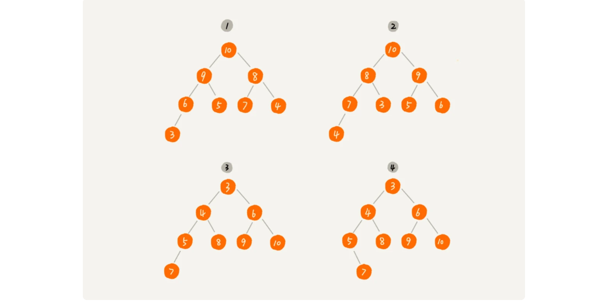

其中第 1 个和第 2 个是大顶堆，第 3 个是小顶堆，第 4 个不是堆。除此之外，从图中还可以看出来，对于同一组数据，我们可以构建多种不同形态的堆。

### 如何实现一个堆？

要实现一个堆，我们先要知道，**堆都支持哪些操作以及如何存储一个堆**。

我之前讲过，完全二叉树比较适合用数组来存储。用数组来存储完全二叉树是非常节省存储空间的。因为我们不需要存储左右子节点的指针，单纯地通过数组的下标，就可以找到一个节点的左右子节点和父节点。

我之前讲过，完全二叉树比较适合用数组来存储。用数组来存储完全二叉树是非常节省存储空间的。因为我们不需要存储左右子节点的指针，单纯地通过数组的下标，就可以找到一个节点的左右子节点和父节点。

我画了一个用数组存储堆的例子，你可以先看下。


从图中我们可以看到，数组中下标为 i 的节点的左子节点，就是下标为 i∗2 的节点，右子节点就是下标为 i∗2+1 的节点，父节点就是下标为 i / 2 的节点。

知道了如何存储一个堆，那我们再来看看，**堆上的操作有哪些呢**？我罗列了几个非常核心的操作，分别是往堆中插入一个元素和删除堆顶元素。（如果没有特殊说明，我下面都是拿大顶堆来讲解）。

#### 1. 往堆中插入一个元素

往堆中插入一个元素后，我们需要继续满足堆的两个特性。

如果我们把新插入的元素放到堆的最后，你可以看我画的这个图，是不是不符合堆的特性了？于是，我们就需要进行调整，让其重新满足堆的特性，这个过程我们起了一个名字，就叫做**堆化**（heapify）。

堆化实际上有两种，从下往上和从上往下。这里我先讲**从下往上**的堆化方法。


堆化非常简单，就是顺着节点所在的路径，向上或者向下，对比，然后交换。

我这里画了一张堆化的过程分解图。我们可以让新插入的节点与父节点对比大小。如果不满足子节点小于等于父节点的大小关系，我们就互换两个节点。一直重复这个过程，直到父子节点之间满足刚说的那种大小关系。


我将上面讲的往堆中插入数据的过程，翻译成了代码，你可以结合着一块看。

```java
public class Heap {
  private int[] a; // 数组，从下标1开始存储数据
  private int n;  // 堆可以存储的最大数据个数
  private int count; // 堆中已经存储的数据个数

  public Heap(int capacity) {
    a = new int[capacity + 1];
    n = capacity;
    count = 0;
  }

  public void insert(int data) {
    if (count >= n) return; // 堆满了
    ++count;
    a[count] = data;
    int i = count;
    while (i/2 > 0 && a[i] > a[i/2]) { // 自下往上堆化
      swap(a, i, i/2); // swap()函数作用：交换下标为i和i/2的两个元素
      i = i/2;
    }
  }
 }
```

#### 2. 删除堆顶元素

从堆的定义的第二条中，任何节点的值都大于等于（或小于等于）子树节点的值，我们可以发现，堆顶元素存储的就是堆中数据的最大值或者最小值。

假设我们构造的是大顶堆，堆顶元素就是最大的元素。当我们删除堆顶元素之后，就需要把第二大的元素放到堆顶，那第二大元素肯定会出现在左右子节点中。然后我们再迭代地删除第二大节点，以此类推，直到叶子节点被删除。

这里我也画了一个分解图。不过这种方法有点问题，就是最后堆化出来的堆并不满足完全二叉树的特性。


实际上，我们稍微改变一下思路，就可以解决这个问题。你看我画的下面这幅图。我们把最后一个节点放到堆顶，然后利用同样的父子节点对比方法。对于不满足父子节点大小关系的，互换两个节点，并且重复进行这个过程，直到父子节点之间满足大小关系为止。这就是**从上往下**的堆化方法。

因为我们移除的是数组中的最后一个元素，而在堆化的过程中，都是交换操作，不会出现数组中的“空洞”，所以这种方法堆化之后的结果，肯定满足完全二叉树的特性。


我把上面的删除过程同样也翻译成了代码，贴在这里，你可以结合着看。

```java
public void removeMax() {
  if (count == 0) return -1; // 堆中没有数据
  a[1] = a[count];
  --count;
  heapify(a, count, 1);
}

private void heapify(int[] a, int n, int i) { // 自上往下堆化
  while (true) {
    int maxPos = i;
    if (i*2 <= n && a[i] < a[i*2]) maxPos = i*2;
    if (i*2+1 <= n && a[maxPos] < a[i*2+1]) maxPos = i*2+1;
    if (maxPos == i) break;
    swap(a, i, maxPos);
    i = maxPos;
  }
}
```

我们知道，一个包含 n 个节点的完全二叉树，树的高度不会超过 log2n。堆化的过程是顺着节点所在路径比较交换的，所以堆化的时间复杂度跟树的高度成正比，也就是 O(logn)。插入数据和删除堆顶元素的主要逻辑就是堆化，所以，往堆中插入一个元素和删除堆顶元素的时间复杂度都是 O(logn)。

### 如何基于堆实现排序？

前面我们讲过好几种排序算法，我们再来回忆一下，有时间复杂度是 O(n2) 的冒泡排序、插入排序、选择排序，有时间复杂度是 O(nlogn) 的归并排序、快速排序，还有线性排序。

这里我们借助于堆这种数据结构实现的排序算法，就叫做堆排序。这种排序方法的时间复杂度非常稳定，是 O(nlogn)，并且它还是原地排序算法。如此优秀，它是怎么做到的呢？

我们可以把堆排序的过程大致分解成两个大的步骤，**建堆**和**排序**。

#### 1. 建堆

我们首先将数组原地建成一个堆。所谓“原地”就是，不借助另一个数组，就在原数组上操作。建堆的过程，有两种思路。

第一种是借助我们前面讲的，在堆中插入一个元素的思路。尽管数组中包含 n 个数据，但是我们可以假设，起初堆中只包含一个数据，就是下标为 1 的数据。然后，我们调用前面讲的插入操作，将下标从 2 到 n 的数据依次插入到堆中。这样我们就将包含 n 个数据的数组，组织成了堆。

第二种实现思路，跟第一种截然相反，也是我这里要详细讲的。第一种建堆思路的处理过程是从前往后处理数组数据，并且每个数据插入堆中时，都是从下往上堆化。而第二种实现思路，是从后往前处理数组，并且每个数据都是从上往下堆化。

我举了一个例子，并且画了一个第二种实现思路的建堆分解步骤图，你可以看下。因为叶子节点往下堆化只能自己跟自己比较，所以我们直接从最后一个非叶子节点开始，依次堆化就行了。


对于程序员来说，看代码可能更好理解一些，所以，我将第二种实现思路翻译成了代码，你可以看下。

```java
private static void buildHeap(int[] a, int n) {
  for (int i = n/2; i >= 1; --i) {
    heapify(a, n, i);
  }
}

private static void heapify(int[] a, int n, int i) {
  while (true) {
    int maxPos = i;
    if (i*2 <= n && a[i] < a[i*2]) maxPos = i*2;
    if (i*2+1 <= n && a[maxPos] < a[i*2+1]) maxPos = i*2+1;
    if (maxPos == i) break;
    swap(a, i, maxPos);
    i = maxPos;
  }
}
```

你可能已经发现了，在这段代码中，我们对下标从 n/2 开始到 1 的数据进行堆化，下标是 n/2+1 到 n 的节点是叶子节点，我们不需要堆化。实际上，对于完全二叉树来说，下标从 n/2+1 到 n 的节点都是叶子节点。

现在，我们来看，建堆操作的时间复杂度是多少呢？

每个节点堆化的时间复杂度是 O(logn)，那 n/2+1 个节点堆化的总时间复杂度是不是就是 O(nlogn) 呢？这个答案虽然也没错，但是这个值还是不够精确。实际上，堆排序的建堆过程的时间复杂度是 O(n)。我带你推导一下。

因为叶子节点不需要堆化，所以需要堆化的节点从倒数第二层开始。每个节点堆化的过程中，需要比较和交换的节点个数，跟这个节点的高度 k 成正比。

我把每一层的节点个数和对应的高度画了出来，你可以看看。我们只需要将每个节点的高度求和，得出的就是建堆的时间复杂度。


我们将每个非叶子节点的高度求和，就是下面这个公式：


这个公式的求解稍微有点技巧，不过我们高中应该都学过：把公式左右都乘以 2，就得到另一个公式 S2。我们将 S2 错位对齐，并且用 S2 减去 S1，可以得到 S。


S 的中间部分是一个等比数列，所以最后可以用等比数列的求和公式来计算，最终的结果就是下面图中画的这个样子。


因为 h=log2n，代入公式 S，就能得到 S=O(n)，所以，建堆的时间复杂度就是 O(n)。

#### 2. 排序

建堆结束之后，数组中的数据已经是按照大顶堆的特性来组织的。数组中的第一个元素就是堆顶，也就是最大的元素。我们把它跟最后一个元素交换，那最大元素就放到了下标为 n 的位置。

这个过程有点类似上面讲的“删除堆顶元素”的操作，当堆顶元素移除之后，我们把下标为 n 的元素放到堆顶，然后再通过堆化的方法，将剩下的 n−1 个元素重新构建成堆。堆化完成之后，我们再取堆顶的元素，放到下标是 n−1 的位置，一直重复这个过程，直到最后堆中只剩下标为 1 的一个元素，排序工作就完成了。

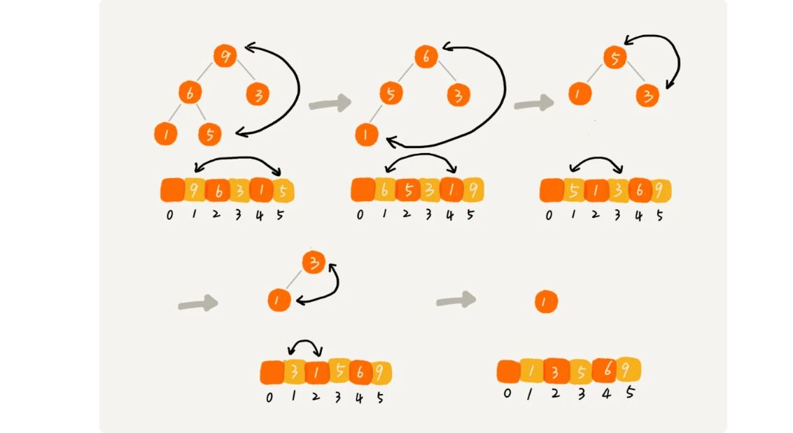

堆排序的过程，我也翻译成了代码。结合着代码看，你理解起来应该会更加容易。

```java
// n表示数据的个数，数组a中的数据从下标1到n的位置。
public static void sort(int[] a, int n) {
  buildHeap(a, n);
  int k = n;
  while (k > 1) {
    swap(a, 1, k);
    --k;
    heapify(a, k, 1);
  }
}
```

现在，我们再来分析一下堆排序的时间复杂度、空间复杂度以及稳定性。

整个堆排序的过程，都只需要极个别临时存储空间，所以堆排序是**原地排序算法**。堆排序包括建堆和排序两个操作，**建堆过程的时间复杂度是 O(n)**，**排序过程的时间复杂度是 O(nlogn)**，所以，堆排序整体的时间复杂度是 O(nlogn)。

堆排序不是稳定的排序算法，因为在排序的过程，存在将堆的最后一个节点跟堆顶节点互换的操作，所以就有可能改变值相同数据的原始相对顺序。

今天的内容到此就讲完了。我这里要稍微解释一下，在前面的讲解以及代码中，我都假设，堆中的数据是从数组下标为 1 的位置开始存储。那如果从 0 开始存储，实际上处理思路是没有任何变化的，唯一变化的，可能就是，代码实现的时候，计算子节点和父节点的下标的公式改变了。

如果节点的下标是 i，那左子节点的下标就是 2∗i+1，右子节点的下标就是 2∗i+2，父节点的下标就是( i - 1) / 2。

### 解答开篇

现在我们来看开篇的问题，在实际开发中，为什么快速排序要比堆排序性能好？

我觉得主要有两方面的原因。

#### 第一点，堆排序数据访问的方式没有快速排序友好。

对于快速排序来说，数据是顺序访问的。而对于堆排序来说，数据是跳着访问的。 比如，堆排序中，最重要的一个操作就是数据的堆化。比如下面这个例子，对堆顶节点进行堆化，会依次访问数组下标是 1，2，4，8 的元素，而不是像快速排序那样，局部顺序访问，所以，这样**对 CPU 缓存是不友好的**。


#### 第二点，对于同样的数据，在排序过程中，堆排序算法的数据交换次数要多于快速排序。

我们在讲排序的时候，提过两个概念，有序度和逆序度。对于基于比较的排序算法来说，整个排序过程就是由两个基本的操作组成的，比较和交换（或移动）。快速排序数据交换的次数不会比逆序度多。

但是堆排序的第一步是建堆，建堆的过程会打乱数据原有的相对先后顺序，导致原数据的有序度降低。比如，对于一组已经有序的数据来说，经过建堆之后，数据反而变得更无序了。


对于第二点，你可以自己做个试验看下。我们用一个记录交换次数的变量，在代码中，每次交换的时候，我们就对这个变量加一，排序完成之后，这个变量的值就是总的数据交换次数。这样你就能很直观地理解我刚刚说的，**堆排序比快速排序交换次数多。**

### 内容小结

今天我们讲了堆这种数据结构。堆是一种完全二叉树。它最大的特性是：每个节点的值都大于等于（或小于等于）其子树节点的值。因此，堆被分成了两类，大顶堆和小顶堆。

堆中比较重要的两个操作是插入一个数据和删除堆顶元素。这两个操作都要用到堆化。插入一个数据的时候，我们把新插入的数据放到数组的最后，然后从下往上堆化；删除堆顶数据的时候，我们把数组中的最后一个元素放到堆顶，然后从上往下堆化。这两个操作时间复杂度都是 O(logn)。

除此之外，我们还讲了堆的一个经典应用，堆排序。堆排序包含两个过程，建堆和排序。我们将下标从 n/2 到 1 的节点，依次进行从上到下的堆化操作，然后就可以将数组中的数据组织成堆这种数据结构。接下来，我们迭代地将堆顶的元素放到堆的末尾，并将堆的大小减一，然后再堆化，重复这个过程，直到堆中只剩下一个元素，整个数组中的数据就都有序排列了。

---

leetcode 703 Top K

## 29.堆的应用：如何快速获取到Top 10最热门的搜索关键词？

搜索引擎的热门搜索排行榜功能你用过吗？你知道这个功能是如何实现的吗？实际上，它的实现并不复杂。搜索引擎每天会接收大量的用户搜索请求，它会把这些用户输入的搜索关键词记录下来，然后再离线地统计分析，得到最热门的 Top 10 搜索关键词。

那请你思考下，**假设现在我们有一个包含 10 亿个搜索关键词的日志文件，如何能快速获取到热门榜 Top 10 的搜索关键词呢？**

这个问题就可以用堆来解决，这也是堆这种数据结构一个非常典型的应用。上一节我们讲了堆和堆排序的一些理论知识，今天我们就来讲一讲，堆这种数据结构几个非常重要的应用：**优先级队列**、**求 Top K** 和**求中位数**。

### 堆的应用一：优先级队列

首先，我们来看第一个应用场景：优先级队列。

优先级队列，顾名思义，它首先应该是一个队列。我们前面讲过，队列最大的特性就是先进先出。不过，在优先级队列中，数据的出队顺序不是先进先出，而是按照优先级来，优先级最高的，最先出队。

如何实现一个优先级队列呢？方法有很多，但是用堆来实现是最直接、最高效的。这是因为，堆和优先级队列非常相似。一个堆就可以看作一个优先级队列。很多时候，它们只是概念上的区分而已。往优先级队列中插入一个元素，就相当于往堆中插入一个元素；从优先级队列中取出优先级最高的元素，就相当于取出堆顶元素。

你可别小看这个优先级队列，它的应用场景非常多。我们后面要讲的很多数据结构和算法都要依赖它。比如，赫夫曼编码、图的最短路径、最小生成树算法等等。不仅如此，很多语言中，都提供了优先级队列的实现，比如，Java 的 PriorityQueue，C++ 的 priority_queue 等。

只讲这些应用场景比较空泛，现在，我举两个具体的例子，让你感受一下优先级队列具体是怎么用的。

#### 1.合并有序小文件

假设我们有 100 个小文件，每个文件的大小是 100MB，每个文件中存储的都是有序的字符串。我们希望将这些 100 个小文件合并成一个有序的大文件。这里就会用到优先级队列。

整体思路有点像归并排序中的合并函数。我们从这 100 个文件中，各取第一个字符串，放入数组中，然后比较大小，把最小的那个字符串放入合并后的大文件中，并从数组中删除。

假设，这个最小的字符串来自于 13.txt 这个小文件，我们就再从这个小文件取下一个字符串，放到数组中，重新比较大小，并且选择最小的放入合并后的大文件，将它从数组中删除。依次类推，直到所有的文件中的数据都放入到大文件为止。

这里我们用数组这种数据结构，来存储从小文件中取出来的字符串。每次从数组中取最小字符串，都需要循环遍历整个数组，显然，这不是很高效。有没有更加高效方法呢？

这里就可以用到优先级队列，也可以说是堆。我们将从小文件中取出来的字符串放入到小顶堆中，那堆顶的元素，也就是优先级队列队首的元素，就是最小的字符串。我们将这个字符串放入到大文件中，并将其从堆中删除。然后再从小文件中取出下一个字符串，放入到堆中。循环这个过程，就可以将 100 个小文件中的数据依次放入到大文件中。

我们知道，删除堆顶数据和往堆中插入数据的时间复杂度都是 O(logn)，n 表示堆中的数据个数，这里就是 100。是不是比原来数组存储的方式高效了很多呢？

#### 2.高性能定时器

假设我们有一个定时器，定时器中维护了很多定时任务，每个任务都设定了一个要触发执行的时间点。定时器每过一个很小的单位时间（比如 1 秒），就扫描一遍任务，看是否有任务到达设定的执行时间。如果到达了，就拿出来执行。


但是，这样每过 1 秒就扫描一遍任务列表的做法比较低效，主要原因有两点：第一，任务的约定执行时间离当前时间可能还有很久，这样前面很多次扫描其实都是徒劳的；第二，每次都要扫描整个任务列表，如果任务列表很大的话，势必会比较耗时。

针对这些问题，我们就可以用优先级队列来解决。我们按照任务设定的执行时间，将这些任务存储在优先级队列中，队列首部（也就是小顶堆的堆顶）存储的是最先执行的任务。

这样，定时器就不需要每隔 1 秒就扫描一遍任务列表了。它拿队首任务的执行时间点，与当前时间点相减，得到一个时间间隔 T。

这个时间间隔 T 就是，从当前时间开始，需要等待多久，才会有第一个任务需要被执行。这样，定时器就可以设定在 T 秒之后，再来执行任务。从当前时间点到（T-1）秒这段时间里，定时器都不需要做任何事情。

当 T 秒时间过去之后，定时器取优先级队列中队首的任务执行。然后再计算新的队首任务的执行时间点与当前时间点的差值，把这个值作为定时器执行下一个任务需要等待的时间。

这样，定时器既不用间隔 1 秒就轮询一次，也不用遍历整个任务列表，性能也就提高了。

### 堆的应用二：利用堆求 Top K

刚刚我们学习了优先级队列，我们现在来看，堆的另外一个非常重要的应用场景，那就是“求 Top K 问题”。

我把这种求 Top K 的问题抽象成两类。一类是针对静态数据集合，也就是说数据集合事先确定，不会再变。另一类是针对动态数据集合，也就是说数据集合事先并不确定，有数据动态地加入到集合中。

针对静态数据，如何在一个包含 n 个数据的数组中，查找前 K 大数据呢？我们可以维护一个大小为 K 的小顶堆，顺序遍历数组，从数组中取出数据与堆顶元素比较。如果比堆顶元素大，我们就把堆顶元素删除，并且将这个元素插入到堆中；如果比堆顶元素小，则不做处理，继续遍历数组。这样等数组中的数据都遍历完之后，堆中的数据就是前 K 大数据了。

遍历数组需要 O(n) 的时间复杂度，一次堆化操作需要 O(logK) 的时间复杂度，所以最坏情况下，n 个元素都入堆一次，时间复杂度就是 O(nlogK)。

针对动态数据求得 Top K 就是实时 Top K。怎么理解呢？我举一个例子。一个数据集合中有两个操作，一个是添加数据，另一个询问当前的前 K 大数据。

如果每次询问前 K 大数据，我们都基于当前的数据重新计算的话，那时间复杂度就是 O(nlogK)，n 表示当前的数据的大小。实际上，我们可以一直都维护一个 K 大小的小顶堆，当有数据被添加到集合中时，我们就拿它与堆顶的元素对比。如果比堆顶元素大，我们就把堆顶元素删除，并且将这个元素插入到堆中；如果比堆顶元素小，则不做处理。这样，无论任何时候需要查询当前的前 K 大数据，我们都可以立刻返回给他。

### 堆的应用三：利用堆求中位数

前面我们讲了如何求 Top K 的问题，现在我们来讲下，如何求动态数据集合中的中位数。

中位数，顾名思义，就是处在中间位置的那个数。如果数据的个数是奇数，把数据从小到大排列，那第 n/2+1 个数据就是中位数（注意：假设数据是从 0 开始编号的）；如果数据的个数是偶数的话，那处于中间位置的数据有两个，第 n/2 个和第 n/2+1 个数据，这个时候，我们可以随意取一个作为中位数，比如取两个数中靠前的那个，就是第 n/2 个数据。


对于一组**静态数据**，中位数是固定的，我们可以先排序，第 n/2 个数据就是中位数。每次询问中位数的时候，我们直接返回这个固定的值就好了。所以，尽管排序的代价比较大，但是边际成本会很小。但是，如果我们面对的是**动态数据**集合，中位数在不停地变动，如果再用先排序的方法，每次询问中位数的时候，都要先进行排序，那效率就不高了。

**借助堆这种数据结构，我们不用排序，就可以非常高效地实现求中位数操作。我们来看看，它是如何做到的？**

我们需要维护两个堆，一个大顶堆，一个小顶堆。大顶堆中存储前半部分数据，小顶堆中存储后半部分数据，且小顶堆中的数据都大于大顶堆中的数据。

也就是说，如果有 n 个数据，n 是偶数，我们从小到大排序，那前 n/2 个数据存储在大顶堆中，后 n/2 个数据存储在小顶堆中。这样，大顶堆中的堆顶元素就是我们要找的中位数。如果 n 是奇数，情况是类似的，大顶堆就存储 n/2+1 个数据，小顶堆中就存储 n/2 个数据。


我们前面也提到，数据是动态变化的，当新添加一个数据的时候，我们如何调整两个堆，让大顶堆中的堆顶元素继续是中位数呢？

如果新加入的数据小于等于大顶堆的堆顶元素，我们就将这个新数据插入到大顶堆；否则，我们就将这个新数据插入到小顶堆。

这个时候就有可能出现，两个堆中的数据个数不符合前面约定的情况：如果 n 是偶数，两个堆中的数据个数都是 n/2；如果 n 是奇数，大顶堆有 n/2+1 个数据，小顶堆有 n/2 个数据。这个时候，我们可以从一个堆中不停地将堆顶元素移动到另一个堆，通过这样的调整，来让两个堆中的数据满足上面的约定。


于是，我们就可以利用两个堆，一个大顶堆、一个小顶堆，实现在动态数据集合中求中位数的操作。插入数据因为需要涉及堆化，所以时间复杂度变成了 O(logn)，但是求中位数我们只需要返回大顶堆的堆顶元素就可以了，所以时间复杂度就是 O(1)。

实际上，利用两个堆不仅可以快速求出中位数，还可以快速求其他百分位的数据，原理是类似的。还记得我们在“为什么要学习数据结构与算法”里的这个问题吗？“如何快速求接口的 99% 响应时间？”我们现在就来看下，利用两个堆如何来实现。

在开始这个问题的讲解之前，我先解释一下，什么是“99% 响应时间”。

中位数的概念就是将数据从小到大排列，处于中间位置，就叫中位数，这个数据会大于等于前面 50% 的数据。99 百分位数的概念可以类比中位数，如果将一组数据从小到大排列，这个 99 百分位数就是大于前面 99% 数据的那个数据。

如果你还是不太理解，我再举个例子。假设有 100 个数据，分别是 1，2，3，……，100，那 99 百分位数就是 99，因为小于等于 99 的数占总个数的 99%。


弄懂了这个概念，我们再来看 99% 响应时间。如果有 100 个接口访问请求，每个接口请求的响应时间都不同，比如 55 毫秒、100 毫秒、23 毫秒等，我们把这 100 个接口的响应时间按照从小到大排列，排在第 99 的那个数据就是 99% 响应时间，也叫 99 百分位响应时间。

我们总结一下，如果有 n 个数据，将数据从小到大排列之后，99 百分位数大约就是第 n * 99% 个数据，同类，80 百分位数大约就是第 n * 80% 个数据。

弄懂了这些，我们再来看如何求 99% 响应时间。

我们维护两个堆，一个大顶堆，一个小顶堆。假设当前总数据的个数是 n，大顶堆中保存 n * 99% 个数据，小顶堆中保存 n * 1% 个数据。大顶堆堆顶的数据就是我们要找的 99% 响应时间。

每次插入一个数据的时候，我们要判断这个数据跟大顶堆和小顶堆堆顶数据的大小关系，然后决定插入到哪个堆中。如果这个新插入的数据比大顶堆的堆顶数据小，那就插入大顶堆；如果这个新插入的数据比小顶堆的堆顶数据大，那就插入小顶堆。

但是，为了保持大顶堆中的数据占 99%，小顶堆中的数据占 1%，在每次新插入数据之后，我们都要重新计算，这个时候大顶堆和小顶堆中的数据个数，是否还符合 99:1 这个比例。如果不符合，我们就将一个堆中的数据移动到另一个堆，直到满足这个比例。移动的方法类似前面求中位数的方法，这里我就不啰嗦了。

通过这样的方法，每次插入数据，可能会涉及几个数据的堆化操作，所以时间复杂度是 O(logn)。每次求 99% 响应时间的时候，直接返回大顶堆中的堆顶数据即可，时间复杂度是 O(1)。

### 解答开篇

学懂了上面的一些应用场景的处理思路，我想你应该能解决开篇的那个问题了吧。假设现在我们有一个包含 10 亿个搜索关键词的日志文件，如何快速获取到 Top 10 最热门的搜索关键词呢？

处理这个问题，有很多高级的解决方法，比如使用 MapReduce 等。但是，如果我们将处理的场景限定为单机，可以使用的内存为 1GB。那这个问题该如何解决呢？

因为用户搜索的关键词，有很多可能都是重复的，所以我们首先要统计每个搜索关键词出现的频率。我们可以通过散列表、平衡二叉查找树或者其他一些支持快速查找、插入的数据结构，来记录关键词及其出现的次数。

假设我们选用散列表。我们就顺序扫描这 10 亿个搜索关键词。当扫描到某个关键词时，我们去散列表中查询。如果存在，我们就将对应的次数加一；如果不存在，我们就将它插入到散列表，并记录次数为 1。以此类推，等遍历完这 10 亿个搜索关键词之后，散列表中就存储了不重复的搜索关键词以及出现的次数。

然后，我们再根据前面讲的用堆求 Top K 的方法，建立一个大小为 10 的小顶堆，遍历散列表，依次取出每个搜索关键词及对应出现的次数，然后与堆顶的搜索关键词对比。如果出现次数比堆顶搜索关键词的次数多，那就删除堆顶的关键词，将这个出现次数更多的关键词加入到堆中。

以此类推，当遍历完整个散列表中的搜索关键词之后，堆中的搜索关键词就是出现次数最多的 Top 10 搜索关键词了。

不知道你发现了没有，上面的解决思路其实存在漏洞。10 亿的关键词还是很多的。我们假设 10 亿条搜索关键词中不重复的有 1 亿条，如果每个搜索关键词的平均长度是 50 个字节，那存储 1 亿个关键词起码需要 5GB 的内存空间，而散列表因为要避免频繁冲突，不会选择太大的装载因子，所以消耗的内存空间就更多了。而我们的机器只有 1GB 的可用内存空间，所以我们无法一次性将所有的搜索关键词加入到内存中。这个时候该怎么办呢？

我们在哈希算法那一节讲过，相同数据经过哈希算法得到的哈希值是一样的。我们可以根据哈希算法的这个特点，将 10 亿条搜索关键词先通过哈希算法分片到 10 个文件中。

具体可以这样做：我们创建 10 个空文件 00，01，02，……，09。我们遍历这 10 亿个关键词，并且通过某个哈希算法对其求哈希值，然后哈希值同 10 取模，得到的结果就是这个搜索关键词应该被分到的文件编号。

对这 10 亿个关键词分片之后，每个文件都只有 1 亿的关键词，去除掉重复的，可能就只有 1000 万个，每个关键词平均 50 个字节，所以总的大小就是 500MB。1GB 的内存完全可以放得下。

我们针对每个包含 1 亿条搜索关键词的文件，利用散列表和堆，分别求出 Top 10，然后把这个 10 个 Top 10 放在一块，然后取这 100 个关键词中，出现次数最多的 10 个关键词，这就是这 10 亿数据中的 Top 10 最频繁的搜索关键词了。

### 内容小结

我们今天主要讲了堆的几个重要的应用，它们分别是：优先级队列、求 Top K 问题和求中位数问题。

优先级队列是一种特殊的队列，优先级高的数据先出队，而不再像普通的队列那样，先进先出。实际上，堆就可以看作优先级队列，只是称谓不一样罢了。求 Top K 问题又可以分为针对静态数据和针对动态数据，只需要利用一个堆，就可以做到非常高效率地查询 Top K 的数据。求中位数实际上还有很多变形，比如求 99 百分位数据、90 百分位数据等，处理的思路都是一样的，即利用两个堆，一个大顶堆，一个小顶堆，随着数据的动态添加，动态调整两个堆中的数据，最后大顶堆的堆顶元素就是要求的数据。

---

## 30.图的表示：如何存储微博、微信等社交网络中的好友关系？

微博、微信、LinkedIn 这些社交软件我想你肯定都玩过吧。在微博中，两个人可以互相关注；在微信中，两个人可以互加好友。那你知道，**如何存储微博、微信等这些社交网络的好友关系吗？**

这就要用到我们今天要讲的这种数据结构：**图**。实际上，涉及图的算法有很多，也非常复杂，比如图的搜索、最短路径、最小生成树、二分图等等。我们今天聚焦在图存储这一方面，后面会分好几节来依次讲解图相关的算法。

### 如何理解“图”？

我们前面讲过了树这种非线性表数据结构，今天我们要讲另一种非线性表数据结构，**图**（Graph）。和树比起来，这是一种更加复杂的非线性表结构。

我们知道，树中的元素我们称为节点，图中的元素我们就叫做**顶点**（vertex）。从我画的图中可以看出来，图中的一个顶点可以与任意其他顶点建立连接关系。我们把这种建立的关系叫做**边**（edge）。


我们生活中就有很多符合图这种结构的例子。比如，开篇问题中讲到的社交网络，就是一个非常典型的图结构。

我们就拿微信举例子吧。我们可以把每个用户看作一个顶点。如果两个用户之间互加好友，那就在两者之间建立一条边。所以，整个微信的好友关系就可以用一张图来表示。其中，每个用户有多少个好友，对应到图中，就叫做顶点的**度**（degree），就是跟顶点相连接的边的条数。

实际上，微博的社交关系跟微信还有点不一样，或者说更加复杂一点。微博允许单向关注，也就是说，用户 A 关注了用户 B，但用户 B 可以不关注用户 A。那我们如何用图来表示这种单向的社交关系呢？

我们可以把刚刚讲的图结构稍微改造一下，引入边的“方向”的概念。

如果用户 A 关注了用户 B，我们就在图中画一条从 A 到 B 的带箭头的边，来表示边的方向。如果用户 A 和用户 B 互相关注了，那我们就画一条从 A 指向 B 的边，再画一条从 B 指向 A 的边。我们把这种边有方向的图叫做“有向图”。以此类推，我们把边没有方向的图就叫做“无向图”。


我们刚刚讲过，无向图中有“度”这个概念，表示一个顶点有多少条边。在有向图中，我们把度分为**入度**（In-degree）和**出度**（Out-degree）。

顶点的入度，表示有多少条边指向这个顶点；顶点的出度，表示有多少条边是以这个顶点为起点指向其他顶点。对应到微博的例子，入度就表示有多少粉丝，出度就表示关注了多少人。

前面讲到了微信、微博、无向图、有向图，现在我们再来看另一种社交软件：QQ。

QQ 中的社交关系要更复杂一点。不知道你有没有留意过 QQ 亲密度这样一个功能。QQ 不仅记录了用户之间的好友关系，还记录了两个用户之间的亲密度，如果两个用户经常往来，那亲密度就比较高；如果不经常往来，亲密度就比较低。如何在图中记录这种好友关系的亲密度呢？

这里就要用到另一种图，**带权图**（weighted graph）。在带权图中，每条边都有一个权重（weight），我们可以通过这个权重来表示 QQ 好友间的亲密度。


关于图的概念比较多，我今天也只是介绍了几个常用的，理解起来都不复杂，不知道你都掌握了没有？掌握了图的概念之后，我们再来看下，如何在内存中存储图这种数据结构呢？

### 邻接矩阵存储方法

图最直观的一种存储方法就是，**邻接矩阵**（Adjacency Matrix）。

邻接矩阵的底层依赖一个二维数组。对于无向图来说，如果顶点 i 与顶点 j 之间有边，我们就将 A[i][j]和 A[j][i]标记为 1；对于有向图来说，如果顶点 i 到顶点 j 之间，有一条箭头从顶点 i 指向顶点 j 的边，那我们就将 A[i][j]标记为 1。同理，如果有一条箭头从顶点 j 指向顶点 i 的边，我们就将 A[j][i]标记为 1。对于带权图，数组中就存储相应的权重。


用邻接矩阵来表示一个图，虽然简单、直观，但是比较浪费存储空间。为什么这么说呢？

对于无向图来说，如果 A[i][j]等于 1，那 A[j][i]也肯定等于 1。实际上，我们只需要存储一个就可以了。也就是说，无向图的二维数组中，如果我们将其用对角线划分为上下两部分，那我们只需要利用上面或者下面这样一半的空间就足够了，另外一半白白浪费掉了。

还有，如果我们存储的是**稀疏图**（Sparse Matrix），也就是说，顶点很多，但每个顶点的边并不多，那邻接矩阵的存储方法就更加浪费空间了。比如微信有好几亿的用户，对应到图上就是好几亿的顶点。但是每个用户的好友并不会很多，一般也就三五百个而已。如果我们用邻接矩阵来存储，那绝大部分的存储空间都被浪费了。

但这也并不是说，邻接矩阵的存储方法就完全没有优点。首先，邻接矩阵的存储方式简单、直接，因为基于数组，所以**在获取两个顶点的关系时，就非常高效**。其次，用邻接矩阵存储图的另外一个好处是**方便计算**。这是因为，用邻接矩阵的方式存储图，可以将很多图的运算转换成矩阵之间的运算。比如求解最短路径问题时会提到一个Floyd-Warshall 算法，就是利用矩阵循环相乘若干次得到结果。

### 邻接表存储方法

针对上面邻接矩阵比较浪费内存空间的问题，我们来看另外一种图的存储方法，**邻接表**（Adjacency List）。

我画了一张邻接表的图，你可以先看下。乍一看，邻接表是不是有点像散列表？每个顶点对应一条链表，链表中存储的是与这个顶点相连接的其他顶点。另外我需要说明一下，图中画的是一个有向图的邻接表存储方式，每个顶点对应的链表里面，存储的是指向的顶点。对于无向图来说，也是类似的，不过，每个顶点的链表中存储的，是跟这个顶点有边相连的顶点，你可以自己画下。


还记得我们之前讲过的时间、空间复杂度互换的设计思想吗？邻接矩阵存储起来比较浪费空间，但是使用起来比较节省时间。相反，邻接表存储起来比较节省空间，但是使用起来就比较耗时间。

就像图中的例子，如果我们要确定，是否存在一条从顶点 2 到顶点 4 的边，那我们就要遍历顶点 2 对应的那条链表，看链表中是否存在顶点 4。而且，我们前面也讲过，**链表的存储方式对缓存不友好**。所以，比起邻接矩阵的存储方式，在邻接表中查询两个顶点之间的关系就没那么高效了。

在散列表那几节里，我讲到，在基于链表法解决冲突的散列表中，如果链过长，为了提高查找效率，我们可以将链表换成其他更加高效的数据结构，比如平衡二叉查找树等。我们刚刚也讲到，邻接表长得很像散列。所以，我们也可以将邻接表同散列表一样进行“改进升级”。

我们可以将邻接表中的链表改成平衡二叉查找树。实际开发中，我们可以选择用红黑树。这样，我们就可以更加快速地查找两个顶点之间是否存在边了。当然，这里的二叉查找树可以换成其他动态数据结构，比如跳表、散列表等。除此之外，我们还可以将链表改成有序动态数组，可以通过二分查找的方法来快速定位两个顶点之间否是存在边。

### 解答开篇

有了前面讲的理论知识，现在我们回过头来看开篇的问题，如何存储微博、微信等社交网络中的好友关系？

前面我们分析了，微博、微信是两种“图”，前者是有向图，后者是无向图。在这个问题上，两者的解决思路差不多，所以我只拿微博来讲解。

数据结构是为算法服务的，所以具体选择哪种存储方法，与期望支持的操作有关系。针对微博用户关系，假设我们需要支持下面这样几个操作：

+ 判断用户 A 是否关注了用户 B；
+ 判断A是否被B关注;
+ 用户 A 关注用户 B；
+ 用户 A 取消关注用户 B；
+ 根据用户名称的首字母排序，分页获取用户的粉丝列表；
+ 根据用户名称的首字母排序，分页获取用户的关注列表。

关于如何存储一个图，前面我们讲到两种主要的存储方法，邻接矩阵和邻接表。因为社交网络是一张稀疏图，使用邻接矩阵存储比较浪费存储空间。所以，这里我们采用邻接表来存储。

基于此，我们需要一个逆邻接表。邻接表中存储了用户的关注关系，逆邻接表中存储的是用户的被关注关系。对应到图上，邻接表中，每个顶点的链表中，存储的就是这个顶点指向的顶点，逆邻接表中，每个顶点的链表中，存储的是指向这个顶点的顶点。如果要查找某个用户关注了哪些用户，我们可以在邻接表中查找；如果要查找某个用户被哪些用户关注了，我们从逆邻接表中查找。


基础的邻接表不适合快速判断两个用户之间是否是关注与被关注的关系，所以我们选择改进版本，将邻接表中的链表改为支持快速查找的动态数据结构。选择哪种动态数据结构呢？红黑树、跳表、有序动态数组还是散列表呢？

因为我们需要按照用户名称的首字母排序，分页来获取用户的粉丝列表或者关注列表，用跳表这种结构再合适不过了。这是因为，跳表插入、删除、查找都非常高效，时间复杂度是 O(logn)，空间复杂度上稍高，是 O(n)。最重要的一点，**跳表中存储的数据本来就是有序的了**，分页获取粉丝列表或关注列表，就非常高效。

如果对于小规模的数据，比如社交网络中只有几万、几十万个用户，我们可以将整个社交关系存储在内存中，上面的解决思路是没有问题的。但是如果像微博那样有上亿的用户，数据规模太大，我们就无法全部存储在内存中了。这个时候该怎么办呢？

我们可以通过哈希算法等数据分片方式，将邻接表存储在不同的机器上。你可以看下面这幅图，我们在机器 1 上存储顶点 1，2，3 的邻接表，在机器 2 上，存储顶点 4，5 的邻接表。逆邻接表的处理方式也一样。当要查询顶点与顶点关系的时候，我们就利用同样的哈希算法，先定位顶点所在的机器，然后再在相应的机器上查找。


除此之外，我们还有另外一种解决思路，就是利用外部存储（比如硬盘），因为外部存储的存储空间要比内存会宽裕很多。数据库是我们经常用来持久化存储关系数据的，所以我这里介绍一种数据库的存储方式。

我用下面这张表来存储这样一个图。为了高效地支持前面定义的操作，我们可以在表上建立多个索引，比如第一列、第二列，给这两列都建立索引。


### 内容小结

今天我们学习了图这种非线性表数据结构，关于图，你需要理解这样几个概念：无向图、有向图、带权图、顶点、边、度、入度、出度。除此之外，我们还学习了图的两个主要的存储方式：邻接矩阵和邻接表。

邻接矩阵存储方法的缺点是比较浪费空间，但是优点是查询效率高，而且方便矩阵运算。邻接表存储方法中每个顶点都对应一个链表，存储与其相连接的其他顶点。尽管邻接表的存储方式比较节省存储空间，但链表不方便查找，所以查询效率没有邻接矩阵存储方式高。针对这个问题，邻接表还有改进升级版，即将链表换成更加高效的动态数据结构，比如平衡二叉查找树、跳表、散列表等。

---

## 31.深度和广度优先搜索：如何找出社交网络中的三度好友关系？

上一节我们讲了图的表示方法，讲到如何用有向图、无向图来表示一个社交网络。在社交网络中，有一个六度分割理论，具体是说，你与世界上的另一个人间隔的关系不会超过六度，也就是说平均只需要六步就可以联系到任何两个互不相识的人。

一个用户的一度连接用户很好理解，就是他的好友，二度连接用户就是他好友的好友，三度连接用户就是他好友的好友的好友。在社交网络中，我们往往通过用户之间的连接关系，来实现推荐“可能认识的人”这么一个功能。今天的开篇问题就是，**给你一个用户，如何找出这个用户的所有三度（其中包含一度、二度和三度）好友关系？**

这就要用到今天要讲的深度优先和广度优先搜索算法。

### 什么是“搜索”算法？

我们知道，算法是作用于具体数据结构之上的，深度优先搜索算法和广度优先搜索算法都是基于“图”这种数据结构的。这是因为，图这种数据结构的表达能力很强，大部分涉及搜索的场景都可以抽象成“图”。

图上的搜索算法，最直接的理解就是，在图中找出从一个顶点出发，到另一个顶点的路径。具体方法有很多，比如今天要讲的两种最简单、最“暴力”的深度优先、广度优先搜索，还有 A*、IDA* 等启发式搜索算法。

我们上一节讲过，图有两种主要存储方法，邻接表和邻接矩阵。今天我会用邻接表来存储图。

我这里先给出图的代码实现。需要说明一下，深度优先搜索算法和广度优先搜索算法，既可以用在无向图，也可以用在有向图上。在今天的讲解中，我都针对无向图来讲解。

```java
public class Graph { // 无向图
  private int v; // 顶点的个数
  private LinkedList<Integer> adj[]; // 邻接表

  public Graph(int v) {
    this.v = v;
    adj = new LinkedList[v];
    for (int i=0; i<v; ++i) {
      adj[i] = new LinkedList<>();
    }
  }

  public void addEdge(int s, int t) { // 无向图一条边存两次
    adj[s].add(t);
    adj[t].add(s);
  }
}
```

### 广度优先搜索（BFS）

广度优先搜索（Breadth-First-Search），我们平常都简称 BFS。直观地讲，它其实就是一种“地毯式”层层推进的搜索策略，即先查找离起始顶点最近的，然后是次近的，依次往外搜索。理解起来并不难，所以我画了一张示意图，你可以看下。


尽管广度优先搜索的原理挺简单，但代码实现还是稍微有点复杂度。所以，我们重点讲一下它的代码实现。

这里面，bfs() 函数就是基于之前定义的，图的广度优先搜索的代码实现。其中 s 表示起始顶点，t 表示终止顶点。我们搜索一条从 s 到 t 的路径。实际上，这样求得的路径就是从 s 到 t 的最短路径。

```java
public void bfs(int s, int t) {
  if (s == t) return;
  boolean[] visited = new boolean[v];
  visited[s]=true;
  Queue<Integer> queue = new LinkedList<>();
  queue.add(s);
  int[] prev = new int[v];
  for (int i = 0; i < v; ++i) {
    prev[i] = -1;
  }
  while (queue.size() != 0) {
    int w = queue.poll();
   for (int i = 0; i < adj[w].size(); ++i) {
      int q = adj[w].get(i);
      if (!visited[q]) {
        prev[q] = w;
        if (q == t) {
          print(prev, s, t);
          return;
        }
        visited[q] = true;
        queue.add(q);
      }
    }
  }
}

private void print(int[] prev, int s, int t) { // 递归打印s->t的路径
  if (prev[t] != -1 && t != s) {
    print(prev, s, prev[t]);
  }
  System.out.print(t + " ");
}
```

这段代码不是很好理解，里面有三个重要的辅助变量 visited、queue、prev。只要理解这三个变量，读懂这段代码估计就没什么问题了。

**visited** 是用来记录已经被访问的顶点，用来避免顶点被重复访问。如果顶点 q 被访问，那相应的 visited[q]会被设置为 true。

**queue** 是一个队列，用来存储已经被访问、但相连的顶点还没有被访问的顶点。因为广度优先搜索是逐层访问的，也就是说，我们只有把第 k 层的顶点都访问完成之后，才能访问第 k+1 层的顶点。当我们访问到第 k 层的顶点的时候，我们需要把第 k 层的顶点记录下来，稍后才能通过第 k 层的顶点来找第 k+1 层的顶点。所以，我们用这个队列来实现记录的功能。

**prev** 用来记录搜索路径。当我们从顶点 s 开始，广度优先搜索到顶点 t 后，prev 数组中存储的就是搜索的路径。不过，这个路径是反向存储的。prev[w]存储的是，顶点 w 是从哪个前驱顶点遍历过来的。比如，我们通过顶点 2 的邻接表访问到顶点 3，那 prev[3]就等于 2。为了正向打印出路径，我们需要递归地来打印，你可以看下 print() 函数的实现方式。

为了方便你理解，我画了一个广度优先搜索的分解图，你可以结合着代码以及我的讲解一块儿看。


掌握了广度优先搜索算法的原理，我们来看下，广度优先搜索的时间、空间复杂度是多少呢？

最坏情况下，终止顶点 t 离起始顶点 s 很远，需要遍历完整个图才能找到。这个时候，每个顶点都要进出一遍队列，每个边也都会被访问一次，所以，广度优先搜索的时间复杂度是 O(V+E)，其中，V 表示顶点的个数，E 表示边的个数。当然，对于一个连通图来说，也就是说一个图中的所有顶点都是连通的，E 肯定要大于等于 V-1，所以，广度优先搜索的时间复杂度也可以简写为 O(E)。

广度优先搜索的空间消耗主要在几个辅助变量 visited 数组、queue 队列、prev 数组上。这三个存储空间的大小都不会超过顶点的个数，所以空间复杂度是 O(V)。

### 深度优先搜索（DFS）

深度优先搜索（Depth-First-Search），简称 DFS。最直观的例子就是“走迷宫”。

假设你站在迷宫的某个岔路口，然后想找到出口。你随意选择一个岔路口来走，走着走着发现走不通的时候，你就回退到上一个岔路口，重新选择一条路继续走，直到最终找到出口。这种走法就是一种深度优先搜索策略。

你可以看我画的这幅图。搜索的起始顶点是 s，终止顶点是 t，我们希望在图中寻找一条从顶点 s 到顶点 t 的路径。如果映射到迷宫那个例子，s 就是你起始所在的位置，t 就是出口。

我用深度递归算法，把整个搜索的路径标记出来了。这里面实线箭头表示遍历，虚线箭头表示回退。从图中我们可以看出，深度优先搜索找出来的路径，并不是顶点 s 到顶点 t 的最短路径。


实际上，深度优先搜索用的是一种比较著名的算法思想，**回溯**思想。这种思想解决问题的过程，非常适合用递归来实现。回溯思想我们后面会有专门的一节来讲，我们现在还回到深度优先搜索算法上。

我把上面的过程用递归来翻译出来，就是下面这个样子。我们发现，深度优先搜索代码实现也用到了 prev、visited 变量以及 print() 函数，它们跟广度优先搜索代码实现里的作用是一样的。不过，深度优先搜索代码实现里，有个比较特殊的变量 found，它的作用是，当我们已经找到终止顶点 t 之后，我们就不再递归地继续查找了。

```java
boolean found = false; // 全局变量或者类成员变量

public void dfs(int s, int t) {
  found = false;
  boolean[] visited = new boolean[v];
  int[] prev = new int[v];
  for (int i = 0; i < v; ++i) {
    prev[i] = -1;
  }
  recurDfs(s, t, visited, prev);
  print(prev, s, t);
}

private void recurDfs(int w, int t, boolean[] visited, int[] prev) {
  if (found == true) return;
  visited[w] = true;
  if (w == t) {
    found = true;
    return;
  }
  for (int i = 0; i < adj[w].size(); ++i) {
    int q = adj[w].get(i);
    if (!visited[q]) {
      prev[q] = w;
      recurDfs(q, t, visited, prev);
    }
  }
}
```

(可以把dfs返回值改成boolean，修改一下就可以省去found的逻辑)

理解了深度优先搜索算法之后，我们来看，深度优先搜索的时间、空间复杂度是多少呢？

从我前面画的图可以看出，每条边最多会被访问两次，一次是遍历，一次是回退。所以，图上的深度优先搜索算法的时间复杂度是 O(E)，E 表示边的个数。

深度优先搜索算法的消耗内存主要是 visited、prev 数组和递归调用栈。visited、prev 数组的大小跟顶点的个数 V 成正比，递归调用栈的最大深度不会超过顶点的个数，所以总的空间复杂度就是 O(V)。

深度优先搜索算法的消耗内存主要是 visited、prev 数组和递归调用栈。visited、prev 数组的大小跟顶点的个数 V 成正比，递归调用栈的最大深度不会超过顶点的个数，所以总的空间复杂度就是 O(V)。

### 解答开篇

了解了深度优先搜索和广度优先搜索的原理之后，开篇的问题是不是变得很简单了呢？我们现在来一起看下，如何找出社交网络中某个用户的三度好友关系？

上一节我们讲过，社交网络可以用图来表示。这个问题就非常适合用图的广度优先搜索算法来解决，因为广度优先搜索是层层往外推进的。首先，遍历与起始顶点最近的一层顶点，也就是用户的一度好友，然后再遍历与用户距离的边数为 2 的顶点，也就是二度好友关系，以及与用户距离的边数为 3 的顶点，也就是三度好友关系。

我们只需要稍加改造一下广度优先搜索代码，用一个数组来记录每个顶点与起始顶点的距离，非常容易就可以找出三度好友关系。

### 内容小结

广度优先搜索和深度优先搜索是图上的两种最常用、最基本的搜索算法，比起其他高级的搜索算法，比如 A*、IDA * 等，要简单粗暴，没有什么优化，所以，也被叫作**暴力搜索算法**。所以，这两种搜索算法仅适用于状态空间不大，也就是说图不大的搜索。

广度优先搜索，通俗的理解就是，地毯式层层推进，从起始顶点开始，依次往外遍历。广度优先搜索需要借助队列来实现，遍历得到的路径就是，起始顶点到终止顶点的最短路径。深度优先搜索用的是回溯思想，非常适合用递归实现。换种说法，深度优先搜索是借助栈来实现的。在执行效率方面，深度优先和广度优先搜索的时间复杂度都是 O(E)，空间复杂度是 O(V)。

---

## 32.字符串匹配基础（上）：如何借助哈希算法实现高效字符串匹配？

从今天开始，我们来学习字符串匹配算法。字符串匹配这样一个功能，我想对于任何一个开发工程师来说，应该都不会陌生。我们用的最多的就是编程语言提供的字符串查找函数，比如 Java 中的 indexOf()，Python 中的 find() 函数等，它们底层就是依赖接下来要讲的字符串匹配算法。

字符串匹配算法很多，我会分四节来讲解。今天我会讲两种比较简单的、好理解的，它们分别是：**BF 算法**和 **RK 算法**。下一节，我会讲两种比较难理解、但更加高效的，它们是：BM 算法和 KMP 算法。

这两节讲的都是单模式串匹配的算法，也就是一个串跟一个串进行匹配。第三节、第四节，我会讲两种多模式串匹配算法，也就是在一个串中同时查找多个串，它们分别是 Trie 树和 AC 自动机。

今天讲的两个算法中，RK 算法是 BF 算法的改进，它巧妙借助了我们前面讲过的哈希算法，让匹配的效率有了很大的提升。那**RK 算法是如何借助哈希算法来实现高效字符串匹配的呢？**你可以带着这个问题，来学习今天的内容。

### BF 算法

BF 算法中的 BF 是 Brute Force 的缩写，中文叫作**暴力匹配算法**，也叫**朴素匹配算法**。从名字可以看出，这种算法的字符串匹配方式很“暴力”，当然也就会比较简单、好懂，但相应的性能也不高。

在开始讲解这个算法之前，我先定义两个概念，方便我后面讲解。它们分别是**主串**和**模式串**。这俩概念很好理解，我举个例子你就懂了。

比方说，我们在字符串 A 中查找字符串 B，那字符串 A 就是主串，字符串 B 就是模式串。我们把主串的长度记作 n，模式串的长度记作 m。因为我们是在主串中查找模式串，所以 n>m。

作为最简单、最暴力的字符串匹配算法，BF 算法的思想可以用一句话来概括，那就是，**我们在主串中，检查起始位置分别是 0、1、2....n-m 且长度为 m 的 n-m+1 个子串，看有没有跟模式串匹配的。**我举一个例子给你看看，你应该可以理解得更清楚。


从上面的算法思想和例子，我们可以看出，在极端情况下，比如主串是“aaaaa....aaaaaa”（省略号表示有很多重复的字符 a），模式串是“aaaaab”。我们每次都比对 m 个字符，要比对 n-m+1 次，所以，这种算法的最坏情况时间复杂度是 **O(n*m)**。

尽管理论上，BF 算法的时间复杂度很高，是 O(n*m)，但在实际的开发中，它却是一个比较常用的字符串匹配算法。为什么这么说呢？原因有两点。

第一，实际的软件开发中，大部分情况下，模式串和主串的长度都不会太长。而且每次模式串与主串中的子串匹配的时候，当中途遇到不能匹配的字符的时候，就可以就停止了，不需要把 m 个字符都比对一下。所以，尽管理论上的最坏情况时间复杂度是 O(n*m)，但是，统计意义上，大部分情况下，算法执行效率要比这个高很多。

第二，朴素字符串匹配算法思想简单，代码实现也非常简单。简单意味着不容易出错，如果有 bug 也容易暴露和修复。在工程中，在满足性能要求的前提下，简单是首选。这也是我们常说的KISS（Keep it Simple and Stupid）设计原则。

所以，在实际的软件开发中，绝大部分情况下，朴素的字符串匹配算法就够用了。

### RK 算法

RK 算法的全称叫 Rabin-Karp 算法，是由它的两位发明者 Rabin 和 Karp 的名字来命名的。这个算法理解起来也不是很难。我个人觉得，它其实就是刚刚讲的 BF 算法的升级版。

我在讲 BF 算法的时候讲过，如果模式串长度为 m，主串长度为 n，那在主串中，就会有 n-m+1 个长度为 m 的子串，我们只需要暴力地对比这 n-m+1 个子串与模式串，就可以找出主串与模式串匹配的子串。

但是，每次检查主串与子串是否匹配，需要依次比对每个字符，所以 BF 算法的时间复杂度就比较高，是 O(n*m)。我们对朴素的字符串匹配算法稍加改造，引入哈希算法，时间复杂度立刻就会降低。

RK 算法的思路是这样的：我们通过哈希算法对主串中的 n-m+1 个子串分别求哈希值，然后逐个与模式串的哈希值比较大小。如果某个子串的哈希值与模式串相等，那就说明对应的子串和模式串匹配了（这里先不考虑哈希冲突的问题，后面我们会讲到）。因为哈希值是一个数字，数字之间比较是否相等是非常快速的，所以模式串和子串比较的效率就提高了。

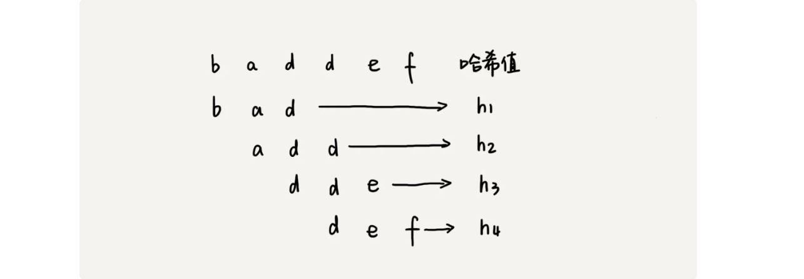

不过，通过哈希算法计算子串的哈希值的时候，我们需要遍历子串中的每个字符。尽管模式串与子串比较的效率提高了，但是，算法整体的效率并没有提高。有没有方法可以提高哈希算法计算子串哈希值的效率呢？

这就需要哈希算法设计的非常有技巧了。我们假设要匹配的字符串的字符集中只包含 K 个字符，我们可以用一个 K 进制数来表示一个子串，这个 K 进制数转化成十进制数，作为子串的哈希值。表述起来有点抽象，我举了一个例子，看完你应该就能懂了。

比如要处理的字符串只包含 a～z 这 26 个小写字母，那我们就用二十六进制来表示一个字符串。我们把 a～z 这 26 个字符映射到 0～25 这 26 个数字，a 就表示 0，b 就表示 1，以此类推，z 表示 25。

在十进制的表示法中，一个数字的值是通过下面的方式计算出来的。对应到二十六进制，一个包含 a 到 z 这 26 个字符的字符串，计算哈希的时候，我们只需要把进位从 10 改成 26 就可以。

这种哈希算法有一个特点，在主串中，相邻两个子串的哈希值的计算公式有一定关系。我这有个例子，你先找一下规律，再来看我后面的讲解。


从这里例子中，我们很容易就能得出这样的规律：相邻两个子串 s[i-1]和 s[i]（i 表示子串在主串中的起始位置，子串的长度都为 m），对应的哈希值计算公式有交集，也就是说，我们可以使用 s[i-1]的哈希值很快的计算出 s[i]的哈希值。如果用公式表示的话，就是下面这个样子：


不过，这里有一个小细节需要注意，那就是 26^(m-1) 这部分的计算，我们可以通过查表的方法来提高效率。我们事先计算好 26^0、 26^1、 26^2…… 26^(m-1)，并且存储在一个长度为 m 的数组中，公式中的“次方”就对应数组的下标。当我们需要计算 26 的 x 次方的时候，就可以从数组的下标为 x 的位置取值，直接使用，省去了计算的时间。


我们开头的时候提过，RK 算法的效率要比 BF 算法高，现在，我们就来分析一下，RK 算法的时间复杂度到底是多少呢？

整个 RK 算法包含两部分，计算子串哈希值和模式串哈希值与子串哈希值之间的比较。第一部分，我们前面也分析了，可以通过设计特殊的哈希算法，只需要扫描一遍主串就能计算出所有子串的哈希值了，所以这部分的时间复杂度是 O(n)。

模式串哈希值与每个子串哈希值之间的比较的时间复杂度是 O(1)，总共需要比较 n-m+1 个子串的哈希值，所以，这部分的时间复杂度也是 O(n)。所以，RK 算法整体的时间复杂度就是 O(n)。

这里还有一个问题就是，模式串很长，相应的主串中的子串也会很长，通过上面的哈希算法计算得到的哈希值就可能很大，如果超过了计算机中整型数据可以表示的范围，那该如何解决呢？

刚刚我们设计的哈希算法是没有散列冲突的，也就是说，一个字符串与一个二十六进制数一一对应，不同的字符串的哈希值肯定不一样。因为我们是基于进制来表示一个字符串的，你可以类比成十进制、十六进制来思考一下。实际上，我们为了能将哈希值落在整型数据范围内，可以牺牲一下，允许哈希冲突。这个时候哈希算法该如何设计呢？

哈希算法的设计方法有很多，我举一个例子说明一下。假设字符串中只包含 a～z 这 26 个英文字母，那我们每个字母对应一个数字，比如 a 对应 1，b 对应 2，以此类推，z 对应 26。我们可以把字符串中每个字母对应的数字相加，最后得到的和作为哈希值。这种哈希算法产生的哈希值的数据范围就相对要小很多了。

不过，你也应该发现，这种哈希算法的哈希冲突概率也是挺高的。当然，我只是举了一个最简单的设计方法，还有很多更加优化的方法，比如将每一个字母从小到大对应一个素数，而不是 1，2，3……这样的自然数，这样冲突的概率就会降低一些。

那现在新的问题来了。之前我们只需要比较一下模式串和子串的哈希值，如果两个值相等，那这个子串就一定可以匹配模式串。但是，当存在哈希冲突的时候，有可能存在这样的情况，子串和模式串的哈希值虽然是相同的，但是两者本身并不匹配。

实际上，解决方法很简单。当我们发现一个子串的哈希值跟模式串的哈希值相等的时候，我们只需要再对比一下子串和模式串本身就好了。当然，如果子串的哈希值与模式串的哈希值不相等，那对应的子串和模式串肯定也是不匹配的，就不需要比对子串和模式串本身了。

所以，哈希算法的冲突概率要相对控制得低一些，如果存在大量冲突，就会导致 RK 算法的时间复杂度退化，效率下降。极端情况下，如果存在大量的冲突，每次都要再对比子串和模式串本身，那时间复杂度就会退化成 O(n*m)。但也不要太悲观，一般情况下，冲突不会很多，RK 算法的效率还是比 BF 算法高的。

### 解答开篇 & 内容小结

今天我们讲了两种字符串匹配算法，BF 算法和 RK 算法。

BF 算法是最简单、粗暴的字符串匹配算法，它的实现思路是，拿模式串与主串中是所有子串匹配，看是否有能匹配的子串。所以，时间复杂度也比较高，是 O(n*m)，n、m 表示主串和模式串的长度。不过，在实际的软件开发中，因为这种算法实现简单，对于处理小规模的字符串匹配很好用。

RK 算法是借助哈希算法对 BF 算法进行改造，即对每个子串分别求哈希值，然后拿子串的哈希值与模式串的哈希值比较，减少了比较的时间。所以，理想情况下，RK 算法的时间复杂度是 O(n)，跟 BF 算法相比，效率提高了很多。不过这样的效率取决于哈希算法的设计方法，如果存在冲突的情况下，时间复杂度可能会退化。极端情况下，哈希算法大量冲突，时间复杂度就退化为 O(n*m)。

---

## 33.字符串匹配基础（中）：如何实现文本编辑器中的查找功能？

文本编辑器中的查找替换功能，我想你应该不陌生吧？比如，我们在 Word 中把一个单词统一替换成另一个，用的就是这个功能。你有没有想过，它是怎么实现的呢？

当然，你用上一节讲的 BF 算法和 RK 算法，也可以实现这个功能，但是在某些极端情况下，BF 算法性能会退化的比较严重，而 RK 算法需要用到哈希算法，设计一个可以应对各种类型字符的哈希算法并不简单。

对于工业级的软件开发来说，我们希望算法尽可能的高效，并且在极端情况下，性能也不要退化的太严重。那么，**对于查找功能是重要功能的软件来说，比如一些文本编辑器，它们的查找功能都是用哪种算法来实现的呢？有没有比 BF 算法和 RK 算法更加高效的字符串匹配算法呢？**

今天，我们就来学习 BM（Boyer-Moore）算法。它是一种非常高效的字符串匹配算法，有实验统计，它的性能是著名的KMP 算法的 3 到 4 倍。BM 算法的原理很复杂，比较难懂，学起来会比较烧脑，我会尽量给你讲清楚，同时也希望你做好打硬仗的准备。好，现在我们正式开始！

### BM 算法的核心思想

我们把模式串和主串的匹配过程，看作模式串在主串中不停地往后滑动。当遇到不匹配的字符时，BF 算法和 RK 算法的做法是，模式串往后滑动一位，然后从模式串的第一个字符开始重新匹配。我举个例子解释一下，你可以看我画的这幅图。


在这个例子里，主串中的 c，在模式串中是不存在的，所以，模式串向后滑动的时候，只要 c 与模式串没有重合，肯定无法匹配。所以，我们可以一次性把模式串往后多滑动几位，把模式串移动到 c 的后面。


由现象找规律，你可以思考一下，当遇到不匹配的字符时，有什么固定的规律，可以将模式串往后多滑动几位呢？这样一次性往后滑动好几位，那匹配的效率岂不是就提高了？

我们今天要讲的 BM 算法，本质上其实就是在寻找这种规律。借助这种规律，在模式串与主串匹配的过程中，当模式串和主串某个字符不匹配的时候，能够跳过一些肯定不会匹配的情况，将模式串往后多滑动几位。

### BM 算法原理分析

BM 算法包含两部分，分别是**坏字符规则**（bad character rule）和**好后缀规则**（good suffix shift）。我们下面依次来看，这两个规则分别都是怎么工作的。

#### 1. 坏字符规则

前面两节讲的算法，在匹配的过程中，我们都是按模式串的下标从小到大的顺序，依次与主串中的字符进行匹配的。这种匹配顺序比较符合我们的思维习惯，而 BM 算法的匹配顺序比较特别，它是按照模式串下标从大到小的顺序，倒着匹配的。我画了一张图，你可以看下。


从模式串的末尾往前倒着匹配，当发现某个字符没法匹配的时候，我们把这个没有匹配的字符叫作****（主串中的字符）。


我们拿坏字符 c 在模式串中查找，发现模式串中并不存在这个字符，也就是说，字符 c 与模式串中的任何字符都不可能匹配。这个时候，我们可以将模式串直接往后滑动三位，将模式串滑动到 c 后面的位置，再从模式串的末尾字符开始比较。


这个时候，我们发现，模式串中最后一个字符 d，还是无法跟主串中的 a 匹配，这个时候，还能将模式串往后滑动三位吗？答案是不行的。因为这个时候，坏字符 a 在模式串中是存在的，模式串中下标是 0 的位置也是字符 a。这种情况下，我们可以将模式串往后滑动两位，让两个 a 上下对齐，然后再从模式串的末尾字符开始，重新匹配。


第一次不匹配的时候，我们滑动了三位，第二次不匹配的时候，我们将模式串后移两位，那具体滑动多少位，到底有没有规律呢？

当发生不匹配的时候，我们把坏字符对应的模式串中的字符下标记作 si。如果坏字符在模式串中存在，我们把这个坏字符在模式串中的下标记作 xi。如果不存在，我们把 xi 记作 -1。那模式串往后移动的位数就等于 si-xi。（注意，我这里说的下标，都是字符在模式串的下标）。


这里我要特别说明一点，如果坏字符在模式串里多处出现，那我们在计算 xi 的时候，选择最靠后的那个，因为这样不会让模式串滑动过多，导致本来可能匹配的情况被滑动略过。

利用坏字符规则，**BM 算法在最好情况下的时间复杂度非常低，是 O(n/m)。**比如，主串是 aaabaaabaaabaaab，模式串是 aaaa。每次比对，模式串都可以直接后移四位，所以，匹配具有类似特点的模式串和主串的时候，BM 算法非常高效。

不过，单纯使用坏字符规则还是不够的。因为根据 si-xi 计算出来的移动位数，有可能是负数，比如主串是 aaaaaaaaaaaaaaaa，模式串是 baaa。不但不会向后滑动模式串，还有可能倒退。所以，BM 算法还需要用到“好后缀规则”。

#### 2. 好后缀规则

好后缀规则实际上跟坏字符规则的思路很类似。你看我下面这幅图。当模式串滑动到图中的位置的时候，模式串和主串有 2 个字符是匹配的，倒数第 3 个字符发生了不匹配的情况。


这个时候该如何滑动模式串呢？当然，我们还可以利用坏字符规则来计算模式串的滑动位数，不过，我们也可以使用好后缀处理规则。两种规则到底如何选择，我稍后会讲。抛开这个问题，现在我们来看，好后缀规则是怎么工作的？

我们把已经匹配的 bc 叫作好后缀，记作{u}。我们拿它在模式串中查找，如果找到了另一个跟{u}相匹配的子串{u*}，那我们就将模式串滑动到子串{u*}与主串中{u}对齐的位置。


如果在模式串中找不到另一个等于{u}的子串，我们就直接将模式串，滑动到主串中{u}的后面，因为之前的任何一次往后滑动，都没有匹配主串中{u}的情况。


不过，当模式串中不存在等于{u}的子串时，我们直接将模式串滑动到主串{u}的后面。这样做是否有点太过头呢？我们来看下面这个例子。这里面 bc 是好后缀，尽管在模式串中没有另外一个相匹配的子串{u*}，但是如果我们将模式串移动到好后缀的后面，如图所示，那就会错过模式串和主串可以匹配的情况。


如果好后缀在模式串中不存在可匹配的子串，那在我们一步一步往后滑动模式串的过程中，只要主串中的{u}与模式串有重合，那肯定就无法完全匹配。但是当模式串滑动到前缀与主串中{u}的后缀有部分重合的时候，并且重合的部分相等的时候，就有可能会存在完全匹配的情况。


所以，针对这种情况，我们不仅要看好后缀在模式串中，是否有另一个匹配的子串，我们还要考察好后缀的后缀子串，是否存在跟模式串的前缀子串匹配的。

所谓某个字符串 s 的后缀子串，就是最后一个字符跟 s 对齐的子串，比如 abc 的后缀子串就包括 c, bc。所谓前缀子串，就是起始字符跟 s 对齐的子串，比如 abc 的前缀子串有 a，ab。我们从好后缀的后缀子串中，找一个最长的并且能跟模式串的前缀子串匹配的，假设是{v}，然后将模式串滑动到如图所示的位置。


坏字符和好后缀的基本原理都讲完了，我现在回答一下前面那个问题。当模式串和主串中的某个字符不匹配的时候，如何选择用好后缀规则还是坏字符规则，来计算模式串往后滑动的位数？

我们可以分别计算好后缀和坏字符往后滑动的位数，然后取两个数中最大的，作为模式串往后滑动的位数。这种处理方法还可以避免我们前面提到的，根据坏字符规则，计算得到的往后滑动的位数，有可能是负数的情况。

### BM 算法代码实现

学习完了基本原理，我们再来看，如何实现 BM 算法？

“坏字符规则”本身不难理解。当遇到坏字符时，要计算往后移动的位数 si-xi，其中 xi 的计算是重点，我们如何求得 xi 呢？或者说，如何查找坏字符在模式串中出现的位置呢？

如果我们拿坏字符，在模式串中顺序遍历查找，这样就会比较低效，势必影响这个算法的性能。有没有更加高效的方式呢？我们之前学的散列表，这里可以派上用场了。我们可以将模式串中的每个字符及其下标都存到散列表中。这样就可以快速找到坏字符在模式串的位置下标了。

关于这个散列表，我们只实现一种最简单的情况，假设字符串的字符集不是很大，每个字符长度是 1 字节，我们用大小为 256 的数组，来记录每个字符在模式串中出现的位置。数组的下标对应字符的 ASCII 码值，数组中存储这个字符在模式串中出现的位置。


如果将上面的过程翻译成代码，就是下面这个样子。其中，变量 b 是模式串，m 是模式串的长度，bc 表示刚刚讲的散列表。

```java
private static final int SIZE = 256; // 全局变量或成员变量
private void generateBC(char[] b, int m, int[] bc) {
  for (int i = 0; i < SIZE; ++i) {
    bc[i] = -1; // 初始化bc
  }
  for (int i = 0; i < m; ++i) {
    int ascii = (int)b[i]; // 计算b[i]的ASCII值
    bc[ascii] = i;
  }
}
```

掌握了坏字符规则之后，我们先把 BM 算法代码的大框架写好，先不考虑好后缀规则，仅用坏字符规则，并且不考虑 si-xi 计算得到的移动位数可能会出现负数的情况。

```java
public int bm(char[] a, int n, char[] b, int m) {
  int[] bc = new int[SIZE]; // 记录模式串中每个字符最后出现的位置
  generateBC(b, m, bc); // 构建坏字符哈希表
  int i = 0; // i表示主串与模式串对齐的第一个字符
  while (i <= n - m) {
    int j;
    for (j = m - 1; j >= 0; --j) { // 模式串从后往前匹配
      if (a[i+j] != b[j]) break; // 坏字符对应模式串中的下标是j
    }
    if (j < 0) {
      return i; // 匹配成功，返回主串与模式串第一个匹配的字符的位置
    }
    // 这里等同于将模式串往后滑动j-bc[(int)a[i+j]]位
    i = i + (j - bc[(int)a[i+j]]); 
  }
  return -1;
}
```

代码里的注释已经很详细了，我就不再赘述了。不过，为了你方便理解，我画了一张图，将其中的一些关键变量标注在上面了，结合着图，代码应该更好理解。


至此，我们已经实现了包含坏字符规则的框架代码，只剩下往框架代码中填充好后缀规则了。现在，我们就来看看，如何实现好后缀规则。它的实现要比坏字符规则复杂一些。

在讲实现之前，我们先简单回顾一下，前面讲过好后缀的处理规则中最核心的内容：

+ 在模式串中，查找跟好后缀匹配的另一个子串；
+ 在好后缀的后缀子串中，查找最长的、能跟模式串前缀子串匹配的后缀子串；

在不考虑效率的情况下，这两个操作都可以用很“暴力”的匹配查找方式解决。但是，如果想要 BM 算法的效率很高，这部分就不能太低效。如何来做呢？

因为好后缀也是模式串本身的后缀子串，所以，我们可以在模式串和主串正式匹配之前，通过预处理模式串，预先计算好模式串的每个后缀子串，对应的另一个可匹配子串的位置。这个预处理过程比较有技巧，很不好懂，应该是这节最难懂的内容了，你要认真多读几遍。

我们先来看，**如何表示模式串中不同的后缀子串呢？**因为后缀子串的最后一个字符的位置是固定的，下标为 m-1，我们只需要记录长度就可以了。通过长度，我们可以确定一个唯一的后缀子串。


现在，我们要**引入最关键的变量 suffix 数组**。suffix 数组的下标 k，表示后缀子串的长度，下标对应的数组值存储的是，在模式串中跟好后缀{u}相匹配的子串{u*}的起始下标值。这句话不好理解，我举一个例子。


但是，如果模式串中有多个（大于 1 个）子串跟后缀子串{u}匹配，那 suffix 数组中该存储哪一个子串的起始位置呢？为了避免模式串往后滑动得过头了，我们肯定要存储模式串中最靠后的那个子串的起始位置，也就是下标最大的那个子串的起始位置。不过，这样处理就足够了吗？

实际上，仅仅是选最靠后的子串片段来存储是不够的。我们再回忆一下好后缀规则。

我们不仅要在模式串中，查找跟好后缀匹配的另一个子串，还要在好后缀的后缀子串中，查找最长的能跟模式串前缀子串匹配的后缀子串。

如果我们只记录刚刚定义的 suffix，实际上，只能处理规则的前半部分，也就是，在模式串中，查找跟好后缀匹配的另一个子串。所以，除了 suffix 数组之外，我们还需要另外一个 boolean 类型的 prefix 数组，来记录模式串的后缀子串是否能匹配模式串的前缀子串。


现在，我们来看下，如何来计算并填充这两个数组的值？这个计算过程非常巧妙。

我们拿下标从 0 到 i 的子串（i 可以是 0 到 m-2）与整个模式串，求公共后缀子串。如果公共后缀子串的长度是 k，那我们就记录 suffix[k]=j（j 表示公共后缀子串的起始下标）。如果 j 等于 0，也就是说，公共后缀子串也是模式串的前缀子串，我们就记录 prefix[k]=true。


我们把 suffix 数组和 prefix 数组的计算过程，用代码实现出来，就是下面这个样子：

```java
// b表示模式串，m表示长度，suffix，prefix数组事先申请好了
private void generateGS(char[] b, int m, int[] suffix, boolean[] prefix) {
  for (int i = 0; i < m; ++i) { // 初始化
    suffix[i] = -1;
    prefix[i] = false;
  }
  for (int i = 0; i < m - 1; ++i) { // b[0, i]
    int j = i;
    int k = 0; // 公共后缀子串长度
    while (j >= 0 && b[j] == b[m-1-k]) { // 与b[0, m-1]求公共后缀子串
      --j;
      ++k;
      suffix[k] = j+1; //j+1表示公共后缀子串在b[0, i]中的起始下标
    }
    if (j == -1) prefix[k] = true; //如果公共后缀子串也是模式串的前缀子串
  }
}
```

有了这两个数组之后，我们现在来看，**在模式串跟主串匹配的过程中，遇到不能匹配的字符时，如何根据好后缀规则，计算模式串往后滑动的位数？**

假设好后缀的长度是 k。我们先拿好后缀，在 suffix 数组中查找其匹配的子串。如果 suffix[k]不等于 -1（-1 表示不存在匹配的子串），那我们就将模式串往后移动 j-suffix[k]+1 位（j 表示坏字符对应的模式串中的字符下标）。如果 suffix[k]等于 -1，表示模式串中不存在另一个跟好后缀匹配的子串片段。我们可以用下面这条规则来处理。


好后缀的后缀子串 b[r, m-1]（其中，r 取值从 j+2 到 m-1）的长度 k=m-r，如果 prefix[k]等于 true，表示长度为 k 的后缀子串，有可匹配的前缀子串，这样我们可以把模式串后移 r 位。


如果两条规则都没有找到可以匹配好后缀及其后缀子串的子串，我们就将整个模式串后移 m 位。


至此，好后缀规则的代码实现我们也讲完了。我们把好后缀规则加到前面的代码框架里，就可以得到 BM 算法的完整版代码实现。

```java
// a,b表示主串和模式串；n，m表示主串和模式串的长度。
public int bm(char[] a, int n, char[] b, int m) {
  int[] bc = new int[SIZE]; // 记录模式串中每个字符最后出现的位置
  generateBC(b, m, bc); // 构建坏字符哈希表
  int[] suffix = new int[m];
  boolean[] prefix = new boolean[m];
  generateGS(b, m, suffix, prefix);
  int i = 0; // j表示主串与模式串匹配的第一个字符
  while (i <= n - m) {
    int j;
    for (j = m - 1; j >= 0; --j) { // 模式串从后往前匹配
      if (a[i+j] != b[j]) break; // 坏字符对应模式串中的下标是j
    }
    if (j < 0) {
      return i; // 匹配成功，返回主串与模式串第一个匹配的字符的位置
    }
    int x = j - bc[(int)a[i+j]];
    int y = 0;
    if (j < m-1) { // 如果有好后缀的话
      y = moveByGS(j, m, suffix, prefix);
    }
    i = i + Math.max(x, y);
  }
  return -1;
}

// j表示坏字符对应的模式串中的字符下标; m表示模式串长度
private int moveByGS(int j, int m, int[] suffix, boolean[] prefix) {
  int k = m - 1 - j; // 好后缀长度
  if (suffix[k] != -1) return j - suffix[k] +1;
  for (int r = j+2; r <= m-1; ++r) {
    if (prefix[m-r] == true) {
      return r;
    }
  }
  return m;
}
```

### BM 算法的性能分析及优化

我们先来分析 BM 算法的内存消耗。整个算法用到了额外的 3 个数组，其中 bc 数组的大小跟字符集大小有关，suffix 数组和 prefix 数组的大小跟模式串长度 m 有关。

如果我们处理字符集很大的字符串匹配问题，bc 数组对内存的消耗就会比较多。因为好后缀和坏字符规则是独立的，如果我们运行的环境对内存要求苛刻，可以只使用好后缀规则，不使用坏字符规则，这样就可以避免 bc 数组过多的内存消耗。不过，单纯使用好后缀规则的 BM 算法效率就会下降一些了。

对于执行效率来说，我们可以先从时间复杂度的角度来分析。

实际上，我前面讲的 BM 算法是个初级版本。为了让你能更容易理解，有些复杂的优化我没有讲。基于我目前讲的这个版本，在极端情况下，预处理计算 suffix 数组、prefix 数组的性能会比较差。

比如模式串是 aaaaaaa 这种包含很多重复的字符的模式串，预处理的时间复杂度就是 O(m^2)。当然，大部分情况下，时间复杂度不会这么差。关于如何优化这种极端情况下的时间复杂度退化，如果感兴趣，你可以自己研究一下。

### 解答开篇 & 内容小结

今天，我们讲了一种比较复杂的字符串匹配算法，BM 算法。尽管复杂、难懂，但匹配的效率却很高，在实际的软件开发中，特别是一些文本编辑器中，应用比较多。如果一遍看不懂的话，你就多看几遍。

BM 算法核心思想是，利用模式串本身的特点，在模式串中某个字符与主串不能匹配的时候，将模式串往后多滑动几位，以此来减少不必要的字符比较，提高匹配的效率。BM 算法构建的规则有两类，坏字符规则和好后缀规则。好后缀规则可以独立于坏字符规则使用。因为坏字符规则的实现比较耗内存，为了节省内存，我们可以只用好后缀规则来实现 BM 算法。

---

## 34.字符串匹配基础（下）：如何借助BM算法轻松理解KMP算法？

上一节我们讲了 BM 算法，尽管它很复杂，也不好理解，但却是工程中非常常用的一种高效字符串匹配算法。有统计说，它是最高效、最常用的字符串匹配算法。不过，在所有的字符串匹配算法里，要说最知名的一种的话，那就非 KMP 算法莫属。很多时候，提到字符串匹配，我们首先想到的就是 KMP 算法。

尽管在实际的开发中，我们几乎不大可能自己亲手实现一个 KMP 算法。但是，学习这个算法的思想，作为让你开拓眼界、锻炼下逻辑思维，也是极好的，所以我觉得有必要拿出来给你讲一讲。不过，KMP 算法是出了名的不好懂。我会尽力把它讲清楚，但是你自己也要多动动脑子。

实际上，KMP 算法跟 BM 算法的本质是一样的。上一节，我们讲了好后缀和坏字符规则，今天，我们就看下，如何借助上一节 BM 算法的讲解思路，让你能更好地理解 KMP 算法？

### KMP 算法基本原理

```java
// a, b分别是主串和模式串；n, m分别是主串和模式串的长度。
public static int kmp(char[] a, int n, char[] b, int m) {
  int[] next = getNexts(b, m);
  int j = 0;
  for (int i = 0; i < n; ++i) {
    while (j > 0 && a[i] != b[j]) { // 一直找到a[i]和b[j]
      j = next[j - 1] + 1;
    }
    if (a[i] == b[j]) {
      ++j;
    }
    if (j == m) { // 找到匹配模式串的了
      return i - m + 1;
    }
  }
  return -1;
}
```

### 失效函数计算方法

```java
// b表示模式串，m表示模式串的长度
private static int[] getNexts(char[] b, int m) {
  int[] next = new int[m];
  next[0] = -1;
  int k = -1;
  for (int i = 1; i < m; ++i) {
    while (k != -1 && b[k + 1] != b[i]) {
      k = next[k];
    }
    if (b[k + 1] == b[i]) {
      ++k;
    }
    next[i] = k;
  }
  return next;
}
```

### KMP 算法复杂度分析

KMP 算法的原理和实现我们就讲完了，我们现在来分析一下 KMP 算法的时间、空间复杂度是多少？

空间复杂度很容易分析，KMP 算法只需要一个额外的 next 数组，数组的大小跟模式串相同。所以空间复杂度是 O(m)，m 表示模式串的长度。

KMP 算法包含两部分，第一部分是构建 next 数组，第二部分才是借助 next 数组匹配。所以，关于时间复杂度，我们要分别从这两部分来分析。

我们先来分析第一部分的时间复杂度。

计算 next 数组的代码中，第一层 for 循环中 i 从 1 到 m-1，也就是说，内部的代码被执行了 m-1 次。for 循环内部代码有一个 while 循环，如果我们能知道每次 for 循环、while 循环平均执行的次数，假设是 k，那时间复杂度就是 O(k*m)。但是，while 循环执行的次数不怎么好统计，所以我们放弃这种分析方法。

我们可以找一些参照变量，i 和 k。i 从 1 开始一直增加到 m，而 k 并不是每次 for 循环都会增加，所以，k 累积增加的值肯定小于 m。而 while 循环里 k=next[k]，实际上是在减小 k 的值，k 累积都没有增加超过 m，所以 while 循环里面 k=next[k]总的执行次数也不可能超过 m。因此，next 数组计算的时间复杂度是 O(m)。

我们再来分析第二部分的时间复杂度。分析的方法是类似的。

i 从 0 循环增长到 n-1，j 的增长量不可能超过 i，所以肯定小于 n。而 while 循环中的那条语句 j=next[j-1]+1，不会让 j 增长的，那有没有可能让 j 不变呢？也没有可能。因为 next[j-1]的值肯定小于 j-1，所以 while 循环中的这条语句实际上也是在让 j 的值减少。而 j 总共增长的量都不会超过 n，那减少的量也不可能超过 n，所以 while 循环中的这条语句总的执行次数也不会超过 n，所以这部分的时间复杂度是 O(n)。

所以，综合两部分的时间复杂度，KMP 算法的时间复杂度就是 **O(m+n)**。

### 解答开篇 & 内容小结

KMP 算法讲完了，不知道你理解了没有？如果没有，建议多看几遍，自己多思考思考。KMP 算法和上一节讲的 BM 算法的本质非常类似，都是根据规律在遇到坏字符的时候，把模式串往后多滑动几位。

BM 算法有两个规则，坏字符和好后缀。KMP 算法借鉴 BM 算法的思想，可以总结成好前缀规则。这里面最难懂的就是 next 数组的计算。如果用最笨的方法来计算，确实不难，但是效率会比较低。所以，我讲了一种类似动态规划的方法，按照下标 i 从小到大，依次计算 next[i]，并且 next[i]的计算通过前面已经计算出来的 next[0]，next[1]，……，next[i-1]来推导。

KMP 算法的时间复杂度是 O(n+m)，不过它的分析过程稍微需要一点技巧，不那么直观，你只要看懂就好了，并不需要掌握，在我们平常的开发中，很少会有这么难分析的代码。

---

## 35.Trie树：如何实现搜索引擎的搜索关键词提示功能？

搜索引擎的搜索关键词提示功能，我想你应该不陌生吧？为了方便快速输入，当你在搜索引擎的搜索框中，输入要搜索的文字的某一部分的时候，搜索引擎就会自动弹出下拉框，里面是各种关键词提示。你可以直接从下拉框中选择你要搜索的东西，而不用把所有内容都输入进去，一定程度上节省了我们的搜索时间。


尽管这个功能我们几乎天天在用，作为一名工程师，你是否思考过，它是怎么实现的呢？它底层使用的是哪种数据结构和算法呢？

像 Google、百度这样的搜索引擎，它们的关键词提示功能非常全面和精准，肯定做了很多优化，但万变不离其宗，底层最基本的原理就是今天要讲的这种数据结构：Trie 树。

### 什么是“Trie 树”？

Trie 树，也叫“字典树”。顾名思义，它是一个树形结构。它是一种专门处理字符串匹配的数据结构，用来解决在一组字符串集合中快速查找某个字符串的问题。

当然，这样一个问题可以有多种解决方法，比如散列表、红黑树，或者我们前面几节讲到的一些字符串匹配算法，但是，Trie 树在这个问题的解决上，有它特有的优点。不仅如此，Trie 树能解决的问题也不限于此，我们一会儿慢慢分析。

现在，我们先来看下，Trie 树到底长什么样子。

我举个简单的例子来说明一下。我们有 6 个字符串，它们分别是：how，hi，her，hello，so，see。我们希望在里面多次查找某个字符串是否存在。如果每次查找，都是拿要查找的字符串跟这 6 个字符串依次进行字符串匹配，那效率就比较低，有没有更高效的方法呢？

这个时候，我们就可以先对这 6 个字符串做一下预处理，组织成 Trie 树的结构，之后每次查找，都是在 Trie 树中进行匹配查找。**Trie 树的本质，就是利用字符串之间的公共前缀，将重复的前缀合并在一起。**最后构造出来的就是下面这个图中的样子。


其中，根节点不包含任何信息。每个节点表示一个字符串中的字符，从根节点到红色节点的一条路径表示一个字符串（注意：红色节点并不都是叶子节点）。例如，如果树中存储了字符串he，则上图的e就应该是红色节点。即红色节点表示的是完整存储，从根节点到红色节点的字符串，在树中是实实在在存储有的。

为了让你更容易理解 Trie 树是怎么构造出来的，我画了一个 Trie 树构造的分解过程。构造过程的每一步，都相当于往 Trie 树中插入一个字符串。当所有字符串都插入完成之后，Trie 树就构造好了。


当我们在 Trie 树中查找一个字符串的时候，比如查找字符串“her”，那我们将要查找的字符串分割成单个的字符 h，e，r，然后从 Trie 树的根节点开始匹配。如图所示，绿色的路径就是在 Trie 树中匹配的路径。


如果我们要查找的是字符串“he”呢？我们还用上面同样的方法，从根节点开始，沿着某条路径来匹配，如图所示，绿色的路径，是字符串“he”匹配的路径。但是，路径的最后一个节点“e”并不是红色的。也就是说，“he”是某个字符串的前缀子串，但并不能完全匹配任何字符串。


### 如何实现一棵 Trie 树？

知道了 Trie 树长什么样子，我们现在来看下，如何用代码来实现一个 Trie 树。

从刚刚 Trie 树的介绍来看，Trie 树主要有两个操作，**一个是将字符串集合构造成 Trie 树。**这个过程分解开来的话，就是一个将字符串插入到 Trie 树的过程。**另一个是在 Trie 树中查询一个字符串。**

了解了 Trie 树的两个主要操作之后，我们再来看下，**如何存储一个 Trie 树？**

从前面的图中，我们可以看出，Trie 树是一个多叉树。我们知道，二叉树中，一个节点的左右子节点是通过两个指针来存储的，如下所示 Java 代码。

```java
class BinaryTreeNode {
  char data;
  BinaryTreeNode left;
  BinaryTreeNode right;  
}
```

那对于多叉树来说，我们怎么存储一个节点的所有子节点的指针呢？

我先介绍其中一种存储方式，也是经典的存储方式，大部分数据结构和算法书籍中都是这么讲的。还记得我们前面讲到的散列表吗？借助散列表的思想，我们通过一个下标与字符一一映射的数组，来存储子节点的指针。这句话稍微有点抽象，不怎么好懂，我画了一张图你可以看看。


假设我们的字符串中只有从 a 到 z 这 26 个小写字母，我们在数组中下标为 0 的位置，存储指向子节点 a 的指针，下标为 1 的位置存储指向子节点 b 的指针，以此类推，下标为 25 的位置，存储的是指向的子节点 z 的指针。如果某个字符的子节点不存在，我们就在对应的下标的位置存储 null。

```java
class TrieNode {
  char data;
  TrieNode children[26];
}
```

当我们在 Trie 树中查找字符串的时候，我们就可以通过字符的 ASCII 码减去“a”的 ASCII 码，迅速找到匹配的子节点的指针。比如，d 的 ASCII 码减去 a 的 ASCII 码就是 3，那子节点 d 的指针就存储在数组中下标为 3 的位置中。

描述了这么多，有可能你还是有点懵，我把上面的描述翻译成了代码，你可以结合着一块看下，应该有助于你理解。

```java
public class Trie {
  private TrieNode root = new TrieNode('/'); // 存储无意义字符

  // 往Trie树中插入一个字符串
  public void insert(char[] text) {
    TrieNode p = root;
    for (int i = 0; i < text.length; ++i) {
      int index = text[i] - 'a';
      if (p.children[index] == null) {
        TrieNode newNode = new TrieNode(text[i]);
        p.children[index] = newNode;
      }
      p = p.children[index];
    }
    p.isEndingChar = true;
  }

  // 在Trie树中查找一个字符串
  public boolean find(char[] pattern) {
    TrieNode p = root;
    for (int i = 0; i < pattern.length; ++i) {
      int index = pattern[i] - 'a';
      if (p.children[index] == null) {
        return false; // 不存在pattern
      }
      p = p.children[index];
    }
    if (p.isEndingChar == false) return false; // 不能完全匹配，只是前缀
    else return true; // 找到pattern
  }

  public class TrieNode {
    public char data;
    public TrieNode[] children = new TrieNode[26];
    public boolean isEndingChar = false;
    public TrieNode(char data) {
      this.data = data;
    }
  }
}
```

Trie 树的实现，你现在应该搞懂了。现在，我们来看下，**在 Trie 树中，查找某个字符串的时间复杂度是多少？**

如果要在一组字符串中，频繁地查询某些字符串，用 Trie 树会非常高效。构建 Trie 树的过程，需要扫描所有的字符串，时间复杂度是 O(n)（n 表示所有字符串的长度和）。但是一旦构建成功之后，后续的查询操作会非常高效。

每次查询时，如果要查询的字符串长度是 k，那我们只需要比对大约 k 个节点，就能完成查询操作。跟原本那组字符串的长度和个数没有任何关系。所以说，构建好 Trie 树后，在其中查找字符串的时间复杂度是 O(k)，k 表示要查找的字符串的长度。

#### Trie 树真的很耗内存吗？

前面我们讲了 Trie 树的实现，也分析了时间复杂度。现在你应该知道，Trie 树是一种非常独特的、高效的字符串匹配方法。但是，关于 Trie 树，你有没有听过这样一种说法：“Trie 树是非常耗内存的，用的是一种空间换时间的思路”。这是什么原因呢？

刚刚我们在讲 Trie 树的实现的时候，讲到用数组来存储一个节点的子节点的指针。如果字符串中包含从 a 到 z 这 26 个字符，那每个节点都要存储一个长度为 26 的数组，并且每个数组元素要存储一个 8 字节指针（或者是 4 字节，这个大小跟 CPU、操作系统、编译器等有关）。而且，即便一个节点只有很少的子节点，远小于 26 个，比如 3、4 个，我们也要维护一个长度为 26 的数组。

我们前面讲过，Trie 树的本质是避免重复存储一组字符串的相同前缀子串，但是现在每个字符（对应一个节点）的存储远远大于 1 个字节。按照我们上面举的例子，数组长度为 26，每个元素是 8 字节，那每个节点就会额外需要 26*8=208 个字节。而且这还是只包含 26 个字符的情况。

如果字符串中不仅包含小写字母，还包含大写字母、数字、甚至是中文，那需要的存储空间就更多了。所以，也就是说，在某些情况下，Trie 树不一定会节省存储空间。在重复的前缀并不多的情况下，Trie 树不但不能节省内存，还有可能会浪费更多的内存。

当然，我们不可否认，Trie 树尽管有可能很浪费内存，但是确实非常高效。那为了解决这个内存问题，我们是否有其他办法呢？

我们可以稍微牺牲一点查询的效率，将每个节点中的数组换成其他数据结构，来存储一个节点的子节点指针。用哪种数据结构呢？我们的选择其实有很多，比如有序数组、跳表、散列表、红黑树等。

假设我们用有序数组，数组中的指针按照所指向的子节点中的字符的大小顺序排列。查询的时候，我们可以通过二分查找的方法，快速查找到某个字符应该匹配的子节点的指针。但是，在往 Trie 树中插入一个字符串的时候，我们为了维护数组中数据的有序性，就会稍微慢了点。

替换成其他数据结构的思路是类似的，这里我就不一一分析了，你可以结合前面学过的内容，自己分析一下。

实际上，Trie 树的变体有很多，都可以在一定程度上解决内存消耗的问题。比如，缩点优化，就是对只有一个子节点的节点，而且此节点不是一个串的结束节点，可以将此节点与子节点合并。这样可以节省空间，但却增加了编码难度。这里我就不展开详细讲解了，你如果感兴趣，可以自行研究下。


### Trie 树与散列表、红黑树的比较

实际上，字符串的匹配问题，笼统上讲，其实就是数据的查找问题。对于支持动态数据高效操作的数据结构，我们前面已经讲过好多了，比如散列表、红黑树、跳表等等。实际上，这些数据结构也可以实现在一组字符串中查找字符串的功能。我们选了两种数据结构，散列表和红黑树，跟 Trie 树比较一下，看看它们各自的优缺点和应用场景。

在刚刚讲的这个场景，在一组字符串中查找字符串，Trie 树实际上表现得并不好。它对要处理的字符串有极其严苛的要求。

第一，字符串中包含的字符集不能太大。我们前面讲到，如果字符集太大，那存储空间可能就会浪费很多。即便可以优化，但也要付出牺牲查询、插入效率的代价。

第二，要求字符串的前缀重合比较多，不然空间消耗会变大很多。

第三，如果要用 Trie 树解决问题，那我们就要自己从零开始实现一个 Trie 树，还要保证没有 bug，这个在工程上是将简单问题复杂化，除非必须，一般不建议这样做。

第四，我们知道，通过指针串起来的数据块是不连续的，而 Trie 树中用到了指针，所以，对缓存并不友好，性能上会打个折扣。

综合这几点，**针对在一组字符串中查找字符串的问题，我们在工程中，更倾向于用散列表或者红黑树。**因为这两种数据结构，我们都不需要自己去实现，直接利用编程语言中提供的现成类库就行了。

讲到这里，你可能要疑惑了，讲了半天，我对 Trie 树一通否定，还让你用红黑树或者散列表，那 Trie 树是不是就没用了呢？是不是今天的内容就白学了呢？

实际上，Trie 树只是不适合精确匹配查找，这种问题更适合用散列表或者红黑树来解决。Trie 树比较适合的是查找前缀匹配的字符串，也就是类似开篇问题的那种场景。

### 解答开篇

Trie 树就讲完了，我们来看下开篇提到的问题：如何利用 Trie 树，实现搜索关键词的提示功能？

我们假设关键词库由用户的热门搜索关键词组成。我们将这个词库构建成一个 Trie 树。当用户输入其中某个单词的时候，把这个词作为一个前缀子串在 Trie 树中匹配。为了讲解方便，我们假设词库里只有 hello、her、hi、how、so、see 这 6 个关键词。当用户输入了字母 h 的时候，我们就把以 h 为前缀的 hello、her、hi、how 展示在搜索提示框内。当用户继续键入字母 e 的时候，我们就把以 he 为前缀的 hello、her 展示在搜索提示框内。这就是搜索关键词提示的最基本的算法原理。


不过，我讲的只是最基本的实现原理，实际上，搜索引擎的搜索关键词提示功能远非我讲的这么简单。如果再稍微深入一点，你就会想到，上面的解决办法遇到下面几个问题：

+ 我刚讲的思路是针对英文的搜索关键词提示，对于更加复杂的中文来说，词库中的数据又该如何构建成 Trie 树呢？
+ 如果词库中有很多关键词，在搜索提示的时候，用户输入关键词，作为前缀在 Trie 树中可以匹配的关键词也有很多，如何选择展示哪些内容呢？
+ 像 Google 这样的搜索引擎，用户单词拼写错误的情况下，Google 还是可以使用正确的拼写来做关键词提示，这个又是怎么做到的呢？

你可以先思考一下如何来解决，如果不会也没关系，这些问题，我们会在实战篇里具体来讲解。

实际上，Trie 树的这个应用可以扩展到更加广泛的一个应用上，就是**自动输入补全**，比如输入法自动补全功能、IDE 代码编辑器自动补全功能、浏览器网址输入的自动补全功能等等。

### 内容小结

今天我们讲了一种特殊的树，Trie 树。Trie 树是一种解决字符串快速匹配问题的数据结构。如果用来构建 Trie 树的这一组字符串中，前缀重复的情况不是很多，那 Trie 树这种数据结构总体上来讲是比较费内存的，是一种空间换时间的解决问题思路。

尽管比较耗费内存，但是对内存不敏感或者内存消耗在接受范围内的情况下，在 Trie 树中做字符串匹配还是非常高效的，时间复杂度是 O(k)，k 表示要匹配的字符串的长度。

但是，Trie 树的优势并不在于，用它来做动态集合数据的查找，因为，这个工作完全可以用更加合适的散列表或者红黑树来替代。Trie 树最有优势的是查找前缀匹配的字符串，比如搜索引擎中的关键词提示功能这个场景，就比较适合用它来解决，也是 Trie 树比较经典的应用场景。

---

## 36. AC自动机：如何用多模式串匹配实现敏感词过滤功能？

很多支持用户发表文本内容的网站，比如 BBS，大都会有敏感词过滤功能，用来过滤掉用户输入的一些淫秽、反动、谩骂等内容。你有没有想过，这个功能是怎么实现的呢？

实际上，这些功能最基本的原理就是字符串匹配算法，也就是通过维护一个敏感词的字典，当用户输入一段文字内容之后，通过字符串匹配算法，来查找用户输入的这段文字，是否包含敏感词。如果有，就用“***”把它替代掉。

我们前面讲过好几种字符串匹配算法了，它们都可以处理这个问题。但是，对于访问量巨大的网站来说，比如淘宝，用户每天的评论数有几亿、甚至几十亿。这时候，我们对敏感词过滤系统的性能要求就要很高。毕竟，我们也不想，用户输入内容之后，要等几秒才能发送出去吧？我们也不想，为了这个功能耗费过多的机器吧？**那如何才能实现一个高性能的敏感词过滤系统呢？**这就要用到今天的**多模式串匹配算法**。

### 基于单模式串和 Trie 树实现的敏感词过滤

我们前面几节讲了好几种字符串匹配算法，有 BF 算法、RK 算法、BM 算法、KMP 算法，还有 Trie 树。前面四种算法都是单模式串匹配算法，只有 Trie 树是多模式串匹配算法。

我说过，单模式串匹配算法，是在一个模式串和一个主串之间进行匹配，也就是说，在一个主串中查找一个模式串。多模式串匹配算法，就是在多个模式串和一个主串之间做匹配，也就是说，在一个主串中查找多个模式串。

尽管，单模式串匹配算法也能完成多模式串的匹配工作。例如开篇的思考题，我们可以针对每个敏感词，通过单模式串匹配算法（比如 KMP 算法）与用户输入的文字内容进行匹配。但是，这样做的话，每个匹配过程都需要扫描一遍用户输入的内容。整个过程下来就要扫描很多遍用户输入的内容。如果敏感词很多，比如几千个，并且用户输入的内容很长，假如有上千个字符，那我们就需要扫描几千遍这样的输入内容。很显然，这种处理思路比较低效。

与单模式匹配算法相比，多模式匹配算法在这个问题的处理上就很高效了。它只需要扫描一遍主串，就能在主串中一次性查找多个模式串是否存在，从而大大提高匹配效率。我们知道，Trie 树就是一种多模式串匹配算法。那如何用 Trie 树实现敏感词过滤功能呢？

我们可以对敏感词字典进行预处理，构建成 Trie 树结构。这个预处理的操作只需要做一次，如果敏感词字典动态更新了，比如删除、添加了一个敏感词，那我们只需要动态更新一下 Trie 树就可以了。

当用户输入一个文本内容后，我们把用户输入的内容作为主串，从第一个字符（假设是字符 C）开始，在 Trie 树中匹配。当匹配到 Trie 树的叶子节点，或者中途遇到不匹配字符的时候，我们将主串的开始匹配位置后移一位，也就是从字符 C 的下一个字符开始，重新在 Trie 树中匹配。

基于 Trie 树的这种处理方法，有点类似单模式串匹配的 BF 算法。我们知道，单模式串匹配算法中，KMP 算法对 BF 算法进行改进，引入了 next 数组，让匹配失败时，尽可能将模式串往后多滑动几位。借鉴单模式串的优化改进方法，能否对多模式串 Trie 树进行改进，进一步提高 Trie 树的效率呢？这就要用到 **AC 自动机算法了。**

### 经典的多模式串匹配算法：AC 自动机

AC 自动机算法，全称是 Aho-Corasick 算法。其实，Trie 树跟 AC 自动机之间的关系，就像单串匹配中朴素的串匹配算法，跟 KMP 算法之间的关系一样，只不过前者针对的是多模式串而已。所以，AC 自动机实际上就是在 Trie 树之上，加了类似 KMP 的 next 数组，只不过此处的 next 数组是构建在树上罢了。如果代码表示，就是下面这个样子：

```java
public class AcNode {
  public char data; 
  public AcNode[] children = new AcNode[26]; // 字符集只包含a~z这26个字符
  public boolean isEndingChar = false; // 结尾字符为true
  public int length = -1; // 当isEndingChar=true时，记录模式串长度
  public AcNode fail; // 失败指针
  public AcNode(char data) {
    this.data = data;
  }
}
```

所以，AC 自动机的构建，包含两个操作：

+ 将多个模式串构建成 Trie 树；
+ 在 Trie 树上构建失败指针（相当于 KMP 中的失效函数 next 数组）。

关于如何构建 Trie 树，我们上一节已经讲过了。所以，这里我们就重点看下，**构建好 Trie 树之后，如何在它之上构建失败指针？**

我用一个例子给你讲解。这里有 4 个模式串，分别是 c，bc，bcd，abcd；主串是 abcd。


Trie 树中的每一个节点都有一个失败指针，它的作用和构建过程，跟 KMP 算法中的 next 数组极其相似。所以要想看懂这节内容，你要先理解 KMP 算法中 next 数组的构建过程。如果你还有点不清楚，建议你先回头去弄懂 KMP 算法。

假设我们沿 Trie 树走到 p 节点，也就是下图中的紫色节点，那 p 的失败指针就是从 root 走到紫色节点形成的字符串 abc，跟所有模式串前缀匹配的最长可匹配后缀子串，就是箭头指的 bc 模式串。

这里的最长可匹配后缀子串，我稍微解释一下。字符串 abc 的后缀子串有两个 bc，c，我们拿它们与其他模式串匹配，如果某个后缀子串可以匹配某个模式串的前缀，那我们就把这个后缀子串叫作**可匹配后缀子串**。

我们从可匹配后缀子串中，找出最长的一个，就是刚刚讲到的最长可匹配后缀子串。我们将 p 节点的失败指针指向那个最长匹配后缀子串对应的模式串的前缀的最后一个节点，就是下图中箭头指向的节点。


计算每个节点的失败指针这个过程看起来有些复杂。其实，如果我们把树中相同深度的节点放到同一层，那么某个节点的失败指针只有可能出现在它所在层的上一层。

我们可以像 KMP 算法那样，当我们要求某个节点的失败指针的时候，我们通过已经求得的、深度更小的那些节点的失败指针来推导。也就是说，我们可以逐层依次来求解每个节点的失败指针。所以，失败指针的构建过程，是一个按层遍历树的过程。

首先 root 的失败指针为 NULL，也就是指向自己。**当我们已经求得某个节点 p 的失败指针之后，如何寻找它的子节点的失败指针呢？**

我们假设节点 p 的失败指针指向节点 q，我们看节点 p 的子节点 pc 对应的字符，是否也可以在节点 q 的子节点中找到。如果找到了节点 q 的一个子节点 qc，对应的字符跟节点 pc 对应的字符相同，则将节点 pc 的失败指针指向节点 qc。


如果节点 q 中没有子节点的字符等于节点 pc 包含的字符，则令 q=q->fail（fail 表示失败指针，这里有没有很像 KMP 算法里求 next 的过程？），继续上面的查找，直到 q 是 root 为止，如果还没有找到相同字符的子节点，就让节点 pc 的失败指针指向 root。


我将构建失败指针的代码贴在这里，你可以对照着讲解一块看下，应该更容易理解。这里面，构建 Trie 树的代码我并没有贴出来，你可以参看上一节的代码，自己实现。

```java
public void buildFailurePointer() {
  Queue<AcNode> queue = new LinkedList<>();
  root.fail = null;
  queue.add(root);
  while (!queue.isEmpty()) {
    AcNode p = queue.remove();
    for (int i = 0; i < 26; ++i) {
      AcNode pc = p.children[i];
      if (pc == null) continue;
      if (p == root) {
        pc.fail = root;
      } else {
        AcNode q = p.fail;
        while (q != null) {
          AcNode qc = q.children[pc.data - 'a'];
          if (qc != null) {
            pc.fail = qc;
            break;
          }
          q = q.fail;
        }
        if (q == null) {
          pc.fail = root;
        }
      }
      queue.add(pc);
    }
  }
}
```

通过按层来计算每个节点的子节点的失效指针，刚刚举的那个例子，最后构建完成之后的 AC 自动机就是下面这个样子：


AC 自动机到此就构建完成了。我们现在来看下，如何在 AC 自动机上匹配主串？

我们还是拿之前的例子来讲解。在匹配过程中，主串从 i=0 开始，AC 自动机从指针 p=root 开始，假设模式串是 b，主串是 a。

+ 如果 p 指向的节点有一个等于 b[i]的子节点 x，我们就更新 p 指向 x，这个时候我们需要通过失败指针，检测一系列失败指针为结尾的路径是否是模式串。这一句不好理解，你可以结合代码看。处理完之后，我们将 i 加一，继续这两个过程；
+ 如果 p 指向的节点没有等于 b[i]的子节点，那失败指针就派上用场了，我们让 p=p->fail，然后继续这 2 个过程。

关于匹配的这部分，文字描述不如代码看得清楚，所以我把代码贴了出来，非常简短，并且添加了详细的注释，你可以对照着看下。这段代码输出的就是，在主串中每个可以匹配的模式串出现的位置。

```java
public void match(char[] text) { // text是主串
  int n = text.length;
  AcNode p = root;
  for (int i = 0; i < n; ++i) {
    int idx = text[i] - 'a';
    while (p.children[idx] == null && p != root) {
      p = p.fail; // 失败指针发挥作用的地方
    }
    p = p.children[idx];
    if (p == null) p = root; // 如果没有匹配的，从root开始重新匹配
    AcNode tmp = p;
    while (tmp != root) { // 打印出可以匹配的模式串
      if (tmp.isEndingChar == true) {
        int pos = i-tmp.length+1;
        System.out.println("匹配起始下标" + pos + "; 长度" + tmp.length);
      }
      tmp = tmp.fail;
    }
  }
}
```

### 解答开篇

AC 自动机的内容讲完了，关于开篇的问题，你应该能解答了吧？实际上，我上面贴出来的代码，已经是一个敏感词过滤的原型代码了。它可以找到所有敏感词出现的位置（在用户输入的文本中的起始下标）。你只需要稍加改造，再遍历一遍文本内容（主串），就可以将文本中的所有敏感词替换成“***”。

所以我这里着重讲一下，**AC 自动机实现的敏感词过滤系统，是否比单模式串匹配方法更高效呢？**

首先，我们需要将敏感词构建成 AC 自动机，包括构建 Trie 树以及构建失败指针。

我们上一节讲过，Trie 树构建的时间复杂度是 O(m*len)，其中 len 表示敏感词的平均长度，m 表示敏感词的个数。那构建失败指针的时间复杂度是多少呢？我这里给出一个不是很紧确的上界。

假设 Trie 树中总的节点个数是 k，每个节点构建失败指针的时候，（你可以看下代码）最耗时的环节是 while 循环中的 q=q->fail，每运行一次这个语句，q 指向节点的深度都会减少 1，而树的高度最高也不会超过 len，所以每个节点构建失败指针的时间复杂度是 O(len)。整个失败指针的构建过程就是 O(k*len)。

不过，AC 自动机的构建过程都是预先处理好的，构建好之后，并不会频繁地更新，所以不会影响到敏感词过滤的运行效率。

我们再来看下，**用 AC 自动机做匹配的时间复杂度是多少？**

跟刚刚构建失败指针的分析类似，for 循环依次遍历主串中的每个字符，for 循环内部最耗时的部分也是 while 循环，而这一部分的时间复杂度也是 O(len)，所以总的匹配的时间复杂度就是 O(n*len)。因为敏感词并不会很长，而且这个时间复杂度只是一个非常宽泛的上限，实际情况下，可能近似于 O(n)，所以 AC 自动机做敏感词过滤，性能非常高。

你可以会说，从时间复杂度上看，AC 自动机匹配的效率跟 Trie 树一样啊。实际上，因为失效指针可能大部分情况下都指向 root 节点，所以绝大部分情况下，在 AC 自动机上做匹配的效率要远高于刚刚计算出的比较宽泛的时间复杂度。只有在极端情况下，如图所示，AC 自动机的性能才会退化的跟 Trie 树一样。


### 内容小结

今天我们讲了多模式串匹配算法，AC 自动机。单模式串匹配算法是为了快速在主串中查找一个模式串，而多模式串匹配算法是为了快速在主串中查找多个模式串。

AC 自动机是基于 Trie 树的一种改进算法，它跟 Trie 树的关系，就像单模式串中，KMP 算法与 BF 算法的关系一样。KMP 算法中有一个非常关键的 next 数组，类比到 AC 自动机中就是失败指针。而且，AC 自动机失败指针的构建过程，跟 KMP 算法中计算 next 数组极其相似。所以，要理解 AC 自动机，最好先掌握 KMP 算法，因为 AC 自动机其实就是 KMP 算法在多模式串上的改造。

整个 AC 自动机算法包含两个部分，第一部分是将多个模式串构建成 AC 自动机，第二部分是在 AC 自动机中匹配主串。第一部分又分为两个小的步骤，一个是将模式串构建成 Trie 树，另一个是在 Trie 树上构建失败指针。

---

## 37. 贪心算法：如何用贪心算法实现Huffman压缩编码？

基础的数据结构和算法我们基本上学完了，接下来几节，我会讲几种更加基本的算法。它们分别是贪心算法、分治算法、回溯算法、动态规划。更加确切地说，它们应该是算法思想，并不是具体的算法，常用来指导我们设计具体的算法和编码等。

贪心、分治、回溯、动态规划这 4 个算法思想，原理解释起来都很简单，但是要真正掌握且灵活应用，并不是件容易的事情。所以，接下来的这 4 个算法思想的讲解，我依旧不会长篇大论地去讲理论，而是结合具体的问题，让你自己感受这些算法是怎么工作的，是如何解决问题的，带你在问题中体会这些算法的本质。我觉得，这比单纯记忆原理和定义要更有价值。

今天，我们先来学习一下贪心算法（greedy algorithm）。贪心算法有很多经典的应用，比如霍夫曼编码（Huffman Coding）、Prim 和 Kruskal 最小生成树算法、还有 Dijkstra 单源最短路径算法。最小生成树算法和最短路径算法我们后面会讲到，所以我们今天讲下霍夫曼编码，看看**它是如何利用贪心算法来实现对数据压缩编码，有效节省数据存储空间的。**

### 如何理解“贪心算法”？

关于贪心算法，我们先看一个例子。

假设我们有一个可以容纳 100kg 物品的背包，可以装各种物品。我们有以下 5 种豆子，每种豆子的总量和总价值都各不相同。为了让背包中所装物品的总价值最大，我们如何选择在背包中装哪些豆子？每种豆子又该装多少呢？


实际上，这个问题很简单，我估计你一下子就能想出来，没错，我们只要先算一算每个物品的单价，按照单价由高到低依次来装就好了。单价从高到低排列，依次是：黑豆、绿豆、红豆、青豆、黄豆，所以，我们可以往背包里装 20kg 黑豆、30kg 绿豆、50kg 红豆。

这个问题的解决思路显而易见，它本质上借助的就是贪心算法。结合这个例子，我总结一下贪心算法解决问题的步骤，我们一起来看看。

**第一步，当我们看到这类问题的时候，首先要联想到贪心算法**：针对一组数据，我们定义了限制值和期望值，希望从中选出几个数据，在满足限制值的情况下，期望值最大。

类比到刚刚的例子，限制值就是重量不能超过 100kg，期望值就是物品的总价值。这组数据就是 5 种豆子。我们从中选出一部分，满足重量不超过 100kg，并且总价值最大。

**第二步，我们尝试看下这个问题是否可以用贪心算法解决**：每次选择当前情况下，在对限制值同等贡献量的情况下，对期望值贡献最大的数据。

类比到刚刚的例子，我们每次都从剩下的豆子里面，选择单价最高的，也就是重量相同的情况下，对价值贡献最大的豆子。

**第三步，我们举几个例子看下贪心算法产生的结果是否是最优的。**大部分情况下，举几个例子验证一下就可以了。严格地证明贪心算法的正确性，是非常复杂的，需要涉及比较多的数学推理。而且，从实践的角度来说，大部分能用贪心算法解决的问题，贪心算法的正确性都是显而易见的，也不需要严格的数学推导证明。

实际上，用贪心算法解决问题的思路，并不总能给出最优解。

我来举一个例子。在一个有权图中，我们从顶点 S 开始，找一条到顶点 T 的最短路径（路径中边的权值和最小）。贪心算法的解决思路是，每次都选择一条跟当前顶点相连的权最小的边，直到找到顶点 T。按照这种思路，我们求出的最短路径是 S->A->E->T，路径长度是 1+4+4=9。


但是，这种贪心的选择方式，最终求的路径并不是最短路径，因为路径 S->B->D->T 才是最短路径，因为这条路径的长度是 2+2+2=6。为什么贪心算法在这个问题上不工作了呢？

在这个问题上，贪心算法不工作的主要原因是，前面的选择，会影响后面的选择。如果我们第一步从顶点 S 走到顶点 A，那接下来面对的顶点和边，跟第一步从顶点 S 走到顶点 B，是完全不同的。所以，即便我们第一步选择最优的走法（边最短），但有可能因为这一步选择，导致后面每一步的选择都很糟糕，最终也就无缘全局最优解了。

### 贪心算法实战分析

对于贪心算法，你是不是还有点懵？如果死抠理论的话，确实很难理解透彻。掌握贪心算法的关键是多练习。只要多练习几道题，自然就有感觉了。所以，我带着你分析几个具体的例子，帮助你深入理解贪心算法。

### 1. 分糖果

我们有 m 个糖果和 n 个孩子。我们现在要把糖果分给这些孩子吃，但是糖果少，孩子多（m<n），所以糖果只能分配给一部分孩子。

每个糖果的大小不等，这 m 个糖果的大小分别是 s1，s2，s3，……，sm。除此之外，每个孩子对糖果大小的需求也是不一样的，只有糖果的大小大于等于孩子的对糖果大小的需求的时候，孩子才得到满足。假设这 n 个孩子对糖果大小的需求分别是 g1，g2，g3，……，gn。

我的问题是，如何分配糖果，能尽可能满足最多数量的孩子？

我们可以把这个问题抽象成，从 n 个孩子中，抽取一部分孩子分配糖果，让满足的孩子的个数（期望值）是最大的。这个问题的限制值就是糖果个数 m。

我们现在来看看如何用贪心算法来解决。对于一个孩子来说，如果小的糖果可以满足，我们就没必要用更大的糖果，这样更大的就可以留给其他对糖果大小需求更大的孩子。另一方面，对糖果大小需求小的孩子更容易被满足，所以，我们可以从需求小的孩子开始分配糖果。因为满足一个需求大的孩子跟满足一个需求小的孩子，对我们期望值的贡献是一样的。

我们每次从剩下的孩子中，找出对糖果大小需求最小的，然后发给他剩下的糖果中能满足他的最小的糖果，这样得到的分配方案，也就是满足的孩子个数最多的方案。

### 2. 钱币找零

这个问题在我们的日常生活中更加普遍。假设我们有 1 元、2 元、5 元、10 元、20 元、50 元、100 元这些面额的纸币，它们的张数分别是 c1、c2、c5、c10、c20、c50、c100。我们现在要用这些钱来支付 K 元，最少要用多少张纸币呢？

在生活中，我们肯定是先用面值最大的来支付，如果不够，就继续用更小一点面值的，以此类推，最后剩下的用 1 元来补齐。

在贡献相同期望值（纸币数目）的情况下，我们希望多贡献点金额，这样就可以让纸币数更少，这就是一种贪心算法的解决思路。直觉告诉我们，这种处理方法就是最好的。实际上，要严谨地证明这种贪心算法的正确性，需要比较复杂的、有技巧的数学推导，我不建议你花太多时间在上面，不过如果感兴趣的话，可以自己去研究下。

### 3. 区间覆盖

假设我们有 n 个区间，区间的起始端点和结束端点分别是[l1, r1]，[l2, r2]，[l3, r3]，……，[ln, rn]。我们从这 n 个区间中选出一部分区间，这部分区间满足两两不相交（端点相交的情况不算相交），最多能选出多少个区间呢？


这个问题的处理思路稍微不是那么好懂，不过，我建议你最好能弄懂，因为这个处理思想在很多贪心算法问题中都有用到，比如任务调度、教师排课等等问题。

这个问题的解决思路是这样的：我们假设这 n 个区间中最左端点是 lmin，最右端点是 rmax。这个问题就相当于，我们选择几个不相交的区间，从左到右将[lmin, rmax]覆盖上。我们按照起始端点从小到大的顺序对这 n 个区间排序。

我们每次选择的时候，左端点跟前面的已经覆盖的区间不重合的，右端点又尽量小的，这样可以让剩下的未覆盖区间尽可能的大，就可以放置更多的区间。这实际上就是一种贪心的选择方法。


### 解答开篇

今天的内容就讲完了，我们现在来看开篇的问题，如何用贪心算法实现霍夫曼编码？

假设我有一个包含 1000 个字符的文件，每个字符占 1 个 byte（1byte=8bits），存储这 1000 个字符就一共需要 8000bits，那有没有更加节省空间的存储方式呢？

假设我们通过统计分析发现，这 1000 个字符中只包含 6 种不同字符，假设它们分别是 a、b、c、d、e、f。而 3 个二进制位（bit）就可以表示 8 个不同的字符，所以，为了尽量减少存储空间，每个字符我们用 3 个二进制位来表示。那存储这 1000 个字符只需要 3000bits 就可以了，比原来的存储方式节省了很多空间。不过，还有没有更加节省空间的存储方式呢？

```
a(000)、b(001)、c(010)、d(011)、e(100)、f(101)
```

霍夫曼编码就要登场了。霍夫曼编码是一种十分有效的编码方法，广泛用于数据压缩中，其压缩率通常在 20%～90% 之间。

**霍夫曼编码不仅会考察文本中有多少个不同字符，还会考察每个字符出现的频率**，根据频率的不同，选择不同长度的编码。霍夫曼编码试图用这种不等长的编码方法，来进一步增加压缩的效率。如何给不同频率的字符选择不同长度的编码呢？根据贪心的思想，我们可以把出现频率比较多的字符，用稍微短一些的编码；出现频率比较少的字符，用稍微长一些的编码。

对于等长的编码来说，我们解压缩起来很简单。比如刚才那个例子中，我们用 3 个 bit 表示一个字符。在解压缩的时候，我们每次从文本中读取 3 位二进制码，然后翻译成对应的字符。但是，**霍夫曼编码是不等长的**，每次应该读取 1 位还是 2 位、3 位等等来解压缩呢？这个问题就导致霍夫曼编码解压缩起来比较复杂。为了避免解压缩过程中的歧义，霍夫曼编码要求各个字符的编码之间，不会出现某个编码是另一个编码前缀的情况。


假设这 6 个字符出现的频率从高到低依次是 a、b、c、d、e、f。我们把它们编码下面这个样子，任何一个字符的编码都不是另一个的前缀，在解压缩的时候，我们每次会读取尽可能长的可解压的二进制串，所以在解压缩的时候也不会歧义。经过这种编码压缩之后，这 1000 个字符只需要 2100bits 就可以了。


尽管霍夫曼编码的思想并不难理解，但是如何根据字符出现频率的不同，给不同的字符进行不同长度的编码呢？这里的处理稍微有些技巧。

我们把每个字符看作一个节点，并且附带着把频率放到优先级队列中。我们从队列中取出频率最小的两个节点 A、B，然后新建一个节点 C，把频率设置为两个节点的频率之和，并把这个新节点 C 作为节点 A、B 的父节点。最后再把 C 节点放入到优先级队列中。重复这个过程，直到队列中没有数据。


现在，我们给每一条边加上画一个权值，指向左子节点的边我们统统标记为 0，指向右子节点的边，我们统统标记为 1，那从根节点到叶节点的路径就是叶节点对应字符的霍夫曼编码。


### 内容小结

今天我们学习了贪心算法。

实际上，贪心算法适用的场景比较有限。这种算法思想更多的是指导设计基础算法。比如最小生成树算法、单源最短路径算法，这些算法都用到了贪心算法。从我个人的学习经验来讲，**不要刻意去记忆贪心算法的原理，多练习才是最有效的学习方法。**

贪心算法的最难的一块是如何将要解决的问题抽象成贪心算法模型，只要这一步搞定之后，贪心算法的编码一般都很简单。贪心算法解决问题的正确性虽然很多时候都看起来是显而易见的，但是要严谨地证明算法能够得到最优解，并不是件容易的事。所以，很多时候，我们只需要多举几个例子，看一下贪心算法的解决方案是否真的能得到最优解就可以了。

---

## 38. 分治算法：谈一谈大规模计算框架MapReduce中的分治思想

MapReduce 是 Google 大数据处理的三驾马车之一，另外两个是 GFS 和 Bigtable。它在倒排索引、PageRank 计算、网页分析等搜索引擎相关的技术中都有大量的应用。

尽管开发一个 MapReduce 看起来很高深，感觉跟我们遥不可及。实际上，万变不离其宗，它的本质就是我们今天要学的这种算法思想，分治算法。

### 如何理解分治算法？

为什么说 MapRedue 的本质就是分治算法呢？我们先来看，什么是分治算法？

分治算法（divide and conquer）的核心思想其实就是四个字，分而治之 ，也就是将原问题划分成 n 个规模较小，并且结构与原问题相似的子问题，递归地解决这些子问题，然后再合并其结果，就得到原问题的解。

这个定义看起来有点类似递归的定义。关于分治和递归的区别，我们在排序（下）的时候讲过，**分治算法是一种处理问题的思想，递归是一种编程技巧。**实际上，分治算法一般都比较适合用递归来实现。分治算法的递归实现中，每一层递归都会涉及这样三个操作：

+ 分解：将原问题分解成一系列子问题；
+ 解决：递归地求解各个子问题，若子问题足够小，则直接求解；
+ 合并：将子问题的结果合并成原问题。

分治算法能解决的问题，一般需要满足下面这几个条件：

+ 原问题与分解成的小问题具有相同的模式；
+ 原问题分解成的子问题可以独立求解，子问题之间没有相关性，这一点是分治算法跟动态规划的明显区别，等我们讲到动态规划的时候，会详细对比这两种算法；
+ 具有分解终止条件，也就是说，当问题足够小时，可以直接求解；
+ 可以将子问题合并成原问题，而这个合并操作的复杂度不能太高，否则就起不到减小算法总体复杂度的效果了。

### 分治算法应用举例分析

理解分治算法的原理并不难，但是要想灵活应用并不容易。所以，接下来，我会带你用分治算法解决我们在讲排序的时候涉及的一个问题，加深你对分治算法的理解。

还记得我们在排序算法里讲的数据的有序度、逆序度的概念吗？我当时讲到，我们用有序度来表示一组数据的有序程度，用逆序度表示一组数据的无序程度。

假设我们有 n 个数据，我们期望数据从小到大排列，那完全有序的数据的有序度就是 n(n-1)/2，逆序度等于 0；相反，倒序排列的数据的有序度就是 0，逆序度是 n(n-1)/2。除了这两种极端情况外，我们通过计算有序对或者逆序对的个数，来表示数据的有序度或逆序度。


我现在的问题是，**如何编程求出一组数据的有序对个数或者逆序对个数呢？**因为有序对个数和逆序对个数的求解方式是类似的，所以你可以只思考逆序对个数的求解方法。

最笨的方法是，拿每个数字跟它后面的数字比较，看有几个比它小的。我们把比它小的数字个数记作 k，通过这样的方式，把每个数字都考察一遍之后，然后对每个数字对应的 k 值求和，最后得到的总和就是逆序对个数。不过，这样操作的时间复杂度是 O(n^2)。那有没有更加高效的处理方法呢？

我们用分治算法来试试。我们套用分治的思想来求数组 A 的逆序对个数。我们可以将数组分成前后两半 A1 和 A2，分别计算 A1 和 A2 的逆序对个数 K1 和 K2，然后再计算 A1 与 A2 之间的逆序对个数 K3。那数组 A 的逆序对个数就等于 K1+K2+K3。

我们前面讲过，使用分治算法其中一个要求是，子问题合并的代价不能太大，否则就起不了降低时间复杂度的效果了。那回到这个问题，如何快速计算出两个子问题 A1 与 A2 之间的逆序对个数呢？

这里就要借助归并排序算法了。你可以先试着想想，如何借助归并排序算法来解决呢？

归并排序中有一个非常关键的操作，就是将两个有序的小数组，合并成一个有序的数组。实际上，在这个合并的过程中，我们就可以计算这两个小数组的逆序对个数了。每次合并操作，我们都计算逆序对个数，把这些计算出来的逆序对个数求和，就是这个数组的逆序对个数了。


尽管我画了张图来解释，但是我个人觉得，对于工程师来说，看代码肯定更好理解一些，所以我们把这个过程翻译成了代码，你可以结合着图和文字描述一起看下。

```java
private int num = 0; // 全局变量或者成员变量

public int count(int[] a, int n) {
  num = 0;
  mergeSortCounting(a, 0, n-1);
  return num;
}

private void mergeSortCounting(int[] a, int p, int r) {
  if (p >= r) return;
  int q = (p+r)/2;
  mergeSortCounting(a, p, q);
  mergeSortCounting(a, q+1, r);
  merge(a, p, q, r);
}

private void merge(int[] a, int p, int q, int r) {
  int i = p, j = q+1, k = 0;
  int[] tmp = new int[r-p+1];
  while (i<=q && j<=r) {
    if (a[i] <= a[j]) {
      tmp[k++] = a[i++];
    } else {
      num += (q-i+1); // 统计p-q之间，比a[j]大的元素个数
      tmp[k++] = a[j++];
    }
  }
  while (i <= q) { // 处理剩下的
    tmp[k++] = a[i++];
  }
  while (j <= r) { // 处理剩下的
    tmp[k++] = a[j++];
  }
  for (i = 0; i <= r-p; ++i) { // 从tmp拷贝回a
    a[p+i] = tmp[i];
  }
}
```

有很多同学经常说，某某算法思想如此巧妙，我是怎么也想不到的。实际上，确实是的。有些算法确实非常巧妙，并不是每个人短时间都能想到的。比如这个问题，并不是每个人都能想到可以借助归并排序算法来解决，不夸张地说，如果之前没接触过，绝大部分人都想不到。但是，如果我告诉你可以借助归并排序算法来解决，那你就应该要想到如何改造归并排序，来求解这个问题了，只要你能做到这一点，我觉得就很棒了。

关于分治算法，我这还有两道比较经典的问题，你可以自己练习一下。

+ 二维平面上有 n 个点，如何快速计算出两个距离最近的点对？
+ 有两个 n * n 的矩阵 A，B，如何快速求解两个矩阵的乘积 C=A*B？

### 分治思想在海量数据处理中的应用

分治算法思想的应用是非常广泛的，并不仅限于指导编程和算法设计。它还经常用在海量数据处理的场景中。我们前面讲的数据结构和算法，大部分都是基于内存存储和单机处理。但是，如果要处理的数据量非常大，没法一次性放到内存中，这个时候，这些数据结构和算法就无法工作了。

比如，给 10GB 的订单文件按照金额排序这样一个需求，看似是一个简单的排序问题，但是因为数据量大，有 10GB，而我们的机器的内存可能只有 2、3GB 这样子，无法一次性加载到内存，也就无法通过单纯地使用快排、归并等基础算法来解决了。

要解决这种数据量大到内存装不下的问题，我们就可以利用分治的思想。我们可以将海量的数据集合根据某种方法，划分为几个小的数据集合，每个小的数据集合单独加载到内存来解决，然后再将小数据集合合并成大数据集合。实际上，利用这种分治的处理思路，不仅仅能克服内存的限制，还能利用多线程或者多机处理，加快处理的速度。

比如刚刚举的那个例子，给 10GB 的订单排序，我们就可以先扫描一遍订单，根据订单的金额，将 10GB 的文件划分为几个金额区间。比如订单金额为 1 到 100 元的放到一个小文件，101 到 200 之间的放到另一个文件，以此类推。这样每个小文件都可以单独加载到内存排序，最后将这些有序的小文件合并，就是最终有序的 10GB 订单数据了。

如果订单数据存储在类似 GFS 这样的分布式系统上，当 10GB 的订单被划分成多个小文件的时候，每个文件可以并行加载到多台机器上处理，最后再将结果合并在一起，这样并行处理的速度也加快了很多。不过，这里有一个点要注意，就是数据的存储与计算所在的机器是同一个或者在网络中靠的很近（比如一个局域网内，数据存取速度很快），否则就会因为数据访问的速度，导致整个处理过程不但不会变快，反而有可能变慢。

你可能还有印象，这个就是我在讲线性排序的时候举的例子。实际上，在前面已经学习的课程中，我还讲了很多利用分治思想来解决的问题。

### 解答开篇

分治算法到此就讲完了，我们现在来看下开篇的问题，为什么说 MapReduce 的本质就是分治思想？

我们刚刚举的订单的例子，数据有 10GB 大小，可能给你的感受还不强烈。那如果我们要处理的数据是 1T、10T、100T 这样子的，那一台机器处理的效率肯定是非常低的。而对于谷歌搜索引擎来说，网页爬取、清洗、分析、分词、计算权重、倒排索引等等各个环节中，都会面对如此海量的数据（比如网页）。所以，利用集群并行处理显然是大势所趋。

一台机器过于低效，那我们就把任务拆分到多台机器上来处理。如果拆分之后的小任务之间互不干扰，独立计算，最后再将结果合并。这不就是分治思想吗？

实际上，MapReduce 框架只是一个任务调度器，底层依赖 GFS 来存储数据，依赖 Borg 管理机器。它从 GFS 中拿数据，交给 Borg 中的机器执行，并且时刻监控机器执行的进度，一旦出现机器宕机、进度卡壳等，就重新从 Borg 中调度一台机器执行。

尽管 MapReduce 的模型非常简单，但是在 Google 内部应用非常广泛。它除了可以用来处理这种数据与数据之间存在关系的任务，比如 MapReduce 的经典例子，统计文件中单词出现的频率。除此之外，它还可以用来处理数据与数据之间没有关系的任务，比如对网页分析、分词等，每个网页可以独立的分析、分词，而这两个网页之间并没有关系。网页几十亿、上百亿，如果单机处理，效率低下，我们就可以利用 MapReduce 提供的高可靠、高性能、高容错的并行计算框架，并行地处理这几十亿、上百亿的网页。

### 内容小结

今天我们讲了一种应用非常广泛的算法思想，分治算法。

分治算法用四个字概括就是“分而治之”，将原问题划分成 n 个规模较小而结构与原问题相似的子问题，递归地解决这些子问题，然后再合并其结果，就得到原问题的解。这个思想非常简单、好理解。

今天我们讲了两种分治算法的典型的应用场景，一个是用来指导编码，降低问题求解的时间复杂度，另一个是解决海量数据处理问题。比如 MapReduce 本质上就是利用了分治思想。

我们也时常感叹 Google 的创新能力如此之强，总是在引领技术的发展。**实际上，创新并非离我们很远，创新的源泉来自对事物本质的认识。无数优秀架构设计的思想来源都是基础的数据结构和算法，这本身就是算法的一个魅力所在。**

---

## 39. 回溯算法：从电影《蝴蝶效应》中学习回溯算法的核心思想

我们在第 31 节提到，深度优先搜索算法利用的是回溯算法思想。这个算法思想非常简单，但是应用却非常广泛。它除了用来指导像深度优先搜索这种经典的算法设计之外，还可以用在很多实际的软件开发场景中，比如**正则表达式匹配、编译原理中的语法分析**等。

### 如何理解“回溯算法”？

在我们的一生中，会遇到很多重要的岔路口。在岔路口上，每个选择都会影响我们今后的人生。有的人在每个岔路口都能做出最正确的选择，最后生活、事业都达到了一个很高的高度；而有的人一路选错，最后碌碌无为。如果人生可以量化，那如何才能在岔路口做出最正确的选择，让自己的人生“最优”呢？

我们可以借助前面学过的贪心算法，在每次面对岔路口的时候，都做出看起来最优的选择，期望这一组选择可以使得我们的人生达到“最优”。但是，我们前面也讲过，贪心算法并不一定能得到最优解。那有没有什么办法能得到最优解呢？

笼统地讲，回溯算法很多时候都应用在“搜索”这类问题上。不过这里说的搜索，并不是狭义的指我们前面讲过的图的搜索算法，而是在一组可能的解中，搜索满足期望的解。

回溯的处理思想，有点类似枚举搜索。我们枚举所有的解，找到满足期望的解。为了有规律地枚举所有可能的解，避免遗漏和重复，我们把问题求解的过程分为多个阶段。每个阶段，我们都会面对一个岔路口，我们先随意选一条路走，当发现这条路走不通的时候（不符合期望的解），就回退到上一个岔路口，另选一种走法继续走。

理论的东西还是过于抽象，老规矩，我还是举例说明一下。我举一个经典的回溯例子，我想你可能已经猜到了，那就是八皇后问题。

我们有一个 8x8 的棋盘，希望往里放 8 个棋子（皇后），每个棋子所在的行、列、对角线都不能有另一个棋子。你可以看我画的图，第一幅图是满足条件的一种方法，第二幅图是不满足条件的。八皇后问题就是期望找到所有满足这种要求的放棋子方式。


我们把这个问题划分成 8 个阶段，依次将 8 个棋子放到第一行、第二行、第三行……第八行。在放置的过程中，我们不停地检查当前放法，是否满足要求。如果满足，则跳到下一行继续放置棋子；如果不满足，那就再换一种放法，继续尝试。

回溯算法非常适合用递归代码实现，所以，我把八皇后的算法翻译成代码。我在代码里添加了详细的注释，你可以对比着看下。如果你之前没有接触过八皇后问题，建议你自己用熟悉的编程语言实现一遍，这对你理解回溯思想非常有帮助。

```java
int[] result = new int[8];//全局或成员变量,下标表示行,值表示queen存储在哪一列
public void cal8queens(int row) { // 调用方式：cal8queens(0);
  if (row == 8) { // 8个棋子都放置好了，打印结果
    printQueens(result);
    return; // 8行棋子都放好了，已经没法再往下递归了，所以就return
  }
  for (int column = 0; column < 8; ++column) { // 每一行都有8中放法
    if (isOk(row, column)) { // 有些放法不满足要求
      result[row] = column; // 第row行的棋子放到了column列
      cal8queens(row+1); // 考察下一行
    }
  }
}

private boolean isOk(int row, int column) {//判断row行column列放置是否合适
  int leftup = column - 1, rightup = column + 1;
  for (int i = row-1; i >= 0; --i) { // 逐行往上考察每一行
    if (result[i] == column) return false; // 第i行的column列有棋子吗？
    if (leftup >= 0) { // 考察左上对角线：第i行leftup列有棋子吗？
      if (result[i] == leftup) return false;
    }
    if (rightup < 8) { // 考察右上对角线：第i行rightup列有棋子吗？
      if (result[i] == rightup) return false;
    }
    --leftup; ++rightup;
  }
  return true;
}

private void printQueens(int[] result) { // 打印出一个二维矩阵
  for (int row = 0; row < 8; ++row) {
    for (int column = 0; column < 8; ++column) {
      if (result[row] == column) System.out.print("Q ");
      else System.out.print("* ");
    }
    System.out.println();
  }
  System.out.println();
}
```

### 两个回溯算法的经典应用

回溯算法的理论知识很容易弄懂。不过，对于新手来说，比较难的是用递归来实现。所以，我们再通过两个例子，来练习一下回溯算法的应用和实现。

#### 1.0-1 背包

0-1 背包是非常经典的算法问题，很多场景都可以抽象成这个问题模型。这个问题的经典解法是动态规划，不过还有一种简单但没有那么高效的解法，那就是今天讲的回溯算法。动态规划的解法我下一节再讲，我们先来看下，如何用回溯法解决这个问题。

0-1 背包问题有很多变体，我这里介绍一种比较基础的。我们有一个背包，背包总的承载重量是 Wkg。现在我们有 n 个物品，每个物品的重量不等，并且不可分割。我们现在期望选择几件物品，装载到背包中。在不超过背包所能装载重量的前提下，如何让背包中物品的总重量最大？

实际上，背包问题我们在贪心算法那一节，已经讲过一个了，不过那里讲的物品是可以分割的，我可以装某个物品的一部分到背包里面。今天讲的这个背包问题，物品是不可分割的，要么装要么不装，所以叫 0-1 背包问题。显然，这个问题已经无法通过贪心算法来解决了。我们现在来看看，用回溯算法如何来解决。

对于每个物品来说，都有两种选择，装进背包或者不装进背包。对于 n 个物品来说，总的装法就有 2^n 种，去掉总重量超过 Wkg 的，从剩下的装法中选择总重量最接近 Wkg 的。不过，我们如何才能不重复地穷举出这 2^n 种装法呢？

这里就可以用回溯的方法。我们可以把物品依次排列，整个问题就分解为了 n 个阶段，每个阶段对应一个物品怎么选择。先对第一个物品进行处理，选择装进去或者不装进去，然后再递归地处理剩下的物品。描述起来很费劲，我们直接看代码，反而会更加清晰一些。

这里还稍微用到了一点搜索剪枝的技巧，就是当发现已经选择的物品的重量超过 Wkg 之后，我们就停止继续探测剩下的物品。你可以看我写的具体的代码。

```java
public int maxW = Integer.MIN_VALUE; //存储背包中物品总重量的最大值
// cw表示当前已经装进去的物品的重量和；i表示考察到哪个物品了；
// w背包重量；items表示每个物品的重量；n表示物品个数
// 假设背包可承受重量100，物品个数10，物品重量存储在数组a中，那可以这样调用函数：
// f(0, 0, a, 10, 100)
public void f(int i, int cw, int[] items, int n, int w) {
  if (cw == w || i == n) { // cw==w表示装满了;i==n表示已经考察完所有的物品
    if (cw > maxW) maxW = cw;
    return;
  }
  for(int j = i; j < n; j++){
      f(i + 1, cw + items[i], items, n, w);
  }
}
```

#### 2. 正则表达式

看懂了 0-1 背包问题，我们再来看另外一个例子，正则表达式匹配。

对于一个开发工程师来说，正则表达式你应该不陌生吧？在平时的开发中，或多或少都应该用过。实际上，正则表达式里最重要的一种算法思想就是回溯。

正则表达式中，最重要的就是通配符，通配符结合在一起，可以表达非常丰富的语义。为了方便讲解，我假设正则表达式中只包含“ * ”和“ ? ”这两种通配符，并且对这两个通配符的语义稍微做些改变，其中，“ * ”匹配任意多个（大于等于 0 个）任意字符，“ ? ”匹配零个或者一个任意字符。基于以上背景假设，我们看下，如何用回溯算法，判断一个给定的文本，能否跟给定的正则表达式匹配？

我们依次考察正则表达式中的每个字符，当是非通配符时，我们就直接跟文本的字符进行匹配，如果相同，则继续往下处理；如果不同，则回溯。

如果遇到特殊字符的时候，我们就有多种处理方式了，也就是所谓的岔路口，比如“*”有多种匹配方案，可以匹配任意个文本串中的字符，我们就先随意的选择一种匹配方案，然后继续考察剩下的字符。如果中途发现无法继续匹配下去了，我们就回到这个岔路口，重新选择一种匹配方案，然后再继续匹配剩下的字符。

有了前面的基础，是不是这个问题就好懂多了呢？我把这个过程翻译成了代码，你可以结合着一块看下，应该有助于你理解。

```java
public class Pattern {
  private boolean matched = false;
  private char[] pattern; // 正则表达式
  private int plen; // 正则表达式长度

  public Pattern(char[] pattern, int plen) {
    this.pattern = pattern;
    this.plen = plen;
  }

  public boolean match(char[] text, int tlen) { // 文本串及长度
    matched = false;
    rmatch(0, 0, text, tlen);
    return matched;
  }

  private void rmatch(int ti, int pj, char[] text, int tlen) {
    if (matched) return; // 如果已经匹配了，就不要继续递归了
    if (pj == plen) { // 正则表达式到结尾了
      if (ti == tlen) matched = true; // 文本串也到结尾了
      return;
    }
    if (pattern[pj] == '*') { // *匹配任意个字符
      for (int k = 0; k <= tlen-ti; ++k) {
        rmatch(ti+k, pj+1, text, tlen);
      }
    } else if (pattern[pj] == '?') { // ?匹配0个或者1个字符
      rmatch(ti, pj+1, text, tlen);
      rmatch(ti+1, pj+1, text, tlen);
    } else if (ti < tlen && pattern[pj] == text[ti]) { // 纯字符匹配才行
      rmatch(ti+1, pj+1, text, tlen);
    }
  }
}
```

### 内容小结

回溯算法的思想非常简单，大部分情况下，都是用来解决广义的搜索问题，也就是，从一组可能的解中，选择出一个满足要求的解。回溯算法非常适合用递归来实现，在实现的过程中，剪枝操作是提高回溯效率的一种技巧。利用剪枝，我们并不需要穷举搜索所有的情况，从而提高搜索效率。

尽管回溯算法的原理非常简单，但是却可以解决很多问题，比如我们开头提到的深度优先搜索、八皇后、0-1 背包问题、图的着色、旅行商问题、数独、全排列、正则表达式匹配等等。如果感兴趣的话，你可以自己搜索研究一下，最好还能用代码实现一下。如果这几个问题都能实现的话，你基本就掌握了回溯算法。

---

## 40. 初识动态规划：如何巧妙解决“双十一”购物时的凑单问题？

### 内容小结

动态规划的第一节到此就讲完了。内容比较多，你可能需要多一点时间来消化。为了帮助你有的放矢地学习，我来强调一下，今天你应该掌握的重点内容。

今天的内容不涉及动态规划的理论，我通过两个例子，给你展示了动态规划是如何解决问题的，并且一点一点详细给你讲解了动态规划解决问题的思路。这两个例子都是非常经典的动态规划问题，只要你真正搞懂这两个问题，基本上动态规划已经入门一半了。所以，你要多花点时间，真正弄懂这两个问题。

从例子中，你应该能发现，大部分动态规划能解决的问题，都可以通过回溯算法来解决，只不过回溯算法解决起来效率比较低，时间复杂度是指数级的。动态规划算法，在执行效率方面，要高很多。尽管执行效率提高了，但是动态规划的空间复杂度也提高了，所以，很多时候，我们会说，动态规划是一种空间换时间的算法思想。

我前面也说了，今天的内容并不涉及理论的知识。这两个例子的分析过程，我并没有涉及任何高深的理论方面的东西。而且，我个人觉得，贪心、分治、回溯、动态规划，这四个算法思想有关的理论知识，大部分都是“后验性”的，也就是说，在解决问题的过程中，我们往往是先想到如何用某个算法思想解决问题，然后才用算法理论知识，去验证这个算法思想解决问题的正确性。所以，你大可不必过于急于寻求动态规划的理论知识。

----

## 41.动态规划理论：一篇文章带你彻底搞懂最优子结构、无后效性和重复子问题

上一节，我通过两个非常经典的问题，向你展示了用动态规划解决问题的过程。现在你对动态规划应该有了一个初步的认识。

今天，我主要讲动态规划的一些理论知识。学完这节内容，可以帮你解决这样几个问题：什么样的问题可以用动态规划解决？解决动态规划问题的一般思考过程是什么样的？贪心、分治、回溯、动态规划这四种算法思想又有什么区别和联系？

理论的东西都比较抽象，不过你不用担心，我会结合具体的例子来讲解，争取让你这次就能真正理解这些知识点，也为后面的应用和实战做好准备。

### “一个模型三个特征”理论讲解

什么样的问题适合用动态规划来解决呢？换句话说，动态规划能解决的问题有什么规律可循呢？实际上，动态规划作为一个非常成熟的算法思想，很多人对此已经做了非常全面的总结。我把这部分理论总结为“一个模型三个特征”。

首先，我们来看，什么是“**一个模型**”？它指的是动态规划适合解决的问题的模型。我把这个模型定义为“**多阶段决策最优解模型**”。下面我具体来给你讲讲。

我们一般是用动态规划来解决最优问题。而解决问题的过程，需要经历多个决策阶段。每个决策阶段都对应着一组状态。然后我们寻找一组决策序列，经过这组决策序列，能够产生最终期望求解的最优值。

现在，我们再来看，什么是“三个特征”？它们分别是**最优子结构**、**无后效性**和**重复子问题**。这三个概念比较抽象，我来逐一详细解释一下。

#### 1. 最优子结构

最优子结构指的是，问题的最优解包含子问题的最优解。反过来说就是，我们可以通过子问题的最优解，推导出问题的最优解。如果我们把最优子结构，对应到我们前面定义的动态规划问题模型上，那我们也可以理解为，后面阶段的状态可以通过前面阶段的状态推导出来。

#### 2. 无后效性

无后效性有两层含义，第一层含义是，在推导后面阶段的状态的时候，我们只关心前面阶段的状态值，不关心这个状态是怎么一步一步推导出来的。第二层含义是，某阶段状态一旦确定，就不受之后阶段的决策影响。无后效性是一个非常“宽松”的要求。只要满足前面提到的动态规划问题模型，其实基本上都会满足无后效性。

#### 3. 重复子问题

这个概念比较好理解。前面一节，我已经多次提过。如果用一句话概括一下，那就是，不同的决策序列，到达某个相同的阶段时，可能会产生重复的状态。

### “一个模型三个特征”实例剖析

“一个模型三个特征”这部分是理论知识，比较抽象，你看了之后可能还是有点懵，有种似懂非懂的感觉，没关系，这个很正常。接下来，我结合一个具体的动态规划问题，来给你详细解释。

假设我们有一个 n 乘以 n 的矩阵 w[n][n]。矩阵存储的都是正整数。棋子起始位置在左上角，终止位置在右下角。我们将棋子从左上角移动到右下角。每次只能向右或者向下移动一位。从左上角到右下角，会有很多不同的路径可以走。我们把每条路径经过的数字加起来看作路径的长度。那从左上角移动到右下角的最短路径长度是多少呢？


我们先看看，这个问题是否符合“一个模型”？

从 (0, 0) 走到 (n-1, n-1)，总共要走 2*(n-1) 步，也就对应着 2*(n-1) 个阶段。每个阶段都有向右走或者向下走两种决策，并且每个阶段都会对应一个状态集合。

我们把状态定义为 min_dist(i, j)，其中 i 表示行，j 表示列。min_dist 表达式的值表示从 (0, 0) 到达 (i, j) 的最短路径长度。所以，这个问题是一个多阶段决策最优解问题，符合动态规划的模型。


我们再来看，这个问题是否符合“三个特征”？

我们可以用回溯算法来解决这个问题。如果你自己写一下代码，画一下递归树，就会发现，递归树中有重复的节点。重复的节点表示，从左上角到节点对应的位置，有多种路线，这也能说明这个问题中存在重复子问题。


如果我们走到 (i, j) 这个位置，我们只能通过 (i-1, j)，(i, j-1) 这两个位置移动过来，也就是说，**我们想要计算 (i, j) 位置对应的状态，只需要关心 (i-1, j)，(i, j-1) 两个位置对应的状态，并不关心棋子是通过什么样的路线到达这两个位置的。**而且，我们仅仅允许往下和往右移动，不允许后退，所以，前面阶段的状态确定之后，不会被后面阶段的决策所改变，所以，这个问题符合“无后效性”这一特征。

刚刚定义状态的时候，我们把从起始位置 (0, 0) 到 (i, j) 的最小路径，记作 min_dist(i, j)。因为我们只能往右或往下移动，所以，我们只有可能从 (i, j-1) 或者 (i-1, j) 两个位置到达 (i, j)。也就是说，到达 (i, j) 的最短路径要么经过 (i, j-1)，要么经过 (i-1, j)，而且到达 (i, j) 的最短路径肯定包含到达这两个位置的最短路径之一。换句话说就是，min_dist(i, j) 可以通过 min_dist(i, j-1) 和 min_dist(i-1, j) 两个状态推导出来。这就说明，这个问题符合“最优子结构”。

```
min_dist(i, j) = w[i][j] + min(min_dist(i, j-1), min_dist(i-1, j))
```

### 两种动态规划解题思路总结

刚刚我讲了，如何鉴别一个问题是否可以用动态规划来解决。现在，我再总结一下，动态规划解题的一般思路，让你面对动态规划问题的时候，能够有章可循，不至于束手无策。

我个人觉得，解决动态规划问题，一般有两种思路。我把它们分别叫作，状态转移表法和状态转移方程法。

#### 1. 状态转移表法

一般能用动态规划解决的问题，都可以使用回溯算法的暴力搜索解决。所以，当我们拿到问题的时候，我们可以先用简单的回溯算法解决，然后定义状态，每个状态表示一个节点，然后对应画出递归树。从递归树中，我们很容易可以看出来，是否存在重复子问题，以及重复子问题是如何产生的。以此来寻找规律，看是否能用动态规划解决。

找到重复子问题之后，接下来，我们有两种处理思路，第一种是直接用**回溯加“备忘录”**的方法，来避免重复子问题。从执行效率上来讲，这跟动态规划的解决思路没有差别。第二种是使用动态规划的解决方法，**状态转移表法**。第一种思路，我就不讲了，你可以看看上一节的两个例子。我们重点来看状态转移表法是如何工作的。

我们先画出一个状态表。状态表一般都是二维的，所以你可以把它想象成二维数组。其中，每个状态包含三个变量，行、列、数组值。我们根据决策的先后过程，从前往后，根据递推关系，分阶段填充状态表中的每个状态。最后，我们将这个递推填表的过程，翻译成代码，就是动态规划代码了。

尽管大部分状态表都是二维的，但是如果问题的状态比较复杂，需要很多变量来表示，那对应的状态表可能就是高维的，比如三维、四维。那这个时候，我们就不适合用状态转移表法来解决了。一方面是因为高维状态转移表不好画图表示，另一方面是因为人脑确实很不擅长思考高维的东西。

现在，我们来看一下，如何套用这个状态转移表法，来解决之前那个矩阵最短路径的问题？

回溯算法的代码实现如下所示。代码很短，而且我前面也分析过很多回溯算法的例题，这里我就不多做解释了，你自己来看看。

```java
private int minDist = Integer.MAX_VALUE; // 全局变量或者成员变量
// 调用方式：minDistBacktracing(0, 0, 0, w, n);
public void minDistBT(int i, int j, int dist, int[][] w, int n) {
  // 到达了n-1, n-1这个位置了，这里看着有点奇怪哈，你自己举个例子看下
  if (i == n && j == n) {
    if (dist < minDist) minDist = dist;
    return;
  }
  if (i < n) { // 往下走，更新i=i+1, j=j
    minDistBT(i + 1, j, dist+w[i][j], w, n);
  }
  if (j < n) { // 往右走，更新i=i, j=j+1
    minDistBT(i, j+1, dist+w[i][j], w, n);
  }
}
```

有了回溯代码之后，接下来，我们要画出递归树，以此来寻找重复子问题。在递归树中，一个状态（也就是一个节点）包含三个变量 (i, j, dist)，其中 i，j 分别表示行和列，dist 表示从起点到达 (i, j) 的路径长度。从图中，我们看出，尽管 (i, j, dist) 不存在重复的，但是 (i, j) 重复的有很多。对于 (i, j) 重复的节点，我们只需要选择 dist 最小的节点，继续递归求解，其他节点就可以舍弃了。


既然存在重复子问题，我们就可以尝试看下，是否可以用动态规划来解决呢？

我们画出一个二维状态表，表中的行、列表示棋子所在的位置，表中的数值表示从起点到这个位置的最短路径。我们按照决策过程，通过不断状态递推演进，将状态表填好。为了方便代码实现，我们按行来进行依次填充。


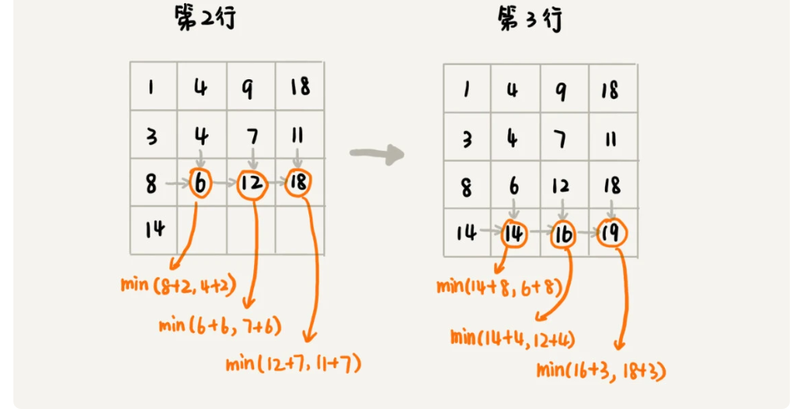

弄懂了填表的过程，代码实现就简单多了。我们将上面的过程，翻译成代码，就是下面这个样子。结合着代码、图和文字描述，应该更容易理解我讲的内容。

```java
public int minDistDP(int[][] matrix, int n) {
  int[][] states = new int[n][n];
  int sum = 0;
  for (int j = 0; j < n; ++j) { // 初始化states的第一行数据
    sum += matrix[0][j];
    states[0][j] = sum;
  }
  sum = 0;
  for (int i = 0; i < n; ++i) { // 初始化states的第一列数据
    sum += matrix[i][0];
    states[i][0] = sum;
  }
  for (int i = 1; i < n; ++i) {
    for (int j = 1; j < n; ++j) {
      states[i][j] = 
            matrix[i][j] + Math.min(states[i][j-1], states[i-1][j]);
    }
  }
  return states[n-1][n-1];
}
```

#### 2. 状态转移方程法

状态转移方程法有点类似递归的解题思路。我们需要分析，某个问题如何通过子问题来递归求解，也就是所谓的最优子结构。根据最优子结构，写出递归公式，也就是所谓的状态转移方程。有了状态转移方程，代码实现就非常简单了。一般情况下，我们有两种代码实现方法，一种是**递归加“备忘录”**，另一种是**迭代递推**。

我们还是拿刚才的例子来举例。最优子结构前面已经分析过了，你可以回过头去再看下。为了方便你查看，我把状态转移方程放到这里。

```
min_dist(i, j) = w[i][j] + min(min_dist(i, j-1), min_dist(i-1, j))
```

这里我强调一下，**状态转移方程是解决动态规划的关键。**如果我们能写出状态转移方程，那动态规划问题基本上就解决一大半了，而翻译成代码非常简单。但是很多动态规划问题的状态本身就不好定义，状态转移方程也就更不好想到。

下面我用递归加“备忘录”的方式，将状态转移方程翻译成来代码，你可以看看。对于另一种实现方式，跟状态转移表法的代码实现是一样的，只是思路不同。

````java
private int[][] matrix = 
         {{1，3，5，9}, {2，1，3，4}，{5，2，6，7}，{6，8，4，3}};
private int n = 4;
private int[][] mem = new int[4][4];
public int minDist(int i, int j) { // 调用minDist(n-1, n-1);
  if (i == 0 && j == 0) return matrix[0][0];
  if (mem[i][j] > 0) return mem[i][j];
  int minLeft = Integer.MAX_VALUE;
  if (j-1 >= 0) {
    minLeft = minDist(i, j-1);
  }
  int minUp = Integer.MAX_VALUE;
  if (i-1 >= 0) {
    minUp = minDist(i-1, j);
  }
  
  int currMinDist = matrix[i][j] + Math.min(minLeft, minUp);
  mem[i][j] = currMinDist;
  return currMinDist;
}
````

两种动态规划解题思路到这里就讲完了。我要强调一点，不是每个问题都同时适合这两种解题思路。有的问题可能用第一种思路更清晰，而有的问题可能用第二种思路更清晰，所以，你要结合具体的题目来看，到底选择用哪种解题思路。

### 四种算法思想比较分析

到今天为止，我们已经学习了四种算法思想，贪心、分治、回溯和动态规划。今天的内容主要讲些理论知识，我正好一块儿也分析一下这四种算法，看看它们之间有什么区别和联系。

如果我们将这四种算法思想分一下类，那贪心、回溯、动态规划可以归为一类，而分治单独可以作为一类，因为它跟其他三个都不大一样。为什么这么说呢？前三个算法解决问题的模型，都可以抽象成我们今天讲的那个多阶段决策最优解模型，而分治算法解决的问题尽管大部分也是最优解问题，但是，大部分都不能抽象成多阶段决策模型。

回溯算法是个“万金油”。基本上能用的动态规划、贪心解决的问题，我们都可以用回溯算法解决。回溯算法相当于穷举搜索。穷举所有的情况，然后对比得到最优解。不过，回溯算法的时间复杂度非常高，是指数级别的，只能用来解决小规模数据的问题。对于大规模数据的问题，用回溯算法解决的执行效率就很低了。

尽管动态规划比回溯算法高效，但是，并不是所有问题，都可以用动态规划来解决。能用动态规划解决的问题，需要满足三个特征，最优子结构、无后效性和重复子问题。**在重复子问题这一点上，动态规划和分治算法的区分非常明显。分治算法要求分割成的子问题，不能有重复子问题，而动态规划正好相反，动态规划之所以高效，就是因为回溯算法实现中存在大量的重复子问题。**

贪心算法实际上是动态规划算法的一种特殊情况。它解决问题起来更加高效，代码实现也更加简洁。不过，它可以解决的问题也更加有限。它能解决的问题需要满足三个条件，最优子结构、无后效性和贪心选择性（这里我们不怎么强调重复子问题）。

其中，最优子结构、无后效性跟动态规划中的无异。“贪心选择性”的意思是，通过局部最优的选择，能产生全局的最优选择。每一个阶段，我们都选择当前看起来最优的决策，所有阶段的决策完成之后，最终由这些局部最优解构成全局最优解。

### 内容小结

今天的内容到此就讲完了，我带你来复习一下。

我首先讲了什么样的问题适合用动态规划解决。这些问题可以总结概括为“一个模型三个特征”。其中，“一个模型”指的是，问题可以抽象成分阶段决策最优解模型。“三个特征”指的是最优子结构、无后效性和重复子问题。

然后，我讲了两种动态规划的解题思路。它们分别是状态转移表法和状态转移方程法。其中，状态转移表法解题思路大致可以概括为，回溯算法实现 - 定义状态 - 画递归树 - 找重复子问题 - 画状态转移表 - 根据递推关系填表 - 将填表过程翻译成代码。状态转移方程法的大致思路可以概括为，找最优子结构 - 写状态转移方程 - 将状态转移方程翻译成代码。

最后，我们对比了之前讲过的四种算法思想。贪心、回溯、动态规划可以解决的问题模型类似，都可以抽象成多阶段决策最优解模型。尽管分治算法也能解决最优问题，但是大部分问题的背景都不适合抽象成多阶段决策模型。

今天的内容比较偏理论，可能会不好理解。很多理论知识的学习，单纯的填鸭式讲给你听，实际上效果并不好。要想真的把这些理论知识理解透，化为己用，还是需要你自己多思考，多练习。等你做了足够多的题目之后，自然就能自己悟出一些东西，这样再回过头来看理论，就会非常容易看懂。

所以，在今天的内容中，如果有哪些地方你还不能理解，那也没关系，先放一放。下一节，我会运用今天讲到的理论，再解决几个动态规划的问题。等你学完下一节，可以再回过头来看下今天的理论知识，可能就会有一种顿悟的感觉。

---

##  42 | 动态规划实战：如何实现搜索引擎中的拼写纠错功能？

在Trie 树那节我们讲过，利用 Trie 树，可以实现搜索引擎的关键词提示功能，这样可以节省用户输入搜索关键词的时间。实际上，搜索引擎在用户体验方面的优化还有很多，比如你可能经常会用的拼写纠错功能。

当你在搜索框中，一不小心输错单词时，搜索引擎会非常智能地检测出你的拼写错误，并且用对应的正确单词来进行搜索。作为一名软件开发工程师，你是否想过，这个功能是怎么实现的呢？


### 如何量化两个字符串的相似度？

计算机只认识数字，所以要解答开篇的问题，我们就要先来看，如何量化两个字符串之间的相似程度呢？有一个非常著名的量化方法，那就是**编辑距离**（Edit Distance）。

顾名思义，**编辑距离**指的就是，将一个字符串转化成另一个字符串，需要的最少编辑操作次数（比如增加一个字符、删除一个字符、替换一个字符）。编辑距离越大，说明两个字符串的相似程度越小；相反，编辑距离就越小，说明两个字符串的相似程度越大。对于两个完全相同的字符串来说，编辑距离就是 0。

根据所包含的编辑操作种类的不同，编辑距离有多种不同的计算方式，比较著名的有**莱文斯坦距离**（Levenshtein distance）和**最长公共子串长度**（Longest common substring length）。其中，莱文斯坦距离允许增加、删除、替换字符这三个编辑操作，最长公共子串长度只允许增加、删除字符这两个编辑操作。

关于这两个计算方法，我举个例子给你说明一下。这里面，两个字符串 mitcmu 和 mtacnu 的莱文斯坦距离是 3，最长公共子串长度是 4。


了解了编辑距离的概念之后，我们来看，如何快速计算两个字符串之间的编辑距离？

### 如何编程计算莱文斯坦距离？

之前我反复强调过，思考过程比结论更重要，所以，我现在就给你展示一下，解决这个问题，我的完整的思考过程。

这个问题是求把一个字符串变成另一个字符串，需要的最少编辑次数。整个求解过程，涉及多个决策阶段，我们需要依次考察一个字符串中的每个字符，跟另一个字符串中的字符是否匹配，匹配的话如何处理，不匹配的话又如何处理。所以，这个问题符合**多阶段决策最优解模型**。

我们前面讲了，贪心、回溯、动态规划可以解决的问题，都可以抽象成这样一个模型。要解决这个问题，我们可以先看一看，用最简单的回溯算法，该如何来解决。

回溯是一个递归处理的过程。如果 a[i]与 b[j]匹配，我们递归考察 a[i+1]和 b[j+1]。如果 a[i]与 b[j]不匹配，那我们有多种处理方式可选：

+ 可以删除 a[i]，然后递归考察 a[i+1]和 b[j]；
+ 可以删除 b[j]，然后递归考察 a[i]和 b[j+1]；
+ 可以在 a[i]前面添加一个跟 b[j]相同的字符，然后递归考察 a[i]和 b[j+1];
+ 可以在 b[j]前面添加一个跟 a[i]相同的字符，然后递归考察 a[i+1]和 b[j]；
+ 可以将 a[i]替换成 b[j]，或者将 b[j]替换成 a[i]，然后递归考察 a[i+1]和 b[j+1]。

我们将上面的回溯算法的处理思路，翻译成代码，就是下面这个样子：

```java
private char[] a = "mitcmu".toCharArray();
private char[] b = "mtacnu".toCharArray();
private int n = 6;
private int m = 6;
private int minDist = Integer.MAX_VALUE; // 存储结果
// 调用方式 lwstBT(0, 0, 0);
public lwstBT(int i, int j, int edist) {
  if (i == n || j == m) {
    if (i < n) edist += (n-i);
    if (j < m) edist += (m - j);
    if (edist < minDist) minDist = edist;
    return;
  }
  if (a[i] == b[j]) { // 两个字符匹配
    lwstBT(i+1, j+1, edist);
  } else { // 两个字符不匹配
    lwstBT(i + 1, j, edist + 1); // 删除a[i]或者b[j]前添加一个字符
    lwstBT(i, j + 1, edist + 1); // 删除b[j]或者a[i]前添加一个字符
    lwstBT(i + 1, j + 1, edist + 1); // 将a[i]和b[j]替换为相同字符
  }
}
```

根据回溯算法的代码实现，我们可以画出递归树，看是否存在重复子问题。如果存在重复子问题，那我们就可以考虑能否用动态规划来解决；如果不存在重复子问题，那回溯就是最好的解决方法。


在递归树中，每个节点代表一个状态，状态包含三个变量 (i, j, edist)，其中，edist 表示处理到 a[i]和 b[j]时，已经执行的编辑操作的次数。

在递归树中，(i, j) 两个变量重复的节点很多，比如 (3, 2) 和 (2, 3)。对于 (i, j) 相同的节点，我们只需要保留 edist 最小的，继续递归处理就可以了，剩下的节点都可以舍弃。所以，状态就从 (i, j, edist) 变成了 (i, j, min_edist)，其中 min_edist 表示处理到 a[i]和 b[j]，已经执行的最少编辑次数。

看到这里，你有没有觉得，这个问题跟上两节讲的动态规划例子非常相似？不过，这个问题的状态转移方式，要比之前两节课中讲到的例子都要复杂很多。上一节我们讲的矩阵最短路径问题中，到达状态 (i, j) 只能通过 (i-1, j) 或 (i, j-1) 两个状态转移过来，而今天这个问题，状态 (i, j) 可能从 (i-1, j)，(i, j-1)，(i-1, j-1) 三个状态中的任意一个转移过来。


基于刚刚的分析，我们可以尝试着将把状态转移的过程，用公式写出来。这就是我们前面讲的状态转移方程。

```
如果：a[i]!=b[j]，那么：min_edist(i, j)就等于：
min(min_edist(i-1,j)+1, min_edist(i,j-1)+1, min_edist(i-1,j-1)+1)

如果：a[i]==b[j]，那么：min_edist(i, j)就等于：
min(min_edist(i-1,j)+1, min_edist(i,j-1)+1，min_edist(i-1,j-1))

其中，min表示求三数中的最小值。     
```

了解了状态与状态之间的递推关系，我们画出一个二维的状态表，按行依次来填充状态表中的每个值。

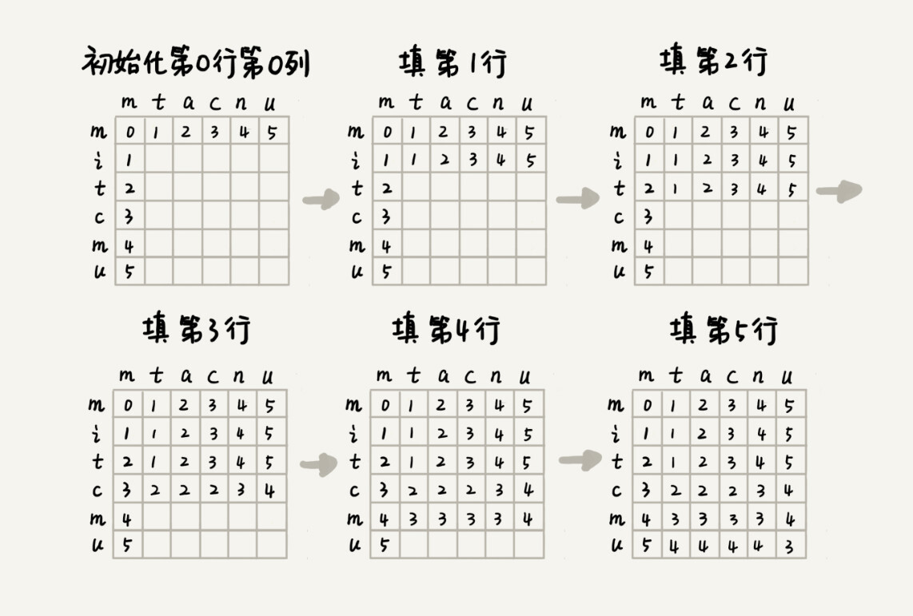

我们现在既有状态转移方程，又理清了完整的填表过程，代码实现就非常简单了。我将代码贴在下面，你可以对比着文字解释，一起看下。

```java
public int lwstDP(char[] a, int n, char[] b, int m) {
  int[][] minDist = new int[n][m];
  for (int j = 0; j < m; ++j) { // 初始化第0行:a[0..0]与b[0..j]的编辑距离
    if (a[0] == b[j]) minDist[0][j] = j;
    else if (j != 0) minDist[0][j] = minDist[0][j-1]+1;
    else minDist[0][j] = 1;
  }
  for (int i = 0; i < n; ++i) { // 初始化第0列:a[0..i]与b[0..0]的编辑距离
    if (a[i] == b[0]) minDist[i][0] = i;
    else if (i != 0) minDist[i][0] = minDist[i-1][0]+1;
    else minDist[i][0] = 1;
  }
  for (int i = 1; i < n; ++i) { // 按行填表
    for (int j = 1; j < m; ++j) {
      if (a[i] == b[j]) minDist[i][j] = min(
          minDist[i-1][j]+1, minDist[i][j-1]+1, minDist[i-1][j-1]);
      else minDist[i][j] = min(
          minDist[i-1][j]+1, minDist[i][j-1]+1, minDist[i-1][j-1]+1);
    }
  }
  return minDist[n-1][m-1];
}

private int min(int x, int y, int z) {
  int minv = Integer.MAX_VALUE;
  if (x < minv) minv = x;
  if (y < minv) minv = y;
  if (z < minv) minv = z;
  return minv;
}
```

你可能会说，我虽然能看懂你讲的思路，但是遇到新的问题的时候，我还是会感觉到无从下手。这种感觉是非常正常的。关于复杂算法问题的解决思路，我还有一些经验、小技巧，可以分享给你。

当我们拿到一个问题的时候，**我们可以先不思考，计算机会如何实现这个问题，而是单纯考虑“人脑”会如何去解决这个问题。**人脑比较倾向于思考具象化的、摸得着看得见的东西，不适合思考过于抽象的问题。所以，我们需要把抽象问题具象化。那如何具象化呢？我们可以实例化几个测试数据，通过人脑去分析具体实例的解，然后总结规律，再尝试套用学过的算法，看是否能够解决。

除此之外，我还有一个非常有效、但也算不上技巧的东西，我也反复强调过，那就是多练。实际上，等你做多了题目之后，自然就会有感觉，看到问题，立马就能想到能否用动态规划解决，然后直接就可以寻找最优子结构，写出动态规划方程，然后将状态转移方程翻译成代码。

### 如何编程计算最长公共子串长度？

前面我们讲到，最长公共子串作为编辑距离中的一种，只允许增加、删除字符两种编辑操作。从名字上，你可能觉得它看起来跟编辑距离没什么关系。实际上，从本质上来说，它表征的也是两个字符串之间的相似程度。

这个问题的解决思路，跟莱文斯坦距离的解决思路非常相似，也可以用动态规划解决。我刚刚已经详细讲解了莱文斯坦距离的动态规划解决思路，所以，针对这个问题，我直接定义状态，然后写状态转移方程。

每个状态还是包括三个变量 (i, j, max_lcs)，max_lcs 表示 a[0...i]和 b[0...j]的最长公共子串长度。那 (i, j) 这个状态都是由哪些状态转移过来的呢？

我们先来看回溯的处理思路。我们从 a[0]和 b[0]开始，依次考察两个字符串中的字符是否匹配。

+ 如果 a[i]与 b[j]互相匹配，我们将最大公共子串长度加一，并且继续考察 a[i+1]和 b[j+1]。
+ 如果 a[i]与 b[j]不匹配，最长公共子串长度不变，这个时候，有两个不同的决策路线：
  + 删除 a[i]，或者在 b[j]前面加上一个字符 a[i]，然后继续考察 a[i+1]和 b[j]；
  + 删除 b[j]，或者在 a[i]前面加上一个字符 b[j]，然后继续考察 a[i]和 b[j+1]。

反过来也就是说，如果我们要求 a[0...i]和 b[0...j]的最长公共长度 max_lcs(i, j)，我们只有可能通过下面三个状态转移过来：

+ (i-1, j-1, max_lcs)，其中 max_lcs 表示 a[0...i-1]和 b[0...j-1]的最长公共子串长度；
+ (i-1, j, max_lcs)，其中 max_lcs 表示 a[0...i-1]和 b[0...j]的最长公共子串长度；
+ (i, j-1, max_lcs)，其中 max_lcs 表示 a[0...i]和 b[0...j-1]的最长公共子串长度。

如果我们把这个转移过程，用状态转移方程写出来，就是下面这个样子：

```
如果：a[i]==b[j]，那么：max_lcs(i, j)就等于：
max(max_lcs(i-1,j-1)+1, max_lcs(i-1, j), max_lcs(i, j-1))；

如果：a[i]!=b[j]，那么：max_lcs(i, j)就等于：
max(max_lcs(i-1,j-1), max_lcs(i-1, j), max_lcs(i, j-1))；

其中max表示求三数中的最大值。
```

有了状态转移方程，代码实现就简单多了。我把代码贴到了下面，你可以对比着文字一块儿看。

```java
public int lcs(char[] a, int n, char[] b, int m) {
  int[][] maxlcs = new int[n][m];
  for (int j = 0; j < m; ++j) {//初始化第0行：a[0..0]与b[0..j]的maxlcs
    if (a[0] == b[j]) maxlcs[0][j] = 1;
    else if (j != 0) maxlcs[0][j] = maxlcs[0][j-1];
    else maxlcs[0][j] = 0;
  }
  for (int i = 0; i < n; ++i) {//初始化第0列：a[0..i]与b[0..0]的maxlcs
    if (a[i] == b[0]) maxlcs[i][0] = 1;
    else if (i != 0) maxlcs[i][0] = maxlcs[i-1][0];
    else maxlcs[i][0] = 0;
  }
  for (int i = 1; i < n; ++i) { // 填表
    for (int j = 1; j < m; ++j) {
      if (a[i] == b[j]) maxlcs[i][j] = max(
          maxlcs[i-1][j], maxlcs[i][j-1], maxlcs[i-1][j-1]+1);
      else maxlcs[i][j] = max(
          maxlcs[i-1][j], maxlcs[i][j-1], maxlcs[i-1][j-1]);
    }
  }
  return maxlcs[n-1][m-1];
}

private int max(int x, int y, int z) {
  int maxv = Integer.MIN_VALUE;
  if (x > maxv) maxv = x;
  if (y > maxv) maxv = y;
  if (z > maxv) maxv = z;
  return maxv;
}
```

### 解答开篇

今天的内容到此就讲完了，我们来看下开篇的问题。

当用户在搜索框内，输入一个拼写错误的单词时，我们就拿这个单词跟词库中的单词一一进行比较，计算编辑距离，将编辑距离最小的单词，作为纠正之后的单词，提示给用户。

这就是拼写纠错最基本的原理。不过，真正用于商用的搜索引擎，拼写纠错功能显然不会就这么简单。一方面，单纯利用编辑距离来纠错，效果并不一定好；另一方面，词库中的数据量可能很大，搜索引擎每天要支持海量的搜索，所以对纠错的性能要求很高。

针对纠错效果不好的问题，我们有很多种优化思路，我这里介绍几种。

+ 我们并不仅仅取出编辑距离最小的那个单词，而是取出编辑距离最小的 TOP 10，然后根据其他参数，决策选择哪个单词作为拼写纠错单词。比如使用搜索热门程度来决定哪个单词作为拼写纠错单词。
+ 我们还可以用多种编辑距离计算方法，比如今天讲到的两种，然后分别编辑距离最小的 TOP 10，然后求交集，用交集的结果，再继续优化处理。
+ 我们还可以通过统计用户的搜索日志，得到最常被拼错的单词列表，以及对应的拼写正确的单词。搜索引擎在拼写纠错的时候，首先在这个最常被拼错单词列表中查找。如果一旦找到，直接返回对应的正确的单词。这样纠错的效果非常好。
+ 我们还有更加高级一点的做法，引入个性化因素。针对每个用户，维护这个用户特有的搜索喜好，也就是常用的搜索关键词。当用户输入错误的单词的时候，我们首先在这个用户常用的搜索关键词中，计算编辑距离，查找编辑距离最小的单词。

针对纠错性能方面，我们也有相应的优化方式。我讲两种分治的优化思路。

+ 如果纠错功能的 TPS (TPS是transactioms per second，每秒任务数)不高，我们可以部署多台机器，每台机器运行一个独立的纠错功能。当有一个纠错请求的时候，我们通过负载均衡，分配到其中一台机器，来计算编辑距离，得到纠错单词。

+ 如果纠错系统的响应时间太长，也就是，每个纠错请求处理时间过长，我们可以将纠错的词库，分割到很多台机器。当有一个纠错请求的时候，我们就将这个拼写错误的单词，同时发送到这多台机器，让多台机器并行处理，分别得到编辑距离最小的单词，然后再比对合并，最终决定出一个最优的纠错单词。

真正的搜索引擎的拼写纠错优化，肯定不止我讲的这么简单，但是万变不离其宗。掌握了核心原理，就是掌握了解决问题的方法，剩下就靠你自己的灵活运用和实战操练了。

### 课后思考

我们有一个数字序列包含 n 个不同的数字，如何求出这个序列中的最长递增子序列长度？比如 2, 9, 3, 6, 5, 1, 7 这样一组数字序列，它的最长递增子序列就是 2, 3, 5, 7，所以最长递增子序列的长度是 4。

leetcode 300

---

# 高级篇

## 43 | 拓扑排序：如何确定代码源文件的编译依赖关系？


从今天开始，我们就进入了专栏的高级篇。相对基础篇，高级篇涉及的知识点，都比较零散，不是太系统。所以，我会围绕一个实际软件开发的问题，在阐述具体解决方法的过程中，将涉及的知识点给你详细讲解出来。

所以，相较于基础篇“开篇问题 - 知识讲解 - 回答开篇 - 总结 - 课后思考”这样的文章结构，高级篇我稍作了些改变，大致分为这样几个部分：“问题阐述 - 算法解析 - 总结引申 - 课后思考”。

好了，现在，我们就进入高级篇的第一节，**如何确定代码源文件的编译依赖关系？**

我们知道，一个完整的项目往往会包含很多代码源文件。编译器在编译整个项目的时候，需要按照依赖关系，依次编译每个源文件。比如，A.cpp 依赖 B.cpp，那在编译的时候，编译器需要先编译 B.cpp，才能编译 A.cpp。

编译器通过分析源文件或者程序员事先写好的编译配置文件（比如 Makefile 文件），来获取这种局部的依赖关系。**那编译器又该如何通过源文件两两之间的局部依赖关系，确定一个全局的编译顺序呢？**


### 算法解析

这个问题的解决思路与“图”这种数据结构的一个经典算法“拓扑排序算法”有关。那什么是拓扑排序呢？这个概念很好理解，我们先来看一个生活中的拓扑排序的例子。

我们在穿衣服的时候都有一定的顺序，我们可以把这种顺序想成，衣服与衣服之间有一定的依赖关系。比如说，你必须先穿袜子才能穿鞋，先穿内裤才能穿秋裤。假设我们现在有八件衣服要穿，它们之间的两两依赖关系我们已经很清楚了，那如何安排一个穿衣序列，能够满足所有的两两之间的依赖关系？


弄懂了这个生活中的例子，开篇的关于编译顺序的问题，你应该也有思路了。开篇问题跟这个问题的模型是一样的，也可以抽象成一个拓扑排序问题。

我前面多次讲过，算法是构建在具体的数据结构之上的。针对这个问题，我们先来看下，如何将问题背景抽象成具体的数据结构？

我们可以把源文件与源文件之间的依赖关系，抽象成一个有向图。每个源文件对应图中的一个顶点，源文件之间的依赖关系就是顶点之间的边。

如果 a 先于 b 执行，也就是说 b 依赖于 a，那么就在顶点 a 和顶点 b 之间，构建一条从 a 指向 b 的边。而且，这个图不仅要是有向图，还要是一个有向无环图，也就是不能存在像 a->b->c->a 这样的循环依赖关系。因为图中一旦出现环，拓扑排序就无法工作了。实际上，拓扑排序本身就是基于**有向无环图**的一个算法。

```java
public class Graph {
  private int v; // 顶点的个数
  private LinkedList<Integer> adj[]; // 邻接表

  public Graph(int v) {
    this.v = v;
    adj = new LinkedList[v];
    for (int i=0; i<v; ++i) {
      adj[i] = new LinkedList<>();
    }
  }

  public void addEdge(int s, int t) { // s先于t，边s->t
    adj[s].add(t);
  }
}
```

数据结构定义好了，现在，我们来看，**如何在这个有向无环图上，实现拓扑排序？**

拓扑排序有两种实现方法，都不难理解。它们分别是 **Kahn 算法**和 **DFS 深度优先搜索算法**。我们依次来看下它们都是怎么工作的。

#### 1.Kahn 算法

Kahn 算法实际上用的是贪心算法思想，思路非常简单、好懂。

定义数据结构的时候，如果 s 需要先于 t 执行，那就添加一条 s 指向 t 的边。所以，如果某个顶点入度为 0， 也就表示，没有任何顶点必须先于这个顶点执行，那么这个顶点就可以执行了。

我们先从图中，找出一个入度为 0 的顶点，将其输出到拓扑排序的结果序列中（对应代码中就是把它打印出来），并且把这个顶点从图中删除（也就是把这个顶点可达的顶点的入度都减 1）。我们循环执行上面的过程，直到所有的顶点都被输出。最后输出的序列，就是满足局部依赖关系的拓扑排序。

我把 Kahn 算法用代码实现了一下，你可以结合着文字描述一块看下。不过，你应该能发现，这段代码实现更有技巧一些，并没有真正删除顶点的操作。代码中有详细的注释，你自己来看，我就不多解释了。

```java
public void topoSortByKahn() {
  int[] inDegree = new int[v]; // 统计每个顶点的入度
  for (int i = 0; i < v; ++i) {
    for (int j = 0; j < adj[i].size(); ++j) {
      int w = adj[i].get(j); // i->w
      inDegree[w]++;
    }
  }
  LinkedList<Integer> queue = new LinkedList<>();
  for (int i = 0; i < v; ++i) {
    if (inDegree[i] == 0) queue.add(i);
  }
  while (!queue.isEmpty()) {
    int i = queue.remove();
    System.out.print("->" + i);
    for (int j = 0; j < adj[i].size(); ++j) {
      int k = adj[i].get(j);
      inDegree[k]--;
      if (inDegree[k] == 0) queue.add(k);
    }
  }
}
```

#### 2.DFS 算法

图上的深度优先搜索我们前面已经讲过了，实际上，拓扑排序也可以用深度优先搜索来实现。不过这里的名字要稍微改下，更加确切的说法应该是深度优先遍历，遍历图中的所有顶点，而非只是搜索一个顶点到另一个顶点的路径。

关于这个算法的实现原理，我先把代码贴在下面，下面给你具体解释。

```java
public void topoSortByDFS() {
  // 先构建逆邻接表，边s->t表示，s依赖于t，t先于s
  LinkedList<Integer> inverseAdj[] = new LinkedList[v];
  for (int i = 0; i < v; ++i) { // 申请空间
    inverseAdj[i] = new LinkedList<>();
  }
  for (int i = 0; i < v; ++i) { // 通过邻接表生成逆邻接表
    for (int j = 0; j < adj[i].size(); ++j) {
      int w = adj[i].get(j); // i->w
      inverseAdj[w].add(i); // w->i
    }
  }
  boolean[] visited = new boolean[v];
  for (int i = 0; i < v; ++i) { // 深度优先遍历图
    if (visited[i] == false) {
      visited[i] = true;
      dfs(i, inverseAdj, visited);
    }
  }
}

private void dfs(
    int vertex, LinkedList<Integer> inverseAdj[], boolean[] visited) {
  for (int i = 0; i < inverseAdj[vertex].size(); ++i) {
    int w = inverseAdj[vertex].get(i);
    if (visited[w] == true) continue;
    visited[w] = true;
    dfs(w, inverseAdj, visited);
  } // 先把vertex这个顶点可达的所有顶点都打印出来之后，再打印它自己
  System.out.print("->" + vertex);
}
```

这个算法包含两个关键部分。

第一部分是**通过邻接表构造逆邻接表**。邻接表中，边 s->t 表示 s 先于 t 执行，也就是 t 要依赖 s。在逆邻接表中，边 s->t 表示 s 依赖于 t，s 后于 t 执行。为什么这么转化呢？这个跟我们这个算法的实现思想有关。

第二部分是这个算法的核心，也就是**递归处理每个顶点**。对于顶点 vertex 来说，我们先输出它可达的所有顶点，也就是说，先把它依赖的所有的顶点输出了，然后再输出自己。

到这里，用 Kahn 算法和 DFS 算法求拓扑排序的原理和代码实现都讲完了。我们来看下，**这两个算法的时间复杂度分别是多少呢**？

从 Kahn 代码中可以看出来，每个顶点被访问了一次，每个边也都被访问了一次，所以，Kahn 算法的时间复杂度就是 **O(V+E)**（V 表示顶点个数，E 表示边的个数）。

DFS 算法的时间复杂度我们之前分析过。每个顶点被访问两次，每条边都被访问一次，所以时间复杂度也是 **O(V+E)**。

注意，这里的图可能不是连通的，有可能是有好几个不连通的子图构成，所以，E 并不一定大于 V，两者的大小关系不确定。所以，在表示时间复杂度的时候，V、E 都要考虑在内。

### 总结引申

在基础篇中，关于“图”，我们讲了图的定义和存储、图的广度和深度优先搜索。今天，我们又讲了一个关于图的算法，拓扑排序。

拓扑排序应用非常广泛，解决的问题的模型也非常一致。凡是需要通过局部顺序来推导全局顺序的，一般都能用拓扑排序来解决。除此之外，拓扑排序还能检测图中环的存在。对于 Kahn 算法来说，如果最后输出出来的顶点个数，少于图中顶点个数，图中还有入度不是 0 的顶点，那就说明，图中存在环。

关于图中环的检测，我们在递归那一节讲过一个例子，在查找最终推荐人的时候，可能会因为脏数据，造成存在循环推荐，比如，用户 A 推荐了用户 B，用户 B 推荐了用户 C，用户 C 又推荐了用户 A。如何避免这种脏数据导致的无限递归？这个问题，我当时留给你思考了，现在是时候解答了。

实际上，这就是环的检测问题。因为我们每次都只是查找一个用户的最终推荐人，所以，我们并不需要动用复杂的拓扑排序算法，而只需要记录已经访问过的用户 ID，当用户 ID 第二次被访问的时候，就说明存在环，也就说明存在脏数据。

```java
HashSet<Integer> hashTable = new HashSet<>(); // 保存已经访问过的actorId
long findRootReferrerId(long actorId) {
  if (hashTable.contains(actorId)) { // 存在环
    return;
  }
  hashTable.add(actorId);
  Long referrerId = 
       select referrer_id from [table] where actor_id = actorId;
  if (referrerId == null) return actorId;
  return findRootReferrerId(referrerId);
}
```

如果把这个问题改一下，我们想要知道，数据库中的所有用户之间的推荐关系了，有没有存在环的情况。这个问题，就需要用到拓扑排序算法了。我们把用户之间的推荐关系，从数据库中加载到内存中，然后构建成今天讲的这种有向图数据结构，再利用拓扑排序，就可以快速检测出是否存在环了。

### 课后思考

1. 在今天的讲解中，我们用图表示依赖关系的时候，如果 a 先于 b 执行，我们就画一条从 a 到 b 的有向边；反过来，如果 a 先于 b，我们画一条从 b 到 a 的有向边，表示 b 依赖 a，那今天讲的 Kahn 算法和 DFS 算法还能否正确工作呢？如果不能，应该如何改造一下呢？

对于kahn算法，可以先打印出度为0的结点，出度为0代表没有依赖的元素

对于DFS，可以直接使用正邻接表，这样最终先打印的就是没有需要依赖的结点

---

## 44 | 最短路径：地图软件是如何计算出最优出行路径的？

leetcode 743官方解析


   

基础篇的时候，我们学习了图的两种搜索算法，深度优先搜索和广度优先搜索。这两种算法主要是针对无权图的搜索算法。针对有权图，也就是图中的每条边都有一个权重，我们该如何计算两点之间的最短路径（经过的边的权重和最小）呢？今天，我就从地图软件的路线规划问题讲起，带你看看常用的**最短路径算法**（Shortest Path Algorithm）。

像 Google 地图、百度地图、高德地图这样的地图软件，我想你应该经常使用吧？如果想从家开车到公司，你只需要输入起始、结束地址，地图就会给你规划一条最优出行路线。这里的最优，有很多种定义，比如最短路线、最少用时路线、最少红绿灯路线等等。**作为一名软件开发工程师，你是否思考过，地图软件的最优路线是如何计算出来的吗？底层依赖了什么算法呢？**

### 算法解析

我们刚提到的最优问题包含三个：最短路线、最少用时和最少红绿灯。我们先解决最简单的，最短路线。

解决软件开发中的实际问题，最重要的一点就是**建模**，也就是将复杂的场景抽象成具体的数据结构。针对这个问题，我们该如何抽象成数据结构呢？

我们之前也提到过，图这种数据结构的表达能力很强，显然，把地图抽象成图最合适不过了。我们把每个岔路口看作一个顶点，岔路口与岔路口之间的路看作一条边，路的长度就是边的权重。如果路是单行道，我们就在两个顶点之间画一条有向边；如果路是双行道，我们就在两个顶点之间画两条方向不同的边。这样，整个地图就被抽象成一个有向有权图。

具体的代码实现，我放在下面了。于是，我们要求解的问题就转化为，在一个有向有权图中，求两个顶点间的最短路径。

```java
public class Graph { // 有向有权图的邻接表表示
  private LinkedList<Edge> adj[]; // 邻接表
  private int v; // 顶点个数

  public Graph(int v) {
    this.v = v;
    this.adj = new LinkedList[v];
    for (int i = 0; i < v; ++i) {
      this.adj[i] = new LinkedList<>();
    }
  }

  public void addEdge(int s, int t, int w) { // 添加一条边
    this.adj[s].add(new Edge(s, t, w));
  }

  private class Edge {
    public int sid; // 边的起始顶点编号
    public int tid; // 边的终止顶点编号
    public int w; // 权重
    public Edge(int sid, int tid, int w) {
      this.sid = sid;
      this.tid = tid;
      this.w = w;
    }
  }
  // 下面这个类是为了dijkstra实现用的
  private class Vertex {
    public int id; // 顶点编号ID
    public int dist; // 从起始顶点到这个顶点的距离
    public Vertex(int id, int dist) {
      this.id = id;
      this.dist = dist;
    }
  }
}
```

想要解决这个问题，有一个非常经典的算法，最短路径算法，更加准确地说，是**单源最短路径算法**（一个顶点到一个顶点）。提到最短路径算法，最出名的莫过于 Dijkstra 算法了。所以，我们现在来看，Dijkstra 算法是怎么工作的。

这个算法的原理稍微有点儿复杂，单纯的文字描述，不是很好懂。所以，我还是结合代码来讲解。

```java
// 因为Java提供的优先级队列，没有暴露更新数据的接口，所以我们需要重新实现一个
private class PriorityQueue { // 根据vertex.dist构建小顶堆
  private Vertex[] nodes;
  private int count;
  public PriorityQueue(int v) {
    this.nodes = new Vertex[v+1];
    this.count = v;
  }
  public Vertex poll() { // TODO: 留给读者实现... }
  public void add(Vertex vertex) { // TODO: 留给读者实现...}
  // 更新结点的值，并且从下往上堆化，重新符合堆的定义。时间复杂度O(logn)。
  public void update(Vertex vertex) { // TODO: 留给读者实现...} 
  public boolean isEmpty() { // TODO: 留给读者实现...}
}

public void dijkstra(int s, int t) { // 从顶点s到顶点t的最短路径
  int[] predecessor = new int[this.v]; // 用来还原最短路径
  Vertex[] vertexes = new Vertex[this.v];
  for (int i = 0; i < this.v; ++i) {
    vertexes[i] = new Vertex(i, Integer.MAX_VALUE);
  }
  PriorityQueue queue = new PriorityQueue(this.v);// 小顶堆
  boolean[] inqueue = new boolean[this.v]; // 标记是否进入过队列
  vertexes[s].dist = 0;
  queue.add(vertexes[s]);
  inqueue[s] = true;
  while (!queue.isEmpty()) {
    Vertex minVertex= queue.poll(); // 取堆顶元素并删除
    if (minVertex.id == t) break; // 最短路径产生了
    for (int i = 0; i < adj[minVertex.id].size(); ++i) {
      Edge e = adj[minVertex.id].get(i); // 取出一条minVetex相连的边
      Vertex nextVertex = vertexes[e.tid]; // minVertex-->nextVertex
      if (minVertex.dist + e.w < nextVertex.dist) { // 更新next的dist
        nextVertex.dist = minVertex.dist + e.w;
        predecessor[nextVertex.id] = minVertex.id;
        if (inqueue[nextVertex.id] == true) {
          queue.update(nextVertex); // 更新队列中的dist值
        } else {
          queue.add(nextVertex);
          inqueue[nextVertex.id] = true;
        }
      }
    }
  }
  // 输出最短路径
  System.out.print(s);
  print(s, t, predecessor);
}

private void print(int s, int t, int[] predecessor) {
  if (s == t) return;
  print(s, predecessor[t], predecessor);
  System.out.print("->" + t);
}
```

我们用 vertexes 数组，记录从起始顶点到每个顶点的距离（dist）。起初，我们把所有顶点的 dist 都初始化为无穷大（也就是代码中的 Integer.MAX_VALUE）。我们把起始顶点的 dist 值初始化为 0，然后将其放到优先级队列中。

我们从优先级队列中取出 dist 最小的顶点 minVertex，然后考察这个顶点可达的所有顶点（代码中的 nextVertex）。如果 minVertex 的 dist 值加上 minVertex 与 nextVertex 之间边的权重 w 小于 nextVertex 当前的 dist 值，也就是说，存在另一条更短的路径，它经过 minVertex 到达 nextVertex。那我们就把 nextVertex 的 dist 更新为 minVertex 的 dist 值加上 w。然后，我们把 nextVertex 加入到优先级队列中。重复这个过程，直到找到终止顶点 t 或者队列为空。

以上就是 Dijkstra 算法的核心逻辑。除此之外，代码中还有两个额外的变量，predecessor 数组和 inqueue 数组。

predecessor 数组的作用是为了还原最短路径，它记录每个顶点的前驱顶点。最后，我们通过递归的方式，将这个路径打印出来。打印路径的 print 递归代码我就不详细讲了，这个跟我们在图的搜索中讲的打印路径方法一样。如果不理解的话，你可以回过头去看下那一节。

inqueue 数组是为了避免将一个顶点多次添加到优先级队列中。我们更新了某个顶点的 dist 值之后，如果这个顶点已经在优先级队列中了，就不要再将它重复添加进去了。

看完了代码和文字解释，你可能还是有点懵，那我就举个例子，再给你解释一下。


理解了 Dijkstra 的原理和代码实现，我们来看下，**Dijkstra 算法的时间复杂度是多少？**

在刚刚的代码实现中，最复杂就是 while 循环嵌套 for 循环那部分代码了。while 循环最多会执行 V 次（V 表示顶点的个数），而内部的 for 循环的执行次数不确定，跟每个顶点的相邻边的个数有关，我们分别记作 E0，E1，E2，……，E(V-1)。如果我们把这 V 个顶点的边都加起来，最大也不会超过图中所有边的个数 E（E 表示边的个数）。

for 循环内部的代码涉及从优先级队列取数据、往优先级队列中添加数据、更新优先级队列中的数据，这样三个主要的操作。我们知道，优先级队列是用堆来实现的，堆中的这几个操作，时间复杂度都是 O(logV)（堆中的元素个数不会超过顶点的个数 V）。

所以，综合这两部分，再利用乘法原则，整个代码的时间复杂度就是 O(E*logV)。

弄懂了 Dijkstra 算法，我们再来回答之前的问题，如何计算最优出行路线？

从理论上讲，用 Dijkstra 算法可以计算出两点之间的最短路径。但是，你有没有想过，对于一个超级大地图来说，岔路口、道路都非常多，对应到图这种数据结构上来说，就有非常多的顶点和边。如果为了计算两点之间的最短路径，在一个超级大图上动用 Dijkstra 算法，遍历所有的顶点和边，显然会非常耗时。那我们有没有什么优化的方法呢？

做工程不像做理论，一定要给出个最优解。理论上算法再好，如果执行效率太低，也无法应用到实际的工程中。**对于软件开发工程师来说，我们经常要根据问题的实际背景，对解决方案权衡取舍。类似出行路线这种工程上的问题，我们没有必要非得求出个绝对最优解。很多时候，为了兼顾执行效率，我们只需要计算出一个可行的次优解就可以了。**

有了这个原则，你能想出刚刚那个问题的优化方案吗？

虽然地图很大，但是两点之间的最短路径或者说较好的出行路径，并不会很“发散”，只会出现在两点之间和两点附近的区块内。所以我们可以在整个大地图上，划出一个小的区块，这个小区块恰好可以覆盖住两个点，但又不会很大。我们只需要在这个小区块内部运行 Dijkstra 算法，这样就可以避免遍历整个大图，也就大大提高了执行效率。

不过你可能会说了，如果两点距离比较远，从北京海淀区某个地点，到上海黄浦区某个地点，那上面的这种处理方法，显然就不工作了，毕竟覆盖北京和上海的区块并不小。

我给你点提示，你可以现在打开地图 App，缩小放大一下地图，看下地图上的路线有什么变化，然后再思考，这个问题该怎么解决。

对于这样两点之间距离较远的路线规划，我们可以把北京海淀区或者北京看作一个顶点，把上海黄浦区或者上海看作一个顶点，先规划大的出行路线。比如，如何从北京到上海，必须要经过某几个顶点，或者某几条干道，然后再细化每个阶段的小路线。

这样，最短路径问题就解决了。我们再来看另外两个问题，最少时间和最少红绿灯。

前面讲最短路径的时候，每条边的权重是路的长度。在计算最少时间的时候，算法还是不变，我们只需要把边的权重，从路的长度变成经过这段路所需要的时间。不过，这个时间会根据拥堵情况时刻变化。如何计算车通过一段路的时间呢？这是一个蛮有意思的问题，你可以自己思考下。

每经过一条边，就要经过一个红绿灯。关于最少红绿灯的出行方案，实际上，我们只需要把每条边的权值改为 1 即可，算法还是不变，可以继续使用前面讲的 Dijkstra 算法。不过，边的权值为 1，也就相当于无权图了，我们还可以使用之前讲过的广度优先搜索算法。因为我们前面讲过，广度优先搜索算法计算出来的两点之间的路径，就是两点的最短路径。

不过，这里给出的所有方案都非常粗糙，只是为了给你展示，如何结合实际的场景，灵活地应用算法，让算法为我们所用，真实的地图软件的路径规划，要比这个复杂很多。而且，比起 Dijkstra 算法，地图软件用的更多的是类似 A* 的启发式搜索算法，不过也是在 Dijkstra 算法上的优化罢了，我们后面会讲到，这里暂且不展开。

### 总结引申

今天，我们学习了一种非常重要的图算法，**Dijkstra 最短路径算法。**实际上，最短路径算法还有很多，比如 Bellford 算法、Floyd 算法等等。如果感兴趣，你可以自己去研究。

关于 Dijkstra 算法，我只讲了原理和代码实现。对于正确性，我没有去证明。之所以这么做，是因为证明过程会涉及比较复杂的数学推导。这个并不是我们的重点，你只要掌握这个算法的思路就可以了。

这些算法实现思路非常经典，掌握了这些思路，我们可以拿来指导、解决其他问题。比如 Dijkstra 这个算法的核心思想，就可以拿来解决下面这个看似完全不相关的问题。这个问题是我之前工作中遇到的真实的问题，为了在较短的篇幅里把问题介绍清楚，我对背景做了一些简化。

我们有一个翻译系统，只能针对单个词来做翻译。如果要翻译一整个句子，我们需要将句子拆成一个一个的单词，再丢给翻译系统。针对每个单词，翻译系统会返回一组可选的翻译列表，并且针对每个翻译打一个分，表示这个翻译的可信程度。


针对每个单词，我们从可选列表中，选择其中一个翻译，组合起来就是整个句子的翻译。每个单词的翻译的得分之和，就是整个句子的翻译得分。随意搭配单词的翻译，会得到一个句子的不同翻译。针对整个句子，我们希望计算出得分最高的前 k 个翻译结果，你会怎么编程来实现呢？


当然，最简单的办法还是借助回溯算法，穷举所有的排列组合情况，然后选出得分最高的前 k 个翻译结果。但是，这样做的时间复杂度会比较高，是 O(m^n)，其中，m 表示平均每个单词的可选翻译个数，n 表示一个句子中包含多少个单词。这个解决方案，你可以当作回溯算法的练习题，自己编程实现一下，我就不多说了。

实际上，这个问题可以借助 Dijkstra 算法的核心思想，非常高效地解决。每个单词的可选翻译是按照分数从大到小排列的，所以 a0b0c0 肯定是得分最高组合结果。我们把 a0b0c0 及得分作为一个对象，放入到优先级队列中。

我们每次从优先级队列中取出一个得分最高的组合，并基于这个组合进行扩展。扩展的策略是每个单词的翻译分别替换成下一个单词的翻译。比如 a0b0c0 扩展后，会得到三个组合，a1b0c0、a0b1c0、a0b0c1。我们把扩展之后的组合，加到优先级队列中。重复这个过程，直到获取到 k 个翻译组合或者队列为空。


我们来看，这种实现思路的时间复杂度是多少？

假设句子包含 n 个单词，每个单词平均有 m 个可选的翻译，我们求得分最高的前 k 个组合结果。每次一个组合出队列，就对应着一个组合结果，我们希望得到 k 个，那就对应着 k 次出队操作。每次有一个组合出队列，就有 n 个组合入队列。优先级队列中出队和入队操作的时间复杂度都是 O(logX)，X 表示队列中的组合个数。所以，总的时间复杂度就是 O(k*n*logX)。那 X 到底是多少呢？

k 次出入队列，队列中的总数据不会超过 k*n，也就是说，出队、入队操作的时间复杂度是 O(log(k*n))。所以，总的时间复杂度就是 O(k*n*log(k*n))，比之前的指数级时间复杂度降低了很多。

---

## 45 | 位图：如何实现网页爬虫中的URL去重功能？


网页爬虫是搜索引擎中的非常重要的系统，负责爬取几十亿、上百亿的网页。爬虫的工作原理是，通过解析已经爬取页面中的网页链接，然后再爬取这些链接对应的网页。而**同一个网页链接有可能被包含在多个页面中，这就会导致爬虫在爬取的过程中，重复爬取相同的网页。如果你是一名负责爬虫的工程师，你会如何避免这些重复的爬取呢？**

最容易想到的方法就是，我们记录已经爬取的网页链接（也就是 URL），在爬取一个新的网页之前，我们拿它的链接，在已经爬取的网页链接列表中搜索。如果存在，那就说明这个网页已经被爬取过了；如果不存在，那就说明这个网页还没有被爬取过，可以继续去爬取。等爬取到这个网页之后，我们将这个网页的链接添加到已经爬取的网页链接列表了。

思路非常简单，我想你应该很容易就能想到。不过，我们该如何记录已经爬取的网页链接呢？需要用什么样的数据结构呢？

### 算法解析

关于这个问题，我们可以先回想下，是否可以用我们之前学过的数据结构来解决呢？

这个问题要处理的对象是网页链接，也就是 URL，需要支持的操作有两个，添加一个 URL 和查询一个 URL。除了这两个功能性的要求之外，在非功能性方面，我们还要求这两个操作的执行效率要尽可能高。除此之外，因为我们处理的是上亿的网页链接，内存消耗会非常大，所以在存储效率上，我们要尽可能地高效。

我们回想一下，满足这些条件的数据结构有哪些呢？显然，散列表、红黑树、跳表这些动态数据结构，都能支持快速地插入、查找数据，但是在内存消耗方面，是否可以接受呢？

我们拿散列表来举例。假设我们要爬取 10 亿个网页（像 Google、百度这样的通用搜索引擎，爬取的网页可能会更多），为了判重，我们把这 10 亿网页链接存储在散列表中。你来估算下，大约需要多少内存？

我们拿散列表来举例。假设我们要爬取 10 亿个网页（像 Google、百度这样的通用搜索引擎，爬取的网页可能会更多），为了判重，我们把这 10 亿网页链接存储在散列表中。你来估算下，大约需要多少内存？

当然，对于一个大型的搜索引擎来说，即便是 100GB 的内存要求，其实也不算太高，我们可以采用分治的思想，用多台机器（比如 20 台内存是 8GB 的机器）来存储这 10 亿网页链接。这种分治的处理思路，我们讲过很多次了，这里就不详细说了。

对于爬虫的 URL 去重这个问题，刚刚讲到的分治加散列表的思路，已经是可以实实在在工作的了。不过，作为一个有追求的工程师，我们应该考虑，在添加、查询数据的效率以及内存消耗方面，是否还有进一步的优化空间呢？

对于爬虫的 URL 去重这个问题，刚刚讲到的分治加散列表的思路，已经是可以实实在在工作的了。**不过，作为一个有追求的工程师，我们应该考虑，在添加、查询数据的效率以及内存消耗方面，是否还有进一步的优化空间呢？**

你可能会说，散列表中添加、查找数据的时间复杂度已经是 O(1)，还能有进一步优化的空间吗？实际上，我们前面也讲过，时间复杂度并不能完全代表代码的执行时间。大 O 时间复杂度表示法，会忽略掉常数、系数和低阶，并且统计的对象是语句的频度。不同的语句，执行时间也是不同的。时间复杂度只是表示执行时间随数据规模的变化趋势，并不能度量在特定的数据规模下，代码执行时间的多少。

如果时间复杂度中原来的系数是 10，我们现在能够通过优化，将系数降为 1，那在时间复杂度没有变化的情况下，执行效率就提高了 10 倍。对于实际的软件开发来说，10 倍效率的提升，显然是一个非常值得的优化。

如果我们用基于链表的方法解决冲突问题，散列表中存储的是 URL，那当查询的时候，通过哈希函数定位到某个链表之后，我们还需要依次比对每个链表中的 URL。这个操作是比较耗时的，主要有两点原因。

一方面，链表中的结点在内存中不是连续存储的，所以不能一下子加载到 CPU 缓存中，没法很好地利用到 CPU 高速缓存，所以数据访问性能方面会打折扣。

另一方面，链表中的每个数据都是 URL，而 URL 不是简单的数字，是平均长度为 64 字节的字符串。也就是说，我们要让待判重的 URL，跟链表中的每个 URL，做字符串匹配。显然，这样一个字符串匹配操作，比起单纯的数字比对，要慢很多。所以，基于这两点，执行效率方面肯定是有优化空间的。

对于内存消耗方面的优化，除了刚刚这种基于散列表的解决方案，貌似没有更好的法子了。实际上，如果要想内存方面有明显的节省，那就得换一种解决方案，也就是我们今天要着重讲的这种存储结构，**布隆过滤器**（Bloom Filter）。

在讲布隆过滤器前，我要先讲一下另一种存储结构，**位图**（BitMap）。因为，布隆过滤器本身就是基于位图的，是对位图的一种改进。

我们先来看一个跟开篇问题非常类似、但比那个稍微简单的问题。**我们有 1 千万个整数，整数的范围在 1 到 1 亿之间。如何快速查找某个整数是否在这 1 千万个整数中呢？**

当然，这个问题还是可以用散列表来解决。不过，我们可以使用一种比较“特殊”的散列表，那就是位图。我们申请一个大小为 1 亿、数据类型为布尔类型（true 或者 false）的数组。我们将这 1 千万个整数作为数组下标，将对应的数组值设置成 true。比如，整数 5 对应下标为 5 的数组值设置为 true，也就是 array[5]=true。

当我们查询某个整数 K 是否在这 1 千万个整数中的时候，我们只需要将对应的数组值 array[K]取出来，看是否等于 true。如果等于 true，那说明 1 千万整数中包含这个整数 K；相反，就表示不包含这个整数 K。

不过，很多语言中提供的布尔类型，大小是 1 个字节的，并不能节省太多内存空间。实际上，表示 true 和 false 两个值，我们只需要用一个二进制位（bit）就可以了。**那如何通过编程语言，来表示一个二进制位呢？**

这里就要用到位运算了。我们可以借助编程语言中提供的数据类型，比如 int、long、char 等类型，通过位运算，用其中的某个位表示某个数字。文字描述起来有点儿不好理解，我把位图的代码实现写了出来，你可以对照着代码看下，应该就能看懂了。

```java
public class BitMap { // Java中char类型占16bit，也即是2个字节
  private char[] bytes;
  private int nbits;
  
  public BitMap(int nbits) {
    this.nbits = nbits;
    this.bytes = new char[nbits/16+1];
  }

  public void set(int k) {
    if (k > nbits) return;
    int byteIndex = k / 16;
    int bitIndex = k % 16;
    bytes[byteIndex] |= (1 << bitIndex);
  }

  public boolean get(int k) {
    if (k > nbits) return false;
    int byteIndex = k / 16;
    int bitIndex = k % 16;
    return (bytes[byteIndex] & (1 << bitIndex)) != 0;
  }
}
```

从刚刚位图结构的讲解中，你应该可以发现，位图通过数组下标来定位数据，所以，访问效率非常高。而且，每个数字用一个二进制位来表示，在数字范围不大的情况下，所需要的内存空间非常节省。

比如刚刚那个例子，如果用散列表存储这 1 千万的数据，数据是 32 位的整型数，也就是需要 4 个字节的存储空间，那总共至少需要 40MB 的存储空间。如果我们通过位图的话，数字范围在 1 到 1 亿之间，只需要 1 亿个二进制位，也就是 12MB 左右的存储空间就够了。

关于位图，我们就讲完了，是不是挺简单的？不过，这里我们有个假设，就是数字所在的范围不是很大。如果数字的范围很大，比如刚刚那个问题，数字范围不是 1 到 1 亿，而是 1 到 10 亿，那位图的大小就是 10 亿个二进制位，也就是 120MB 的大小，消耗的内存空间，不降反增。(如果数据范围很大，但是数据量不大，极限场景(1， 10亿)就两个数，你用hashmap也就 4字节*2，但是用位图还是120M，所以你可以去查查 稀疏位图的解决方案 Roaring BitMap)

这个时候，布隆过滤器就要出场了。布隆过滤器就是为了解决刚刚这个问题，对位图这种数据结构的一种改进。

还是刚刚那个例子，数据个数是 1 千万，数据的范围是 1 到 10 亿。布隆过滤器的做法是，我们仍然使用一个 1 亿个二进制大小的位图，然后通过哈希函数，对数字进行处理，让它落在这 1 到 1 亿范围内。比如我们把哈希函数设计成 f(x)=x%n。其中，x 表示数字，n 表示位图的大小（1 亿），也就是，对数字跟位图的大小进行取模求余。

不过，你肯定会说，哈希函数会存在冲突的问题啊，一亿零一和 1 两个数字，经过你刚刚那个取模求余的哈希函数处理之后，最后的结果都是 1。这样我就无法区分，位图存储的是 1 还是一亿零一了。

为了降低这种冲突概率，当然我们可以设计一个复杂点、随机点的哈希函数。除此之外，还有其他方法吗？我们来看布隆过滤器的处理方法。既然一个哈希函数可能会存在冲突，那用多个哈希函数一块儿定位一个数据，是否能降低冲突的概率呢？我来具体解释一下，布隆过滤器是怎么做的。

我们使用 K 个哈希函数，对同一个数字进行求哈希值，那会得到 K 个不同的哈希值，我们分别记作 X1，X2，X3，…，XK。我们把这 K 个数字作为位图中的下标，将对应的 BitMap[X1]，BitMap[X2]，BitMap[X3]，…，BitMap[XK]都设置成 true，也就是说，我们用 K 个二进制位，来表示一个数字的存在。

当我们要查询某个数字是否存在的时候，我们用同样的 K 个哈希函数，对这个数字求哈希值，分别得到 Y1，Y2，Y3，…，YK。我们看这 K 个哈希值，对应位图中的数值是否都为 true，如果都是 true，则说明，这个数字存在，如果有其中任意一个不为 true，那就说明这个数字不存在。


对于两个不同的数字来说，经过一个哈希函数处理之后，可能会产生相同的哈希值。但是经过 K 个哈希函数处理之后，K 个哈希值都相同的概率就非常低了。尽管采用 K 个哈希函数之后，两个数字哈希冲突的概率降低了，但是，这种处理方式又带来了新的问题，那就是容易误判。我们看下面这个例子。


布隆过滤器的误判有一个特点，那就是，它只会对存在的情况有误判。如果某个数字经过布隆过滤器判断不存在，那说明这个数字真的不存在，不会发生误判；如果某个数字经过布隆过滤器判断存在，这个时候才会有可能误判，有可能并不存在。不过，只要我们调整哈希函数的个数、位图大小跟要存储数字的个数之间的比例，那就可以将这种误判的概率降到非常低。

尽管布隆过滤器会存在误判，但是，这并不影响它发挥大作用。很多场景对误判有一定的容忍度。比如我们今天要解决的爬虫判重这个问题，即便一个没有被爬取过的网页，被误判为已经被爬取，对于搜索引擎来说，也并不是什么大事情，是可以容忍的，毕竟网页太多了，搜索引擎也不可能 100% 都爬取到。

弄懂了布隆过滤器，我们今天的爬虫网页去重的问题，就很简单了。

我们用布隆过滤器来记录已经爬取过的网页链接，假设需要判重的网页有 10 亿，那我们可以用一个 10 倍大小的位图来存储，也就是 100 亿个二进制位，换算成字节，那就是大约 1.2GB。之前我们用散列表判重，需要至少 100GB 的空间。相比来讲，布隆过滤器在存储空间的消耗上，降低了非常多。

那我们再来看下，利用布隆过滤器，在执行效率方面，是否比散列表更加高效呢？

布隆过滤器用多个哈希函数对同一个网页链接进行处理，CPU 只需要将网页链接从内存中读取一次，进行多次哈希计算，理论上讲这组操作是 CPU 密集型的。而在散列表的处理方式中，需要读取散列值相同（散列冲突）的多个网页链接，分别跟待判重的网页链接，进行字符串匹配。这个操作涉及很多内存数据的读取，所以是内存密集型的。我们知道 CPU 计算可能是要比内存访问更快速的，所以，理论上讲，布隆过滤器的判重方式，更加快速。

### 总结引申

今天，关于搜索引擎爬虫网页去重问题的解决，我们从散列表讲到位图，再讲到布隆过滤器。布隆过滤器非常适合这种不需要 100% 准确的、允许存在小概率误判的大规模判重场景。除了爬虫网页去重这个例子，还有比如统计一个大型网站的每天的 UV 数，也就是每天有多少用户访问了网站，我们就可以使用布隆过滤器，对重复访问的用户进行去重。

我们前面讲到，布隆过滤器的误判率，主要跟哈希函数的个数、位图的大小有关。当我们往布隆过滤器中不停地加入数据之后，位图中不是 true 的位置就越来越少了，误判率就越来越高了。所以，对于无法事先知道要判重的数据个数的情况，我们需要支持自动扩容的功能。

当布隆过滤器中，数据个数与位图大小的比例超过某个阈值的时候，我们就重新申请一个新的位图。后面来的新数据，会被放置到新的位图中。但是，如果我们要判断某个数据是否在布隆过滤器中已经存在，我们就需要查看多个位图，相应的执行效率就降低了一些。

位图、布隆过滤器应用如此广泛，很多编程语言都已经实现了。比如 Java 中的 BitSet 类就是一个位图，Redis 也提供了 BitMap 位图类，Google 的 Guava 工具包提供了 BloomFilter 布隆过滤器的实现。如果你感兴趣，你可以自己去研究下这些实现的源码。

### 课后思考

1. 假设我们有 1 亿个整数，数据范围是从 1 到 10 亿，如何快速并且省内存地给这 1 亿个数据从小到大排序？
2. 还记得我们在哈希函数（下）讲过的利用分治思想，用散列表以及哈希函数，实现海量图库中的判重功能吗？如果我们允许小概率的误判，那是否可以用今天的布隆过滤器来解决呢？你可以参照我们当时的估算方法，重新估算下，用布隆过滤器需要多少台机器？


---

## 46 | 概率统计：如何利用朴素贝叶斯算法过滤垃圾短信？


上一节我们讲到，如何用位图、布隆过滤器，来过滤重复的数据。今天，我们再讲一个跟过滤相关的问题，如何过滤垃圾短信？

垃圾短信和骚扰电话，我想每个人都收到过吧？买房、贷款、投资理财、开发票，各种垃圾短信和骚扰电话，不胜其扰。**如果你是一名手机应用开发工程师，让你实现一个简单的垃圾短信过滤功能以及骚扰电话拦截功能，该用什么样的数据结构和算法实现呢？**

### 算法解析

实际上，解决这个问题并不会涉及很高深的算法。今天，我就带你一块看下，如何利用简单的数据结构和算法，解决这种看似非常复杂的问题。

#### 1. 基于黑名单的过滤器

我们可以维护一个骚扰电话号码和垃圾短信发送号码的黑名单。这个黑名单的收集，有很多途径，比如，我们可以从一些公开的网站上下载，也可以通过类似“360 骚扰电话拦截”的功能，通过用户自主标记骚扰电话来收集。对于被多个用户标记，并且标记个数超过一定阈值的号码，我们就可以定义为骚扰电话，并将它加入到我们的黑名单中。

如果黑名单中的电话号码不多的话，我们可以使用散列表、二叉树等动态数据结构来存储，对内存的消耗并不会很大。如果我们把每个号码看作一个字符串，并且假设平均长度是 16 个字节，那存储 50 万个电话号码，大约需要 10MB 的内存空间。即便是对于手机这样的内存有限的设备来说，这点内存的消耗也是可以接受的。

但是，如果黑名单中的电话号码很多呢？比如有 500 万个。这个时候，如果再用散列表存储，就需要大约 100MB 的存储空间。为了实现一个拦截功能，耗费用户如此多的手机内存，这显然有点儿不合理。

上一节我们讲了，布隆过滤器最大的特点就是比较省存储空间，所以，用它来解决这个问题再合适不过了。如果我们要存储 500 万个手机号码，我们把位图大小设置为 10 倍数据大小，也就是 5000 万，那也只需要使用 5000 万个二进制位（5000 万 bits），换算成字节，也就是不到 7MB 的存储空间。比起散列表的解决方案，内存的消耗减少了很多。

实际上，我们还有一种时间换空间的方法，可以将内存的消耗优化到极致。

我们可以把黑名单存储在服务器端上，把过滤和拦截的核心工作，交给服务器端来做。手机端只负责将要检查的号码发送给服务器端，服务器端通过查黑名单，判断这个号码是否应该被拦截，并将结果返回给手机端。

用这个解决思路完全不需要占用手机内存。不过，有利就有弊。我们知道，网络通信是比较慢的，所以，网络延迟就会导致处理速度降低。而且，这个方案还有个硬性要求，那就是只有在联网的情况下，才能正常工作。

基于黑名单的过滤器我就讲完了，不过，你可能还会说，布隆过滤器会有判错的概率呀！如果它把一个重要的电话或者短信，当成垃圾短信或者骚扰电话拦截了，对于用户来说，这是无法接受的。你说得没错，这是一个很大的问题。不过，我们现在先放一放，等三种过滤器都讲完之后，我再来解答。

#### 2. 基于规则的过滤器

刚刚讲了一种基于黑名单的垃圾短信过滤方法，但是，如果某个垃圾短信发送者的号码并不在黑名单中，那这种方法就没办法拦截了。所以，基于黑名单的过滤方式，还不够完善，我们再继续看一种基于规则的过滤方式。

对于垃圾短信来说，我们还可以通过短信的内容，来判断某条短信是否是垃圾短信。我们预先设定一些规则，如果某条短信符合这些规则，我们就可以判定它是垃圾短信。实际上，规则可以有很多，比如下面这几个：

+ 短信中包含特殊单词（或词语），比如一些非法、淫秽、反动词语等；
+ 短信发送号码是群发号码，非我们正常的手机号码，比如 +60389585；
+ 短信中包含回拨的联系方式，比如手机号码、微信、QQ、网页链接等，因为群发短信的号码一般都是无法回拨的；
+ 短信格式花哨、内容很长，比如包含各种表情、图片、网页链接等；
+ 符合已知垃圾短信的模板。垃圾短信一般都是重复群发，对于已经判定为垃圾短信的短信，我们可以抽象成模板，将获取到的短信与模板匹配，一旦匹配，我们就可以判定为垃圾短信。

当然，如果短信只是满足其中一条规则，如果就判定为垃圾短信，那会存在比较大的误判的情况。我们可以综合多条规则进行判断。比如，满足 2 条以上才会被判定为垃圾短信；或者每条规则对应一个不同的得分，满足哪条规则，我们就累加对应的分数，某条短信的总得分超过某个阈值，才会被判定为垃圾短信。

不过，我只是给出了一些制定规则的思路，具体落实到执行层面，其实还有很大的距离，还有很多细节需要处理。比如，第一条规则中，我们该如何定义特殊单词；第二条规则中，我们该如何定义什么样的号码是群发号码等等。限于篇幅，我就不一一详细展开来讲了。我这里只讲一下，如何定义特殊单词？

如果我们只是自己拍脑袋想，哪些单词属于特殊单词，那势必有比较大的主观性，也很容易漏掉某些单词。实际上，我们可以基于概率统计的方法，借助计算机强大的计算能力，找出哪些单词最常出现在垃圾短信中，将这些最常出现的单词，作为特殊单词，用来过滤短信。

不过这种方法的前提是，我们有大量的样本数据，也就是说，要有大量的短信（比如 1000 万条短信），并且我们还要求，每条短信都做好了标记，它是垃圾短信还是非垃圾短信。

我们对这 1000 万条短信，进行分词处理（借助中文或者英文分词算法），去掉“的、和、是”等没有意义的停用词（Stop words），得到 n 个不同的单词。针对每个单词，我们统计有多少个垃圾短信出现了这个单词，有多少个非垃圾短信会出现这个单词，进而求出每个单词出现在垃圾短信中的概率，以及出现在非垃圾短信中的概率。如果某个单词出现在垃圾短信中的概率，远大于出现在非垃圾短信中的概率，那我们就把这个单词作为特殊单词，用来过滤垃圾短信。

文字描述不好理解，我举个例子来解释一下。


#### 3. 基于概率统计的过滤器

基于规则的过滤器，看起来很直观，也很好理解，但是它也有一定的局限性。一方面，这些规则受人的思维方式局限，规则未免太过简单；另一方面，垃圾短信发送者可能会针对规则，精心设计短信，绕过这些规则的拦截。对此，我们再来看一种更加高级的过滤方式，基于概率统计的过滤方式。

这种基于概率统计的过滤方式，基础理论是基于朴素贝叶斯算法。为了让你更好地理解下面的内容，我们先通过一个非常简单的例子来看下，什么是朴素贝叶斯算法？

假设事件 A 是“小明不去上学”，事件 B 是“下雨了”。我们现在统计了一下过去 10 天的下雨情况和小明上学的情况，作为样本数据。


我们来分析一下，这组样本有什么规律。在这 10 天中，有 4 天下雨，所以下雨的概率 P(B)=4/10。10 天中有 3 天，小明没有去上学，所以小明不去上学的概率 P(A)=3/10。在 4 个下雨天中，小明有 2 天没去上学，所以下雨天不去上学的概率 P(A|B)=2/4。在小明没有去上学的 3 天中，有 2 天下雨了，所以小明因为下雨而不上学的概率是 P(B|A)=2/3。实际上，这 4 个概率值之间，有一定的关系，这个关系就是朴素贝叶斯算法，我们用公式表示出来，就是下面这个样子。


朴素贝叶斯算法是不是非常简单？我们用一个公式就可以将它概括。弄懂了朴素贝叶斯算法，我们再回到垃圾短信过滤这个问题上，看看如何利用朴素贝叶斯算法，来做垃圾短信的过滤。

基于概率统计的过滤器，是基于短信内容来判定是否是垃圾短信。而计算机没办法像人一样理解短信的含义。所以，我们需要把短信抽象成一组计算机可以理解并且方便计算的**特征项**，用这一组特征项代替短信本身，来做垃圾短信过滤。

我们可以通过分词算法，把一个短信分割成 n 个单词。这 n 个单词就是一组特征项，全权代表这个短信。因此，判定一个短信是否是垃圾短信这样一个问题，就变成了，判定同时包含这几个单词的短信是否是垃圾短信。

不过，这里我们并不像基于规则的过滤器那样，非黑即白，一个短信要么被判定为垃圾短信、要么被判定为非垃圾短息。我们使用概率，来表征一个短信是垃圾短信的可信程度。如果我们用公式将这个概率表示出来，就是下面这个样子：


尽管我们有大量的短信样本，但是我们没法通过样本数据统计得到这个概率。为什么不可以呢？你可能会说，我只需要统计同时包含 W1，W2，W3，…，Wn 这 n 个单词的短信有多少个（我们假设有 x 个），然后看这里面属于垃圾短信的有几个（我们假设有 y 个），那包含 W1，W2，W3，…，Wn 这 n 个单词的短信是垃圾短信的概率就是 y/x。

理想很丰满，但现实往往很骨感。你忽视了非常重要的一点，那就是样本的数量再大，毕竟也是有限的，样本中不会有太多同时包含 W1，W2，W3，…，Wn 的短信的，甚至很多时候，样本中根本不存在这样的短信。没有样本，也就无法计算概率。所以这样的推理方式虽然正确，但是实践中并不好用。

这个时候，朴素贝叶斯公式就可以派上用场了。我们通过朴素贝叶斯公式，将这个概率的求解，分解为其他三个概率的求解。你可以看我画的图。那转化之后的三个概率是否可以通过样本统计得到呢？


P（W1，W2，W3，…，Wn 同时出现在一条短信中 | 短信是垃圾短信）这个概率照样无法通过样本来统计得到。但是我们可以基于下面这条著名的概率规则来计算。

> 独立事件发生的概率计算公式：P(A*B) = P(A) *P(B)
>
> 如果事件 A 和事件 B 是独立事件，两者的发生没有相关性，事件 A 发生的概率 P(A) 等于 p1，事件 B 发生的概率 P(B) 等于 p2，那两个同时发生的概率 P(A * B) 就等于 P(A) *P(B)。

基于这条独立事件发生概率的计算公式，我们可以把 P（W1，W2，W3，…，Wn 同时出现在一条短信中 | 短信是垃圾短信）分解为下面这个公式：


其中，P（Wi 出现在短信中 | 短信是垃圾短信）表示垃圾短信中包含 Wi 这个单词的概率有多大。这个概率值通过统计样本很容易就能获得。我们假设垃圾短信有 y 个，其中包含 Wi 的有 x 个，那这个概率值就等于 x/y。

P（W1，W2，W3，…，Wn 同时出现在一条短信中 | 短信是垃圾短信）这个概率值，我们就计算出来了，我们再来看下剩下两个。

P（短信是垃圾短信）表示短信是垃圾短信的概率，这个很容易得到。我们把样本中垃圾短信的个数除以总样本短信个数，就是短信是垃圾短信的概率。

不过，P（W1，W2，W3，…，Wn 同时出现在一条短信中）这个概率还是不好通过样本统计得到，原因我们前面说过了，样本空间有限。不过，我们没必要非得计算这一部分的概率值。为什么这么说呢？

实际上，我们可以分别计算同时包含 W1，W2，W3，…，Wn 这 n 个单词的短信，是垃圾短信和非垃圾短信的概率。假设它们分别是 p1 和 p2。我们并不需要单纯地基于 p1 值的大小来判断是否是垃圾短信，而是通过对比 p1 和 p2 值的大小，来判断一条短信是否是垃圾短信。更细化一点讲，那就是，如果 p1 是 p2 的很多倍（比如 10 倍），我们才确信这条短信是垃圾短信。


基于这两个概率的倍数来判断是否是垃圾短信的方法，我们就可以不用计算 P（W1，W2，W3，…，Wn 同时出现在一条短信中）这一部分的值了，因为计算 p1 与 p2 的时候，都会包含这个概率值的计算，所以在求解 p1 和 p2 倍数（p1/p2）的时候，我们也就不需要这个值。

### 总结引申

今天，我们讲了基于黑名单、规则、概率统计三种垃圾短信的过滤方法，实际上，今天讲的这三种方法，还可以应用到很多类似的过滤、拦截的领域，比如垃圾邮件的过滤等等。

在讲黑名单过滤的时候，我讲到布隆过滤器可能会存在误判情况，可能会导致用户投诉。实际上，我们可以结合三种不同的过滤方式的结果，对同一个短信处理，如果三者都表明这个短信是垃圾短信，我们才把它当作垃圾短信拦截过滤，这样就会更精准。

当然，在实际的工程中，我们还需要结合具体的场景，以及大量的实验，不断去调整策略，权衡垃圾短信判定的**准确率**（是否会把不是垃圾的短信错判为垃圾短信）和**召回率**（是否能把所有的垃圾短信都找到），来实现我们的需求。

---

## 47 | 向量空间：如何实现一个简单的音乐推荐系统？


很多人都喜爱听歌，以前我们用 MP3 听歌，现在直接通过音乐 App 在线就能听歌。而且，各种音乐 App 的功能越来越强大，不仅可以自己选歌听，还可以根据你听歌的口味偏好，给你推荐可能会喜爱的音乐，而且有时候，推荐的音乐还非常适合你的口味，甚至会惊艳到你！如此智能的一个功能，你知道它是怎么实现的吗？

### 算法解析

实际上，要解决这个问题，并不需要特别高深的理论。解决思路的核心思想非常简单、直白，用两句话就能总结出来。

+ 找到跟你口味偏好相似的用户，把他们爱听的歌曲推荐给你；
+ 找出跟你喜爱的歌曲特征相似的歌曲，把这些歌曲推荐给你。

接下来，我就分别讲解一下这两种思路的具体实现方法。

#### 1. 基于相似用户做推荐

如何找到跟你口味偏好相似的用户呢？或者说如何定义口味偏好相似呢？实际上，思路也很简单，我们把跟你听类似歌曲的人，看作口味相似的用户。你可以看我下面画的这个图。我用“1”表示“喜爱”，用“0”笼统地表示“不发表意见”。从图中我们可以看出，你跟小明共同喜爱的歌曲最多，有 5 首。于是，我们就可以说，小明跟你的口味非常相似。


我们只需要遍历所有的用户，对比每个用户跟你共同喜爱的歌曲个数，并且设置一个阈值，如果你和某个用户共同喜爱的歌曲个数超过这个阈值，我们就把这个用户看作跟你口味相似的用户，把这个用户喜爱但你还没听过的歌曲，推荐给你。

不过，刚刚的这个解决方案中有一个问题，我们如何知道用户喜爱哪首歌曲呢？也就是说，如何定义用户对某首歌曲的喜爱程度呢？

实际上，我们可以通过用户的行为，来定义这个喜爱程度。我们给每个行为定义一个得分，得分越高表示喜爱程度越高。


还是刚刚那个例子，我们如果把每个人对每首歌曲的喜爱程度表示出来，就是下面这个样子。图中，某个人对某首歌曲是否喜爱，我们不再用“1”或者“0”来表示，而是对应一个具体的分值。


有了这样一个用户对歌曲的喜爱程度的对应表之后，如何来判断两个用户是否口味相似呢？

显然，我们不能再像之前那样，采用简单的计数来统计两个用户之间的相似度。还记得我们之前讲字符串相似度度量时，提到的编辑距离吗？这里的相似度度量，我们可以使用另外一个距离，那就是**欧几里得距离**（Euclidean distance）。欧几里得距离是用来计算两个向量之间的距离的。这个概念中有两个关键词，向量和距离，我来给你解释一下。

一维空间是一条线，我们用 1，2，3……这样单个的数，来表示一维空间中的某个位置；二维空间是一个面，我们用（1，3）（4，2）（2，2）……这样的两个数，来表示二维空间中的某个位置；三维空间是一个立体空间，我们用（1，3，5）（3，1，7）（2，4，3）……这样的三个数，来表示三维空间中的某个位置。一维、二维、三维应该都不难理解，那更高维中的某个位置该如何表示呢？

类比一维、二维、三维的表示方法，K 维空间中的某个位置，我们可以写作（X1，X2，X3，…，XK）。这种表示方法就是**向量**（vector）。我们知道，二维、三维空间中，两个位置之间有距离的概念，类比到高纬空间，同样也有距离的概念，这就是我们说的两个向量之间的距离。

那如何计算两个向量之间的距离呢？我们还是可以类比到二维、三维空间中距离的计算方法。通过类比，我们就可以得到两个向量之间距离的计算公式。这个计算公式就是欧几里得距离的计算公式：


我们把每个用户对所有歌曲的喜爱程度，都用一个向量表示。我们计算出两个向量之间的欧几里得距离，作为两个用户的口味相似程度的度量。从图中的计算可以看出，小明与你的欧几里得距离距离最小，也就是说，你俩在高维空间中靠得最近，所以，我们就断定，小明跟你的口味最相似。


#### 2. 基于相似歌曲做推荐

刚刚我们讲了基于相似用户的歌曲推荐方法，但是，如果用户是一个新用户，我们还没有收集到足够多的行为数据，这个时候该如何推荐呢？我们现在再来看另外一种推荐方法，基于相似歌曲的推荐方法，也就是说，如果某首歌曲跟你喜爱的歌曲相似，我们就把它推荐给你。

如何判断两首歌曲是否相似呢？对于人来说，这个事情可能会比较简单，但是对于计算机来说，判断两首歌曲是否相似，那就需要通过量化的数据来表示了。我们应该通过什么数据来量化两个歌曲之间的相似程度呢？

最容易想到的是，我们对歌曲定义一些特征项，比如是伤感的还是愉快的，是摇滚还是民谣，是柔和的还是高亢的等等。类似基于相似用户的推荐方法，我们给每个歌曲的每个特征项打一个分数，这样每个歌曲就都对应一个特征项向量。我们可以基于这个特征项向量，来计算两个歌曲之间的欧几里得距离。欧几里得距离越小，表示两个歌曲的相似程度越大。

但是，要实现这个方案，需要有一个前提，那就是我们能够找到足够多，并且能够全面代表歌曲特点的特征项，除此之外，我们还要人工给每首歌标注每个特征项的得分。对于收录了海量歌曲的音乐 App 来说，这显然是一个非常大的工程。此外，人工标注有很大的主观性，也会影响到推荐的准确性。

既然基于歌曲特征项计算相似度不可行，那我们就换一种思路。对于两首歌，如果喜欢听的人群都是差不多的，那侧面就可以反映出，这两首歌比较相似。如图所示，每个用户对歌曲有不同的喜爱程度，我们依旧通过上一个解决方案中定义得分的标准，来定义喜爱程度。


你有没有发现，这个图跟基于相似用户推荐中的图几乎一样。只不过这里把歌曲和用户主次颠倒了一下。基于相似用户的推荐方法中，针对每个用户，我们将对各个歌曲的喜爱程度作为向量。基于相似歌曲的推荐思路中，针对每个歌曲，我们将每个用户的打分作为向量。

有了每个歌曲的向量表示，我们通过计算向量之间的欧几里得距离，来表示歌曲之间的相似度。欧几里得距离越小，表示两个歌曲越相似。然后，我们就在用户已经听过的歌曲中，找出他喜爱程度较高的歌曲。然后，我们找出跟这些歌曲相似度很高的其他歌曲，推荐给他。

### 总结引申

实际上，这个问题是**推荐系统**（Recommendation System）里最典型的一类问题。之所以讲这部分内容，主要还是想给你展示，算法的强大之处，利用简单的向量空间的欧几里得距离，就能解决如此复杂的问题。不过，今天，我只给你讲解了基本的理论，实践中遇到的问题还有很多，比如冷启动问题，产品初期积累的数据不多，不足以做推荐等等。这些更加深奥的内容，你可以之后自己在实践中慢慢探索。

---

## 48 | B+树：MySQL数据库索引是如何实现的？


作为一个软件开发工程师，你对数据库肯定再熟悉不过了。作为主流的数据存储系统，它在我们的业务开发中，有着举足轻重的地位。在工作中，为了加速数据库中数据的查找速度，我们常用的处理思路是，对表中数据创建索引。那你是否思考过，**数据库索引是如何实现的呢？底层使用的是什么数据结构和算法呢？**

### 算法解析

思考的过程比结论更重要。跟着我学习了这么多节课，很多同学已经意识到这一点，比如 Jerry 银银同学。我感到很开心。所以，今天的讲解，我会尽量还原这个解决方案的思考过程，让你知其然，并且知其所以然。

#### 1. 解决问题的前提是定义清楚问题

如何定义清楚问题呢？除了对问题进行详细的调研，还有一个办法，那就是，通过对一些模糊的需求进行假设，来限定要解决的问题的范围。

如果你对数据库的操作非常了解，针对我们现在这个问题，你就能把索引的需求定义得非常清楚。但是，对于大部分软件工程师来说，我们可能只了解一小部分常用的 SQL 语句，所以，这里我们假设要解决的问题，只包含这样两个常用的需求：

+ 根据某个值查找数据，比如 select * from user where id=1234；
+ 根据区间值来查找某些数据，比如 select * from user where id > 1234 and id < 2345。

除了这些功能性需求之外，这种问题往往还会涉及一些非功能性需求，比如安全、性能、用户体验等等。限于专栏要讨论的主要是数据结构和算法，对于非功能性需求，我们着重考虑性能方面的需求。性能方面的需求，我们主要考察时间和空间两方面，也就是**执行效率和存储空间。**

在执行效率方面，我们希望通过索引，查询数据的效率尽可能地高；在存储空间方面，我们希望索引不要消耗太多的内存空间。

#### 2. 尝试用学过的数据结构解决这个问题

问题的需求大致定义清楚了，我们现在回想一下，能否利用已经学习过的数据结构解决这个问题呢？支持快速查询、插入等操作的动态数据结构，我们已经学习过散列表、平衡二叉查找树、跳表。

我们先来看**散列表**。散列表的查询性能很好，时间复杂度是 O(1)。但是，散列表不能支持按照区间快速查找数据。所以，散列表不能满足我们的需求。

我们再来看**平衡二叉查找树**。尽管平衡二叉查找树查询的性能也很高，时间复杂度是 O(logn)。而且，对树进行中序遍历，我们还可以得到一个从小到大有序的数据序列，但这仍然不足以支持按照区间快速查找数据。

我们再来看**跳表**。跳表是在链表之上加上多层索引构成的。它支持快速地插入、查找、删除数据，对应的时间复杂度是 O(logn)。并且，跳表也支持按照区间快速地查找数据。我们只需要定位到区间起点值对应在链表中的结点，然后从这个结点开始，顺序遍历链表，直到区间终点对应的结点为止，这期间遍历得到的数据就是满足区间值的数据。

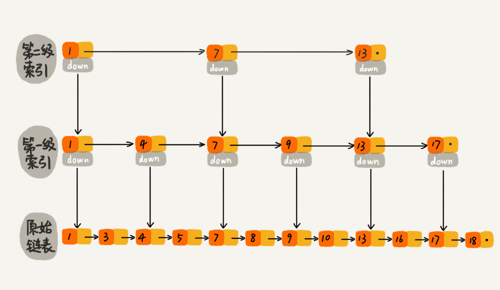

这样看来，跳表是可以解决这个问题。实际上，数据库索引所用到的数据结构跟跳表非常相似，叫作 **B+ 树**。不过，它是通过二叉查找树演化过来的，而非跳表。为了给你还原发明 B+ 树的整个思考过程，所以，接下来，我还要从二叉查找树讲起，看它是如何一步一步被改造成 B+ 树的。

#### 3. 改造二叉查找树来解决这个问题

为了让二叉查找树支持按照区间来查找数据，我们可以对它进行这样的改造：树中的节点并不存储数据本身，而是只是作为索引。除此之外，我们把每个叶子节点串在一条链表上，链表中的数据是从小到大有序的。经过改造之后的二叉树，就像图中这样，看起来是不是很像跳表呢？


改造之后，如果我们要求某个区间的数据。我们只需要拿区间的起始值，在树中进行查找，当查找到某个叶子节点之后，我们再顺着链表往后遍历，直到链表中的结点数据值大于区间的终止值为止。所有遍历到的数据，就是符合区间值的所有数据。


但是，我们要为几千万、上亿的数据构建索引，如果将索引存储在内存中，尽管内存访问的速度非常快，查询的效率非常高，但是，占用的内存会非常多。

比如，我们给一亿个数据构建二叉查找树索引，那索引中会包含大约 1 亿个节点，每个节点假设占用 16 个字节，那就需要大约 1GB 的内存空间。给一张表建立索引，我们需要 1GB 的内存空间。如果我们要给 10 张表建立索引，那对内存的需求是无法满足的。如何解决这个索引占用太多内存的问题呢？

我们可以借助时间换空间的思路，把索引存储在硬盘中，而非内存中。我们都知道，硬盘是一个非常慢速的存储设备。通常内存的访问速度是纳秒级别的，而磁盘访问的速度是毫秒级别的。读取同样大小的数据，从磁盘中读取花费的时间，是从内存中读取所花费时间的上万倍，甚至几十万倍。

这种将索引存储在硬盘中的方案，尽管减少了内存消耗，但是在数据查找的过程中，需要读取磁盘中的索引，因此数据查询效率就相应降低很多。

二叉查找树，经过改造之后，支持区间查找的功能就实现了。不过，为了节省内存，如果把树存储在硬盘中，那么每个节点的读取（或者访问），都对应一次磁盘 IO 操作。树的高度就等于每次查询数据时磁盘 IO 操作的次数。

我们前面讲到，比起内存读写操作，磁盘 IO 操作非常耗时，所以我们优化的重点就是尽量减少磁盘 IO 操作，也就是，尽量降低树的高度。那如何降低树的高度呢？

我们来看下，如果我们把索引构建成 m 叉树，高度是不是比二叉树要小呢？如图所示，给 16 个数据构建二叉树索引，树的高度是 4，查找一个数据，就需要 4 个磁盘 IO 操作（如果根节点存储在内存中，其他节点存储在磁盘中），如果对 16 个数据构建五叉树索引，那高度只有 2，查找一个数据，对应只需要 2 次磁盘操作。如果 m 叉树中的 m 是 100，那对一亿个数据构建索引，树的高度也只是 3，最多只要 3 次磁盘 IO 就能获取到数据。磁盘 IO 变少了，查找数据的效率也就提高了。

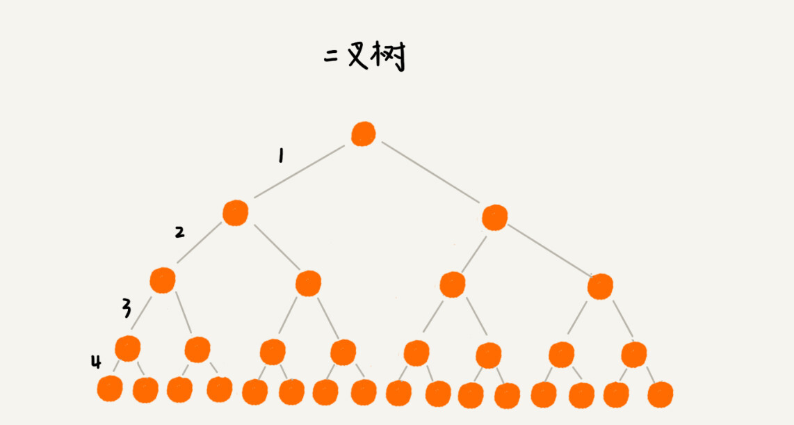


如果我们将 m 叉树实现 B+ 树索引，用代码实现出来，就是下面这个样子（假设我们给 int 类型的数据库字段添加索引，所以代码中的 keywords 是 int 类型的）：

```java
/**
 * 这是B+树非叶子节点的定义。
 *
 * 假设keywords=[3, 5, 8, 10]
 * 4个键值将数据分为5个区间：(-INF,3), [3,5), [5,8), [8,10), [10,INF)
 * 5个区间分别对应：children[0]...children[4]
 *
 * m值是事先计算得到的，计算的依据是让所有信息的大小正好等于页的大小：
 * PAGE_SIZE = (m-1)*4[keywordss大小]+m*8[children大小]
 */
public class BPlusTreeNode {
  public static int m = 5; // 5叉树
  public int[] keywords = new int[m-1]; // 键值，用来划分数据区间
  public BPlusTreeNode[] children = new BPlusTreeNode[m];//保存子节点指针
}

/**
 * 这是B+树中叶子节点的定义。
 *
 * B+树中的叶子节点跟内部节点是不一样的,
 * 叶子节点存储的是值，而非区间。
 * 这个定义里，每个叶子节点存储3个数据行的键值及地址信息。
 *
 * k值是事先计算得到的，计算的依据是让所有信息的大小正好等于页的大小：
 * PAGE_SIZE = k*4[keyw..大小]+k*8[dataAd..大小]+8[prev大小]+8[next大小]
 */
public class BPlusTreeLeafNode {
  public static int k = 3;
  public int[] keywords = new int[k]; // 数据的键值
  public long[] dataAddress = new long[k]; // 数据地址

  public BPlusTreeLeafNode prev; // 这个结点在链表中的前驱结点
  public BPlusTreeLeafNode next; // 这个结点在链表中的后继结点
}
```

我稍微解释一下这段代码。

对于相同个数的数据构建 m 叉树索引，m 叉树中的 m 越大，那树的高度就越小，那 m 叉树中的 m 是不是越大越好呢？到底多大才最合适呢？

不管是内存中的数据，还是磁盘中的数据，操作系统都是按页（一页大小通常是 4KB，这个值可以通过 getconfig PAGE_SIZE 命令查看）来读取的，一次会读一页的数据。如果要读取的数据量超过一页的大小，就会触发多次 IO 操作。所以，我们在选择 m 大小的时候，要尽量让每个节点的大小等于一个页的大小。读取一个节点，只需要一次磁盘 IO 操作。


尽管索引可以提高数据库的查询效率，但是，作为一名开发工程师，你应该也知道，索引有利也有弊，它也会让写入数据的效率下降。这是为什么呢？

数据的写入过程，会涉及索引的更新，这是索引导致写入变慢的主要原因。

对于一个 B+ 树来说，m 值是根据页的大小事先计算好的，也就是说，每个节点最多只能有 m 个子节点。在往数据库中写入数据的过程中，这样就有可能使索引中某些节点的子节点个数超过 m，这个节点的大小超过了一个页的大小，读取这样一个节点，就会导致多次磁盘 IO 操作。我们该如何解决这个问题呢？

实际上，处理思路并不复杂。我们只需要将这个节点分裂成两个节点。但是，节点分裂之后，其上层父节点的子节点个数就有可能超过 m 个。不过这也没关系，我们可以用同样的方法，将父节点也分裂成两个节点。这种级联反应会从下往上，一直影响到根节点。这个分裂过程，你可以结合着下面这个图一块看，会更容易理解（图中的 B+ 树是一个三叉树。我们限定叶子节点中，数据的个数超过 2 个就分裂节点；非叶子节点中，子节点的个数超过 3 个就分裂节点）。


正是因为要时刻保证 B+ 树索引是一个 m 叉树，所以，索引的存在会导致数据库写入的速度降低。实际上，不光写入数据会变慢，删除数据也会变慢。这是为什么呢？

我们在删除某个数据的时候，也要对应地更新索引节点。这个处理思路有点类似跳表中删除数据的处理思路。频繁的数据删除，就会导致某些节点中，子节点的个数变得非常少，长此以往，如果每个节点的子节点都比较少，势必会影响索引的效率。

我们可以设置一个阈值。在 B+ 树中，这个阈值等于 m/2。如果某个节点的子节点个数小于 m/2，我们就将它跟相邻的兄弟节点合并。不过，合并之后节点的子节点个数有可能会超过 m。针对这种情况，我们可以借助插入数据时候的处理方法，再分裂节点。

文字描述不是很直观，我举了一个删除操作的例子，你可以对比着看下（图中的 B+ 树是一个五叉树。我们限定叶子节点中，数据的个数少于 2 个就合并节点；非叶子节点中，子节点的个数少于 3 个就合并节点。）。


数据库索引以及 B+ 树的由来，到此就讲完了。你有没有发现，B+ 树的结构和操作，跟跳表非常类似。理论上讲，对跳表稍加改造，也可以替代 B+ 树，作为数据库的索引实现的。

B+ 树发明于 1972 年，跳表发明于 1989 年，我们可以大胆猜想下，跳表的作者有可能就是受了 B+ 树的启发，才发明出跳表来的。不过，这个也无从考证了。

### 总结引申

今天，我们讲解了数据库索引实现，依赖的底层数据结构，B+ 树。它通过存储在磁盘的多叉树结构，做到了时间、空间的平衡，既保证了执行效率，又节省了内存。

前面的讲解中，为了一步一步详细地给你介绍 B+ 树的由来，内容看起来比较零散。为了方便你掌握和记忆，我这里再总结一下 B+ 树的特点：

+ 每个节点中子节点的个数不能超过 m，也不能小于 m/2；
+ 根节点的子节点个数可以不超过 m/2，这是一个例外；
+ m 叉树只存储索引，并不真正存储数据，这个有点儿类似跳表；
+ 通过链表将叶子节点串联在一起，这样可以方便按区间查找；
+ 一般情况，根节点会被存储在内存中，其他节点存储在磁盘中。

除了 B+ 树，你可能还听说过 B 树、B- 树，我这里简单提一下。实际上，B- 树就是 B 树，英文翻译都是 B-Tree，这里的“-”并不是相对 B+ 树中的“+”，而只是一个连接符。这个很容易误解，所以我强调下。

而 B 树实际上是低级版的 B+ 树，或者说 B+ 树是 B 树的改进版。B 树跟 B+ 树的不同点主要集中在这几个地方：

+ B+ 树中的节点不存储数据，只是索引，而 B 树中的节点存储数据；
+ B 树中的叶子节点并不需要链表来串联。

也就是说，B 树只是一个每个节点的子节点个数不能小于 m/2 的 m 叉树。

#### 课后思考

1. B+ 树中，将叶子节点串起来的链表，是单链表还是双向链表？为什么？
2. 我们对平衡二叉查找树进行改造，将叶子节点串在链表中，就支持了按照区间来查找数据。我们在散列表（下）讲到，散列表也经常跟链表一块使用，如果我们把散列表中的结点，也用链表串起来，能否支持按照区间查找数据呢？

第一题：

 对于B+tree叶子节点，是用双向链表还是用单链表，得从具体的场景思考。我想，大部分同学在开发中遇到的数据库查询，都遇到过升序或降序问题，即类似这样的sql: select name,age, ... from where uid > startValue and uid < endValue order by uid asc(或者desc)，此时，数据底层实现有两种做法： 1）保证查出来的数据就是用户想要的顺序 2）不保证查出来的数据的有序性，查出来之后再排序 以上两种方案，不加思考，肯定选第一种，因为第二种做法浪费了时间（如果选用内存排序，还是考虑数据的量级）。那如何能保证查询出来的数据就是有序的呢？单链表肯定做不到，只能从头往后遍历，再想想，只能选择双向链表了。此时，可能有的同学又问了：双向链表，多出来了一倍的指针，不是会多占用空间嘛？  答案是肯定的。可是，我们再细想下，数据库索引本身都已经在磁盘中了，对于磁盘来说，这点空间已经微不足道了，用这点空间换来时间肯定划算呀。顺便提一下：在实际工程应用中，双向链表应用的场景非常广泛，毕竟能大量减少链表的遍历时间

第二题：

答案是「肯定的」。如同@老杨 大哥说的，JDK中的LinkedHashMap为了能做到保持节点的顺序（插入顺序或者访问顺序），就是用双向链表将节点串起来的。 其实，王争老师在《散列表(下）》那一堂课中就已经深入讲解了LinkedHashMap，如果理解了那篇，这个问题应该不难。

[跳表和B+树的区别](https://wenku.baidu.com/view/47f577a30a75f46527d3240c844769eae009a3e1.html?_wkts_=1697859304110&bdQuery=%E8%B7%B3%E8%A1%A8%E5%92%8Cb%2B%E6%A0%91%E7%9A%84%E5%8C%BA%E5%88%AB)

---


