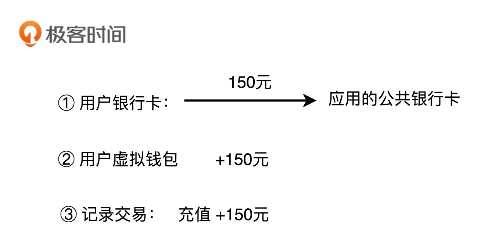

2023/9/26 start

# 设计模式

##  开篇词

### 一对一的设计与编码集训，让你告别没有成长的烂代码！

如果说“数据结构与算法之美”是教你写出高效的代码，那这个设计模式专栏就是教你写出高质量的代码。

#### 程序员的看家本领你得练好

研究生毕业后我就加入了 Google，至今我还清晰地记得，我第一次提交代码的时候，短短的 100 多行代码，被同事 review 出了 n 多问题，来来回回改了不下十几个版本才提交上去。我当时有很大的逆反心理，觉得有必要浪费这么多时间在如此细节的编码上吗？只要代码能用、能解决问题不就够了吗？

工作一段时间之后，我才发现自己当时的想法有多幼稚。

写代码可以说是程序员天天要干的事情，要是代码都写不好，最基本的看家本领都练不好，成天堆砌烂代码，写代码还有啥意思呢？那还干啥程序员啊！写出“能用”代码的人比比皆是，但是，并不是每个人都能写出“好用”的代码。只会写能用的代码，我们永远成长不成大牛，成长不成最优秀的那批人。

后来我熟练掌握了各种编写高质量代码的技巧、方法和理论，我发现，实际上，写烂代码和好代码花费的时间是差不多的。当你把写高质量代码培养成一种开发习惯之后，在你在编写代码的时候，自然就有一种代码质量意识，自然而然就可以写出不错的代码。即便在我离开 Google 加入其他公司之后，项目的代码质量因为各种原因有所妥协，但我起码知道什么样的代码是高质量代码，丝毫不影响我具备写出高质量代码的能力。

我相信，很多工程师都很重视代码质量，毕竟谁也不想写被人吐槽的烂代码。但是，就我的了解来看，毫不夸张地讲，很多工程师，甚至一些 BAT 的员工，代码都写得惨不忍睹。一方面，在目前这种快糙猛的开发环境下，很多工程师并没有太多时间去思考如何写高质量代码；另一方面，在烂代码的熏陶下，在没有人指导的环境里，很多工程师也搞不大清楚高质量代码到底长什么样。

这就导致很多工程师写了多年代码，代码功力一点都没长进，编写的代码仍然只是能用即可，能运行就好。平日的工作就是修修补补、抄抄改改，一直在做重复劳动，能力也一直停留在“会干活”的层面，就像高速路上的收银员，只能算是一个“熟练工”。

#### 一个人闷头看书效果并不好 

当然，也有一些比较上进的工程师，会去找设计模式、编码规范、重构等类型的书籍去看，学习如何编写高质量的代码。实际上，我也买了很多这类的书籍来看，从这些经典的书籍中，我也学到了很多编程技巧和提高代码质量的方法。

不过，这些书籍都有一个特点，那就是比较偏重理论讲解，喜欢拿猫、狗之类生活中的例子来举例。当然，这样的例子也有优点，那就是能在简短的时间和篇幅内，很好地帮你理解原理。但同时也存在一个严重的问题，那就是过于脱离真实的软件开发。而且例子本身没有难度，你一看就觉得懂了，但是看完之后，可能还是不清楚如何将理论落地到实际的项目编码中。

比如，我们都知道著名的 KISS 原则（Keep It Simple and Stupid）。这个原则理解起来很简单，一看貌似就懂了，那我问你，怎样的代码才算是足够简单呢？怎样才算不够简单需要优化呢？估计很多人都回答不上来，因为大部分书籍都没有讲清楚。

除此之外，一个人自己闷头看书，在很多时候效果并不好。一方面，每个人的理解能力是不一样的。对于同一本书，不同理解能力的人看完之后收获也是不一样的。跟着有经验的老师学比闷头自己看书要更高效、收获更多、成长更快。另一方面，编码本身就是一门实践课，光闷头看书本理论肯定是不够的，更重要的是在实践中学习如何应用这些理论。

#### 一对一手把手指导才最有效

从我的经验来看，我觉得最有效、最快速提高编码能力的方法就是，找一个比你资深的工程师，一对一、手把手地指导你写代码。你提交代码，他来指出你的问题，你再优化，这样一来一往，要不了多久，你就会发现，自己的代码能力突飞猛进。

但是，理想很丰满，现实很骨感。且不说能不能找到这样有资格指导你的人，即便能找到，他愿不愿意、有没有时间来手把手指导你，还是另外一回事。而我比较幸运，在毕业之后就加入了 Google，得到了顶尖工程师的指导，一对一地给我 review 代码，手把手地指导我如何优化代码。正因如此，在 Google 的那段时间也成为了我编码能力提高最快的一段时间。

所以，在设计专栏的初期，我就在想，如果我能模拟这样一个一对一、手把手、就真实项目代码讲解的场景，是不是就能让专栏有别于千篇一律的书籍，从而能真正提高你的代码能力呢？基于这样一个想法，我们接下来就来看，我是如何设计整个专栏内容的。

### 我是如何设计这个专栏的？

#### 100 多篇文章、50 万字、2 万多行代码

整个专栏的文章总共有 100 多篇，每篇平均下来在 5000 字左右，所以你总共需要学习 50 万字。为什么篇幅会这么多？这是因为，**我想一次性把跟编写高质量代码相关的所有知识，都系统、全面地讲清楚，一次性给你讲透彻。你看完我这一个专栏，就能搞清楚所有跟写高质量代码相关的知识点。**

除此之外，为了避免脱离代码，空洞地讲理论，专栏每篇文章平均大约有 200 多行代码，整个专栏累计有 2 万多行代码。而且，这些代码都来自我这十几年积累的真实项目，而非编造出来的阿猫阿狗、停车场、餐厅之类的没有太多实际意义的代码。

我个人写 Java 代码比较多，所以，专栏中的代码我是用 Java 语言实现的。不过，在设计专栏的时候，我已经考虑到其他不熟悉 Java 语言的小伙伴了。我力争做到，实际上我觉得也已经做到，一方面，专栏内容的讲解并不与具体的编程语言挂勾；另一方面，我只用最基本、最简单的 Java 语法，只要你有一些编程基础，不管你熟悉的是哪种编程语言，都可以看懂我写的代码，理解代码背后的设计思想。

所以，如果你熟悉的不是 Java，而是 C++、C#、PHP、Python、Go、Ruby、JavaScript 等其他编程语言，不要担心，这完全不会影响你学习这个专栏。

#### 200 多个真实的项目实战代码案例剖析

实际上，大部分设计原则、设计思想、设计模式理解起来都不难，难的是如何将这些理论灵活恰当地应用到实际的开发中，而不是教条主义和盲目滥用。而要想正确、得当地应用理论知识，光看书是不够的，我们要在实战中去亲身感受、体会这些理论该如何应用。但是，我们平时的开发更多的是基于已有的框架，照着别人的流程，扩展新的功能模块。所以，在工作中就可能没有那么多足够复杂、足够有难度的开发场景，让我们有机会去实践这些理论。

基于这种考虑，我结合自己过去工作中积累的项目经验，为整个专栏精心设计了 200 多个真实的项目实战代码案例。几乎每节课、每个知识点都会结合一个完整的开发案例来讲解。我们知道，刷算法最出名的就属 LeetCode 了。类比一下的话，我这 200 多个开发案例足以称得上是一个锻炼编写高质量代码的“LeetCode”了。跟着我一起把这 200 多个开发案例练下来，不愁代码能力提高不了！

#### 8 个月、240 天一对一手把手编程指导

前面我有提到，提高自己编码能力，最有效的手段就是让有经验的前辈一对一、手把手地指导。我经历过 Google 最严格的 Code Review，也被最顶尖的工程师指导过，也见识过最优秀的代码长什么样子，而且自己平时也比较重视代码质量，所以，我觉得我还是有挺多写代码方面的心得体会可以分享给你的。

而且，看过“数据结构与算法之美”专栏的小伙伴都知道，我这个人最大的特点就是逻辑清晰，能抓住要点把问题讲透彻。所以，对于专栏中的理论解读，我并不会照搬那些经典的大部头书籍，而是更多地融入我自己的思考和理解。或许我的解读会跟大师的不完全一样，但我都可以自成一体，并且告诉你如何落地指导具体的开发、编码，而不是很鸡汤地浮在表面来讲，让你听的时候感觉好像都懂了，感觉思想好像得到了升华，而合上书就又忘得一干二净，更别提应用到项目中了。

当然，除了理论解读之外，对于每一种设计原则、思想或者模式，我还会讲一些更深入、更本质、更有用的东西，比如，“为什么要有这种设计原则、思想或者模式？它能解决什么编程问题？有哪些应用场景？又该如何权衡、恰当地在项目中应用？”等等。

在讲解每个实战案例的时候，我会从最原始的问题代码讲起，然后告诉你缺陷在哪里，如何通过设计原则、思想、模式来优化，让你知其然知其所以然，了解背后设计的来龙去脉。我觉得，这比单纯只告诉最终的设计结果要重要得多。我也希望，你不光是被动地听我讲，而是能跟着我的节奏主动地去思考，这对你的逻辑思维训练也会很有帮助。毕竟，对于成天跟程序逻辑打交道的程序员来说，逻辑思维能力是一项非常重要的能力。我们平时要多多加强这方面的锻炼。

除此之外，专栏内容的讲解，我也刻意模拟这种一对一指导的感觉。虽然我没法真正坐在你的面前，跟你一块讨论原理、分析如何优化代码，但我力争让你在看或者听专栏的时候，就好像我在你的面前，跟你一块讨论问题一样。 整个专栏有 100 多篇文章，一周更新 3 篇，需要持续更新 8 个多月、240 多天。这就相当于我手把手指导你 8 个月写代码。我希望通过这 8 个月的指导，能把我十几年的积累统统传授给你。

#### 100 多个有深度的课堂讨论、头脑风暴

我们知道，设计问题本来就没有标准答案。 所以，不要轻信一家之言，更不要迷信我的专栏，也不要盲目追从任何一位专家、大师的说法。主动思考，积极讨论，比单纯地被动接受，学习效果要好十倍、百倍。

所以，在每节课的最后，我都设计了 1～2 道课堂讨论题，这些题目有些是代码设计相关的开放性问题，有些是具体的代码优化问题。看过我“数据结构与算法之美”专栏的小伙伴们都知道，专栏的思考题和同学们的留言，有的时候比专栏文章本身还要精彩。所以，对于这个专栏，我也希望你能积极参与，发表自己的观点。

如果你在学习完每节课程之后，都能花 5 分钟、10 分钟的时间去思考一下课堂讨论问题。这不仅对课程知识的学习很有帮助，还能锻炼你的思考能力。你要知道，独立思考能力对一个人来说是多么重要啊！

### 让我们一起见证成长

我个人觉得，“数据结构与算法之美”和“设计模式之美”是两门跟我们每天的编程开发，直接关系非常大的课程，是两门奠定一个工程师最基本的代码能力的课程。它们一个教你如何写高效代码，一个教你如何写高质量代码。弄懂了这两门课的内容，在今后的开发中，你就不需要担心写出被人吐槽的烂代码了，甚至还能让你的代码成为职场发展的一个加分项和闪光点。

前面讲到，专栏要持续更新 8 个月的时间，你可能会觉得时间好长。实际上，只要跟着专栏更新的节奏，每周认真学好 3 节课，稳扎稳打，8 个月一眨眼就过去了。而经过这 8 个月的刻意编码训练，我相信，你会发现自己因为这样的坚持学习成长了很多，不仅代码能力会提高几个档次，或许还能养成一种好的学习习惯。

## 设计模式学习导读 (3讲)

### 1.为什么说每个程序员都要尽早地学习并掌握设计模式相关知识？

我相信，很多程序员都已经意识到基础知识的重要性，觉得要夯实基础，才能走得更远，但同时对于如何将基础知识转化成开发“生产力”仍然有些疑惑。所以，你可能看了很多基础的书籍，比如操作系统、组成原理、编译原理等，但还是觉得很迷茫，觉得在开发中用不上，起码在平时的 CRUD 业务开发中用不上。实际上，这些基础的知识确实很难直接转化成开发“生产力”。但是，它能潜移默化地、间接地提高你对技术的理解。

不过，我觉得，设计模式和操作系统、组成原理、编译原理等这些基础学科是不一样的。它虽然也算是一门基础知识，但是它和数据结构、算法更像是一道儿的，相比那些更加基础的学科，设计模式能更直接地提高你的开发能力。我在开篇词里也说了，如果说数据结构和算法是教你如何写出高效代码，那设计模式讲的是如何写出可扩展、可读、可维护的高质量代码，所以，它们跟平时的编码会有直接的关系，也会直接影响到你的开发能力。

不过，你可能还是会觉得设计模式是把屠龙刀，看起来很厉害，但平时的开发根本用不上。基于这种观点，接下来，我们就具体地聊一聊，我们为什么要学习设计模式？

#### 1. 应对面试中的设计模式相关问题

学习设计模式和算法一样，最功利、最直接的目的，可能就是应对面试了。

不管你是前端工程师、后端工程师，还是全栈工程师，在求职面试中，设计模式问题是被问得频率比较高的一类问题。特别是一些像 BAT、TMD 这样的大公司，比较重视候选人的基本功，经常会拿算法、设计模式之类的问题来考察候选人。	

所以，我在求职面试的时候，都会提前准备、温习一遍设计模式。尽管并不是每次面试都会被问到，但一旦被问到，如果回答得不好，就是一个败笔，这场面试基本上也就凉凉了。所以，为了保证万无一失，摆脱一旦被问到答不出来的窘境，对于设计模式这种大概率被问到的问题，我都会未雨绸缪，提前准备一下。

当然，我并不是临时抱佛脚。我平时就比较重视设计模式相关知识的积累，所以底子比较好，只需要在每次面试前花很短的时间，重新温习一下，便可以自信满满地去面试，而不是心里老是担心被问到，影响正常的面试发挥。

所以，如果你也不想让设计模式相关问题成为你面试中的短板，那跟着我把专栏中的知识点都搞清楚，以后面试再遇到设计模式相关的问题，就不会惧怕了，甚至还会成为你面试中的亮点。

#### 2. 告别写被人吐槽的烂代码

我们经常说，“Talk is cheap，show me the code。”实际上，代码能力是一个程序员最基础的能力，是基本功，是展示一个程序员基础素养的最直接的衡量标准。你写的代码，实际上就是你名片。

尽管我已经工作近十年，但我一直没有脱离编码一线，现在每天也都在坚持写代码、review 指导同事写代码、重构遗留系统的烂代码。这些年的工作经历中，我见过太多的烂代码，比如命名不规范、类设计不合理、分层不清晰、没有模块化概念、代码结构混乱、高度耦合等等。这样的代码维护起来非常费劲，添加或者修改一个功能，常常会牵一发而动全身，让你无从下手，恨不得将全部的代码删掉重写！

当然，在这些年的工作经历中，我也看到过很多让我眼前一亮的代码。每当我看到这样的好代码，都会立刻对作者产生无比的好感和认可。且不管这个人处在公司的何种级别，从代码就能看出，他是一个基础扎实的高潜员工，值得培养，前途无量！因此，代码写得好，能让你在团队中脱颖而出。

所以，我的专栏，不仅仅只是讲解设计模式，更加重要的是，我会通过实战例子，手把手教你如何避免刚刚提到的代码问题，告别被人诟病的烂代码，写出令人称道的好代码，成为团队中的代码标杆！而且，写出一份漂亮的代码，你自己也会很有成就感。

#### 3. 提高复杂代码的设计和开发能力

大部分工程师比较熟悉的都是编程语言、工具、框架这些东西，因为每天的工作就是在框架里根据业务需求，填充代码。实际上，我刚工作的时候，也是做这类事情。相对来说，这样的工作并不需要你具备很强的代码设计能力，只要单纯地能理解业务，翻译成代码就可以了。

但是，有一天，我的 leader 让我开发一个跟业务无关的比较通用的功能模块，面对这样稍微复杂的代码设计和开发，我就发现我有点力不从心，不知从何下手了。因为我知道只是完成功能、代码能用，可能并不复杂，但是要想写出易扩展、易用、易维护的代码，并不容易。

如何分层、分模块？应该怎么划分类？每个类应该具有哪些属性、方法？怎么设计类之间的交互？该用继承还是组合？该使用接口还是抽象类？怎样做到解耦、高内聚低耦合？该用单例模式还是静态方法？用工厂模式创建对象还是直接 new 出来？如何避免引入设计模式提高扩展性的同时带来的降低可读性问题？……各种问题，一下子挤到了我面前。

而我当时并没有对设计模式相关的知识（包括设计模式、设计原则、面向对象设计思想等）有太多的了解和积累，所以一时间搞得我手足无措。好在因此我意识到了这方面知识的重要性，所以在之后很多年的开发中，我都一直刻意锻炼、积累这方面的能力。面对复杂代码、功能、系统的设计和开发，我也越来越得心应手，游刃有余。写出高质量代码已经成为了我的习惯，不经意间写出来的代码，都能作为同事学习、临摹的范例，这也成为了我职场中最引以为豪的亮点之一。

#### 4. 让读源码、学框架事半功倍

对于一个有追求的程序员来说，对技术的积累，既要有广度，也要有深度。很多技术人早早就意识到了这一点，所以在学习框架、中间件的时候，都会抽空去研究研究原理，读一读源码，希望能在深度上有所积累，而不只是略知皮毛，会用而已。

从我的经验和同事的反馈来看，有些人看源码的时候，经常会遇到看不懂、看不下去的问题。不知道你有没有遇到过这种情况？实际上，这个问题的原因很简单，那就是你积累的基本功还不够，你的能力还不足以看懂这些代码。为什么我会这么说呢？

优秀的开源项目、框架、中间件，代码量、类的个数都会比较多，类结构、类之间的关系极其复杂，常常调用来调用去。所以，为了保证代码的扩展性、灵活性、可维护性等，代码中会使用到很多设计模式、设计原则或者设计思想。如果你不懂这些设计模式、原则、思想，在看代码的时候，你可能就会琢磨不透作者的设计思路，对于一些很明显的设计思路，你可能要花费很多时间才能参悟。相反，如果你对设计模式、原则、思想非常了解，一眼就能参透作者的设计思路、设计初衷，很快就可以把脑容量释放出来，重点思考其他问题，代码读起来就会变得轻松了。

实际上，除了看不懂、看不下去的问题，还有一个隐藏的问题，你可能自己都发现不了，那就是你自己觉得看懂了，实际上，里面的精髓你并没有 get 到多少！因为优秀的开源项目、框架、中间件，就像一个集各种高精尖技术在一起的战斗机。如果你想剖析它的原理、学习它的技术，而你没有积累深厚的基本功，就算把这台战斗机摆在你面前，你也不能完全参透它的精髓，只是了解个皮毛，看个热闹而已。

因此，学好设计模式相关的知识，不仅能让你更轻松地读懂开源项目，还能更深入地参透里面的技术精髓，做到事半功倍。

#### 5. 为你的职场发展做铺垫

普通的、低级别的开发工程师，只需要把框架、开发工具、编程语言用熟练，再做几个项目练练手，基本上就能应付平时的开发工作了。但是，如果你不想一辈子做一个低级的码农，想成长为技术专家、大牛、技术 leader，希望在职场有更高的成就、更好的发展，那就要重视基本功的训练、基础知识的积累。

你去看大牛写的代码，或者优秀的开源项目，代码写得都非常的优美，质量都很高。如果你只是框架用得很溜，架构聊得头头是道，但写出来的代码很烂，让人一眼就能看出很多不合理的、可以改进的地方，那你永远都成不了别人心目中的“技术大牛”。

再者，在技术这条职场道路上，当成长到一定阶段之后，你势必要承担一些指导培养初级员工、新人，以及 code review 的工作。这个时候，如果你自己都对“什么是好的代码？如何写出好的代码？”不了解，那又该如何指导别人，如何让人家信服呢？

还有，如果你是一个技术 leader，负责一个项目整体的开发工作，你就需要为开发进度、开发效率和项目质量负责。你也不希望团队堆砌垃圾代码，让整个项目无法维护，添加、修改一个功能都要费老大劲，最终拉低整个团队的开发效率吧？

除此之外，代码质量低还会导致线上 bug 频发，排查困难。整个团队都陷在成天修改无意义的低级 bug、在烂代码中添补丁的事情中。而一个设计良好、易维护的系统，可以解放我们的时间，让我们做些更加有意义、更能提高自己和团队能力的事情。

最后，当你成为 leader、或者团队中的资深工程师、技术专家之后，你势必要负责一部分团队的招聘工作。这个时候，如果你要考察候选人的设计能力、代码能力，那设计模式相关的问题便是一个很好的考察点。

不过，我也了解到，很多面试官实际上对设计模式也并不是很了解，只能拿一些简单的单例模式、工厂模式来考察候选人，而且所出的题目往往都脱离实践，比如，如何设计一个餐厅系统、停车场系统、售票系统等。这些题目都是网上万年不变的老题目，几乎考察不出候选人的能力。在我的专栏中，有 200 多个真实项目开发中的设计模式相关问题，你跟着看下来，足以让你成为设计模式方面的大牛，再来面试候选人的时候，就不用因为题目老套、脱离实践而尴尬了！

#### 重点回顾

今天，我们讲了为什么要学习设计模式相关的知识，总结一下的话，主要有这样五点：应对面试中的设计模式相关问题；告别写被人吐槽的烂代码；提高复杂代码的设计和开发能力；让读源码、学框架事半功倍；为你的职场发展做铺垫。

投资要趁早，这样我们才能尽早享受复利。同样，有些能力，要早点锻炼；有些东西，要早点知道；有些书，要早点读。这样在你后面的生活、工作、学习中，才能一直都发挥作用。不要等到好多年后，看到了，才恍然大悟，后悔没有早点去学、去看。

设计模式作为一门与编码、开发有着直接关系的基础知识，是你现在就要开始学习的。早点去学习，以后的项目就都可以拿来锻炼，每写一行代码都是对内功的利用和加深，是可以受益一整个职业生涯的事情。

#### 课堂讨论

1. 聊一聊你对设计模式相关知识的重要性的看法；
2. 在你过往的项目开发中，有没有用过某种设计模式？是在什么场景下应用的？解决了什么问题？

---

### 2.从哪些维度评判代码质量的好坏？如何具备写出高质量代码的能力？

在我的工作经历中，每当同事评论起项目代码质量的时候，听到的最多的评语就是：“代码写得很烂”或者“代码写得很好”。用“好”“烂”这样的字眼来描述，非常地笼统。当我具体问到底如何烂、如何好的时候，尽管大部分同事都能简单地罗列上几个点，但往往都不够全面、非常零碎，也切不中要害。

当然，也有一些工程师对如何评价代码质量有所认识，比如，好代码是易扩展、易读、简单、易维护的等等，但他们对于这些评价的理解往往只停留在表面概念上，对于诸多更深入的问题，比如，“怎么才算可读性好？什么样的代码才算易扩展、易维护？可读、可扩展与可维护之间有什么关系？可维护中‘维护’两字该如何理解？”等等，并没有太清晰的认识。

对于程序员来说，辨别代码写得“好”还是“烂”，是一个非常重要的能力。这也是我们写出好代码的前提。毕竟，如果我们连什么是好代码、什么是烂代码，都分辨不清，又谈何写出好代码呢？

所以，今天我们就聊一聊关于代码质量评判的相关问题，希望你在学完今天的内容之后，对代码质量的评判有个更加清晰、更加透彻的认识和理解。

#### 如何评价代码质量的高低？

实际上，咱们平时嘴中常说的“好”和“烂”，是对代码质量的一种描述。“好”笼统地表示代码质量高，“烂”笼统地表示代码质量低。对于代码质量的描述，除了“好”“烂”这样比较简单粗暴的描述方式之外，我们也经常会听到很多其他的描述方式。这些描述方法语义更丰富、更专业、更细化。我搜集整理了一下，罗列在了下面。这些几乎涵盖我们所能听到的描述代码质量的所有常用词汇，你可以看一看。

> 灵活性（flexibility）、可扩展性（extensibility）、可维护性（maintainability）、可读性（readability）、可理解性（understandability）、易修改性（changeability）、可复用（reusability）、可测试性（testability）、模块化（modularity）、高内聚低耦合（high cohesion loose coupling）、高效（high effciency）、高性能（high performance）、安全性（security）、兼容性（compatibility）、易用性（usability）、整洁（clean）、清晰（clarity）、简单（simple）、直接（straightforward）、少即是多（less code is more）、文档详尽（well-documented）、分层清晰（well-layered）、正确性（correctness、bug free）、健壮性（robustness）、鲁棒性（robustness）、可用性（reliability）、可伸缩性（scalability）、稳定性（stability）、优雅（elegant）、好（good）、坏（bad）……

看到如此多的描述词，你可能要问了，我们到底该用哪些词来描述一段代码的质量呢？

实际上，我们很难通过其中的某个或者某几个词汇来全面地评价代码质量。因为这些词汇都是从不同维度来说的。这就好比，对于一个人的评价，我们需要综合各个方面来给出，比如性格、相貌、能力、财富等等。代码质量高低也是一个综合各种因素得到的结论。我们并不能通过单一的维度去评价一段代码写的好坏。比如，即使一段代码的可扩展性很好，但可读性很差，那我们也不能说这段代码质量高。

除此之外，不同的评价维度也并不是完全独立的，有些是具有包含关系、重叠关系或者可以互相影响的。比如，代码的可读性好、可扩展性好，就意味着代码的可维护性好。而且，各种评价维度也不是非黑即白的。比如，我们不能简单地将代码分为可读与不可读。如果用数字来量化代码的可读性的话，它应该是一个连续的区间值，而非 0、1 这样的离散值。

不过，我们真的可以客观地量化一段代码质量的高低吗？答案是否定的。对一段代码的质量评价，常常有很强的主观性。比如，怎么样的代码才算可读性好，每个人的评判标准都不大一样。这就好比我们去评价一本小说写得是否精彩，本身就是一个很难量化的、非常主观的事情。

正是因为代码质量评价的主观性，使得这种主观评价的准确度，跟工程师自身经验有极大的关系。越是有经验的工程师，给出的评价也就越准确。相反，资历比较浅的工程师就常常会觉得，没有一个可执行的客观的评价标准作为参考，很难准确地判断一段代码写得好与坏。有的时候，自己觉得代码写得已经够好了，但实际上并不是。所以，这也导致如果没有人指导的话，自己一个人闷头写代码，即便写再多的代码，代码能力也可能一直没有太大提高。

#### 最常用的评价标准有哪几个？

仔细看前面罗列的所有代码质量评价标准，你会发现，有些词语过于笼统、抽象，比较偏向对于整体的描述，比如优雅、好、坏、整洁、清晰等；有些过于细节、偏重方法论，比如模块化、高内聚低耦合、文档详尽、分层清晰等；有些可能并不仅仅局限于编码，跟架构设计等也有关系，比如可伸缩性、可用性、稳定性等。

为了做到有的放矢、有重点地学习，我挑选了其中几个最常用的、最重要的评价标准，来详细讲解，其中就包括：可维护性、可读性、可扩展性、灵活性、简洁性（简单、复杂）、可复用性、可测试性。接下来，我们逐一讲解一下。

##### 1. 可维护性（maintainability）

我们首先来看，什么是代码的“可维护性”？所谓的“维护代码”到底包含哪些具体工作？

落实到编码开发，所谓的“维护”无外乎就是修改 bug、修改老的代码、添加新的代码之类的工作。所谓“代码易维护”就是指，在不破坏原有代码设计、不引入新的 bug 的情况下，能够快速地修改或者添加代码。所谓“代码不易维护”就是指，修改或者添加代码需要冒着极大的引入新 bug 的风险，并且需要花费很长的时间才能完成。

我们知道，对于一个项目来说，维护代码的时间远远大于编写代码的时间。工程师大部分的时间可能都是花在修修 bug、改改老的功能逻辑、添加一些新的功能逻辑之类的工作上。所以，代码的可维护性就显得格外重要。

维护、易维护、不易维护这三个概念不难理解。不过，对于实际的软件开发来说，更重要的是搞清楚，如何来判断代码可维护性的好坏。

实际上，可维护性也是一个很难量化、偏向对代码整体的评价标准，它有点类似之前提到的“好”“坏”“优雅”之类的笼统评价。代码的可维护性是由很多因素协同作用的结果。代码的可读性好、简洁、可扩展性好，就会使得代码易维护；相反，就会使得代码不易维护。更细化地讲，如果代码分层清晰、模块化好、高内聚低耦合、遵从基于接口而非实现编程的设计原则等等，那就可能意味着代码易维护。除此之外，代码的易维护性还跟项目代码量的多少、业务的复杂程度、利用到的技术的复杂程度、文档是否全面、团队成员的开发水平等诸多因素有关。

所以，从正面去分析一个代码是否易维护稍微有点难度。不过，我们可以从侧面上给出一个比较主观但又比较准确的感受。如果 bug 容易修复，修改、添加功能能够轻松完成，那我们就可以主观地认为代码对我们来说易维护。相反，如果修改一个 bug，修改、添加一个功能，需要花费很长的时间，那我们就可以主观地认为代码对我们来说不易维护。

你可能会说，这样的评价方式也太主观了吧？没错，是否易维护本来就是针对维护的人来说的。不同水平的人对于同一份代码的维护能力并不是相同的。对于同样一个系统，熟悉它的资深工程师会觉得代码的可维护性还不错，而一些新人因为不熟悉代码，修改 bug、修改添加代码要花费很长的时间，就有可能会觉得代码的可维护性不那么好。这实际上也印证了我们之前的观点：代码质量的评价有很强的主观性。

##### 2. 可读性（readability）

软件设计大师 Martin Fowler 曾经说过：“Any fool can write code that a computer can understand. Good programmers write code that humans can understand.”翻译成中文就是：“任何傻瓜都会编写计算机能理解的代码。好的程序员能够编写人能够理解的代码。”Google 内部甚至专门有个认证就叫作 Readability。只有拿到这个认证的工程师，才有资格在 code review 的时候，批准别人提交代码。可见代码的可读性有多重要，毕竟，代码被阅读的次数远远超过被编写和执行的次数。

我个人认为，代码的可读性应该是评价代码质量最重要的指标之一。我们在编写代码的时候，时刻要考虑到代码是否易读、易理解。除此之外，代码的可读性在非常大程度上会影响代码的可维护性。毕竟，不管是修改 bug，还是修改添加功能代码，我们首先要做的事情就是读懂代码。代码读不大懂，就很有可能因为考虑不周全，而引入新的 bug。

既然可读性如此重要，那我们又该如何评价一段代码的可读性呢？

我们需要看代码是否符合编码规范、命名是否达意、注释是否详尽、函数是否长短合适、模块划分是否清晰、是否符合高内聚低耦合等等。你应该也能感觉到，从正面上，我们很难给出一个覆盖所有评价指标的列表。这也是我们无法量化可读性的原因。

实际上，code review 是一个很好的测验代码可读性的手段。如果你的同事可以轻松地读懂你写的代码，那说明你的代码可读性很好；如果同事在读你的代码时，有很多疑问，那就说明你的代码可读性有待提高了。

##### 3. 可扩展性（extensibility）

可扩展性也是一个评价代码质量非常重要的标准。它表示我们的代码应对未来需求变化的能力。跟可读性一样，代码是否易扩展也很大程度上决定代码是否易维护。那到底什么是代码的可扩展性呢？

代码的可扩展性表示，我们在不修改或少量修改原有代码的情况下，通过扩展的方式添加新的功能代码。说直白点就是，代码预留了一些功能扩展点，你可以把新功能代码，直接插到扩展点上，而不需要因为要添加一个功能而大动干戈，改动大量的原始代码。

关于代码的扩展性，在后面讲到“对修改关闭，对扩展开放”这条设计原则的时候，我会来详细讲解，今天我们只需要知道，代码的可扩展性是评价代码质量非常重要的标准就可以了。

##### 4. 灵活性（flexibility）

灵活性也是描述代码质量的一个常用词汇。比如我们经常会听到这样的描述：“代码写得很灵活”。那这里的“灵活”该如何理解呢？

尽管有很多人用这个词汇来描述代码的质量。但实际上，灵活性是一个挺抽象的评价标准，要给灵活性下个定义也是挺难的。不过，我们可以想一下，什么情况下我们才会说代码写得好灵活呢？我这里罗列了几个场景，希望能引发你自己对什么是灵活性的思考。	

+ 当我们添加一个新的功能代码的时候，原有的代码已经预留好了扩展点，我们不需要修改原有的代码，只要在扩展点上添加新的代码即可。这个时候，我们除了可以说代码易扩展，还可以说代码写得好灵活。
+ 当我们要实现一个功能的时候，发现原有代码中，已经抽象出了很多底层可以复用的模块、类等代码，我们可以拿来直接使用。这个时候，我们除了可以说代码易复用之外，还可以说代码写得好灵活。
+ 当我们使用某组接口的时候，如果这组接口可以应对各种使用场景，满足各种不同的需求，我们除了可以说接口易用之外，还可以说这个接口设计得好灵活或者代码写得好灵活。

从刚刚举的场景来看，如果一段代码易扩展、易复用或者易用，我们都可以称这段代码写得比较灵活。所以，灵活这个词的含义非常宽泛，很多场景下都可以使用。

##### 5. 简洁性（simplicity）

有一条非常著名的设计原则，你一定听过，那就是 KISS 原则：“Keep It Simple，Stupid”。这个原则说的意思就是，尽量保持代码简单。代码简单、逻辑清晰，也就意味着易读、易维护。我们在编写代码的时候，往往也会把简单、清晰放到首位。

不过，很多编程经验不足的程序员会觉得，简单的代码没有技术含量，喜欢在项目中引入一些复杂的设计模式，觉得这样才能体现自己的技术水平。实际上，**思从深而行从简，真正的高手能云淡风轻地用最简单的方法解决最复杂的问题。这也是一个编程老手跟编程新手的本质区别之一。**

除此之外，虽然我们都能认识到，代码要尽量写得简洁，符合 KISS 原则，但怎么样的代码才算足够简洁？不是每个人都能很准确地判断出来这一点。所以，在后面的章节中，当我们讲到 KISS 原则的时候，我会通过具体的代码实例，详细给你解释，“为什么 KISS 原则看似非常简单、好理解，但实际上用好并不容易”。今天，我们就暂且不展开详细讲解了。

##### 6. 可复用性（reusability）

代码的可复用性可以简单地理解为，尽量减少重复代码的编写，复用已有的代码。在后面的很多章节中，我们都会经常提到“可复用性”这一代码评价标准。

比如，当讲到面向对象特性的时候，我们会讲到继承、多态存在的目的之一，就是为了提高代码的可复用性；当讲到设计原则的时候，我们会讲到单一职责原则也跟代码的可复用性相关；当讲到重构技巧的时候，我们会讲到解耦、高内聚、模块化等都能提高代码的可复用性。可见，可复用性也是一个非常重要的代码评价标准，是很多设计原则、思想、模式等所要达到的最终效果。

实际上，代码可复用性跟 DRY（Don’t Repeat Yourself）这条设计原则的关系挺紧密的，所以，在后面的章节中，当我们讲到 DRY 设计原则的时候，我还会讲更多代码复用相关的知识，比如，“有哪些编程方法可以提高代码的复用性”等。

##### 7. 可测试性（testability）

相对于前面六个评价标准，代码的可测试性是一个相对较少被提及，但又非常重要的代码质量评价标准。代码可测试性的好坏，能从侧面上非常准确地反应代码质量的好坏。代码的可测试性差，比较难写单元测试，那基本上就能说明代码设计得有问题。关于代码的可测试性，我们在重构那一部分，会花两节课的时间来详细讲解。现在，你暂时只需要知道，代码的可测试性非常重要就可以了。

#### 如何才能写出高质量的代码？

我相信每个工程师都想写出高质量的代码，不想一直写没有成长、被人吐槽的烂代码。那如何才能写出高质量的代码呢？针对什么是高质量的代码，我们刚刚讲到了七个最常用、最重要的评价指标。所以，问如何写出高质量的代码，也就等同于在问，如何写出易维护、易读、易扩展、灵活、简洁、可复用、可测试的代码。

要写出满足这些评价标准的高质量代码，我们需要掌握一些更加细化、更加能落地的编程方法论，包括面向对象设计思想、设计原则、设计模式、编码规范、重构技巧等。而所有这些编程方法论的最终目的都是为了编写出高质量的代码。

比如，面向对象中的继承、多态能让我们写出可复用的代码；编码规范能让我们写出可读性好的代码；设计原则中的单一职责、DRY、基于接口而非实现、里式替换原则等，可以让我们写出可复用、灵活、可读性好、易扩展、易维护的代码；设计模式可以让我们写出易扩展的代码；持续重构可以时刻保持代码的可维护性等等。具体这些编程方法论是如何提高代码的可维护性、可读性、可扩展性等等的呢？我们在后面的课程中慢慢来学习。

----

### 03 | 面向对象、设计原则、设计模式、编程规范、重构，这五者有何关系？


## 设计原则与思想：面向对象 (11讲)

### 04 | 理论一：当谈论面向对象的时候，我们到底在谈论什么？

### 05 | 理论二：封装、抽象、继承、多态分别可以解决哪些编程问题？

### 06 | 理论三：面向对象相比面向过程有哪些优势？面向过程真的过时了吗？

##### 1.OOP 更加能够应对大规模复杂程序的开发

##### 2.OOP 风格的代码更易复用、易扩展、易维护

##### 3.OOP 语言更加人性化、更加高级、更加智能

#### 课堂讨论

在文章中我讲到，面向对象编程比面向过程编程，更加容易应对大规模复杂程序的开发。但像 Unix、Linux 这些复杂的系统，也都是基于 C 语言这种面向过程的编程语言开发的，你怎么看待这个现象？这跟我之前的讲解相矛盾吗？

1. 面向过程的编程语言不代表不能实现面向对象思想
2. 操作系统的复杂相对于业务系统的快速开发迭代是另一个维度复杂，基础系统更看重性能和稳定，而业务系统看重的是维护，复用，拓展。
3. 操作系统是要频繁跟硬件打交道的，“低级”的语言更快更简洁

使用任何一个编程语言编写的程序，最终执行上都要落实到CPU一条一条指令的执行（无论通过虚拟机解释执行，还是直接编译为机器码），CPU看不到是使用何种语言编写的程序。对于所有编程语言最终目的是两种：提高硬件的运行效率和提高程序员的开发效率。然而这两种很难兼得。 C语言在效率方面几乎做到了极致，它更适合挖掘硬件的价值，如：C语言用数组char a[8]，经过编译以后变成了（基地址＋偏移量）的方式。对于CPU来说，没有运算比加法更快，它的执行效率的算法复杂度是O(1)的。从执行效率这个方面看，开发操作系统和贴近硬件的底层程序，C语言是极好的选择。 C语言带来的问题是内存越界、野指针、内存泄露等。它只关心程序飞的高不高，不关心程序猿飞的累不累。为了解脱程序员，提高开发效率，设计了OOP等更“智能”的编程语言，但是开发容易毕竟来源于对底层的一层一层又一层的包装。完成一个特定操作有了更多的中间环节, 占用了更大的内存空间, 占用了更多的CPU运算。从这个角度看，OOP这种高级语言的流行是因为硬件越来越便宜了。我们可以想象如果大众消费级的主控芯片仍然是单核600MHz为主流，运行Android系统点击一个界面需要2秒才能响应，那我们现在用的大部分手机程序绝对不是使用JAVA开发的，Android操作系统也不可能建立起这么大的生态。

---

### 07 | 理论四：哪些代码设计看似是面向对象，实际是面向过程的？

上一节课，我们提到，常见的编程范式或者说编程风格有三种，面向过程编程、面向对象编程、函数式编程，而面向对象编程又是这其中最主流的编程范式。现如今，大部分编程语言都是面向对象编程语言，大部分软件都是基于面向对象编程这种编程范式来开发的。

不过，在实际的开发工作中，很多同学对面向对象编程都有误解，总以为把所有代码都塞到类里，自然就是在进行面向对象编程了。实际上，这样的认识是不正确的。有时候，从表面上看似是面向对象编程风格的代码，从本质上看却是面向过程编程风格的。

所以，今天，我结合具体的代码实例来讲一讲，有哪些看似是面向对象，实际上是面向过程编程风格的代码，并且分析一下，为什么我们很容易写出这样的代码。最后，我们再一起辩证思考一下，面向过程编程是否就真的无用武之地了呢？是否有必要杜绝在面向对象编程中写面向过程风格的代码呢？

好了，现在，让我们正式开始今天的学习吧！

#### 哪些代码设计看似是面向对象，实际是面向过程的？

在用面向对象编程语言进行软件开发的时候，我们有时候会写出面向过程风格的代码。有些是有意为之，并无不妥；而有些是无意为之，会影响到代码的质量。下面我就通过三个典型的代码案例，给你展示一下，什么样的代码看似是面向对象风格，实际上是面向过程风格的。我也希望你通过对这三个典型例子的学习，能够做到举一反三，在平时的开发中，多留心一下自己编写的代码是否满足面向对象风格。

#####  1. 滥用 getter、setter 方法

在之前参与的项目开发中，我经常看到，有同事定义完类的属性之后，就顺手把这些属性的 getter、setter 方法都定义上。有些同事更加省事，直接用 IDE 或者 Lombok 插件（如果是 Java 项目的话）自动生成所有属性的 getter、setter 方法。

当我问起，为什么要给每个属性都定义 getter、setter 方法的时候，他们的理由一般是，为了以后可能会用到，现在事先定义好，类用起来就更加方便，而且即便用不到这些 getter、setter 方法，定义上它们也无伤大雅。

实际上，这样的做法我是非常不推荐的。它违反了面向对象编程的封装特性，相当于将面向对象编程风格退化成了面向过程编程风格。我通过下面这个例子来给你解释一下这句话。

```java
public class ShoppingCart {
  private int itemsCount;
  private double totalPrice;
  private List<ShoppingCartItem> items = new ArrayList<>();
  
  public int getItemsCount() {
    return this.itemsCount;
  }
  
  public void setItemsCount(int itemsCount) {
    this.itemsCount = itemsCount;
  }
  
  public double getTotalPrice() {
    return this.totalPrice;
  }
  
  public void setTotalPrice(double totalPrice) {
    this.totalPrice = totalPrice;
  }

  public List<ShoppingCartItem> getItems() {
    return this.items;
  }
  
  public void addItem(ShoppingCartItem item) {
    items.add(item);
    itemsCount++;
    totalPrice += item.getPrice();
  }
  // ...省略其他方法...
}
```

在这段代码中，ShoppingCart 是一个简化后的购物车类，有三个私有（private）属性：itemsCount、totalPrice、items。对于 itemsCount、totalPrice 两个属性，我们定义了它们的 getter、setter 方法。对于 items 属性，我们定义了它的 getter 方法和 addItem() 方法。代码很简单，理解起来不难。那你有没有发现，这段代码有什么问题呢？

我们先来看前两个属性，itemsCount 和 totalPrice。虽然我们将它们定义成 private 私有属性，但是提供了 public 的 getter、setter 方法，这就跟将这两个属性定义为 public 公有属性，没有什么两样了。外部可以通过 setter 方法随意地修改这两个属性的值。除此之外，任何代码都可以随意调用 setter 方法，来重新设置 itemsCount、totalPrice 属性的值，这也会导致其跟 items 属性的值不一致。

而面向对象封装的定义是：通过访问权限控制，隐藏内部数据，外部仅能通过类提供的有限的接口访问、修改内部数据。所以，暴露不应该暴露的 setter 方法，明显违反了面向对象的封装特性。数据没有访问权限控制，任何代码都可以随意修改它，代码就退化成了面向过程编程风格的了。

看完了前两个属性，我们再来看 items 这个属性。对于 items 这个属性，我们定义了它的 getter 方法和 addItem() 方法，并没有定义它的 setter 方法。这样的设计貌似看起来没有什么问题，但实际上并不是。

对于 itemsCount 和 totalPrice 这两个属性来说，定义一个 public 的 getter 方法，确实无伤大雅，毕竟 getter 方法不会修改数据。但是，对于 items 属性就不一样了，这是因为 items 属性的 getter 方法，返回的是一个 List集合容器。外部调用者在拿到这个容器之后，是可以操作容器内部数据的，也就是说，外部代码还是能修改 items 中的数据。比如像下面这样：

```java
ShoppingCart cart = new ShoppCart();
...
cart.getItems().clear(); // 清空购物车
```

你可能会说，清空购物车这样的功能需求看起来合情合理啊，上面的代码没有什么不妥啊。你说得没错，需求是合理的，但是这样的代码写法，会导致 itemsCount、totalPrice、items 三者数据不一致。我们不应该将清空购物车的业务逻辑暴露给上层代码。正确的做法应该是，在 ShoppingCart 类中定义一个 clear() 方法，将清空购物车的业务逻辑封装在里面，透明地给调用者使用。ShoppingCart 类的 clear() 方法的具体代码实现如下：

```java
public class ShoppingCart {
  // ...省略其他代码...
  public void clear() {
    items.clear();
    itemsCount = 0;
    totalPrice = 0.0;
  }
}
```

你可能还会说，我有一个需求，需要查看购物车中都买了啥，那这个时候，ShoppingCart 类不得不提供 items 属性的 getter 方法了，那又该怎么办才好呢？

如果你熟悉 Java 语言，那解决这个问题的方法还是挺简单的。我们可以通过 Java 提供的 Collections.unmodifiableList() 方法，让 getter 方法返回一个不可被修改的 UnmodifiableList 集合容器，而这个容器类重写了 List 容器中跟修改数据相关的方法，比如 add()、clear() 等方法。一旦我们调用这些修改数据的方法，代码就会抛出 UnsupportedOperationException 异常，这样就避免了容器中的数据被修改。具体的代码实现如下所示。

```java
public class ShoppingCart {
  // ...省略其他代码...
  public List<ShoppingCartItem> getItems() {
    return Collections.unmodifiableList(this.items);
  }
}

public class UnmodifiableList<E> extends UnmodifiableCollection<E>
                          implements List<E> {
  public boolean add(E e) {
    throw new UnsupportedOperationException();
  }
  public void clear() {
    throw new UnsupportedOperationException();
  }
  // ...省略其他代码...
}

ShoppingCart cart = new ShoppingCart();
List<ShoppingCartItem> items = cart.getItems();
items.clear();//抛出UnsupportedOperationException异常
```

不过，这样的实现思路还是有点问题。因为当调用者通过 ShoppingCart 的 getItems() 获取到 items 之后，虽然我们没法修改容器中的数据，但我们仍然可以修改容器中每个对象（ShoppingCartItem）的数据。听起来有点绕，看看下面这几行代码你就明白了。

```java
ShoppingCart cart = new ShoppingCart();
cart.add(new ShoppingCartItem(...));
List<ShoppingCartItem> items = cart.getItems();
ShoppingCartItem item = items.get(0);
item.setPrice(19.0); // 这里修改了item的价格属性
```

这个问题该如何解决呢？我今天就不展开来讲了。在后面讲到设计模式的时候，我还会详细地讲到。当然，你也可以在留言区留言或者把问题分享给你的朋友，和他一起讨论解决方案。

getter、setter 问题我们就讲完了，我稍微总结一下，在设计实现类的时候，除非真的需要，否则，尽量不要给属性定义 setter 方法。除此之外，尽管 getter 方法相对 setter 方法要安全些，但是如果返回的是集合容器（比如例子中的 List 容器），也要防范集合内部数据被修改的危险。

##### 2. 滥用全局变量和全局方法

我们再来看，另外一个违反面向对象编程风格的例子，那就是滥用全局变量和全局方法。首先，我们先来看，什么是全局变量和全局方法？

如果你是用类似 C 语言这样的面向过程的编程语言来做开发，那对全局变量、全局方法肯定不陌生，甚至可以说，在代码中到处可见。但如果你是用类似 Java 这样的面向对象的编程语言来做开发，全局变量和全局方法就不是很多见了。

在面向对象编程中，常见的全局变量有单例类对象、静态成员变量、常量等，常见的全局方法有静态方法。单例类对象在全局代码中只有一份，所以，它相当于一个全局变量。静态成员变量归属于类上的数据，被所有的实例化对象所共享，也相当于一定程度上的全局变量。而常量是一种非常常见的全局变量，比如一些代码中的配置参数，一般都设置为常量，放到一个 Constants 类中。静态方法一般用来操作静态变量或者外部数据。你可以联想一下我们常用的各种 Utils 类，里面的方法一般都会定义成静态方法，可以在不用创建对象的情况下，直接拿来使用。静态方法将方法与数据分离，破坏了封装特性，是典型的面向过程风格。

在刚刚介绍的这些全局变量和全局方法中，Constants 类和 Utils 类最常用到。现在，我们就结合这两个几乎在每个软件开发中都会用到的类，来深入探讨一下全局变量和全局方法的利与弊。

**我们先来看一下，在我过去参与的项目中，一种常见的 Constants 类的定义方法。**

```java
public class Constants {
  public static final String MYSQL_ADDR_KEY = "mysql_addr";
  public static final String MYSQL_DB_NAME_KEY = "db_name";
  public static final String MYSQL_USERNAME_KEY = "mysql_username";
  public static final String MYSQL_PASSWORD_KEY = "mysql_password";
  
  public static final String REDIS_DEFAULT_ADDR = "192.168.7.2:7234";
  public static final int REDIS_DEFAULT_MAX_TOTAL = 50;
  public static final int REDIS_DEFAULT_MAX_IDLE = 50;
  public static final int REDIS_DEFAULT_MIN_IDLE = 20;
  public static final String REDIS_DEFAULT_KEY_PREFIX = "rt:";
  
  // ...省略更多的常量定义...
}
```

在这段代码中，我们把程序中所有用到的常量，都集中地放到这个 Constants 类中。不过，定义一个如此大而全的 Constants 类，并不是一种很好的设计思路。为什么这么说呢？原因主要有以下几点。

首先，这样的设计会影响代码的可维护性。

如果参与开发同一个项目的工程师有很多，在开发过程中，可能都要涉及修改这个类，比如往这个类里添加常量，那这个类就会变得越来越大，成百上千行都有可能，查找修改某个常量也会变得比较费时，而且还会增加提交代码冲突的概率。

其次，这样的设计还会增加代码的编译时间。

当 Constants 类中包含很多常量定义的时候，依赖这个类的代码就会很多。那每次修改 Constants 类，都会导致依赖它的类文件重新编译，因此会浪费很多不必要的编译时间。不要小看编译花费的时间，对于一个非常大的工程项目来说，编译一次项目花费的时间可能是几分钟，甚至几十分钟。而我们在开发过程中，每次运行单元测试，都会触发一次编译的过程，这个编译时间就有可能会影响到我们的开发效率。

最后，这样的设计还会影响代码的复用性。

如果我们要在另一个项目中，复用本项目开发的某个类，而这个类又依赖 Constants 类。即便这个类只依赖 Constants 类中的一小部分常量，我们仍然需要把整个 Constants 类也一并引入，也就引入了很多无关的常量到新的项目中。

**那如何改进 Constants 类的设计呢？我这里有两种思路可以借鉴。**

第一种是将 Constants 类拆解为功能更加单一的多个类，比如跟 MySQL 配置相关的常量，我们放到 MysqlConstants 类中；跟 Redis 配置相关的常量，我们放到 RedisConstants 类中。

当然，还有一种我个人觉得更好的设计思路，那就是并不单独地设计 Constants 常量类，而是哪个类用到了某个常量，我们就把这个常量定义到这个类中。比如，RedisConfig 类用到了 Redis 配置相关的常量，那我们就直接将这些常量定义在 RedisConfig 中，这样也提高了类设计的内聚性和代码的复用性。

**讲完了 Constants 类，我们再来讨论一下 Utils 类。**首先，我想问你这样一个问题，我们为什么需要 Utils 类？Utils 类存在的意义是什么？希望你先思考一下，然后再来看我下面的讲解。

实际上，Utils 类的出现是基于这样一个问题背景：如果我们有两个类 A 和 B，它们要用到一块相同的功能逻辑，为了避免代码重复，我们不应该在两个类中，将这个相同的功能逻辑，重复地实现两遍。这个时候我们该怎么办呢？

我们在讲面向对象特性的时候，讲过继承可以实现代码复用。利用继承特性，我们把相同的属性和方法，抽取出来，定义到父类中。子类复用父类中的属性和方法，达到代码复用的目的。但是，有的时候，从业务含义上，A 类和 B 类并不一定具有继承关系，比如 Crawler 类和 PageAnalyzer 类，它们都用到了 URL 拼接和分割的功能，但并不具有继承关系（既不是父子关系，也不是兄弟关系）。仅仅为了代码复用，生硬地抽象出一个父类出来，会影响到代码的可读性。如果不熟悉背后设计思路的同事，发现 Crawler 类和 PageAnalyzer 类继承同一个父类，而父类中定义的却是 URL 相关的操作，会觉得这个代码写得莫名其妙，理解不了。

既然继承不能解决这个问题，我们可以定义一个新的类，实现 URL 拼接和分割的方法。而拼接和分割两个方法，不需要共享任何数据，所以新的类不需要定义任何属性，这个时候，我们就可以把它定义为只包含静态方法的 Utils 类了。

实际上，只包含静态方法不包含任何属性的 Utils 类，是彻彻底底的面向过程的编程风格。但这并不是说，我们就要杜绝使用 Utils 类了。实际上，从刚刚讲的 Utils 类存在的目的来看，它在软件开发中还是挺有用的，能解决代码复用问题。所以，这里并不是说完全不能用 Utils 类，而是说，要尽量避免滥用，不要不加思考地随意去定义 Utils 类。

在定义 Utils 类之前，你要问一下自己，你真的需要单独定义这样一个 Utils 类吗？是否可以把 Utils 类中的某些方法定义到其他类中呢？如果在回答完这些问题之后，你还是觉得确实有必要去定义这样一个 Utils 类，那就大胆地去定义它吧。因为即便在面向对象编程中，我们也并不是完全排斥面向过程风格的代码。只要它能为我们写出好的代码贡献力量，我们就可以适度地去使用。

除此之外，类比 Constants 类的设计，我们设计 Utils 类的时候，最好也能细化一下，针对不同的功能，设计不同的 Utils 类，比如 FileUtils、IOUtils、StringUtils、UrlUtils 等，不要设计一个过于大而全的 Utils 类。

##### 3. 定义数据和方法分离的类

我们再来看最后一种面向对象编程过程中，常见的面向过程风格的代码。那就是，数据定义在一个类中，方法定义在另一个类中。你可能会觉得，这么明显的面向过程风格的代码，谁会这么写呢？实际上，如果你是基于 MVC 三层结构做 Web 方面的后端开发，这样的代码你可能天天都在写。

传统的 MVC 结构分为 Model 层、Controller 层、View 层这三层。不过，在做前后端分离之后，三层结构在后端开发中，会稍微有些调整，被分为 Controller 层、Service 层、Repository 层。Controller 层负责暴露接口给前端调用，Service 层负责核心业务逻辑，Repository 层负责数据读写。而在每一层中，我们又会定义相应的 VO（View Object）、BO（Business Object）、Entity。一般情况下，VO、BO、Entity 中只会定义数据，不会定义方法，所有操作这些数据的业务逻辑都定义在对应的 Controller 类、Service 类、Repository 类中。这就是典型的面向过程的编程风格。

实际上，这种开发模式叫作基于贫血模型的开发模式，也是我们现在非常常用的一种 Web 项目的开发模式。看到这里，你内心里应该有很多疑惑吧？既然这种开发模式明显违背面向对象的编程风格，为什么大部分 Web 项目都是基于这种开发模式来开发呢？

关于这个问题，我今天不打算展开讲解。因为它跟我们平时的项目开发结合得非常紧密，所以，更加细致、全面的讲解，我把它安排在面向对象实战环节里了，希望用两节课的时间，把这个问题给你讲透彻。

#### 在面向对象编程中，为什么容易写出面向过程风格的代码？ 

我们在进行面向对象编程的时候，很容易不由自主地就写出面向过程风格的代码，或者说感觉面向过程风格的代码更容易写。这是为什么呢？

你可以联想一下，在生活中，你去完成一个任务，你一般都会思考，应该先做什么、后做什么，如何一步一步地顺序执行一系列操作，最后完成整个任务。面向过程编程风格恰恰符合人的这种流程化思维方式。而面向对象编程风格正好相反。它是一种自底向上的思考方式。它不是先去按照执行流程来分解任务，而是将任务翻译成一个一个的小的模块（也就是类），设计类之间的交互，最后按照流程将类组装起来，完成整个任务。我们在上一节课讲到了，这样的思考路径比较适合复杂程序的开发，但并不是特别符合人类的思考习惯。

你可以联想一下，在生活中，你去完成一个任务，你一般都会思考，应该先做什么、后做什么，如何一步一步地顺序执行一系列操作，最后完成整个任务。面向过程编程风格恰恰符合人的这种流程化思维方式。而面向对象编程风格正好相反。它是一种自底向上的思考方式。它不是先去按照执行流程来分解任务，而是将任务翻译成一个一个的小的模块（也就是类），设计类之间的交互，最后按照流程将类组装起来，完成整个任务。我们在上一节课讲到了，这样的思考路径比较适合复杂程序的开发，但并不是特别符合人类的思考习惯。

除此之外，面向对象编程要比面向过程编程难一些。在面向对象编程中，类的设计还是挺需要技巧，挺需要一定设计经验的。你要去思考如何封装合适的数据和方法到一个类里，如何设计类之间的关系，如何设计类之间的交互等等诸多设计问题。

所以，基于这两点原因，很多工程师在开发的过程，更倾向于用不太需要动脑子的方式去实现需求，也就不由自主地就将代码写成面向过程风格的了。

#### 面向过程编程及面向过程编程语言就真的无用武之地了吗？

前面我们讲了面向对象编程相比面向过程编程的各种优势，又讲了哪些代码看起来像面向对象风格，而实际上是面向过程编程风格的。那是不是面向过程编程风格就过时了被淘汰了呢？是不是在面向对象编程开发中，我们就要杜绝写面向过程风格的代码呢？

前面我们有讲到，如果我们开发的是微小程序，或者是一个数据处理相关的代码，以算法为主，数据为辅，那脚本式的面向过程的编程风格就更适合一些。当然，面向过程编程的用武之地还不止这些。实际上，面向过程编程是面向对象编程的基础，面向对象编程离不开基础的面向过程编程。为什么这么说？我们仔细想想，类中每个方法的实现逻辑，不就是面向过程风格的代码吗？

除此之外，面向对象和面向过程两种编程风格，也并不是非黑即白、完全对立的。在用面向对象编程语言开发的软件中，面向过程风格的代码并不少见，甚至在一些标准的开发库（比如 JDK、Apache Commons、Google Guava）中，也有很多面向过程风格的代码。

不管使用面向过程还是面向对象哪种风格来写代码，我们最终的目的还是写出易维护、易读、易复用、易扩展的高质量代码。只要我们能避免面向过程编程风格的一些弊端，控制好它的副作用，在掌控范围内为我们所用，我们就大可不用避讳在面向对象编程中写面向过程风格的代码。

#### 重点回顾

今天的内容讲完了。让我们一块回顾一下，你应该掌握的重点内容。今天你要掌握的重点内容是三种违反面向对象编程风格的典型代码设计。

1. 滥用 getter、setter 方法 

   在设计实现类的时候，除非真的需要，否则尽量不要给属性定义 setter 方法。除此之外，尽管 getter 方法相对 setter 方法要安全些，但是如果返回的是集合容器，那也要防范集合内部数据被修改的风险。

2. Constants 类、Utils 类的设计问题

   对于这两种类的设计，我们尽量能做到职责单一，定义一些细化的小类，比如 RedisConstants、FileUtils，而不是定义一个大而全的 Constants 类、Utils 类。除此之外，如果能将这些类中的属性和方法，划分归并到其他业务类中，那是最好不过的了，能极大地提高类的内聚性和代码的可复用性。

3. 基于贫血模型的开发模式

   关于这一部分，我们只讲了为什么这种开发模式是彻彻底底的面向过程编程风格的。这是因为数据和操作是分开定义在 VO/BO/Entity 和 Controler/Service/Repository 中的。今天，你只需要掌握这一点就可以了。为什么这种开发模式如此流行？如何规避面向过程编程的弊端？有没有更好的可替代的开发模式？相关的更多问题，我们在面向对象实战篇中会一一讲解。

---

### 08 | 理论五：接口vs抽象类的区别？如何用普通的类模拟抽象类和接口？

在面向对象编程中，抽象类和接口是两个经常被用到的语法概念，是面向对象四大特性，以及很多设计模式、设计思想、设计原则编程实现的基础。比如，我们可以使用接口来实现面向对象的抽象特性、多态特性和基于接口而非实现的设计原则，使用抽象类来实现面向对象的继承特性和模板设计模式等等。

不过，并不是所有的面向对象编程语言都支持这两个语法概念，比如，C++ 这种编程语言只支持抽象类，不支持接口；而像 Python 这样的动态编程语言，既不支持抽象类，也不支持接口。尽管有些编程语言没有提供现成的语法来支持接口和抽象类，我们仍然可以通过一些手段来模拟实现这两个语法概念。

这两个语法概念不仅在工作中经常会被用到，在面试中也经常被提及。比如，**“接口和抽象类的区别是什么？什么时候用接口？什么时候用抽象类？抽象类和接口存在的意义是什么？能解决哪些编程问题？**”等等。

你可以先试着回答一下，刚刚我提出的几个问题。如果你对某些问题还有些模糊不清，那也没关系，今天，我会带你把这几个问题彻底搞清楚。下面我们就一起来看！

#### 什么是抽象类和接口？区别在哪里？

不同的编程语言对接口和抽象类的定义方式可能有些差别，但差别并不会很大。Java 这种编程语言，既支持抽象类，也支持接口，所以，为了让你对这两个语法概念有比较直观的认识，我们拿 Java 这种编程语言来举例讲解。

**首先，我们来看一下，在 Java 这种编程语言中，我们是如何定义抽象类的。**

下面这段代码是一个比较典型的抽象类的使用场景（模板设计模式）。Logger 是一个记录日志的抽象类，FileLogger 和 MessageQueueLogger 继承 Logger，分别实现两种不同的日志记录方式：记录日志到文件中和记录日志到消息队列中。FileLogger 和 MessageQueueLogger 两个子类复用了父类 Logger 中的 name、enabled、minPermittedLevel 属性和 log() 方法，但因为这两个子类写日志的方式不同，它们又各自重写了父类中的 doLog() 方法。

```java
// 抽象类
public abstract class Logger {
  private String name;
  private boolean enabled;
  private Level minPermittedLevel;

  public Logger(String name, boolean enabled, Level minPermittedLevel) {
    this.name = name;
    this.enabled = enabled;
    this.minPermittedLevel = minPermittedLevel;
  }
  
  public void log(Level level, String message) {
    boolean loggable = enabled && (minPermittedLevel.intValue() <= level.intValue());
    if (!loggable) return;
    doLog(level, message);
  }
  
  protected abstract void doLog(Level level, String message);
}
// 抽象类的子类：输出日志到文件
  public class FileLogger extends Logger {
  private Writer fileWriter;

  public FileLogger(String name, boolean enabled,
    Level minPermittedLevel, String filepath) {
    super(name, enabled, minPermittedLevel);
    this.fileWriter = new FileWriter(filepath); 
  }
  
  @Override
  public void doLog(Level level, String mesage) {
    // 格式化level和message,输出到日志文件
    fileWriter.write(...);
  }
}
// 抽象类的子类: 输出日志到消息中间件(比如kafka)
public class MessageQueueLogger extends Logger {
  private MessageQueueClient msgQueueClient;
  
  public MessageQueueLogger(String name, boolean enabled,
    Level minPermittedLevel, MessageQueueClient msgQueueClient) {
    super(name, enabled, minPermittedLevel);
    this.msgQueueClient = msgQueueClient;
  }
  
  @Override
  protected void doLog(Level level, String mesage) {
    // 格式化level和message,输出到消息中间件
    msgQueueClient.send(...);
  }
}
```

通过上面的这个例子，我们来看一下，抽象类具有哪些特性。我总结了下面三点。

+ 抽象类不允许被实例化，只能被继承。也就是说，你不能 new 一个抽象类的对象出来（Logger logger = new Logger(...); 会报编译错误）。
+ 抽象类可以包含属性和方法。方法既可以包含代码实现（比如 Logger 中的 log() 方法），也可以不包含代码实现（比如 Logger 中的 doLog() 方法）。不包含代码实现的方法叫作抽象方法。
+ 子类继承抽象类，必须实现抽象类中的所有抽象方法。对应到例子代码中就是，所有继承 Logger 抽象类的子类，都必须重写 doLog() 方法。

**刚刚我们讲了如何定义抽象类，现在我们再来看一下，在 Java 这种编程语言中，我们如何定义接口。**

```java
// 接口
public interface Filter {
  void doFilter(RpcRequest req) throws RpcException;
}
// 接口实现类：鉴权过滤器
public class AuthencationFilter implements Filter {
  @Override
  public void doFilter(RpcRequest req) throws RpcException {
    //...鉴权逻辑..
  }
}
// 接口实现类：限流过滤器
public class RateLimitFilter implements Filter {
  @Override
  public void doFilter(RpcRequest req) throws RpcException {
    //...限流逻辑...
  }
}
// 过滤器使用Demo
public class Application {
  // filters.add(new AuthencationFilter());
  // filters.add(new RateLimitFilter());
  private List<Filter> filters = new ArrayList<>();
  
  public void handleRpcRequest(RpcRequest req) {
    try {
      for (Filter filter : filters) {
        filter.doFilter(req);
      }
    } catch(RpcException e) {
      // ...处理过滤结果...
    }
    // ...省略其他处理逻辑...
  }
}
```

上面这段代码是一个比较典型的接口的使用场景。我们通过 Java 中的 interface 关键字定义了一个 Filter 接口。AuthencationFilter 和 RateLimitFilter 是接口的两个实现类，分别实现了对 RPC 请求鉴权和限流的过滤功能。

代码非常简洁。结合代码，我们再来看一下，接口都有哪些特性。我也总结了三点。

+ 接口不能包含属性（也就是成员变量）。
+ 接口只能声明方法，方法不能包含代码实现。
+ 类实现接口的时候，必须实现接口中声明的所有方法。

前面我们讲了抽象类和接口的定义，以及各自的语法特性。从语法特性上对比，这两者有比较大的区别，比如抽象类中可以定义属性、方法的实现，而接口中不能定义属性，方法也不能包含代码实现等等。除了语法特性，从设计的角度，两者也有比较大的区别。

抽象类实际上就是类，只不过是一种特殊的类，这种类不能被实例化为对象，只能被子类继承。我们知道，继承关系是一种 is-a 的关系，那抽象类既然属于类，也表示一种 is-a 的关系。相对于抽象类的 is-a 关系来说，接口表示一种 has-a 关系，表示具有某些功能。对于接口，有一个更加形象的叫法，那就是协议（contract）。

#### 抽象类和接口能解决什么编程问题？

刚刚我们学习了抽象类和接口的定义和区别，现在我们再来学习一下，抽象类和接口存在的意义，让你知其然知其所以然。

**首先，我们来看一下，我们为什么需要抽象类？它能够解决什么编程问题？**

刚刚我们讲到，抽象类不能实例化，只能被继承。而前面的章节中，我们还讲到，继承能解决代码复用的问题。所以，抽象类也是为代码复用而生的。多个子类可以继承抽象类中定义的属性和方法，避免在子类中，重复编写相同的代码。

不过，既然继承本身就能达到代码复用的目的，而继承也并不要求父类一定是抽象类，那我们不使用抽象类，照样也可以实现继承和复用。从这个角度上来讲，我们貌似并不需要抽象类这种语法呀。那抽象类除了解决代码复用的问题，还有什么其他存在的意义吗？

我们还是拿之前那个打印日志的例子来讲解。我们先对上面的代码做下改造。在改造之后的代码中，Logger 不再是抽象类，只是一个普通的父类，删除了 Logger 中 log()、doLog() 方法，新增了 isLoggable() 方法。FileLogger 和 MessageQueueLogger 还是继承 Logger 父类，以达到代码复用的目的。具体的代码如下：

```java
// 父类：非抽象类，就是普通的类. 删除了log(),doLog()，新增了isLoggable().
public class Logger {
  private String name;
  private boolean enabled;
  private Level minPermittedLevel;

  public Logger(String name, boolean enabled, Level minPermittedLevel) {
    //...构造函数不变，代码省略...
  }

  protected boolean isLoggable() {
    boolean loggable = enabled && (minPermittedLevel.intValue() <= level.intValue());
    return loggable;
  }
}
// 子类：输出日志到文件
public class FileLogger extends Logger {
  private Writer fileWriter;

  public FileLogger(String name, boolean enabled,
    Level minPermittedLevel, String filepath) {
    //...构造函数不变，代码省略...
  }
  
  public void log(Level level, String mesage) {
    if (!isLoggable()) return;
    // 格式化level和message,输出到日志文件
    fileWriter.write(...);
  }
}
// 子类: 输出日志到消息中间件(比如kafka)
public class MessageQueueLogger extends Logger {
  private MessageQueueClient msgQueueClient;
  
  public MessageQueueLogger(String name, boolean enabled,
    Level minPermittedLevel, MessageQueueClient msgQueueClient) {
    //...构造函数不变，代码省略...
  }
  
  public void log(Level level, String mesage) {
    if (!isLoggable()) return;
    // 格式化level和message,输出到消息中间件
    msgQueueClient.send(...);
  }
}
```

这个设计思路虽然达到了代码复用的目的，**但是无法使用多态特性了**。像下面这样编写代码，就会出现编译错误，因为 Logger 中并没有定义 log() 方法。

```java
Logger logger = new FileLogger("access-log", true, Level.WARN, "/users/wangzheng/access.log");
logger.log(Level.ERROR, "This is a test log message.");
```

你可能会说，这个问题解决起来很简单啊。我们在 Logger 父类中，定义一个空的 log() 方法，让子类重写父类的 log() 方法，实现自己的记录日志的逻辑，不就可以了吗？

```java
public class Logger {
  // ...省略部分代码...
  public void log(Level level, String mesage) { // do nothing... }
}
public class FileLogger extends Logger {
  // ...省略部分代码...
  @Override
  public void log(Level level, String mesage) {
    if (!isLoggable()) return;
    // 格式化level和message,输出到日志文件
    fileWriter.write(...);
  }
}
public class MessageQueueLogger extends Logger {
  // ...省略部分代码...
  @Override
  public void log(Level level, String mesage) {
    if (!isLoggable()) return;
    // 格式化level和message,输出到消息中间件
    msgQueueClient.send(...);
  }
}
```

这个设计思路能用，但是，它显然没有之前通过抽象类的实现思路优雅。我为什么这么说呢？主要有以下几点原因。!!!!

+ 在 Logger 中定义一个空的方法，会影响代码的可读性。如果我们不熟悉 Logger 背后的设计思想，代码注释又不怎么给力，我们在阅读 Logger 代码的时候，就可能对为什么定义一个空的 log() 方法而感到疑惑，需要查看 Logger、FileLogger、MessageQueueLogger 之间的继承关系，才能弄明白其设计意图。
+ 当创建一个新的子类继承 Logger 父类的时候，我们有可能会忘记重新实现 log() 方法。之前基于抽象类的设计思路，编译器会强制要求子类重写 log() 方法，否则会报编译错误。你可能会说，我既然要定义一个新的 Logger 子类，怎么会忘记重新实现 log() 方法呢？我们举的例子比较简单，Logger 中的方法不多，代码行数也很少。但是，如果 Logger 有几百行，有 n 多方法，除非你对 Logger 的设计非常熟悉，否则忘记重新实现 log() 方法，也不是不可能的。
+ Logger 可以被实例化，换句话说，我们可以 new 一个 Logger 出来，并且调用空的 log() 方法。这也增加了类被误用的风险。当然，这个问题可以通过设置私有的构造函数的方式来解决。不过，显然没有通过抽象类来的优雅。

**其次，我们再来看一下，我们为什么需要接口？它能够解决什么编程问题？**

抽象类更多的是为了代码复用，而接口就更侧重于**解耦**。接口是对行为的一种抽象，相当于一组协议或者契约，你可以联想类比一下 API 接口。调用者只需要关注抽象的接口，不需要了解具体的实现，具体的实现代码对调用者透明。接口实现了约定和实现相分离，可以降低代码间的耦合性，提高代码的可扩展性。

实际上，接口是一个比抽象类应用更加广泛、更加重要的知识点。比如，我们经常提到的“基于接口而非实现编程”，就是一条几乎天天会用到，并且能极大地提高代码的灵活性、扩展性的设计思想。关于接口这个知识点，我会单独再用一节课的时间，更加详细全面的讲解，这里就不展开了。

#### 如何模拟抽象类和接口两个语法概念？

在前面举的例子中，我们使用 Java 的接口语法实现了一个 Filter 过滤器。不过，如果你熟悉的是 C++ 这种编程语言，你可能会说，C++ 只有抽象类，并没有接口，那从代码实现的角度上来说，是不是就无法实现 Filter 的设计思路了呢？

实际上，我们可以通过抽象类来模拟接口。怎么来模拟呢？这是一个不错的面试题，你可以先思考一下，然后再来看我的讲解。

我们先来回忆一下接口的定义：接口中没有成员变量，只有方法声明，没有方法实现，实现接口的类必须实现接口中的所有方法。只要满足这样几点，从设计的角度上来说，我们就可以把它叫作接口。实际上，要满足接口的这些语法特性并不难。在下面这段 C++ 代码中，我们就用抽象类模拟了一个接口（下面这段代码实际上是策略模式中的一段代码）。

```c++
class Strategy { // 用抽象类模拟接口
  public:
    ~Strategy();
    virtual void algorithm()=0;
  protected:
    Strategy();
};
```

抽象类 Strategy 没有定义任何属性，并且所有的方法都声明为 virtual 类型（等同于 Java 中的 abstract 关键字），这样，所有的方法都不能有代码实现，并且所有继承这个抽象类的子类，都要实现这些方法。从语法特性上来看，这个抽象类就相当于一个接口。

实际上，对于动态编程语言来说，还有一种对接口支持的策略，那就是 duck-typing。我们在上一节课中讲到多态的时候也有讲过，你可以再回忆一下。

#### 如何决定该用抽象类还是接口？

刚刚的讲解可能有些偏理论，现在，我们就从真实项目开发的角度来看一下，在代码设计、编程开发的时候，什么时候该用抽象类？什么时候该用接口？

实际上，判断的标准很简单。如果我们要表示一种 is-a 的关系，并且是为了解决代码复用的问题，我们就用抽象类；如果我们要表示一种 has-a 关系，并且是为了解决抽象而非代码复用的问题，那我们就可以使用接口。

从类的继承层次上来看，抽象类是一种自下而上的设计思路，先有子类的代码重复，然后再抽象成上层的父类（也就是抽象类）。而接口正好相反，它是一种自上而下的设计思路。我们在编程的时候，一般都是先设计接口，再去考虑具体的实现。

#### 重点回顾

##### 1. 抽象类和接口的语法特性

抽象类不允许被实例化，只能被继承。它可以包含属性和方法。方法既可以包含代码实现，也可以不包含代码实现。不包含代码实现的方法叫作抽象方法。子类继承抽象类，必须实现抽象类中的所有抽象方法。接口不能包含属性，只能声明方法，方法不能包含代码实现。类实现接口的时候，必须实现接口中声明的所有方法。

##### **2. 抽象类和接口存在的意义**

抽象类是对成员变量和方法的抽象，是一种 is-a 关系，是为了解决代码复用问题。接口仅仅是对方法的抽象，是一种 has-a 关系，表示具有某一组行为特性，是为了解决解耦问题，隔离接口和具体的实现，提高代码的扩展性。

##### **3. 抽象类和接口的应用场景区别**

什么时候该用抽象类？什么时候该用接口？实际上，判断的标准很简单。如果要表示一种 is-a 的关系，并且是为了解决代码复用问题，我们就用抽象类；如果要表示一种 has-a 关系，并且是为了解决抽象而非代码复用问题，那我们就用接口。

---

### 09 | 理论六：为什么基于接口而非实现编程？有必要为每个类都定义接口吗？

在上一节课中，我们讲了接口和抽象类，以及各种编程语言是如何支持、实现这两个语法概念的。今天，我们继续讲一个跟“接口”相关的知识点：基于接口而非实现编程。这个原则非常重要，是一种非常有效的提高代码质量的手段，在平时的开发中特别经常被用到。

为了让你理解透彻，并真正掌握这条原则如何应用，今天，我会结合一个有关图片存储的实战案例来讲解。除此之外，这条原则还很容易被过度应用，比如为每一个实现类都定义对应的接口。针对这类问题，在今天的讲解中，我也会告诉你如何来做权衡，怎样恰到好处地应用这条原则。

#### 如何解读原则中的“接口”二字？

“基于接口而非实现编程”这条原则的英文描述是：“Program to an interface, not an implementation”。我们理解这条原则的时候，千万不要一开始就与具体的编程语言挂钩，局限在编程语言的“接口”语法中（比如 Java 中的 interface 接口语法）。这条原则最早出现于 1994 年 GoF 的《设计模式》这本书，它先于很多编程语言而诞生（比如 Java 语言），是一条比较抽象、泛化的设计思想。

实际上，理解这条原则的关键，就是理解其中的“接口”两个字。还记得我们上一节课讲的“接口”的定义吗？从本质上来看，“接口”就是一组“协议”或者“约定”，是功能提供者提供给使用者的一个“功能列表”。“接口”在不同的应用场景下会有不同的解读，比如服务端与客户端之间的“接口”，类库提供的“接口”，甚至是一组通信的协议都可以叫作“接口”。刚刚对“接口”的理解，都比较偏上层、偏抽象，与实际的写代码离得有点远。如果落实到具体的编码，“基于接口而非实现编程”这条原则中的“接口”，可以理解为编程语言中的接口或者抽象类。

前面我们提到，这条原则能非常有效地提高代码质量，之所以这么说，那是因为，应用这条原则，可以将接口和实现相分离，封装不稳定的实现，暴露稳定的接口。上游系统面向接口而非实现编程，不依赖不稳定的实现细节，这样当实现发生变化的时候，上游系统的代码基本上不需要做改动，以此来降低耦合性，提高扩展性。

实际上，“基于接口而非实现编程”这条原则的另一个表述方式，是“基于抽象而非实现编程”。后者的表述方式其实更能体现这条原则的设计初衷。在软件开发中，最大的挑战之一就是需求的不断变化，这也是考验代码设计好坏的一个标准。越抽象、越顶层、越脱离具体某一实现的设计，越能提高代码的灵活性，越能应对未来的需求变化。好的代码设计，不仅能应对当下的需求，而且在将来需求发生变化的时候，仍然能够在不破坏原有代码设计的情况下灵活应对。而抽象就是提高代码扩展性、灵活性、可维护性最有效的手段之一。

#### 如何将这条原则应用到实战中？

对于这条原则，我们结合一个具体的实战案例来进一步讲解一下。

假设我们的系统中有很多涉及图片处理和存储的业务逻辑。图片经过处理之后被上传到阿里云上。为了代码复用，我们封装了图片存储相关的代码逻辑，提供了一个统一的 AliyunImageStore 类，供整个系统来使用。具体的代码实现如下所示：

```java
public class AliyunImageStore {
  //...省略属性、构造函数等...
  
  public void createBucketIfNotExisting(String bucketName) {
    // ...创建bucket代码逻辑...
    // ...失败会抛出异常..
  }
  
  public String generateAccessToken() {
    // ...根据accesskey/secrectkey等生成access token
  }
  
  public String uploadToAliyun(Image image, String bucketName, String accessToken) {
    //...上传图片到阿里云...
    //...返回图片存储在阿里云上的地址(url）...
  }
  
  public Image downloadFromAliyun(String url, String accessToken) {
    //...从阿里云下载图片...
  }
}

// AliyunImageStore类的使用举例
public class ImageProcessingJob {
  private static final String BUCKET_NAME = "ai_images_bucket";
  //...省略其他无关代码...
  
  public void process() {
    Image image = ...; //处理图片，并封装为Image对象
    AliyunImageStore imageStore = new AliyunImageStore(/*省略参数*/);
    imageStore.createBucketIfNotExisting(BUCKET_NAME);
    String accessToken = imageStore.generateAccessToken();
    imagestore.uploadToAliyun(image, BUCKET_NAME, accessToken);
  }
  
}
```

整个上传流程包含三个步骤：创建 bucket（你可以简单理解为存储目录）、生成 access token 访问凭证、携带 access token 上传图片到指定的 bucket 中。代码实现非常简单，类中的几个方法定义得都很干净，用起来也很清晰，乍看起来没有太大问题，完全能满足我们将图片存储在阿里云的业务需求。

不过，软件开发中唯一不变的就是变化。过了一段时间后，我们自建了私有云，不再将图片存储到阿里云了，而是将图片存储到自建私有云上。为了满足这样一个需求的变化，我们该如何修改代码呢？

我们需要重新设计实现一个存储图片到私有云的 PrivateImageStore 类，并用它替换掉项目中所有的 AliyunImageStore 类对象。这样的修改听起来并不复杂，只是简单替换而已，对整个代码的改动并不大。不过，我们经常说，“细节是魔鬼”。这句话在软件开发中特别适用。实际上，刚刚的设计实现方式，就隐藏了很多容易出问题的“魔鬼细节”，我们一块来看看都有哪些。

新的 PrivateImageStore 类需要设计实现哪些方法，才能在尽量最小化代码修改的情况下，替换掉 AliyunImageStore 类呢？这就要求我们必须将 AliyunImageStore 类中所定义的所有 public 方法，在 PrivateImageStore 类中都逐一定义并重新实现一遍。而这样做就会存在一些问题，我总结了下面两点。

首先，AliyunImageStore 类中有些函数命名暴露了实现细节，比如，uploadToAliyun() 和 downloadFromAliyun()。如果开发这个功能的同事没有接口意识、抽象思维，那这种暴露实现细节的命名方式就不足为奇了，毕竟最初我们只考虑将图片存储在阿里云上。而我们把这种包含“aliyun”字眼的方法，照抄到 PrivateImageStore 类中，显然是不合适的。如果我们在新类中重新命名 uploadToAliyun()、downloadFromAliyun() 这些方法，那就意味着，我们要修改项目中所有使用到这两个方法的代码，代码修改量可能就会很大。

其次，将图片存储到阿里云的流程，跟存储到私有云的流程，可能并不是完全一致的。比如，阿里云的图片上传和下载的过程中，需要生产 access token，而私有云不需要 access token。一方面，AliyunImageStore 中定义的 generateAccessToken() 方法不能照抄到 PrivateImageStore 中；另一方面，我们在使用 AliyunImageStore 上传、下载图片的时候，代码中用到了 generateAccessToken() 方法，如果要改为私有云的上传下载流程，这些代码都需要做调整。

那这两个问题该如何解决呢？解决这个问题的根本方法就是，在编写代码的时候，要遵从“基于接口而非实现编程”的原则，具体来讲，我们需要做到下面这 3 点。

1. 函数的命名不能暴露任何实现细节。比如，前面提到的 uploadToAliyun() 就不符合要求，应该改为去掉 aliyun 这样的字眼，改为更加抽象的命名方式，比如：upload()。
2. 封装具体的实现细节。比如，跟阿里云相关的特殊上传（或下载）流程不应该暴露给调用者。我们对上传（或下载）流程进行封装，对外提供一个包裹所有上传（或下载）细节的方法，给调用者使用。
3. 为实现类定义抽象的接口。具体的实现类都依赖统一的接口定义，遵从一致的上传功能协议。使用者依赖接口，而不是具体的实现类来编程。

我们按照这个思路，把代码重构一下。重构后的代码如下所示：

```java
public interface ImageStore {
  String upload(Image image, String bucketName);
  Image download(String url);
}

public class AliyunImageStore implements ImageStore {
  //...省略属性、构造函数等...

  public String upload(Image image, String bucketName) {
    createBucketIfNotExisting(bucketName);
    String accessToken = generateAccessToken();
    //...上传图片到阿里云...
    //...返回图片在阿里云上的地址(url)...
  }

  public Image download(String url) {
    String accessToken = generateAccessToken();
    //...从阿里云下载图片...
  }

  private void createBucketIfNotExisting(String bucketName) {
    // ...创建bucket...
    // ...失败会抛出异常..
  }

  private String generateAccessToken() {
    // ...根据accesskey/secrectkey等生成access token
  }
}

// 上传下载流程改变：私有云不需要支持access token
public class PrivateImageStore implements ImageStore  {
  public String upload(Image image, String bucketName) {
    createBucketIfNotExisting(bucketName);
    //...上传图片到私有云...
    //...返回图片的url...
  }

  public Image download(String url) {
    //...从私有云下载图片...
  }

  private void createBucketIfNotExisting(String bucketName) {
    // ...创建bucket...
    // ...失败会抛出异常..
  }
}

// ImageStore的使用举例
public class ImageProcessingJob {
  private static final String BUCKET_NAME = "ai_images_bucket";
  //...省略其他无关代码...
  
  public void process() {
    Image image = ...;//处理图片，并封装为Image对象
    ImageStore imageStore = new PrivateImageStore(...);
    imagestore.upload(image, BUCKET_NAME);
  }
}
```

除此之外，很多人在定义接口的时候，希望通过实现类来反推接口的定义。先把实现类写好，然后看实现类中有哪些方法，照抄到接口定义中。如果按照这种思考方式，就有可能导致接口定义不够抽象，依赖具体的实现。这样的接口设计就没有意义了。不过，如果你觉得这种思考方式更加顺畅，那也没问题，只是将实现类的方法搬移到接口定义中的时候，要有选择性的搬移，不要将跟具体实现相关的方法搬移到接口中，比如 AliyunImageStore 中的 generateAccessToken() 方法。

总结一下，我们在做软件开发的时候，一定要有抽象意识、封装意识、接口意识。在定义接口的时候，不要暴露任何实现细节。接口的定义只表明做什么，而不是怎么做。而且，在设计接口的时候，我们要多思考一下，这样的接口设计是否足够通用，是否能够做到在替换具体的接口实现的时候，不需要任何接口定义的改动。

#### 是否需要为每个类定义接口？

看了刚刚的讲解，你可能会有这样的疑问：为了满足这条原则，我是不是需要给每个实现类都定义对应的接口呢？在开发的时候，是不是任何代码都要只依赖接口，完全不依赖实现编程呢？

做任何事情都要讲求一个“度”，过度使用这条原则，非得给每个类都定义接口，接口满天飞，也会导致不必要的开发负担。至于什么时候，该为某个类定义接口，实现基于接口的编程，什么时候不需要定义接口，直接使用实现类编程，我们做权衡的根本依据，还是要回归到设计原则诞生的初衷上来。只要搞清楚了这条原则是为了解决什么样的问题而产生的，你就会发现，很多之前模棱两可的问题，都会变得豁然开朗。

前面我们也提到，这条原则的设计初衷是，将接口和实现相分离，封装不稳定的实现，暴露稳定的接口。上游系统面向接口而非实现编程，不依赖不稳定的实现细节，这样当实现发生变化的时候，上游系统的代码基本上不需要做改动，以此来降低代码间的耦合性，提高代码的扩展性。

从这个设计初衷上来看，如果在我们的业务场景中，某个功能只有一种实现方式，未来也不可能被其他实现方式替换，那我们就没有必要为其设计接口，也没有必要基于接口编程，直接使用实现类就可以了。

除此之外，越是不稳定的系统，我们越是要在代码的扩展性、维护性上下功夫。相反，如果某个系统特别稳定，在开发完之后，基本上不需要做维护，那我们就没有必要为其扩展性，投入不必要的开发时间。

#### 重点回顾

今天的内容到此就讲完了。我们来一块总结回顾一下，你需要掌握的重点内容。

1. “基于接口而非实现编程”，这条原则的另一个表述方式，是“基于抽象而非实现编程”。后者的表述方式其实更能体现这条原则的设计初衷。我们在做软件开发的时候，一定要有抽象意识、封装意识、接口意识。越抽象、越顶层、越脱离具体某一实现的设计，越能提高代码的灵活性、扩展性、可维护性。
2. 我们在定义接口的时候，一方面，命名要足够通用，不能包含跟具体实现相关的字眼；另一方面，与特定实现有关的方法不要定义在接口中。
3. “基于接口而非实现编程”这条原则，不仅仅可以指导非常细节的编程开发，还能指导更加上层的架构设计、系统设计等。比如，服务端与客户端之间的“接口”设计、类库的“接口”设计。

#### 课堂讨论

在今天举的代码例子中，尽管我们通过接口来隔离了两个具体的实现。但是，在项目中很多地方，我们都是通过下面第 8 行的方式来使用接口的。这就会产生一个问题，那就是，如果我们要替换图片存储方式，还是需要修改很多类似第 8 行那样的代码。这样的设计还是不够完美，对此，你有更好的实现思路吗？

```java
// ImageStore的使用举例
public class ImageProcessingJob {
  private static final String BUCKET_NAME = "ai_images_bucket";
  //...省略其他无关代码...
  
  public void process() {
    Image image = ...;//处理图片，并封装为Image对象
    ImageStore imageStore = new PrivateImageStore(/*省略构造函数*/);//8.！！！！！！这里！！！！！！！！！！！！
    imagestore.upload(image, BUCKET_NAME); 
  }
```

（抽象工厂，把创建具体类型放到工厂类里）？？？

---

### 10 | 理论七：为何说要多用组合少用继承？如何决定该用组合还是继承？

在面向对象编程中，有一条非常经典的设计原则，那就是：组合优于继承，多用组合少用继承。为什么不推荐使用继承？组合相比继承有哪些优势？如何判断该用组合还是继承？今天，我们就围绕着这三个问题，来详细讲解一下这条设计原则。

#### 为什么不推荐使用继承？

继承是面向对象的四大特性之一，用来表示类之间的 is-a 关系，可以解决代码复用的问题。虽然继承有诸多作用，但继承层次过深、过复杂，也会影响到代码的可维护性。所以，对于是否应该在项目中使用继承，网上有很多争议。很多人觉得继承是一种反模式，应该尽量少用，甚至不用。为什么会有这样的争议？我们通过一个例子来解释一下。

假设我们要设计一个关于鸟的类。我们将“鸟类”这样一个抽象的事物概念，定义为一个抽象类 AbstractBird。所有更细分的鸟，比如麻雀、鸽子、乌鸦等，都继承这个抽象类。

我们知道，大部分鸟都会飞，那我们可不可以在 AbstractBird 抽象类中，定义一个 fly() 方法呢？答案是否定的。尽管大部分鸟都会飞，但也有特例，比如鸵鸟就不会飞。鸵鸟继承具有 fly() 方法的父类，那鸵鸟就具有“飞”这样的行为，这显然不符合我们对现实世界中事物的认识。当然，你可能会说，我在鸵鸟这个子类中重写（override）fly() 方法，让它抛出 UnSupportedMethodException 异常不就可以了吗？具体的代码实现如下所示：

```java
public class AbstractBird {
  //...省略其他属性和方法...
  public void fly() { //... }
}

public class Ostrich extends AbstractBird { //鸵鸟
  //...省略其他属性和方法...
  public void fly() {
    throw new UnSupportedMethodException("I can't fly.'");
  }
}
```

这种设计思路虽然可以解决问题，但不够优美。因为除了鸵鸟之外，不会飞的鸟还有很多，比如企鹅。对于这些不会飞的鸟来说，我们都需要重写 fly() 方法，抛出异常。这样的设计，一方面，徒增了编码的工作量；另一方面，也违背了我们之后要讲的最小知识原则（Least Knowledge Principle，也叫最少知识原则或者迪米特法则），暴露不该暴露的接口给外部，增加了类使用过程中被误用的概率。

你可能又会说，那我们再通过 AbstractBird 类派生出两个更加细分的抽象类：会飞的鸟类 AbstractFlyableBird 和不会飞的鸟类 AbstractUnFlyableBird，让麻雀、乌鸦这些会飞的鸟都继承 AbstractFlyableBird，让鸵鸟、企鹅这些不会飞的鸟，都继承 AbstractUnFlyableBird 类，不就可以了吗？具体的继承关系如下图所示：


从图中我们可以看出，继承关系变成了三层。不过，整体上来讲，目前的继承关系还比较简单，层次比较浅，也算是一种可以接受的设计思路。我们再继续加点难度。在刚刚这个场景中，我们只关注“鸟会不会飞”，但如果我们还关注“鸟会不会叫”，那这个时候，我们又该如何设计类之间的继承关系呢？

是否会飞？是否会叫？两个行为搭配起来会产生四种情况：会飞会叫、不会飞会叫、会飞不会叫、不会飞不会叫。如果我们继续沿用刚才的设计思路，那就需要再定义四个抽象类（AbstractFlyableTweetableBird、AbstractFlyableUnTweetableBird、AbstractUnFlyableTweetableBird、AbstractUnFlyableUnTweetableBird）。


如果我们还需要考虑“是否会下蛋”这样一个行为，那估计就要组合爆炸了。类的继承层次会越来越深、继承关系会越来越复杂。而这种层次很深、很复杂的继承关系，一方面，会导致代码的可读性变差。因为我们要搞清楚某个类具有哪些方法、属性，必须阅读父类的代码、父类的父类的代码……一直追溯到最顶层父类的代码。另一方面，这也破坏了类的封装特性，将父类的实现细节暴露给了子类。子类的实现依赖父类的实现，两者高度耦合，一旦父类代码修改，就会影响所有子类的逻辑。

总之，继承最大的问题就在于：继承层次过深、继承关系过于复杂会影响到代码的可读性和可维护性。这也是为什么我们不推荐使用继承。那刚刚例子中继承存在的问题，我们又该如何来解决呢？你可以先自己思考一下，再听我下面的讲解。

#### 组合相比继承有哪些优势？

实际上，我们可以利用组合（composition）、接口、委托（delegation）三个技术手段，一块儿来解决刚刚继承存在的问题。

我们前面讲到接口的时候说过，接口表示具有某种行为特性。针对“会飞”这样一个行为特性，我们可以定义一个 Flyable 接口，只让会飞的鸟去实现这个接口。对于会叫、会下蛋这些行为特性，我们可以类似地定义 Tweetable 接口、EggLayable 接口。我们将这个设计思路翻译成 Java 代码的话，就是下面这个样子：

```java
public interface Flyable {
  void fly();
}
public interface Tweetable {
  void tweet();
}
public interface EggLayable {
  void layEgg();
}
public class Ostrich implements Tweetable, EggLayable {//鸵鸟
  //... 省略其他属性和方法...
  @Override
  public void tweet() { //... }
  @Override
  public void layEgg() { //... }
}
public class Sparrow impelents Flyable, Tweetable, EggLayable {//麻雀
  //... 省略其他属性和方法...
  @Override
  public void fly() { //... }
  @Override
  public void tweet() { //... }
  @Override
  public void layEgg() { //... }
}
```

不过，我们知道，接口只声明方法，不定义实现。也就是说，每个会下蛋的鸟都要实现一遍 layEgg() 方法，并且实现逻辑是一样的，这就会导致代码重复的问题。那这个问题又该如何解决呢？

我们可以针对三个接口再定义三个实现类，它们分别是：实现了 fly() 方法的 FlyAbility 类、实现了 tweet() 方法的 TweetAbility 类、实现了 layEgg() 方法的 EggLayAbility 类。然后，通过组合和委托技术来消除代码重复。具体的代码实现如下所示：

```java
public interface Flyable {
  void fly()；
}
public class FlyAbility implements Flyable {
  @Override
  public void fly() { //... }
}
//省略Tweetable/TweetAbility/EggLayable/EggLayAbility

public class Ostrich implements Tweetable, EggLayable {//鸵鸟
  private TweetAbility tweetAbility = new TweetAbility(); //组合
  private EggLayAbility eggLayAbility = new EggLayAbility(); //组合
  //... 省略其他属性和方法...
  @Override
  public void tweet() {
    tweetAbility.tweet(); // 委托
  }
  @Override
  public void layEgg() {
    eggLayAbility.layEgg(); // 委托
  }
}
```

我们知道继承主要有三个作用：表示 is-a 关系，支持多态特性，代码复用。而这三个作用都可以通过其他技术手段来达成。比如 is-a 关系，我们可以通过组合和接口的 has-a 关系来替代；多态特性我们可以利用接口来实现；代码复用我们可以通过组合和委托来实现。所以，从理论上讲，通过组合、接口、委托三个技术手段，我们完全可以替换掉继承，在项目中不用或者少用继承关系，特别是一些复杂的继承关系。

#### 如何判断该用组合还是继承？

尽管我们鼓励多用组合少用继承，但组合也并不是完美的，继承也并非一无是处。从上面的例子来看，继承改写成组合意味着要做更细粒度的类的拆分。这也就意味着，我们要定义更多的类和接口。类和接口的增多也就或多或少地增加代码的复杂程度和维护成本。所以，在实际的项目开发中，我们还是要根据具体的情况，来具体选择该用继承还是组合。

如果类之间的继承结构稳定（不会轻易改变），继承层次比较浅（比如，最多有两层继承关系），继承关系不复杂，我们就可以大胆地使用继承。反之，系统越不稳定，继承层次很深，继承关系复杂，我们就尽量使用组合来替代继承。

除此之外，还有一些设计模式会固定使用继承或者组合。比如，装饰者模式（decorator pattern）、策略模式（strategy pattern）、组合模式（composite pattern）等都使用了组合关系，而模板模式（template pattern）使用了继承关系。

前面我们讲到继承可以实现代码复用。利用继承特性，我们把相同的属性和方法，抽取出来，定义到父类中。子类复用父类中的属性和方法，达到代码复用的目的。但是，有的时候，从业务含义上，A 类和 B 类并不一定具有继承关系。比如，Crawler 类和 PageAnalyzer 类，它们都用到了 URL 拼接和分割的功能，但并不具有继承关系（既不是父子关系，也不是兄弟关系）。仅仅为了代码复用，生硬地抽象出一个父类出来，会影响到代码的可读性。如果不熟悉背后设计思路的同事，发现 Crawler 类和 PageAnalyzer 类继承同一个父类，而父类中定义的却只是 URL 相关的操作，会觉得这个代码写得莫名其妙，理解不了。这个时候，使用组合就更加合理、更加灵活。具体的代码实现如下所示：

```java
public class Url {
  //...省略属性和方法
}

public class Crawler {
  private Url url; // 组合
  public Crawler() {
    this.url = new Url();
  }
  //...
}

public class PageAnalyzer {
  private Url url; // 组合
  public PageAnalyzer() {
    this.url = new Url();
  }
  //..
}
```

还有一些特殊的场景要求我们必须使用继承。如果你不能改变一个函数的入参类型，而入参又非接口，为了支持多态，只能采用继承来实现。比如下面这样一段代码，其中 FeignClient 是一个外部类，我们没有权限去修改这部分代码，但是我们希望能重写这个类在运行时执行的 encode() 函数。这个时候，我们只能采用继承来实现了。

```java
public class FeignClient { // Feign Client框架代码
  //...省略其他代码...
  public void encode(String url) { //... }
}

public void demofunction(FeignClient feignClient) {
  //...
  feignClient.encode(url);
  //...
}

public class CustomizedFeignClient extends FeignClient {
  @Override
  public void encode(String url) { //...重写encode的实现...}
}

// 调用
FeignClient client = new CustomizedFeignClient();
demofunction(client);
```

尽管有些人说，要杜绝继承，100% 用组合代替继承，但是我的观点没那么极端！之所以“多用组合少用继承”这个口号喊得这么响，只是因为，长期以来，我们过度使用继承。还是那句话，组合并不完美，继承也不是一无是处。只要我们控制好它们的副作用、发挥它们各自的优势，在不同的场合下，恰当地选择使用继承还是组合，这才是我们所追求的境界。

#### 重点回顾

到此，今天的内容就讲完了。我们一块儿来回顾一下，你需要重点掌握的知识点。

1. 为什么不推荐使用继承？

继承是面向对象的四大特性之一，用来表示类之间的 is-a 关系，可以解决代码复用的问题。虽然继承有诸多作用，但继承层次过深、过复杂，也会影响到代码的可维护性。在这种情况下，我们应该尽量少用，甚至不用继承。

2. 组合相比继承有哪些优势？

继承主要有三个作用：表示 is-a 关系，支持多态特性，代码复用。而这三个作用都可以通过组合、接口、委托三个技术手段来达成。除此之外，利用组合还能解决层次过深、过复杂的继承关系影响代码可维护性的问题。

3. 如何判断该用组合还是继承？

尽管我们鼓励多用组合少用继承，但组合也并不是完美的，继承也并非一无是处。在实际的项目开发中，我们还是要根据具体的情况，来选择该用继承还是组合。如果类之间的继承结构稳定，层次比较浅，关系不复杂，我们就可以大胆地使用继承。反之，我们就尽量使用组合来替代继承。除此之外，还有一些设计模式、特殊的应用场景，会固定使用继承或者组合。


组合——类中包含其他实现类，感觉就是把大的功能分成多个类来实现，然后再根据需要组合进来使用。 

委托——类中实现接口方法的时，把具体的实现方法调用其他类中的方法处理，也就是委托给别人（被委托者）帮他写好具体的实现。

---

### 11 | 实战一（上）：业务开发常用的基于贫血模型的MVC架构违背OOP吗？

在前面几节课中，我们学习了面向对象的一些理论知识，比如，面向对象四大特性、接口和抽象类、面向对象和面向过程编程风格、基于接口而非实现编程和多用组合少用继承设计思想等等。接下来，我们再用四节课的时间，通过两个更加贴近实战的项目来进一步学习，如何将这些理论应用到实际的软件开发中。

据我了解，大部分工程师都是做业务开发的，所以，今天我们讲的这个实战项目也是一个典型的业务系统开发案例。我们都知道，很多业务系统都是基于 MVC 三层架构来开发的。实际上，更确切点讲，这是一种基于贫血模型的 MVC 三层架构开发模式。

虽然这种开发模式已经成为标准的 Web 项目的开发模式，但它却违反了面向对象编程风格，是一种彻彻底底的面向过程的编程风格，因此而被有些人称为反模式（anti-pattern）。特别是**领域驱动设计**（Domain Driven Design，简称 DDD）盛行之后，这种基于贫血模型的传统的开发模式就更加被人诟病。而基于充血模型的 DDD 开发模式越来越被人提倡。所以，我打算用两节课的时间，结合一个虚拟钱包系统的开发案例，带你彻底弄清楚这两种开发模式。

考虑到你有可能不太了解我刚刚提到的这几个概念，所以，在正式进入实战项目的讲解之前，我先带你搞清楚下面几个问题：

+ 什么是贫血模型？什么是充血模型？
+ 为什么说基于贫血模型的传统开发模式违反 OOP?
+ 基于贫血模型的传统开发模式既然违反 OOP，那又为什么如此流行？
+ 什么情况下我们应该考虑使用基于充血模型的 DDD 开发模式？

#### 什么是基于贫血模型的传统开发模式？

我相信，对于大部分的后端开发工程师来说，MVC 三层架构都不会陌生。不过，为了统一我们之间对 MVC 的认识，我还是带你一块来回顾一下，什么是 MVC 三层架构。

MVC 三层架构中的 M 表示 Model，V 表示 View，C 表示 Controller。它将整个项目分为三层：数据层、展示层、逻辑层。MVC 三层开发架构是一个比较笼统的分层方式，落实到具体的开发层面，很多项目也并不会 100% 遵从 MVC 固定的分层方式，而是会根据具体的项目需求，做适当的调整。

比如，现在很多 Web 或者 App 项目都是前后端分离的，后端负责暴露接口给前端调用。这种情况下，我们一般就将后端项目分为 Repository 层、Service 层、Controller 层。其中，Repository 层负责数据访问，Service 层负责业务逻辑，Controller 层负责暴露接口。当然，这只是其中一种分层和命名方式。不同的项目、不同的团队，可能会对此有所调整。不过，万变不离其宗，只要是依赖数据库开发的 Web 项目，基本的分层思路都大差不差。

刚刚我们回顾了 MVC 三层开发架构。现在，我们再来看一下，什么是贫血模型？

实际上，你可能一直都在用贫血模型做开发，只是自己不知道而已。不夸张地讲，据我了解，目前几乎所有的业务后端系统，都是基于贫血模型的。我举一个简单的例子来给你解释一下。

```java
////////// Controller+VO(View Object) //////////
public class UserController {
  private UserService userService; //通过构造函数或者IOC框架注入
  
  public UserVo getUserById(Long userId) {
    UserBo userBo = userService.getUserById(userId);
    UserVo userVo = [...convert userBo to userVo...];
    return userVo;
  }
}

public class UserVo {//省略其他属性、get/set/construct方法
  private Long id;
  private String name;
  private String cellphone;
}

////////// Service+BO(Business Object) //////////
public class UserService {
  private UserRepository userRepository; //通过构造函数或者IOC框架注入
  
  public UserBo getUserById(Long userId) {
    UserEntity userEntity = userRepository.getUserById(userId);
    UserBo userBo = [...convert userEntity to userBo...];
    return userBo;
  }
}

public class UserBo {//省略其他属性、get/set/construct方法
  private Long id;
  private String name;
  private String cellphone;
}

////////// Repository+Entity //////////
public class UserRepository {
  public UserEntity getUserById(Long userId) { //... }
}

public class UserEntity {//省略其他属性、get/set/construct方法
  private Long id;
  private String name;
  private String cellphone;
}
```

我们平时开发 Web 后端项目的时候，基本上都是这么组织代码的。其中，UserEntity 和 UserRepository 组成了数据访问层，UserBo 和 UserService 组成了业务逻辑层，UserVo 和 UserController 在这里属于接口层。

从代码中，我们可以发现，UserBo 是一个纯粹的数据结构，只包含数据，不包含任何业务逻辑。业务逻辑集中在 UserService 中。我们通过 UserService 来操作 UserBo。换句话说，Service 层的数据和业务逻辑，被分割为 BO 和 Service 两个类中。像 UserBo 这样，只包含数据，不包含业务逻辑的类，就叫作贫血模型（Anemic Domain Model）。同理，UserEntity、UserVo 都是基于贫血模型设计的。这种贫血模型将数据与操作分离，破坏了面向对象的封装特性，是一种典型的面向过程的编程风格。

#### 什么是基于充血模型的 DDD 开发模式？

刚刚我们讲了基于贫血模型的传统的开发模式。现在我们再讲一下，另外一种最近更加被推崇的开发模式：基于充血模型的 DDD 开发模式。

首先，我们先来看一下，什么是充血模型？

在贫血模型中，数据和业务逻辑被分割到不同的类中。**充血模型**（Rich Domain Model）正好相反，数据和对应的业务逻辑被封装到同一个类中。因此，这种充血模型满足面向对象的封装特性，是典型的面向对象编程风格。

**接下来，我们再来看一下，什么是领域驱动设计？**

领域驱动设计，即 DDD，主要是用来指导如何解耦业务系统，划分业务模块，定义业务领域模型及其交互。领域驱动设计这个概念并不新颖，早在 2004 年就被提出了，到现在已经有十几年的历史了。不过，它被大众熟知，还是基于另一个概念的兴起，那就是微服务。

我们知道，除了监控、调用链追踪、API 网关等服务治理系统的开发之外，微服务还有另外一个更加重要的工作，那就是针对公司的业务，合理地做微服务拆分。而领域驱动设计恰好就是用来指导划分服务的。所以，微服务加速了领域驱动设计的盛行。

不过，我个人觉得，领域驱动设计有点儿类似敏捷开发、SOA、PAAS 等概念，听起来很高大上，但实际上只值“五分钱”。即便你没有听说过领域驱动设计，对这个概念一无所知，只要你是在开发业务系统，也或多或少都在使用它。做好领域驱动设计的关键是，看你对自己所做业务的熟悉程度，而并不是对领域驱动设计这个概念本身的掌握程度。即便你对领域驱动搞得再清楚，但是对业务不熟悉，也并不一定能做出合理的领域设计。所以，不要把领域驱动设计当银弹，不要花太多的时间去过度地研究它。

实际上，基于充血模型的 DDD 开发模式实现的代码，也是按照 MVC 三层架构分层的。Controller 层还是负责暴露接口，Repository 层还是负责数据存取，Service 层负责核心业务逻辑。它跟基于贫血模型的传统开发模式的区别主要在 Service 层。

在基于贫血模型的传统开发模式中，Service 层包含 Service 类和 BO 类两部分，BO 是贫血模型，只包含数据，不包含具体的业务逻辑。业务逻辑集中在 Service 类中。在基于充血模型的 DDD 开发模式中，Service 层包含 Service 类和 Domain 类两部分。Domain 就相当于贫血模型中的 BO。不过，Domain 与 BO 的区别在于它是基于充血模型开发的，既包含数据，也包含业务逻辑。而 Service 类变得非常单薄。总结一下的话就是，基于贫血模型的传统的开发模式，重 Service 轻 BO；基于充血模型的 DDD 开发模式，轻 Service 重 Domain。

基于充血模型的 DDD 设计模式的概念，今天我们只是简单地介绍了一下。在下一节课中，我会结合具体的项目，通过代码来给你展示，如何基于这种开发模式来开发一个系统。

#### 为什么基于贫血模型的传统开发模式如此受欢迎？

前面我们讲过，基于贫血模型的传统开发模式，将数据与业务逻辑分离，违反了 OOP 的封装特性，实际上是一种面向过程的编程风格。但是，现在几乎所有的 Web 项目，都是基于这种贫血模型的开发模式，甚至连 Java Spring 框架的官方 demo，都是按照这种开发模式来编写的。

我们前面也讲过，面向过程编程风格有种种弊端，比如，数据和操作分离之后，数据本身的操作就不受限制了。任何代码都可以随意修改数据。既然基于贫血模型的这种传统开发模式是面向过程编程风格的，那它又为什么会被广大程序员所接受呢？关于这个问题，我总结了下面三点原因。

第一点原因是，大部分情况下，我们开发的系统业务可能都比较简单，简单到就是基于 SQL 的 CRUD 操作，所以，我们根本不需要动脑子精心设计充血模型，贫血模型就足以应付这种简单业务的开发工作。除此之外，因为业务比较简单，即便我们使用充血模型，那模型本身包含的业务逻辑也并不会很多，设计出来的领域模型也会比较单薄，跟贫血模型差不多，没有太大意义。

第二点原因是，充血模型的设计要比贫血模型更加有难度。因为充血模型是一种面向对象的编程风格。我们从一开始就要设计好针对数据要暴露哪些操作，定义哪些业务逻辑。而不是像贫血模型那样，我们只需要定义数据，之后有什么功能开发需求，我们就在 Service 层定义什么操作，不需要事先做太多设计。

第三点原因是，思维已固化，转型有成本。基于贫血模型的传统开发模式经历了这么多年，已经深得人心、习以为常。你随便问一个旁边的大龄同事，基本上他过往参与的所有 Web 项目应该都是基于这个开发模式的，而且也没有出过啥大问题。如果转向用充血模型、领域驱动设计，那势必有一定的学习成本、转型成本。很多人在没有遇到开发痛点的情况下，是不愿意做这件事情的。

#### 什么项目应该考虑使用基于充血模型的 DDD 开发模式？

既然基于贫血模型的开发模式已经成为了一种约定俗成的开发习惯，那什么样的项目应该考虑使用基于充血模型的 DDD 开发模式呢？

刚刚我们讲到，基于贫血模型的传统的开发模式，比较适合业务比较简单的系统开发。相对应的，基于充血模型的 DDD 开发模式，更适合业务复杂的系统开发。比如，包含各种利息计算模型、还款模型等复杂业务的金融系统。

你可能会有一些疑问，这两种开发模式，落实到代码层面，区别不就是一个将业务逻辑放到 Service 类中，一个将业务逻辑放到 Domain 领域模型中吗？为什么基于贫血模型的传统开发模式，就不能应对复杂业务系统的开发？而基于充血模型的 DDD 开发模式就可以呢？

实际上，除了我们能看到的代码层面的区别之外（一个业务逻辑放到 Service 层，一个放到领域模型中），还有一个非常重要的区别，那就是两种不同的开发模式会导致不同的开发流程。基于充血模型的 DDD 开发模式的开发流程，在应对复杂业务系统的开发的时候更加有优势。为什么这么说呢？我们先来回忆一下，我们平时基于贫血模型的传统的开发模式，都是怎么实现一个功能需求的。

不夸张地讲，我们平时的开发，大部分都是 SQL 驱动（SQL-Driven）的开发模式。我们接到一个后端接口的开发需求的时候，就去看接口需要的数据对应到数据库中，需要哪张表或者哪几张表，然后思考如何编写 SQL 语句来获取数据。之后就是定义 Entity、BO、VO，然后模板式地往对应的 Repository、Service、Controller 类中添加代码。

业务逻辑包裹在一个大的 SQL 语句中，而 Service 层可以做的事情很少。SQL 都是针对特定的业务功能编写的，复用性差。当我要开发另一个业务功能的时候，只能重新写个满足新需求的 SQL 语句，这就可能导致各种长得差不多、区别很小的 SQL 语句满天飞。

所以，在这个过程中，很少有人会应用领域模型、OOP 的概念，也很少有代码复用意识。对于简单业务系统来说，这种开发方式问题不大。但对于复杂业务系统的开发来说，这样的开发方式会让代码越来越混乱，最终导致无法维护。

如果我们在项目中，应用基于充血模型的 DDD 的开发模式，那对应的开发流程就完全不一样了。在这种开发模式下，我们需要事先理清楚所有的业务，定义领域模型所包含的属性和方法。领域模型相当于可复用的业务中间层。新功能需求的开发，都基于之前定义好的这些领域模型来完成。

我们知道，越复杂的系统，对代码的复用性、易维护性要求就越高，我们就越应该花更多的时间和精力在前期设计上。而基于充血模型的 DDD 开发模式，正好需要我们前期做大量的业务调研、领域模型设计，所以它更加适合这种复杂系统的开发。

#### 重点回顾

今天的内容到此就讲完了，我们来一起回顾一下，你应该掌握的重点内容。

我们平时做 Web 项目的业务开发，大部分都是基于贫血模型的 MVC 三层架构，在专栏中我把它称为传统的开发模式。之所以称之为“传统”，是相对于新兴的基于充血模型的 DDD 开发模式来说的。基于贫血模型的传统开发模式，是典型的面向过程的编程风格。相反，基于充血模型的 DDD 开发模式，是典型的面向对象的编程风格。

不过，DDD 也并非银弹。对于业务不复杂的系统开发来说，基于贫血模型的传统开发模式简单够用，基于充血模型的 DDD 开发模式有点大材小用，无法发挥作用。相反，对于业务复杂的系统开发来说，基于充血模型的 DDD 开发模式，因为前期需要在设计上投入更多时间和精力，来提高代码的复用性和可维护性，所以相比基于贫血模型的开发模式，更加有优势。

---

### 12 | 实战一（下）：如何利用基于充血模型的DDD开发一个虚拟钱包系统？

上一节课，我们做了一些理论知识的铺垫性讲解，讲到了两种开发模式，基于贫血模型的传统开发模式，以及基于充血模型的 DDD 开发模式。今天，我们正式进入实战环节，看如何分别用这两种开发模式，设计实现一个钱包系统。

话不多说，让我们正式开始今天的学习吧！

#### 钱包业务背景介绍

很多具有支付、购买功能的应用（比如淘宝、滴滴出行、极客时间等）都支持钱包的功能。应用为每个用户开设一个系统内的虚拟钱包账户，支持用户充值、提现、支付、冻结、透支、转赠、查询账户余额、查询交易流水等操作。下图是一张典型的钱包功能界面，你可以直观地感受一下。


一般来讲，每个虚拟钱包账户都会对应用户的一个真实的支付账户，有可能是银行卡账户，也有可能是三方支付账户（比如支付宝、微信钱包）。为了方便后续的讲解，我们限定钱包暂时只支持充值、提现、支付、查询余额、查询交易流水这五个核心的功能，其他比如冻结、透支、转赠等不常用的功能，我们暂不考虑。为了让你理解这五个核心功能是如何工作的，接下来，我们来一块儿看下它们的业务实现流程。

##### 1. 充值

用户通过三方支付渠道，把自己银行卡账户内的钱，充值到虚拟钱包账号中。这整个过程，我们可以分解为三个主要的操作流程：第一个操作是从用户的银行卡账户转账到应用的公共银行卡账户；第二个操作是将用户的充值金额加到虚拟钱包余额上；第三个操作是记录刚刚这笔交易流水。



##### 2. 支付

用户用钱包内的余额，支付购买应用内的商品。实际上，支付的过程就是一个转账的过程，从用户的虚拟钱包账户划钱到商家的虚拟钱包账户上。除此之外，我们也需要记录这笔支付的交易流水信息。


##### 3. 提现

除了充值、支付之外，用户还可以将虚拟钱包中的余额，提现到自己的银行卡中。这个过程实际上就是扣减用户虚拟钱包中的余额，并且触发真正的银行转账操作，从应用的公共银行账户转钱到用户的银行账户。同样，我们也需要记录这笔提现的交易流水信息。


##### 4. 查询余额

查询余额功能比较简单，我们看一下虚拟钱包中的余额数字即可。

##### 5. 查询交易流水

查询交易流水也比较简单。我们只支持三种类型的交易流水：充值、支付、提现。在用户充值、支付、提现的时候，我们会记录相应的交易信息。在需要查询的时候，我们只需要将之前记录的交易流水，按照时间、类型等条件过滤之后，显示出来即可。

#### 钱包系统的设计思路

根据刚刚讲的业务实现流程和数据流转图，我们可以把整个钱包系统的业务划分为两部分，其中一部分单纯跟应用内的虚拟钱包账户打交道，另一部分单纯跟银行账户打交道。我们基于这样一个业务划分，给系统解耦，将整个钱包系统拆分为两个子系统：虚拟钱包系统和三方支付系统。


为了能在有限的篇幅内，将今天的内容讲透彻，我们接来下只聚焦于虚拟钱包系统的设计与实现。对于三方支付系统以及整个钱包系统的设计与实现，我们不做讲解。你可以自己思考下。

**现在我们来看下，如果要支持钱包的这五个核心功能，虚拟钱包系统需要对应实现哪些操作。**我画了一张图，列出了这五个功能都会对应虚拟钱包的哪些操作。注意，交易流水的记录和查询，我暂时在图中打了个问号，那是因为这块比较特殊，我们待会再讲。


从图中我们可以看出，虚拟钱包系统要支持的操作非常简单，就是余额的加加减减。其中，充值、提现、查询余额三个功能，只涉及一个账户余额的加减操作，而支付功能涉及两个账户的余额加减操作：一个账户减余额，另一个账户加余额。

**现在，我们再来看一下图中问号的那部分，也就是交易流水该如何记录和查询？**我们先来看一下，交易流水都需要包含哪些信息。我觉得下面这几个信息是必须包含的。


从图中我们可以发现，交易流水的数据格式包含两个钱包账号，一个是入账钱包账号，一个是出账钱包账号。为什么要有两个账号信息呢？这主要是为了兼容支付这种涉及两个账户的交易类型。不过，对于充值、提现这两种交易类型来说，我们只需要记录一个钱包账户信息就够了。

整个虚拟钱包的设计思路到此讲完了。接下来，我们来看一下，如何分别用基于贫血模型的传统开发模式和基于充血模型的 DDD 开发模式，来实现这样一个虚拟钱包系统？

##### 基于贫血模型的传统开发模式

实际上，如果你有一定 Web 项目的开发经验，并且听明白了我刚刚讲的设计思路，那对你来说，利用基于贫血模型的传统开发模式来实现这样一个系统，应该是一件挺简单的事情。不过，为了对比两种开发模式，我还是带你一块儿来实现一遍。

这是一个典型的 Web 后端项目的三层结构。其中，Controller 和 VO 负责暴露接口，具体的代码实现如下所示。注意，Controller 中，接口实现比较简单，主要就是调用 Service 的方法，所以，我省略了具体的代码实现。

```java
public class VirtualWalletController {
  // 通过构造函数或者IOC框架注入
  private VirtualWalletService virtualWalletService;
  
  public BigDecimal getBalance(Long walletId) { ... } //查询余额
  public void debit(Long walletId, BigDecimal amount) { ... } //出账
  public void credit(Long walletId, BigDecimal amount) { ... } //入账
  public void transfer(Long fromWalletId, Long toWalletId, BigDecimal amount) { ...} //转账
  //省略查询transaction的接口
}
```

Service 和 BO 负责核心业务逻辑，Repository 和 Entity 负责数据存取。Repository 这一层的代码实现比较简单，不是我们讲解的重点，所以我也省略掉了。Service 层的代码如下所示。注意，这里我省略了一些不重要的校验代码，比如，对 amount 是否小于 0、钱包是否存在的校验等等。

```java
public class VirtualWalletBo {//省略getter/setter/constructor方法
  private Long id;
  private Long createTime;
  private BigDecimal balance;
}

public Enum TransactionType {
  DEBIT,
  CREDIT,
  TRANSFER;
}

public class VirtualWalletService {
  // 通过构造函数或者IOC框架注入
  private VirtualWalletRepository walletRepo;
  private VirtualWalletTransactionRepository transactionRepo;
  
  public VirtualWalletBo getVirtualWallet(Long walletId) {
    VirtualWalletEntity walletEntity = walletRepo.getWalletEntity(walletId);
    VirtualWalletBo walletBo = convert(walletEntity);
    return walletBo;
  }
  
  public BigDecimal getBalance(Long walletId) {
    return walletRepo.getBalance(walletId);
  }

  @Transactional
  public void debit(Long walletId, BigDecimal amount) {
    VirtualWalletEntity walletEntity = walletRepo.getWalletEntity(walletId);
    BigDecimal balance = walletEntity.getBalance();
    if (balance.compareTo(amount) < 0) {
      throw new NoSufficientBalanceException(...);
    }
    VirtualWalletTransactionEntity transactionEntity = new VirtualWalletTransactionEntity();
    transactionEntity.setAmount(amount);
    transactionEntity.setCreateTime(System.currentTimeMillis());
    transactionEntity.setType(TransactionType.DEBIT);
    transactionEntity.setFromWalletId(walletId);
    transactionRepo.saveTransaction(transactionEntity);
    walletRepo.updateBalance(walletId, balance.subtract(amount));
  }

  @Transactional
  public void credit(Long walletId, BigDecimal amount) {
    VirtualWalletTransactionEntity transactionEntity = new VirtualWalletTransactionEntity();
    transactionEntity.setAmount(amount);
    transactionEntity.setCreateTime(System.currentTimeMillis());
    transactionEntity.setType(TransactionType.CREDIT);
    transactionEntity.setFromWalletId(walletId);
    transactionRepo.saveTransaction(transactionEntity);
    VirtualWalletEntity walletEntity = walletRepo.getWalletEntity(walletId);
    BigDecimal balance = walletEntity.getBalance();
    walletRepo.updateBalance(walletId, balance.add(amount));
  }

  @Transactional
  public void transfer(Long fromWalletId, Long toWalletId, BigDecimal amount) {
    VirtualWalletTransactionEntity transactionEntity = new VirtualWalletTransactionEntity();
    transactionEntity.setAmount(amount);
    transactionEntity.setCreateTime(System.currentTimeMillis());
    transactionEntity.setType(TransactionType.TRANSFER);
    transactionEntity.setFromWalletId(fromWalletId);
    transactionEntity.setToWalletId(toWalletId);
    transactionRepo.saveTransaction(transactionEntity);
    debit(fromWalletId, amount);
    credit(toWalletId, amount);
  }
}
```

##### 基于充血模型的 DDD 开发模式

刚刚讲了如何利用基于贫血模型的传统开发模式来实现虚拟钱包系统，现在，我们再来看一下，如何利用基于充血模型的 DDD 开发模式来实现这个系统？

在上一节课中，我们讲到，基于充血模型的 DDD 开发模式，跟基于贫血模型的传统开发模式的**主要区别就在 Service 层**，Controller 层和 Repository 层的代码基本上相同。所以，我们重点看一下，Service 层按照基于充血模型的 DDD 开发模式该如何来实现。

在这种开发模式下，我们把虚拟钱包 VirtualWallet 类设计成一个充血的 Domain 领域模型，并且将原来在 Service 类中的部分业务逻辑移动到 VirtualWallet 类中，让 Service 类的实现依赖 VirtualWallet 类。具体的代码实现如下所示：

```java
public class VirtualWallet { // Domain领域模型(充血模型)
  private Long id;
  private Long createTime = System.currentTimeMillis();;
  private BigDecimal balance = BigDecimal.ZERO;
  
  public VirtualWallet(Long preAllocatedId) {
    this.id = preAllocatedId;
  }
  
  public BigDecimal balance() {
    return this.balance;
  }
  
  public void debit(BigDecimal amount) {
    if (this.balance.compareTo(amount) < 0) {
      throw new InsufficientBalanceException(...);
    }
    this.balance = this.balance.subtract(amount);
  }
  
  public void credit(BigDecimal amount) {
    if (amount.compareTo(BigDecimal.ZERO) < 0) {
      throw new InvalidAmountException(...);
    }
    this.balance = this.balance.add(amount);
  }
}

public class VirtualWalletService {
  // 通过构造函数或者IOC框架注入
  private VirtualWalletRepository walletRepo;
  private VirtualWalletTransactionRepository transactionRepo;
  
  public VirtualWallet getVirtualWallet(Long walletId) {
    VirtualWalletEntity walletEntity = walletRepo.getWalletEntity(walletId);
    VirtualWallet wallet = convert(walletEntity);
    return wallet;
  }
  
  public BigDecimal getBalance(Long walletId) {
    return walletRepo.getBalance(walletId);
  }
  
  @Transactional
  public void debit(Long walletId, BigDecimal amount) {
    VirtualWalletEntity walletEntity = walletRepo.getWalletEntity(walletId);
    VirtualWallet wallet = convert(walletEntity);
    wallet.debit(amount);
    VirtualWalletTransactionEntity transactionEntity = new VirtualWalletTransactionEntity();
    transactionEntity.setAmount(amount);
    transactionEntity.setCreateTime(System.currentTimeMillis());
    transactionEntity.setType(TransactionType.DEBIT);
    transactionEntity.setFromWalletId(walletId);
    transactionRepo.saveTransaction(transactionEntity);
    walletRepo.updateBalance(walletId, wallet.balance());
  }
  
  @Transactional
  public void credit(Long walletId, BigDecimal amount) {
    VirtualWalletEntity walletEntity = walletRepo.getWalletEntity(walletId);
    VirtualWallet wallet = convert(walletEntity);
    wallet.credit(amount);
    VirtualWalletTransactionEntity transactionEntity = new VirtualWalletTransactionEntity();
    transactionEntity.setAmount(amount);
    transactionEntity.setCreateTime(System.currentTimeMillis());
    transactionEntity.setType(TransactionType.CREDIT);
    transactionEntity.setFromWalletId(walletId);
    transactionRepo.saveTransaction(transactionEntity);
    walletRepo.updateBalance(walletId, wallet.balance());
  }

  @Transactional
  public void transfer(Long fromWalletId, Long toWalletId, BigDecimal amount) {
    //...跟基于贫血模型的传统开发模式的代码一样...
  }
}

```

看了上面的代码，你可能会说，领域模型 VirtualWallet 类很单薄，包含的业务逻辑很简单。相对于原来的贫血模型的设计思路，这种充血模型的设计思路，貌似并没有太大优势。你说得没错！这也是大部分业务系统都使用基于贫血模型开发的原因。不过，如果虚拟钱包系统需要支持更复杂的业务逻辑，那充血模型的优势就显现出来了。比如，我们要支持透支一定额度和冻结部分余额的功能。这个时候，我们重新来看一下 VirtualWallet 类的实现代码。

看了上面的代码，你可能会说，领域模型 VirtualWallet 类很单薄，包含的业务逻辑很简单。相对于原来的贫血模型的设计思路，这种充血模型的设计思路，貌似并没有太大优势。你说得没错！这也是大部分业务系统都使用基于贫血模型开发的原因。不过，如果虚拟钱包系统需要支持更复杂的业务逻辑，那充血模型的优势就显现出来了。比如，我们要支持透支一定额度和冻结部分余额的功能。这个时候，我们重新来看一下 VirtualWallet 类的实现代码。

```java
public class VirtualWallet {
  private Long id;
  private Long createTime = System.currentTimeMillis();;
  private BigDecimal balance = BigDecimal.ZERO;
  private boolean isAllowedOverdraft = true;
  private BigDecimal overdraftAmount = BigDecimal.ZERO;
  private BigDecimal frozenAmount = BigDecimal.ZERO;
  
  public VirtualWallet(Long preAllocatedId) {
    this.id = preAllocatedId;
  }
  
  public void freeze(BigDecimal amount) { ... }
  public void unfreeze(BigDecimal amount) { ...}
  public void increaseOverdraftAmount(BigDecimal amount) { ... }
  public void decreaseOverdraftAmount(BigDecimal amount) { ... }
  public void closeOverdraft() { ... }
  public void openOverdraft() { ... }
  
  public BigDecimal balance() {
    return this.balance;
  }
  
  public BigDecimal getAvaliableBalance() {
    BigDecimal totalAvaliableBalance = this.balance.subtract(this.frozenAmount);
    if (isAllowedOverdraft) {
      totalAvaliableBalance += this.overdraftAmount;
    }
    return totalAvaliableBalance;
  }
  
  public void debit(BigDecimal amount) {
    BigDecimal totalAvaliableBalance = getAvaliableBalance();
    if (totoalAvaliableBalance.compareTo(amount) < 0) {
      throw new InsufficientBalanceException(...);
    }
    this.balance = this.balance.subtract(amount);
  }
  
  public void credit(BigDecimal amount) {
    if (amount.compareTo(BigDecimal.ZERO) < 0) {
      throw new InvalidAmountException(...);
    }
    this.balance = this.balance.add(amount);
  }
}

```

领域模型 VirtualWallet 类添加了简单的冻结和透支逻辑之后，功能看起来就丰富了很多，代码也没那么单薄了。如果功能继续演进，我们可以增加更加细化的冻结策略、透支策略、支持钱包账号（VirtualWallet id 字段）自动生成的逻辑（不是通过构造函数经外部传入 ID，而是通过分布式 ID 生成算法来自动生成 ID）等等。VirtualWallet 类的业务逻辑会变得越来越复杂，也就很值得设计成充血模型了。

#### 辩证思考与灵活应用

对于虚拟钱包系统的设计与两种开发模式的代码实现，我想你应该有个比较清晰的了解了。不过，我觉得还有两个问题值得讨论一下。

**第一个要讨论的问题是：在基于充血模型的 DDD 开发模式中，将业务逻辑移动到 Domain 中，Service 类变得很薄，但在我们的代码设计与实现中，并没有完全将 Service 类去掉，这是为什么？或者说，Service 类在这种情况下担当的职责是什么？哪些功能逻辑会放到 Service 类中？**

区别于 Domain 的职责，Service 类主要有下面这样几个职责。

1.Service 类负责与 Repository 交流。在我的设计与代码实现中，VirtualWalletService 类负责与 Repository 层打交道，调用 Respository 类的方法，获取数据库中的数据，转化成领域模型 VirtualWallet，然后由领域模型 VirtualWallet 来完成业务逻辑，最后调用 Repository 类的方法，将数据存回数据库。

这里我再稍微解释一下，之所以让 VirtualWalletService 类与 Repository 打交道，而不是让领域模型 VirtualWallet 与 Repository 打交道，那是因为我们想保持领域模型的独立性，不与任何其他层的代码（Repository 层的代码）或开发框架（比如 Spring、MyBatis）耦合在一起，将流程性的代码逻辑（比如从 DB 中取数据、映射数据）与领域模型的业务逻辑解耦，让领域模型更加可复用。

2.Service 类负责跨领域模型的业务聚合功能。VirtualWalletService 类中的 transfer() 转账函数会涉及两个钱包的操作，因此这部分业务逻辑无法放到 VirtualWallet 类中，所以，我们暂且把转账业务放到 VirtualWalletService 类中了。当然，虽然功能演进，使得转账业务变得复杂起来之后，我们也可以将转账业务抽取出来，设计成一个独立的领域模型。

3.Service 类负责一些非功能性及与三方系统交互的工作。比如幂等、事务、发邮件、发消息、记录日志、调用其他系统的 RPC 接口等，都可以放到 Service 类中。

**第二个要讨论问题是：在基于充血模型的 DDD 开发模式中，尽管 Service 层被改造成了充血模型，但是 Controller 层和 Repository 层还是贫血模型，是否有必要也进行充血领域建模呢？**

答案是没有必要。Controller 层主要负责接口的暴露，Repository 层主要负责与数据库打交道，这两层包含的业务逻辑并不多，前面我们也提到了，如果业务逻辑比较简单，就没必要做充血建模，即便设计成充血模型，类也非常单薄，看起来也很奇怪。

尽管这样的设计是一种面向过程的编程风格，但我们只要控制好面向过程编程风格的副作用，照样可以开发出优秀的软件。那这里的副作用怎么控制呢？

就拿 Repository 的 Entity 来说，即便它被设计成贫血模型，违反面向对象编程的封装特性，有被任意代码修改数据的风险，但 Entity 的生命周期是有限的。一般来讲，我们把它传递到 Service 层之后，就会转化成 BO 或者 Domain 来继续后面的业务逻辑。Entity 的生命周期到此就结束了，所以也并不会被到处任意修改。

我们再来说说 Controller 层的 VO。实际上 VO 是一种 DTO（Data Transfer Object，数据传输对象）。它主要是作为接口的数据传输承载体，将数据发送给其他系统。从功能上来讲，它理应不包含业务逻辑、只包含数据。所以，我们将它设计成贫血模型也是比较合理的。

#### 重点回顾

今天的内容到此就讲完了。我们一块来总结回顾一下，你应该重点掌握的知识点。

基于充血模型的 DDD 开发模式跟基于贫血模型的传统开发模式相比，主要区别在 Service 层。在基于充血模型的开发模式下，我们将部分原来在 Service 类中的业务逻辑移动到了一个充血的 Domain 领域模型中，让 Service 类的实现依赖这个 Domain 类。

在基于充血模型的 DDD 开发模式下，Service 类并不会完全移除，而是负责一些不适合放在 Domain 类中的功能。比如，负责与 Repository 层打交道、跨领域模型的业务聚合功能、幂等事务等非功能性的工作。

基于充血模型的 DDD 开发模式跟基于贫血模型的传统开发模式相比，Controller 层和 Repository 层的代码基本上相同。这是因为，Repository 层的 Entity 生命周期有限，Controller 层的 VO 只是单纯作为一种 DTO。两部分的业务逻辑都不会太复杂。业务逻辑主要集中在 Service 层。所以，Repository 层和 Controller 层继续沿用贫血模型的设计思路是没有问题的。

---


