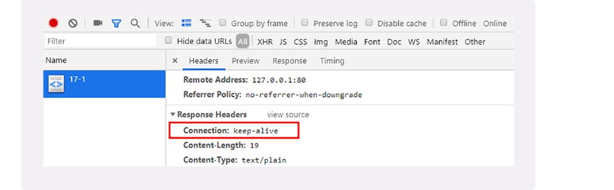
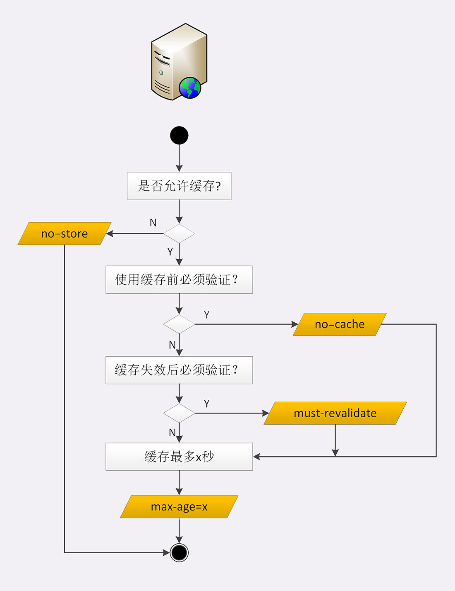
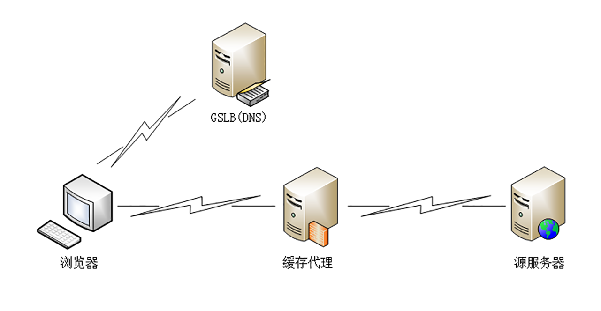

# 开篇

## To Be a HTTP Hero

# 破冰篇

## 01 | 时势与英雄：HTTP的前世今生

HTTP 协议在我们的生活中随处可见，打开手机或者电脑，只要你上网，不论是用 iPhone、Android、Windows 还是 Mac，不论是用浏览器还是 App，不论是看新闻、短视频还是听音乐、玩游戏，后面总会有 HTTP 在默默为你服务。

据 NetCraft 公司统计，目前全球至少有 16 亿个网站、2 亿多个独立域名，而这个庞大网络世界的底层运转机制就是 HTTP。

那么，在享受如此便捷舒适的网络生活时，你有没有想过，**HTTP 协议是怎么来的？它最开始是什么样子的？又是如何一步一步发展到今天，几乎“统治”了整个互联网世界的呢？**

常言道：“时势造英雄，英雄亦造时势”。

今天我就和你来聊一聊 HTTP 的发展历程，看看它的成长轨迹，看看历史上有哪些事件推动了它的前进，它又促进了哪些技术的产生，一起来见证“英雄之旅”。

在这个过程中，你也能够顺便了解一下 HTTP 的“历史局限性”，明白 HTTP 为什么会设计成现在这个样子。

### 史前时期

20 世纪 60 年代，美国国防部高等研究计划署（ARPA）建立了 ARPA 网，它有四个分布在各地的节点，被认为是如今互联网的“始祖”。

然后在 70 年代，基于对 ARPA 网的实践和思考，研究人员发明出了著名的 TCP/IP 协议。由于具有良好的分层结构和稳定的性能，TCP/IP 协议迅速战胜其他竞争对手流行起来，并在 80 年代中期进入了 UNIX 系统内核，促使更多的计算机接入了互联网。

### 创世纪


1989 年，任职于欧洲核子研究中心（CERN）的蒂姆·伯纳斯 - 李（Tim Berners-Lee）发表了一篇论文，提出了在互联网上构建超链接文档系统的构想。这篇论文中他确立了三项关键技术。

1. URI：即统一资源标识符，作为互联网上资源的唯一身份；
2. HTML：即超文本标记语言，描述超文本文档；
3. HTTP：即超文本传输协议，用来传输超文本。

这三项技术在如今的我们看来已经是稀松平常，但在当时却是了不得的大发明。基于它们，就可以把超文本系统完美地运行在互联网上，让各地的人们能够自由地共享信息，蒂姆把这个系统称为“万维网”（World Wide Web），也就是我们现在所熟知的 Web。

所以在这一年，我们的英雄“HTTP”诞生了，从此开始了它伟大的征途。

### HTTP/0.9

20 世纪 90 年代初期的互联网世界非常简陋，计算机处理能力低，存储容量小，网速很慢，还是一片“信息荒漠”。网络上绝大多数的资源都是纯文本，很多通信协议也都使用纯文本，所以 HTTP 的设计也不可避免地受到了时代的限制。

这一时期的 HTTP 被定义为 0.9 版，结构比较简单，为了便于服务器和客户端处理，它也采用了纯文本格式。蒂姆·伯纳斯 - 李最初设想的系统里的文档都是只读的，所以只允许用“GET”动作从服务器上获取 HTML 文档，并且在响应请求之后立即关闭连接，功能非常有限。

HTTP/0.9 虽然很简单，但它作为一个“原型”，充分验证了 Web 服务的可行性，而“简单”也正是它的优点，蕴含了进化和扩展的可能性，因为：

**“把简单的系统变复杂”，要比“把复杂的系统变简单”容易得多。**

### HTTP/1.0

1993 年，NCSA（美国国家超级计算应用中心）开发出了 Mosaic，是第一个可以图文混排的浏览器，随后又在 1995 年开发出了服务器软件 Apache，简化了 HTTP 服务器的搭建工作。

同一时期，计算机多媒体技术也有了新的发展：1992 年发明了 JPEG 图像格式，1995 年发明了 MP3 音乐格式。

这些新软件新技术一经推出立刻就吸引了广大网民的热情，更的多的人开始使用互联网，研究 HTTP 并提出改进意见，甚至实验性地往协议里添加各种特性，从用户需求的角度促进了 HTTP 的发展。

于是在这些已有实践的基础上，经过一系列的草案，HTTP/1.0 版本在 1996 年正式发布。它在多方面增强了 0.9 版，形式上已经和我们现在的 HTTP 差别不大了，例如：

增加了 HEAD、POST 等新方法；

增加了响应状态码，标记可能的错误原因；

引入了协议版本号概念；

引入了 HTTP Header（头部）的概念，让 HTTP 处理请求和响应更加灵活；

传输的数据不再仅限于文本。

但 HTTP/1.0 并不是一个“标准”，只是记录已有实践和模式的一份参考文档，不具有实际的约束力，相当于一个“备忘录”。

所以 HTTP/1.0 的发布对于当时正在蓬勃发展的互联网来说并没有太大的实际意义，各方势力仍然按照自己的意图继续在市场上奋力拼杀。

### HTTP/1.1

1995 年，网景的 Netscape Navigator 和微软的 Internet Explorer 开始了著名的“浏览器大战”，都希望在互联网上占据主导地位。


这场战争的结果你一定早就知道了，最终微软的 IE 取得了决定性的胜利，而网景则“败走麦城”（但后来却凭借 Mozilla Firefox 又扳回一局）。

“浏览器大战”的是非成败我们放在一边暂且不管，不可否认的是，它再一次极大地推动了 Web 的发展，HTTP/1.0 也在这个过程中经受了实践检验。于是在“浏览器大战”结束之后的 1999 年，HTTP/1.1 发布了 RFC 文档，编号为 2616，正式确立了延续十余年的传奇。

从版本号我们就可以看到，HTTP/1.1 是对 HTTP/1.0 的小幅度修正。但一个重要的区别是：它是一个“正式的标准”，而不是一份可有可无的“参考文档”。这意味着今后互联网上所有的浏览器、服务器、网关、代理等等，只要用到 HTTP 协议，就必须严格遵守这个标准，相当于是互联网世界的一个“立法”。

不过，说 HTTP/1.1 是“小幅度修正”也不太确切，它还是有很多实质性进步的。毕竟经过了多年的实战检验，比起 0.9/1.0 少了“学术气”，更加“接地气”，同时表述也更加严谨。HTTP/1.1 主要的变更点有：

1. 增加了 PUT、DELETE 等新的方法；
2. 增加了缓存管理和控制；
3. 明确了连接管理，允许持久连接；
4. 允许响应数据分块（chunked），利于传输大文件；
5. 强制要求 Host 头，让互联网主机托管成为可能。

HTTP/1.1 的推出可谓是“众望所归”，互联网在它的“保驾护航”下迈开了大步，由此走上了“康庄大道”，开启了后续的“Web 1.0”“Web 2.0”时代。现在许多的知名网站都是在这个时间点左右创立的，例如 Google、新浪、搜狐、网易、腾讯等。

不过由于 HTTP/1.1 太过庞大和复杂，所以在 2014 年又做了一次修订，原来的一个大文档被拆分成了六份较小的文档，编号为 7230-7235，优化了一些细节，但此外没有任何实质性的改动。

### HTTP/2

HTTP/1.1 发布之后，整个互联网世界呈现出了爆发式的增长，度过了十多年的“快乐时光”，更涌现出了 Facebook、Twitter、淘宝、京东等互联网新贵。

这期间也出现了一些对 HTTP 不满的意见，主要就是连接慢，无法跟上迅猛发展的互联网，但 HTTP/1.1 标准一直“岿然不动”，无奈之下人们只好发明各式各样的“小花招”来缓解这些问题，比如以前常见的切图、JS 合并等网页优化手段。

终于有一天，搜索巨头 Google 忍不住了，决定“揭竿而起”，就像马云说的“如果银行不改变，我们就改变银行”。那么，它是怎么“造反”的呢？

Google 首先开发了自己的浏览器 Chrome，然后推出了新的 SPDY 协议，并在 Chrome 里应用于自家的服务器，如同十多年前的网景与微软一样，从实际的用户方来“倒逼”HTTP 协议的变革，这也开启了第二次的“浏览器大战”。

历史再次重演，不过这次的胜利者是 Google，Chrome 目前的全球的占有率超过了 60%。“挟用户以号令天下”，Google 借此顺势把 SPDY 推上了标准的宝座，互联网标准化组织以 SPDY 为基础开始制定新版本的 HTTP 协议，最终在 2015 年发布了 HTTP/2，RFC 编号 7540。

HTTP/2 的制定充分考虑了现今互联网的现状：宽带、移动、不安全，在高度兼容 HTTP/1.1 的同时在性能改善方面做了很大努力，主要的特点有：

1. 二进制协议，不再是纯文本；
2. 可发起多个请求，废弃了 1.1 里的管道；
3. 使用专用算法压缩头部，减少数据传输量；
4. 允许服务器主动向客户端推送数据；
5. 增强了安全性，“事实上”要求加密通信。

虽然 HTTP/2 到今天已经四岁，也衍生出了 gRPC 等新协议，但由于 HTTP/1.1 实在是太过经典和强势，目前它的普及率还比较低，大多数网站使用的仍然还是 20 年前的 HTTP/1.1。

### HTTP/3

看到这里，你可能会问了：“HTTP/2 这么好，是不是就已经完美了呢？”

答案是否定的，这一次还是 Google，而且它要“革自己的命”。

在 HTTP/2 还处于草案之时，Google 又发明了一个新的协议，叫做 QUIC，而且还是相同的“套路”，继续在 Chrome 和自家服务器里试验着“玩”，依托它的庞大用户量和数据量，持续地推动 QUIC 协议成为互联网上的“既成事实”。

“功夫不负有心人”，当然也是因为 QUIC 确实自身素质过硬。

在去年，也就是 2018 年，互联网标准化组织 IETF 提议将“HTTP over QUIC”更名为“HTTP/3”并获得批准，HTTP/3 正式进入了标准化制订阶段，也许两三年后就会正式发布，到时候我们很可能会跳过 HTTP/2 直接进入 HTTP/3。

### 小结

今天我和你一起跨越了三十年的历史长河，回顾了 HTTP 协议的整个发展过程，在这里简单小结一下今天的内容：

1. HTTP 协议始于三十年前蒂姆·伯纳斯 - 李的一篇论文；
2. HTTP/0.9 是个简单的文本协议，只能获取文本资源；
3. HTTP/1.0 确立了大部分现在使用的技术，但它不是正式标准；
4. HTTP/1.1 是目前互联网上使用最广泛的协议，功能也非常完善；
5. HTTP/2 基于 Google 的 SPDY 协议，注重性能改善，但还未普及；
6. HTTP/3 基于 Google 的 QUIC 协议，是将来的发展方向。

希望通过今天的介绍，你能够对 HTTP 有一个初步但清晰的印象，知道了“来龙”才能更好地知道“去脉”。

---

## 02 | HTTP是什么？HTTP又不是什么？


## 03 | HTTP世界全览（上）：与HTTP相关的各种概念


## 04 | HTTP世界全览（下）：与HTTP相关的各种协议


## 05 | 常说的“四层”和“七层”到底是什么？“五层”“六层”哪去了？


## 06 | 域名里有哪些门道？


## 07 | 自己动手，搭建HTTP实验环境


# 基础篇

## 08 | 键入网址再按下回车，后面究竟发生了什么？


## 09 | HTTP报文是什么样子的？


## 10 | 应该如何理解请求方法？


## 11 | 你能写出正确的网址吗？


## 12 | 响应状态码该怎么用？


## 13 | HTTP有哪些特点？


## 14 | HTTP有哪些优点？又有哪些缺点？


# 进阶篇

## 15 | 海纳百川：HTTP的实体数据


## 16.把大象装进冰箱：HTTP传输大文件的方法

上次我们谈到了 HTTP 报文里的 body，知道了 HTTP 可以传输很多种类的数据，不仅是文本，也能传输图片、音频和视频。

早期互联网上传输的基本上都是只有几 K 大小的文本和小图片，现在的情况则大有不同。网页里包含的信息实在是太多了，随随便便一个主页 HTML 就有可能上百 K，高质量的图片都以 M 论，更不要说那些电影、电视剧了，几 G、几十 G 都有可能。

相比之下，100M 的光纤固网或者 4G 移动网络在这些大文件的压力下都变成了“小水管”，无论是上传还是下载，都会把网络传输链路挤的“满满当当”。

所以，如何在有限的带宽下高效快捷地传输这些大文件就成了一个重要的课题。这就好比是已经打开了冰箱门（建立连接），该怎么把大象（文件）塞进去再关上门（完成传输）呢？

今天我们就一起看看 HTTP 协议里有哪些手段能解决这个问题。

### 数据压缩

还记得上一讲中说到的“数据类型与编码”吗？如果你还有印象的话，肯定能够想到一个最基本的解决方案，那就是“**数据压缩**”，把大象变成小猪佩奇，再放进冰箱。

通常浏览器在发送请求时都会带着“**Accept-Encoding**”头字段，里面是浏览器支持的压缩格式列表，例如 gzip、deflate、br 等，这样服务器就可以从中选择一种压缩算法，放进“**Content-Encoding**”响应头里，再把原数据压缩后发给浏览器。

如果压缩率能有 50%，也就是说 100K 的数据能够压缩成 50K 的大小，那么就相当于在带宽不变的情况下网速提升了一倍，加速的效果是非常明显的。

不过这个解决方法也有个缺点，gzip 等压缩算法通常只对文本文件有较好的压缩率，而图片、音频视频等多媒体数据本身就已经是高度压缩的，再用 gzip 处理也不会变小（甚至还有可能会增大一点），所以它就失效了。

不过数据压缩在处理文本的时候效果还是很好的，所以各大网站的服务器都会使用这个手段作为“保底”。例如，在 Nginx 里就会使用“gzip on”指令，启用对“text/html”的压缩。

### 分块传输

在数据压缩之外，还能有什么办法来解决大文件的问题呢？

压缩是把大文件整体变小，我们可以反过来思考，如果大文件整体不能变小，那就把它“拆开”，分解成多个小块，把这些小块分批发给浏览器，浏览器收到后再组装复原。

这种“化整为零”的思路在 HTTP 协议里就是“**chunked**”分块传输编码，在响应报文里用头字段“**Transfer-Encoding: chunked**”来表示，意思是报文里的 body 部分不是一次性发过来的，而是分成了许多的块（chunk）逐个发送。

这就好比是用魔法把大象变成“乐高积木”，拆散了逐个装进冰箱，到达目的地后再施法拼起来“满血复活”。

分块传输也可以用于“流式数据”，例如由数据库动态生成的表单页面，这种情况下 body 数据的长度是未知的，无法在头字段“Content-Length”里给出确切的长度，所以也只能用 chunked 方式分块发送。

**“Transfer-Encoding: chunked”和“Content-Length”这两个字段是互斥的**，也就是说响应报文里这两个字段不能同时出现，一个响应报文的传输要么是长度已知，要么是长度未知（chunked），这一点你一定要记住。

下面我们来看一下分块传输的编码规则，其实也很简单，同样采用了明文的方式，很类似响应头。

1. 每个分块包含两个部分，**长度头**和**数据块**；
2. 长度头是以 CRLF（回车换行，即\r\n）结尾的一行明文，用 16 进制数字表示长度；
3. 数据块紧跟在长度头后，最后也用 CRLF 结尾，但数据不包含 CRLF；
4. 最后用一个长度为 0 的块表示结束，即“0\r\n\r\n”。

听起来好像有点难懂，看一下图就好理解了：


实验环境里的 URI“/16-1”简单地模拟了分块传输，可以用 Chrome 访问这个地址看一下效果：


不过浏览器在收到分块传输的数据后会自动按照规则去掉分块编码，重新组装出内容，所以想要看到服务器发出的原始报文形态就得用 Telnet 手工发送请求（或者用 Wireshark 抓包）：

```
GET /16-1 HTTP/1.1
Host: www.chrono.com
```

因为 Telnet 只是收到响应报文就完事了，不会解析分块数据，所以可以很清楚地看到响应报文里的 chunked 数据格式：先是一行 16 进制长度，然后是数据，然后再是 16 进制长度和数据，如此重复，最后是 0 长度分块结束。


### 范围请求

有了分块传输编码，服务器就可以轻松地收发大文件了，但对于上 G 的超大文件，还有一些问题需要考虑。

比如，你在看当下正热播的某穿越剧，想跳过片头，直接看正片，或者有段剧情很无聊，想拖动进度条快进几分钟，这实际上是想获取一个大文件其中的片段数据，而分块传输并没有这个能力。

HTTP 协议为了满足这样的需求，提出了“**范围请求**”（range requests）的概念，允许客户端在请求头里使用专用字段来表示只获取文件的一部分，相当于是客户端的“化整为零”。

范围请求不是 Web 服务器必备的功能，可以实现也可以不实现，所以服务器必须在响应头里使用字段“**Accept-Ranges: bytes**”明确告知客户端：“我是支持范围请求的”。

如果不支持的话该怎么办呢？服务器可以发送“Accept-Ranges: none”，或者干脆不发送“Accept-Ranges”字段，这样客户端就认为服务器没有实现范围请求功能，只能老老实实地收发整块文件了。

请求头 **Range** 是 HTTP 范围请求的专用字段，格式是“**bytes=x-y**”，其中的 x 和 y 是以字节为单位的数据范围。

要注意 x、y 表示的是“**偏移量**”，范围必须从 0 计数，例如前 10 个字节表示为“0-9”，第二个 10 字节表示为“10-19”，而“0-10”实际上是前 11 个字节。

Range 的格式也很灵活，起点 x 和终点 y 可以省略，能够很方便地表示正数或者倒数的范围。假设文件是 100 个字节，那么：

+ “0-”表示从文档起点到文档终点，相当于“0-99”，即整个文件；
+ “10-”是从第 10 个字节开始到文档末尾，相当于“10-99”；
+ “-1”是文档的最后一个字节，相当于“99-99”；
+ “-10”是从文档末尾倒数 10 个字节，相当于“90-99”。

服务器收到 Range 字段后，需要做四件事。

第一，它必须检查范围是否合法，比如文件只有 100 个字节，但请求“200-300”，这就是范围越界了。服务器就会返回状态码 416，意思是“你的范围请求有误，我无法处理，请再检查一下”。

第二，如果范围正确，服务器就可以根据 Range 头计算偏移量，读取文件的片段了，返回状态码“**206 Partial Content**”，和 200 的意思差不多，但表示 body 只是原数据的一部分。

第三，服务器要添加一个响应头字段 **Content-Range**，告诉片段的实际偏移量和资源的总大小，格式是“**bytes x-y/length**”，与 Range 头区别在没有“=”，范围后多了总长度。例如，对于“0-10”的范围请求，值就是“bytes 0-10/100”。

最后剩下的就是发送数据了，直接把片段用 TCP 发给客户端，一个范围请求就算是处理完了。

你可以用实验环境的 URI“/16-2”来测试范围请求，它处理的对象是“/mime/a.txt”。不过我们不能用 Chrome 浏览器，因为它没有编辑 HTTP 请求头的功能（这点上不如 Firefox 方便），所以还是要用 Telnet。

例如下面的这个请求使用 Range 字段获取了文件的前 32 个字节：

```http
GET /16-2 HTTP/1.1
Host: www.chrono.com
Range: bytes=0-31
```

返回的数据是（去掉了几个无关字段）：

```http
HTTP/1.1 206 Partial Content
Content-Length: 32
Accept-Ranges: bytes
Content-Range: bytes 0-31/96

// this is a plain text json doc
```

有了范围请求之后，HTTP 处理大文件就更加轻松了，看视频时可以根据时间点计算出文件的 Range，不用下载整个文件，直接精确获取片段所在的数据内容。

不仅看视频的拖拽进度需要范围请求，常用的下载工具里的多段下载、断点续传也是基于它实现的，要点是：

+ 先发个 HEAD，看服务器是否支持范围请求，同时获取文件的大小；
+ 开 N 个线程，每个线程使用 Range 字段划分出各自负责下载的片段，发请求传输数据；
+ 下载意外中断也不怕，不必重头再来一遍，只要根据上次的下载记录，用 Range 请求剩下的那一部分就可以了。

### 多段数据

刚才说的范围请求一次只获取一个片段，其实它还支持在 Range 头里使用多个“x-y”，一次性获取多个片段数据。

这种情况需要使用一种特殊的 MIME 类型：“**multipart/byteranges**”，表示报文的 body 是由多段字节序列组成的，并且还要用一个参数“**boundary=xxx**”给出段之间的分隔标记。

多段数据的格式与分块传输也比较类似，但它需要用分隔标记 boundary 来区分不同的片段，可以通过图来对比一下。


每一个分段必须以“- -boundary”开始（前面加两个“-”），之后要用“Content-Type”和“Content-Range”标记这段数据的类型和所在范围，然后就像普通的响应头一样以回车换行结束，再加上分段数据，最后用一个“- -boundary- -”（前后各有两个“-”）表示所有的分段结束。

例如，我们在实验环境里用 Telnet 发出有两个范围的请求：

```
GET /16-2 HTTP/1.1
Host: www.chrono.com
Range: bytes=0-9, 20-29
```

得到的就会是下面这样：

```http
HTTP/1.1 206 Partial Content
Content-Type: multipart/byteranges; boundary=00000000001
Content-Length: 189
Connection: keep-alive
Accept-Ranges: bytes


--00000000001
Content-Type: text/plain
Content-Range: bytes 0-9/96

// this is
--00000000001
Content-Type: text/plain
Content-Range: bytes 20-29/96

ext json d
--00000000001--
```

报文里的“- -00000000001”就是多段的分隔符，使用它客户端就可以很容易地区分出多段 Range 数据。

### 小结

今天我们学习了 HTTP 传输大文件相关的知识，在这里做一下简单小结：

1. 压缩 HTML 等文本文件是传输大文件最基本的方法；

2. 分块传输可以流式收发数据，节约内存和带宽，使用响应头字段“Transfer-Encoding: chunked”来表示，分块的格式是 16 进制长度头 + 数据块；

3. 范围请求可以只获取部分数据，即“分块请求”，实现视频拖拽或者断点续传，使用请求头字段“Range”和响应头字段“Content-Range”，响应状态码必须是 206；

4. 也可以一次请求多个范围，这时候响应报文的数据类型是“multipart/byteranges”，body 里的多个部分会用 boundary 字符串分隔

   要注意这四种方法不是互斥的，而是可以混合起来使用，例如压缩后再分块传输，或者分段后再分块，实验环境的 URI“/16-3”就模拟了后一种的情形，你可以自己用 Telnet 试一下。

---

## 17.排队也要讲效率：HTTP的连接管理

在第 14 讲里，我曾经提到过 HTTP 的性能问题，用了六个字来概括：“**不算差，不够好**”。同时，我也谈到了“**队头阻塞**”，但由于时间的限制没有展开来细讲，这次就来好好地看看 HTTP 在连接这方面的表现。

HTTP 的连接管理也算得上是个“老生常谈”的话题了，你一定曾经听说过“短连接”“长连接”之类的名词，今天让我们一起来把它们弄清楚。

### 短连接

HTTP 协议最初（0.9/1.0）是个非常简单的协议，通信过程也采用了简单的“请求 - 应答”方式。

它底层的数据传输基于 TCP/IP，每次发送请求前需要先与服务器建立连接，收到响应报文后会立即关闭连接。

因为客户端与服务器的整个连接过程很短暂，不会与服务器保持长时间的连接状态，所以就被称为“**短连接**”（short-lived connections）。早期的 HTTP 协议也被称为是“**无连接**”的协议。

短连接的缺点相当严重，因为在 TCP 协议里，建立连接和关闭连接都是非常“昂贵”的操作。TCP 建立连接要有“三次握手”，发送 3 个数据包，需要 1 个 RTT；关闭连接是“四次挥手”，4 个数据包需要 2 个 RTT。

**(定义往返时间(round trip time，简称RTT),客户端最后一次握手通常夹带HTTP报文，所以是1个RTT).**

而 HTTP 的一次简单“请求 - 响应”通常只需要 4 个包，如果不算服务器内部的处理时间，最多是 2 个 RTT。这么算下来，浪费的时间就是“3÷5=60%”，有三分之二的时间被浪费掉了，传输效率低得惊人。

而 HTTP 的一次简单“请求 - 响应”通常只需要 4 个包，如果不算服务器内部的处理时间，最多是 2 个 RTT。这么算下来，浪费的时间就是“3÷5=60%”，有三分之二的时间被浪费掉了，传输效率低得惊人。


单纯地从理论上讲，TCP 协议你可能还不太好理解，我就拿打卡考勤机来做个形象的比喻吧。

假设你的公司买了一台打卡机，放在前台，因为这台机器比较贵，所以专门做了一个保护罩盖着它，公司要求每次上下班打卡时都要先打开盖子，打卡后再盖上盖子。

可是偏偏这个盖子非常牢固，打开关闭要费很大力气，打卡可能只要 1 秒钟，而开关盖子却需要四五秒钟，大部分时间都浪费在了毫无意义的开关盖子操作上了。

可想而知，平常还好说，一到上下班的点在打卡机前就会排起长队，每个人都要重复“开盖 - 打卡 - 关盖”的三个步骤，你说着急不着急。

在这个比喻里，打卡机就相当于服务器，盖子的开关就是 TCP 的连接与关闭，而每个打卡的人就是 HTTP 请求，很显然，短连接的缺点严重制约了服务器的服务能力，导致它无法处理更多的请求。

### 长连接

针对短连接暴露出的缺点，HTTP 协议就提出了“**长连接**”的通信方式，也叫“持久连接”（persistent connections）、“连接保活”（keep alive）、“连接复用”（connection reuse）。

其实解决办法也很简单，用的就是“**成本均摊**”的思路，既然 TCP 的连接和关闭非常耗时间，那么就把这个时间成本由原来的一个“请求 - 应答”均摊到多个“请求 - 应答”上。

这样虽然不能改善 TCP 的连接效率，但基于“**分母效应**”，每个“请求 - 应答”的无效时间就会降低不少，整体传输效率也就提高了。

这里我画了一个短连接与长连接的对比示意图。


在短连接里发送了三次 HTTP“请求 - 应答”，每次都会浪费 60% 的 RTT 时间。而在长连接的情况下，同样发送三次请求，因为只在第一次时建立连接，在最后一次时关闭连接，所以浪费率就是“3÷9≈33%”，降低了差不多一半的时间损耗。显然，如果在这个长连接上发送的请求越多，分母就越大，利用率也就越高。

继续用刚才的打卡机的比喻，公司也觉得这种反复“开盖 - 打卡 - 关盖”的操作太“反人类”了，于是颁布了新规定，早上打开盖子后就不用关上了，可以自由打卡，到下班后再关上盖子。

这样打卡的效率（即服务能力）就大幅度提升了，原来一次打卡需要五六秒钟，现在只要一秒就可以了，上下班时排长队的景象一去不返，大家都开心。

### 连接相关的头字段

由于长连接对性能的改善效果非常显著，所以**在 HTTP/1.1 中的连接都会默认启用长连接**。不需要用什么特殊的头字段指定，只要向服务器发送了第一次请求，后续的请求都会重复利用第一次打开的 TCP 连接，也就是长连接，在这个连接上收发数据。

当然，我们也可以在请求头里明确地要求使用长连接机制，使用的字段是 **Connection**，值是“**keep-alive**”。

不过不管客户端是否显式要求长连接，如果服务器支持长连接，它总会在响应报文里放一个“**Connection: keep-alive**”字段，告诉客户端：“我是支持长连接的，接下来就用这个 TCP 一直收发数据吧”。

你可以在实验环境里访问 URI“/17-1”，用 Chrome 看一下服务器返回的响应头：



不过长连接也有一些小缺点，问题就出在它的“长”字上。

因为 TCP 连接长时间不关闭，服务器必须在内存里保存它的状态，这就占用了服务器的资源。如果有大量的空闲长连接只连不发，就会很快耗尽服务器的资源，导致服务器无法为真正有需要的用户提供服务。

所以，长连接也需要在恰当的时间关闭，不能永远保持与服务器的连接，这在客户端或者服务器都可以做到。

在客户端，可以在请求头里加上“**Connection: close**”字段，告诉服务器：“这次通信后就关闭连接”。服务器看到这个字段，就知道客户端要主动关闭连接，于是在响应报文里也加上这个字段，发送之后就调用 Socket API 关闭 TCP 连接。

服务器端通常不会主动关闭连接，但也可以使用一些策略。拿 Nginx 来举例，它有两种方式：

1. 使用“keepalive_timeout”指令，设置长连接的超时时间，如果在一段时间内连接上没有任何数据收发就主动断开连接，避免空闲连接占用系统资源。
2. 使用“keepalive_requests”指令，设置长连接上可发送的最大请求次数。比如设置成 1000，那么当 Nginx 在这个连接上处理了 1000 个请求后，也会主动断开连接。

另外，客户端和服务器都可以在报文里附加通用头字段“Keep-Alive: timeout=value”，限定长连接的超时时间。但这个字段的约束力并不强，通信的双方可能并不会遵守，所以不太常见。

我们的实验环境配置了“keepalive_timeout 60”和“keepalive_requests 5”，意思是空闲连接最多 60 秒，最多发送 5 个请求。所以，如果连续刷新五次页面，就能看到响应头里的“Connection: close”了。

把这个过程用 Wireshark 抓一下包，就能够更清晰地看到整个长连接中的握手、收发数据与挥手过程，在课后你可以再实际操作看看。


### 队头阻塞

### 性能优化

并发连接 域名分片

### 小结

1. 早期的 HTTP 协议使用短连接，收到响应后就立即关闭连接，效率很低；
2. HTTP/1.1 默认启用长连接，在一个连接上收发多个请求响应，提高了传输效率；
3. 服务器会发送“Connection: keep-alive”字段表示启用了长连接；
4. 报文头里如果有“Connection: close”就意味着长连接即将关闭；
5. 过多的长连接会占用服务器资源，所以服务器会用一些策略有选择地关闭长连接；
6. “队头阻塞”问题会导致性能下降，可以用“并发连接”和“域名分片”技术缓解。

---

## 18.四通八达：HTTP的重定向和跳转

## 19. 让我知道你是谁：HTTP的Cookie机制

### 小结

今天我们学习了 HTTP 里的 Cookie 知识。虽然现在已经出现了多种 Local Web Storage 技术，能够比 Cookie 存储更多的数据，但 Cookie 仍然是最通用、兼容性最强的客户端数据存储手段。

1. Cookie 是服务器委托浏览器存储的一些数据，让服务器有了“记忆能力”；
2. 响应报文使用 Set-Cookie 字段发送“key=value”形式的 Cookie 值；
3. 请求报文里用 Cookie 字段发送多个 Cookie 值；
4. 为了保护 Cookie，还要给它设置**有效期**、**作用域**等属性，常用的有 Max-Age、Expires、Domain、HttpOnly 等；
5. Cookie 最基本的用途是身份识别，实现有状态的会话事务。

还要提醒你一点，因为 Cookie 并不属于 HTTP 标准（RFC6265，而不是 RFC2616/7230），所以语法上与其他字段不太一致，使用的分隔符是“;”，与 Accept 等字段的“,”不同，小心不要弄错了。

---

## 20.生鲜速递：HTTP的缓存控制

缓存（Cache）是计算机领域里的一个重要概念，是优化系统性能的利器。

由于链路漫长，网络时延不可控，浏览器使用 HTTP 获取资源的成本较高。所以，非常有必要把“来之不易”的数据缓存起来，下次再请求的时候尽可能地复用。这样，就可以避免多次请求 - 应答的通信成本，节约网络带宽，也可以加快响应速度。

试想一下，如果有几十 K 甚至几十 M 的数据，不是从网络而是从本地磁盘获取，那将是多么大的一笔节省，免去多少等待的时间。

实际上，HTTP 传输的每一个环节基本上都会有缓存，非常复杂。

基于“请求 - 应答”模式的特点，可以大致分为客户端缓存和服务器端缓存，因为服务器端缓存经常与代理服务“混搭”在一起，所以今天我先讲客户端——也就是浏览器的缓存。

### 服务器的缓存控制

为了更好地说明缓存的运行机制，下面我用“生鲜速递”作为比喻，看看缓存是如何工作的。

夏天到了，天气很热。你想吃西瓜消暑，于是打开冰箱，但很不巧，冰箱是空的。不过没事，现在物流很发达，给生鲜超市打个电话，不一会儿，就给你送来一个 8 斤的沙瓤大西瓜，上面还贴着标签：“保鲜期 5 天”。好了，你把它放进冰箱，想吃的时候随时拿出来。

在这个场景里，“生鲜超市”就是 Web 服务器，“你”就是浏览器，“冰箱”就是浏览器内部的缓存。整个流程翻译成 HTTP 就是：

1. 浏览器发现缓存无数据，于是发送请求，向服务器获取资源；
2. 服务器响应请求，返回资源，同时标记资源的有效期；
3. 浏览器缓存资源，等待下次重用。


你可以访问实验环境的 URI “/20-1”，看看具体的请求 - 应答过程。


服务器标记资源有效期使用的头字段是“**Cache-Control**”，里面的值“**max-age=30**”就是资源的有效时间，相当于告诉浏览器，“这个页面只能缓存 30 秒，之后就算是过期，不能用。”

你可能要问了，让浏览器直接缓存数据就好了，为什么要加个有效期呢？

这是因为网络上的数据随时都在变化，不能保证它稍后的一段时间还是原来的样子。就像生鲜超市给你快递的西瓜，只有 5 天的保鲜期，过了这个期限最好还是别吃，不然可能会闹肚子。

“Cache-Control”字段里的“max-age”和上一讲里 Cookie 有点像，都是标记资源的有效期。

但我必须提醒你注意，这里的 max-age 是“**生存时间**”（又叫“新鲜度”“缓存寿命”，类似 TTL，Time-To-Live），时间的计算起点是响应报文的创建时刻（即 Date 字段，也就是离开服务器的时刻），而不是客户端收到报文的时刻，也就是说包含了在链路传输过程中所有节点所停留的时间。

比如，服务器设定“max-age=5”，但因为网络质量很糟糕，等浏览器收到响应报文已经过去了 4 秒，那么这个资源在客户端就最多能够再存 1 秒钟，之后就会失效。

“max-age”是 HTTP 缓存控制最常用的属性，此外在响应报文里还可以用其他的属性来更精确地指示浏览器应该如何使用缓存：

+ no-store：**不允许缓存**，用于某些变化非常频繁的数据，例如秒杀页面；
+ no-cache：它的字面含义容易与 no-store 搞混，实际的意思并不是不允许缓存，而是**可以缓存**，但在使用之前必须要去服务器验证是否过期，是否有最新的版本；
+ must-revalidate：又是一个和 no-cache 相似的词，它的意思是如果缓存不过期就可以继续使用，但过期了如果还想用就必须去服务器验证。

听的有点糊涂吧。没关系，我拿生鲜速递来举例说明一下：

+ no-store：买来的西瓜不允许放进冰箱，要么立刻吃，要么立刻扔掉；
+ no-cache：可以放进冰箱，但吃之前必须问超市有没有更新鲜的，有就吃超市里的；
+ must-revalidate：可以放进冰箱，保鲜期内可以吃，过期了就要问超市让不让吃。

你看，这超市管的还真多啊，西瓜到了家里怎么吃还得听他。不过没办法，在 HTTP 协议里服务器就是这样的“霸气”。

我把服务器的缓存控制策略画了一个流程图，对照着它你就可以在今后的后台开发里明确“Cache-Control”的用法了。



### 客户端的缓存控制

现在冰箱里已经有了“缓存”的西瓜，是不是就可以直接开吃了呢？

你可以在 Chrome 里点几次“刷新”按钮，估计你会失望，页面上的 ID 一直在变，根本不是缓存的结果，明明说缓存 30 秒，怎么就不起作用呢？

其实不止服务器可以发“Cache-Control”头，浏览器也可以发“Cache-Control”，也就是说请求 - 应答的双方都可以用这个字段进行缓存控制，互相协商缓存的使用策略。

当你点“刷新”按钮的时候，浏览器会在请求头里加一个“**Cache-Control: max-age=0**”。因为 max-age 是“**生存时间**”，max-age=0 的意思就是“我要一个最最新鲜的西瓜”，而本地缓存里的数据至少保存了几秒钟，所以浏览器就不会使用缓存，而是向服务器发请求。服务器看到 max-age=0，也就会用一个最新生成的报文回应浏览器。

Ctrl+F5 的“强制刷新”又是什么样的呢？

它其实是发了一个“**Cache-Control: no-cache**”，含义和“max-age=0”基本一样，就看后台的服务器怎么理解，通常两者的效果是相同的。


那么，浏览器的缓存究竟什么时候才能生效呢？

其实也很简单，在“前进”“后退”“跳转”这些重定向动作中浏览器不会“夹带私货”，只用最基本的请求头，没有“Cache-Control”，所以就会检查缓存，直接利用之前的资源，不再进行网络通信。

这个过程你也可以用 Wireshark 抓包，看看是否真的没有向服务器发请求。

### 条件请求

浏览器用“Cache-Control”做缓存控制只能是刷新数据，不能很好地利用缓存数据，又因为缓存会失效，使用前还必须要去服务器验证是否是最新版。

那么该怎么做呢？

浏览器可以用两个连续的请求组成“验证动作”：先是一个 HEAD，获取资源的修改时间等元信息，然后与缓存数据比较，如果没有改动就使用缓存，节省网络流量，否则就再发一个 GET 请求，获取最新的版本。

但这样的两个请求网络成本太高了，所以 HTTP 协议就定义了一系列“**If**”开头的“**条件请求**”字段，专门用来检查验证资源是否过期，把两个请求才能完成的工作合并在一个请求里做。而且，验证的责任也交给服务器，浏览器只需“坐享其成”。

条件请求一共有 5 个头字段，我们最常用的是“**if-Modified-Since**”和“**If-None-Match**”这两个。需要第一次的响应报文预先提供“**Last-modified**”和“**ETag**”，然后第二次请求时就可以带上缓存里的原值，验证资源是否是最新的。

如果资源没有变，服务器就回应一个“**304 Not Modified**”，表示缓存依然有效，浏览器就可以更新一下有效期，然后放心大胆地使用缓存了。


“Last-modified”很好理解，就是文件的最后修改时间。ETag 是什么呢？

ETag 是“实体标签”（Entity Tag）的缩写，是**资源的一个唯一标识**，主要是用来解决修改时间无法准确区分文件变化的问题。

比如，一个文件在一秒内修改了多次，但因为修改时间是秒级，所以这一秒内的新版本无法区分。

再比如，一个文件定期更新，但有时会是同样的内容，实际上没有变化，用修改时间就会误以为发生了变化，传送给浏览器就会浪费带宽。

使用 ETag 就可以精确地识别资源的变动情况，让浏览器能够更有效地利用缓存。

ETag 还有“强”“弱”之分。

强 ETag 要求资源在字节级别必须完全相符，弱 ETag 在值前有个“W/”标记，只要求资源在语义上没有变化，但内部可能会有部分发生了改变（例如 HTML 里的标签顺序调整，或者多了几个空格）。

还是拿生鲜速递做比喻最容易理解：

你打电话给超市，“我这个西瓜是 3 天前买的，还有最新的吗？”。超市看了一下库存，说：“没有啊，我这里都是 3 天前的。”于是你就知道了，再让超市送货也没用，还是吃冰箱里的西瓜吧。这就是“**if-Modified-Since**”和“**Last-modified**”。

但你还是想要最新的，就又打电话：“有不是沙瓤的西瓜吗？”，超市告诉你都是沙瓤的（Match），于是你还是只能吃冰箱里的沙瓤西瓜。这就是“**If-None-Match**”和“**弱 ETag**”。

再来看看实验环境的 URI “/20-2”。它为资源增加了 ETag 字段，刷新页面时浏览器就会同时发送缓存控制头“max-age=0”和条件请求头“If-None-Match”，如果缓存有效服务器就会返回 304：


条件请求里其他的三个头字段是“If-Unmodified-Since”“If-Match”和“If-Range”，其实只要你掌握了“if-Modified-Since”和“If-None-Match”，可以轻易地“举一反三”。

### 小结

今天我们学习了 HTTP 的缓存控制和条件请求，用好它们可以减少响应时间、节约网络流量，一起小结一下今天的内容吧：

1. 缓存是优化系统性能的重要手段，HTTP 传输的每一个环节中都可以有缓存；
2. 服务器使用“Cache-Control”设置缓存策略，常用的是“max-age”，表示资源的有效期；
3. 浏览器收到数据就会存入缓存，如果没过期就可以直接使用，过期就要去服务器验证是否仍然可用；
4. 验证资源是否失效需要使用“**条件请求**”，常用的是“if-Modified-Since”和“If-None-Match”，收到 304 就可以复用缓存里的资源；
5. 验证资源是否被修改的条件有两个：“Last-modified”和“ETag”，需要服务器预先在响应报文里设置，搭配条件请求使用；
6. 浏览器也可以发送“Cache-Control”字段，使用“max-age=0”或“no_cache”刷新数据。

HTTP 缓存看上去很复杂，但基本原理说白了就是一句话：“没有消息就是好消息”，“没有请求的请求，才是最快的请求。”

---

## 21.良心中间商：HTTP的代理服务

在前面讲 HTTP 协议的时候，我们严格遵循了 HTTP 的“请求 - 应答”模型，协议中只有两个互相通信的角色，分别是“请求方”浏览器（客户端）和“应答方”服务器。

今天，我们要在这个模型里引入一个新的角色，那就是**HTTP 代理**。

引入 HTTP 代理后，原来简单的双方通信就变复杂了一些，加入了一个或者多个中间人，但整体上来看，还是一个有顺序关系的链条，而且链条里相邻的两个角色仍然是简单的一对一通信，不会出现越级的情况。


链条的起点还是客户端（也就是浏览器），中间的角色被称为代理服务器（proxy server），链条的终点被称为源服务器（origin server），意思是数据的“源头”“起源”。

### 代理服务

“代理”这个词听起来好像很神秘，有点“高大上”的感觉。

但其实 HTTP 协议里对它并没有什么特别的描述，它就是在客户端和服务器原本的通信链路中插入的一个中间环节，也是一台服务器，但提供的是“代理服务”。

所谓的“代理服务”就是指**服务本身不生产内容，而是处于中间位置转发上下游的请求和响应，具有双重身份**：面向下游的用户时，表现为服务器，代表源服务器响应客户端的请求；而面向上游的源服务器时，又表现为客户端，代表客户端发送请求。

还是拿上一讲的“生鲜超市”来打个比方。

之前你都是从超市里买东西，现在楼底下新开了一家 24 小时便利店，由超市直接供货，于是你就可以在便利店里买到原本必须去超市才能买到的商品。

这样超市就不直接和你打交道了，成了“源服务器”，便利店就成了超市的“代理服务器”。

在第 4 讲中，我曾经说过，代理有很多的种类，例如匿名代理、透明代理、正向代理和反向代理。

今天我主要讲的是实际工作中最常见的反向代理，它在传输链路中更靠近源服务器，为源服务器提供代理服务。

### 代理的作用

为什么要有代理呢？换句话说，代理能干什么、带来什么好处呢？

你也许听过这样一句至理名言：“**计算机科学领域里的任何问题，都可以通过引入一个中间层来解决**”（在这句话后面还可以再加上一句“如果一个中间层解决不了问题，那就再加一个中间层”）。TCP/IP 协议栈是这样，而代理也是这样。

由于代理处在 HTTP 通信过程的中间位置，相应地就对上屏蔽了真实客户端，对下屏蔽了真实服务器，简单的说就是“**欺上瞒下**”。在这个中间层的“小天地”里就可以做很多的事情，为 HTTP 协议增加更多的灵活性，实现客户端和服务器的“双赢”。

代理最基本的一个功能是**负载均衡**。因为在面向客户端时屏蔽了源服务器，客户端看到的只是代理服务器，源服务器究竟有多少台、是哪些 IP 地址都不知道。于是代理服务器就可以掌握请求分发的“大权”，决定由后面的哪台服务器来响应请求。


代理中常用的负载均衡算法你应该也有所耳闻吧，比如轮询、一致性哈希等等，这些算法的目标都是尽量把外部的流量合理地分散到多台源服务器，提高系统的整体资源利用率和性能。

在负载均衡的同时，代理服务还可以执行更多的功能，比如：

+ **健康检查**：使用“心跳”等机制监控后端服务器，发现有故障就及时“踢出”集群，保证服务高可用；
+ **安全防护**：保护被代理的后端服务器，限制 IP 地址或流量，抵御网络攻击和过载；
+ **加密卸载**：对外网使用 SSL/TLS 加密通信认证，而在安全的内网不加密，消除加解密成本；
+ **数据过滤**：拦截上下行的数据，任意指定策略修改请求或者响应；
+ **内容缓存**：暂存、复用服务器响应，这个与第 20 讲密切相关，我们稍后再说。

接着拿刚才的便利店来举例说明。

因为便利店和超市之间是专车配送，所以有了便利店，以后你买东西就更省事了，打电话给便利店让它去帮你取货，不用关心超市是否停业休息、是否人满为患，而且总能买到最新鲜的。

便利店同时也方便了超市，不用额外加大店面就可以增加客源和销量，货物集中装卸也节省了物流成本，由于便利店直接面对客户，所以也可以把恶意骚扰电话挡在外面。

### 代理相关头字段

代理的好处很多，但因为它“欺上瞒下”的特点，隐藏了真实客户端和服务器，如果双方想要获得这些“丢失”的原始信息，该怎么办呢？

首先，代理服务器需要用字段“**Via**”标明代理的身份。

Via 是一个通用字段，请求头或响应头里都可以出现。每当报文经过一个代理节点，代理服务器就会把自身的信息追加到字段的末尾，就像是经手人盖了一个章。

如果通信链路中有很多中间代理，就会在 Via 里形成一个链表，这样就可以知道报文究竟走过了多少个环节才到达了目的地。

例如下图中有两个代理：proxy1 和 proxy2，客户端发送请求会经过这两个代理，依次添加就是“Via:  proxy1, proxy2”，等到服务器返回响应报文的时候就要反过来走，头字段就是“Via:  proxy2,  proxy1”。


Via 字段只解决了客户端和源服务器判断是否存在代理的问题，还不能知道对方的真实信息。

但服务器的 IP 地址应该是保密的，关系到企业的内网安全，所以一般不会让客户端知道。不过反过来，通常服务器需要知道客户端的真实 IP 地址，方便做访问控制、用户画像、统计分析。

可惜的是 HTTP 标准里并没有为此定义头字段，但已经出现了很多“事实上的标准”，最常用的两个头字段是“**X-Forwarded-For**”和“**X-Real-IP**”。

“X-Forwarded-For”的字面意思是“为谁而转发”，形式上和“Via”差不多，也是每经过一个代理节点就会在字段里追加一个信息。但“Via”追加的是代理主机名（或者域名），而“X-Forwarded-For”追加的是请求方的 IP 地址。所以，在字段里最左边的 IP 地址就是客户端的地址。

“X-Real-IP”是另一种获取客户端真实 IP 的手段，它的作用很简单，就是记录客户端 IP 地址，没有中间的代理信息，相当于是“X-Forwarded-For”的简化版。如果客户端和源服务器之间只有一个代理，那么这两个字段的值就是相同的。

我们的实验环境实现了一个反向代理，访问“http://www.chrono.com/21-1”，它会转而访问“http://origin.io”。这里的“origin.io”就是源站，它会在响应报文里输出“Via”“X-Forwarded-For”等代理头字段信息：


单从浏览器的页面上很难看出代理做了哪些工作，因为代理的转发都在后台不可见，所以我把这个过程用 Wireshark 抓了一个包：


从抓包里就可以清晰地看出代理与客户端、源服务器的通信过程：

1. 客户端 55061 先用三次握手连接到代理的 80 端口，然后发送 GET 请求；
2. 代理不直接生产内容，所以就代表客户端，用 55063 端口连接到源服务器，也是三次握手；
3. 代理成功连接源服务器后，发出了一个 HTTP/1.0 的 GET 请求；
4. 因为 HTTP/1.0 默认是短连接，所以源服务器发送响应报文后立即用四次挥手关闭连接；
5. 代理拿到响应报文后再发回给客户端，完成了一次代理服务。

在这个实验中，你可以看到除了“X-Forwarded-For”和“X-Real-IP”，还出现了两个字段：“X-Forwarded-Host”和“X-Forwarded-Proto”，它们的作用与“X-Real-IP”类似，只记录客户端的信息，分别是客户端请求的原始域名和原始协议名。

### 代理协议

有了“X-Forwarded-For”等头字段，源服务器就可以拿到准确的客户端信息了。但对于代理服务器来说它并不是一个最佳的解决方案。

因为通过“X-Forwarded-For”操作代理信息必须要解析 HTTP 报文头，这对于代理来说成本比较高，原本只需要简单地转发消息就好，而现在却必须要费力解析数据再修改数据，会降低代理的转发性能。

另一个问题是“X-Forwarded-For”等头必须要修改原始报文，而有些情况下是不允许甚至不可能的（比如使用 HTTPS 通信被加密）。

所以就出现了一个专门的“代理协议”（The PROXY protocol），它由知名的代理软件 HAProxy 所定义，也是一个“事实标准”，被广泛采用（注意并不是 RFC）。

“代理协议”有 v1 和 v2 两个版本，v1 和 HTTP 差不多，也是明文，而 v2 是二进制格式。今天只介绍比较好理解的 v1，它在 HTTP 报文前增加了一行 ASCII 码文本，相当于又多了一个头。

这一行文本其实非常简单，开头必须是“PROXY”五个大写字母，然后是“TCP4”或者“TCP6”，表示客户端的 IP 地址类型，再后面是请求方地址、应答方地址、请求方端口号、应答方端口号，最后用一个回车换行（\r\n）结束。

例如下面的这个例子，在 GET 请求行前多出了 PROXY 信息行，客户端的真实 IP 地址是“1.1.1.1”，端口号是 55555。

```http
PROXY TCP4 1.1.1.1 2.2.2.2 55555 80\r\n
GET / HTTP/1.1\r\n
Host: www.xxx.com\r\n
\r\n
```

服务器看到这样的报文，只要解析第一行就可以拿到客户端地址，不需要再去理会后面的 HTTP 数据，省了很多事情。

不过代理协议并不支持“X-Forwarded-For”的链式地址形式，所以拿到客户端地址后再如何处理就需要代理服务器与后端自行约定。

### 小结

1. HTTP 代理就是客户端和服务器通信链路中的一个中间环节，为两端提供“代理服务”；
2. 代理处于中间层，为 HTTP 处理增加了更多的灵活性，可以实现负载均衡、安全防护、数据过滤等功能；
3. 代理服务器需要使用字段“Via”标记自己的身份，多个代理会形成一个列表；
4. 如果想要知道客户端的真实 IP 地址，可以使用字段“X-Forwarded-For”和“X-Real-IP”；
5. 专门的“代理协议”可以在不改动原始报文的情况下传递客户端的真实 IP。

---

## 22.冷链周转：HTTP的缓存代理

在第 20 讲中，我介绍了 HTTP 的缓存控制，第 21 讲我介绍了 HTTP 的代理服务。那么，把这两者结合起来就是这节课所要说的“**缓存代理**”，也就是**支持缓存控制的代理服务**。

之前谈到缓存时，主要讲了客户端（浏览器）上的缓存控制，它能够减少响应时间、节约带宽，提升客户端的用户体验。

但 HTTP 传输链路上，不只是客户端有缓存，服务器上的缓存也是非常有价值的，可以让请求不必走完整个后续处理流程，“就近”获得响应结果。

特别是对于那些“读多写少”的数据，例如突发热点新闻、爆款商品的详情页，一秒钟内可能有成千上万次的请求。即使仅仅缓存数秒钟，也能够把巨大的访问流量挡在外面，让 RPS（request per second）降低好几个数量级，减轻应用服务器的并发压力，对性能的改善是非常显著的。

**HTTP 的服务器缓存功能主要由代理服务器来实现（即缓存代理）**，而源服务器系统内部虽然也经常有各种缓存（如 Memcache、Redis、Varnish 等），但与 HTTP 没有太多关系，所以这里暂且不说。

### 缓存代理服务

我还是沿用“生鲜速递 + 便利店”的比喻，看看缓存代理是怎么回事。

便利店作为超市的代理，生意非常红火，顾客和超市双方都对现状非常满意。但时间一长，超市发现还有进一步提升的空间，因为每次便利店接到顾客的请求后都要专车跑一趟超市，还是挺麻烦的。

干脆这样吧，给便利店配发一个大冰柜。水果海鲜什么的都可以放在冰柜里，只要产品在保鲜期内，就允许顾客直接从冰柜提货。这样便利店就可以一次进货多次出货，省去了超市之间的运输成本。


通过这个比喻，你可以看到：在没有缓存的时候，代理服务器每次都是直接转发客户端和服务器的报文，中间不会存储任何数据，只有最简单的中转功能。

加入了缓存后就不一样了。

代理服务收到源服务器发来的响应数据后需要做两件事。第一个当然是把报文转发给客户端，而第二个就是把报文存入自己的 Cache 里。

下一次再有相同的请求，代理服务器就可以直接发送 304 或者缓存数据，不必再从源服务器那里获取。这样就降低了客户端的等待时间，同时节约了源服务器的网络带宽。

在 HTTP 的缓存体系中，缓存代理的身份十分特殊，它“**既是客户端，又是服务器**”，同时也“**既不是客户端，又不是服务器**”。

说它“即是客户端又是服务器”，是因为它面向源服务器时是客户端，在面向客户端时又是服务器，所以它即可以用客户端的缓存控制策略也可以用服务器端的缓存控制策略，也就是说它可以同时使用第 20 讲的各种“Cache-Control”属性。

但缓存代理也“即不是客户端又不是服务器”，因为它只是一个数据的“中转站”，并不是真正的数据消费者和生产者，所以还需要有一些新的“Cache-Control”属性来对它做特别的约束。

### 源服务器的缓存控制

第 20 讲介绍了 4 种服务器端的“Cache-Control”属性：max-age、no-store、no-cache 和 must-revalidate，你应该还有印象吧？

这 4 种缓存属性可以约束客户端，也可以约束代理。

但客户端和代理是不一样的，客户端的缓存只是用户自己使用，而代理的缓存可能会为非常多的客户端提供服务。所以，需要对它的缓存再多一些限制条件。

首先，我们要区分客户端上的缓存和代理上的缓存，可以使用两个新属性“**private**”和“**public**”。

“private”表示缓存只能在客户端保存，是用户“私有”的，不能放在代理上与别人共享。

而“public”的意思就是缓存完全开放，谁都可以存，谁都可以用。

比如你登录论坛，返回的响应报文里用“Set-Cookie”添加了论坛 ID，这就属于私人数据，不能存在代理上。不然，别人访问代理获取了被缓存的响应就麻烦了。

其次，缓存失效后的重新验证也要区分开（即使用条件请求“Last-modified”和“ETag”），“**must-revalidate**”是只要过期就必须回源服务器验证，而新的“**proxy-revalidate**”只要求代理的缓存过期后必须验证，客户端不必回源，只验证到代理这个环节就行了。

再次，缓存的生存时间可以使用新的“**s-maxage**”（s 是 share 的意思，注意 maxage 中间没有“-”），只限定在代理上能够存多久，而客户端仍然使用“max-age”。

还有一个代理专用的属性“**no-transform**”。代理有时候会对缓存下来的数据做一些优化，比如把图片生成 png、webp 等几种格式，方便今后的请求处理，而“no-transform”就会禁止这样做，不许“偷偷摸摸搞小动作”。

这些新的缓存控制属性比较复杂，还是用“便利店冷柜”来举例好理解一些。

水果上贴着标签“private, max-age=5”。这就是说水果不能放进冷柜，必须直接给顾客，保鲜期 5 天，过期了还得去超市重新进货。

冻鱼上贴着标签“public, max-age=5, s-maxage=10”。这个的意思就是可以在冰柜里存 10 天，但顾客那里只能存 5 天，过期了可以来便利店取，只要在 10 天之内就不必再找超市。

排骨上贴着标签“max-age=30, proxy-revalidate, no-transform”。因为缓存默认是 public 的，那么它在便利店和顾客的冰箱里就都可以存 30 天，过期后便利店必须去超市进新货，而且不能擅自把“大排”改成“小排”。

下面的流程图是完整的服务器端缓存控制策略，可以同时控制客户端和代理。


我还要提醒你一点，源服务器在设置完“Cache-Control”后必须要为报文加上“Last-modified”或“ETag”字段。否则，客户端和代理后面就无法使用条件请求来验证缓存是否有效，也就不会有 304 缓存重定向。

### 客户端的缓存控制

说完了服务器端的缓存控制策略，稍微歇一口气，我们再来看看客户端。

客户端在 HTTP 缓存体系里要面对的是代理和源服务器，也必须区别对待，这里我就直接上图了，来个“看图说话”。


max-age、no-store、no-cache 这三个属性在第 20 讲已经介绍过了，它们也是同样作用于代理和源服务器。

关于缓存的生存时间，多了两个新属性“**max-stale**”和“**min-fresh**”。

“max-stale”的意思是如果代理上的缓存过期了也可以接受，但不能过期太多，超过 x 秒也会不要。“min-fresh”的意思是缓存必须有效，而且必须在 x 秒后依然有效。

比如，草莓上贴着标签“max-age=5”，现在已经在冰柜里存了 7 天。如果有请求“max-stale=2”，意思是过期两天也能接受，所以刚好能卖出去。

但要是“min-fresh=1”，这是绝对不允许过期的，就不会买走。这时如果有另外一个菠萝是“max-age=10”，那么“7+1<10”，在一天之后还是新鲜的，所以就能卖出去。

有的时候客户端还会发出一个特别的“**only-if-cached**”属性，表示只接受代理缓存的数据，不接受源服务器的响应。如果代理上没有缓存或者缓存过期，就应该给客户端返回一个 504（Gateway Timeout）。

### 其他问题

缓存代理的知识就快讲完了，下面再简单说两个相关的问题。

第一个是“**Vary**”字段，在第 15 讲曾经说过，它是内容协商的结果，相当于报文的一个版本标记。

同一个请求，经过内容协商后可能会有不同的字符集、编码、浏览器等版本。比如，“Vary: Accept-Encoding”“Vary: User-Agent”，缓存代理必须要存储这些不同的版本。

当再收到相同的请求时，代理就读取缓存里的“Vary”，对比请求头里相应的“ Accept-Encoding”“User-Agent”等字段，如果和上一个请求的完全匹配，比如都是“gzip”“Chrome”，就表示版本一致，可以返回缓存的数据。

另一个问题是“**Purge**”，也就是“缓存清理”，它对于代理也是非常重要的功能，例如：

+ 过期的数据应该及时淘汰，避免占用空间；
+ 源站的资源有更新，需要删除旧版本，主动换成最新版（即刷新）；
+ 有时候会缓存了一些本不该存储的信息，例如网络谣言或者危险链接，必须尽快把它们删除。

清理缓存的方法有很多，比较常用的一种做法是使用自定义请求方法“PURGE”，发给代理服务器，要求删除 URI 对应的缓存数据。

### 小结

1. 计算机领域里最常用的性能优化手段是“时空转换”，也就是“时间换空间”或者“空间换时间”，HTTP 缓存属于后者；
2. 缓存代理是增加了缓存功能的代理服务，缓存源服务器的数据，分发给下游的客户端；
3. “Cache-Control”字段也可以控制缓存代理，常用的有“private”“s-maxage”“no-transform”等，同样必须配合“Last-modified”“ETag”等字段才能使用；
4. 缓存代理有时候也会带来负面影响，缓存不良数据，需要及时刷新或删除。

---

# 安全篇

## 23. HTTPS是什么？SSL/TLS又是什么？

从今天开始，我们开始进入全新的“安全篇”，聊聊与安全相关的 HTTPS、SSL、TLS。

在第 14 讲中，我曾经谈到过 HTTP 的一些缺点，其中的“无状态”在加入 Cookie 后得到了解决，而另两个缺点——“明文”和“不安全”仅凭 HTTP 自身是无力解决的，需要引入新的 HTTPS 协议。

### 为什么要有 HTTPS？

简单的回答是“**因为 HTTP 不安全**”。

由于 HTTP 天生“明文”的特点，整个传输过程完全透明，任何人都能够在链路中截获、修改或者伪造请求 / 响应报文，数据不具有可信性。

比如，前几讲中说过的“代理服务”。它作为 HTTP 通信的中间人，在数据上下行的时候可以添加或删除部分头字段，也可以使用黑白名单过滤 body 里的关键字，甚至直接发送虚假的请求、响应，而浏览器和源服务器都没有办法判断报文的真伪。

这对于网络购物、网上银行、证券交易等需要高度信任的应用场景来说是非常致命的。如果没有基本的安全保护，使用互联网进行各种电子商务、电子政务就根本无从谈起。

对于安全性要求不那么高的新闻、视频、搜索等网站来说，由于互联网上的恶意用户、恶意代理越来越多，也很容易遭到“流量劫持”的攻击，在页面里强行嵌入广告，或者分流用户，导致各种利益损失。

对于你我这样的普通网民来说，HTTP 不安全的隐患就更大了，上网的记录会被轻易截获，网站是否真实也无法验证，黑客可以伪装成银行网站，盗取真实姓名、密码、银行卡等敏感信息，威胁人身安全和财产安全。

总的来说，今天的互联网已经不再是早期的“田园牧歌”时代，而是进入了“黑暗森林”状态。上网的时候必须步步为营、处处小心，否则就会被不知道埋伏在哪里的黑客所“猎杀”。

### 什么是安全？

既然 HTTP“不安全”，那什么样的通信过程才是安全的呢？

通常认为，**如果通信过程具备了四个特性，就可以认为是“安全”的，这四个特性是：机密性、完整性，身份认证和不可否认。**

**机密性**（Secrecy/Confidentiality）是指对数据的“保密”，只能由可信的人访问，对其他人是不可见的“秘密”，简单来说就是不能让不相关的人看到不该看的东西。

比如小明和小红私下聊天，但“隔墙有耳”，被小强在旁边的房间里全偷听到了，这就是没有机密性。我们之前一直用的 Wireshark ，实际上也是利用了 HTTP 的这个特点，捕获了传输过程中的所有数据。

**完整性**（Integrity，也叫一致性）是指数据在传输过程中没有被篡改，不多也不少，“完完整整”地保持着原状。

机密性虽然可以让数据成为“秘密”，但不能防止黑客对数据的修改，黑客可以替换数据，调整数据的顺序，或者增加、删除部分数据，破坏通信过程。

比如，小明给小红写了张纸条：“明天公园见”。小强把“公园”划掉，模仿小明的笔迹把这句话改成了“明天广场见”。小红收到后无法验证完整性，信以为真，第二天的约会就告吹了。

**身份认证**（Authentication）是指确认对方的真实身份，也就是“证明你真的是你”，保证消息只能发送给可信的人。

如果通信时另一方是假冒的网站，那么数据再保密也没有用，黑客完全可以使用冒充的身份“套”出各种信息，加密和没加密一样。

比如，小明给小红写了封情书：“我喜欢你”，但不留心发给了小强。小强将错就错，假冒小红回复了一个“白日做梦”，小明不知道这其实是小强的话，误以为是小红的，后果可想而知。

第四个特性是**不可否认**（Non-repudiation/Undeniable），也叫不可抵赖，意思是不能否认已经发生过的行为，不能“说话不算数”“耍赖皮”。

使用前三个特性，可以解决安全通信的大部分问题，但如果缺了不可否认，那通信的事务真实性就得不到保证，有可能出现“老赖”。

比如，小明借了小红一千元，没写借条，第二天矢口否认，小红也确实拿不出借钱的证据，只能认倒霉。另一种情况是小明借钱后还了小红，但没写收条，小红于是不承认小明还钱的事，说根本没还，要小明再掏出一千元。

所以，只有同时具备了机密性、完整性、身份认证、不可否认这四个特性，通信双方的利益才能有保障，才能算得上是真正的安全。

### 什么是 HTTPS？

说到这里，终于轮到今天的主角 HTTPS 出场了，它为 HTTP 增加了刚才所说的四大安全特性。

HTTPS 其实是一个“非常简单”的协议，RFC 文档很小，只有短短的 7 页，里面规定了**新的协议名“https”，默认端口号 443**，至于其他的什么请求 - 应答模式、报文结构、请求方法、URI、头字段、连接管理等等都完全沿用 HTTP，没有任何新的东西。	

也就是说，除了协议名“http”和端口号 80 这两点不同，HTTPS 协议在语法、语义上和 HTTP 完全一样，优缺点也“照单全收”（当然要除去“明文”和“不安全”）。

不信你可以用 URI“https://www.chrono.com”访问之前 08 至 21 讲的所有示例，看看它的响应报文是否与 HTTP 一样。

```
https://www.chrono.com
https://www.chrono.com/11-1
https://www.chrono.com/15-1?name=a.json
https://www.chrono.com/16-1
```


你肯定已经注意到了，在用 HTTPS 访问实验环境时 Chrome 会有不安全提示，必须点击“高级 - 继续前往”才能顺利显示页面。而且如果用 Wireshark 抓包，也会发现与 HTTP 不一样，不再是简单可见的明文，多了“Client Hello”“Server Hello”等新的数据包。

这就是 HTTPS 与 HTTP 最大的区别，它能够鉴别危险的网站，并且尽最大可能保证你的上网安全，防御黑客对信息的窃听、篡改或者“钓鱼”、伪造。

你可能要问了，既然没有新东西，HTTPS 凭什么就能做到机密性、完整性这些安全特性呢？

秘密就在于 HTTPS 名字里的“S”，它把 HTTP 下层的传输协议由 TCP/IP 换成了 SSL/TLS，由“**HTTP over TCP/IP**”变成了“**HTTP over SSL/TLS**”，让 HTTP 运行在了安全的 SSL/TLS 协议上（可参考第 4 讲和第 5 讲），收发报文不再使用 Socket API，而是调用专门的安全接口。


所以说，HTTPS 本身并没有什么“惊世骇俗”的本事，全是靠着后面的 SSL/TLS“撑腰”。只要学会了 SSL/TLS，HTTPS 自然就“手到擒来”。

### SSL/TLS

现在我们就来看看 SSL/TLS，它到底是个什么来历。

SSL 即安全套接层（**Secure Sockets Layer**），在 OSI 模型中处于第 5 层（会话层），由网景公司于 1994 年发明，有 v2 和 v3 两个版本，而 v1 因为有严重的缺陷从未公开过。

SSL 发展到 v3 时已经证明了它自身是一个非常好的安全通信协议，于是互联网工程组 IETF 在 1999 年把它改名为 TLS（传输层安全，**Transport Layer Security**），正式标准化，版本号从 1.0 重新算起，所以 TLS1.0 实际上就是 SSLv3.1。

到今天 TLS 已经发展出了三个版本，分别是 2006 年的 1.1、2008 年的 1.2 和去年（2018）的 1.3，每个新版本都紧跟密码学的发展和互联网的现状，持续强化安全和性能，已经成为了信息安全领域中的权威标准。

目前应用的最广泛的 TLS 是 1.2，而之前的协议（TLS1.1/1.0、SSLv3/v2）都已经被认为是不安全的，各大浏览器即将在 2020 年左右停止支持，所以接下来的讲解都针对的是 TLS1.2。

TLS 由记录协议、握手协议、警告协议、变更密码规范协议、扩展协议等几个子协议组成，综合使用了对称加密、非对称加密、身份认证等许多密码学前沿技术。

浏览器和服务器在使用 TLS 建立连接时需要选择一组恰当的加密算法来实现安全通信，这些算法的组合被称为“密码套件”（cipher suite，也叫**加密套件**）。

你可以访问实验环境的 URI“/23-1”，对 TLS 和密码套件有个感性的认识。


你可以看到，实验环境使用的 TLS 是 1.2，客户端和服务器都支持非常多的密码套件，而最后协商选定的是“ECDHE-RSA-AES256-GCM-SHA384”。

这么长的名字看着有点晕吧，不用怕，其实 TLS 的密码套件命名非常规范，格式很固定。基本的形式是“密钥交换算法 + 签名算法 + 对称加密算法 + 摘要算法”，比如刚才的密码套件的意思就是：

握手时使用 ECDHE 算法进行密钥交换，用 RSA 签名和身份认证，握手后的通信使用 AES 对称算法，密钥长度 256 位，分组模式是 GCM，摘要算法 SHA384 用于消息认证和产生随机数。”

### OpenSSL

说到 TLS，就不能不谈到 OpenSSL，它是一个著名的开源密码学程序库和工具包，几乎支持所有公开的加密算法和协议，已经成为了事实上的标准，许多应用软件都会使用它作为底层库来实现 TLS 功能，包括常用的 Web 服务器 Apache、Nginx 等。

OpenSSL 是从另一个开源库 SSLeay 发展出来的，曾经考虑命名为“OpenTLS”，但当时（1998 年）TLS 还未正式确立，而 SSL 早已广为人知，所以最终使用了“OpenSSL”的名字。

OpenSSL 目前有三个主要的分支，1.0.2 和 1.1.0 都将在今年（2019）年底不再维护，最新的长期支持版本是 1.1.1，我们的实验环境使用的 OpenSSL 是“1.1.0j”。

由于 OpenSSL 是开源的，所以它还有一些代码分支，比如 Google 的 BoringSSL、OpenBSD 的 LibreSSL，这些分支在 OpenSSL 的基础上删除了一些老旧代码，也增加了一些新特性，虽然背后有“大金主”，但离取代 OpenSSL 还差得很远。

### 小结

1. 因为 HTTP 是明文传输，所以不安全，容易被黑客窃听或篡改；

2. 通信安全必须同时具备机密性、完整性、身份认证和不可否认这四个特性；

3. HTTPS 的语法、语义仍然是 HTTP，但把下层的协议由 TCP/IP 换成了 SSL/TLS；

4. SSL/TLS 是信息安全领域中的权威标准，采用多种先进的加密技术保证通信安全；

5. OpenSSL 是著名的开源密码学工具包，是 SSL/TLS 的具体实现。

---


## 24.固若金汤的根本（上）：对称加密与非对称加密

在上一讲中，我们初步学习了 HTTPS，知道 HTTPS 的安全性是由 TLS 来保证的。

你一定很好奇，它是怎么为 HTTP 增加了机密性、完整性，身份认证和不可否认等特性的呢？

先说说机密性。它是信息安全的基础，缺乏机密性 TLS 就会成为“无水之源”“无根之木”。

实现机密性最常用的手段是“**加密**”（encrypt），就是把消息用某种方式转换成谁也看不懂的乱码，只有掌握特殊“钥匙”的人才能再转换出原始文本。

这里的“钥匙”就叫做“**密钥**”（key），加密前的消息叫“**明文**”（plain text/clear text），加密后的乱码叫“**密文**”（cipher text），使用密钥还原明文的过程叫“**解密**”（decrypt），是加密的反操作，加密解密的操作过程就是“**加密算法**”。

所有的加密算法都是公开的，任何人都可以去分析研究，而算法使用的“密钥”则必须保密。那么，这个关键的“密钥”又是什么呢？

由于 HTTPS、TLS 都运行在计算机上，所以“密钥”就是一长串的数字，但约定俗成的度量单位是“位”（bit），而不是“字节”（byte）。比如，说密钥长度是 128，就是 16 字节的二进制串，密钥长度 1024，就是 128 字节的二进制串。

按照密钥的使用方式，加密可以分为两大类：**对称加密**和**非对称加密**。

### 对称加密

“对称加密”很好理解，就是指加密和解密时使用的密钥都是同一个，是“对称”的。只要保证了密钥的安全，那整个通信过程就可以说具有了机密性。

举个例子，你想要登录某网站，只要事先和它约定好使用一个对称密钥，通信过程中传输的全是用密钥加密后的密文，只有你和网站才能解密。黑客即使能够窃听，看到的也只是乱码，因为没有密钥无法解出明文，所以就实现了机密性。


TLS 里有非常多的对称加密算法可供选择，比如 RC4、DES、3DES、AES、ChaCha20 等，但前三种算法都被认为是不安全的，通常都禁止使用，目前常用的只有 **AES** 和 **ChaCha20**。

**AES** 的意思是“高级加密标准”（Advanced Encryption Standard），密钥长度可以是 128、192 或 256。它是 DES 算法的替代者，安全强度很高，性能也很好，而且有的硬件还会做特殊优化，所以非常流行，是应用最广泛的对称加密算法。

ChaCha20 是 Google 设计的另一种加密算法，密钥长度固定为 256 位，纯软件运行性能要超过 AES，曾经在移动客户端上比较流行，但 ARMv8 之后也加入了 AES 硬件优化，所以现在不再具有明显的优势，但仍然算得上是一个不错的算法。

### 加密分组模式

对称算法还有一个“**分组模式**”的概念，它可以让算法用固定长度的密钥加密任意长度的明文，把小秘密（即密钥）转化为大秘密（即密文）。

> 明文的长度不固定，而密钥一次只能处理特定长度的一块数据，这就需要进行迭代，以便将一段很长的明文全部加密，而迭代的方法就是分组模式

最早有 ECB、CBC、CFB、OFB 等几种分组模式，但都陆续被发现有安全漏洞，所以现在基本都不怎么用了。最新的分组模式被称为 AEAD（Authenticated Encryption with Associated Data），在加密的同时增加了认证的功能，常用的是 GCM、CCM 和 Poly1305。

把上面这些组合起来，就可以得到 TLS 密码套件中定义的对称加密算法。	

比如，AES128-GCM，意思是密钥长度为 128 位的 AES 算法，使用的分组模式是 GCM；ChaCha20-Poly1305 的意思是 ChaCha20 算法，使用的分组模式是 Poly1305。

你可以用实验环境的 URI“/24-1”来测试 OpenSSL 里的 AES128-CBC，在 URI 后用参数“key”“plain”输入密钥和明文，服务器会在响应报文里输出加密解密的结果。

```
https://www.chrono.com/24-1?key=123456

algo  = aes_128_cbc
plain = hello openssl
enc   = 93a024a94083bc39fb2c2b9f5ce27c09
dec   = hello openssl
```

### 非对称加密

对称加密看上去好像完美地实现了机密性，但其中有一个很大的问题：如何把密钥安全地传递给对方，术语叫“**密钥交换**”。

因为在对称加密算法中只要持有密钥就可以解密。如果你和网站约定的密钥在传递途中被黑客窃取，那他就可以在之后随意解密收发的数据，通信过程也就没有机密性可言了。

这个问题该怎么解决呢？

你或许会说：“把密钥再加密一下发过去就好了”，但传输“加密密钥的密钥”又成了新问题。这就像是“鸡生蛋、蛋生鸡”，可以无限递归下去。只用对称加密算法，是绝对无法解决密钥交换的问题的。

所以，就出现了**非对称加密**（也叫**公钥加密算法**）。

它有两个密钥，一个叫“**公钥**”（public key），一个叫“**私钥**”（private key）。两个密钥是不同的，“不对称”，公钥可以公开给任何人使用，而私钥必须严格保密。

公钥和私钥有个特别的“**单向**”性，虽然都可以用来加密解密，但公钥加密后只能用私钥解密，反过来，私钥加密后也只能用公钥解密。

非对称加密可以解决“密钥交换”的问题。网站秘密保管私钥，在网上任意分发公钥，你想要登录网站只要用公钥加密就行了，密文只能由私钥持有者才能解密。而黑客因为没有私钥，所以就无法破解密文。


非对称加密算法的设计要比对称算法难得多，在 TLS 里只有很少的几种，比如 DH、DSA、RSA、ECC 等。

**RSA** 可能是其中最著名的一个，几乎可以说是非对称加密的代名词，它的安全性基于“**整数分解**”的数学难题，使用两个超大素数的乘积作为生成密钥的材料，想要从公钥推算出私钥是非常困难的。

10 年前 RSA 密钥的推荐长度是 1024，但随着计算机运算能力的提高，现在 1024 已经不安全，普遍认为至少要 2048 位。

ECC（Elliptic Curve Cryptography）是非对称加密里的“后起之秀”，它基于“**椭圆曲线离散对数**”的数学难题，使用特定的曲线方程和基点生成公钥和私钥，子算法 ECDHE 用于密钥交换，ECDSA 用于数字签名。

目前比较常用的两个曲线是 P-256（secp256r1，在 OpenSSL 称为 prime256v1）和 x25519。P-256 是 NIST（美国国家标准技术研究所）和 NSA（美国国家安全局）推荐使用的曲线，而 x25519 被认为是最安全、最快速的曲线。

ECC 名字里的“椭圆”经常会引起误解，其实它的曲线并不是椭圆形，只是因为方程很类似计算椭圆周长的公式，实际的形状更像抛物线，比如下面的图就展示了两个简单的椭圆曲线。


>  两个简单的椭圆曲线：y^2  =x^3 + 7，y^2 =x^3 - x

比起 RSA，ECC 在安全强度和性能上都有明显的优势。160 位的 ECC 相当于 1024 位的 RSA，而 224 位的 ECC 则相当于 2048 位的 RSA。因为密钥短，所以相应的计算量、消耗的内存和带宽也就少，加密解密的性能就上去了，对于现在的移动互联网非常有吸引力。

实验环境的 URI“/24-2”演示了 RSA1024，你在课后可以动手试一下。

### 混合加密

看到这里，你是不是认为可以抛弃对称加密，只用非对称加密来实现机密性呢？

很遗憾，虽然非对称加密没有“密钥交换”的问题，但因为它们都是基于复杂的数学难题，运算速度很慢，即使是 ECC 也要比 AES 差上好几个数量级。如果仅用非对称加密，虽然保证了安全，但通信速度有如乌龟、蜗牛，实用性就变成了零。

实验环境的 URI“/24-3”对比了 AES 和 RSA 这两种算法的性能，下面列出了一次测试的结果：

```
aes_128_cbc enc/dec 1000 times : 0.97ms, 13.11MB/s

rsa_1024 enc/dec 1000 times : 138.59ms, 93.80KB/s
rsa_1024/aes ratio = 143.17

rsa_2048 enc/dec 1000 times : 840.35ms, 15.47KB/s
rsa_2048/aes ratio = 868.13
```

可以看到，RSA 的运算速度是非常慢的，2048 位的加解密大约是 15KB/S（微秒或毫秒级），而 AES128 则是 13MB/S（纳秒级），差了几百倍。

那么，是不是能够把对称加密和非对称加密结合起来呢，两者互相取长补短，即能高效地加密解密，又能安全地密钥交换。

这就是现在 TLS 里使用的**混合加密**方式，其实说穿了也很简单：

在通信刚开始的时候使用非对称算法，比如 RSA、ECDHE，首先解决密钥交换的问题。

先用随机数产生对称算法使用的“**会话密钥**”（session key），再用公钥加密通信。因为会话密钥很短，通常只有 16 字节或 32 字节，所以慢一点也无所谓。

对方拿到密文后用私钥解密，取出会话密钥。这样，双方就实现了对称密钥的安全交换，后续就不再使用非对称加密，全都使用对称加密。

 

这样混合加密就解决了对称加密算法的密钥交换问题，而且安全和性能兼顾，完美地实现了机密性。

不过这只是“万里长征的第一步”，后面还有完整性、身份认证、不可否认等特性没有实现，所以现在的通信还不是绝对安全，我们下次再说。

## 小结

1. 加密算法的核心思想是“把一个小秘密（密钥）转化为一个大秘密（密文消息）”，守住了小秘密，也就守住了大秘密；
2. 对称加密只使用一个密钥，运算速度快，密钥必须保密，无法做到安全的密钥交换，常用的有 AES 和 ChaCha20；
3. 非对称加密使用两个密钥：公钥和私钥，公钥可以任意分发而私钥保密，解决了密钥交换问题但速度慢，常用的有 RSA 和 ECC；
4. 把对称加密和非对称加密结合起来就得到了“又好又快”的混合加密，也就是 TLS 里使用的加密方式。

在混合加密中用到了公钥加密，因为只能由私钥解密。那么反过来，私钥加密后任何人都可以用公钥解密，这有什么用呢？

私钥加密用公钥解是为了做身份认证，不可抵赖，因为默认私钥只有持有人知道

---

## 25. 固若金汤的根本（下）：数字签名与证书

上一讲中我们学习了对称加密和非对称加密，以及两者结合起来的混合加密，实现了机密性。

但仅有机密性，离安全还差的很远。

黑客虽然拿不到会话密钥，无法破解密文，但可以通过窃听收集到足够多的密文，再尝试着修改、重组后发给网站。因为没有完整性保证，服务器只能“照单全收”，然后他就可以通过服务器的响应获取进一步的线索，最终就会破解出明文。

另外，黑客也可以伪造身份发布公钥。如果你拿到了假的公钥，混合加密就完全失效了。你以为自己是在和“某宝”通信，实际上网线的另一端却是黑客，银行卡号、密码等敏感信息就在“安全”的通信过程中被窃取了。

所以，在机密性的基础上还必须加上完整性、身份认证等特性，才能实现真正的安全。

### 摘要算法

实现完整性的手段主要是**摘要算法**（Digest Algorithm），也就是常说的散列函数、哈希函数（Hash Function）。

你可以把摘要算法近似地理解成一种特殊的压缩算法，它能够把任意长度的数据“压缩”成固定长度、而且独一无二的“摘要”字符串，就好像是给这段数据生成了一个数字“指纹”。

换一个角度，也可以把摘要算法理解成特殊的“**单向**”加密算法，它只有算法，没有密钥，加密后的数据无法解密，不能从摘要逆推出原文。


摘要算法实际上是把数据从一个“大空间”映射到了“小空间”，所以就存在“冲突”（collision，也叫碰撞）的可能性，就如同现实中的指纹一样，可能会有两份不同的原文对应相同的摘要。好的摘要算法必须能够“抵抗冲突”，让这种可能性尽量地小。

因为摘要算法对输入具有“单向性”和“雪崩效应”，输入的微小不同会导致输出的剧烈变化，所以也被 TLS 用来生成伪随机数（PRF，pseudo random function）。

你一定在日常工作中听过、或者用过 MD5（Message-Digest 5）、SHA-1（Secure Hash Algorithm 1），它们就是最常用的两个摘要算法，能够生成 16 字节和 20 字节长度的数字摘要。但这两个算法的安全强度比较低，不够安全，在 TLS 里已经被禁止使用了。

目前 TLS 推荐使用的是 SHA-1 的后继者：SHA-2。

SHA-2 实际上是一系列摘要算法的统称，总共有 6 种，常用的有 SHA224、SHA256、SHA384，分别能够生成 28 字节、32 字节、48 字节的摘要。

你可以用实验环境的 URI“/25-1”来测试一下 TLS 里的各种摘要算法，包括 MD5、SHA-1 和 SHA-2。

```
https://www.chrono.com/25-1?algo=md5
https://www.chrono.com/25-1?algo=sha1
https://www.chrono.com/25-1?algo=sha256
```

### 完整性

摘要算法保证了“数字摘要”和原文是完全等价的。所以，我们只要在原文后附上它的摘要，就能够保证数据的完整性。

比如，你发了条消息：“转账 1000 元”，然后再加上一个 SHA-2 的摘要。网站收到后也计算一下消息的摘要，把这两份“指纹”做个对比，如果一致，就说明消息是完整可信的，没有被修改。

如果黑客在中间哪怕改动了一个标点符号，摘要也会完全不同，网站计算比对就会发现消息被窜改，是不可信的。

不过摘要算法不具有机密性，如果明文传输，那么黑客可以修改消息后把摘要也一起改了，网站还是鉴别不出完整性。

所以，真正的完整性必须要建立在机密性之上，在混合加密系统里用会话密钥加密消息和摘要，这样黑客无法得知明文，也就没有办法动手脚了。

这有个术语，叫哈希消息认证码（HMAC）。


### 数字签名

加密算法结合摘要算法，我们的通信过程可以说是比较安全了。但这里还有漏洞，就是通信的两个端点（endpoint）。

就像一开始所说的，黑客可以伪装成网站来窃取信息。而反过来，他也可以伪装成你，向网站发送支付、转账等消息，网站没有办法确认你的身份，钱可能就这么被偷走了。

现实生活中，解决身份认证的手段是签名和印章，只要在纸上写下签名或者盖个章，就能够证明这份文件确实是由本人而不是其他人发出的。

你回想一下之前的课程，在 TLS 里有什么东西和现实中的签名、印章很像，只能由本人持有，而其他任何人都不会有呢？只要用这个东西，就能够在数字世界里证明你的身份。

没错，这个东西就是非对称加密里的“**私钥**”，使用私钥再加上摘要算法，就能够实现“**数字签名**”，同时实现“身份认证”和“不可否认”。

数字签名的原理其实很简单，就是把公钥私钥的用法反过来，之前是公钥加密、私钥解密，现在是私钥加密、公钥解密。

但又因为非对称加密效率太低，所以私钥只加密原文的摘要，这样运算量就小的多，而且得到的数字签名也很小，方便保管和传输。

签名和公钥一样完全公开，任何人都可以获取。但这个签名只有用私钥对应的公钥才能解开，拿到摘要后，再比对原文验证完整性，就可以像签署文件一样证明消息确实是你发的。


刚才的这两个行为也有专用术语，叫做“签名”和“验签”。

只要你和网站互相交换公钥，就可以用“签名”和“验签”来确认消息的真实性，因为私钥保密，黑客不能伪造签名，就能够保证通信双方的身份。

比如，你用自己的私钥签名一个消息“我是小明”。网站收到后用你的公钥验签，确认身份没问题，于是也用它的私钥签名消息“我是某宝”。你收到后再用它的公钥验一下，也没问题，这样你和网站就都知道对方不是假冒的，后面就可以用混合加密进行安全通信了。

实验环境的 URI“/25-2”演示了 TLS 里的数字签名，它使用的是 RSA1024。

### 数字证书和 CA

到现在，综合使用对称加密、非对称加密和摘要算法，我们已经实现了安全的四大特性，是不是已经完美了呢？

不是的，这里还有一个“**公钥的信任**”问题。因为谁都可以发布公钥，我们还缺少防止黑客伪造公钥的手段，也就是说，怎么来判断这个公钥就是你或者某宝的公钥呢？

真是“按下葫芦又起了瓢”，安全还真是个麻烦事啊，“一环套一环”的。

我们可以用类似密钥交换的方法来解决公钥认证问题，用别的私钥来给公钥签名，显然，这又会陷入“无穷递归”。

但这次实在是“没招”了，要终结这个“死循环”，就必须引入“外力”，找一个公认的可信第三方，让它作为“信任的起点，递归的终点”，构建起公钥的信任链。

这个“第三方”就是我们常说的 **CA**（Certificate Authority，证书认证机构）。它就像网络世界里的公安局、教育部、公证中心，具有极高的可信度，由它来给各个公钥签名，用自身的信誉来保证公钥无法伪造，是可信的。

CA 对公钥的签名认证也是有格式的，不是简单地把公钥绑定在持有者身份上就完事了，还要包含序列号、用途、颁发者、有效时间等等，把这些打成一个包再签名，完整地证明公钥关联的各种信息，形成“**数字证书**”（Certificate）。

知名的 CA 全世界就那么几家，比如 DigiCert、VeriSign、Entrust、Let’s Encrypt 等，它们签发的证书分 DV、OV、EV 三种，区别在于可信程度。

DV 是最低的，只是域名级别的可信，背后是谁不知道。EV 是最高的，经过了法律和审计的严格核查，可以证明网站拥有者的身份（在浏览器地址栏会显示出公司的名字，例如 Apple、GitHub 的网站）。

不过，CA 怎么证明自己呢？

这还是信任链的问题。小一点的 CA 可以让大 CA 签名认证，但链条的最后，也就是 Root CA，就只能自己证明自己了，这个就叫“自签名证书”（Self-Signed Certificate）或者“根证书”（Root Certificate）。你必须相信，否则整个证书信任链就走不下去了。


有了这个证书体系，操作系统和浏览器都内置了各大 CA 的根证书，上网的时候只要服务器发过来它的证书，就可以验证证书里的签名，顺着证书链（Certificate Chain）一层层地验证，直到找到根证书，就能够确定证书是可信的，从而里面的公钥也是可信的。

我们的实验环境里使用的证书是“野路子”的自签名证书（在 Linux 上用 OpenSSL 命令行签发），肯定是不会被浏览器所信任的，所以用 Chrome 访问时就会显示成红色，标记为不安全。但你只要把它安装进系统的根证书存储区里，让它作为信任链的根，就不会再有危险警告。


### 证书体系的弱点

证书体系（PKI，Public Key Infrastructure）虽然是目前整个网络世界的安全基础设施，但绝对的安全是不存在的，它也有弱点，还是关键的“**信任**”二字。

如果 CA 失误或者被欺骗，签发了错误的证书，虽然证书是真的，可它代表的网站却是假的。

还有一种更危险的情况，CA 被黑客攻陷，或者 CA 有恶意，因为它（即根证书）是信任的源头，整个信任链里的所有证书也就都不可信了。

这两种事情并不是“耸人听闻”，都曾经实际出现过。所以，需要再给证书体系打上一些补丁。

针对第一种，开发出了 CRL（证书吊销列表，Certificate revocation list）和 OCSP（在线证书状态协议，Online Certificate Status Protocol），及时废止有问题的证书。

对于第二种，因为涉及的证书太多，就只能操作系统或者浏览器从根上“下狠手”了，撤销对 CA 的信任，列入“黑名单”，这样它颁发的所有证书就都会被认为是不安全的。

### 小结

今天我们学习了数字签名和证书、CA，是不是有种“盗梦空间”一层套一层的感觉？你可以在课后再去各大网站，结合它们“小锁头”里的信息来加深理解。

1. 摘要算法用来实现完整性，能够为数据生成独一无二的“指纹”，常用的算法是 SHA-2；

2. 数字签名是私钥对摘要的加密，可以由公钥解密后验证，实现身份认证和不可否认；

3. 公钥的分发需要使用数字证书，必须由 CA 的信任链来验证，否则就是不可信的；

4. 作为信任链的源头 CA 有时也会不可信，解决办法有 CRL、OCSP，还有终止信任。

---

## 26.信任始于握手：TLS1.2连接过程解析

经过前几讲的介绍，你应该已经熟悉了对称加密与非对称加密、数字签名与证书等密码学知识。

有了这些知识“打底”，现在我们就可以正式开始研究 HTTPS 和 TLS 协议了。

### HTTPS 建立连接

当你在浏览器地址栏里键入“https”开头的 URI，再按下回车，会发生什么呢？

回忆一下第 8 讲的内容，你应该知道，浏览器首先要从 URI 里提取出协议名和域名。因为协议名是“https”，所以浏览器就知道了端口号是默认的 443，它再用 DNS 解析域名，得到目标的 IP 地址，然后就可以使用三次握手与网站建立 TCP 连接了。

在 HTTP 协议里，建立连接后，浏览器会立即发送请求报文。但现在是 HTTPS 协议，它需要再用另外一个“握手”过程，在 TCP 上建立安全连接，之后才是收发 HTTP 报文。

这个“握手”过程与 TCP 有些类似，是 HTTPS 和 TLS 协议里最重要、最核心的部分，懂了它，你就可以自豪地说自己“掌握了 HTTPS”。

### TLS 协议的组成

在讲 TLS 握手之前，我先简单介绍一下 TLS 协议的组成。

TLS 包含几个子协议，你也可以理解为它是由几个不同职责的模块组成，比较常用的有记录协议、警报协议、握手协议、变更密码规范协议等。

**记录协议**（Record Protocol）规定了 TLS 收发数据的基本单位：**记录**（record）。它有点像是 TCP 里的 segment，所有的其他子协议都需要通过记录协议发出。但多个记录数据可以在一个 TCP 包里一次性发出，也并不需要像 TCP 那样返回 ACK。

**警报协议**（Alert Protocol）的职责是向对方发出警报信息，有点像是 HTTP 协议里的状态码。比如，protocol_version 就是不支持旧版本，bad_certificate 就是证书有问题，收到警报后另一方可以选择继续，也可以立即终止连接。

**握手协议**（Handshake Protocol）是 TLS 里最复杂的子协议，要比 TCP 的 SYN/ACK 复杂的多，浏览器和服务器会在握手过程中协商 TLS 版本号、随机数、密码套件等信息，然后交换证书和密钥参数，最终双方协商得到会话密钥，用于后续的混合加密系统。

最后一个是**变更密码规范协议**（Change Cipher Spec Protocol），它非常简单，就是一个“通知”，告诉对方，后续的数据都将使用加密保护。那么反过来，在它之前，数据都是明文的。

下面的这张图简要地描述了 TLS 的握手过程，其中每一个“框”都是一个记录，多个记录组合成一个 TCP 包发送。所以，最多经过两次消息往返（4 个消息）就可以完成握手，然后就可以在安全的通信环境里发送 HTTP 报文，实现 HTTPS 协议。


### 抓包的准备工作

这次我们在实验环境里测试 TLS 握手的 URI 是“/26-1”，看了上面的图你就可以知道，TLS 握手的前几个消息都是明文的，能够在 Wireshark 里直接看。但只要出现了“Change Cipher Spec”，后面的数据就都是密文了，看到的也就会是乱码，不知道究竟是什么东西。

为了更好地分析 TLS 握手过程，你可以再对系统和 Wireshark 做一下设置，让浏览器导出握手过程中的秘密信息，这样 Wireshark 就可以把密文解密，还原出明文。

首先，你需要在 Windows 的设置里新增一个系统变量“SSLKEYLOGFILE”，设置浏览器日志文件的路径，比如“D:\http_study\www\temp\sslkey.log”（具体的设置过程就不详细说了，可以在设置里搜索“系统变量”）。

然后在 Wireshark 里设置“Protocols-TLS”（较早版本的 Wireshark 里是“SSL”），在“(Pre)-Master-Secret log filename”里填上刚才的日志文件。


设置好之后，过滤器选择“tcp port 443”，就可以抓到实验环境里的所有 HTTPS 数据了。

如果你觉得麻烦也没关系，GitHub 上有抓好的包和相应的日志，用 Wireshark 直接打开就行。

### ECDHE 握手过程

刚才你看到的是握手过程的简要图，我又画了一个详细图，对应 Wireshark 的抓包，下面我就用这个图来仔细剖析 TLS 的握手过程。


在 TCP 建立连接之后，浏览器会首先发一个“**Client Hello**”消息，也就是跟服务器“打招呼”。里面有客户端的版本号、支持的密码套件，还有一个**随机数（Client Random）**，**用于后续生成会话密钥**。

```http
Handshake Protocol: Client Hello
    Version: TLS 1.2 (0x0303)
    Random: 1cbf803321fd2623408dfe…
    Cipher Suites (17 suites)
        Cipher Suite: TLS_ECDHE_RSA_WITH_AES_128_GCM_SHA256 (0xc02f)
        Cipher Suite: TLS_ECDHE_RSA_WITH_AES_256_GCM_SHA384 (0xc030)
```

这个的意思就是：“我这边有这些这些信息，你看看哪些是能用的，关键的随机数可得留着。”

作为“礼尚往来”，服务器收到“Client Hello”后，会返回一个“Server Hello”消息。把版本号对一下，也给出一个**随机数**（Server Random），然后从客户端的列表里选一个作为本次通信使用的密码套件，在这里它选择了“TLS_ECDHE_RSA_WITH_AES_256_GCM_SHA384”。

```http
Handshake Protocol: Server Hello
    Version: TLS 1.2 (0x0303)
    Random: 0e6320f21bae50842e96…
    Cipher Suite: TLS_ECDHE_RSA_WITH_AES_256_GCM_SHA384 (0xc030)
```

这个的意思就是：“版本号对上了，可以加密，你的密码套件挺多，我选一个最合适的吧，用椭圆曲线加 RSA、AES、SHA384。我也给你一个随机数，你也得留着。”

然后，服务器为了证明自己的身份，就把证书也发给了客户端（Server Certificate）。

接下来是一个关键的操作，因为服务器选择了 ECDHE 算法，所以它会在证书后发送“**Server Key Exchange**”消息，里面是椭圆曲线的公钥（Server Params），用来实现密钥交换算法，再加上自己的私钥签名认证。

```http
Handshake Protocol: Server Key Exchange
    EC Diffie-Hellman Server Params
        Curve Type: named_curve (0x03)
        Named Curve: x25519 (0x001d)
        Pubkey: 3b39deaf00217894e...
        Signature Algorithm: rsa_pkcs1_sha512 (0x0601)
        Signature: 37141adac38ea4...
```

这相当于说：“刚才我选的密码套件有点复杂，所以再给你个算法的参数，和刚才的随机数一样有用，别丢了。为了防止别人冒充，我又盖了个章。”

之后是“**Server Hello Done**”消息，服务器说：“我的信息就是这些，打招呼完毕。”

这样第一个消息往返就结束了（两个 TCP 包），结果是客户端和服务器通过明文共享了三个信息：**Client Random、Server Random 和 Server Params**。

客户端这时也拿到了服务器的证书，那这个证书是不是真实有效的呢？

这就要用到第 25 讲里的知识了，开始走证书链逐级验证，确认证书的真实性，再用证书公钥验证签名，就确认了服务器的身份：“刚才跟我打招呼的不是骗子，可以接着往下走。”

然后，客户端按照密码套件的要求，也生成一个**椭圆曲线的公钥**（Client Params），用“**Client Key Exchange**”消息发给服务器。

```http
Handshake Protocol: Client Key Exchange
    EC Diffie-Hellman Client Params
        Pubkey: 8c674d0e08dc27b5eaa…
```

现在客户端和服务器手里都拿到了密钥交换算法的两个参数（Client Params、Server Params），就用 ECDHE 算法一阵算，算出了一个新的东西，叫“Pre-Master”，其实也是一个随机数。

至于具体的计算原理和过程，因为太复杂就不细说了，但算法可以保证即使黑客截获了之前的参数，也是绝对算不出这个随机数的。

现在客户端和服务器手里有了三个随机数：**Client Random**、**Server Random** 和 **Pre-Master**。用这三个作为原始材料，就可以生成用于加密会话的主密钥，叫“**Master Secret**”。而黑客因为拿不到“Pre-Master”，所以也就得不到主密钥。

为什么非得这么麻烦，非要三个随机数呢？

这就必须说 TLS 的设计者考虑得非常周到了，他们不信任客户端或服务器伪随机数的可靠性，为了保证真正的“完全随机”“不可预测”，把三个不可靠的随机数混合起来，那么“随机”的程度就非常高了，足够让黑客难以猜测。

你一定很想知道“Master Secret”究竟是怎么算出来的吧，贴一下 RFC 里的公式：

```
master_secret = PRF(pre_master_secret, "master secret",
                    ClientHello.random + ServerHello.random)
```

这里的“PRF”就是伪随机数函数，它基于密码套件里的最后一个参数，比如这次的 SHA384，通过摘要算法来再一次强化“Master Secret”的随机性。

主密钥有 48 字节，但它也不是最终用于通信的会话密钥，还会再用 PRF 扩展出更多的密钥，比如客户端发送用的会话密钥（client_write_key）、服务器发送用的会话密钥（server_write_key）等等，避免只用一个密钥带来的安全隐患。

有了主密钥和派生的会话密钥，握手就快结束了。客户端发一个“**Change Cipher Spec**”，然后再发一个“**Finished**”消息，把之前所有发送的数据做个摘要，再加密一下，让服务器做个验证。

意思就是告诉服务器：“后面都改用对称算法加密通信了啊，用的就是打招呼时说的 AES，加密对不对还得你测一下。”

服务器也是同样的操作，发“**Change Cipher Spec**”和“**Finished**”消息，双方都验证加密解密 OK，握手正式结束，后面就收发被加密的 HTTP 请求和响应了。

### RSA 握手过程

整个握手过程可真是够复杂的，但你可能会问了，好像这个过程和其他地方看到的不一样呢？

刚才说的其实是如今主流的 TLS 握手过程，这与传统的握手有两点不同。

第一个，使用 ECDHE 实现密钥交换，而不是 RSA，所以会在服务器端发出“Server Key Exchange”消息。

第二个，因为使用了 ECDHE，客户端可以不用等到服务器发回“Finished”确认握手完毕，立即就发出 HTTP 报文，省去了一个消息往返的时间浪费。这个叫“**TLS False Start**”，意思就是“抢跑”，和“TCP Fast Open”有点像，都是不等连接完全建立就提前发应用数据，提高传输的效率。

实验环境在 440 端口（https://www.chrono.com:440/26-1）实现了传统的 RSA 密钥交换，没有“False Start”，你可以课后自己抓包看一下，这里我也画了个图。


大体的流程没有变，只是“Pre-Master”不再需要用算法生成，而是客户端直接生成随机数，然后用服务器的公钥加密，通过“Client Key Exchange”消息发给服务器。服务器再用私钥解密，这样双方也实现了共享三个随机数，就可以生成主密钥。

### 双向认证

到这里 TLS 握手就基本讲完了。

不过上面说的是“**单向认证**”握手过程，只认证了服务器的身份，而没有认证客户端的身份。这是因为通常单向认证通过后已经建立了安全通信，用账号、密码等简单的手段就能够确认用户的真实身份。

但为了防止账号、密码被盗，有的时候（比如网上银行）还会使用 U 盾给用户颁发客户端证书，实现“**双向认证**”，这样会更加安全。

双向认证的流程也没有太多变化，只是在“Server Hello Done”之后，“Client Key Exchange”之前，客户端要发送“Client Certificate”消息，服务器收到后也把证书链走一遍，验证客户端的身份。

### 小结

1. HTTPS 协议会先与服务器执行 TCP 握手，然后执行 TLS 握手，才能建立安全连接；
2. 握手的目标是安全地交换对称密钥，需要三个随机数，第三个随机数“Pre-Master”必须加密传输，绝对不能让黑客破解；
3. “Hello”消息交换随机数，“Key Exchange”消息交换“Pre-Master”；
4. “Change Cipher Spec”之前传输的都是明文，之后都是对称密钥加密的密文。

---

## 27.更好更快的握手：TLS1.3特性解析

上一讲中我讲了 TLS1.2 的握手过程，你是不是已经完全掌握了呢？

不过 TLS1.2 已经是 10 年前（2008 年）的“老”协议了，虽然历经考验，但毕竟“岁月不饶人”，在安全、性能等方面已经跟不上如今的互联网了。

于是经过四年、近 30 个草案的反复打磨，TLS1.3 终于在去年（2018 年）“粉墨登场”，再次确立了信息安全领域的新标准。

在抓包分析握手之前，我们先来快速浏览一下 TLS1.3 的三个主要改进目标：兼容、安全与性能。

### 最大化兼容性

由于 1.1、1.2 等协议已经出现了很多年，很多应用软件、中间代理（官方称为“MiddleBox”）只认老的记录协议格式，更新改造很困难，甚至是不可行（设备僵化）。

在早期的试验中发现，一旦变更了记录头字段里的版本号，也就是由 0x303（TLS1.2）改为 0x304（TLS1.3）的话，大量的代理服务器、网关都无法正确处理，最终导致 TLS 握手失败。

为了保证这些被广泛部署的“老设备”能够继续使用，避免新协议带来的“冲击”，TLS1.3 不得不做出妥协，保持现有的记录格式不变，通过“伪装”来实现兼容，使得 TLS1.3 看上去“像是”TLS1.2。

那么，该怎么区分 1.2 和 1.3 呢？

这要用到一个**新的扩展协议**（Extension Protocol），它有点“补充条款”的意思，通过在记录末尾添加一系列的“扩展字段”来增加新的功能，老版本的 TLS 不认识它可以直接忽略，这就实现了“后向兼容”。

在记录头的 Version 字段被兼容性“固定”的情况下，只要是 TLS1.3 协议，握手的“Hello”消息后面就必须有“**supported_versions**”扩展，它标记了 TLS 的版本号，使用它就能区分新旧协议。

其实上一讲 Chrome 在握手时发的就是 TLS1.3 协议，你可以看一下“Client Hello”消息后面的扩展，只是因为服务器不支持 1.3，所以就“后向兼容”降级成了 1.2。

```http
Handshake Protocol: Client Hello
    Version: TLS 1.2 (0x0303)
    Extension: supported_versions (len=11)
        Supported Version: TLS 1.3 (0x0304)
        Supported Version: TLS 1.2 (0x0303)
```

TLS1.3 利用扩展实现了许多重要的功能，比如“supported_groups”“key_share”“signature_algorithms”“server_name”等，这些等后面用到的时候再说。

### 强化安全

TLS1.2 在十来年的应用中获得了许多宝贵的经验，陆续发现了很多的漏洞和加密算法的弱点，所以 TLS1.3 就在协议里修补了这些不安全因素。

比如：

+ 伪随机数函数由 PRF 升级为 HKDF（HMAC-based Extract-and-Expand Key Derivation Function）；
+ 明确禁止在记录协议里使用压缩；
+ 废除了 RC4、DES 对称加密算法；
+ 废除了 ECB、CBC 等传统分组模式；
+ 废除了 MD5、SHA1、SHA-224 摘要算法；
+ 废除了 RSA、DH 密钥交换算法和许多命名曲线。

经过这一番“减肥瘦身”之后，TLS1.3 里只保留了 AES、ChaCha20 对称加密算法，分组模式只能用 AEAD 的 GCM、CCM 和 Poly1305，摘要算法只能用 SHA256、SHA384，密钥交换算法只有 ECDHE 和 DHE，椭圆曲线也被“砍”到只剩 P-256 和 x25519 等 5 种。

减肥可以让人变得更轻巧灵活，TLS 也是这样。

算法精简后带来了一个意料之中的好处：原来众多的算法、参数组合导致密码套件非常复杂，难以选择，而现在的 TLS1.3 里只有 5 个套件，无论是客户端还是服务器都不会再犯“选择困难症”了。


这里还要特别说一下废除 RSA 和 DH 密钥交换算法的原因。

上一讲用 Wireshark 抓包时你一定看到了，浏览器默认会使用 ECDHE 而不是 RSA 做密钥交换，这是因为它不具有“**前向安全**”（Forward Secrecy）。

假设有这么一个很有耐心的黑客，一直在长期收集混合加密系统收发的所有报文。如果加密系统使用服务器证书里的 RSA 做密钥交换，一旦私钥泄露或被破解（使用社会工程学或者巨型计算机），那么黑客就能够使用私钥解密出之前所有报文的“Pre-Master”，再算出会话密钥，破解所有密文。

这就是所谓的“**今日截获，明日破解**”。

而 ECDHE 算法在每次握手时都会生成一对临时的公钥和私钥?每次通信的密钥对都是不同的，也就是“一次一密”，即使黑客花大力气破解了这一次的会话密钥，也只是这次通信被攻击，之前的历史消息不会受到影响，仍然是安全的。

所以现在主流的服务器和浏览器在握手阶段都已经不再使用 RSA，改用 ECDHE，而 TLS1.3 在协议里明确废除 RSA 和 DH 则在标准层面保证了“前向安全”。

### 提升性能

HTTPS 建立连接时除了要做 TCP 握手，还要做 TLS 握手，在 1.2 中会多花两个消息往返（2-RTT），可能导致几十毫秒甚至上百毫秒的延迟，在移动网络中延迟还会更严重。

现在因为密码套件大幅度简化，也就没有必要再像以前那样走复杂的协商流程了。TLS1.3 压缩了以前的“Hello”协商过程，删除了“Key Exchange”消息，把握手时间减少到了“1-RTT”，效率提高了一倍。

那么它是怎么做的呢？

其实具体的做法还是利用了扩展。客户端在“Client Hello”消息里直接用“**supported_groups**”带上支持的曲线，比如 P-256、x25519，用“**key_share**”带上曲线对应的客户端公钥参数，用“**signature_algorithms**”带上签名算法。

服务器收到后在这些扩展里选定一个曲线和参数，再用“key_share”扩展返回服务器这边的公钥参数，就实现了双方的密钥交换，后面的流程就和 1.2 基本一样了。

我为 1.3 的握手过程画了一张图，你可以对比 1.2 看看区别在哪里。


除了标准的“1-RTT”握手，TLS1.3 还引入了“0-RTT”握手，用“pre_shared_key”和“early_data”扩展，在 TCP 连接后立即就建立安全连接发送加密消息，不过这需要有一些前提条件，今天暂且不说。

### 握手分析

目前 Nginx 等 Web 服务器都能够很好地支持 TLS1.3，但要求底层的 OpenSSL 必须是 1.1.1，而我们实验环境里用的 OpenSSL 是 1.1.0，所以暂时无法直接测试 TLS1.3。

不过我在 Linux 上用 OpenSSL1.1.1 编译了一个支持 TLS1.3 的 Nginx，用 Wireshark 抓包存到了 GitHub 上，用它就可以分析 TLS1.3 的握手过程。


在 TCP 建立连接之后，浏览器首先还是发一个“Client Hello”。

因为 1.3 的消息兼容 1.2，所以开头的版本号、支持的密码套件和随机数（Client Random）结构都是一样的（不过这时的随机数是 32 个字节）。

```http
Handshake Protocol: Client Hello
    Version: TLS 1.2 (0x0303)
    Random: cebeb6c05403654d66c2329…
    Cipher Suites (18 suites)
        Cipher Suite: TLS_AES_128_GCM_SHA256 (0x1301)
        Cipher Suite: TLS_CHACHA20_POLY1305_SHA256 (0x1303)
        Cipher Suite: TLS_AES_256_GCM_SHA384 (0x1302)
    Extension: supported_versions (len=9)
        Supported Version: TLS 1.3 (0x0304)
        Supported Version: TLS 1.2 (0x0303)
    Extension: supported_groups (len=14)
        Supported Groups (6 groups)
            Supported Group: x25519 (0x001d)
            Supported Group: secp256r1 (0x0017)
    Extension: key_share (len=107)
        Key Share extension
            Client Key Share Length: 105
            Key Share Entry: Group: x25519
            Key Share Entry: Group: secp256r1
```

注意“Client Hello”里的扩展，“**supported_versions**”表示这是 TLS1.3，“**supported_groups**”是支持的曲线，“**key_share**”是曲线对应的参数。

这就好像是说：

“还是照老规矩打招呼，这边有这些这些信息。但我猜你可能会升级，所以再多给你一些东西，也许后面用的上，咱们有话尽量一口气说完。”

服务器收到“Client Hello”同样返回“Server Hello”消息，还是要给出一个**随机数**（Server Random）和选定密码套件。

```http
Handshake Protocol: Server Hello
    Version: TLS 1.2 (0x0303)
    Random: 12d2bce6568b063d3dee2…
    Cipher Suite: TLS_AES_128_GCM_SHA256 (0x1301)
    Extension: supported_versions (len=2)
        Supported Version: TLS 1.3 (0x0304)
    Extension: key_share (len=36)
        Key Share extension
            Key Share Entry: Group: x25519, Key Exchange length: 32
```

表面上看和 TLS1.2 是一样的，重点是后面的扩展。“**supported_versions**”里确认使用的是 TLS1.3，然后在“**key_share**”扩展带上曲线和对应的公钥参数。

服务器的“Hello”消息大概是这个意思：

“还真让你给猜对了，虽然还是按老规矩打招呼，但咱们来个‘旧瓶装新酒’。刚才你给的我都用上了，我再给几个你缺的参数，这次加密就这么定了。”

这时只交换了两条消息，客户端和服务器就拿到了四个共享信息：**Client Random** 和 **Server Random**、**Client Params** 和 **Server Params**，两边就可以各自用 ECDHE 算出“**Pre-Master**”，再用 HKDF 生成主密钥“**Master Secret**”，效率比 TLS1.2 提高了一大截。

在算出主密钥后，服务器立刻发出“**Change Cipher Spec**”消息，比 TLS1.2 提早进入加密通信，后面的证书等就都是加密的了，减少了握手时的明文信息泄露。

这里 TLS1.3 还有一个安全强化措施，多了个“**Certificate Verify**”消息，用服务器的私钥把前面的曲线、套件、参数等握手数据加了签名，作用和“Finished”消息差不多。但由于是私钥签名，所以强化了身份认证和和防窜改。

这两个“Hello”消息之后，客户端验证服务器证书，再发“Finished”消息，就正式完成了握手，开始收发 HTTP 报文。

### 小结

今天我们一起学习了 TLS1.3 的新特性，用抓包研究了它的握手过程，不过 TLS1.3 里的内容很多，还有一些特性没有谈到，后面会继续讲。

1. 为了兼容 1.1、1.2 等“老”协议，TLS1.3 会“伪装”成 TLS1.2，新特性在“扩展”里实现；
2. 1.1、1.2 在实践中发现了很多安全隐患，所以 TLS1.3 大幅度删减了加密算法，只保留了 ECDHE、AES、ChaCha20、SHA-2 等极少数算法，强化了安全；
3. TLS1.3 也简化了握手过程，完全握手只需要一个消息往返，提升了性能。

---

## 28. 连接太慢该怎么办：HTTPS的优化

你可能或多或少听别人说过，“HTTPS 的连接很慢”。那么“慢”的原因是什么呢？

通过前两讲的学习，你可以看到，HTTPS 连接大致上可以划分为两个部分，第一个是**建立连接时的非对称加密握手**，第二个是**握手后的对称加密报文传输**。

由于目前流行的 AES、ChaCha20 性能都很好，还有硬件优化，报文传输的性能损耗可以说是非常地小，小到几乎可以忽略不计了。所以，通常所说的“HTTPS 连接慢”指的就是刚开始建立连接的那段时间。

在 TCP 建连之后，正式数据传输之前，HTTPS 比 HTTP 增加了一个 TLS 握手的步骤，这个步骤最长可以花费两个消息往返，也就是 2-RTT。而且在握手消息的网络耗时之外，还会有其他的一些“隐形”消耗，比如：

+ 产生用于密钥交换的临时公私钥对（ECDHE）；
+ 验证证书时访问 CA 获取 CRL 或者 OCSP；
+ 非对称加密解密处理“Pre-Master”。

在最差的情况下，也就是不做任何的优化措施，HTTPS 建立连接可能会比 HTTP 慢上几百毫秒甚至几秒，这其中既有网络耗时，也有计算耗时，就会让人产生“打开一个 HTTPS 网站好慢啊”的感觉。

不过刚才说的情况早就是“过去时”了，现在已经有了很多行之有效的 HTTPS 优化手段，运用得好可以把连接的额外耗时降低到几十毫秒甚至是“零”。

我画了一张图，把 TLS 握手过程中影响性能的部分都标记了出来，对照着它就可以“有的放矢”地来优化 HTTPS。


### 硬件优化

在计算机世界里的“优化”可以分成“硬件优化”和“软件优化”两种方式，先来看看有哪些硬件的手段。

硬件优化，说白了就是“花钱”。但花钱也是有门道的，要“有钱用在刀刃上”，不能大把的银子撒出去“只听见响”。

**HTTPS 连接是计算密集型**，而不是 I/O 密集型。所以，如果你花大价钱去买网卡、带宽、SSD 存储就是“南辕北辙”了，起不到优化的效果。

那该用什么样的硬件来做优化呢？

首先，你可以选择**更快的 CPU**，最好还**内建 AES 优化**，这样即可以加速握手，也可以加速传输。

其次，你可以选择“**SSL 加速卡**”，加解密时调用它的 API，让专门的硬件来做非对称加解密，分担 CPU 的计算压力。

不过“SSL 加速卡”也有一些缺点，比如升级慢、支持算法有限，不能灵活定制解决方案等。

所以，就出现了第三种硬件加速方式：“**SSL 加速服务器**”，用专门的服务器集群来彻底“卸载”TLS 握手时的加密解密计算，性能自然要比单纯的“加速卡”要强大的多。

### 软件优化

不过硬件优化方式中除了 CPU，其他的通常可不是靠简单花钱就能买到的，还要有一些开发适配工作，有一定的实施难度。比如，“加速服务器”中关键的一点是通信必须是“异步”的，不能阻塞应用服务器，否则加速就没有意义了。

所以，软件优化的方式相对来说更可行一些，性价比高，能够“少花钱，多办事”。

软件方面的优化还可以再分成两部分：一个是**软件升级**，一个是**协议优化**。

软件升级实施起来比较简单，就是把现在正在使用的软件尽量升级到最新版本，比如把 Linux 内核由 2.x 升级到 4.x，把 Nginx 由 1.6 升级到 1.16，把 OpenSSL 由 1.0.1 升级到 1.1.0/1.1.1。

由于这些软件在更新版本的时候都会做性能优化、修复错误，只要运维能够主动配合，这种软件优化是最容易做的，也是最容易达成优化效果的。

但对于很多大中型公司来说，硬件升级或软件升级都是个棘手的问题，有成千上万台各种型号的机器遍布各个机房，逐一升级不仅需要大量人手，而且有较高的风险，可能会影响正常的线上服务。

所以，在软硬件升级都不可行的情况下，我们最常用的优化方式就是在现有的环境下挖掘协议自身的潜力。

### 协议优化

从刚才的 TLS 握手图中你可以看到影响性能的一些环节，协议优化就要从这些方面着手，先来看看核心的密钥交换过程。

如果有可能，应当尽量采用 TLS1.3，它大幅度简化了握手的过程，完全握手只要 1-RTT，而且更加安全。

如果暂时不能升级到 1.3，只能用 1.2，那么握手时使用的密钥交换协议应当尽量选用椭圆曲线的 ECDHE 算法。它不仅运算速度快，安全性高，还支持“False Start”，能够把握手的消息往返由 2-RTT 减少到 1-RTT，达到与 TLS1.3 类似的效果。

另外，椭圆曲线也要选择高性能的曲线，最好是 x25519，次优选择是 P-256。对称加密算法方面，也可以选用“AES_128_GCM”，它能比“AES_256_GCM”略快一点点。

在 Nginx 里可以用“ssl_ciphers”“ssl_ecdh_curve”等指令配置服务器使用的密码套件和椭圆曲线，把优先使用的放在前面，例如：

```
ssl_ciphers   TLS13-AES-256-GCM-SHA384:TLS13-CHACHA20-POLY1305-SHA256:EECDH+CHACHA20；
ssl_ecdh_curve              X25519:P-256;
```

### 证书优化

除了密钥交换，握手过程中的证书验证也是一个比较耗时的操作，服务器需要把自己的证书链全发给客户端，然后客户端接收后再逐一验证。

这里就有两个优化点，一个是**证书传输**，一个是**证书验证**。

服务器的证书可以选择椭圆曲线（ECDSA）证书而不是 RSA 证书，因为 224 位的 ECC 相当于 2048 位的 RSA，所以椭圆曲线证书的“个头”要比 RSA 小很多，即能够节约带宽也能减少客户端的运算量，可谓“一举两得”。

客户端的证书验证其实是个很复杂的操作，除了要公钥解密验证多个证书签名外，因为证书还有可能会被撤销失效，客户端有时还会再去访问 CA，下载 CRL 或者 OCSP 数据，这又会产生 DNS 查询、建立连接、收发数据等一系列网络通信，增加好几个 RTT。

CRL（Certificate revocation list，证书吊销列表）由 CA 定期发布，里面是所有被撤销信任的证书序号，查询这个列表就可以知道证书是否有效。

但 CRL 因为是“定期”发布，就有“时间窗口”的安全隐患，而且随着吊销证书的增多，列表会越来越大，一个 CRL 经常会上 MB。想象一下，每次需要预先下载几 M 的“无用数据”才能连接网站，实用性实在是太低了。

所以，现在 CRL 基本上不用了，取而代之的是 **OCSP**（**在线证书状态协议**，Online Certificate Status Protocol），向 CA 发送查询请求，让 CA 返回证书的有效状态。

但 OCSP 也要多出一次网络请求的消耗，而且还依赖于 CA 服务器，如果 CA 服务器很忙，那响应延迟也是等不起的。

于是又出来了一个“补丁”，叫“OCSP Stapling”（OCSP 装订），它可以让服务器预先访问 CA 获取 OCSP 响应，然后在握手时随着证书一起发给客户端，免去了客户端连接 CA 服务器查询的时间。

### 会话复用

到这里，我们已经讨论了四种 HTTPS 优化手段（硬件优化、软件优化、协议优化、证书优化），那么，还有没有其他更好的方式呢？

我们再回想一下 HTTPS 建立连接的过程：先是 TCP 三次握手，然后是 TLS 一次握手。这后一次握手的重点是算出主密钥“Master Secret”，而主密钥每次连接都要重新计算，未免有点太浪费了，如果能够把“辛辛苦苦”算出来的主密钥缓存一下“重用”，不就可以免去了握手和计算的成本了吗？

这种做法就叫“**会话复用**”（TLS session resumption），和 HTTP Cache 一样，也是提高 HTTPS 性能的“大杀器”，被浏览器和服务器广泛应用。

#### Session ID

会话复用分两种，第一种叫“**Session ID**”，就是客户端和服务器首次连接后各自保存一个会话的 ID 号，内存里存储主密钥和其他相关的信息。当客户端再次连接时发一个 ID 过来，服务器就在内存里找，找到就直接用主密钥恢复会话状态，跳过证书验证和密钥交换，只用一个消息往返就可以建立安全通信。

实验环境的端口 441 实现了“Session ID”的会话复用，你可以访问 URI

“https://www.chrono.com:441/28-1”，刷新几次，用 Wireshark 抓包看看实际的效果。

```http
Handshake Protocol: Client Hello
    Version: TLS 1.2 (0x0303)
    Session ID: 13564734eeec0a658830cd…
    Cipher Suites Length: 34


Handshake Protocol: Server Hello
    Version: TLS 1.2 (0x0303)
    Session ID: 13564734eeec0a658830cd…
    Cipher Suite: TLS_ECDHE_RSA_WITH_AES_256_GCM_SHA384 (0xc030)
```

通过抓包可以看到，服务器在“ServerHello”消息后直接发送了“Change Cipher Spec”和“Finished”消息，复用会话完成了握手。


#### 会话票证

“Session ID”是最早出现的会话复用技术，也是应用最广的，但它也有缺点，服务器必须保存每一个客户端的会话数据，对于拥有百万、千万级别用户的网站来说存储量就成了大问题，加重了服务器的负担。

于是，又出现了第二种“**Session Ticket**”方案。

它有点类似 HTTP 的 Cookie，存储的责任由服务器转移到了客户端，服务器加密会话信息，用“New Session Ticket”消息发给客户端，让客户端保存。

重连的时候，客户端使用扩展“**session_ticket**”发送“Ticket”而不是“Session ID”，服务器解密后验证有效期，就可以恢复会话，开始加密通信。

这个过程也可以在实验环境里测试，端口号是 442，URI 是“https://www.chrono.com:442/28-1”。

不过“Session Ticket”方案需要使用一个固定的密钥文件（ticket_key）来加密 Ticket，为了防止密钥被破解，保证“前向安全”，密钥文件需要定期轮换，比如设置为一小时或者一天。

#### 预共享密钥

“False Start”“Session ID”“Session Ticket”等方式只能实现 1-RTT，而 TLS1.3 更进一步实现了“**0-RTT**”，原理和“Session Ticket”差不多，但在发送 Ticket 的同时会带上应用数据（Early Data），免去了 1.2 里的服务器确认步骤，这种方式叫“**Pre-shared Key**”，简称为“**PSK**”。


但“PSK”也不是完美的，它为了追求效率而牺牲了一点安全性，容易受到“重放攻击”（Replay attack）的威胁。黑客可以截获“PSK”的数据，像复读机那样反复向服务器发送。

解决的办法是只允许安全的 GET/HEAD 方法（参见第 10 讲），在消息里加入时间戳、“nonce”验证，或者“一次性票证”限制重放。

### 小结

1. 可以有多种硬件和软件手段减少网络耗时和计算耗时，让 HTTPS 变得和 HTTP 一样快，最可行的是软件优化；
2. 应当尽量使用 ECDHE 椭圆曲线密码套件，节约带宽和计算量，还能实现“False Start”；
3. 服务器端应当开启“OCSP Stapling”功能，避免客户端访问 CA 去验证证书；
4. 会话复用的效果类似 Cache，前提是客户端必须之前成功建立连接，后面就可以用“Session ID”“Session Ticket”等凭据跳过密钥交换、证书验证等步骤，直接开始加密通信。


（1）Session ID 类似网站开发中用来验证用户的 cookie，服务器会保存 Session ID对应的主密钥，需要用到服务器的存储空间。

（2）Session Ticket 貌似有点类似网站开发中的 JWT（JSON Web Token），JWT的做法是服务器将必要的信息（主密钥和过期时间）加上密钥进行 HMAC 加密，然后将生成的密文和原文相连得到 JWT 字符串，交给客户端。当客户端发送 JWT 给服务端后，服务器会取出其中的原文和自己的密钥进行 HMAC 运算，如果得到的结果和 JWT 中的密文一样，就说明是服务端颁发的 JWT，服务器就会认为 JWT 存储 的主密钥和有效时间是有效的。另外，JWT 中不应该存放用户的敏感信息，明文部分任何人可见（不知道 Session Ticket 的实现是不是也是这样？）

(3). PAK：在Seesion Ticket的基础上，应用数据和Session Ticket一起发送给服务器，省去了中间服务器与客户端的确认步骤

---

## 29. 我应该迁移到HTTPS吗？

今天是“安全篇”的最后一讲，我们已经学完了 HTTPS、TLS 相关的大部分知识。不过，或许你心里还会有一些困惑：

“HTTPS 这么复杂，我是否应该迁移到 HTTPS 呢？它能带来哪些好处呢？具体又应该怎么实施迁移呢？”

这些问题不单是你，也是其他很多人，还有当初的我的真实想法，所以今天我就来跟你聊聊这方面的事情。

### 迁移的必要性

如果你做移动应用开发的话，那么就一定知道，Apple、Android、某信等开发平台在 2017 年就相继发出通知，要求所有的应用必须使用 HTTPS 连接，禁止不安全的 HTTP。

在台式机上，主流的浏览器 Chrome、Firefox 等也早就开始“强推”HTTPS，把 HTTP 站点打上“不安全”的标签，给用户以“心理压力”。

Google 等搜索巨头还利用自身的“话语权”优势，降低 HTTP 站点的排名，而给 HTTPS 更大的权重，力图让网民只访问到 HTTPS 网站。

这些手段都逐渐“挤压”了纯明文 HTTP 的生存空间，**“迁移到 HTTPS”已经不是“要不要做”的问题，而是“要怎么做”的问题了。**HTTPS 的大潮无法阻挡，如果还是死守着 HTTP，那么无疑会被冲刷到互联网的角落里。

目前国内外的许多知名大站都已经实现了“全站 HTTPS”，打开常用的某宝、某东、某浪，都可以在浏览器的地址栏里看到“小锁头”，如果你正在维护的网站还没有实施 HTTPS，那可要抓点紧了。

### 迁移的顾虑

据我观察，阻碍 HTTPS 实施的因素还有一些这样那样的顾虑，我总结出了三个比较流行的观点：“**慢、贵、难**”。

所谓“**慢**”，是指惯性思维，拿以前的数据来评估 HTTPS 的性能，认为 HTTPS 会增加服务器的成本，增加客户端的时延，影响用户体验。

其实现在服务器和客户端的运算能力都已经有了很大的提升，性能方面完全没有担心的必要，而且还可以应用很多的优化解决方案（参见第 28 讲）。根据 Google 等公司的评估，在经过适当优化之后，HTTPS 的额外 CPU 成本小于 1%，额外的网络成本小于 2%，可以说是与无加密的 HTTP 相差无几。

所谓“**贵**”，主要是指证书申请和维护的成本太高，网站难以承担。

这也属于惯性思维，在早几年的确是个问题，向 CA 申请证书的过程不仅麻烦，而且价格昂贵，每年要交几千甚至几万元。

但现在就不一样了，为了推广 HTTPS，很多云服务厂商都提供了一键申请、价格低廉的证书，而且还出现了专门颁发免费证书的 CA，其中最著名的就是“**Let’s Encrypt**”。

所谓的“**难**”，是指 HTTPS 涉及的知识点太多、太复杂，有一定的技术门槛，不能很快上手。

这第三个顾虑比较现实，HTTPS 背后关联到了密码学、TLS、PKI 等许多领域，不是短短几周、几个月就能够精通的。但实施 HTTPS 也并不需要把这些完全掌握，只要抓住少数几个要点就好，下面我就来帮你逐个解决一些关键的“难点”。

### 申请证书

要把网站从 HTTP 切换到 HTTPS，首先要做的就是为网站申请一张证书。

大型网站出于信誉、公司形象的考虑，通常会选择向传统的 CA 申请证书，例如 DigiCert、GlobalSign，而中小型网站完全可以选择使用“Let’s Encrypt”这样的免费证书，效果也完全不输于那些收费的证书。

“**Let’s Encrypt**”一直在推动证书的自动化部署，为此还实现了专门的 ACME 协议（RFC8555）。有很多的客户端软件可以完成申请、验证、下载、更新的“一条龙”操作，比如 Certbot、acme.sh 等等，都可以在“Let’s Encrypt”网站上找到，用法很简单，相关的文档也很详细，几分钟就能完成申请，所以我在这里就不细说了。

不过我必须提醒你几个注意事项。

第一，申请证书时应当同时申请 RSA 和 ECDSA 两种证书，在 Nginx 里配置成双证书验证，这样服务器可以自动选择快速的椭圆曲线证书，同时也兼容只支持 RSA 的客户端。

第二，如果申请 RSA 证书，私钥至少要 2048 位，摘要算法应该选用 SHA-2，例如 SHA256、SHA384 等。

第三，出于安全的考虑，“Let’s Encrypt”证书的有效期很短，只有 90 天，时间一到就会过期失效，所以必须要定期更新。你可以在 crontab 里加个每周或每月任务，发送更新请求，不过很多 ACME 客户端会自动添加这样的定期任务，完全不用你操心。

### 配置 HTTPS

搞定了证书，接下来就是配置 Web 服务器，在 443 端口上开启 HTTPS 服务了。

这在 Nginx 上非常简单，只要在“listen”指令后面加上参数“ssl”，再配上刚才的证书文件就可以实现最基本的 HTTPS。

```
listen                443 ssl;

ssl_certificate       xxx_rsa.crt;  #rsa2048 cert
ssl_certificate_key   xxx_rsa.key;  #rsa2048 private key

ssl_certificate       xxx_ecc.crt;  #ecdsa cert
ssl_certificate_key   xxx_ecc.key;  #ecdsa private ke
```

为了提高 HTTPS 的安全系数和性能，你还可以强制 Nginx 只支持 TLS1.2 以上的协议，打开“Session Ticket”会话复用：

```
ssl_protocols               TLSv1.2 TLSv1.3;

ssl_session_timeout         5m;
ssl_session_tickets         on;
ssl_session_ticket_key      ticket.key;
```

密码套件的选择方面，我给你的建议是以服务器的套件优先。这样可以避免恶意客户端故意选择较弱的套件、降低安全等级，然后密码套件向 TLS1.3“看齐”，只使用 ECDHE、AES 和 ChaCha20，支持“False Start”。

```
ssl_prefer_server_ciphers   on;


ssl_ciphers   ECDHE-ECDSA-AES256-GCM-SHA384:ECDHE-RSA-AES256-GCM-SHA384:ECDHE-RSA-AES128-GCM-SHA256:ECDHE-RSA-CHACHA20-POLY1305:ECDHE+AES128:!MD5:!SHA1;
```

如果你的服务器上使用了 OpenSSL 的分支 BorringSSL，那么还可以使用一个特殊的“等价密码组”（Equal preference cipher groups）特性，它可以让服务器配置一组“等价”的密码套件，在这些套件里允许客户端优先选择，比如这么配置：

```
ssl_ciphers 
[ECDHE-ECDSA-AES128-GCM-SHA256|ECDHE-ECDSA-CHACHA20-POLY1305];
```

如果客户端硬件没有 AES 优化，服务器就会顺着客户端的意思，优先选择与 AES“等价”的 ChaCha20 算法，让客户端能够快一点。

全部配置完成后，你可以访问“[SSLLabs](https://www.ssllabs.com/)”网站，测试网站的安全程度，它会模拟多种客户端发起测试，打出一个综合的评分。

下图就是 GitHub 网站的评分结果：


### 服务器名称指示

配置 HTTPS 服务时还有一个“虚拟主机”的问题需要解决。

在 HTTP 协议里，多个域名可以同时在一个 IP 地址上运行，这就是“虚拟主机”，Web 服务器会使用请求头里的 Host 字段（参见第 9 讲）来选择。

但在 HTTPS 里，因为请求头只有在 TLS 握手之后才能发送，在握手时就必须选择“虚拟主机”对应的证书，TLS 无法得知域名的信息，就只能用 IP 地址来区分。所以，最早的时候每个 HTTPS 域名必须使用独立的 IP 地址，非常不方便。

那么怎么解决这个问题呢？

这还是得用到 TLS 的“扩展”，给协议加个 **SNI**（Server Name Indication）的“补充条款”。它的作用和 Host 字段差不多，客户端会在“Client Hello”时带上域名信息，这样服务器就可以根据名字而不是 IP 地址来选择证书。

```http
Extension: server_name (len=19)
    Server Name Indication extension
        Server Name Type: host_name (0)
        Server Name: www.chrono.com
```

Nginx 很早就基于 SNI 特性支持了 HTTPS 的虚拟主机，但在 OpenResty 里还可以编写 Lua 脚本，利用 Redis、MySQL 等数据库更灵活快速地加载证书。

### 重定向跳转

现在有了 HTTPS 服务，但原来的 HTTP 站点也不能马上弃用，还是会有很多网民习惯在地址栏里直接敲域名（或者是旧的书签、超链接），默认使用 HTTP 协议访问。

所以，我们就需要用到第 18 讲里的“重定向跳转”技术了，把不安全的 HTTP 网址用 301 或 302“重定向”到新的 HTTPS 网站，这在 Nginx 里也很容易做到，使用“return”或“rewrite”都可以。

````
return 301 https://$host$request_uri;             #永久重定向
rewrite ^  https://$host$request_uri permanent;   #永久重定向
````

但这种方式有两个问题。一个是重定向增加了网络成本，多出了一次请求；另一个是存在安全隐患，重定向的响应可能会被“中间人”窜改，实现“会话劫持”，跳转到恶意网站。

不过有一种叫“**HSTS**”（HTTP 严格传输安全，HTTP Strict Transport Security）的技术可以消除这种安全隐患。HTTPS 服务器需要在发出的响应头里添加一个“Strict-Transport-Security”的字段，再设定一个有效期，例如：

```
Strict-Transport-Security: max-age=15768000; includeSubDomains
```

这相当于告诉浏览器：我这个网站必须严格使用 HTTPS 协议，在半年之内（182.5 天）都不允许用 HTTP，你以后就自己做转换吧，不要再来麻烦我了。

有了“HSTS”的指示，以后浏览器再访问同样的域名的时候就会自动把 URI 里的“http”改成“https”，直接访问安全的 HTTPS 网站。这样“中间人”就失去了攻击的机会，而且对于客户端来说也免去了一次跳转，加快了连接速度。

比如，如果在实验环境的配置文件里用“add_header”指令添加“HSTS”字段：

```
add_header Strict-Transport-Security max-age=15768000; #182.5days
```

那么 Chrome 浏览器只会在第一次连接时使用 HTTP 协议，之后就会都走 HTTPS 协议。

### 小结

今天我介绍了一些 HTTPS 迁移的技术要点，掌握了它们你就可以搭建出一个完整的 HTTPS 站点了。

但想要实现大型网站的“全站 HTTPS”还是需要有很多的细枝末节的工作要做，比如使用 CSP（Content Security Policy）的各种指令和标签来配置安全策略，使用反向代理来集中“卸载”SSL。

简单小结一下今天的内容：

1. 从 HTTP 迁移到 HTTPS 是“大势所趋”，能做就应该尽早做；

2. 升级 HTTPS 首先要申请数字证书，可以选择免费好用的“Let’s Encrypt”；

3. 配置 HTTPS 时需要注意选择恰当的 TLS 版本和密码套件，强化安全；

4. 原有的 HTTP 站点可以保留作为过渡，使用 301 重定向到 HTTPS。

   

---

# 飞翔篇

## 30 | 时代之风（上）：HTTP/2特性概览

### 为什么不是 HTTP/2.0

### 兼容 HTTP/1

### 头部压缩

### 二进制格式

### 虚拟的“流”

### 强化安全

### 协议栈

## 31 | 时代之风（下）：HTTP/2内核剖析

### 连接前言

### 头部压缩

### 二进制帧

### 流与多路复用

### 流状态转换

## 32 | 未来之路：HTTP/3展望

在前面的两讲里，我们一起学习了 HTTP/2，你也应该看到了 HTTP/2 做出的许多努力，比如头部压缩、二进制分帧、虚拟的“流”与多路复用，性能方面比 HTTP/1 有了很大的提升，“**基本上**”解决了“队头阻塞”这个“老大难”问题。

### HTTP/2 的“队头阻塞”

等等，你可能要发出疑问了：为什么说是“基本上”，而不是“完全”解决了呢？

这是因为 HTTP/2 虽然使用“帧”“流”“多路复用”，没有了“队头阻塞”，但这些手段都是在应用层里，而在下层，也就是 TCP 协议里，还是会发生“队头阻塞”。

这是怎么回事呢？

让我们从协议栈的角度来仔细看一下。在 HTTP/2 把多个“请求 - 响应”分解成流，交给 TCP 后，TCP 会再拆成更小的包依次发送（其实在 TCP 里应该叫 segment，也就是“**段**”）。

在网络良好的情况下，包可以很快送达目的地。但如果网络质量比较差，像手机上网的时候，就有可能会丢包。而 TCP 为了保证可靠传输，有个特别的“丢包重传”机制，丢失的包必须要等待重新传输确认，其他的包即使已经收到了，也只能放在缓冲区里，上层的应用拿不出来，只能“干着急”。

我举个简单的例子：

客户端用 TCP 发送了三个包，但服务器所在的操作系统只收到了后两个包，第一个包丢了。那么内核里的 TCP 协议栈就只能把已经收到的包暂存起来，“停下”等着客户端重传那个丢失的包，这样就又出现了“队头阻塞”。

由于这种“队头阻塞”是 TCP 协议固有的，所以 HTTP/2 即使设计出再多的“花样”也无法解决。

Google 在推 SPDY 的时候就已经意识到了这个问题，于是就又发明了一个新的“QUIC”协议，**让 HTTP 跑在 QUIC 上而不是 TCP 上。**

而这个“HTTP over QUIC”就是 HTTP 协议的下一个大版本，HTTP/3。它在 HTTP/2 的基础上又实现了质的飞跃，真正“完美”地解决了“队头阻塞”问题。

不过 HTTP/3 目前还处于草案阶段，正式发布前可能会有变动，所以今天我尽量不谈那些不稳定的细节。

这里先贴一下 HTTP/3 的协议栈图，让你对它有个大概的了解。


### QUIC 协议

从这张图里，你可以看到 HTTP/3 有一个关键的改变，那就是它把下层的 TCP“抽掉”了，换成了 UDP。因为 UDP 是无序的，包之间没有依赖关系，所以就从根本上解决了“队头阻塞”。

你一定知道，UDP 是一个简单、不可靠的传输协议，只是对 IP 协议的一层很薄的包装，和 TCP 相比，它实际应用的较少。

不过正是因为它简单，不需要建连和断连，通信成本低，也就非常灵活、高效，“可塑性”很强。

所以，QUIC 就选定了 UDP，在它之上把 TCP 的那一套连接管理、拥塞窗口、流量控制等“搬”了过来，“去其糟粕，取其精华”，打造出了一个全新的可靠传输协议，可以认为是“**新时代的 TCP**”。


QUIC 最早是由 Google 发明的，被称为 gQUIC。而当前正在由 IETF 标准化的 QUIC 被称为 iQUIC。两者的差异非常大，甚至比当年的 SPDY 与 HTTP/2 的差异还要大。

gQUIC 混合了 UDP、TLS、HTTP，是一个应用层的协议。而 IETF 则对 gQUIC 做了“清理”，把应用部分分离出来，形成了 HTTP/3，原来的 UDP 部分“下放”到了传输层，所以 iQUIC 有时候也叫“QUIC-transport”。

接下来要说的 QUIC 都是指 **iQUIC**，要记住，它与早期的 gQUIC 不同，是一个传输层的协议，和 TCP 是平级的。

### iQUIC 的特点

QUIC 基于 UDP，而 UDP 是“无连接”的，根本就不需要“握手”和“挥手”，所以天生就要比 TCP 快。

就像 TCP 在 IP 的基础上实现了可靠传输一样，QUIC 也基于 UDP 实现了可靠传输，保证数据一定能够抵达目的地。它还引入了类似 HTTP/2 的“流”和“多路复用”，单个“流”是有序的，可能会因为丢包而阻塞，但其他“流”不会受到影响。

为了防止网络上的中间设备（Middle Box）识别协议的细节，QUIC 全面采用加密通信，可以很好地抵御窜改和“协议僵化”（ossification）。

而且，因为 TLS1.3 已经在（2018）正式发布，所以 QUIC 就直接应用了 TLS1.3，顺便也就获得了 0-RTT、1-RTT 连接的好处。

但 QUIC 并不是建立在 TLS 之上，而是内部“包含”了 TLS。它使用自己的帧“接管”了 TLS 里的“记录”，握手消息、警报消息都不使用 TLS 记录，直接封装成 QUIC 的帧发送，省掉了一次开销。

### iQUIC 内部细节

由于 QUIC 在协议栈里比较偏底层，所以我只简略介绍两个内部的关键知识点。

QUIC 的基本数据传输单位是**包**（packet）和**帧**（frame），一个包由多个帧组成，包面向的是“连接”，帧面向的是“流”。

QUIC 使用不透明的“**连接 ID**”来标记通信的两个端点，客户端和服务器可以自行选择一组 ID 来标记自己，这样就解除了 TCP 里连接对“IP 地址 + 端口”（即常说的四元组）的强绑定，支持“**连接迁移**”（Connection Migration）。


比如你下班回家，手机会自动由 4G 切换到 WiFi。这时 IP 地址会发生变化，TCP 就必须重新建立连接。而 QUIC 连接里的两端连接 ID 不会变，所以连接在“逻辑上”没有中断，它就可以在新的 IP 地址上继续使用之前的连接，消除重连的成本，实现连接的无缝迁移。

QUIC 的帧里有多种类型，PING、ACK 等帧用于管理连接，而 STREAM 帧专门用来实现流。

QUIC 里的流与 HTTP/2 的流非常相似，也是帧的序列，你可以对比着来理解。但 HTTP/2 里的流都是双向的，而 QUIC 则分为双向流和单向流。


QUIC 帧普遍采用变长编码，最少只要 1 个字节，最多有 8 个字节。流 ID 的最大可用位数是 62，数量上比 HTTP/2 的 2^31 大大增加。

流 ID 还保留了最低两位用作标志，第 1 位标记流的发起者，0 表示客户端，1 表示服务器；第 2 位标记流的方向，0 表示双向流，1 表示单向流。

所以 QUIC 流 ID 的奇偶性质和 HTTP/2 刚好相反，客户端的 ID 是偶数，从 0 开始计数。

### HTTP/3 协议

了解了 QUIC 之后，再来看 HTTP/3 就容易多了。

因为 QUIC 本身就已经支持了**加密、流和多路复用**，所以 HTTP/3 的工作减轻了很多，把流控制都交给 QUIC 去做。调用的不再是 TLS 的安全接口，也不是 Socket API，而是专门的 QUIC 函数。不过这个“QUIC 函数”还没有形成标准，必须要绑定到某一个具体的实现库。

HTTP/3 里仍然使用流来发送“请求 - 响应”，但它自身不需要像 HTTP/2 那样再去定义流，而是直接使用 QUIC 的流，相当于做了一个“概念映射”。

HTTP/3 里的“双向流”可以完全对应到 HTTP/2 的流，而“单向流”在 HTTP/3 里用来实现控制和推送，近似地对应 HTTP/2 的 0 号流。

由于流管理被“下放”到了 QUIC，所以 HTTP/3 里帧的结构也变简单了。

帧头只有两个字段：类型和长度，而且同样都采用变长编码，最小只需要两个字节。


HTTP/3 里的帧仍然分成数据帧和控制帧两类，HEADERS 帧和 DATA 帧传输数据，但其他一些帧因为在下层的 QUIC 里有了替代，所以在 HTTP/3 里就都消失了，比如 RST_STREAM、WINDOW_UPDATE、PING 等。

头部压缩算法在 HTTP/3 里升级成了“**QPACK**”，使用方式上也做了改变。虽然也分成静态表和动态表，但在流上发送 HEADERS 帧时不能更新字段，只能引用，索引表的更新需要在专门的单向流上发送指令来管理，解决了 HPACK 的“队头阻塞”问题。

另外，QPACK 的字典也做了优化，静态表由之前的 61 个增加到了 98 个，而且序号从 0 开始，也就是说“:authority”的编号是 0。

### HTTP/3 服务发现

讲了这么多，不知道你注意到了没有：HTTP/3 没有指定默认的端口号，也就是说不一定非要在 UDP 的 80 或者 443 上提供 HTTP/3 服务。

那么，该怎么“发现”HTTP/3 呢？

这就要用到 HTTP/2 里的“扩展帧”了。浏览器需要先用 HTTP/2 协议连接服务器，然后服务器可以在启动 HTTP/2 连接后发送一个“**Alt-Svc**”帧，包含一个“h3=host:port”的字符串，告诉浏览器在另一个端点上提供等价的 HTTP/3 服务。

浏览器收到“Alt-Svc”帧，会使用 QUIC 异步连接指定的端口，如果连接成功，就会断开 HTTP/2 连接，改用新的 HTTP/3 收发数据。

### 小结

HTTP/3 综合了我们之前讲的所有技术（HTTP/1、SSL/TLS、HTTP/2），包含知识点很多，比如队头阻塞、0-RTT 握手、虚拟的“流”、多路复用，算得上是“集大成之作”，需要多下些功夫好好体会。

1. HTTP/3 基于 QUIC 协议，完全解决了“队头阻塞”问题，弱网环境下的表现会优于 HTTP/2；
2. QUIC 是一个新的传输层协议，建立在 UDP 之上，实现了可靠传输；
3. QUIC 内含了 TLS1.3，只能加密通信，支持 0-RTT 快速建连；
4. QUIC 的连接使用“不透明”的连接 ID，不绑定在“IP 地址 + 端口”上，支持“连接迁移”；
5. QUIC 的流与 HTTP/2 的流很相似，但分为双向流和单向流；
6. HTTP/3 没有指定默认端口号，需要用 HTTP/2 的扩展帧“Alt-Svc”来发现。

IP 协议要比 UDP 协议省去 8 个字节的成本，也更通用，QUIC 为什么不构建在 IP 协议之上呢？ 直接利用UDP，兼容性好。 

说一说你理解的 QUIC、HTTP/3 的好处。 彻底解决队头阻塞，用户态定义流量控制、拥塞避免等算法，优化慢启动、弱网、重建连接等问题。 

对比一下 HTTP/3 和 HTTP/2 各自的流、帧，有什么相同点和不同点。 HTTP/3在QUIC层定义流、帧，真正解决队头阻塞，HTTP/2流、帧是在TCP层上抽象出的逻辑概念。 相同点是在逻辑理解上是基本一致的，流由帧组成，多个流可以并发传输互不影响。

---

## 33 | 我应该迁移到HTTP/2吗？

这一讲是“飞翔篇”的最后一讲，而 HTTP 的所有知识也差不多快学完了。

前面你已经看到了新的 HTTP/2 和 HTTP/3 协议，了解了它们的特点和工作原理，如果再联系上前几天“安全篇”的 HTTPS，你可能又会发出疑问：

“刚费了好大的力气升级到 HTTPS，这又出了一个 HTTP/2，还有再次升级的必要吗？”

与各大浏览器“强推”HTTPS 的待遇不一样，HTTP/2 的公布可谓是“波澜不惊”。虽然它是 HTTP 协议的一个重大升级，但 Apple、Google 等科技巨头并没有像 HTTPS 那样给予大量资源的支持。

直到今天，HTTP/2 在互联网上还是处于“不温不火”的状态，虽然已经有了不少的网站改造升级到了 HTTP/2，但普及的速度远不及 HTTPS。

所以，你有这样的疑问也是很自然的，升级到 HTTP/2 究竟能给我们带来多少好处呢？到底“值不值”呢？

### HTTP/2 的优点

前面的几讲主要关注了 HTTP/2 的内部实现，今天我们就来看看它有哪些优点和缺点。

首先要说的是，HTTP/2 最大的一个优点是**完全保持了与 HTTP/1 的兼容**，在语义上没有任何变化，之前在 HTTP 上的所有投入都不会浪费。

因为兼容 HTTP/1，所以 HTTP/2 也具有 HTTP/1 的所有优点，并且“基本”解决了 HTTP/1 的所有缺点，安全与性能兼顾，可以认为是“**更安全的 HTTP、更快的 HTTPS**”。

在安全上，HTTP/2 对 HTTPS 在各方面都做了强化。下层的 TLS 至少是 1.2，而且只能使用前向安全的密码套件（即 ECDHE），这同时也就默认实现了“TLS False Start”，支持 1-RTT 握手，所以不需要再加额外的配置就可以自动实现 HTTPS 加速。

安全有了保障，再来看 HTTP/2 在性能方面的改进。

你应该知道，影响网络速度的两个关键因素是“**带宽**”和“**延迟**”，HTTP/2 的头部压缩、多路复用、流优先级、服务器推送等手段其实都是针对这两个要点。

所谓的“带宽”就是**网络的传输速度**。从最早的 56K/s，到如今的 100M/s，虽然网速已经是“今非昔比”，比从前快了几十倍、几百倍，但仍然是“稀缺资源”，图片、视频这样的多媒体数据很容易会把带宽用尽。

节约带宽的基本手段就是压缩，在 HTTP/1 里只能压缩 body，而 HTTP/2 则可以用 HPACK 算法压缩 header，这对高流量的网站非常有价值，有数据表明能节省大概 5%~10% 的流量，这是实实在在的“真金白银”。

与 HTTP/1“并发多个连接”不同，HTTP/2 的“多路复用”特性要求对**一个域名（或者 IP）只用一个 TCP 连接**，所有的数据都在这一个连接上传输，这样不仅节约了客户端、服务器和网络的资源，还可以把带宽跑满，让 TCP 充分“吃饱”。

这是为什么呢？

我们来看一下在 HTTP/1 里的长连接，虽然是双向通信，但任意一个时间点实际上还是单向的：上行请求时下行空闲，下行响应时上行空闲，再加上“队头阻塞”，实际的带宽打了个“对折”还不止（可参考第 17 讲）。

而在 HTTP/2 里，“多路复用”则让 TCP 开足了马力，“全速狂奔”，多个请求响应并发，每时每刻上下行方向上都有流在传输数据，没有空闲的时候，带宽的利用率能够接近 100%。所以，HTTP/2 只使用一个连接，就能抵得过 HTTP/1 里的五六个连接。

不过流也可能会有依赖关系，可能会存在等待导致的阻塞，这就是“延迟”，所以 HTTP/2 的其他特性就派上了用场。

“优先级”可以让客户端告诉服务器，哪个文件更重要，更需要优先传输，服务器就可以调高流的优先级，合理地分配有限的带宽资源，让高优先级的 HTML、图片更快地到达客户端，尽早加载显示。

“服务器推送”也是降低延迟的有效手段，它不需要客户端预先请求，服务器直接就发给客户端，这就省去了客户端解析 HTML 再请求的时间。

### HTTP/2 的缺点

说了一大堆 HTTP/2 的优点，再来看看它有什么缺点吧。

听过上一讲 HTTP/3 的介绍，你就知道 HTTP/2 在 TCP 级别还是存在“队头阻塞”的问题。所以，如果网络连接质量差，发生丢包，那么 TCP 会等待重传，传输速度就会降低。

另外，在移动网络中发生 IP 地址切换的时候，下层的 TCP 必须重新建连，要再次“握手”，经历“慢启动”，而且之前连接里积累的 HPACK 字典也都消失了，必须重头开始计算，导致带宽浪费和时延。

刚才也说了，HTTP/2 对一个域名只开一个连接，所以一旦这个连接出问题，那么整个网站的体验也就变差了。

而这些情况下 HTTP/1 反而不会受到影响，因为它“本来就慢”，而且还会对一个域名开 6~8 个连接，顶多其中的一两个连接会“更慢”，其他的连接不会受到影响。

### 应该迁移到 HTTP/2 吗？

说到这里，你对迁移到 HTTP/2 是否已经有了自己的判断呢？

在我看来，HTTP/2 处于一个略“尴尬”的位置，前面有“老前辈”HTTP/1，后面有“新来者”HTTP/3，即有“老前辈”的“打压”，又有“新来者”的“追赶”，也就难怪没有获得市场的大力“吹捧”了。

但这绝不是说 HTTP/2“一无是处”，实际上 HTTP/2 的性能改进效果是非常明显的，Top 1000 的网站中已经有超过 40% 运行在了 HTTP/2 上，包括知名的 Apple、Facebook、Google、Twitter 等等。仅用了四年的时间，HTTP/2 就拥有了这么大的市场份额和巨头的认可，足以证明它的价值。

因为 HTTP/2 的侧重点是“性能”，所以“是否迁移”就需要在这方面进行评估。如果网站的流量很大，那么 HTTP/2 就可以带来可观的收益；反之，如果网站流量比较小，那么升级到 HTTP/2 就没有太多必要了，只要利用现有的 HTTP 再优化就足矣。

不过如果你是新建网站，我觉得完全可以跳过 HTTP/1、HTTPS，直接“一步到位”，上 HTTP/2，这样不仅可以获得性能提升，还免去了老旧的“历史包袱”，日后也不会再有迁移的烦恼。

顺便再多嘴一句，HTTP/2 毕竟是“下一代”HTTP 协议，它的很多特性也延续到了 HTTP/3，提早升级到 HTTP/2 还可以让你在 HTTP/3 到来时有更多的技术积累和储备，不至于落后于时代。

### 配置 HTTP/2

假设你已经决定要使用 HTTP/2，应该如何搭建服务呢？

因为 HTTP/2“事实上”是加密的，所以如果你已经在“安全篇”里成功迁移到了 HTTPS，那么在 Nginx 里启用 HTTP/2 简直可以说是“不费吹灰之力”，只需要在 server 配置里再多加一个参数就可以搞定了。

```
server {
    listen       443 ssl http2;


    server_name  www.xxx.net;


    ssl_certificate         xxx.crt;
    ssl_certificate_key     xxx.key;
```

注意“listen”指令，在“ssl”后面多了一个“http2”，这就表示在 443 端口上开启了 SSL 加密，然后再启用 HTTP/2。

配置服务器推送特性可以使用指令“http2_push”和“http2_push_preload”：

```
http2_push         /style/xxx.css;
http2_push_preload on;
```

不过如何合理地配置推送是个难题，如果推送给浏览器不需要的资源，反而浪费了带宽。

这方面暂时没有一般性的原则指导，你必须根据自己网站的实际情况去“猜测”客户端最需要的数据。

优化方面，HTTPS 的一些策略依然适用，比如精简密码套件、ECC 证书、会话复用、HSTS 减少重定向跳转等等。

但还有一些优化手段在 HTTP/2 里是不适用的，而且还会有反效果，比如说常见的精灵图（Spriting）、资源内联（inlining）、域名分片（Sharding）等，至于原因是什么，我把它留给你自己去思考（提示，与缓存有关）。

还要注意一点，HTTP/2 默认启用 header 压缩（HPACK），但并没有默认启用 body 压缩，所以不要忘了在 Nginx 配置文件里加上“gzip”指令，压缩 HTML、JS 等文本数据。

### 应用层协议协商（ALPN）

最后说一下 HTTP/2 的“服务发现”吧。

你有没有想过，在 URI 里用的都是 HTTPS 协议名，没有版本标记，浏览器怎么知道服务器支持 HTTP/2 呢？为什么上来就能用 HTTP/2，而不是用 HTTP/1 通信呢？

答案在 TLS 的扩展里，有一个叫“**ALPN**”（Application Layer Protocol Negotiation）的东西，用来与服务器就 TLS 上跑的应用协议进行“协商”。

客户端在发起“Client Hello”握手的时候，后面会带上一个“ALPN”扩展，里面按照优先顺序列出客户端支持的应用协议。

就像下图这样，最优先的是“h2”，其次是“http/1.1”，以前还有“spdy”，以后还可能会有“h3”。


服务器看到 ALPN 扩展以后就可以从列表里选择一种应用协议，在“Server Hello”里也带上“ALPN”扩展，告诉客户端服务器决定使用的是哪一种。因为我们在 Nginx 配置里使用了 HTTP/2 协议，所以在这里它选择的就是“h2”。


这样在 TLS 握手结束后，客户端和服务器就通过“ALPN”完成了应用层的协议协商，后面就可以使用 HTTP/2 通信了。

### 小结

今天我们讨论了是否应该迁移到 HTTP/2，还有应该如何迁移到 HTTP/2。

1. HTTP/2 完全兼容 HTTP/1，是“更安全的 HTTP、更快的 HTTPS”，头部压缩、多路复用等技术可以充分利用带宽，降低延迟，从而大幅度提高上网体验；
2. TCP 协议存在“队头阻塞”，所以 HTTP/2 在弱网或者移动网络下的性能表现会不如 HTTP/1；
3. 迁移到 HTTP/2 肯定会有性能提升，但高流量网站效果会更显著；
4. 如果已经升级到了 HTTPS，那么再升级到 HTTP/2 会很简单；
5. TLS 协议提供“ALPN”扩展，让客户端和服务器协商使用的应用层协议，“发现”HTTP/2 服务。

---

# 探索篇

## 34 | Nginx：高性能的Web服务器

经过前面几大模块的学习，你已经完全掌握了 HTTP 的所有知识，那么接下来请收拾一下行囊，整理一下装备，跟我一起去探索 HTTP 之外的广阔天地。

现在的互联网非常发达，用户越来越多，网速越来越快，HTTPS 的安全加密、HTTP/2 的多路复用等特性都对 Web 服务器提出了非常高的要求。一个好的 Web 服务器必须要具备稳定、快速、易扩展、易维护等特性，才能够让网站“立于不败之地”。

那么，在搭建网站的时候，应该选择什么样的服务器软件呢？

在开头的几讲里我也提到过，Web 服务器就那么几款，目前市面上主流的只有两个：Apache 和 Nginx，两者合计占据了近 90% 的市场份额。

今天我要说的就是其中的 Nginx，它是 Web 服务器的“后起之秀”，虽然比 Apache 小了 10 岁，但增长速度十分迅猛，已经达到了与 Apache“平起平坐”的地位，而在“Top Million”网站中更是超过了 Apache，拥有超过 50% 的用户（参考数据）。


在这里必须要说一下 Nginx 的正确发音，它应该读成“Engine X”，但我个人感觉“X”念起来太“拗口”，还是比较倾向于读做“Engine ks”，这也与 UNIX、Linux 的发音一致。

作为一个 Web 服务器，Nginx 的功能非常完善，完美支持 HTTP/1、HTTPS 和 HTTP/2，而且还在不断进步。当前的主线版本已经发展到了 1.17，正在进行 HTTP/3 的研发，或许一年之后就能在 Nginx 上跑 HTTP/3 了。

Nginx 也是我个人的主要研究领域，我也写过相关的书，按理来说今天的课程应该是“手拿把攥”，但真正动笔的时候还是有些犹豫的：很多要点都已经在书里写过了，这次的专栏如果再重复相同的内容就不免有“骗稿费”的嫌疑，应该有些“不一样的东西”。

所以我决定抛开书本，换个角度，结合 HTTP 协议来讲 Nginx，带你窥视一下 HTTP 处理的内幕，看看 Web 服务器的工作原理。

### 进程池

你也许听说过，Nginx 是个**“轻量级”的 Web 服务器**，那么这个所谓的“轻量级”是什么意思呢？

“轻量级”是相对于“重量级”而言的。“重量级”就是指服务器进程很“重”，占用很多资源，当处理 HTTP 请求时会消耗大量的 CPU 和内存，受到这些资源的限制很难提高性能。

而 Nginx 作为“轻量级”的服务器，它的 CPU、内存占用都非常少，同样的资源配置下就能够为更多的用户提供服务，其奥秘在于它独特的工作模式。


在 Nginx 之前，Web 服务器的工作模式大多是“Per-Process”或者“Per-Thread”，对每一个请求使用单独的进程或者线程处理。这就存在创建进程或线程的成本，还会有进程、线程“上下文切换”的额外开销。如果请求数量很多，CPU 就会在多个进程、线程之间切换时“疲于奔命”，平白地浪费了计算时间。

Nginx 则完全不同，“一反惯例”地没有使用多线程，而是使用了“**进程池 + 单线程**”的工作模式。

Nginx 在启动的时候会预先创建好固定数量的 worker 进程，在之后的运行过程中不会再 fork 出新进程，这就是进程池，而且可以自动把进程“绑定”到独立的 CPU 上，这样就完全消除了进程创建和切换的成本，能够充分利用多核 CPU 的计算能力。

在进程池之上，还有一个“master”进程，专门用来管理进程池。它的作用有点像是 supervisor（一个用 Python 编写的进程管理工具），用来监控进程，自动恢复发生异常的 worker，保持进程池的稳定和服务能力。

不过 master 进程完全是 Nginx 自行用 C 语言实现的，这就摆脱了外部的依赖，简化了 Nginx 的部署和配置。

### I/O 多路复用

(I/O 多路复用是单线程或单进程同时监测若干个文件描述符是否可以执行IO操作的能力。

 I/O 多路复用是为了解决之前每个 I/O 请求都得开一个线程去 read 或者 write I/O 操作。)

如果你用 Java、C 等语言写过程序，一定很熟悉“多线程”的概念，使用多线程能够很容易实现并发处理。

但多线程也有一些缺点，除了刚才说到的“上下文切换”成本，还有编程模型复杂、数据竞争、同步等问题，写出正确、快速的多线程程序并不是一件容易的事情。

所以 Nginx 就选择了单线程的方式，带来的好处就是开发简单，没有互斥锁的成本，减少系统消耗。

那么，疑问也就产生了：为什么单线程的 Nginx，处理能力却能够超越其他多线程的服务器呢？

这要归功于 Nginx 利用了 Linux 内核里的一件“神兵利器”，**I/O 多路复用接口**，“大名鼎鼎”的 **epoll**。

“多路复用”这个词我们已经在之前的 HTTP/2、HTTP/3 里遇到过好几次，如果你理解了那里的“多路复用”，那么面对 Nginx 的 epoll“多路复用”也就好办了。

Web 服务器从根本上来说是“I/O 密集型”而不是“CPU 密集型”，处理能力的关键在于网络收发而不是 CPU 计算（这里暂时不考虑 HTTPS 的加解密），而网络 I/O 会因为各式各样的原因不得不等待，比如数据还没到达、对端没有响应、缓冲区满发不出去等等。

这种情形就有点像是 HTTP 里的“队头阻塞”。对于一般的单线程来说 CPU 就会“停下来”，造成浪费。而多线程的解决思路有点类似“并发连接”，虽然有的线程可能阻塞，但由于多个线程并行，总体上看阻塞的情况就不会太严重了。

Nginx 里使用的 epoll，就好像是 HTTP/2 里的“多路复用”技术，它把多个 HTTP 请求处理打散成碎片，都“复用”到一个单线程里，不按照先来后到的顺序处理，而是只当连接上真正可读、可写的时候才处理，如果可能发生阻塞就立刻切换出去，处理其他的请求。

通过这种方式，Nginx 就完全消除了 I/O 阻塞，把 CPU 利用得“满满当当”，又因为网络收发并不会消耗太多 CPU 计算能力，也不需要切换进程、线程，所以整体的 CPU 负载是相当低的。

这里我画了一张 Nginx“I/O 多路复用”的示意图，你可以看到，它的形式与 HTTP/2 的流非常相似，每个请求处理单独来看是分散、阻塞的，但因为都复用到了一个线程里，所以资源的利用率非常高。


epoll 还有一个特点，大量的连接管理工作都是在操作系统内核里做的，这就减轻了应用程序的负担，所以 Nginx 可以为每个连接只分配很小的内存维护状态，即使有几万、几十万的并发连接也只会消耗几百 M 内存，而其他的 Web 服务器这个时候早就“Memory not enough”了。

### 多阶段处理

有了“进程池”和“I/O 多路复用”，Nginx 是如何处理 HTTP 请求的呢？

Nginx 在内部也采用的是“**化整为零**”的思路，把整个 Web 服务器分解成了多个“功能模块”，就好像是乐高积木，可以在配置文件里任意拼接搭建，从而实现了高度的灵活性和扩展性。

Nginx 的 HTTP 处理有四大类模块：

1. handler 模块：直接处理 HTTP 请求；
2. filter 模块：不直接处理请求，而是加工过滤响应报文；
3. upstream 模块：实现反向代理功能，转发请求到其他服务器；
4. balance 模块：实现反向代理时的负载均衡算法。

因为 upstream 模块和 balance 模块实现的是代理功能，Nginx 作为“中间人”，运行机制比较复杂，所以我今天只讲 handler 模块和 filter 模块。

不知道你有没有了解过“设计模式”这方面的知识，其中有一个非常有用的模式叫做“**职责链**”。它就好像是工厂里的流水线，原料从一头流入，线上有许多工人会进行各种加工处理，最后从另一头出来的就是完整的产品。

Nginx 里的 handler 模块和 filter 模块就是按照“职责链”模式设计和组织的，HTTP 请求报文就是“原材料”，各种模块就是工厂里的工人，走完模块构成的“流水线”，出来的就是处理完成的响应报文。

下面的这张图显示了 Nginx 的“流水线”，在 Nginx 里的术语叫“阶段式处理”（Phases），一共有 11 个阶段，每个阶段里又有许多各司其职的模块。

我简单列几个与我们的课程相关的模块吧：

+ charset 模块实现了字符集编码转换；（第 15 讲）
+ chunked 模块实现了响应数据的分块传输；（第 16 讲）
+ range 模块实现了范围请求，只返回数据的一部分；（第 16 讲）
+ rewrite 模块实现了重定向和跳转，还可以使用内置变量自定义跳转的 URI；（第 18 讲）
+ not_modified 模块检查头字段“if-Modified-Since”和“If-None-Match”，处理条件请求；（第 20 讲）
+ realip 模块处理“X-Real-IP”“X-Forwarded-For”等字段，获取客户端的真实 IP 地址；（第 21 讲）
+ ssl 模块实现了 SSL/TLS 协议支持，读取磁盘上的证书和私钥，实现 TLS 握手和 SNI、ALPN 等扩展功能；（安全篇）
+ http_v2 模块实现了完整的 HTTP/2 协议。（飞翔篇）

在这张图里，你还可以看到 limit_conn、limit_req、access、log 等其他模块，它们实现的是限流限速、访问控制、日志等功能，不在 HTTP 协议规定之内，但对于运行在现实世界的 Web 服务器却是必备的。

如果你有 C 语言基础，感兴趣的话可以下载 Nginx 的源码，在代码级别仔细看看 HTTP 的处理过程。

### 小结

1. Nginx 是一个高性能的 Web 服务器，它非常的轻量级，消耗的 CPU、内存很少；
2. Nginx 采用“master/workers”进程池架构，不使用多线程，消除了进程、线程切换的成本；
3. Nginx 基于 epoll 实现了“I/O 多路复用”，不会阻塞，所以性能很高；
4. Nginx 使用了“职责链”模式，多个模块分工合作，自由组合，以流水线的方式处理 HTTP 请求。

---

## 35 | OpenResty：更灵活的Web服务器

在上一讲里，我们看到了高性能的 Web 服务器 Nginx，它资源占用少，处理能力高，是搭建网站的首选。

虽然 Nginx 成为了 Web 服务器领域无可争议的“王者”，但它也并不是没有缺点的，毕竟它已经 15 岁了。

“一个人很难超越时代，而时代却可以轻易超越所有人”，Nginx 当初设计时针对的应用场景已经发生了变化，它的一些缺点也就暴露出来了。

Nginx 的服务管理思路延续了当时的流行做法，使用磁盘上的静态配置文件，所以每次修改后必须重启才能生效。

这在业务频繁变动的时候是非常致命的（例如流行的微服务架构），特别是对于拥有成千上万台服务器的网站来说，仅仅增加或者删除一行配置就要分发、重启所有的机器，对运维是一个非常大的挑战，要耗费很多的时间和精力，成本很高，很不灵活，难以“随需应变”。

（nginx新版支持热加载配置文件）

那么，有没有这样的一个 Web 服务器，它有 Nginx 的优点却没有 Nginx 的缺点，既轻量级、高性能，又灵活、可动态配置呢？

这就是我今天要说的 OpenResty，它是一个“更好更灵活的 Nginx”。

### OpenResty 是什么？

其实你对 OpenResty 并不陌生，这个专栏的实验环境就是用 OpenResty 搭建的，这么多节课程下来，你应该或多或少对它有了一些印象吧。

OpenResty 诞生于 2009 年，到现在刚好满 10 周岁。它的创造者是当时就职于某宝的“神级”程序员**章亦春**，网名叫“agentzh”。

OpenResty 并不是一个全新的 Web 服务器，而是基于 Nginx，它利用了 Nginx 模块化、可扩展的特性，开发了一系列的增强模块，并把它们打包整合，形成了一个**“一站式”的 Web 开发平台。**

虽然 OpenResty 的核心是 Nginx，但它又超越了 Nginx，关键就在于其中的 ngx_lua 模块，把小巧灵活的 Lua 语言嵌入了 Nginx，可以用脚本的方式操作 Nginx 内部的进程、多路复用、阶段式处理等各种构件。

脚本语言的好处你一定知道，它不需要编译，随写随执行，这就免去了 C 语言编写模块漫长的开发周期。而且 OpenResty 还把 Lua 自身的协程与 Nginx 的事件机制完美结合在一起，优雅地实现了许多其他语言所没有的“**同步非阻塞**”编程范式，能够轻松开发出高性能的 Web 应用。

目前 OpenResty 有两个分支，分别是开源、免费的“OpenResty”和闭源、商业产品的“OpenResty+”，运作方式有社区支持、OpenResty 基金会、OpenResty.Inc 公司，还有其他的一些外界赞助（例如 Kong、CloudFlare），正在蓬勃发展。


顺便说一下 OpenResty 的官方 logo，是一只展翅飞翔的海鸥，选择海鸥是因为“鸥”与 OpenResty 的发音相同。另外，这个 logo 的形状也像是左手比出的一个“OK”姿势，正好也是一个“O”。

### 动态的 Lua

刚才说了，OpenResty 里的一个关键模块是 ngx_lua，它为 Nginx 引入了脚本语言 Lua。

Lua 是一个比较“小众”的语言，虽然历史比较悠久，但名气却没有 PHP、Python、JavaScript 大，这主要与它的自身定位有关。	


Lua 的设计目标是嵌入到其他应用程序里运行，为其他编程语言带来“脚本化”能力，所以它的“个头”比较小，功能集有限，不追求“大而全”，而是“小而美”，大多数时间都“隐匿”在其他应用程序的后面，是“无名英雄”。

你或许玩过或者听说过《魔兽世界》《愤怒的小鸟》吧，它们就在内部嵌入了 Lua，使用 Lua 来调用底层接口，充当“胶水语言”（glue language），编写游戏逻辑脚本，提高开发效率。

OpenResty 选择 Lua 作为“工作语言”也是基于同样的考虑。因为 Nginx C 开发实在是太麻烦了，限制了 Nginx 的真正实力。而 Lua 作为“最快的脚本语言”恰好可以成为 Nginx 的完美搭档，既可以简化开发，性能上又不会有太多的损耗。

作为脚本语言，Lua 还有一个重要的“**代码热加载**”特性，不需要重启进程，就能够从磁盘、Redis 或者任何其他地方加载数据，随时替换内存里的代码片段。这就带来了“**动态配置**”，让 OpenResty 能够永不停机，在微秒、毫秒级别实现配置和业务逻辑的实时更新，比起 Nginx 秒级的重启是一个极大的进步。

你可以看一下实验环境的“www/lua”目录，里面存放了我写的一些测试 HTTP 特性的 Lua 脚本，代码都非常简单易懂，就像是普通的英语“阅读理解”，这也是 Lua 的另一个优势：易学习、易上手。


### 高效率的 Lua

OpenResty 能够高效运行的一大“秘技”是它的“**同步非阻塞**”编程范式，如果你要开发 OpenResty 应用就必须时刻铭记于心。

“同步非阻塞”本质上还是一种“**多路复用**”，我拿上一讲的 Nginx epoll 来对比解释一下。

epoll 是操作系统级别的“多路复用”，运行在内核空间。而 OpenResty 的“同步非阻塞”则是基于 Lua 内建的“**协程**”，是应用程序级别的“多路复用”，运行在用户空间，所以它的资源消耗要更少。

OpenResty 里每一段 Lua 程序都由协程来调度运行。和 Linux 的 epoll 一样，每当可能发生阻塞的时候“协程”就会立刻切换出去，执行其他的程序。这样单个处理流程是“阻塞”的，但整个 OpenResty 却是“非阻塞的”，多个程序都“复用”在一个 Lua 虚拟机里运行。


下面的代码是一个简单的例子，读取 POST 发送的 body 数据，然后再发回客户端：

```lua
ngx.req.read_body()                  -- 同步非阻塞(1)

local data = ngx.req.get_body_data()
if data then
    ngx.print("body: ", data)        -- 同步非阻塞(2)
end
```

代码中的“ngx.req.read_body”和“ngx.print”分别是数据的收发动作，只有收到数据才能发送数据，所以是“同步”的。

但即使因为网络原因没收到或者发不出去，OpenResty 也不会在这里阻塞“干等着”，而是做个“记号”，把等待的这段 CPU 时间用来处理其他的请求，等网络可读或者可写时再“回来”接着运行。

假设收发数据的等待时间是 10 毫秒，而真正 CPU 处理的时间是 0.1 毫秒，那么 OpenResty 就可以在这 10 毫秒内同时处理 100 个请求，而不是把这 100 个请求阻塞排队，用 1000 毫秒来处理。

除了“同步非阻塞”，OpenResty 还选用了 **LuaJIT** 作为 Lua 语言的“运行时（Runtime）”，进一步“挖潜增效”。

LuaJIT 是一个高效的 Lua 虚拟机，支持 JIT（Just In Time）技术，可以把 Lua 代码即时编译成“本地机器码”，这样就消除了脚本语言解释运行的劣势，让 Lua 脚本跑得和原生 C 代码一样快。

另外，LuaJIT 还为 Lua 语言添加了一些特别的增强，比如二进制位运算库 bit，内存优化库 table，还有 FFI（Foreign Function Interface），让 Lua 直接调用底层 C 函数，比原生的压栈调用快很多。

### 阶段式处理

和 Nginx 一样，OpenResty 也使用“流水线”来处理 HTTP 请求，底层的运行基础是 Nginx 的“阶段式处理”，但它又有自己的特色。

Nginx 的“流水线”是由一个个 C 模块组成的，只能在静态文件里配置，开发困难，配置麻烦（相对而言）。而 OpenResty 的“流水线”则是由一个个的 Lua 脚本组成的，不仅可以从磁盘上加载，也可以从 Redis、MySQL 里加载，而且编写、调试的过程非常方便快捷。

下面我画了一张图，列出了 OpenResty 的阶段，比起 Nginx，OpenResty 的阶段更注重对 HTTP 请求响应报文的加工和处理。


OpenResty 里有几个阶段与 Nginx 是相同的，比如 rewrite、access、content、filter，这些都是标准的 HTTP 处理。

在这几个阶段里可以用“xxx_by_lua”指令嵌入 Lua 代码，执行重定向跳转、访问控制、产生响应、负载均衡、过滤报文等功能。因为 Lua 的脚本语言特性，不用考虑内存分配、资源回收释放等底层的细节问题，可以专注于编写非常复杂的业务逻辑，比 C 模块的开发效率高很多，即易于扩展又易于维护。

OpenResty 里还有两个不同于 Nginx 的特殊阶段。

一个是“**init 阶段**”，它又分成“master init”和“worker init”，在 master 进程和 worker 进程启动的时候运行。这个阶段还没有开始提供服务，所以慢一点也没关系，可以调用一些阻塞的接口初始化服务器，比如读取磁盘、MySQL，加载黑白名单或者数据模型，然后放进共享内存里供运行时使用。

另一个是“**ssl 阶段**”，这算得上是 OpenResty 的一大创举，可以在 TLS 握手时动态加载证书，或者发送“OCSP Stapling”。

还记得第 29 讲里说的“SNI 扩展”吗？Nginx 可以依据“服务器名称指示”来选择证书实现 HTTPS 虚拟主机，但静态配置很不灵活，要编写很多雷同的配置块。虽然后来 Nginx 增加了变量支持，但它每次握手都要读磁盘，效率很低。

而在 OpenResty 里就可以使用指令“ssl_certificate_by_lua”，编写 Lua 脚本，读取 SNI 名字后，直接从共享内存或者 Redis 里获取证书。不仅没有读盘阻塞，而且证书也是完全动态可配置的，无需修改配置文件就能够轻松支持大量的 HTTPS 虚拟主机。

### 小结

1. Nginx 依赖于磁盘上的静态配置文件，修改后必须重启才能生效，缺乏灵活性；
2. OpenResty 基于 Nginx，打包了很多有用的模块和库，是一个高性能的 Web 开发平台；
3. OpenResty 的工作语言是 Lua，它小巧灵活，执行效率高，支持“代码热加载”；
4. OpenResty 的核心编程范式是“同步非阻塞”，使用协程，不需要异步回调函数；
5. OpenResty 也使用“阶段式处理”的工作模式，但因为在阶段里执行的都是 Lua 代码，所以非常灵活，配合 Redis 等外部数据库能够实现各种动态配置。


---

## 36 | WAF：保护我们的网络服务

在前些天的“安全篇”里，我谈到了 HTTPS，它使用了 SSL/TLS 协议，加密整个通信过程，能够防止恶意窃听和窜改，保护我们的数据安全。

但 HTTPS 只是网络安全中很小的一部分，仅仅保证了“通信链路安全”，让第三方无法得知传输的内容。在通信链路的两端，也就是客户端和服务器，它是无法提供保护的。

因为 HTTP 是一个开放的协议，Web 服务都运行在公网上，任何人都可以访问，所以天然就会成为黑客的攻击目标。

而且黑客的本领比我们想象的还要大得多。虽然不能在传输过程中做手脚，但他们还可以“假扮”成合法的用户访问系统，然后伺机搞破坏。

因为 HTTP 是一个开放的协议，Web 服务都运行在公网上，任何人都可以访问，所以天然就会成为黑客的攻击目标。

而且黑客的本领比我们想象的还要大得多。虽然不能在传输过程中做手脚，但他们还可以“假扮”成合法的用户访问系统，然后伺机搞破坏。

### Web 服务遇到的威胁

黑客都有哪些手段来攻击 Web 服务呢？我给你大概列出几种常见的方式。

第一种叫“**DDoS**”攻击（distributed denial-of-service attack），有时候也叫“洪水攻击”。

黑客会控制许多“僵尸”计算机，向目标服务器发起大量无效请求。因为服务器无法区分正常用户和黑客，只能“照单全收”，这样就挤占了正常用户所应有的资源。如果黑客的攻击强度很大，就会像“洪水”一样对网站的服务能力造成冲击，耗尽带宽、CPU 和内存，导致网站完全无法提供正常服务。

“DDoS”攻击方式比较“简单粗暴”，虽然很有效，但不涉及 HTTP 协议内部的细节，“技术含量”比较低，不过下面要说的几种手段就不一样了。

网站后台的 Web 服务经常会提取出 HTTP 报文里的各种信息，应用于业务，有时会缺乏严格的检查。因为 HTTP 报文在语义结构上非常松散、灵活，URI 里的 query 字符串、头字段、body 数据都可以任意设置，这就带来了安全隐患，给了黑客“**代码注入**”的可能性。

黑客可以精心编制 HTTP 请求报文，发送给服务器，服务程序如果没有做防备，就会“上当受骗”，执行黑客设定的代码。

“**SQL 注入**”（SQL injection）应该算是最著名的一种“代码注入”攻击了，它利用了服务器字符串拼接形成 SQL 语句的漏洞，构造出非正常的 SQL 语句，获取数据库内部的敏感信息。

另一种“**HTTP 头注入**”攻击的方式也是类似的原理，它在“Host”“User-Agent”“X-Forwarded-For”等字段里加入了恶意数据或代码，服务端程序如果解析不当，就会执行预设的恶意代码。

在之前的第 19 讲里，也说过一种利用 Cookie 的攻击手段，“**跨站脚本**”（XSS）攻击，它属于“JS 代码注入”，利用 JavaScript 脚本获取未设防的 Cookie。

### 网络应用防火墙

面对这么多的黑客攻击手段，我们应该怎么防御呢？

这就要用到“**网络应用防火墙**”（Web Application Firewall）了，简称为“**WAF**”。

你可能对传统的“防火墙”比较熟悉。传统“防火墙”工作在三层或者四层，隔离了外网和内网，使用预设的规则，只允许某些特定 IP 地址和端口号的数据包通过，拒绝不符合条件的数据流入或流出内网，实质上是**一种网络数据过滤设备。**

WAF 也是一种“防火墙”，但它工作在七层，看到的不仅是 IP 地址和端口号，还能看到整个 HTTP 报文，所以就能够对报文内容做更深入细致的审核，使用更复杂的条件、规则来过滤数据。

说白了，WAF 就是一种“**HTTP 入侵检测和防御系统**”。


WAF 都能干什么呢？

通常一款产品能够称为 WAF，要具备下面的一些功能：

+ IP 黑名单和白名单，拒绝黑名单上地址的访问，或者只允许白名单上的用户访问；
+ URI 黑名单和白名单，与 IP 黑白名单类似，允许或禁止对某些 URI 的访问；
+ 防护 DDoS 攻击，对特定的 IP 地址限连限速；
+ 过滤请求报文，防御“代码注入”攻击；
+ 过滤响应报文，防御敏感信息外泄；
+ 审计日志，记录所有检测到的入侵操作。

听起来 WAF 好像很高深，但如果你理解了它的工作原理，其实也不难。

它就像是平时编写程序时必须要做的函数入口参数检查，拿到 HTTP 请求、响应报文，用字符串处理函数看看有没有关键字、敏感词，或者用正则表达式做一下模式匹配，命中了规则就执行对应的动作，比如返回 403/404。

如果你比较熟悉 Apache、Nginx、OpenResty，可以自己改改配置文件，写点 JS 或者 Lua 代码，就能够实现基本的 WAF 功能。

比如说，在 Nginx 里实现 IP 地址黑名单，可以利用“map”指令，从变量 $remote_addr 获取 IP 地址，在黑名单上就映射为值 1，然后在“if”指令里判断：

```nginx
map $remote_addr $blocked {
    default       0;
    "1.2.3.4"     1;
    "5.6.7.8"     1;
}


if ($blocked) {
    return 403 "you are blocked.";  
}
```

Nginx 的配置文件只能静态加载，改名单必须重启，比较麻烦。如果换成 OpenResty 就会非常方便，在 access 阶段进行判断，IP 地址列表可以使用 cosocket 连接外部的 Redis、MySQL 等数据库，实现动态更新：

```nginx
local ip_addr = ngx.var.remote_addr

local rds = redis:new()
if rds:get(ip_addr) == 1 then 
    ngx.exit(403) 
end
```

看了上面的两个例子，你是不是有种“跃跃欲试”的冲动了，想自己动手开发一个 WAF？

不过我必须要提醒你，在网络安全领域必须时刻记得“**木桶效应**”（也叫“**短板效应**”）。网站的整体安全不在于你加固的最强的那个方向，而是在于你可能都没有意识到的“短板”。黑客往往会“避重就轻”，只要发现了网站的一个弱点，就可以“一点突破”，其他方面的安全措施也就都成了“无用功”。

所以，使用 WAF 最好“**不要重新发明轮子**”，而是使用现有的、比较成熟的、经过实际考验的 WAF 产品。

### 全面的 WAF 解决方案

这里我就要“隆重”介绍一下 WAF 领域里的最顶级产品了：**ModSecurity**，它可以说是 WAF 界“事实上的标准”。

ModSecurity 是一个开源的、生产级的 WAF 工具包，历史很悠久，比 Nginx 还要大几岁。它开始于一个私人项目，后来被商业公司 Breach Security 收购，现在则是由 TrustWave 公司的 SpiderLabs 团队负责维护。

ModSecurity 最早是 Apache 的一个模块，只能运行在 Apache 上。因为其品质出众，大受欢迎，后来的 2.x 版添加了 Nginx 和 IIS 支持，但因为底层架构存在差异，不够稳定。

所以，这两年 SpiderLabs 团队就开发了全新的 3.0 版本，移除了对 Apache 架构的依赖，使用新的“连接器”来集成进 Apache 或者 Nginx，比 2.x 版更加稳定和快速，误报率也更低。

ModSecurity 有两个核心组件。第一个是“**规则引擎**”，它实现了自定义的“SecRule”语言，有自己特定的语法。但“SecRule”主要基于正则表达式，还是不够灵活，所以后来也引入了 Lua，实现了脚本化配置。

ModSecurity 的规则引擎使用 C++11 实现，可以从GitHub上下载源码，然后集成进 Nginx。因为它比较庞大，编译很费时间，所以最好编译成动态模块，在配置文件里用指令“load_module”加载：

```
load_module modules/ngx_http_modsecurity_module.so;
```

只有引擎还不够，要让引擎运转起来，还需要完善的防御规则，所以 ModSecurity 的第二个核心组件就是它的“**规则集**”。

ModSecurity 源码提供一个基本的规则配置文件“**modsecurity.conf-recommended**”，使用前要把它的后缀改成“conf”。

有了规则集，就可以在 Nginx 配置文件里加载，然后启动规则引擎：

```
modsecurity on;
modsecurity_rules_file /path/to/modsecurity.conf;
```

你如果有兴趣可以看一下这些配置文件，里面用“SecRule”定义了很多的规则，基本的形式是“SecRule 变量 运算符 动作”。不过 ModSecurity 的这套语法“自成一体”，比较复杂，要完全掌握不是一朝一夕的事情，我就不详细解释了。

另外，ModSecurity 还有强大的审计日志（Audit Log）功能，记录任何可疑的数据，供事后离线分析。但在生产环境中会遇到大量的攻击，日志会快速增长，消耗磁盘空间，而且写磁盘也会影响 Nginx 的性能，所以一般建议把它关闭：

```
SecAuditEngine off  #RelevantOnly
SecAuditLog /var/log/modsec_audit.log
```

### 小结

今天我们一起学习了“网络应用防火墙”，也就是 WAF，使用它可以加固 Web 服务。

1. Web 服务通常都运行在公网上，容易受到“DDoS”、“代码注入”等各种黑客攻击，影响正常的服务，所以必须要采取措施加以保护；
2. WAF 是一种“HTTP 入侵检测和防御系统”，工作在七层，为 Web 服务提供全面的防护；
3. ModSecurity 是一个开源的、生产级的 WAF 产品，核心组成部分是“规则引擎”和“规则集”，两者的关系有点像杀毒引擎和病毒特征库；
4. WAF 实质上是模式匹配与数据过滤，所以会消耗 CPU，增加一些计算成本，降低服务能力，使用时需要在安全与性能之间找到一个“平衡点”。


HTTPS 为什么不能防御 DDoS、代码注入等攻击呢？ DDoS、代码注入本身是遵循HTTPS协议的，它的攻击面不在HTTPS协议层，而在其它层面，所以HTTPS 不能防御此类攻击。 

你还知道有哪些手段能够抵御网络攻击吗？ 我还知道有CSP内容安全策略，CSRF防御，SYN cookie，流速控制等手段。

---

## 37 | CDN：加速我们的网络服务

在正式开讲前，我们先来看看到现在为止 HTTP 手头都有了哪些“武器”。

协议方面，HTTPS 强化通信链路安全、HTTP/2 优化传输效率；应用方面，Nginx/OpenResty 提升网站服务能力，WAF 抵御网站入侵攻击，讲到这里，你是不是感觉还少了点什么？

没错，在应用领域，还缺一个在外部加速 HTTP 协议的服务，这个就是我们今天要说的 CDN（Content Delivery Network 或 Content Distribution Network），中文名叫“**内容分发网络**”。

### 为什么要有网络加速？

你可能要问了，HTTP 的传输速度也不算差啊，而且还有更好的 HTTP/2，为什么还要再有一个额外的 CDN 来加速呢？是不是有点“多此一举”呢？

这里我们就必须要考虑现实中会遇到的问题了。你一定知道，光速是有限的，虽然每秒 30 万公里，但这只是真空中的上限，在实际的电缆、光缆中的速度会下降到原本的三分之二左右，也就是 20 万公里 / 秒，这样一来，地理位置的距离导致的传输延迟就会变得比较明显了。

比如，北京到广州直线距离大约是 2000 公里，按照刚才的 20 万公里 / 秒来算的话，发送一个请求单程就要 10 毫秒，往返要 20 毫秒，即使什么都不干，这个“硬性”的时延也是躲不过的。

另外不要忘了， 互联网从逻辑上看是一张大网，但实际上是由许多小网络组成的，这其中就有小网络“互连互通”的问题，典型的就是各个电信运营商的网络，比如国内的电信、联通、移动三大家。


这些小网络内部的沟通很顺畅，但网络之间却只有很少的联通点。如果你在 A 网络，而网站在 C 网络，那么就必须“跨网”传输，和成千上万的其他用户一起去“挤”连接点的“独木桥”。而带宽终究是有限的，能抢到多少只能看你的运气。

还有，网络中还存在许多的路由器、网关，数据每经过一个节点，都要停顿一下，在二层、三层解析转发，这也会消耗一定的时间，带来延迟。

把这些因素再放到全球来看，地理距离、运营商网络、路由转发的影响就会成倍增加。想象一下，你在北京，访问旧金山的网站，要跨越半个地球，中间会有多少环节，会增加多少时延？

最终结果就是，如果仅用现有的 HTTP 传输方式，大多数网站都会访问速度缓慢、用户体验糟糕。

### 什么是 CDN？

这个时候 CDN 就出现了，它就是专门为解决“长距离”上网络访问速度慢而诞生的一种网络应用服务。

从名字上看，CDN 有三个关键词：“**内容**”“**分发**”和“**网络**”。

先看一下“网络”的含义。CDN 的最核心原则是“**就近访问**”，如果用户能够在本地几十公里的距离之内获取到数据，那么时延就基本上变成 0 了。

所以 CDN 投入了大笔资金，在全国、乃至全球的各个大枢纽城市都建立了机房，部署了大量拥有高存储高带宽的节点，构建了一个专用网络。这个网络是跨运营商、跨地域的，虽然内部也划分成多个小网络，但它们之间用高速专有线路连接，是真正的“信息高速公路”，基本上可以认为不存在网络拥堵。

有了这个高速的专用网之后，CDN 就要“分发”源站的“内容”了，用到的就是在第 22 讲说过的“**缓存代理**”技术。使用“推”或者“拉”的手段，把源站的内容逐级缓存到网络的每一个节点上。

于是，用户在上网的时候就不直接访问源站，而是访问离他“最近的”一个 CDN 节点，术语叫“**边缘节点**”（edge node），其实就是缓存了源站内容的代理服务器，这样一来就省去了“长途跋涉”的时间成本，实现了“网络加速”。


那么，CDN 都能加速什么样的“内容”呢？

在 CDN 领域里，“内容”其实就是 HTTP 协议里的“资源”，比如超文本、图片、视频、应用程序安装包等等。

资源按照是否可缓存又分为“**静态资源**”和“**动态资源**”。所谓的“静态资源”是指数据内容“静态不变”，任何时候来访问都是一样的，比如图片、音频。所谓的“动态资源”是指数据内容是“动态变化”的，也就是由后台服务计算生成的，每次访问都不一样，比如商品的库存、微博的粉丝数等。

很显然，只有静态资源才能够被缓存加速、就近访问，而动态资源只能由源站实时生成，即使缓存了也没有意义。不过，如果动态资源指定了“Cache-Control”，允许缓存短暂的时间，那它在这段时间里也就变成了“静态资源”，可以被 CDN 缓存加速。

套用一句广告词来形容 CDN 吧，我觉得非常恰当：“**我们不生产内容，我们只是内容的搬运工。**”

CDN，正是把“数据传输”这件看似简单的事情“做大做强”“做专做精”，就像专门的快递公司一样，在互联网世界里实现了它的价值。

### CDN 的负载均衡

我们再来看看 CDN 是具体怎么运行的，它有两个关键组成部分：**全局负载均衡**和**缓存系统**，对应的是 DNS（第 6 讲）和缓存代理（第 21 讲、第 22 讲）技术。

全局负载均衡（Global Sever Load Balance）一般简称为 GSLB，它是 CDN 的“大脑”，主要的职责是当用户接入网络的时候在 CDN 专网中挑选出一个“最佳”节点提供服务，解决的是用户如何找到“最近的”边缘节点，对整个 CDN 网络进行“负载均衡”。



GSLB 最常见的实现方式是“**DNS 负载均衡**”，这个在第 6 讲里也说过，不过 GSLB 的方式要略微复杂一些。

原来没有 CDN 的时候，权威 DNS 返回的是网站自己服务器的实际 IP 地址，浏览器收到 DNS 解析结果后直连网站。

但加入 CDN 后就不一样了，权威 DNS 返回的不是 IP 地址，而是一个 CNAME( Canonical Name ) 别名记录，指向的就是 CDN 的 GSLB。它有点像是 HTTP/2 里“Alt-Svc”的意思，告诉外面：“我这里暂时没法给你真正的地址，你去另外一个地方再查查看吧。”

因为没拿到 IP 地址，于是本地 DNS 就会向 GSLB 再发起请求，这样就进入了 CDN 的全局负载均衡系统，开始“智能调度”，主要的依据有这么几个：

+ 看用户的 IP 地址，查表得知地理位置，找相对最近的边缘节点；
+ 看用户所在的运营商网络，找相同网络的边缘节点；
+ 检查边缘节点的负载情况，找负载较轻的节点；
+ 其他，比如节点的“健康状况”、服务能力、带宽、响应时间等。

GSLB 把这些因素综合起来，用一个复杂的算法，最后找出一台“最合适”的边缘节点，把这个节点的 IP 地址返回给用户，用户就可以“就近”访问 CDN 的缓存代理了。

### CDN 的缓存代理

缓存系统是 CDN 的另一个关键组成部分，相当于 CDN 的“心脏”。如果缓存系统的服务能力不够，不能很好地满足用户的需求，那 GSLB 调度算法再优秀也没有用。

但互联网上的资源是无穷无尽的，不管 CDN 厂商有多大的实力，也不可能把所有资源都缓存起来。所以，缓存系统只能有选择地缓存那些最常用的那些资源。

这里就有两个 CDN 的关键概念：“**命中**”和“**回源**”。

“命中”就是指用户访问的资源恰好在缓存系统里，可以直接返回给用户；“回源”则正相反，缓存里没有，必须用代理的方式回源站取。

相应地，也就有了两个衡量 CDN 服务质量的指标：**“命中率”和“回源率”。**命中率就是命中次数与所有访问次数之比，回源率是回源次数与所有访问次数之比。显然，好的 CDN 应该是命中率越高越好，回源率越低越好。现在的商业 CDN 命中率都在 90% 以上，相当于把源站的服务能力放大了 10 倍以上。

怎么样才能尽可能地提高命中率、降低回源率呢？

首先，最基本的方式就是在存储系统上下功夫，硬件用高速 CPU、大内存、万兆网卡，再搭配 TB 级别的硬盘和快速的 SSD。软件方面则不断“求新求变”，各种新的存储软件都会拿来尝试，比如 Memcache、Redis、Ceph，尽可能地高效利用存储，存下更多的内容。

其次，缓存系统也可以划分出层次，分成一级缓存节点和二级缓存节点。一级缓存配置高一些，直连源站，二级缓存配置低一些，直连用户。回源的时候二级缓存只找一级缓存，一级缓存没有才回源站，这样最终“扇入度”就缩小了，可以有效地减少真正的回源。

第三个就是使用高性能的缓存服务，据我所知，目前国内的 CDN 厂商内部都是基于开源软件定制的。最常用的是专门的缓存代理软件 Squid、Varnish，还有新兴的 ATS（Apache Traffic Server），而 Nginx 和 OpenResty 作为 Web 服务器领域的“多面手”，凭借着强大的反向代理能力和模块化、易于扩展的优点，也在 CDN 里占据了不少的份额。

### 小结

CDN 发展到现在已经有二十来年的历史了，早期的 CDN 功能比较简单，只能加速静态资源。随着这些年 Web 2.0、HTTPS、视频、直播等新技术、新业务的崛起，它也在不断进步，增加了很多的新功能，比如 SSL 加速、内容优化（数据压缩、图片格式转换、视频转码）、资源防盗链、WAF 安全防护等等。

现在，再说 CDN 是“搬运工”已经不太准确了，它更像是一个“无微不至”的“网站保姆”，让网站只安心生产优质的内容，其他的“杂事”都由它去代劳。

1. 由于客观地理距离的存在，直连网站访问速度会很慢，所以就出现了 CDN；
2. CDN 构建了全国、全球级别的专网，让用户就近访问专网里的边缘节点，降低了传输延迟，实现了网站加速；
3. GSLB 是 CDN 的“大脑”，使用 DNS 负载均衡技术，智能调度边缘节点提供服务；
4. 缓存系统是 CDN 的“心脏”，使用 HTTP 缓存代理技术，缓存命中就返回给用户，否则就要回源。

现在cdn有种叫“**边缘计算**”的技术，就是把计算动态资源的代码和数据也放在cdn的节点上，这样就可以在cdn里获取动态资源不用回源站了。

cdn一般有专用的高速网络直连源站，或者是动态路径优化，所以动态资源回源要比通过公网速度快很多。

---


